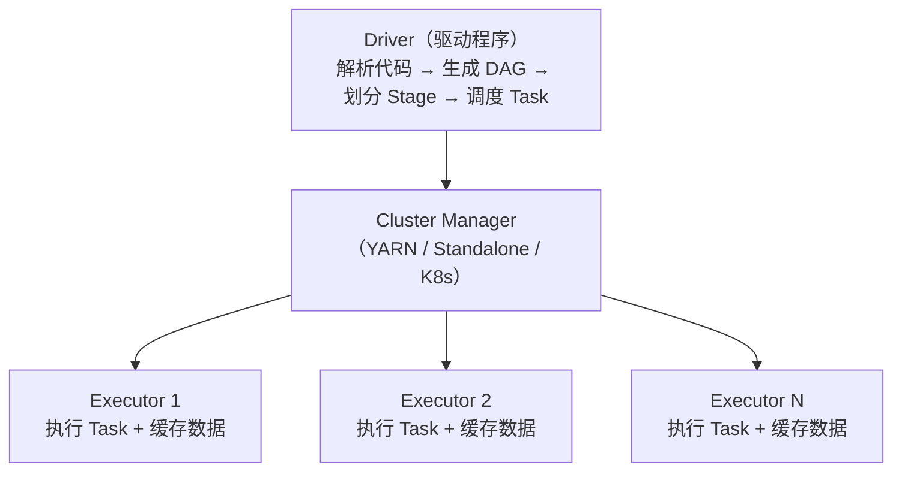

# 6.4 Spark——内存计算引擎

> **一句话定位**：Spark 是 MapReduce 的替代者——同样做分布式批处理，但把中间结果放内存而非磁盘，快 10-100 倍。同时它还统一了批处理（Spark SQL）、流处理（Structured Streaming）、机器学习（MLlib）、图计算（GraphX）四大场景，是目前大数据批处理的事实标准。

---

## 一、为什么比 MapReduce 快？

MapReduce 的致命问题是**每个阶段的结果都要写磁盘**。一个复杂查询翻译成多轮 MapReduce，每轮的中间结果都落盘再读回来，IO 成本极高。

Spark 的核心改进是**内存计算**：把中间结果缓存在内存中，下一步直接从内存读，避免反复磁盘 IO。只有内存放不下时才溢写到磁盘。

```
MapReduce：Map → 写磁盘 → Reduce → 写磁盘 → Map → 写磁盘 → Reduce
Spark：    Map → 内存 → Reduce → 内存 → Map → 内存 → Reduce → 写磁盘
```

---

## 二、核心抽象——RDD

### 2.1 RDD 是什么

RDD（Resilient Distributed Dataset，弹性分布式数据集）是 Spark 最基础的数据抽象——一个**不可变的、分区的、可并行计算的**数据集合。

| 特性 | 含义 |
|------|------|
| **分布式** | 数据分散在集群的多个节点上 |
| **不可变** | RDD 创建后不能修改，每次操作生成新 RDD |
| **弹性容错** | 通过 **血缘（Lineage）** 记录转换链路，丢失分区可以从上游重算恢复 |
| **惰性求值** | Transformation 只构建执行计划，遇到 Action 才真正执行 |

### 2.2 Transformation vs Action

| 类型 | 做什么 | 是否触发计算 | 常见操作 |
|------|--------|------------|---------|
| **Transformation** | 从一个 RDD 生成新 RDD | 不触发（惰性） | `map`、`filter`、`flatMap`、`groupByKey`、`reduceByKey`、`join` |
| **Action** | 返回结果给 Driver 或写存储 | **触发计算** | `collect`、`count`、`reduce`、`saveAsTextFile`、`foreach` |

> 这和 Java Stream 的惰性求值是同一个思路（详见 [3.16 Java 8+ 新特性](../part3-java-deep/16-Java8+新特性.md)）。

### 2.3 宽依赖 vs 窄依赖

| 类型 | 定义 | 是否产生 Shuffle | 示例 |
|------|------|-----------------|------|
| **窄依赖** | 父 RDD 的每个分区只被子 RDD 的一个分区使用 | 否 | `map`、`filter`、`union` |
| **宽依赖** | 父 RDD 的一个分区被子 RDD 的多个分区使用 | **是** | `groupByKey`、`reduceByKey`、`join` |

**Shuffle 是 Spark 最昂贵的操作**——数据要通过网络在节点间重新分配（类似 MapReduce 的 Shuffle 阶段）。宽依赖触发 Shuffle，也触发 Stage 的划分。

---

## 三、执行架构



| 组件 | 职责 |
|------|------|
| **Driver** | 运行用户代码的 main 方法，创建 SparkContext，生成执行计划（DAG），划分 Stage 和 Task |
| **Executor** | 集群节点上的 JVM 进程，负责执行 Task 和缓存 RDD 数据 |
| **Task** | 最小执行单元，一个 Task 处理一个 RDD 分区 |

### 3.1 Job → Stage → Task 的划分

```
Job：    一个 Action 触发一个 Job
Stage：  以 Shuffle 为边界划分（宽依赖切分 Stage）
Task：   一个 Stage 内，每个分区对应一个 Task
```

---

## 四、Spark SQL——最常用的模块

Spark SQL 是在 RDD 之上封装的结构化数据处理接口，提供 DataFrame / Dataset API 和标准 SQL 语法。

```python
# DataFrame API（Python）
df = spark.read.parquet("/data/orders")
result = df.filter(df.amount > 1000) \
           .groupBy("user_id") \
           .agg({"amount": "sum"}) \
           .orderBy("sum(amount)", ascending=False)

# 等价 SQL
spark.sql("""
    SELECT user_id, SUM(amount) as total
    FROM orders
    WHERE amount > 1000
    GROUP BY user_id
    ORDER BY total DESC
""")
```

**Catalyst 优化器**：Spark SQL 的查询会经过 Catalyst 优化器（逻辑优化 → 物理优化），类似 MySQL 的查询优化器。它能自动做谓词下推（把 WHERE 条件推到数据源层过滤）、列裁剪、Join 策略选择等优化。

---

## 五、性能优化要点

### 5.1 优化清单

```
① 避免不必要的 Shuffle：用 reduceByKey 而非 groupByKey
② 合理设置分区数：spark.sql.shuffle.partitions（默认 200，按数据量调整）
③ 缓存热数据：对多次使用的 RDD/DataFrame 做 cache() / persist()
④ 使用 Broadcast Join：小表广播到各 Executor，避免 Shuffle
⑤ 数据倾斜处理：加盐打散 → 两阶段聚合
⑥ 使用列式存储：读 Parquet/ORC 比 TextFile 快数倍
⑦ Kryo 序列化：比默认 Java 序列化快 10 倍，体积小 5 倍
```

### 5.2 reduceByKey vs groupByKey

```
groupByKey：先 Shuffle 所有数据到相同 key 的分区，再聚合
  → 全量数据过网络，内存压力大

reduceByKey：先在各分区内局部聚合（combine），再 Shuffle 聚合后的结果
  → 过网络的数据量大幅减少
```

> **经验法则**：能用 `reduceByKey` / `aggregateByKey` 就不用 `groupByKey`。

---

## 六、面试深度剖析

### 考点 1：Spark 比 MapReduce 快在哪

> **面试官**：「Spark 为什么比 MapReduce 快？」

三个层面：内存计算（中间结果不落盘）；DAG 执行引擎（多轮计算合并为一个 DAG，减少启动开销）；Catalyst 查询优化器（SQL 层面的自动优化）。但如果数据大到内存放不下，Spark 也会溢写磁盘，和 MapReduce 差距会缩小。

### 考点 2：RDD 怎么容错

> **面试官**：「Spark RDD 某个分区丢失了怎么办？」

通过血缘（Lineage）重算。每个 RDD 记录了它是从哪个 RDD 通过什么 Transformation 得来的，丢失分区时只需要从最近的可用上游分区重算，不需要重跑整个任务。如果血缘链太长，可以用 `checkpoint()` 把 RDD 持久化到 HDFS，截断血缘。

### 考点 3：Shuffle 为什么慢

> **面试官**：「Spark 的 Shuffle 具体做了什么？」

Shuffle 分两个阶段：**Shuffle Write**（Map 端把数据按 key 的 hash 写到本地磁盘的分区文件）和 **Shuffle Read**（Reduce 端通过网络拉取各个 Map 端对应分区的数据）。涉及磁盘 IO（序列化+写文件）+ 网络传输 + 反序列化，是 Spark 中最昂贵的操作。

### 考点 4：数据倾斜怎么处理

> **面试官**：「Spark 任务跑了很久，发现只有一个 Task 卡住，怎么办？」

和 Hive 数据倾斜的排查思路一样（详见 [6.3 Hive](./03-Hive.md)）：先定位哪个 key 数据量异常大（Spark UI 看 Task 的 Shuffle Read 量），然后用加盐两阶段聚合、Broadcast Join（小表广播）、自定义 Partitioner 等手段打散。

---

[← 6.3 Hive](./03-Hive.md) | [返回本章目录](./README.md) | [6.5 Flink →](./05-Flink.md)
