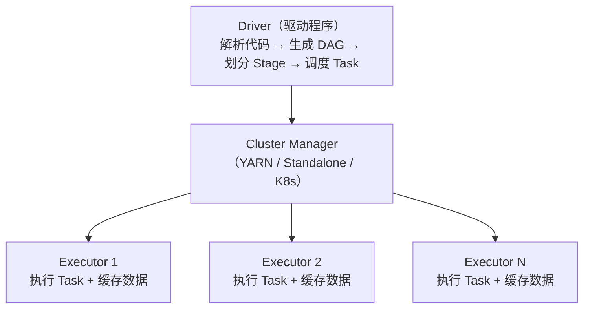
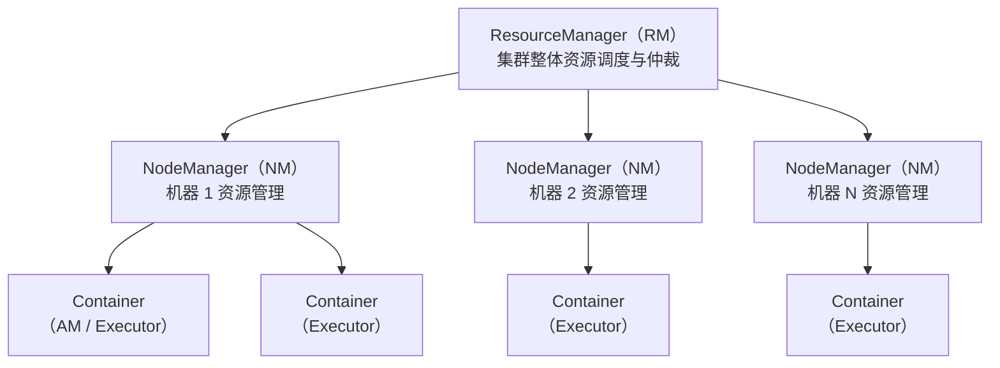

# 6.4 Spark——内存计算引擎

> **一句话定位**：Spark 是 MapReduce 的替代者——同样做分布式批处理，但把中间结果放内存而非磁盘，快 10-100 倍。同时它还统一了批处理（Spark SQL）、流处理（Structured Streaming）、机器学习（MLlib）、图计算（GraphX）四大场景，是目前大数据批处理的事实标准。

---

## 一、为什么比 MapReduce 快？

MapReduce 的致命问题是**每个阶段的结果都要写磁盘**。一个复杂查询翻译成多轮 MapReduce，每轮的中间结果都落盘再读回来，IO 成本极高。

Spark 的核心改进是**内存计算**：把中间结果缓存在内存中，下一步直接从内存读，避免反复磁盘 IO。只有内存放不下时才溢写到磁盘。

```
MapReduce：Map → 写磁盘 → Reduce → 写磁盘 → Map → 写磁盘 → Reduce
Spark：    Map → 内存 → Reduce → 内存 → Map → 内存 → Reduce → 写磁盘
```

---

## 二、核心抽象——RDD

### 2.1 RDD 是什么

RDD（Resilient Distributed Dataset，弹性分布式数据集）是 Spark 最基础的数据抽象——一个**不可变的、分区的、可并行计算的**数据集合。

| 特性 | 含义 |
|------|------|
| **分布式** | 数据分散在集群的多个节点上 |
| **不可变** | RDD 创建后不能修改，每次操作生成新 RDD |
| **弹性容错** | 通过 **血缘（Lineage）** 记录转换链路，丢失分区可以从上游重算恢复 |
| **惰性求值** | Transformation 只构建执行计划，遇到 Action 才真正执行 |

### 2.2 Transformation vs Action

| 类型 | 做什么 | 是否触发计算 | 常见操作 |
|------|--------|------------|---------|
| **Transformation** | 从一个 RDD 生成新 RDD | 不触发（惰性） | `map`、`filter`、`flatMap`、`groupByKey`、`reduceByKey`、`join` |
| **Action** | 返回结果给 Driver 或写存储 | **触发计算** | `collect`、`count`、`reduce`、`saveAsTextFile`、`foreach` |

> 这和 Java Stream 的惰性求值是同一个思路（详见 [3.16 Java 8+ 新特性](../part3-java-deep/16-Java8+新特性.md)）。

#### Action 的两种归宿：回 Driver 还是写存储

Action 分为两大类，区别在于计算结果去哪里：

```
① 返回结果给 Driver（数据回收到 Driver 进程的内存中）
   collect()        → 把所有数据拉回 Driver（最危险，容易 OOM）
   count()          → 返回一个 Long 数字（极轻量）
   take(n)          → 返回前 n 条（有上限，相对安全）
   first()          → 返回第一条（等价于 take(1)）
   reduce()         → 返回一个聚合后的单一值（极轻量）
   aggregate()      → 返回一个聚合后的单一值
   countByKey()     → 返回 Map[K, Long]（key 多时也不小）
   top(n)           → 返回最大的 n 条（有上限）
   collectAsMap()   → 返回 Map[K, V]（数据多时危险）

② 写到外部存储 / 副作用（不回 Driver）
   saveAsTextFile()       → 写 HDFS/S3
   write.format().save()  → DataFrame API 写存储
   foreach()              → 对每条数据执行副作用（如写 MySQL）
   foreachPartition()     → 按分区执行副作用
```

#### 为什么 Action 的结果要返回给 Driver

理解这个问题的关键在于 Spark 的编程模型——**用户代码跑在 Driver 上，Executor 只是被派去干活的工人。**

```
你写的代码（在 Driver 上执行）：
  long total = rdd.count();        ← 这行代码在 Driver 上跑
  if (total > 10000) {              ← 这行也在 Driver 上跑
      rdd.filter(...).saveAsTextFile("/output");
  }

执行过程：
  Driver: "我需要 count，各 Executor 去数自己分区的行数"
  Executor 1: "我的分区有 3000 行"  ──→ 回传给 Driver
  Executor 2: "我的分区有 5000 行"  ──→ 回传给 Driver
  Executor 3: "我的分区有 4000 行"  ──→ 回传给 Driver
  Driver: 汇总 3000+5000+4000 = 12000，赋值给 total
  Driver: if (12000 > 10000) 成立，继续执行 filter + saveAsTextFile
```

每个 Executor 只看得到自己那一个分区的数据，没有任何一个 Executor 知道全局总数。只有 Driver 能把所有 Executor 的部分结果汇总成最终值。而你写的 `if (total > 10000)` 这样的判断逻辑是在 Driver 上跑的——Executor 不做决策，只执行被分配的 Task。

> **类比**：Driver 是项目经理，Executor 是流水线工人。项目经理说"帮我统计总产量"，每个工人只能报自己工位的产量，汇总和决策只能由项目经理完成。如果你不需要总产量这个数字，那就不要调用 `count()`——Action 的存在意义就是"Driver 需要这个结果"。

#### 交互式查询的结果流程

在 Spark Shell 或 Notebook（Jupyter / Zeppelin）中跑 Spark 时，**Shell 进程本身就是 Driver**。你在 Shell 里输入的每一行代码，都是 Driver 在执行：

```
你在 Spark Shell 输入: rdd.filter(_._2 > 100).collect()

→ Driver（Spark Shell 进程）解析这行代码，构建 DAG
→ Driver 把 Task 分发给各个 Executor
→ Executor 各自计算自己分区的过滤结果
→ Executor 把结果通过网络回传给 Driver
→ Driver（Spark Shell）收到数据，在终端打印出来给你看
```

所以结果不是"先到 Driver 再到 Shell"，而是 Driver 就是 Shell 本身。在生产环境中，Driver 通常是你提交的 `spark-submit` 应用进程。

#### 什么场景需要返回数据给 Driver

核心场景就一句话：**Spark 任务跑完后，Driver 需要拿到结果去做"Spark 之外的事"。**

```
场景 1：交互式查询看结果
  Spark Shell / Notebook 中分析数据，需要把结果显示给人看
  → collect() 或 show() 把数据拉回来打印
  ⚠ 生产环境绝不能对大结果集 collect()，会直接 Driver OOM

场景 2：聚合统计只需要一个数字
  count() 算总行数、reduce() 算总和，结果只有一个标量值
  → 回 Driver 完全没有压力，这是最安全的 Action

场景 3：拿结果做后续非 Spark 的决策
  Spark 算出各商品点击量，拉回 Driver 后用 Java 代码做排序、写缓存等
  ⚠ 更好的做法是直接在 Spark 里做完，或用 write 写到数据库

场景 4：收集小表用于广播
  先 collect() 一张小表到 Driver，再 broadcast() 到所有 Executor
  → 前提是小表真的小（通常 < 10MB）

场景 5：取少量样本调试
  take(n) 或 takeSample() 取几条数据看 schema、验证逻辑
  → 数据量有上限，安全
```

> **生产环境最佳实践**：能用 `write` 写存储就不用 `collect()` 回 Driver。数据量大时，结果直接写到 HDFS/S3/MySQL/Kafka，Driver 只负责提交任务和接收"成功/失败"的状态，不碰实际数据。Driver OOM 的头号原因就是 `collect()` 拉了过大结果集（详见 [性能优化专题 — OOM 排查](./04-Spark-性能优化.md#oom--spill-排查路径)）。

### 2.3 宽依赖 vs 窄依赖

| 类型 | 定义 | 是否产生 Shuffle | 示例 |
|------|------|-----------------|------|
| **窄依赖** | 父 RDD 的每个分区只被子 RDD 的一个分区使用 | 否 | `map`、`filter`、`union` |
| **宽依赖** | 父 RDD 的一个分区被子 RDD 的多个分区使用 | **是** | `groupByKey`、`reduceByKey`、`join` |

**Shuffle 是 Spark 最昂贵的操作**——很多人以为 Shuffle 慢是因为"网络传输太慢"，但网络只是四个原因之一。Shuffle 之所以昂贵，是因为它同时踩中了**四个性能地雷**：

```
① 磁盘 I/O（往往比网络更慢）
   Shuffle 数据不是直接从上游内存传到下游内存的——中间必须落盘
   上游 Executor 把数据写成本地磁盘文件（Shuffle Write）
   下游 Executor 再从这些文件里读取（Shuffle Read）
   磁盘读写是随机 I/O，尤其机械磁盘上极慢
   即使 SSD，大量小文件的随机读也远慢于顺序内存操作

② 网络传输
   数据要从上游节点通过网络传到下游节点，受带宽限制
   万兆网卡理论 10Gbps，但集群中多任务竞争带宽，单任务分到的更少
   传输的是序列化后的二进制字节流，不是原始内存对象

③ 序列化 / 反序列化开销
   内存中的 Java 对象不能直接传输，必须序列化成字节流
   （Spark 默认用 Java 序列化或 Kryo）
   到下游再反序列化回对象——CPU 密集型操作
   数据量大时，序列化本身消耗大量 CPU 时间

④ 同步屏障——最容易被忽视但影响最大
   Shuffle 是 Stage 的边界，上游 Stage 的所有 Task 必须全部完成
   下游 Stage 的 Task 才能开始，打破了流水线
```

其中第 4 点——同步屏障——是 Shuffle 和普通 Transformation 最本质的区别：

```
无 Shuffle 时（流水线执行，窄依赖）：
  Task 1: [map → filter → map] → 完成，Task 2 立即开始
  Executor 可以连续处理，不用等任何人，数据全程在内存中流式传递

有 Shuffle 时（屏障等待，宽依赖）：
  Stage 1: Task 1 ✓  Task 2 ✓  Task 3 ✓ ... Task 200 ✓  ← 必须全部完成！
              ↓↓↓ 等待屏障（最慢的 Task 决定等待时间）↓↓↓
  Stage 2: Task 1 开始  Task 2 开始 ...

  如果 199 个 Task 都在 1 分钟内完成，但 Task 200 跑了 10 分钟（数据倾斜）
  整个 Stage 2 都要等 10 分钟才能启动
  → 这就是为什么数据倾斜对 Shuffle 的伤害特别大
```

Shuffle 数据落盘的完整流程：

```
Executor 1: [处理数据] → 序列化 → 写本地磁盘文件（Shuffle Write）
Executor 2: [处理数据] → 序列化 → 写本地磁盘文件
Executor 3: [处理数据] → 序列化 → 写本地磁盘文件
                    ↓ 网络传输（拉取远程文件）
Executor 4: 读磁盘文件 → 反序列化 → [继续处理]（Shuffle Read）
Executor 5: 读磁盘文件 → 反序列化 → [继续处理]
Executor 6: 读磁盘文件 → 反序列化 → [继续处理]
```

> **类比**：窄依赖就像流水线——上一步做完直接递给下一步，全程在内存里。Shuffle 就像工厂之间的物流——产品要先打包（序列化）、装车（写磁盘）、运输（网络）、卸货（读磁盘）、拆包（反序列化），而且必须等上一家工厂的货全部到齐才能开工（同步屏障）。

宽依赖触发 Shuffle，也触发 Stage 的划分。

---

## 三、执行架构



| 组件 | 职责 |
|------|------|
| **Driver** | 运行用户代码的 main 方法，创建 SparkContext，生成执行计划（DAG），划分 Stage 和 Task |
| **Executor** | 集群节点上的 JVM 进程，负责执行 Task 和缓存 RDD 数据 |
| **Task** | 最小执行单元，一个 Task 处理一个 RDD 分区 |

### 3.1 部署模式与提交流程

Driver 和 Executor 本质上都是 JVM 进程，不关心运行在哪里——只要能启动 Java 进程、能互相通信即可。根据它们运行位置的不同，Spark 支持多种部署模式。

#### 四种部署模式

```
Local（本地模式）
  Driver 和 Executor 运行在同一个 JVM 进程中
  只启动 1 个 Executor，通过多线程模拟并行
  → 开发测试用，Spark Shell / Notebook 默认就是 Local

Spark Standalone（独立集群）
  Spark 自带的资源管理器，由 Master + Worker 组成
  Master 负责资源分配，Worker 负责在本机启动/停止 Executor
  → 轻量级，适合小团队快速搭集群，但资源隔离弱（无 cgroup）

YARN（Hadoop 集群）
  借用 Hadoop YARN 做资源管理，Spark 和 Hadoop 生态共享集群
  → 生产环境最常用，资源隔离强（cgroup），多框架共享资源

Kubernetes（云原生）
  Driver 和 Executor 运行在 K8s Pod 中
  → 云原生趋势，适合容器化部署，Spark 3.x 后逐渐成熟
```

| 维度 | Local | Standalone | YARN | K8s |
|------|-------|-----------|------|-----|
| **资源管理** | 无 | Master/Worker | YARN ResourceManager/NodeManager | K8s Scheduler |
| **资源隔离** | 无 | OS 进程级（弱） | cgroup（强） | Pod 级（强） |
| **多框架共享** | 不支持 | 仅 Spark | Spark/Flink/Hadoop 共享 | 任意容器化应用 |
| **适用场景** | 开发测试 | 小团队快速搭建 | 生产环境主流 | 云原生部署 |
| **Driver 位置** | 本地 JVM | 可选 client/cluster | 可选 client/cluster | 主要 cluster |

> **为什么生产环境通常用 YARN 而不是 Standalone？** 三个原因：一是 YARN 是通用资源管理器，Spark、Flink、Hadoop MapReduce 可以共享同一批机器，白天跑 Spark 分析、晚上跑 Flink 实时任务；二是 YARN 用 cgroup 做资源隔离，一个 Executor OOM 不影响其他 Executor，Standalone 只有 OS 进程级隔离；三是 YARN 有完善的队列和优先级调度，可以按部门/项目分配资源配额，Standalone 的调度能力较弱。

#### Client vs Cluster 模式

不管用哪种集群，Driver 可以运行在两个地方——这就是 client 模式和 cluster 模式的区别：

```
Client 模式：Driver 运行在提交任务的机器上
  你在机器 A 上执行 spark-submit → Driver 进程在机器 A 上启动
  → 机器 A 必须一直在线，关机/断网 = 任务挂
  → 日志直接在机器 A 的终端输出，方便调试
  → Spark Shell / Notebook 天然是 client 模式

Cluster 模式：Driver 运行在集群内部
  你在机器 A 上执行 spark-submit → 机器 A 只负责"提交"
  → Driver 进程被调度到集群中的某个节点上运行
  → 提交后机器 A 可以关机，任务不受影响
  → 日志要去集群内部查看（YARN 的 ApplicationMaster 日志）
  → 生产环境的定时任务必须用 cluster 模式
```

| 维度 | Client 模式 | Cluster 模式 |
|------|------------|-------------|
| **Driver 位置** | 提交任务的机器上 | 集群内部某个节点 |
| **提交机器是否需要在线** | 是（关机任务就挂） | 否（提交后可以关机） |
| **日志查看** | 直接在终端看 | 去集群内部看（yarn logs） |
| **适用场景** | 交互式分析、开发调试 | 生产定时任务、长时间运行作业 |
| **Spark Shell** | 天然 client（Shell 就是 Driver） | 不支持（Shell 需要交互） |

> **一句话记忆**：client 模式 Driver 在你手边（方便调试但机器不能关），cluster 模式 Driver 在集群里（机器能关但日志要去集群找）。生产环境定时任务必须用 cluster，因为提交任务的机器（如调度机）可能在任务执行期间重启。

#### spark-submit 提交流程

```bash
# 典型的 spark-submit 命令
spark-submit \
  --master yarn \                    # 资源管理器：yarn / spark://host:7077 / k8s://...
  --deploy-mode cluster \            # 部署模式：client / cluster
  --executor-memory 8G \             # 每个 Executor 内存
  --executor-cores 4 \               # 每个 Executor CPU 核数
  --num-executors 10 \               # Executor 数量
  --class com.example.MySparkApp \   # 主类
  my-app.jar \                       # 应用 JAR
  --input /data/input --output /data/output  # 应用参数
```

提交流程的完整链路（以 YARN Cluster 模式为例）：

```
① spark-submit 提交任务
   → 在提交机器上启动一个临时进程
   → 向 YARN ResourceManager 申请 ApplicationMaster 资源

② YARN 分配 Container，启动 ApplicationMaster（就是 Driver）
   → Driver 运行在集群内部某个 NodeManager 上
   → 提交机器上的临时进程退出，不再参与

③ Driver 初始化 SparkContext
   → 向 YARN ResourceManager 申请 Executor 资源
   → "我需要 10 个 Container，每个 4 核 8GB"

④ YARN 在各 NodeManager 上分配 Container，启动 Executor JVM
   → Executor 启动后，反向注册到 Driver
   → "我是 Executor 1，我有 4 个 slot，随时可以接活"

⑤ Driver 开始调度 Task
   → 根据 DAG 划分 Stage，生成 Task
   → 将 Task 分发给已注册的 Executor 执行
   → Task 完成后 Executor 汇报结果，Driver 分发下一批

⑥ Application 结束
   → Driver 向 YARN 注销，所有 Executor 被关闭，Container 释放
```

> **不同集群的差异仅在步骤 ① ~ ④**——向谁申请资源、在哪里启动 Driver/Executor。步骤 ⑤ 之后的 Task 调度和执行完全一样，这就是 Spark 跨集群可移植的原因：通过 SchedulerBackend 接口的不同实现类适配不同集群管理器，上层执行逻辑不变。

### 3.2 Job → Stage → Task 的划分

```
包含关系：1 Job ⊃ 若干 Stage ⊃ 若干 Task

Job：     一个 Action 触发一个 Job
            例：collect()、count()、saveAsTextFile() 各触发一个 Job
Stage：   以 Shuffle 为边界划分（宽依赖切分 Stage）
            例：map → filter → reduceByKey → filter → collect()
                Stage 0: map → filter → reduceByKey（Shuffle 前）
                Stage 1: filter → collect（Shuffle 后）
Task：    一个 Stage 内，RDD 的每个数据分区对应一个 Task
            例：RDD 有 200 个分区 → 这个 Stage 生成 200 个 Task
                Task 1 处理分区 0 的数据，Task 2 处理分区 1 的数据 ...
```

> **分区是谁的？** 这里的"分区"是 **RDD / DataFrame 的数据分区**，不是 Stage 自己拥有的分区。Stage 是执行计划的概念，分区是数据的概念——数据被切成 N 份（N 个分区），Stage 就生成 N 个 Task，每个 Task 处理其中 1 份。分区数量由 `numPartitions` 参数、Shuffle 后的分区数、或 `repartition()` 决定，跟 Stage 本身无关。

#### 一个 Stage 内有多个 RDD，Task 怎么划分

一个 Stage 内的多个 RDD 通过窄依赖串联（map、filter 等），形成一条流水线。窄依赖保证父子 RDD 分区一一对应，所以 Spark 只看**最后一个 RDD（最终 RDD）的分区数**来决定 Task 数——中间 RDD 的分区数不影响：

```
Stage 0 内的流水线（窄依赖，不产生 Shuffle）：
  RDD_A (3 分区) → map → RDD_B (3 分区) → filter → RDD_C (3 分区)

  窄依赖：父分区 1 → 子分区 1，一一对应，不改变分区数
  所以 RDD_A、RDD_B、RDD_C 都是 3 个分区

  → 生成 3 个 Task：
    Task 1: 读 RDD_A 分区 0 → map → RDD_B 分区 0 → filter → RDD_C 分区 0
    Task 2: 读 RDD_A 分区 1 → map → RDD_B 分区 1 → filter → RDD_C 分区 1
    Task 3: 读 RDD_A 分区 2 → map → RDD_B 分区 2 → filter → RDD_C 分区 2

  每个 Task 内部是一条流水线，数据在内存中依次流过 map → filter，不落盘
  Task 不需要知道上游 RDD 有几个分区——它只拿自己对应的那一份
```

> **类比**：Stage 内的多个 RDD 就像工厂流水线上的多道工序——原材料进来，经过切割（map）、质检（filter）、包装（map），全程在同一条传送带上，不需要中途换车间。Task 就是这条传送线上的一名工人，只负责自己那段材料。

#### 分区 → Task → Executor 的对应关系

```
分区 → Task：    一对一（一个 Task 处理一个分区）
Task → Executor：多对一（一个 Executor 同时运行多个 Task，受核数限制）
Executor → 分区：多对多（一个 Executor 可以持有多个分区的数据）

具体例子：
  集群有 5 个 Executor，每个 Executor 4 个核
  RDD 有 200 个分区
  → 生成 200 个 Task
  → 同时运行 5 × 4 = 20 个 Task（并行度 = 20）
  → 剩余 180 个 Task 排队，前面的完成一批就调度下一批
  → 每个 Executor 同时跑 4 个 Task（每个核跑一个 Task）
  → 一个 Executor 可能持有多个分区的数据（缓存 + 正在处理）
```

> **关键**：分区数决定了 Task 数（并行度的上限），Executor 核数决定了同时能跑多少个 Task（实际并行度）。如果分区数远大于总核数，Task 会分批调度；如果分区数小于总核数，有些核会空闲——所以分区数通常建议设为总核数的 2-3 倍。

#### Executor、Task、Container 到底是什么——进程、线程还是资源配额

上面的描述用了"核"和"Executor"等概念，这里把它们的物理形态说清楚：

```
一个 Spark 应用的进程/线程结构（从外到内）：

YARN Container（资源隔离单位，cgroup 限制 CPU/内存）
  └── Executor（JVM 进程，就是 java -Xmx8G ... 启动的普通 JVM）
        ├── 核 0 / slot 0 → Task 线程 A（正在处理分区 0）
        ├── 核 1 / slot 1 → Task 线程 B（正在处理分区 1）
        ├── 核 2 / slot 2 → Task 线程 C（正在处理分区 2）
        ├── 核 3 / slot 3 → Task 线程 D（正在处理分区 3）
        └── 共享 JVM 堆内存（所有 Task 线程共用）
              ├── RDD 缓存数据
              ├── Shuffle 数据
              └── 广播变量等
```

各概念的物理形态：

| 概念 | 本质 | 生命周期 |
|------|------|---------|
| **Container** | YARN 的**资源配额**（不是进程），通过 cgroup 限制 CPU/内存 | 绑定 Executor |
| **Executor** | 一个 **JVM 进程**（`java -cp ...` 启动） | 绑定整个 Application |
| **Task** | Executor JVM 内的一个**线程** | 秒到分钟级，完成即销毁 |
| **slot / core** | **逻辑概念**，表示"能同时跑几个 Task"的配额 | 随 Executor 存在 |

#### 四个常见疑问——逐个说清楚

**Q1：Executor 是什么？**

Executor 是一个实实在在的 **JVM 进程**，就是通过 `java -cp ... -Xmx8G ...` 启动的普通 Java 进程。它不是虚拟容器、不是线程、不是抽象概念——你用 `jps` 命令能在进程列表里看到它，用 `top` 能看到它占用的 CPU 和内存。在 YARN 模式下，YARN NodeManager 在物理机上启动这个 JVM 进程并把它关进 cgroup 里做资源限制。

**Q2：Task 是进程还是线程？**

Task 是 Executor JVM 进程内的一个**线程**，不是独立进程。这是 Spark 和 MapReduce 最大的架构差异——MapReduce 每个 Task 启动一个独立 JVM 进程，启动开销几秒钟，短任务甚至启动比计算还慢。Spark 让 Executor 常驻、Task 以线程方式运行，启动几乎零开销，而且同一个 Executor 内的 Task 共享 JVM 堆内存，RDD 缓存可以被复用，不用每个 Task 重新加载。

**Q3：核跟 Task 是一对一吗？**

是的。这里的"核"是 `spark.executor.cores` 配置的逻辑 slot，不是物理 CPU 核。一个 Executor 配了 4 个 core 就有 4 个 slot，可以同时跑 4 个 Task 线程。每个 slot 同一时刻只跑一个 Task，Task 完成后 slot 空出来给下一个排队的 Task。注意 4 个 Task 线程是并发执行（分到不同物理核的时间片），不是并行（不绑定物理核）。

**Q4：核跟进程是一对一吗？**

不是。一个 Executor（进程）可以有多个核。`spark.executor.cores=4` 表示一个 JVM 进程有 4 个逻辑 slot，可以同时跑 4 个 Task 线程。核是进程内部的并发配额，不是进程数。

**Executor 的生命周期**：Executor 绑定整个 Spark Application，不绑定某一批 Task。一批 Task 跑完后 Executor 不关闭，而是向 Driver 汇报"我空闲了"，Driver 继续分配下一批 Task。只有三种情况 Executor 会结束：Application 正常完成、被 kill、或因 OOM/心跳超时被 Driver 移除。

```
Application 生命周期内的时间线：

Driver 启动 → 向资源管理器申请 Executor
  → Executor 1 启动（JVM 进程，一直活着）
  → Executor 2 启动（JVM 进程，一直活着）
  → Executor 3 启动（JVM 进程，一直活着）

  Stage 0: Executor 1 跑 Task A,B,C,D
    → Task 完成 → Executor 不关闭，汇报"我空了"
  Stage 1: Executor 1 跑 Task E,F,G,H（复用同一个 JVM）
    → Task 完成 → 继续等待
  ...
  Application 结束 → 所有 Executor 关闭
```

**一台物理机上多个 Executor 的隔离**：在 YARN 模式下，每个 Executor 运行在独立的 YARN Container 中，YARN 用 cgroup 限制每个 Container 的 CPU 和内存——同一台物理机上的两个 Executor 互相隔离，CPU 时间片按配额分配，内存不能越界。Standalone 模式下隔离较弱，主要靠操作系统进程级隔离，没有 cgroup 级别的资源硬限制。

> **cgroup 是什么？** cgroup 是 Linux 内核的资源隔离机制，通过虚拟文件系统（`/sys/fs/cgroup/`）配置，写入数字就能限制进程的 CPU/内存/磁盘 I/O。它不是 shell 命令也不是进程监控，而是 VFS 回调机制——写文件时内核直接修改调度参数，立刻生效。cgroup 限制的是整个进程的物理内存，和 JVM 的 `-Xmx`（只管堆内存）是两层不同的限制。完整原理（VFS 回调机制、权限模型、内核执行方式、与 Docker/YARN 的关系）详见 **[附录 A8 · Linux 操作系统基础](../part3-java-deep/A8-Linux操作系统基础.md)**。

**slot 是 Spark 的概念吗？** 严格来说 slot 是 YARN/Mesos 的概念。Spark 自己的概念是 `spark.executor.cores`，表示一个 Executor 能同时运行多少个 Task。在 YARN 部署模式下，YARN 给 Container 分配的 vcore 数对应 Spark 的 executor.cores，两个概念在实际使用中经常混用：

```
概念对应关系：

YARN 层：       Container（vcore=4, memory=8GB）
                           ↓ 启动
Spark 层：      Executor（executor.cores=4, executor.memory=8GB）
                           ↓ 分配
Task 层：       4 个 task slot，同时跑 4 个 Task 线程

OS 层：         1 个 JVM 进程，4 个工作线程，受 cgroup 约束
```

> **一个 slot 对应一个物理核吗？** 不对应。slot 是逻辑概念，对应 vcore（虚拟核），vcore 和物理核没有绑定关系。一台 32 物理核的机器，YARN 可以配 40 个 vcore（超分）或 16 个 vcore（欠分）。Task 线程跑在哪个物理核上由操作系统调度器决定，Spark 和 YARN 都不关心。

### 3.3 YARN 资源管理架构——Spark 运行的底层基础设施

上面多次提到 YARN 的 Container、ResourceManager 等概念，这里把 YARN 的完整架构说清楚。理解 YARN 是排查 Spark 作业资源问题和日志问题的前提。



| 组件 | 职责 | 类比 |
|------|------|------|
| **ResourceManager（RM）** | 集群整体资源调度与仲裁，决定哪个 Application 拿到多少资源 | 公司的 HR 总监——管全公司的人头预算 |
| **NodeManager（NM）** | 每台机器一个，负责本机资源管理（分配/隔离），启动和监控 Container | 各部门行政——管本部门工位分配 |
| **Container** | 资源容器（CPU + 内存配额），所有作业进程都运行在 Container 中 | 工位——规定了几个人、多大空间 |
| **ApplicationMaster（AM）** | 每个 Application 一个，负责与 YARN 通信申请资源、管理作业流程 | 项目经理——向 HR 要人、分配任务 |

从 YARN 的角度看，一个 Spark 作业就是一个 Application。Spark 的 Driver 和 Executor 都运行在 YARN 分配的 Container 中。在 yarn-cluster 模式下，Driver 与 AM 运行在同一个 Container 中；在 yarn-client 模式下，Driver 在提交机器上，只有 Executor 运行在 Container 中。

> **关键理解**：Container 不是进程，而是 YARN 的资源隔离单位（通过 cgroup 限制 CPU/内存）。YARN 在 Container 内启动 JVM 进程（Executor 或 AM），Container 提供资源边界，JVM 在边界内运行。一个物理机上可以同时运行多个 Container（多个 Executor），它们通过 cgroup 互相隔离。

---

## 四、Spark SQL——最常用的模块

Spark SQL 是在 RDD 之上封装的结构化数据处理接口，提供 DataFrame / Dataset API 和标准 SQL 语法。

### 4.1 RDD vs DataFrame vs Dataset——三层 API 的区别与选型

Spark 有三层 API，从底到高分别是 RDD、DataFrame、Dataset。理解它们的区别是选型的基础：

```
三层 API 的演进：

RDD（Spark 1.0）          → 最底层，面向对象，无 Schema
  ↓ 加上 Schema + 优化器
DataFrame（Spark 1.3）     → 结构化数据，有 Schema，有 Catalyst 优化
  ↓ 加上强类型
Dataset（Spark 1.6）       = DataFrame + 强类型（Scala/Java 专属）
```

| 维度 | RDD | DataFrame | Dataset |
|------|-----|-----------|---------|
| **数据类型** | Java/Python 对象，无 Schema | Row 对象，有 Schema（列名+类型） | 强类型对象（Case Class），有 Schema |
| **类型安全** | 编译时检查 | 运行时检查（列名写错到运行才报错） | 编译时检查（Scala/Java） |
| **优化器** | 无，开发者自己负责 | **Catalyst 优化器**（自动谓词下推、列裁剪等） | Catalyst 优化器 |
| **序列化** | Java/Kryo 序列化整个对象 | **Tungsten 二进制格式**（堆外内存，极高效） | Tungsten 二进制格式 |
| **语言支持** | Scala/Java/Python/R | Scala/Java/Python/R | **仅 Scala/Java**（Python 不支持） |
| **API 风格** | 函数式（map/filter/reduce） | SQL 风格（select/where/agg） | 两者混合 |
| **性能** | 最低（无优化） | **最高**（Catalyst + Tungsten） | 高（和 DataFrame 接近） |

> **DataFrame 和 Dataset 的关系**：在 Scala/Java 中，`DataFrame` 就是 `Dataset[Row]` 的类型别名——Dataset 是通用版本，DataFrame 是 Dataset 的一个特例（每行是弱类型的 Row）。Python 只有 DataFrame，没有 Dataset。

**什么场景选什么：**

```
选 RDD：
  ① 处理非结构化数据（纯文本、二进制流、自定义解析逻辑）
  ② 需要精确控制底层分区和 Shuffle（如自定义 Partitioner）
  ③ 需要复用旧的 RDD 代码，不想迁移
  → 本质：RDD 是"手动挡"，你什么都要自己管，但什么都能控制

选 DataFrame：
  ① 结构化数据分析（有明确列和类型的数据）——这是 90% 的场景
  ② 写 SQL 或类 SQL 的链式 API
  ③ 用 Python / R 开发（这两个语言只有 DataFrame，没有 Dataset）
  ④ 追求最佳性能（Catalyst + Tungsten 自动优化）
  → 本质：DataFrame 是"自动挡"，Catalyst 帮你优化，你专注业务逻辑

选 Dataset（仅 Scala/Java）：
  ① 需要编译时类型安全（列名拼错在编译阶段就报错，不用等到运行）
  ② 数据处理逻辑复杂，用对象操作比用 Row 取列更清晰
  ③ 对性能有要求但又不放弃类型安全
  → 本质：Dataset 是"手自一体"，既有 DataFrame 的优化，又有 RDD 的类型安全
```

> **实际项目中的建议**：绝大多数场景用 DataFrame（或直接写 SQL）。只有遇到非结构化数据或需要精细控制分区时才退回 RDD。Dataset 在 Scala 项目中可以替代 DataFrame 获得类型安全，但 Python 项目没得选。

#### 为什么 Dataset 性能比 DataFrame 低——lambda 反序列化陷阱

对比表里写的是 DataFrame "最高"、Dataset "高（接近）"，这个"接近"而非"等于"的差距来自一个核心问题：**Dataset 的强类型操作会打破 Tungsten 的优化闭环**。

```
DataFrame 全流程（Tungsten 优化闭环）：
  二进制格式 → filter（生成的代码直接操作二进制）→ select → 输出
  数据全程以 Tungsten 二进制格式在内存中传递，不反序列化成 Java 对象

Dataset 使用 SQL 风格 API（和 DataFrame 一样快）：
  dataset.filter($"age" > 18).select($"name")   ← 等价于 DataFrame，无开销

Dataset 使用 lambda 风格 API（性能下降）：
  dataset.filter(p => p.age > 18).map(p => p.name)
                    ↑              ↑
                    这两个 lambda 对 Catalyst 是黑盒！

  执行过程：
  二进制格式 → 反序列化成 Person 对象 → 执行 lambda → 序列化回二进制格式
               ↑ overhead              ↑ 黑盒        ↑ overhead
```

| API 风格 | Catalyst 能否优化 | 反序列化开销 | 性能 |
|---------|-----------------|------------|------|
| DataFrame / Dataset SQL 风格（`$"age" > 18`） | 能 | 无 | 最高 |
| Dataset lambda 风格（`p => p.age > 18`） | **不能**（lambda 是黑盒） | 每条记录都要 | 下降 |
| RDD（`map` / `filter`） | 不能 | 全程都是对象 | 最低 |

> **本质**：DataFrame 的 `filter($"age" > 18)` 是声明式的——你告诉 Catalyst "我要 age > 18"，它来决定怎么执行。Dataset 的 `filter(p => p.age > 18)` 是命令式的——你告诉 Catalyst "执行这段代码"，它不知道代码里在做什么，无法优化，只能老老实实反序列化出对象、执行你的 lambda、再序列化回去。

#### Tungsten 是什么——Spark 的性能引擎

Tungsten 是 Spark 1.5（2015 年）启动的性能优化项目（Project Tungsten），名字来自钨（Tungsten）——最硬的金属，寓意"极致性能"。它的核心思想是：**把 Spark 的内存管理从 JVM 手中接管过来，绕过 GC 和 Java 对象的开销**。

```
Tungsten 的三大支柱：

① 堆外内存管理（Off-Heap Memory）
   不在 JVM 堆里分配内存，而是直接用 Unsafe API 向操作系统申请
   → 不受 GC 管理，没有 GC 停顿
   → 没有 Java 对象头开销（每个 Java 对象有 12-16 字节头）
   → 内存可以精确控制释放，不依赖 GC 回收

② 二进制行格式（Unsafe Row）
   把一整行数据序列化为紧凑的字节数组
   → 一个 Person{name:String, age:Int} 在 Java 对象里占 ~40 字节
     （对象头 + 引用 + String 对象头 + char[] + int + 对齐填充）
   → 在 Tungsten 格式里只占 ~12 字节（4 字节长度 + 4 字节 String 偏移 + 4 字节 int）
   → 缓存友好：连续内存，CPU 缓存命中率高

③ 全阶段代码生成（Whole-Stage Code Generation，Spark 2.0）
   把多个算子（filter → map → agg）融合成一个编译好的 Java 函数
   → 消除虚方法调用（RDD 每条记录都要多态分发）
   → 消除中间数据结构（不需要在算子之间传递 Row 对象）
   → 类似于把解释执行变成编译执行
```

```
没有 Tungsten（RDD 模式）：
  每条记录：反序列化 → 调 filter.isMatch() → 调 map.call() → 调 agg.update()
  每一步都是虚方法调用 + 对象创建，CPU 分支预测失败率高

有 Tungsten（DataFrame 模式）：
  全阶段代码生成后：
  for (int i = 0; i < numRows; i++) {
      if (row.getInt(age_offset) > 18) {        // filter 被内联
          result.setString(row.getString(name_offset));  // map 被内联
          aggBuffer.add(row.getInt(age_offset));         // agg 被内联
      }
  }
  一个紧凑循环，没有虚方法调用，没有中间对象
```

> **版本时间线**：Tungsten 在 Spark 1.5 引入（堆外内存 + 二进制格式），Spark 2.0 引入全阶段代码生成（Whole-Stage CodeGen），Spark 3.0 进一步增强（AQE 运行时优化配合 Tungsten）。现在 Tungsten 是 Spark SQL 的默认执行引擎，无需手动开启。

#### Dataset 的编译时类型安全是怎么实现的

Dataset 通过 Scala 的 **Case Class + Encoder** 机制实现编译时类型安全：

```
① 定义 Case Class（编译时）
   case class Person(name: String, age: Int)

② 创建 Dataset（编译时，隐式 Encoder 被注入）
   val ds: Dataset[Person] = spark.read.json("people.json").as[Person]
                                                    ↑
                                          这里需要一个隐式 Encoder[Person]

③ Encoder 是什么（编译时通过宏生成）
   Encoder[Person] 在编译时通过 Scala 宏自动生成
   它告诉 Spark：Person 有两个字段，name 是 String（偏移 0），age 是 Int（偏移 4）
   → 本质是一个 Schema 描述器，但类型信息在编译时就确定了

④ 编译时类型检查
   ds.map(p => p.nme)   // ✗ 编译报错：Person 没有 nme 字段
   ds.map(p => p.name)  // ✓ 编译通过
   df.select("nme")     // 编译通过，运行时报错 AnalysisException

⑤ 运行时
   Encoder 知道如何在 Tungsten 二进制格式和 Person 对象之间转换
   → 这就是为什么 Dataset lambda 需要反序列化：Encoder 把二进制转成 Person 对象
```

对比 DataFrame 的类型安全：

| 维度 | DataFrame（`Dataset[Row]`） | Dataset（`Dataset[Person]`） |
|------|---------------------------|------------------------------|
| **字段访问** | `row.getAs[String]("name")` | `person.name` |
| **字段名拼错** | 编译通过，**运行时报错** | **编译报错** |
| **类型不匹配** | 编译通过，**运行时 ClassCastException** | **编译报错** |
| **底层原理** | 运行时反射 + Schema 查找 | 编译时宏生成 Encoder |

#### Row 取列 vs 对象操作——具体代码对比

选型建议里说"数据处理逻辑复杂，用对象操作比用 Row 取列更清晰"，下面是具体例子：

```scala
// 场景：从订单数据中，筛选有 VIP 优惠的商品，计算折后价（原价 × 折扣 - 优惠券）

// Case Class 定义
case class Order(orderId: String, items: Seq[Item], coupon: Double, isVip: Boolean)
case class Item(productId: String, name: String, price: Double, category: String)

// ===== DataFrame 写法（Row 操作，逻辑复杂时很痛苦）=====
val result = df
  .filter($"isVip" === true && $"coupon" > 0)
  .withColumn("discountedItems", explode(
    expr("filter(items, x -> x.price > 100 AND x.category != 'books')")
  ))
  .withColumn("finalPrice",
    $"discountedItems.price" * lit(0.8) - $"coupon" / size($"discountedItems")
  )
  .select($"orderId", $"discountedItems.name", $"finalPrice")
// 问题：字段名是字符串，IDE 不能自动补全，拼错只有运行时才发现
// 问题：嵌套结构操作需要用 expr / filter 函数，可读性差

// ===== Dataset 写法（对象操作，逻辑清晰）=====
val result = ds
  .filter(o => o.isVip && o.coupon > 0)           // 直接访问字段，编译时检查
  .flatMap { order =>
    val shareCoupon = order.coupon / order.items.size  // 提前算好每件分摊的优惠券
    order.items
      .filter(i => i.price > 100 && i.category != "books")  // 普通 Scala 集合操作
      .map(item => (order.orderId, item.name, item.price * 0.8 - shareCoupon))
  }
  .toDF("orderId", "productName", "finalPrice")
// 优势：字段名自动补全，拼错编译报错
// 优势：嵌套结构用普通 Scala 代码操作，逻辑一目了然
// 代价：filter 和 map 是 lambda，触发反序列化，性能比 DataFrame 写法低
```

> **选择建议**：如果数据处理逻辑简单（select / where / agg），用 DataFrame，性能最好。如果逻辑复杂（多层嵌套、条件判断、集合操作），用 Dataset 的 lambda 写法可读性好很多，性能损失在可接受范围内——特别是当你的瓶颈在 I/O（读 HDFS）而不是 CPU 时，lambda 的反序列化开销可能根本不是瓶颈。

```python
# DataFrame API（Python）
df = spark.read.parquet("/data/orders")
result = df.filter(df.amount > 1000) \
           .groupBy("user_id") \
           .agg({"amount": "sum"}) \
           .orderBy("sum(amount)", ascending=False)

# 等价 SQL
spark.sql("""
    SELECT user_id, SUM(amount) as total
    FROM orders
    WHERE amount > 1000
    GROUP BY user_id
    ORDER BY total DESC
""")
```

**Catalyst 优化器**：Spark SQL 的查询会经过 Catalyst 优化器（逻辑优化 → 物理优化），类似 MySQL 的查询优化器。它能在**部分场景下**自动做谓词下推、列裁剪、Join 策略选择等优化——但"自动"不等于"万能"。Catalyst 在 INNER JOIN 下表现良好（过滤条件写在 WHERE 还是 ON 里效果一样），但在**外连接（LEFT/RIGHT JOIN）场景下存在明显局限**：右表的过滤条件写在 WHERE 中不会被下推（因为下推会把 LEFT JOIN 变成 INNER JOIN，改变语义）。此外，分区字段被函数包裹、隐式类型转换、视图遮挡底层分区字段等情况，Catalyst 也无法自动处理。这些需要开发者手动优化的场景，详见 [性能优化专题 — 分区裁剪失效六大场景](./04-Spark-性能优化.md#61-减少数据量)。

---

## 五、Spark 版本演进与新特性

Spark 从 2014 年的 1.0 到如今的 3.x / 4.x，核心架构保持稳定（RDD + DAG + Catalyst），但每个大版本都引入了对性能和易用性有重大影响的新特性。面试中经常会问"你用的哪个版本、了解哪些新特性"，这里按影响从大到小梳理。

### 5.1 AQE——Adaptive Query Execution（Spark 3.0，最重要的新特性）

AQE 是 Spark 3.0 引入的**运行时自适应优化**——在查询执行过程中，根据已经产生的真实数据统计信息（而非编译期的估算），动态调整执行计划。

传统 Catalyst 优化器的问题是：它在**编译期**根据表的统计信息（行数、大小）决定执行计划，但统计信息经常不准（表没有 ANALYZE、分区被过滤后实际数据量远小于统计值）。AQE 把这个决策推迟到**运行时**——Shuffle 写完后，Spark 拿到了每个分区的真实数据量，再决定下一步怎么做。

AQE 包含三个核心能力：

```
① 自动合并小分区（Coalescing Post-Shuffle Partitions）
   Shuffle 后如果很多分区数据量很小（比如 1MB），AQE 自动合并成更大的分区
   → 减少 Task 数量，降低调度开销
   SET spark.sql.adaptive.coalescePartitions.enabled=true;

② 动态切换 JOIN 策略（Converting Sort-Merge Join to Broadcast Join）
   编译期估算小表 100MB 选了 SortMergeJoin，但运行时发现过滤后只有 5MB
   → AQE 自动切换为 BroadcastHashJoin，省掉一次 Shuffle
   SET spark.sql.adaptive.autoBroadcastJoinThreshold=100MB;

③ 自动处理倾斜 JOIN（Optimizing Skew Joins）
   Shuffle 后发现某个分区数据量远大于其他分区
   → AQE 自动把大分区拆成多个小分区，并行处理
   SET spark.sql.adaptive.skewJoin.enabled=true;
```

> **实际影响**：AQE 是 Spark 3.x 对 ETL 任务最大的性能提升——很多之前需要手动调 shuffle.partitions、手动加 Broadcast hint、手动处理数据倾斜的场景，开启 AQE 后 Spark 自己就能处理。Spark 3.2+ 默认开启 AQE。

### 5.2 Spark 3.x 其他关键改进

| 版本 | 特性 | 说明 |
|------|------|------|
| **3.0** | AQE | 运行时自适应优化（见上文） |
| **3.0** | Dynamic Partition Pruning（DPP） | 星型模型查询中，先扫描维度表获取过滤后的 Key 集合，再用这些 Key 裁剪事实表分区——解决了"维度表 WHERE 条件无法传递给事实表分区过滤"的痛点 |
| **3.1** | Shuffle Hash Join 改进 | 支持 Full Outer Join 的 Shuffle Hash Join，之前只能走 Sort Merge Join |
| **3.2** | AQE 默认开启 | `spark.sql.adaptive.enabled` 默认值从 false 变为 true |
| **3.2** | RocksDB State Store | Structured Streaming 状态存储从内存迁移到 RocksDB，支持更大状态 |
| **3.3** | Join Hint 增强 | 支持 `/*+ MERGE(t) */`、`/*+ SHUFFLE_HASH(t) */` 等细粒度 Join 策略提示 |
| **3.4** | Python UDF 性能提升 | Apache Arrow 批量数据传输，Python UDF 性能提升 2-5 倍 |
| **3.5** | CONNECT 协议 | 新增 Spark Connect 架构，客户端通过 gRPC 连接远端 Spark 集群，解耦客户端和服务端版本 |

### 5.3 Spark 4.x 前瞻

| 特性 | 说明 |
|------|------|
| **Spark Connect GA**（GA = Generally Available，正式发布） | 正式版 Spark Connect，支持多语言客户端（Python/Scala/Go/Rust）远程连接 Spark 集群 |
| **ANSI SQL 默认开启** | 更严格的 SQL 语义（如溢出报错而非截断），减少隐式类型转换带来的数据质量问题 |
| **Variant 数据类型** | 原生支持半结构化数据（JSON-like），比 `get_json_object` 快数倍 |
| **Collation 支持** | 字符串排序和比较支持指定排序规则（大小写不敏感比较等） |
| **String 索引优化** | STRING 类型的 UTF-8 处理全面优化，性能提升显著 |

<details>
<summary><b>展开：面试常问——AQE 和手动调参的关系</b></summary>

**问**：有了 AQE 是不是就不用手动调参了？

**答**：不完全是。AQE 解决了**运行时**能感知到的问题（分区合并、JOIN 策略切换、倾斜处理），但以下场景 AQE 无能为力：

分区裁剪失效（AQE 管不了数据读取阶段的问题）、分区字段被函数包裹（这是 SQL 写法问题）、CTE 重复计算（AQE 不会自动缓存中间结果）、memory.fraction 配置偏低（这是 JVM 层的内存分配，不是 SQL 执行计划的范畴）。

所以正确的关系是：**AQE 是保底机制**——即使你的参数没调到最优，AQE 也能在运行时做一定程度的弥补。但最佳实践仍然是"先在 SQL 和参数层面做好优化，再让 AQE 兜底"。

</details>

---


## 六、性能优化要点

Spark 性能优化是一个非常大的话题，涵盖减少数据量、优化计算逻辑、调整计算资源三个维度，还包括 Spark UI 分析方法、数据倾斜八种修复方案、Shuffle 底层机制与调优等深入内容。本文档将其独立为专题，以便深入展开每个优化方向的原理、参数和实战案例。

详细内容请查看 → [Spark 性能优化专题](./04-Spark-性能优化.md)


## 七、作业日志体系与调试运维

理解和排查 Spark 作业日志是开发和运维的基本功。本文档将日志查看方法、常见问题排查路径、参数设置语法等内容独立为专题，方便快速定位问题。涵盖 YARN 日志体系（stdout/stderr/syslog）、运行中/已完成作业的日志查看、AM 启动失败排查、Spark UI 正常但作业失败、广播超时隐蔽场景、参数设置语法等。

详细内容请查看 → [Spark 调试运维专题](./04-Spark-调试运维.md)

## 八、面试深度剖析

### 考点 1：Spark 比 MapReduce 快在哪

> **面试官**：「Spark 为什么比 MapReduce 快？」

三个层面：内存计算（中间结果不落盘）；DAG 执行引擎（多轮计算合并为一个 DAG，减少启动开销）；Catalyst 查询优化器（SQL 层面的自动优化）。但如果数据大到内存放不下，Spark 也会溢写磁盘，和 MapReduce 差距会缩小。

### 考点 2：RDD 怎么容错

> **面试官**：「Spark RDD 某个分区丢失了怎么办？」

通过血缘（Lineage）重算。每个 RDD 记录了它是从哪个 RDD 通过什么 Transformation 得来的，丢失分区时只需要从最近的可用上游分区重算，不需要重跑整个任务。如果血缘链太长，可以用 `checkpoint()` 把 RDD 持久化到 HDFS，截断血缘。

### 考点 3：Shuffle 为什么慢

> **面试官**：「Spark 的 Shuffle 具体做了什么？」

Shuffle 分两个阶段：**Shuffle Write**（Map 端把数据按 key 的 hash 写到本地磁盘的分区文件）和 **Shuffle Read**（Reduce 端通过网络拉取各个 Map 端对应分区的数据）。涉及磁盘 IO（序列化+写文件）+ 网络传输 + 反序列化，是 Spark 中最昂贵的操作。

### 考点 4：数据倾斜怎么处理

> **面试官**：「Spark 任务跑了很久，发现只有一个 Task 卡住，怎么办？」

第一步是诊断而非直接修复——先打开 Spark UI 看 Stage 详情页，找最慢 Task 和中位数 Task 的输入数据量差异，确认是 JOIN 倾斜还是聚合倾斜。然后按优先级选方案：Spark 3.x 首选开启 AQE Skew Join（纯参数，零风险），其次是 Broadcast Join（小表广播避免 Shuffle），再次是两阶段聚合（先加随机前缀局部聚合再全局聚合），最后才是加盐打散（兜底方案，改动最大）。

### 考点 5：Spark 任务 OOM 了怎么排查

> **面试官**：「Spark 任务报 OutOfMemoryError，你怎么处理？」

不要第一反应调大 executor.memory。先区分三种 OOM：Executor OOM（先查 `spark.memory.fraction` 是否偏低，再查分区数是否偏小，最后才加内存）；Driver OOM（通常是 `collect()` 拉了太多数据到 Driver，改用 write 写出）；YARN kill（exitCode 143，和 JVM OOM 不同，是容器物理内存超限，需要调大 `memoryOverhead`）。三种的修复方向完全不同。

### 考点 6：分区裁剪失效的场景

> **面试官**：「Spark 任务读了比预期多得多的数据，可能是什么原因？」

最常见的原因是分区裁剪失效——分区字段被函数包裹（`WHERE to_date(dt) = ...`）、隐式类型转换（字符串分区用数字匹配）、过滤条件写在 JOIN ON 而非 WHERE、OR 条件跨列、查询视图时底层物理表分区字段未透传。可以通过 Spark UI SQL 详情页的 `PartitionFilters` 字段验证是否生效。

### 考点 7：Spark 作业提交后直接失败，日志怎么看

> **面试官**：「Spark 作业提交后秒退，Spark UI 打不开，怎么排查？」

这种情况通常是 AM Container 启动失败——Spark 在初始化 SparkContext 之前就异常退出了，所以 Spark UI 和 History Server 的日志链接都无法建立。排查方法是通过 YARN 的 ResourceManager 页面或 `yarn logs -applicationId application_xxx_xxx` 命令直接拉取 AM 日志。常见原因有三个：主入口类配置错误或 Maven 打包问题导致 ClassNotFoundException、提交参数不对导致程序直接退出、初始化 SparkContext 之前的代码有 bug。关键区分：AM Container 启动失败是 Driver/AM 自身的 JVM 退出，和 Executor 启动失败是两回事——后者的 Driver 还活着，能在 Driver 的 syslog 中看到 Executor 注册失败的记录。

### 考点 8：Spark 作业的日志体系

> **面试官**：「Spark on YARN 作业有哪些日志，分别在哪看？」

从组件维度看，Driver、Executor、Client、AM 各自产生日志。从文件维度看，YARN 聚合后的日志分为 stdout（用户 System.out 输出）、stderr（用户 System.err 输出）和 syslog（Spark 框架 + log4j 输出）三个流。排查问题主要看 syslog。正在运行的作业通过 RM 页面的 tracking URL 或 ApplicationMaster 链接查看；已结束的作业通过 Spark History Server 或 `yarn logs` 命令查看。yarn-cluster 模式的 Driver 日志在 AM Container 中（可通过 YARN 聚合日志查看），yarn-client 模式的 Driver 日志在提交机器的本地终端（不聚合、不持久，终端关了就丢）。

### 考点 9：Spark on YARN 的内存约束

> **面试官**：「Spark Executor 调大 memory 后还是被 YARN kill，为什么？」

因为 YARN Container 有最大内存限制，约束公式是 `spark.executor.memory + spark.yarn.executor.memoryOverhead <= YARN Container 最大内存`。executor.memory 控制的是 JVM 堆内存（-Xmx），memoryOverhead 控制的是堆外内存（Shuffle 排序、Netty 网络缓冲区、Python UDF 等）。只调大堆内存而忽略了堆外，或者两者之和超过 Container 上限，YARN 就会 kill 进程。exitCode 143 就是 YARN kill 的标志——它不是 JVM OOM，而是容器物理内存（堆 + 堆外）超限。正确做法是先区分是堆内 OOM（调 memory.fraction 或 executor.memory）还是堆外超限（调 memoryOverhead），再在 Container 上限内合理分配。

### 考点 10：Spark 作业报 FileNotFoundException 怎么区分原因

> **面试官**：「Spark 作业报 FileNotFoundException，可能是什么原因？」

要看丢失的文件路径：如果路径在 HDFS 的 Hive warehouse 目录下（`/user/hive/warehouse/...`），说明是上游数据文件在任务执行期间被删除——通常是上游 ETL 重导（INSERT OVERWRITE 覆盖了分区）或调度依赖配置不合理导致上下游并发执行；如果路径在 Executor 本地临时目录下（如 `/data/yarn/nm-local-dir/...`），说明是 Shuffle 中间文件丢失——通常是 Executor 被 YARN kill 或崩溃后，NodeManager 清理了 Container 临时目录。两种问题的解决方向完全不同：前者修调度依赖，后者开启 External Shuffle Service 或增大 Executor 内存避免被 kill。

---

[← 6.3 Hive](./03-Hive.md) | [返回本章目录](./README.md) | [6.5 Flink →](./05-Flink.md)

**专题子文档**：[性能优化](./04-Spark-性能优化.md) | [调试运维](./04-Spark-调试运维.md)
