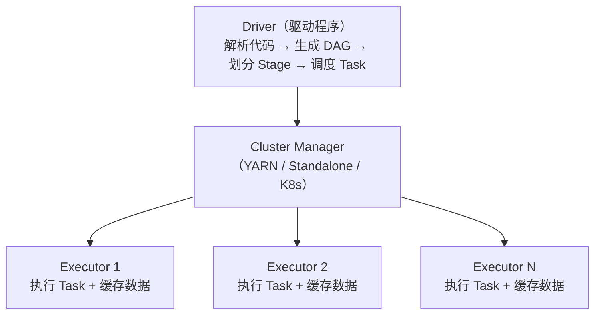
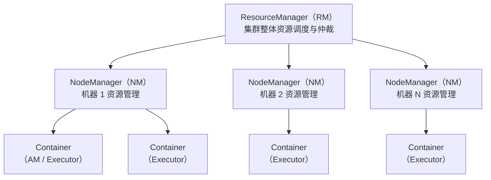
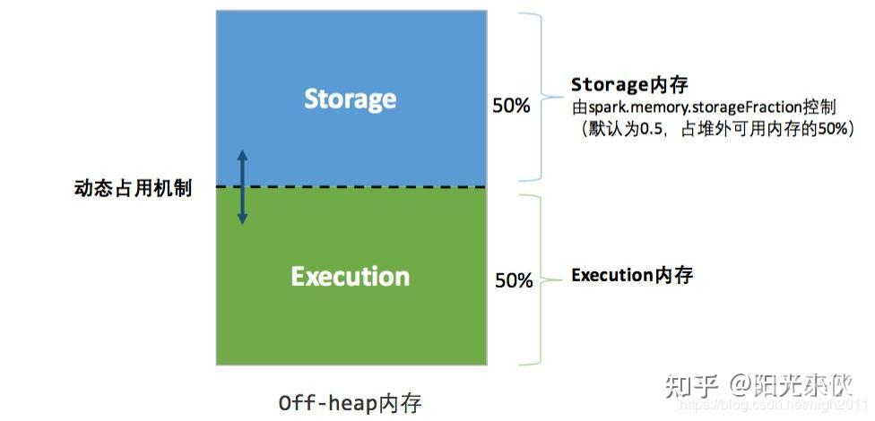
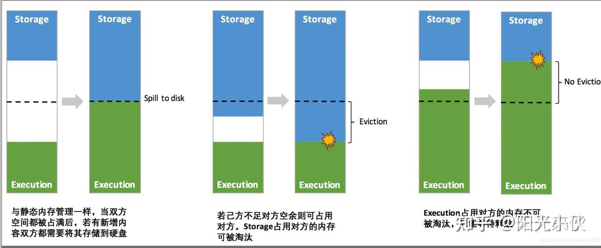
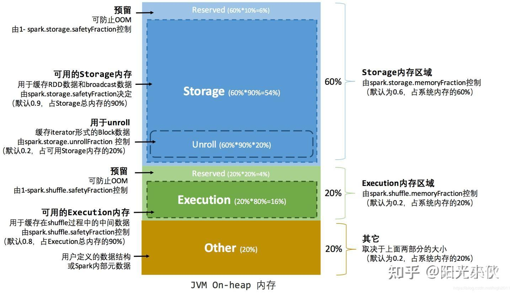

# 6.4 Spark——内存计算引擎

> **一句话定位**：Spark 是 MapReduce 的替代者——同样做分布式批处理，但把中间结果放内存而非磁盘，快 10-100 倍。同时它还统一了批处理（Spark SQL）、流处理（Structured Streaming）、机器学习（MLlib）、图计算（GraphX）四大场景，是目前大数据批处理的事实标准。

---

## 一、为什么比 MapReduce 快？

MapReduce 的致命问题是**每个阶段的结果都要写磁盘**。一个复杂查询翻译成多轮 MapReduce，每轮的中间结果都落盘再读回来，IO 成本极高。

Spark 的核心改进是**内存计算**：把中间结果缓存在内存中，下一步直接从内存读，避免反复磁盘 IO。只有内存放不下时才溢写到磁盘。

```
MapReduce：Map → 写磁盘 → Reduce → 写磁盘 → Map → 写磁盘 → Reduce
Spark：    Map → 内存 → Reduce → 内存 → Map → 内存 → Reduce → 写磁盘
```

---

## 二、核心抽象——RDD

### 2.1 RDD 是什么

RDD（Resilient Distributed Dataset，弹性分布式数据集）是 Spark 最基础的数据抽象——一个**不可变的、分区的、可并行计算的**数据集合。

| 特性 | 含义 |
|------|------|
| **分布式** | 数据分散在集群的多个节点上 |
| **不可变** | RDD 创建后不能修改，每次操作生成新 RDD |
| **弹性容错** | 通过 **血缘（Lineage）** 记录转换链路，丢失分区可以从上游重算恢复 |
| **惰性求值** | Transformation 只构建执行计划，遇到 Action 才真正执行 |

### 2.2 Transformation vs Action

| 类型 | 做什么 | 是否触发计算 | 常见操作 |
|------|--------|------------|---------|
| **Transformation** | 从一个 RDD 生成新 RDD | 不触发（惰性） | `map`、`filter`、`flatMap`、`groupByKey`、`reduceByKey`、`join` |
| **Action** | 返回结果给 Driver 或写存储 | **触发计算** | `collect`、`count`、`reduce`、`saveAsTextFile`、`foreach` |

> 这和 Java Stream 的惰性求值是同一个思路（详见 [3.16 Java 8+ 新特性](../part3-java-deep/16-Java8+新特性.md)）。

#### Action 的两种归宿：回 Driver 还是写存储

Action 分为两大类，区别在于计算结果去哪里：

```
① 返回结果给 Driver（数据回收到 Driver 进程的内存中）
   collect()        → 把所有数据拉回 Driver（最危险，容易 OOM）
   count()          → 返回一个 Long 数字（极轻量）
   take(n)          → 返回前 n 条（有上限，相对安全）
   first()          → 返回第一条（等价于 take(1)）
   reduce()         → 返回一个聚合后的单一值（极轻量）
   aggregate()      → 返回一个聚合后的单一值
   countByKey()     → 返回 Map[K, Long]（key 多时也不小）
   top(n)           → 返回最大的 n 条（有上限）
   collectAsMap()   → 返回 Map[K, V]（数据多时危险）

② 写到外部存储 / 副作用（不回 Driver）
   saveAsTextFile()       → 写 HDFS/S3
   write.format().save()  → DataFrame API 写存储
   foreach()              → 对每条数据执行副作用（如写 MySQL）
   foreachPartition()     → 按分区执行副作用
```

#### 为什么 Action 的结果要返回给 Driver

理解这个问题的关键在于 Spark 的编程模型——**用户代码跑在 Driver 上，Executor 只是被派去干活的工人。**

```
你写的代码（在 Driver 上执行）：
  long total = rdd.count();        ← 这行代码在 Driver 上跑
  if (total > 10000) {              ← 这行也在 Driver 上跑
      rdd.filter(...).saveAsTextFile("/output");
  }

执行过程：
  Driver: "我需要 count，各 Executor 去数自己分区的行数"
  Executor 1: "我的分区有 3000 行"  ──→ 回传给 Driver
  Executor 2: "我的分区有 5000 行"  ──→ 回传给 Driver
  Executor 3: "我的分区有 4000 行"  ──→ 回传给 Driver
  Driver: 汇总 3000+5000+4000 = 12000，赋值给 total
  Driver: if (12000 > 10000) 成立，继续执行 filter + saveAsTextFile
```

每个 Executor 只看得到自己那一个分区的数据，没有任何一个 Executor 知道全局总数。只有 Driver 能把所有 Executor 的部分结果汇总成最终值。而你写的 `if (total > 10000)` 这样的判断逻辑是在 Driver 上跑的——Executor 不做决策，只执行被分配的 Task。

> **类比**：Driver 是项目经理，Executor 是流水线工人。项目经理说"帮我统计总产量"，每个工人只能报自己工位的产量，汇总和决策只能由项目经理完成。如果你不需要总产量这个数字，那就不要调用 `count()`——Action 的存在意义就是"Driver 需要这个结果"。

#### 交互式查询的结果流程

在 Spark Shell 或 Notebook（Jupyter / Zeppelin）中跑 Spark 时，**Shell 进程本身就是 Driver**。你在 Shell 里输入的每一行代码，都是 Driver 在执行：

```
你在 Spark Shell 输入: rdd.filter(_._2 > 100).collect()

→ Driver（Spark Shell 进程）解析这行代码，构建 DAG
→ Driver 把 Task 分发给各个 Executor
→ Executor 各自计算自己分区的过滤结果
→ Executor 把结果通过网络回传给 Driver
→ Driver（Spark Shell）收到数据，在终端打印出来给你看
```

所以结果不是"先到 Driver 再到 Shell"，而是 Driver 就是 Shell 本身。在生产环境中，Driver 通常是你提交的 `spark-submit` 应用进程。

#### 什么场景需要返回数据给 Driver

核心场景就一句话：**Spark 任务跑完后，Driver 需要拿到结果去做"Spark 之外的事"。**

```
场景 1：交互式查询看结果
  Spark Shell / Notebook 中分析数据，需要把结果显示给人看
  → collect() 或 show() 把数据拉回来打印
  ⚠ 生产环境绝不能对大结果集 collect()，会直接 Driver OOM

场景 2：聚合统计只需要一个数字
  count() 算总行数、reduce() 算总和，结果只有一个标量值
  → 回 Driver 完全没有压力，这是最安全的 Action

场景 3：拿结果做后续非 Spark 的决策
  Spark 算出各商品点击量，拉回 Driver 后用 Java 代码做排序、写缓存等
  ⚠ 更好的做法是直接在 Spark 里做完，或用 write 写到数据库

场景 4：收集小表用于广播
  先 collect() 一张小表到 Driver，再 broadcast() 到所有 Executor
  → 前提是小表真的小（通常 < 10MB）

场景 5：取少量样本调试
  take(n) 或 takeSample() 取几条数据看 schema、验证逻辑
  → 数据量有上限，安全
```

> **生产环境最佳实践**：能用 `write` 写存储就不用 `collect()` 回 Driver。数据量大时，结果直接写到 HDFS/S3/MySQL/Kafka，Driver 只负责提交任务和接收"成功/失败"的状态，不碰实际数据。Driver OOM 的头号原因就是 `collect()` 拉了过大结果集（详见 [性能优化专题 — OOM 排查](./04-Spark-性能优化.md#oom--spill-排查路径)）。

### 2.3 宽依赖 vs 窄依赖

| 类型 | 定义 | 是否产生 Shuffle | 示例 |
|------|------|-----------------|------|
| **窄依赖** | 父 RDD 的每个分区只被子 RDD 的一个分区使用 | 否 | `map`、`filter`、`union` |
| **宽依赖** | 父 RDD 的一个分区被子 RDD 的多个分区使用 | **是** | `groupByKey`、`reduceByKey`、`join` |

**Shuffle 是 Spark 最昂贵的操作**——很多人以为 Shuffle 慢是因为"网络传输太慢"，但网络只是四个原因之一。Shuffle 之所以昂贵，是因为它同时踩中了**四个性能地雷**：

```
① 磁盘 I/O（往往比网络更慢）
   Shuffle 数据不是直接从上游内存传到下游内存的——中间必须落盘
   上游 Executor 把数据写成本地磁盘文件（Shuffle Write）
   下游 Executor 再从这些文件里读取（Shuffle Read）
   磁盘读写是随机 I/O，尤其机械磁盘上极慢
   即使 SSD，大量小文件的随机读也远慢于顺序内存操作

② 网络传输
   数据要从上游节点通过网络传到下游节点，受带宽限制
   万兆网卡理论 10Gbps，但集群中多任务竞争带宽，单任务分到的更少
   传输的是序列化后的二进制字节流，不是原始内存对象

③ 序列化 / 反序列化开销
   内存中的 Java 对象不能直接传输，必须序列化成字节流
   （Spark 默认用 Java 序列化或 Kryo）
   到下游再反序列化回对象——CPU 密集型操作
   数据量大时，序列化本身消耗大量 CPU 时间

④ 同步屏障——最容易被忽视但影响最大
   Shuffle 是 Stage 的边界，上游 Stage 的所有 Task 必须全部完成
   下游 Stage 的 Task 才能开始，打破了流水线
```

其中第 4 点——同步屏障——是 Shuffle 和普通 Transformation 最本质的区别：

```
无 Shuffle 时（流水线执行，窄依赖）：
  Task 1: [map → filter → map] → 完成，Task 2 立即开始
  Executor 可以连续处理，不用等任何人，数据全程在内存中流式传递

有 Shuffle 时（屏障等待，宽依赖）：
  Stage 1: Task 1 ✓  Task 2 ✓  Task 3 ✓ ... Task 200 ✓  ← 必须全部完成！
              ↓↓↓ 等待屏障（最慢的 Task 决定等待时间）↓↓↓
  Stage 2: Task 1 开始  Task 2 开始 ...

  如果 199 个 Task 都在 1 分钟内完成，但 Task 200 跑了 10 分钟（数据倾斜）
  整个 Stage 2 都要等 10 分钟才能启动
  → 这就是为什么数据倾斜对 Shuffle 的伤害特别大
```

Shuffle 数据落盘的完整流程：

```
Executor 1: [处理数据] → 序列化 → 写本地磁盘文件（Shuffle Write）
Executor 2: [处理数据] → 序列化 → 写本地磁盘文件
Executor 3: [处理数据] → 序列化 → 写本地磁盘文件
                    ↓ 网络传输（拉取远程文件）
Executor 4: 读磁盘文件 → 反序列化 → [继续处理]（Shuffle Read）
Executor 5: 读磁盘文件 → 反序列化 → [继续处理]
Executor 6: 读磁盘文件 → 反序列化 → [继续处理]
```

> **类比**：窄依赖就像流水线——上一步做完直接递给下一步，全程在内存里。Shuffle 就像工厂之间的物流——产品要先打包（序列化）、装车（写磁盘）、运输（网络）、卸货（读磁盘）、拆包（反序列化），而且必须等上一家工厂的货全部到齐才能开工（同步屏障）。

宽依赖触发 Shuffle，也触发 Stage 的划分。

### 2.3.1 序列化框架选择：Java 原生 vs Kryo

Shuffle 的四个性能地雷中，序列化/反序列化是 CPU 开销的主要来源。选对序列化框架能直接降低这部分开销，同时减小网络传输量。

Spark 内置支持两种序列化器：

| 维度 | Java 原生序列化（默认） | Kryo（推荐生产使用） |
|------|----------------------|-------------------|
| **速度** | 慢 | ⚡ 快 5-10 倍 |
| **字节体积** | 大（含完整类元信息） | 小（~25% of Java 原生） |
| **接入成本** | 零配置 | 需切换配置，推荐注册核心类 |
| **跨语言** | ❌ 仅 Java | ❌ 仅 Java |
| **Schema 演进** | 弱（依赖 serialVersionUID） | ❌ 不支持（字段顺序变化会损坏数据） |
| **适用场景** | 默认兜底、零配置场景 | Spark/Flink 内部短暂传输 |

**为什么 Spark 默认不用 Kryo？** Kryo 需要预注册类才能发挥最大性能——未注册的类会退化到把类全名写进字节流，优势大幅缩水；而且 `registrationRequired=true` 时遇到未注册类直接报错。Java 原生序列化虽然慢，但零配置、零风险，适合作为默认值。

**Kryo 的核心原理**：用整数 ID 代替类名，序列化时只写数据本身，不写类型描述。

```
Java 原生序列化：
  [类名: "com.example.Person"][字段名: "name"][值: "Alice"][字段名: "age"][值: 30]
  → 字节流里大量字符串，体积大，解析慢

Kryo（已注册）：
  [类ID: 42]["Alice"][30]
  → 只有数据，体积极小，解析极快
```

**在 Spark 中启用 Kryo**：

```scala
val conf = new SparkConf()
  .set("spark.serializer", "org.apache.spark.serializer.KryoSerializer")
  // 注册业务核心类，获得最大性能收益
  .registerKryoClasses(Array(
    classOf[MyEvent],
    classOf[UserRecord]
  ))
```

**Kryo vs Protobuf**：两者经常被拿来比较，但定位不同——

```
Kryo：零 Schema、零侵入，直接序列化已有 Java 对象
  → 适合框架内部短暂传输（Spark Shuffle、广播变量、RDD 缓存）
  → 不适合持久化存储：字段顺序变化会导致旧数据反序列化错乱

Protobuf：需要定义 .proto 文件 + 代码生成，但换来跨语言 + 强 Schema 演进
  → 适合微服务 RPC（gRPC）、消息队列持久化、对外 API 协议
  → 字段编号机制保证新旧版本数据互相兼容

// Protobuf 字段编号机制示例：
message User {
  string name  = 1;   // 编号 1，永远不变
  int32  age   = 2;   // 编号 2
  string email = 3;   // 新增字段，旧数据读到 email="" 默认值，完全正常
}
// 旧代码遇到编号 3 → 直接跳过，不报错
// Kryo 没有编号，靠字段声明顺序，插入新字段会导致后续字段全部错位
```

> **一句话总结**：Kryo 管 JVM 内部的短暂传输，Protobuf 管跨系统的长期协议。Spark 生产环境建议切换到 Kryo 并注册核心数据类，能明显降低 Shuffle 的 CPU 和网络开销。

### 2.4 共享变量——广播变量与累加器

Spark 的算子代码（如 `rdd.filter(...)` 中的 lambda）会被 Driver 序列化后发送到每个 Executor。同样，算子中引用的外部变量也会被复制到每个 Task——如果一个变量 100MB、有 200 个 Task，就会复制 200 份共 20GB 网络传输。广播变量和累加器就是解决这个问题的两种共享变量。

#### 广播变量（Broadcast）

**问题**：Driver 上有一个大 List（如维表数据、配置字典），每个 Task 都需要用到它。如果不做处理，每个 Task 会拷贝一份，导致网络带宽和内存浪费。

**解决**：广播变量让每个 Executor 只持有一份副本，该 Executor 上的所有 Task 共享这一份。

```
不用广播变量：
  Driver 有 list（100MB）
    → Task 1 拷贝一份（100MB）→ Executor 1
    → Task 2 拷贝一份（100MB）→ Executor 1（同一个 Executor，重复了！）
    → Task 3 拷贝一份（100MB）→ Executor 2
    → Task 4 拷贝一份（100MB）→ Executor 2（又重复了！）
    → 200 个 Task = 200 份 = 20GB 网络传输

使用广播变量：
  Driver 有 list（100MB）
    → broadcast(list) → Executor 1 拉取一份（100MB），所有 Task 共享
    → broadcast(list) → Executor 2 拉取一份（100MB），所有 Task 共享
    → 10 个 Executor = 10 份 = 1GB 网络传输（减少 95%）
```

使用方式：

```scala
// Driver 端定义广播变量
val broadcastVal = sc.broadcast(List("hello", "world"))

// Executor 端读取（所有 Task 共享同一份）
rdd.filter(x => broadcastVal.value.contains(x)).foreach(println)

// 注意：广播变量只能在 Driver 端定义和修改，Executor 端只能读取
```

注意事项：不能广播 RDD（RDD 不存储数据，只是数据的抽象）；广播变量在 Driver 端定义后不可修改（只读）。

> **广播变量 vs Broadcast Join**：Spark SQL 的 Broadcast Join 底层就是用了广播变量——把小表 broadcast 到所有 Executor，然后大表在本地做 Hash Join，避免 Shuffle。区别是 Broadcast Join 是 Spark 自动做的，而广播变量是开发者手动使用的。

#### 累加器（Accumulator）

**问题**：分布式计算中，每个 Task 跑在独立的 Executor 上，普通的计数器变量无法跨 Executor 共享——Task 1 把 `counter` 加 1，Task 2 看不到这个修改。

**解决**：累加器提供了一个跨 Executor 的全局计数器——在 Driver 端定义初始值，Executor 端只能 `add`，最终在 Driver 端读取汇总值。

```scala
// Driver 端定义累加器
val accumulator = sc.longAccumulator("error_count")

// Executor 端累加（每个 Task 调用 add）
rdd.foreach { x =>
  if (isError(x)) {
    accumulator.add(1)  // 只能 add，不能读取
  }
}

// Driver 端读取最终值
println(accumulator.value)  // 输出全局错误总数
```

> **累加器的坑**：累加器在 Transformation 算子（如 `filter`、`map`）中使用时，如果对应的 RDD 被重复计算（如没有 cache 导致重新执行），累加器会被重复累加——这是一个经典的陷阱。正确做法是在 Action 算子中使用累加器，或者先 `cache()` RDD 再使用累加器。

| 共享变量 | 解决的问题 | Driver 端 | Executor 端 | 典型场景 |
|---------|-----------|-----------|-------------|---------|
| **广播变量** | 大变量重复拷贝 | 定义 + 修改 | 只读 | 维表数据下发、配置字典 |
| **累加器** | 跨 Executor 全局计数 | 定义 + 读取 | 只能 add | 错误计数、有效记录统计 |

<details>
<summary><b>展开：累加器在生产环境中的真实使用案例</b></summary>

累加器看起来简单，但在大厂生产环境中有很多实战用法，以下是几个典型场景：

**案例 1：ETL 数据质量监控（电商/金融数仓团队常见做法）**

每天跑 T+1 的 ETL 任务时，用累加器统计脏数据量，写入监控系统触发告警：

```scala
val nullFieldCount = spark.sparkContext.longAccumulator("null_field_count")
val malformedJsonCount = spark.sparkContext.longAccumulator("malformed_json")
val totalProcessed = spark.sparkContext.longAccumulator("total_processed")

val cleanDF = rawDF.filter { row =>
  totalProcessed.add(1)
  if (row.isNullAt(row.fieldIndex("user_id"))) {
    nullFieldCount.add(1)
    false
  } else if (!isValidJson(row.getString(row.fieldIndex("extra_info")))) {
    malformedJsonCount.add(1)
    false
  } else true
}
cleanDF.write.parquet(outputPath)

// ETL 结束后上报监控
reportMetrics(Map(
  "total" -> totalProcessed.value,
  "null_fields" -> nullFieldCount.value,
  "malformed" -> malformedJsonCount.value
))
// 脏数据率超过阈值（如 5%）→ 触发 PagerDuty/飞书告警
```

这是最常见的生产用法——**不影响主流程的前提下，顺便统计数据质量指标**。用 filter/reduce 也能做，但累加器的优势是不需要额外的 Action 操作，在已有的数据处理流程中"搭便车"完成统计。

**案例 2：Spark Streaming 实时风控——统计触发规则的事件数**

```scala
val highRiskCount = ssc.sparkContext.longAccumulator("high_risk_events")
val blockedCount = ssc.sparkContext.longAccumulator("blocked_transactions")

dstream.foreachRDD { rdd =>
  rdd.foreach { event =>
    val riskScore = riskModel.score(event)
    if (riskScore > 0.9) {
      highRiskCount.add(1)
      blockTransaction(event)
      blockedCount.add(1)
    }
  }
  // 每个 batch 结束后推送到 Grafana 监控面板
  pushToGrafana("high_risk_per_batch", highRiskCount.value)
}
```

风控团队用累加器实时追踪"本批次拦截了多少笔高风险交易"，在 Spark UI 和外部监控系统中都能看到。

**案例 3：机器学习特征工程——统计特征覆盖率**

训练数据准备阶段，统计每个特征的缺失率，决定是否丢弃该特征：

```scala
val featureMissing = spark.sparkContext.collectionAccumulator[String]("missing_features")

trainingData.foreach { row =>
  for (col <- featureColumns) {
    if (row.isNullAt(row.fieldIndex(col))) {
      featureMissing.add(col)  // 记录哪些特征缺失
    }
  }
}

// 统计每个特征的缺失次数
val missingStats = featureMissing.value.asScala.groupBy(identity).mapValues(_.size)
// 缺失率 > 30% 的特征直接丢弃
val dropColumns = missingStats.filter(_._2 > totalRows * 0.3).keys
```

**案例 4：日志分析——按错误类型分类计数（自定义累加器）**

当需要统计多种类型的计数时，用自定义 MapAccumulator：

```scala
// 自定义 Map 累加器
class MapAccumulator extends AccumulatorV2[String, java.util.Map[String, Long]] {
  private val map = new ConcurrentHashMap[String, Long]()
  override def add(key: String): Unit = map.merge(key, 1L, _ + _)
  override def value: java.util.Map[String, Long] = map
  // ... 省略 reset/merge/copy 等方法
}

val errorTypeCounter = new MapAccumulator()
spark.sparkContext.register(errorTypeCounter, "error_types")

logRDD.foreach { line =>
  val errorType = extractErrorType(line)  // "NullPointer" / "Timeout" / "AuthFail"
  if (errorType != null) errorTypeCounter.add(errorType)
}

// 输出：{NullPointer=12340, Timeout=5678, AuthFail=891}
println(errorTypeCounter.value)
```

**为什么不用 `rdd.countByValue()` 或 `groupBy` 代替累加器？**

| 方式 | 额外 Action | 额外 Shuffle | 适用场景 |
|------|-----------|-------------|---------|
| `countByValue()` | ✅ 需要单独触发 | ✅ 有 | 统计是主要目的 |
| `groupBy + count` | ✅ 需要单独触发 | ✅ 有 | 统计是主要目的 |
| **累加器** | ❌ 搭便车 | ❌ 无 | 统计是"顺便做的"，主流程是 ETL/过滤/写入 |

累加器的核心价值：**在已有的计算流程中零成本附加统计，不引入额外的 Shuffle 和 Action**。

</details>

---

## 三、执行架构



| 组件 | 职责 |
|------|------|
| **Driver** | 运行用户代码的 main 方法，创建 SparkContext，生成执行计划（DAG），划分 Stage 和 Task |
| **Executor** | 集群节点上的 JVM 进程，负责执行 Task 和缓存 RDD 数据 |
| **Task** | 最小执行单元，一个 Task 处理一个 RDD 分区 |

### 3.1 部署模式与提交流程

Driver 和 Executor 本质上都是 JVM 进程，不关心运行在哪里——只要能启动 Java 进程、能互相通信即可。根据它们运行位置的不同，Spark 支持多种部署模式。

#### 四种部署模式

```
Local（本地模式）
  Driver 和 Executor 运行在同一个 JVM 进程中
  只启动 1 个 Executor，通过多线程模拟并行
  → 开发测试用，Spark Shell / Notebook 默认就是 Local

Spark Standalone（独立集群）
  Spark 自带的资源管理器，由 Master + Worker 组成
  Master 负责资源分配，Worker 负责在本机启动/停止 Executor
  → 轻量级，适合小团队快速搭集群，但资源隔离弱（无 cgroup）

YARN（Hadoop 集群）
  借用 Hadoop YARN 做资源管理，Spark 和 Hadoop 生态共享集群
  → 生产环境最常用，资源隔离强（cgroup），多框架共享资源

Kubernetes（云原生）
  Driver 和 Executor 运行在 K8s Pod 中
  → 云原生趋势，适合容器化部署，Spark 3.x 后逐渐成熟
```

| 维度 | Local | Standalone | YARN | K8s |
|------|-------|-----------|------|-----|
| **资源管理** | 无 | Master/Worker | YARN ResourceManager/NodeManager | K8s Scheduler |
| **资源隔离** | 无 | OS 进程级（弱） | cgroup（强） | Pod 级（强） |
| **多框架共享** | 不支持 | 仅 Spark | Spark/Flink/Hadoop 共享 | 任意容器化应用 |
| **适用场景** | 开发测试 | 小团队快速搭建 | 生产环境主流 | 云原生部署 |
| **Driver 位置** | 本地 JVM | 可选 client/cluster | 可选 client/cluster | 主要 cluster |

> **为什么生产环境通常用 YARN 而不是 Standalone？** 三个原因：一是 YARN 是通用资源管理器，Spark、Flink、Hadoop MapReduce 可以共享同一批机器，白天跑 Spark 分析、晚上跑 Flink 实时任务；二是 YARN 用 cgroup 做资源隔离，一个 Executor OOM 不影响其他 Executor，Standalone 只有 OS 进程级隔离；三是 YARN 有完善的队列和优先级调度，可以按部门/项目分配资源配额，Standalone 的调度能力较弱。

#### Client vs Cluster 模式

不管用哪种集群，Driver 可以运行在两个地方——这就是 client 模式和 cluster 模式的区别：

```
Client 模式：Driver 运行在提交任务的机器上
  你在机器 A 上执行 spark-submit → Driver 进程在机器 A 上启动
  → 机器 A 必须一直在线，关机/断网 = 任务挂
  → 日志直接在机器 A 的终端输出，方便调试
  → Spark Shell / Notebook 天然是 client 模式

Cluster 模式：Driver 运行在集群内部
  你在机器 A 上执行 spark-submit → 机器 A 只负责"提交"
  → Driver 进程被调度到集群中的某个节点上运行
  → 提交后机器 A 可以关机，任务不受影响
  → 日志要去集群内部查看（YARN 的 ApplicationMaster 日志）
  → 生产环境的定时任务必须用 cluster 模式
```

| 维度 | Client 模式 | Cluster 模式 |
|------|------------|-------------|
| **Driver 位置** | 提交任务的机器上 | 集群内部某个节点 |
| **提交机器是否需要在线** | 是（关机任务就挂） | 否（提交后可以关机） |
| **日志查看** | 直接在终端看 | 去集群内部看（yarn logs） |
| **适用场景** | 交互式分析、开发调试 | 生产定时任务、长时间运行作业 |
| **Spark Shell** | 天然 client（Shell 就是 Driver） | 不支持（Shell 需要交互） |

> **一句话记忆**：client 模式 Driver 在你手边（方便调试但机器不能关），cluster 模式 Driver 在集群里（机器能关但日志要去集群找）。生产环境定时任务必须用 cluster，因为提交任务的机器（如调度机）可能在任务执行期间重启。

#### spark-submit 提交流程

```bash
# 典型的 spark-submit 命令
spark-submit \
  --master yarn \                    # 资源管理器：yarn / spark://host:7077 / k8s://...
  --deploy-mode cluster \            # 部署模式：client / cluster
  --executor-memory 8G \             # 每个 Executor 内存
  --executor-cores 4 \               # 每个 Executor CPU 核数
  --num-executors 10 \               # Executor 数量
  --class com.example.MySparkApp \   # 主类
  my-app.jar \                       # 应用 JAR
  --input /data/input --output /data/output  # 应用参数
```

提交流程的完整链路（以 YARN Cluster 模式为例）：

```
① spark-submit 提交任务
   → 在提交机器上启动一个临时进程
   → 向 YARN ResourceManager 申请 ApplicationMaster 资源

② YARN 分配 Container，启动 ApplicationMaster（就是 Driver）
   → Driver 运行在集群内部某个 NodeManager 上
   → 提交机器上的临时进程退出，不再参与

③ Driver 初始化 SparkContext
   → 向 YARN ResourceManager 申请 Executor 资源
   → "我需要 10 个 Container，每个 4 核 8GB"

④ YARN 在各 NodeManager 上分配 Container，启动 Executor JVM
   → Executor 启动后，反向注册到 Driver
   → "我是 Executor 1，我有 4 个 slot，随时可以接活"

⑤ Driver 开始调度 Task
   → 根据 DAG 划分 Stage，生成 Task
   → 将 Task 分发给已注册的 Executor 执行
   → Task 完成后 Executor 汇报结果，Driver 分发下一批

⑥ Application 结束
   → Driver 向 YARN 注销，所有 Executor 被关闭，Container 释放
```

> **不同集群的差异仅在步骤 ① ~ ④**——向谁申请资源、在哪里启动 Driver/Executor。步骤 ⑤ 之后的 Task 调度和执行完全一样，这就是 Spark 跨集群可移植的原因：通过 SchedulerBackend 接口的不同实现类适配不同集群管理器，上层执行逻辑不变。

### 3.2 Job → Stage → Task 的划分

```
包含关系：1 Job ⊃ 若干 Stage ⊃ 若干 Task

Job：     一个 Action 触发一个 Job
            例：collect()、count()、saveAsTextFile() 各触发一个 Job
Stage：   以 Shuffle 为边界划分（宽依赖切分 Stage）
            例：map → filter → reduceByKey → filter → collect()
                Stage 0: map → filter → reduceByKey（Shuffle 前）
                Stage 1: filter → collect（Shuffle 后）
Task：    一个 Stage 内，RDD 的每个数据分区对应一个 Task
            例：RDD 有 200 个分区 → 这个 Stage 生成 200 个 Task
                Task 1 处理分区 0 的数据，Task 2 处理分区 1 的数据 ...
```

> **分区是谁的？** 这里的"分区"是 **RDD / DataFrame 的数据分区**，不是 Stage 自己拥有的分区。Stage 是执行计划的概念，分区是数据的概念——数据被切成 N 份（N 个分区），Stage 就生成 N 个 Task，每个 Task 处理其中 1 份。分区数量由 `numPartitions` 参数、Shuffle 后的分区数、或 `repartition()` 决定，跟 Stage 本身无关。

#### 一个 Stage 内有多个 RDD，Task 怎么划分

一个 Stage 内的多个 RDD 通过窄依赖串联（map、filter 等），形成一条流水线。窄依赖保证父子 RDD 分区一一对应，所以 Spark 只看**最后一个 RDD（最终 RDD）的分区数**来决定 Task 数——中间 RDD 的分区数不影响：

```
Stage 0 内的流水线（窄依赖，不产生 Shuffle）：
  RDD_A (3 分区) → map → RDD_B (3 分区) → filter → RDD_C (3 分区)

  窄依赖：父分区 1 → 子分区 1，一一对应，不改变分区数
  所以 RDD_A、RDD_B、RDD_C 都是 3 个分区

  → 生成 3 个 Task：
    Task 1: 读 RDD_A 分区 0 → map → RDD_B 分区 0 → filter → RDD_C 分区 0
    Task 2: 读 RDD_A 分区 1 → map → RDD_B 分区 1 → filter → RDD_C 分区 1
    Task 3: 读 RDD_A 分区 2 → map → RDD_B 分区 2 → filter → RDD_C 分区 2

  每个 Task 内部是一条流水线，数据在内存中依次流过 map → filter，不落盘
  Task 不需要知道上游 RDD 有几个分区——它只拿自己对应的那一份
```

> **类比**：Stage 内的多个 RDD 就像工厂流水线上的多道工序——原材料进来，经过切割（map）、质检（filter）、包装（map），全程在同一条传送带上，不需要中途换车间。Task 就是这条传送线上的一名工人，只负责自己那段材料。

#### 分区 → Task → Executor 的对应关系

```
分区 → Task：    一对一（一个 Task 处理一个分区）
Task → Executor：多对一（一个 Executor 同时运行多个 Task，受核数限制）
Executor → 分区：多对多（一个 Executor 可以持有多个分区的数据）

具体例子：
  集群有 5 个 Executor，每个 Executor 4 个核
  RDD 有 200 个分区
  → 生成 200 个 Task
  → 同时运行 5 × 4 = 20 个 Task（并行度 = 20）
  → 剩余 180 个 Task 排队，前面的完成一批就调度下一批
  → 每个 Executor 同时跑 4 个 Task（每个核跑一个 Task）
  → 一个 Executor 可能持有多个分区的数据（缓存 + 正在处理）
```

> **关键**：分区数决定了 Task 数（并行度的上限），Executor 核数决定了同时能跑多少个 Task（实际并行度）。如果分区数远大于总核数，Task 会分批调度；如果分区数小于总核数，有些核会空闲——所以分区数通常建议设为总核数的 2-3 倍。

<details>
<summary><b>展开：分区数不合理的诊断——如何观测、用什么指标判断</b></summary>

分区数设置不合理是 Spark 最常见的性能问题之一。分区过多和分区过少的症状完全不同，需要不同的指标来诊断。

---

**问题 1：分区数过大 → Task 太多、调度开销大、产生大量小文件**

| 观测指标 | 在哪看 | 异常信号 |
|---------|--------|---------|
| Task 数量 | Spark UI → Stage 详情 → Total Tasks | 一个 Stage 几万甚至几十万个 Task |
| Task 平均执行时间 | Spark UI → Stage 详情 → Duration 的 Median/Min | 大量 Task 执行时间 **< 100ms**（数据太少，调度开销占比高） |
| Scheduler Delay | Spark UI → Task 详情 → Scheduler Delay 列 | 调度延迟占 Task 总时间 **> 10%**（正常应 < 5%） |
| Driver GC Time | Spark UI → Executors → Driver 的 GC Time | Driver 端 GC 频繁（大量 Task 元数据对象压力） |
| Shuffle Write / Task | Spark UI → Stage 详情 → Shuffle Write | 每个 Task 只写几百条记录或几 KB |
| 输出文件数 | `hdfs dfs -count <output_path>` | 文件数远超需要（如 10000 个文件，每个几 KB） |
| 单文件大小 | `hdfs dfs -ls <output_path>` | 大量文件 **< 1MB**（NameNode 元数据压力） |

```scala
// 快速诊断：查看每个分区的记录数
df.rdd.mapPartitions(iter => Iterator(iter.size)).collect()
// 如果大量分区只有 0 或几十条记录 → 分区过多
```

**合理分区数经验公式**：`总数据量 / 128MB`，如 10GB 数据 → ~80 个分区。

---

**问题 2：分区数过小 → 单 Task 数据量过大、OOM、并行度不足**

| 观测指标 | 在哪看 | 异常信号 |
|---------|--------|---------|
| Task 执行时间 | Spark UI → Stage 详情 → Duration 的 Max | 单个 Task 执行 **> 10 分钟**（数据量太大） |
| Shuffle Read / Task | Spark UI → Task 详情 → Shuffle Read Size | 单个 Task 读取 **> 1GB** |
| Spill 到磁盘 | Spark UI → Task 详情 → Shuffle Spill (Disk) | 出现 Spill 说明内存放不下，被迫写磁盘 |
| GC Time / Task | Spark UI → Task 详情 → GC Time | 单个 Task GC 时间占执行时间 **> 20%** |
| OOM 报错 | Driver/Executor 日志 | `java.lang.OutOfMemoryError` |
| Executor 空闲核 | Spark UI → Executors → Active Tasks | 总核数 100 但只有 10 个 Task 在跑（90 个核空闲） |

```
症状组合：
  分区数 = 10，总核数 = 100
  → 只有 10 个 Task，90 个核空闲
  → 每个 Task 处理 1GB 数据，频繁 GC 甚至 OOM
  → 整个 Stage 的时间被最慢的那个 Task 决定
```

---

**问题 3：数据倾斜 → 个别 Task 特别慢，其他 Task 早已完成**

| 观测指标 | 在哪看 | 异常信号 |
|---------|--------|---------|
| Task Duration 分布 | Spark UI → Stage 详情 → Duration 的 Max vs Median | Max **> 10× Median**（如 Median 30s，Max 10min） |
| Shuffle Read 分布 | Spark UI → Task 详情 → Shuffle Read Size | 个别 Task 读取量是其他的 **10-100 倍** |
| Task 进度 | Spark UI → Stage 详情 → 进度条 | 99% 的 Task 已完成，1 个 Task 还在跑（长尾） |
| Spill 集中 | Spark UI → Task 详情 → Shuffle Spill | 只有个别 Task 有 Spill，其他没有 |
| Executor 利用率 | Spark UI → Executors → Active Tasks | 只有 1-2 个 Executor 在忙，其他都空闲等待 |

```scala
// 诊断倾斜：查看分区数据量分布
df.rdd.mapPartitions(iter => Iterator(iter.size)).collect()
// 如果某几个分区的记录数是其他的 10 倍以上 → 数据倾斜

// 或者用 SQL 查看 key 分布
spark.sql("SELECT join_key, COUNT(*) as cnt FROM table GROUP BY join_key ORDER BY cnt DESC LIMIT 20")
// 如果 top key 的 count 远超平均值 → 该 key 会导致倾斜
```

---

**问题 4：Shuffle 过重 → 网络传输量大、磁盘 IO 高**

| 观测指标 | 在哪看 | 异常信号 |
|---------|--------|---------|
| Shuffle Write 总量 | Spark UI → Stage 详情 → Shuffle Write | 单个 Stage 写出 **> 100GB**（考虑是否可以减少） |
| Shuffle Read 总量 | Spark UI → Stage 详情 → Shuffle Read | 下游 Stage 读取量远大于实际需要 |
| Shuffle Spill (Disk) | Spark UI → Task 详情 | 大量 Task 有 Spill → 内存不够排序/聚合 |
| Shuffle Spill (Memory) vs (Disk) | Spark UI → Task 详情 | Memory >> Disk 说明压缩率高；Disk 很大说明真的放不下 |
| 网络等待时间 | Spark UI → Task 详情 → Shuffle Read Blocked Time | 等待远程数据 **> 执行时间的 30%** |
| 磁盘 IO | 集群监控（Ganglia/Grafana） | Shuffle 期间磁盘 IO 打满 |

---

**问题 5：内存不足 → 频繁 GC、Spill、OOM**

| 观测指标 | 在哪看 | 异常信号 |
|---------|--------|---------|
| GC Time 占比 | Spark UI → Executors → GC Time / Total Time | GC 时间占 **> 20%** 的执行时间 |
| Peak Memory | Spark UI → Executors → Peak JVM Memory | 接近或达到配置的 Executor Memory 上限 |
| Spill 频率 | Spark UI → Task 详情 → Shuffle Spill | 大量 Task 都有 Spill（不是个别） |
| OOM 频率 | Executor 日志 | 反复出现 OOM 后 Task 重试 |
| Storage Memory 占用 | Spark UI → Storage → Memory Used | 缓存的 RDD 占满了 Storage 区域，挤压 Execution 区域 |

---

**问题 6：本地化不好 → 大量数据跨节点/跨机架传输**

| 观测指标 | 在哪看 | 异常信号 |
|---------|--------|---------|
| Locality Level 分布 | Spark UI → Stage 详情 → Locality Level 列 | 大量 Task 是 **RACK_LOCAL 或 ANY**（正常应多数是 PROCESS/NODE_LOCAL） |
| Input Size / Task | Spark UI → Task 详情 → Input Size | 所有 Task 都有大量 Input，但 Locality 差 → 数据在远程读取 |
| Scheduler Delay | Spark UI → Task 详情 → Scheduler Delay | 如果 Delay 很小但 Locality 差 → 说明 `locality.wait` 设太短，没等到本地 Executor 就降级了 |

---

**快速诊断决策树**

```
Job 慢了，先看哪里？

1. 打开 Spark UI → Jobs → 找到最慢的 Stage
2. 看 Task Duration 分布：
   - Max >> Median（10倍以上）→ 数据倾斜
   - 所有 Task 都慢 → 看下一步
3. 看 Task 执行时间绝对值：
   - 每个 Task < 100ms → 分区过多，合并分区
   - 每个 Task > 10min → 分区过少或数据量大，增加分区
4. 看 Shuffle Spill：
   - 有大量 Spill → 内存不足，加内存或减少单 Task 数据量
5. 看 GC Time：
   - GC > 20% → 内存压力大，考虑增大 Executor Memory 或减少缓存
6. 看 Locality Level：
   - 大量 ANY/RACK_LOCAL → 数据本地化差，调整 locality.wait 或 Executor 部署
```

</details>

#### Executor、Task、Container 到底是什么——进程、线程还是资源配额

上面的描述用了"核"和"Executor"等概念，这里把它们的物理形态说清楚：

```
一个 Spark 应用的进程/线程结构（从外到内）：

YARN Container（资源隔离单位，cgroup 限制 CPU/内存）
  └── Executor（JVM 进程，就是 java -Xmx8G ... 启动的普通 JVM）
        ├── 核 0 / slot 0 → Task 线程 A（正在处理分区 0）
        ├── 核 1 / slot 1 → Task 线程 B（正在处理分区 1）
        ├── 核 2 / slot 2 → Task 线程 C（正在处理分区 2）
        ├── 核 3 / slot 3 → Task 线程 D（正在处理分区 3）
        └── 共享 JVM 堆内存（所有 Task 线程共用）
              ├── RDD 缓存数据
              ├── Shuffle 数据
              └── 广播变量等
```

各概念的物理形态：

| 概念 | 本质 | 生命周期 |
|------|------|---------|
| **Container** | YARN 的**资源配额**（不是进程），通过 cgroup 限制 CPU/内存 | 绑定 Executor |
| **Executor** | 一个 **JVM 进程**（`java -cp ...` 启动） | 绑定整个 Application |
| **Task** | Executor JVM 内的一个**线程** | 秒到分钟级，完成即销毁 |
| **slot / core** | **逻辑概念**，表示"能同时跑几个 Task"的配额 | 随 Executor 存在 |

#### 四个常见疑问——逐个说清楚

**Q1：Executor 是什么？**

Executor 是一个实实在在的 **JVM 进程**，就是通过 `java -cp ... -Xmx8G ...` 启动的普通 Java 进程。它不是虚拟容器、不是线程、不是抽象概念——你用 `jps` 命令能在进程列表里看到它，用 `top` 能看到它占用的 CPU 和内存。在 YARN 模式下，YARN NodeManager 在物理机上启动这个 JVM 进程并把它关进 cgroup 里做资源限制。

**Q2：Task 是进程还是线程？**

Task 是 Executor JVM 进程内的一个**线程**，不是独立进程。这是 Spark 和 MapReduce 最大的架构差异——MapReduce 每个 Task 启动一个独立 JVM 进程，启动开销几秒钟，短任务甚至启动比计算还慢。Spark 让 Executor 常驻、Task 以线程方式运行，启动几乎零开销，而且同一个 Executor 内的 Task 共享 JVM 堆内存，RDD 缓存可以被复用，不用每个 Task 重新加载。

**Q3：核跟 Task 是一对一吗？**

是的。这里的"核"是 `spark.executor.cores` 配置的逻辑 slot，不是物理 CPU 核。一个 Executor 配了 4 个 core 就有 4 个 slot，可以同时跑 4 个 Task 线程。每个 slot 同一时刻只跑一个 Task，Task 完成后 slot 空出来给下一个排队的 Task。注意 4 个 Task 线程是并发执行（分到不同物理核的时间片），不是并行（不绑定物理核）。

**Q4：核跟进程是一对一吗？**

不是。一个 Executor（进程）可以有多个核。`spark.executor.cores=4` 表示一个 JVM 进程有 4 个逻辑 slot，可以同时跑 4 个 Task 线程。核是进程内部的并发配额，不是进程数。

**Executor 的生命周期**：Executor 绑定整个 Spark Application，不绑定某一批 Task。一批 Task 跑完后 Executor 不关闭，而是向 Driver 汇报"我空闲了"，Driver 继续分配下一批 Task。只有三种情况 Executor 会结束：Application 正常完成、被 kill、或因 OOM/心跳超时被 Driver 移除。

```
Application 生命周期内的时间线：

Driver 启动 → 向资源管理器申请 Executor
  → Executor 1 启动（JVM 进程，一直活着）
  → Executor 2 启动（JVM 进程，一直活着）
  → Executor 3 启动（JVM 进程，一直活着）

  Stage 0: Executor 1 跑 Task A,B,C,D
    → Task 完成 → Executor 不关闭，汇报"我空了"
  Stage 1: Executor 1 跑 Task E,F,G,H（复用同一个 JVM）
    → Task 完成 → 继续等待
  ...
  Application 结束 → 所有 Executor 关闭
```

**一台物理机上多个 Executor 的隔离**：在 YARN 模式下，每个 Executor 运行在独立的 YARN Container 中，YARN 用 cgroup 限制每个 Container 的 CPU 和内存——同一台物理机上的两个 Executor 互相隔离，CPU 时间片按配额分配，内存不能越界。Standalone 模式下隔离较弱，主要靠操作系统进程级隔离，没有 cgroup 级别的资源硬限制。

> **cgroup 是什么？** cgroup 是 Linux 内核的资源隔离机制，通过虚拟文件系统（`/sys/fs/cgroup/`）配置，写入数字就能限制进程的 CPU/内存/磁盘 I/O。它不是 shell 命令也不是进程监控，而是 VFS 回调机制——写文件时内核直接修改调度参数，立刻生效。cgroup 限制的是整个进程的物理内存，和 JVM 的 `-Xmx`（只管堆内存）是两层不同的限制。完整原理（VFS 回调机制、权限模型、内核执行方式、与 Docker/YARN 的关系）详见 **[附录 A8 · Linux 操作系统基础](../part3-java-deep/A8-Linux操作系统基础.md)**。

**slot 是 Spark 的概念吗？** 严格来说 slot 是 YARN/Mesos 的概念。Spark 自己的概念是 `spark.executor.cores`，表示一个 Executor 能同时运行多少个 Task。在 YARN 部署模式下，YARN 给 Container 分配的 vcore 数对应 Spark 的 executor.cores，两个概念在实际使用中经常混用：

```
概念对应关系：

YARN 层：       Container（vcore=4, memory=8GB）
                           ↓ 启动
Spark 层：      Executor（executor.cores=4, executor.memory=8GB）
                           ↓ 分配
Task 层：       4 个 task slot，同时跑 4 个 Task 线程

OS 层：         1 个 JVM 进程，4 个工作线程，受 cgroup 约束
```

> **一个 slot 对应一个物理核吗？** 不对应。slot 是逻辑概念，对应 vcore（虚拟核），vcore 和物理核没有绑定关系。一台 32 物理核的机器，YARN 可以配 40 个 vcore（超分）或 16 个 vcore（欠分）。Task 线程跑在哪个物理核上由操作系统调度器决定，Spark 和 YARN 都不关心。

#### DAGScheduler 的 Stage 划分算法

上面讲了 Job/Stage/Task 是什么，这里讲 **Stage 是怎么划分出来的**——这是 DAGScheduler 的核心工作。

```
代码示例：
  rdd.map(...).filter(...).reduceByKey(...).filter(...).collect()
       ↑窄依赖    ↑窄依赖    ↑宽依赖(Shuffle)  ↑窄依赖    ↑Action

DAGScheduler 的划分过程（从后往前遍历）：

  ① 从 Action 算子 collect() 开始，为最终 RDD 创建 finalStage（Stage 1）
     → 此时 Stage 1 = [filter → collect]

  ② 继续往前遍历，遇到 filter → 窄依赖，加入当前 Stage
     → Stage 1 = [filter → filter → collect]

  ③ 继续往前遍历，遇到 reduceByKey → 宽依赖！
     → 在此处切刀，reduceByKey 之前的 RDD 归入新的 Stage 0
     → Stage 0 = [map → filter → reduceByKey]
     → Stage 1 依赖 Stage 0（Stage 0 完成后 Stage 1 才能开始）

  ④ 继续往前遍历，遇到 filter → 窄依赖，加入 Stage 0
     → Stage 0 = [map → filter → filter → reduceByKey]

  ⑤ 继续往前遍历，遇到 map → 窄依赖，加入 Stage 0
     → Stage 0 = [map → filter → filter → reduceByKey]

  ⑥ 遍历完毕，划分结束
     → 最终：Stage 0 → Stage 1
```

算法的核心规则：

```
DAGScheduler Stage 划分算法：

1. 从 Action 算子开始，从后往前遍历 DAG
2. 为最后一个 RDD 创建 finalStage
3. 遍历过程中：
   - 遇到窄依赖 → 加入当前 Stage，继续往前
   - 遇到宽依赖 → 在此处切刀，创建新 Stage
     （该 RDD 成为新 Stage 的最后一个 RDD）
4. 重复直到遍历完整个 DAG
```

> **为什么从后往前遍历？** 因为 Spark 是惰性执行——代码从前往后写，但执行计划从 Action 开始往前推。从后往前遍历可以自然地确定 Stage 之间的依赖关系（后面的 Stage 依赖前面的 Stage）。

DAGScheduler 还负责两件事：一是追踪每个 RDD 和 Stage 的物化情况（是否已缓存/Checkpoint），如果某个 RDD 已经缓存，划分 Stage 时会跳过它的上游计算；二是处理 Shuffle 数据丢失的情况，重新提交对应的 Stage。这两点在面试中提到可以加分。

### 3.3 TaskScheduler 与本地化调度

DAGScheduler 把 Stage 拆成 TaskSet 后，就交给 TaskScheduler 了。TaskScheduler 负责把 Task 发到哪个 Executor 上执行——这里面的核心是**数据本地化（Data Locality）**。

> **TaskScheduler 跑在哪里？** TaskScheduler 是 **Driver 进程内部的一个组件（对象）**，不是独立进程，也不是独立线程。它是 SparkContext 初始化时在 Driver JVM 中创建的一个实例（`TaskSchedulerImpl`），和 DAGScheduler 一样都运行在 Driver 进程的主线程/调度线程中。整个调度链路——DAGScheduler → TaskScheduler → SchedulerBackend（负责和 Executor 通信）——全部在 Driver 进程内完成。Driver 做完调度决策后，通过 RPC（Netty）把序列化的 Task 发送到远程的 Executor 进程执行。
>
> 简单说：**Driver = 调度中心（TaskScheduler 在这里决定谁干什么），Executor = 干活的工人（只负责执行收到的 Task）。**

#### TaskScheduler 的工作流程

```
TaskScheduler 的职责链：

DAGScheduler → 提交 TaskSet → TaskScheduler
                                  ↓
                          ① 向 Cluster Manager 注册 Application
                                  ↓
                          ② 创建 TaskSetPool 调度池（FIFO / FAIR）
                                  ↓
                          ③ 为每个 Task 选择最优 Executor（本地化调度）
                                  ↓
                          ④ 序列化 Task，通过 RPC 发送到 Executor
                                  ↓
                          ⑤ 监控 Task 执行状态（成功/失败/重试）
```

#### Task 分配算法

TaskScheduler 决定"哪个 Task 发给哪个 Executor"时，核心原则是**移动计算而非移动数据**——尽量把 Task 分配到数据所在的节点上，避免网络传输。

> **本地化等待时间是全局配置还是按 Task 单独配置？** 是**全局统一配置**，对所有 Task 生效。`spark.locality.wait` 及其子参数（`.process` / `.node` / `.rack`）没有"给 Task-1 设 5s、给 Task-2 设 1s"的机制。原因是 TaskScheduler 批量调度一个 TaskSet（一个 Stage 的所有 Task），用统一的降级策略逐轮扫描，不是逐个 Task 单独决策。
>
> **Task 是谁创建的？Driver 怎么知道数据在哪？** Task 是 **Driver 端的 DAGScheduler 创建的**，而且是在**真正处理数据之前**就全部规划好的。整个流程是：
>
> ```
> ① 用户提交 Job（调用 Action 算子，如 collect/save）
> ② Driver 端 DAGScheduler 根据 RDD 依赖关系划分 Stage
> ③ 对每个 Stage 的每个 Partition，创建一个 Task 对象
> ④ 创建 Task 时，向数据源的元数据服务查询数据位置：
>    - HDFS 文件 → 问 NameNode（getBlockLocations API）
>      → 得到 "Block-0 在 Node-A、Node-C、Node-E 上"
>    - HBase 表 → 问 HBase Master → "这个 Region 在 Node-B 上"
>    - Kafka Topic → 问 Broker 元数据 → "Partition-3 的 Leader 在 Node-D 上"
>    - 已缓存的 RDD → 问 Spark 自己的 BlockManager
>      → "这个 Partition 缓存在 Executor-5 的内存里"
> ⑤ 把位置信息写入 Task 的 preferredLocations 字段
> ⑥ 打包成 TaskSet 交给 TaskScheduler 做本地化调度
> ```
>
> 所以你的理解是对的——**Driver 在任何数据真正被处理之前，就已经把"后续有哪些步骤（Stage/Task）"和"每个 Task 的数据在哪"全部规划好了**。这就是 Spark 的"先规划再执行"模型。Driver 不需要"知道所有节点有哪些数据"，它只按需向 NameNode 等元数据服务查询当前 Job 涉及的那些文件/分区的位置。

```
Task 分配算法（以 Task-1 为例）：

前提：每个 Task 在创建时就知道它要处理的数据在哪
      （如 HDFS Block 在 Node-A 和 Node-C 上有副本）

1. 从 Task 的数据位置出发（不是遍历所有 Executor 看谁数据多）
2. 查找：Node-A 或 Node-C 上有没有空闲的 Executor？
   → 有 → 分配给它（PROCESS_LOCAL 或 NODE_LOCAL）
   → 没有 → 等待 spark.locality.wait（默认 3s）
3. 等超时了还没有 → 降级：同机架有空闲 Executor 吗？
   → 有 → 分配（RACK_LOCAL，数据跨节点但同机架）
4. 还没有 → 降级到 ANY：随便找一个有空闲核的 Executor
5. 序列化 Task 分配结果，通过 RPC 发送给 Executor
```

#### 五个本地化级别

| 级别 | 含义 | 性能 | 示例 |
|------|------|------|------|
| **PROCESS_LOCAL** | Task 和数据在**同一个 Executor 进程**中 | 最快（无传输） | RDD 分区缓存在 Executor 1，Task 也发到 Executor 1 |
| **NODE_LOCAL** | Task 和数据在**同一个节点**的不同进程 | 快（跨进程，不跨机器） | 数据在 Executor 1，Task 发到同机器的 Executor 2 |
| **NO_PREF** | **无位置偏好** | 中等 | 从 JDBC/MySQL 读取的数据，在哪个节点都一样 |
| **RACK_LOCAL** | Task 和数据在**同一机架**的不同节点 | 慢（跨机器，不跨机架） | 数据在节点 A，Task 发到同机架的节点 B |
| **ANY** | 数据在**不同机架** | 最慢（跨机架网络） | 数据在机架 1，Task 发到机架 2 |

> **类比**：你在公司找同事 review 代码——PROCESS_LOCAL 是同工位的同事（转身就能说），NODE_LOCAL 是同楼层的同事（走两步），RACK_LOCAL 是同栋楼不同楼层（坐个电梯），ANY 是不同园区的同事（得发邮件等回复）。

#### 本地化降级机制

TaskScheduler 不会无限等待最高本地化级别。它会先尝试最高级别（PROCESS_LOCAL），如果在等待时间内没有对应的 Executor 空闲，就降级到下一级别：

> **疑问：既然 Task 是数据处理之前就规划好的，那调度时 Executor 不都是空闲的吗？为什么会"等不到空闲 Executor"？**
>
> 关键在于：**"规划"和"调度"虽然都在 Driver 上完成，但 Task 不是一次性全部发出去的，而是逐批滚动调度的。**
>
> ```
> 时间线示例（Stage-0 有 200 个 Task，集群 10 个 Executor × 4 核 = 40 个槽位）：
>
> t0: Driver 规划好所有 Stage 和 Task（此时确实所有 Executor 都空闲）
> t1: 开始调度 Stage-0 的 TaskSet
>     → 第一批 40 个 Task 立刻分配（此时都空闲，本地化很好）
>     → 槽位用完，剩余 160 个 Task 排队等待
> t2: Task-3 完成，Node-B 上腾出 1 个槽位
>     → 但 Task-41 的数据在 Node-A 上（Node-A 的 Executor 还在忙）
>     → TaskScheduler 选择：等 3s 看 Node-A 能不能空出来？还是降级到 Node-B？
> t3: Stage-0 全部完成 → 开始调度 Stage-1
>     → Stage-1 的 Task 需要读 Stage-0 的 Shuffle 输出
>     → 此时部分 Executor 可能还在做 Stage-0 的最后几个 Task
> ```
>
> 所以**第一批 Task 确实不会遇到"不空闲"的问题**，本地化降级主要发生在：
> - **同一 Stage 内**：Task 数 > 总槽位数，前面的 Task 还没跑完
> - **多 Job 并发**：多个用户/线程同时提交 Job，共享同一批 Executor
> - **Stage 之间**：上一个 Stage 的尾部 Task 还在跑
>
> **规划和调度的分工**：两者都在 Driver 进程内完成，但由不同组件负责——
> - **DAGScheduler**（规划者）：划分 Stage、创建 Task 对象、确定数据位置 → 一次性完成
> - **TaskScheduler**（调度者）：把 Task 分配到具体 Executor → 滚动进行，有槽位才发

```
降级流程：
  尝试 PROCESS_LOCAL → 等待 spark.locality.wait（默认 3s）
    → 超时，降级到 NODE_LOCAL → 等待 spark.locality.wait
      → 超时，降级到 RACK_LOCAL → 等待 spark.locality.wait
        → 超时，降级到 ANY → 直接分配（不再等待）
```

本地化调优参数：

| 参数 | 默认值 | 说明 |
|------|--------|------|
| `spark.locality.wait` | 3s | 全局本地化等待时长，降级前的等待时间 |
| `spark.locality.wait.process` | 3s | PROCESS_LOCAL 降级等待时长（覆盖全局） |
| `spark.locality.wait.node` | 3s | NODE_LOCAL 降级等待时长 |
| `spark.locality.wait.rack` | 3s | RACK_LOCAL 降级等待时长 |

> **调优思路**：如果 Spark UI 上看到大量 Task 的 Locality Level 是 ANY 或 RACK_LOCAL，说明数据本地化不好——可能是数据倾斜导致某些节点数据过多，或者 Executor 数量不足。适当加大 `spark.locality.wait` 可以让 TaskScheduler 多等一会儿，但不宜过大（默认 3s 已经够用），因为等待期间 Executor 是空闲的。更好的做法是增加分区数、调整 Executor 数量，让数据分布更均匀。

### 3.4 YARN 资源管理架构——Spark 运行的底层基础设施

上面多次提到 YARN 的 Container、ResourceManager 等概念，这里把 YARN 的完整架构说清楚。理解 YARN 是排查 Spark 作业资源问题和日志问题的前提。



| 组件 | 职责 | 类比 |
|------|------|------|
| **ResourceManager（RM）** | 集群整体资源调度与仲裁，决定哪个 Application 拿到多少资源 | 公司的 HR 总监——管全公司的人头预算 |
| **NodeManager（NM）** | 每台机器一个，负责本机资源管理（分配/隔离），启动和监控 Container | 各部门行政——管本部门工位分配 |
| **Container** | 资源容器（CPU + 内存配额），所有作业进程都运行在 Container 中 | 工位——规定了几个人、多大空间 |
| **ApplicationMaster（AM）** | 每个 Application 一个，负责与 YARN 通信申请资源、管理作业流程 | 项目经理——向 HR 要人、分配任务 |

从 YARN 的角度看，一个 Spark 作业就是一个 Application。Spark 的 Driver 和 Executor 都运行在 YARN 分配的 Container 中。在 yarn-cluster 模式下，Driver 与 AM 运行在同一个 Container 中；在 yarn-client 模式下，Driver 在提交机器上，只有 Executor 运行在 Container 中。

> **关键理解**：Container 不是进程，而是 YARN 的资源隔离单位（通过 cgroup 限制 CPU/内存）。YARN 在 Container 内启动 JVM 进程（Executor 或 AM），Container 提供资源边界，JVM 在边界内运行。一个物理机上可以同时运行多个 Container（多个 Executor），它们通过 cgroup 互相隔离。

### 3.5 Executor 内存模型——Spark 最核心的资源管理机制

理解 Executor 的内存模型是排查 OOM、调优参数、分析 Spill 的基础。很多性能问题的根源就是"不知道自己的 Shuffle/Cache 数据在内存模型里占了哪一层"。

#### 两代内存管理

Spark Executor 的 JVM 堆内存管理经历了两代演进：

**第一代：静态内存管理（StaticMemoryManager，Spark 1.5 及以前）**

静态管理将堆内存按固定比例分配给 Storage 和 Execution，两者**互不借用**：

```
静态内存管理（已废弃）：

  Heap × 20%    → Other/Reserved（系统预留）
  Heap × 60%    → Storage Memory（缓存 RDD）   ← spark.storage.memoryFraction = 0.6
  Heap × 20%    → Execution Memory（Shuffle/JOIN） ← spark.shuffle.memoryFraction = 0.2

  问题：Storage 和 Execution 之间有硬边界，不能跨界借用
  → 某些任务 Shuffle 重但不用缓存 → Execution 不够用，Storage 空着浪费
  → 某些任务疯狂 cache 但不 Shuffle → Storage 不够用，Execution 空着浪费
```



**第二代：统一内存管理（UnifiedMemoryManager，Spark 1.6+，默认）**

统一管理把 Storage 和 Execution 放进同一个池子，可以动态借用。Spark 1.6+ 默认使用统一管理，静态管理的代码在 Spark 3.0 已被移除。

> **为什么统一管理更好？** 因为实际任务中 Storage 和 Execution 的需求是动态变化的——ETL 任务几乎不用缓存（Storage 空闲），而迭代式机器学习任务疯狂缓存（Execution 空闲）。统一管理让两者共享空间，谁需要谁用，避免"一半撑死一半饿死"。代价是 Storage 的缓存可能被 Execution 驱逐（但缓存可以从磁盘重建，而计算中间数据不能丢，所以这个优先级设计是合理的）。

#### 四层内存模型

Spark Executor 的 JVM 堆内存从下到上分为四个层次（Unified Memory Management，Spark 1.6+）：

```
┌─────────────────────────────────────────────────────────┐
│                  Executor JVM Heap                      │
│  ┌──────────────────────────────────────────────────┐   │
│  │  Unified Memory（统一内存）                        │   │
│  │  = (Heap - 300MB) × spark.memory.fraction        │   │
│  │  ┌────────────────────┐  ┌────────────────────┐  │   │
│  │  │  Storage Memory    │  │  Execution Memory  │  │   │
│  │  │  用于缓存 RDD      │  │  用于 Shuffle/     │  │   │
│  │  │  /广播变量/数据    │  │  JOIN/聚合中间数据 │  │   │
│  │  │  = Unified × 50% │  │  = Unified × 50%   │  │   │
│  │  │  默认 storageFraction=0.5                    │  │   │
│  │  │                    │  │                    │  │   │
│  │  │  ┌────────────┐    │  │    ┌────────────┐  │  │   │
│  │  │  │ 动态借用   │◄───┼──┼───►│ 动态借用   │  │  │   │
│  │  │  └────────────┘    │  │    └────────────┘  │  │   │
│  │  └────────────────────┘  └────────────────────┘  │   │
│  └──────────────────────────────────────────────────┘   │
│  ┌──────────────────────────────────────────────────┐   │
│  │  User Memory（用户内存）                           │   │
│  │  = (Heap - 300MB) × (1 - memory.fraction)        │   │
│  │  用于用户代码、UDF、数据结构、RDD 依赖关系等       │   │
│  └──────────────────────────────────────────────────┘   │
│  ┌──────────────────────────────────────────────────┐   │
│  │  Reserved Memory（系统预留）                       │   │
│  │  默认 300MB，用于存储 Spark 内部对象（不可配置）    │   │
│  └──────────────────────────────────────────────────┘   │
├─────────────────────────────────────────────────────────┤
│  堆外内存（spark.executor.memoryOverhead）              │
│  （JNI、网络缓冲区、Python UDF 等）                      │
└─────────────────────────────────────────────────────────┘
```

#### 参数与内存模型的逐层对应关系

```
模型结构（从上到下）与参数的对应：

┌─────────────────────────────────────────────────────────┐
│  Executor JVM Heap（spark.executor.memory）              │
│                                                          │
│  ┌──────────────────────────────────────────────────┐   │
│  │  Unified Memory                                    │   │
│  │  ┌────────────────────┐  ┌────────────────────┐  │   │
│  │  │  Storage Memory    │  │  Execution Memory  │  │   │
│  │  │  ← storageFraction │  │  ← 1-storageFraction│  │   │
│  │  └────────────────────┘  └────────────────────┘  │   │
│  │           ↑                                        │   │
│  │    spark.memory.fraction 控制这一整块的大小         │   │
│  └──────────────────────────────────────────────────┘   │
│  ┌──────────────────────────────────────────────────┐   │
│  │  User Memory  ← 1 - spark.memory.fraction         │   │
│  └──────────────────────────────────────────────────┘   │
│  ┌──────────────────────────────────────────────────┐   │
│  │  Reserved Memory（固定 300MB，不可配置）            │   │
│  └──────────────────────────────────────────────────┘   │
├─────────────────────────────────────────────────────────┤
│  堆外内存（spark.executor.memoryOverhead + offHeap.size）│
└─────────────────────────────────────────────────────────┘
```

| 参数 | 默认值 | 对应模型哪一层 | 公式 | 调大/调小的影响 |
|------|--------|--------------|------|----------------|
| `spark.executor.memory` | — | 整个 JVM 堆 | 即 `-Xmx` | 调大增加总内存，但受 YARN Container 上限制约 |
| `spark.memory.fraction` | 0.6 (Spark 2.0+) | Unified Memory 占可用堆的比例 | `(Heap - 300MB) × fraction` | 调大→ Execution/Storage 增多，User Memory 减少（UDF 可能 OOM） |
| `spark.memory.storageFraction` | 0.5 | Unified Memory 中 Storage 的**初始**保留比例 | `Unified × storageFraction` | 调大→ Storage 初始保留更多，Execution 可借用空间减少 |
| `spark.executor.memoryOverhead` | memory × 0.1 | 堆外内存（JNI/网络/Python UDF） | 独立于堆 | 调大避免堆外 OOM 被 YARN kill，但不参与统一管理 |
| `spark.memory.offHeap.enabled` | false | 是否启用堆外统一内存 | — | 启用后堆外也有 Storage/Execution 分区，与堆内互不影响 |
| `spark.memory.offHeap.size` | 0 | 堆外统一内存总量 | 需启用 offHeap | 堆外 Execution 内存不受 GC 影响，适合大 Shuffle 场景 |

> **参数与模型的对应关系速记**：`executor.memory` 决定整个蛋糕大小 → 减去 300MB Reserved → 乘以 `memory.fraction` 得到 Unified Memory（Execution + Storage 共享池）→ 再乘以 `storageFraction` 得到 Storage 的初始保留量 → 剩余给 Execution。User Memory 是 `1 - memory.fraction` 那部分，Spark 不管，由用户代码自由使用。

#### Storage 与 Execution 的动态借用

Storage 和 Execution 共享统一内存池，但有一个**优先级差异**：

```
动态借用规则：

① Storage 可以借用 Execution 的空闲内存
   → 当缓存数据量临时增加时，Storage 可以占用 Execution 未使用的部分
   → Execution 后续需要时可以强制回收（Storage 数据会被驱逐到磁盘）

② Execution 可以借用 Storage 的空闲内存
   → 当 Shuffle/JOIN 需要更多内存时，Execution 可以占用 Storage 未使用的部分
   → Storage 后续需要时可以尝试回收，但 Execution 不会主动归还
   → 如果 Storage 被占用的部分有缓存数据，Execution 需要时可以强制驱逐

③ 两者都不足时 → 触发 Spill 到磁盘
```



> **关键区别**：Execution 内存有**优先权**。当 Execution 需要内存时，可以强制回收 Storage 借用的部分（驱逐缓存数据到磁盘）。反之，Storage 不能强制回收 Execution 的内存——只能等待 Execution 主动释放。这是合理的：计算中的中间数据不能丢，但缓存的数据可以从磁盘重新读取。

#### 完整计算公式（以 8GB Executor 为例）

```
Heap = 8GB = 8192MB
  Reserved = 300MB（固定）
  Usable = 8192 - 300 = 7892MB
    Unified Memory = 7892 × 0.6 = 4735MB
      Storage = 4735 × 0.5 = 2367MB
      Execution = 4735 × 0.5 = 2367MB
    User Memory = 7892 × 0.4 = 3157MB
  
  堆外内存 = memoryOverhead（默认 8GB × 0.1 = 819MB，最小 384MB）
```

#### Task 内存分配与调度机制

`spark.executor.cores = N` 时，每个 Task 能申请到的内存为 `1/2N ~ 1/N`。例如 N=4、Execution Memory 为 4735MB → 每个 Task 初始可申请 4735/8 ≈ 592MB，最大可扩展到 4735/4 ≈ 1184MB。

Executor 中每个 Task 以线程方式运行，共享 Execution Memory。Spark 用 `memoryForTask`（HashMap）跟踪每个 Task 的内存使用量。当多个 Task 竞争内存时：

```
Task 内存调度规则（n = 当前活跃 Task 数）：

① 每个 Task 的内存下限 = Execution Memory × 1/2n
   → 当剩余内存 < 1/2n 时，新 Task 被挂起（等待内存释放）

② 每个 Task 的内存上限 = Execution Memory × 1/n
   → Task 可以在 [1/2n, 1/n] 区间内申请内存

③ Task 挂起后，当其他 Task 完成释放内存，剩余内存 ≥ 1/2n 时被唤醒

④ 如果 Task 申请内存失败（无空闲且无法驱逐 Storage）→ 抛出 OutOfMemoryError
```

> **为什么是 1/2n ~ 1/n 而不是均分 1/n？** 因为 Spark 允许 Task 动态扩展内存——先到的 Task 可以用到 1/n（上限），后到的 Task 保底有 1/2n（下限）。这比严格均分更灵活：短 Task 快速完成释放内存，长 Task 可以借用其份额。代价是先到的 Task 可能"占便宜"用更多内存，后到的 Task 内存偏少——这就是为什么同一个 Stage 中有时个别 Task OOM 而其他 Task 正常。

#### 堆外统一内存



启用 `spark.memory.offHeap.enabled=true` 后，堆外也参与统一内存管理，同样划分为 Storage（50%）和 Execution（50%），与堆内互不影响。堆外内存不受 GC 影响，不会被 GC 停顿打断，作为"共享缓冲区"降低 Task 因内存不足被挂起/失败的概率，适合大 Shuffle 场景。

<details>
<summary><b>展开：memoryOverhead 和 offHeap.size 的区别——两种"堆外内存"不要搞混</b></summary>

Spark 的"堆外内存"有两种，名字容易混淆，但用途完全不同：

**spark.executor.memoryOverhead**（YARN 层面的堆外预算）——这不是一块专门划出来的内存区域，而是一个**兜底预算**：JVM 堆之外的所有开销（Metaspace、线程栈、DirectByteBuffer、JNI/native 库、Python worker 进程等）加起来不能超过这个数。YARN 监控的是整个 Container 的物理内存总量（不区分堆/栈/DirectBuffer），如果 `executor.memory + 实际堆外开销` 超过 `executor.memory + memoryOverhead`，Container 就会被 YARN kill（exitCode 143 + "exceeding physical memory limits"）。这块预算**不归 Spark 内存管理器（MemoryManager）管**，Shuffle/JOIN 中间数据不会放到这里。

**spark.memory.offHeap.size**（Spark 层面的堆外统一内存）——需要 `spark.memory.offHeap.enabled=true` 才生效。这块内存**归 Spark 内存管理器管**，和堆内一样划分为 Storage + Execution，支持动态借用。Shuffle 排序、JOIN 的中间数据可以放到这里。它与堆内的 Unified Memory 互不影响，相当于额外开了一个内存池。

```
两种"堆外"的关系（以 8GB executor.memory + 2GB memoryOverhead + 3GB offHeap 为例）：

┌─ YARN Container 申请量 = executor.memory + memoryOverhead + offHeap.size ──┐
│                                                                              │
│  ┌─ JVM Heap（8GB）─────────────────────┐                                   │
│  │  Reserved (300MB)                     │                                   │
│  │  User Memory                          │                                   │
│  │  Unified Memory (Storage + Execution) │  ← MemoryManager 管理            │
│  └───────────────────────────────────────┘                                   │
│  ┌─ memoryOverhead（2GB 兜底预算）──────┐                                   │
│  │  ← 不是专用区域，是以下开销的总预算：  │  ← MemoryManager 管不到           │
│  │  Metaspace + 线程栈 + DirectBuffer  │                                   │
│  │  + JNI/native + Python worker       │                                   │
│  └───────────────────────────────────────┘                                   │
│  ┌─ offHeap.size（3GB）─────────────────┐                                   │
│  │  Off-heap Storage + Execution         │  ← MemoryManager 管理            │
│  └───────────────────────────────────────┘                                   │
└──────────────────────────────────────────────────────────────────────────────┘

所以：
  memoryOverhead = JVM 堆之外所有开销的"兜底预算"，不能用来跑 Shuffle/JOIN
  offHeap.size   = 额外的"工作空间"，可以跑 Shuffle/JOIN，且不受 GC 影响
```

一个常见误解是“Unified Memory 不够用了，调大 memoryOverhead 就行”——这是错的。memoryOverhead 只是 YARN 层面的预算额度，Spark 内存管理器用不到这块预算。你需要调的是 `executor.memory`（增大堆内 Unified Memory）或 `offHeap.size`（增大堆外 Unified Memory）。

**那 memoryOverhead 什么场景会不够用？**

memoryOverhead 不够的典型表现是 YARN kill + "exceeding physical memory limits" + "Consider boosting spark.yarn.executor.memoryOverhead"——注意这时 JVM 堆内**没有** OOM，是 Container 的物理内存总量（堆 + 栈 + DirectBuffer + native + Python 等所有开销）超了 YARN 申请量。以下四种场景最容易挤占这个预算：

```
场景 1：PySpark 任务（最常见）
  PySpark 每个 Task 在 JVM 之外启动独立的 Python worker 进程
  → 数据通过 Socket 在 JVM ↔ Python 之间序列化/反序列化传输
  → Python worker 本身的内存 + 序列化缓冲区 + pandas UDF 的 Arrow 批量传输
  → 如果 Python UDF 里用了 numpy/pandas 加载大数组，内存进一步膨胀
  → 默认 memoryOverhead（executor.memory × 10%，最小 384MB）经常不够
  → 生产环境 PySpark 任务建议 memoryOverhead 设 2-4G

场景 2：大量 Shuffle 的任务
  Shuffle 网络传输用 Netty，I/O 缓冲区是 DirectByteBuffer（堆外）
  → 当 Shuffle 数据量大、并发连接多（如 1000 Reducer × 500 Mapper）
  → Netty 的堆外缓冲区占用大量 memoryOverhead
  → JVM 堆内没问题，但 Container 物理内存超限被 YARN kill

场景 3：使用 JNI / Native 库
  LZO/Snappy/Zstd 等 native 压缩库、TensorFlow Java binding、OpenCV 等
  → native 代码分配的内存在 JVM 堆外，全部算在 memoryOverhead
  → 压缩/解压大数据集时 native 库的内存开销比预期大

场景 4：executor.cores 过大导致线程栈累积
  线程栈不在堆里，属于 JVM 进程的 native memory，但它占用 Container 物理内存
  每个 Task 是一个线程，每个线程栈默认 1MB（-XX:ThreadStackSize）
  → executor.cores=8 时光 Task 线程栈就 8MB
  → 加上 Spark 内部后台线程（心跳、BlockManager、Netty worker 等）
  → 线程栈总开销可达 20-30MB，挤占 memoryOverhead 的预算空间
```

> **判断口诀**：看到 "exceeding physical memory limits" → 调 memoryOverhead；看到 `OutOfMemoryError: Java heap space` → 调 executor.memory。两者不要搞反。

</details>

<details>
<summary><b>展开：面试常问——大表 JOIN 场景该调 storageFraction 还是 memory.fraction？</b></summary>

**场景**：两个大表做 SortMergeJoin，没有广播、没有缓存 RDD，Executor OOM 了。应该调 `storageFraction` 来给 Execution 更多空间吗？

**答**：不需要。在"无缓存"场景下，调 `storageFraction` 几乎没有实际效果。

原因是动态借用机制已经自动处理了——Storage Memory 里没有缓存数据（空的），Execution Memory 需要空间时会自动借用 Storage 的空闲部分。极端情况下 Execution 可以占满整个 Unified Memory（接近 100%），因为 Storage 没有数据需要保护，不存在"驱逐缓存"的问题。`storageFraction` 只是控制 Storage 的**初始保留量**，当 Storage 本身是空的，初始保留多少都一样会被 Execution 借走。

这种场景下 OOM 的真正原因是 **Unified Memory 总量不够**——即使 Execution 借满了整个 Unified Memory，Shuffle 中间数据仍然放不下。Spark 会先尝试 Spill 到磁盘，如果 Spill 能缓解内存压力，任务能完成（只是变慢）。只有当单 Task 数据量实在太大（或 Task 并发太多导致每个 Task 分到的 1/2n 都不够），Spill 也救不了，才会真正 OOM。

正确的调优顺序（成本递增）：

①  增大 `spark.sql.shuffle.partitions`（从 200 调到 1000-2000）——让每个 Task 处理的数据量减小，零成本。②  减小 `executor.cores`（从 4 减到 2）——Task 并行数减少，每 Task 可用内存翻倍，不增加资源申请。③ 调大 `memory.fraction`（从 0.6 调到 0.7）——Unified Memory 总量增大，但 User Memory 减小。④  调大 `executor.memory`——整个蛋糕变大，但受 YARN Container 上限约束。⑤  开启 `offHeap`（`spark.memory.offHeap.enabled=true` + `offHeap.size=2G`）——额外增加一个不受 GC 影响的 Execution 内存池。⑥  降低 `storageFraction`（从 0.5 到 0.2）——**在"无缓存"场景下几乎没用**，动态借用已自动处理。

**什么场景才需要调 storageFraction？** 当你**既有大量 cache 又有大量 Shuffle** 时——比如迭代式机器学习（每轮 cache 中间结果 + 做 JOIN 聚合），Storage 和 Execution 真的在抢内存。这时降低 storageFraction 可以减少 Execution 需要驱逐 Storage 缓存的频率。

</details>

> 更多内存模型的调优实战（包括 YARN Container 约束、memory.fraction 调优案例、堆外 vs 堆内执行的取舍等）请查看 → [Spark 性能优化专题 · 内存模型调优](./04-Spark-性能优化.md#内存模型与-memoryfraction)

---

## 四、Spark SQL——最常用的模块

Spark SQL 是在 RDD 之上封装的结构化数据处理接口，提供 DataFrame / Dataset API 和标准 SQL 语法。

### 4.1 RDD vs DataFrame vs Dataset——三层 API 的区别与选型

Spark 有三层 API，从底到高分别是 RDD、DataFrame、Dataset。理解它们的区别是选型的基础：

```
三层 API 的演进：

RDD（Spark 1.0）          → 最底层，面向对象，无 Schema
  ↓ 加上 Schema + 优化器
DataFrame（Spark 1.3）     → 结构化数据，有 Schema，有 Catalyst 优化
  ↓ 加上强类型
Dataset（Spark 1.6）       = DataFrame + 强类型（Scala/Java 专属）
```

| 维度 | RDD | DataFrame | Dataset |
|------|-----|-----------|---------|
| **数据类型** | Java/Python 对象，无 Schema | Row 对象，有 Schema（列名+类型） | 强类型对象（Case Class），有 Schema |
| **类型安全** | 编译时检查 | 运行时检查（列名写错到运行才报错） | 编译时检查（Scala/Java） |
| **优化器** | 无，开发者自己负责 | **Catalyst 优化器**（自动谓词下推、列裁剪等） | Catalyst 优化器 |
| **序列化** | Java/Kryo 序列化整个对象 | **Tungsten 二进制格式**（堆外内存，极高效） | Tungsten 二进制格式 |
| **语言支持** | Scala/Java/Python/R | Scala/Java/Python/R | **仅 Scala/Java**（Python 不支持） |
| **API 风格** | 函数式（map/filter/reduce） | SQL 风格（select/where/agg） | 两者混合 |
| **性能** | 最低（无优化） | **最高**（Catalyst + Tungsten） | 高（和 DataFrame 接近） |

> **DataFrame 和 Dataset 的关系**：在 Scala/Java 中，`DataFrame` 就是 `Dataset[Row]` 的类型别名——Dataset 是通用版本，DataFrame 是 Dataset 的一个特例（每行是弱类型的 Row）。Python 只有 DataFrame，没有 Dataset。

**什么场景选什么：**

```
选 RDD：
  ① 处理非结构化数据（纯文本、二进制流、自定义解析逻辑）
  ② 需要精确控制底层分区和 Shuffle（如自定义 Partitioner）
  ③ 需要复用旧的 RDD 代码，不想迁移
  → 本质：RDD 是"手动挡"，你什么都要自己管，但什么都能控制

选 DataFrame：
  ① 结构化数据分析（有明确列和类型的数据）——这是 90% 的场景
  ② 写 SQL 或类 SQL 的链式 API
  ③ 用 Python / R 开发（这两个语言只有 DataFrame，没有 Dataset）
  ④ 追求最佳性能（Catalyst + Tungsten 自动优化）
  → 本质：DataFrame 是"自动挡"，Catalyst 帮你优化，你专注业务逻辑

选 Dataset（仅 Scala/Java）：
  ① 需要编译时类型安全（列名拼错在编译阶段就报错，不用等到运行）
  ② 数据处理逻辑复杂，用对象操作比用 Row 取列更清晰
  ③ 对性能有要求但又不放弃类型安全
  → 本质：Dataset 是"手自一体"，既有 DataFrame 的优化，又有 RDD 的类型安全
```

> **实际项目中的建议**：绝大多数场景用 DataFrame（或直接写 SQL）。只有遇到非结构化数据或需要精细控制分区时才退回 RDD。Dataset 在 Scala 项目中可以替代 DataFrame 获得类型安全，但 Python 项目没得选。

#### 为什么 Dataset 性能比 DataFrame 低——lambda 反序列化陷阱

对比表里写的是 DataFrame "最高"、Dataset "高（接近）"，这个"接近"而非"等于"的差距来自一个核心问题：**Dataset 的强类型操作会打破 Tungsten 的优化闭环**。

```
DataFrame 全流程（Tungsten 优化闭环）：
  二进制格式 → filter（生成的代码直接操作二进制）→ select → 输出
  数据全程以 Tungsten 二进制格式在内存中传递，不反序列化成 Java 对象

Dataset 使用 SQL 风格 API（和 DataFrame 一样快）：
  dataset.filter($"age" > 18).select($"name")   ← 等价于 DataFrame，无开销

Dataset 使用 lambda 风格 API（性能下降）：
  dataset.filter(p => p.age > 18).map(p => p.name)
                    ↑              ↑
                    这两个 lambda 对 Catalyst 是黑盒！

  执行过程：
  二进制格式 → 反序列化成 Person 对象 → 执行 lambda → 序列化回二进制格式
               ↑ overhead              ↑ 黑盒        ↑ overhead
```

| API 风格 | Catalyst 能否优化 | 反序列化开销 | 性能 |
|---------|-----------------|------------|------|
| DataFrame / Dataset SQL 风格（`$"age" > 18`） | 能 | 无 | 最高 |
| Dataset lambda 风格（`p => p.age > 18`） | **不能**（lambda 是黑盒） | 每条记录都要 | 下降 |
| RDD（`map` / `filter`） | 不能 | 全程都是对象 | 最低 |

> **本质**：DataFrame 的 `filter($"age" > 18)` 是声明式的——你告诉 Catalyst "我要 age > 18"，它来决定怎么执行。Dataset 的 `filter(p => p.age > 18)` 是命令式的——你告诉 Catalyst "执行这段代码"，它不知道代码里在做什么，无法优化，只能老老实实反序列化出对象、执行你的 lambda、再序列化回去。

#### Tungsten 是什么——Spark 的性能引擎

Tungsten 是 Spark 1.5（2015 年）启动的性能优化项目（Project Tungsten），名字来自钨（Tungsten）——最硬的金属，寓意"极致性能"。它的核心思想是：**把 Spark 的内存管理从 JVM 手中接管过来，绕过 GC 和 Java 对象的开销**。

```
Tungsten 的三大支柱：

① 堆外内存管理（Off-Heap Memory）
   不在 JVM 堆里分配内存，而是直接用 Unsafe API 向操作系统申请
   → 不受 GC 管理，没有 GC 停顿
   → 没有 Java 对象头开销（每个 Java 对象有 12-16 字节头）
   → 内存可以精确控制释放，不依赖 GC 回收

② 二进制行格式（Unsafe Row）
   把一整行数据序列化为紧凑的字节数组
   → 一个 Person{name:String, age:Int} 在 Java 对象里占 ~40 字节
     （对象头 + 引用 + String 对象头 + char[] + int + 对齐填充）
   → 在 Tungsten 格式里只占 ~12 字节（4 字节长度 + 4 字节 String 偏移 + 4 字节 int）
   → 缓存友好：连续内存，CPU 缓存命中率高

③ 全阶段代码生成（Whole-Stage Code Generation，Spark 2.0）
   把多个算子（filter → map → agg）融合成一个编译好的 Java 函数
   → 消除虚方法调用（RDD 每条记录都要多态分发）
   → 消除中间数据结构（不需要在算子之间传递 Row 对象）
   → 类似于把解释执行变成编译执行
```

```
没有 Tungsten（RDD 模式）：
  每条记录：反序列化 → 调 filter.isMatch() → 调 map.call() → 调 agg.update()
  每一步都是虚方法调用 + 对象创建，CPU 分支预测失败率高

有 Tungsten（DataFrame 模式）：
  全阶段代码生成后：
  for (int i = 0; i < numRows; i++) {
      if (row.getInt(age_offset) > 18) {        // filter 被内联
          result.setString(row.getString(name_offset));  // map 被内联
          aggBuffer.add(row.getInt(age_offset));         // agg 被内联
      }
  }
  一个紧凑循环，没有虚方法调用，没有中间对象
```

> **版本时间线**：Tungsten 在 Spark 1.5 引入（堆外内存 + 二进制格式），Spark 2.0 引入全阶段代码生成（Whole-Stage CodeGen），Spark 3.0 进一步增强（AQE 运行时优化配合 Tungsten）。现在 Tungsten 是 Spark SQL 的默认执行引擎，无需手动开启。

#### Dataset 的编译时类型安全是怎么实现的

Dataset 通过 Scala 的 **Case Class + Encoder** 机制实现编译时类型安全：

```
① 定义 Case Class（编译时）
   case class Person(name: String, age: Int)

② 创建 Dataset（编译时，隐式 Encoder 被注入）
   val ds: Dataset[Person] = spark.read.json("people.json").as[Person]
                                                    ↑
                                          这里需要一个隐式 Encoder[Person]

③ Encoder 是什么（编译时通过宏生成）
   Encoder[Person] 在编译时通过 Scala 宏自动生成
   它告诉 Spark：Person 有两个字段，name 是 String（偏移 0），age 是 Int（偏移 4）
   → 本质是一个 Schema 描述器，但类型信息在编译时就确定了

④ 编译时类型检查
   ds.map(p => p.nme)   // ✗ 编译报错：Person 没有 nme 字段
   ds.map(p => p.name)  // ✓ 编译通过
   df.select("nme")     // 编译通过，运行时报错 AnalysisException

⑤ 运行时
   Encoder 知道如何在 Tungsten 二进制格式和 Person 对象之间转换
   → 这就是为什么 Dataset lambda 需要反序列化：Encoder 把二进制转成 Person 对象
```

对比 DataFrame 的类型安全：

| 维度 | DataFrame（`Dataset[Row]`） | Dataset（`Dataset[Person]`） |
|------|---------------------------|------------------------------|
| **字段访问** | `row.getAs[String]("name")` | `person.name` |
| **字段名拼错** | 编译通过，**运行时报错** | **编译报错** |
| **类型不匹配** | 编译通过，**运行时 ClassCastException** | **编译报错** |
| **底层原理** | 运行时反射 + Schema 查找 | 编译时宏生成 Encoder |

#### Row 取列 vs 对象操作——具体代码对比

选型建议里说"数据处理逻辑复杂，用对象操作比用 Row 取列更清晰"，下面是具体例子：

```scala
// 场景：从订单数据中，筛选有 VIP 优惠的商品，计算折后价（原价 × 折扣 - 优惠券）

// Case Class 定义
case class Order(orderId: String, items: Seq[Item], coupon: Double, isVip: Boolean)
case class Item(productId: String, name: String, price: Double, category: String)

// ===== DataFrame 写法（Row 操作，逻辑复杂时很痛苦）=====
val result = df
  .filter($"isVip" === true && $"coupon" > 0)
  .withColumn("discountedItems", explode(
    expr("filter(items, x -> x.price > 100 AND x.category != 'books')")
  ))
  .withColumn("finalPrice",
    $"discountedItems.price" * lit(0.8) - $"coupon" / size($"discountedItems")
  )
  .select($"orderId", $"discountedItems.name", $"finalPrice")
// 问题：字段名是字符串，IDE 不能自动补全，拼错只有运行时才发现
// 问题：嵌套结构操作需要用 expr / filter 函数，可读性差

// ===== Dataset 写法（对象操作，逻辑清晰）=====
val result = ds
  .filter(o => o.isVip && o.coupon > 0)           // 直接访问字段，编译时检查
  .flatMap { order =>
    val shareCoupon = order.coupon / order.items.size  // 提前算好每件分摊的优惠券
    order.items
      .filter(i => i.price > 100 && i.category != "books")  // 普通 Scala 集合操作
      .map(item => (order.orderId, item.name, item.price * 0.8 - shareCoupon))
  }
  .toDF("orderId", "productName", "finalPrice")
// 优势：字段名自动补全，拼错编译报错
// 优势：嵌套结构用普通 Scala 代码操作，逻辑一目了然
// 代价：filter 和 map 是 lambda，触发反序列化，性能比 DataFrame 写法低
```

> **选择建议**：如果数据处理逻辑简单（select / where / agg），用 DataFrame，性能最好。如果逻辑复杂（多层嵌套、条件判断、集合操作），用 Dataset 的 lambda 写法可读性好很多，性能损失在可接受范围内——特别是当你的瓶颈在 I/O（读 HDFS）而不是 CPU 时，lambda 的反序列化开销可能根本不是瓶颈。

```python
# DataFrame API（Python）
df = spark.read.parquet("/data/orders")
result = df.filter(df.amount > 1000) \
           .groupBy("user_id") \
           .agg({"amount": "sum"}) \
           .orderBy("sum(amount)", ascending=False)

# 等价 SQL
spark.sql("""
    SELECT user_id, SUM(amount) as total
    FROM orders
    WHERE amount > 1000
    GROUP BY user_id
    ORDER BY total DESC
""")
```

**Catalyst 优化器**：Spark SQL 的查询会经过 Catalyst 优化器（逻辑优化 → 物理优化），类似 MySQL 的查询优化器。它能在**部分场景下**自动做谓词下推、列裁剪、Join 策略选择等优化——但"自动"不等于"万能"。Catalyst 在 INNER JOIN 下表现良好（过滤条件写在 WHERE 还是 ON 里效果一样），但在**外连接（LEFT/RIGHT JOIN）场景下存在明显局限**：右表的过滤条件写在 WHERE 中不会被下推（因为下推会把 LEFT JOIN 变成 INNER JOIN，改变语义）。此外，分区字段被函数包裹、隐式类型转换、视图遮挡底层分区字段等情况，Catalyst 也无法自动处理。这些需要开发者手动优化的场景，详见 [性能优化专题 — 分区裁剪失效六大场景](./04-Spark-性能优化.md#61-减少数据量)。

<details>
<summary><b>展开：LEFT JOIN 谓词下推规则详解——为什么有些条件不能推？</b></summary>

**核心原则**：优化器的任何变换都不能改变查询结果。谓词下推能不能做，取决于**条件写在哪里**和**作用于哪张表**。

| 条件位置 | LEFT JOIN 中左表条件 | LEFT JOIN 中右表条件 |
|---------|-------------------|-------------------|
| 写在 **JOIN ON** 中 | ❌ 不下推（ON 中只影响匹配，不影响左表输出） | ✅ 下推（安全：只决定能不能匹配上，匹配不上左表行照样补 NULL 输出） |
| 写在 **WHERE** 中 | ✅ 下推（安全：先过滤左表再 JOIN，结果不变） | ❌ 不下推（会把 LEFT 变 INNER，改变语义） |

**为什么 WHERE 中的右表条件不能下推？这是"没开发"还是"不能做"？**

这不是工程上的缺失，而是**关系代数的数学约束**——任何正确的 SQL 引擎（PostgreSQL、MySQL、Oracle、Presto、Spark）都遵循同样的规则。

```sql
-- 原始 SQL
SELECT *
FROM orders o
LEFT JOIN payments p ON o.id = p.order_id
WHERE p.status = 'paid'

-- 如果强行把 p.status = 'paid' 下推到 JOIN 之前：
SELECT *
FROM orders o
LEFT JOIN (SELECT * FROM payments WHERE status = 'paid') p
  ON o.id = p.order_id
-- ❌ 结果不同！原始 SQL 中没有 paid 记录的 order 会被 WHERE 过滤掉（NULL ≠ 'paid'）
-- 但下推后这些 order 会保留（LEFT JOIN 补 NULL，没有 WHERE 再过滤）
```

**Spark 实际做了什么（比"不下推"更聪明）？**

Catalyst 优化器会检测到：`WHERE p.status = 'paid'` 是一个对右表的非 NULL 条件，它会过滤掉所有右表为 NULL 的行——这意味着 LEFT JOIN 的"保留左表"语义已经被 WHERE 破坏了，等价于 INNER JOIN。于是 Catalyst 做的是：

```
用户写的：  LEFT JOIN + WHERE p.status = 'paid'
Catalyst：  检测到 WHERE 条件隐式排除了 NULL 行
  → 等价变换：LEFT JOIN → INNER JOIN
  → 然后在 INNER JOIN 基础上正常下推 p.status = 'paid'
  → 最终执行效率和手写 INNER JOIN + 下推一样
```

所以 Spark **不是不优化**，而是先做等价变换（LEFT → INNER），再正常下推。

**总结：开发者应该怎么写？**

```sql
-- ✅ 正确写法：右表过滤条件放在 ON 中（保持 LEFT JOIN 语义 + 允许下推）
SELECT *
FROM orders o
LEFT JOIN payments p ON o.id = p.order_id AND p.status = 'paid'

-- ⚠️ 如果你写在 WHERE 中，说明你其实想要 INNER JOIN 的语义
-- Catalyst 会帮你转成 INNER JOIN，但代码意图不清晰，建议直接写 INNER JOIN
```

</details>

### 4.2 Spark SQL 的执行流程

上面提到 Catalyst 优化器，这里把 Spark SQL 从 SQL 语句到 RDD 执行的**完整链路**说清楚。这条链路和 Hive SQL 的执行过程类似（都是 SQL → 逻辑计划 → 物理计划 → 执行），区别在于底层引擎是 Spark 而非 MapReduce。

```
SQL 语句
  │
  ▼
① SqlParser（解析器）
  │  词法分析 + 语法分析，生成 Unresolved Logical Plan（未解析的逻辑计划）
  │  此时只知道"从某个表选某些列"，但不知道表在哪、列类型是什么
  │  类比：你写了个 SQL，语法检查过了，但表名/列名是否真实存在还没验证
  │
  ▼
② Analyzer（分析器）
  │  查询 Catalog（元数据），绑定真实的表名、列名、数据类型
  │  生成 Resolved Logical Plan（已解析的逻辑计划）
  │  此时知道数据在 HDFS 的哪个路径、每列的类型是什么
  │  类比：编译器的语义分析阶段，检查变量是否存在、类型是否匹配
  │
  ▼
③ Optimizer（优化器）—— Catalyst 的核心
  │  对逻辑计划做等价变换，生成 Optimized Logical Plan（优化后的逻辑计划）
  │  常见优化规则：
  │  - 谓词下推（Predicate Pushdown）：把 WHERE 条件推到数据源端
  │  - 列裁剪（Column Pruning）：只读取用到的列，跳过不需要的列
  │  - 常量替换（Constant Folding）：1+1 直接算成 2
  │  - Join 重排：多表 JOIN 时选择最优的 JOIN 顺序
  │  类比：编译器的优化阶段，做常量折叠、死代码消除等
  │
  ▼
④ Planner（计划器）
  │  将逻辑计划转化为物理计划（Physical Plan）
  │  生成多个候选物理计划，通过代价模型选择最优的一个
  │  关键决策：Join 用 BroadcastHashJoin 还是 SortMergeJoin？
  │           聚合用 HashAggregate 还是 SortAggregate？
  │  类比：编译器选择用哪种指令实现同一个操作
  │
  ▼
⑤ Execution（执行）
  │  物理计划转化为 RDD 的 Transformation 和 Action
  │  交给 Spark Core 的 DAGScheduler → TaskScheduler → Executor 执行
  │  最终就是前面讲的 Job → Stage → Task 流程
```

> **一条 SQL 变成了什么 RDD 操作**：`SELECT name FROM users WHERE age > 18` 经过上述流程后，最终变成 `rdd.filter(row => row.age > 18).map(row => row.name)`——Catalyst 帮你把 SQL 翻译成了 RDD 算子链。这也是为什么 DataFrame 比 RDD 快：Catalyst 知道整个查询的意图，可以做全局优化（比如把 filter 和 map 融合到一个 Task 里），而手写 RDD 时每个算子是独立的，Spark 不知道你的整体意图。

> **Catalyst 的局限与 AQE 的关系**：上面流程中 ③ 和 ④ 都是在**编译期**做的，依赖表的统计信息（行数、大小）。但统计信息可能不准——比如过滤条件 `WHERE dt='2024-01-01'` 过滤掉了 99% 的数据，编译期不知道。Spark 3.0 引入的 AQE 就是在 ④ 之后、⑤ 之前插入了一个**运行时重新优化**的步骤——Shuffle 写完后拿到真实数据量，重新决定 JOIN 策略和分区数。

---

## 五、Spark 版本演进与新特性

Spark 从 2014 年的 1.0 到如今的 3.x / 4.x，核心架构保持稳定（RDD + DAG + Catalyst），但每个大版本都引入了对性能和易用性有重大影响的新特性。面试中经常会问"你用的哪个版本、了解哪些新特性"，这里按影响从大到小梳理。

### 5.1 AQE——Adaptive Query Execution（Spark 3.0，最重要的新特性）

AQE 是 Spark 3.0 引入的**运行时自适应优化**——在查询执行过程中，根据已经产生的真实数据统计信息（而非编译期的估算），动态调整执行计划。

**CBO vs AQE：为什么需要运行时优化？**

CBO（Cost-Based Optimization，基于代价的优化器）是 Catalyst 的优化器之一，它依赖预先收集的统计信息（行数、去重行数、空值率、最大最小值等）来选择最优执行计划。但 CBO 的问题在于：

```
CBO 的局限：

① 统计信息过时：ANALYZE 收集的统计信息是静态快照，数据变化后不再准确
② 过滤后估算不准：WHERE 条件过滤后实际数据量可能远小于估算值
  例：表有 1 亿行，WHERE dt='2024-01-01' 过滤后只剩 100 万行，CBO 仍按 1 亿行估算
③ 统计信息收集成本：对大表执行 ANALYZE 本身就是耗时操作，且需要维护成本

AQE 解决思路：不在编译期决策，而是执行到某个阶段（Shuffle 后）拿到真实数据量，再优化后续计划
  → 数据是"真"的，不是估算的
  → 不需要提前 ANALYZE
  → 不需要维护统计信息
```

**AQE 的核心机制：Query Stage 与执行循环**

AQE 不是随时优化，而是在特定的"停顿点"——**物化点（Materialization Points）**——进行优化：

```
什么是物化点？

Spark 的算子通常按流水线排列，在一个 Stage 内连续执行（不中断、不等待）。
但 Shuffle 和 Broadcast exchange 会打断流水线：
  → 上游 Stage 必须全部完成，产出中间结果（Shuffle 文件或广播数据）
  → 下游 Stage 才能开始读取这些中间结果
  → 这个"上游完成、下游未开始"的间隙，就是 AQE 的优化时机

Spark 把这种被物化点分割的片段称为 Query Stage：

  Query Stage 1 → 物化点（Shuffle 1） → Query Stage 2 → 物化点（Shuffle 2） → Query Stage 3
  各 Stage 可以并行执行，但 Stage 之间有依赖关系（Stage 2 依赖 Stage 1 的 Shuffle 输出）
  
  AQE 在每个 Query Stage 完成后执行一次：
    ① 标记该 Stage 在物理计划中已完成
    ② 读取该 Stage 的真实统计数据（每个分区的行数、大小）
    ③ 用这些数据更新逻辑计划
    ④ 执行优化器（包括 Catalyst 的优化规则 + AQE 专属规则）
    ⑤ 重新生成物理计划，执行下一个 Stage
    ⑥ 重复直到所有 Stage 完成
```

> **为什么 AQE 只能在物化点优化？** 因为流水线内 Spark 是边读边写的，没有中间数据的统计数据。只有在 Shuffle 写完或 Broadcast 完成后，Spark 才知道每个分区到底有多少行、多大。所以 AQE 的优化频率取决于查询中有多少个 Shuffle/Broadcast exchange——exchange 越多，优化次数越多。

AQE 包含三个核心能力：

```
① 自动合并小分区（Coalescing Post-Shuffle Partitions）

Shuffle 后如果很多分区数据量很小（比如 1MB），AQE 自动合并成更大的分区
→ 减少 Task 数量，降低调度开销

为什么先设大分区数再合并？
  因为数据量在不同查询/Stage 间差异很大，很难确定最佳分区数
  → 先设一个相对较大的初始值（如 200），保证有足够的并行度
  → 执行后，AQE 合并相邻的小分区，让每个最终分区有合理的数据量（如 128MB）
  → 既不浪费 Task 调度开销，也不让单个分区太大导致 OOM

SET spark.sql.adaptive.coalescePartitions.enabled=true;

② 动态切换 JOIN 策略（Converting Sort-Merge Join to Broadcast Join）

编译期估算小表 100MB 选了 SortMergeJoin，但运行时发现过滤后只有 5MB
→ AQE 自动切换为 BroadcastHashJoin，省掉一次 Shuffle

优化不仅限于切换 JOIN 类型，还包括本地 Shuffle 优化：
  当表被广播到所有 Executor 后，JOIN 时不需要通过网络 Shuffle 数据
  → 传统的 Shuffle Read 被优化为本地 Mapper 读取，大幅降低网络开销

SET spark.sql.adaptive.autoBroadcastJoinThreshold=100MB;

③ 自动处理倾斜 JOIN（Optimizing Skew Joins）

Shuffle 后发现某个分区数据量远大于其他分区
→ AQE 自动把大分区拆成多个子分区，并行处理

拆分机制：
  假设 Table A 和 Table B 做 JOIN，A 的 partition 0 数据量是其他分区的 10 倍
  → AQE 将 A 的 partition 0 拆分成 2 个子分区（sub-partition）
  → 每个子分区分别与 B 的 partition 0 做 JOIN
  → 原来 1 个大 Task → 变成 2 个中等大小的 Task，执行时间更均衡
  → 没有 AQE 时，整个 JOIN 的性能被那一个倾斜的 Task 拖慢

SET spark.sql.adaptive.skewJoin.enabled=true;
```

> **实际影响**：AQE 是 Spark 3.x 对 ETL 任务最大的性能提升——很多之前需要手动调 shuffle.partitions、手动加 Broadcast hint、手动处理数据倾斜的场景，开启 AQE 后 Spark 自己就能处理。Spark 3.2+ 默认开启 AQE。

**AQE 的启用条件**：

```
开启方式：SET spark.sql.adaptive.enabled=true
（Spark 3.0 默认 false，3.2+ 默认 true）

需满足条件：
  ① 非流式查询（非 Streaming 查询）
  ② 查询包含至少一个 exchange（Shuffle、Broadcast 或子查询）
  → 如果查询只有 filter + map + collect（无 Shuffle 无 Join），AQE 不会被触发
```

### 5.2 Spark 3.x 其他关键改进

| 版本 | 特性 | 说明 |
|------|------|------|
| **3.0** | AQE | 运行时自适应优化（见上文） |
| **3.0** | Dynamic Partition Pruning（DPP） | 星型模型查询中，先扫描维度表获取过滤后的 Key 集合，再用这些 Key 裁剪事实表分区——解决了"维度表 WHERE 条件无法传递给事实表分区过滤"的痛点 |
| **3.1** | Shuffle Hash Join 改进 | 支持 Full Outer Join 的 Shuffle Hash Join，之前只能走 Sort Merge Join |
| **3.2** | AQE 默认开启 | `spark.sql.adaptive.enabled` 默认值从 false 变为 true |
| **3.2** | RocksDB State Store | Structured Streaming 状态存储从内存迁移到 RocksDB，支持更大状态 |
| **3.3** | Join Hint 增强 | 支持 `/*+ MERGE(t) */`、`/*+ SHUFFLE_HASH(t) */` 等细粒度 Join 策略提示 |
| **3.4** | Python UDF 性能提升 | Apache Arrow 批量数据传输，Python UDF 性能提升 2-5 倍 |
| **3.5** | CONNECT 协议 | 新增 Spark Connect 架构，客户端通过 gRPC 连接远端 Spark 集群，解耦客户端和服务端版本 |

### 5.3 Spark 4.x 前瞻

| 特性 | 说明 |
|------|------|
| **Spark Connect GA**（GA = Generally Available，正式发布） | 正式版 Spark Connect，支持多语言客户端（Python/Scala/Go/Rust）远程连接 Spark 集群 |
| **ANSI SQL 默认开启** | 更严格的 SQL 语义（如溢出报错而非截断），减少隐式类型转换带来的数据质量问题 |
| **Variant 数据类型** | 原生支持半结构化数据（JSON-like），比 `get_json_object` 快数倍 |
| **Collation 支持** | 字符串排序和比较支持指定排序规则（大小写不敏感比较等） |
| **String 索引优化** | STRING 类型的 UTF-8 处理全面优化，性能提升显著 |

<details>
<summary><b>展开：面试常问——AQE 和手动调参的关系</b></summary>

**问**：有了 AQE 是不是就不用手动调参了？

**答**：不完全是。AQE 解决了**运行时**能感知到的问题（分区合并、JOIN 策略切换、倾斜处理），但以下场景 AQE 无能为力：

分区裁剪失效（AQE 管不了数据读取阶段的问题）、分区字段被函数包裹（这是 SQL 写法问题）、CTE 重复计算（AQE 不会自动缓存中间结果）、memory.fraction 配置偏低（这是 JVM 层的内存分配，不是 SQL 执行计划的范畴）。

所以正确的关系是：**AQE 是保底机制**——即使你的参数没调到最优，AQE 也能在运行时做一定程度的弥补。但最佳实践仍然是"先在 SQL 和参数层面做好优化，再让 AQE 兜底"。

</details>

---


## 六、性能优化要点

Spark 性能优化是一个非常大的话题，涵盖减少数据量、优化计算逻辑、调整计算资源三个维度，还包括 Spark UI 分析方法、数据倾斜八种修复方案、Shuffle 底层机制与调优等深入内容。本文档将其独立为专题，以便深入展开每个优化方向的原理、参数和实战案例。

详细内容请查看 → [Spark 性能优化专题](./04-Spark-性能优化.md)


## 七、作业日志体系与调试运维

理解和排查 Spark 作业日志是开发和运维的基本功。本文档将日志查看方法、常见问题排查路径、参数设置语法等内容独立为专题，方便快速定位问题。涵盖 YARN 日志体系（stdout/stderr/syslog）、运行中/已完成作业的日志查看、AM 启动失败排查、Spark UI 正常但作业失败、广播超时隐蔽场景、参数设置语法等。

详细内容请查看 → [Spark 调试运维专题](./04-Spark-调试运维.md)

## 八、面试深度剖析

### 考点 1：Spark 比 MapReduce 快在哪

> **面试官**：「Spark 为什么比 MapReduce 快？」

三个层面：内存计算（中间结果不落盘）；DAG 执行引擎（多轮计算合并为一个 DAG，减少启动开销）；Catalyst 查询优化器（SQL 层面的自动优化）。但如果数据大到内存放不下，Spark 也会溢写磁盘，和 MapReduce 差距会缩小。

### 考点 2：RDD 怎么容错

> **面试官**：「Spark RDD 某个分区丢失了怎么办？」

通过血缘（Lineage）重算。每个 RDD 记录了它是从哪个 RDD 通过什么 Transformation 得来的，丢失分区时只需要从最近的可用上游分区重算，不需要重跑整个任务。如果血缘链太长，可以用 `checkpoint()` 把 RDD 持久化到 HDFS，截断血缘。

### 考点 3：Shuffle 为什么慢

> **面试官**：「Spark 的 Shuffle 具体做了什么？」

Shuffle 分两个阶段：**Shuffle Write**（Map 端把数据按 key 的 hash 写到本地磁盘的分区文件）和 **Shuffle Read**（Reduce 端通过网络拉取各个 Map 端对应分区的数据）。涉及磁盘 IO（序列化+写文件）+ 网络传输 + 反序列化，是 Spark 中最昂贵的操作。

### 考点 4：数据倾斜怎么处理

> **面试官**：「Spark 任务跑了很久，发现只有一个 Task 卡住，怎么办？」

第一步是诊断而非直接修复——先打开 Spark UI 看 Stage 详情页，找最慢 Task 和中位数 Task 的输入数据量差异，确认是 JOIN 倾斜还是聚合倾斜。然后按优先级选方案：Spark 3.x 首选开启 AQE Skew Join（纯参数，零风险），其次是 Broadcast Join（小表广播避免 Shuffle），再次是两阶段聚合（先加随机前缀局部聚合再全局聚合），最后才是加盐打散（兜底方案，改动最大）。

### 考点 5：Spark 任务 OOM 了怎么排查

> **面试官**：「Spark 任务报 OutOfMemoryError，你怎么处理？」

不要第一反应调大 executor.memory。先区分三种 OOM：Executor OOM（先查 `spark.memory.fraction` 是否偏低，再查分区数是否偏小，最后才加内存）；Driver OOM（通常是 `collect()` 拉了太多数据到 Driver，改用 write 写出）；YARN kill（exitCode 143，和 JVM OOM 不同，是容器物理内存超限，需要调大 `memoryOverhead`）。三种的修复方向完全不同。

### 考点 6：分区裁剪失效的场景

> **面试官**：「Spark 任务读了比预期多得多的数据，可能是什么原因？」

最常见的原因是分区裁剪失效——分区字段被函数包裹（`WHERE to_date(dt) = ...`）、隐式类型转换（字符串分区用数字匹配）、过滤条件写在 JOIN ON 而非 WHERE、OR 条件跨列、查询视图时底层物理表分区字段未透传。可以通过 Spark UI SQL 详情页的 `PartitionFilters` 字段验证是否生效。

### 考点 7：Spark 作业提交后直接失败，日志怎么看

> **面试官**：「Spark 作业提交后秒退，Spark UI 打不开，怎么排查？」

这种情况通常是 AM Container 启动失败——Spark 在初始化 SparkContext 之前就异常退出了，所以 Spark UI 和 History Server 的日志链接都无法建立。排查方法是通过 YARN 的 ResourceManager 页面或 `yarn logs -applicationId application_xxx_xxx` 命令直接拉取 AM 日志。常见原因有三个：主入口类配置错误或 Maven 打包问题导致 ClassNotFoundException、提交参数不对导致程序直接退出、初始化 SparkContext 之前的代码有 bug。关键区分：AM Container 启动失败是 Driver/AM 自身的 JVM 退出，和 Executor 启动失败是两回事——后者的 Driver 还活着，能在 Driver 的 syslog 中看到 Executor 注册失败的记录。

### 考点 8：Spark 作业的日志体系

> **面试官**：「Spark on YARN 作业有哪些日志，分别在哪看？」

从组件维度看，Driver、Executor、Client、AM 各自产生日志。从文件维度看，YARN 聚合后的日志分为 stdout（用户 System.out 输出）、stderr（用户 System.err 输出）和 syslog（Spark 框架 + log4j 输出）三个流。排查问题主要看 syslog。正在运行的作业通过 RM 页面的 tracking URL 或 ApplicationMaster 链接查看；已结束的作业通过 Spark History Server 或 `yarn logs` 命令查看。yarn-cluster 模式的 Driver 日志在 AM Container 中（可通过 YARN 聚合日志查看），yarn-client 模式的 Driver 日志在提交机器的本地终端（不聚合、不持久，终端关了就丢）。

### 考点 9：Spark on YARN 的内存约束

> **面试官**：「Spark Executor 调大 memory 后还是被 YARN kill，为什么？」

因为 YARN Container 有最大内存限制，约束公式是 `spark.executor.memory + spark.yarn.executor.memoryOverhead <= YARN Container 最大内存`。executor.memory 控制的是 JVM 堆内存（-Xmx），memoryOverhead 控制的是堆外内存（Shuffle 排序、Netty 网络缓冲区、Python UDF 等）。只调大堆内存而忽略了堆外，或者两者之和超过 Container 上限，YARN 就会 kill 进程。exitCode 143 就是 YARN kill 的标志——它不是 JVM OOM，而是容器物理内存（堆 + 堆外）超限。正确做法是先区分是堆内 OOM（调 memory.fraction 或 executor.memory）还是堆外超限（调 memoryOverhead），再在 Container 上限内合理分配。

### 考点 10：Spark 作业报 FileNotFoundException 怎么区分原因

> **面试官**：「Spark 作业报 FileNotFoundException，可能是什么原因？」

要看丢失的文件路径：如果路径在 HDFS 的 Hive warehouse 目录下（`/user/hive/warehouse/...`），说明是上游数据文件在任务执行期间被删除——通常是上游 ETL 重导（INSERT OVERWRITE 覆盖了分区）或调度依赖配置不合理导致上下游并发执行；如果路径在 Executor 本地临时目录下（如 `/data/yarn/nm-local-dir/...`），说明是 Shuffle 中间文件丢失——通常是 Executor 被 YARN kill 或崩溃后，NodeManager 清理了 Container 临时目录。两种问题的解决方向完全不同：前者修调度依赖，后者开启 External Shuffle Service 或增大 Executor 内存避免被 kill。

---

[← 6.3 Hive](./03-Hive.md) | [返回本章目录](./README.md) | [6.5 Flink →](./05-Flink.md)

**专题子文档**：[性能优化](./04-Spark-性能优化.md) | [调试运维](./04-Spark-调试运维.md)
