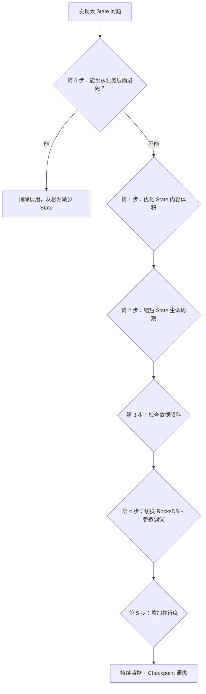
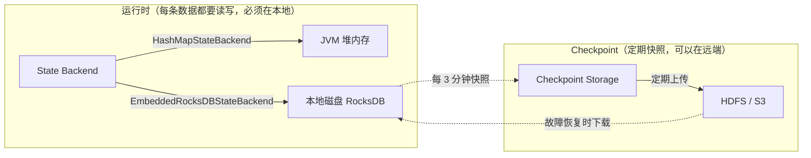
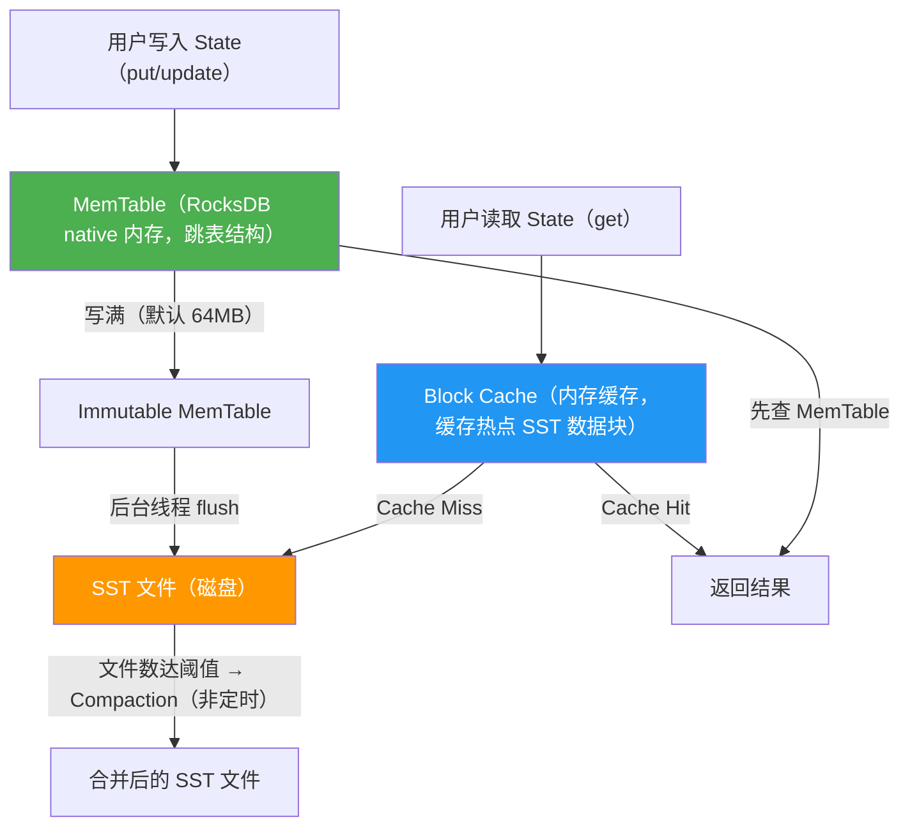
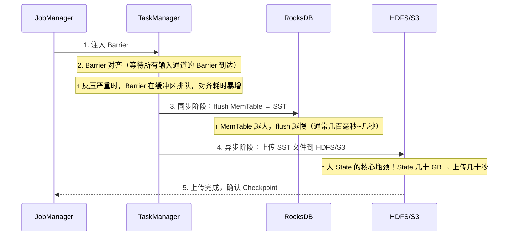

# Flink 大 State 处理专题

> **本文从 [05-Flink.md](./05-Flink.md) 的 5.7 节独立拆分而来**，系统化梳理生产环境中大 State 的排查思路和优化策略。

---

## 目录

- [大 State 处理策略（体系化排查思路）](#大-state-处理策略体系化排查思路)
  - [第 0 步：从业务层面避免不必要的 State](#第-0-步从业务层面避免不必要的-state)
    - 误用 1：把维度数据存在 State 里做 Join
    - 误用 2：存储原始明细而不是增量聚合结果
    - 误用 3：Flink SQL 聚合在高 QPS 下频繁访问 State
    - 误用 4：不需要精确去重时使用精确 State
    - 误用 5：State 中存储可重复计算的冗余信息
  - [第 1 步：优化 State 内容体积（序列化与数据结构）](#第-1-步优化-state-内容体积序列化与数据结构)
    - [1.1 序列化优化：避免 Kryo fallback](#11-序列化优化避免-kryo-fallback)
    - [1.2 MapState 替代 ValueState<集合>](#12-mapstate-替代-valuestate集合)
    - [1.3 自定义 TypeSerializer：当 POJO Serializer 不够用时的兜底方案](#13-自定义-typeserializer当-pojo-serializer-不够用时的兜底方案)
  - [第 2 步：缩短 State 生命周期（TTL 与清理）](#第-2-步缩短-state-生命周期ttl-与清理)
  - [第 3 步：检查数据倾斜](#第-3-步检查数据倾斜)
    - 有窗口场景——两阶段聚合
    - 无窗口场景——LocalKeyBy 预聚合
    - Flink SQL 场景——TWO_PHASE 参数 vs 手工两个 GROUP BY
  - [第 4 步：切换 RocksDB + 参数调优](#第-4-步切换-rocksdb--参数调优)
  - [第 5 步：增加并行度分散 State](#第-5-步增加并行度分散-state)
  - [持续监控 + Checkpoint 调优](#持续监控--checkpoint-调优)
    - 增量 Checkpoint 工作机制
    - Checkpoint 调优参数
    - 监控指标
  - [哪些场景需要 State？（不只是聚合）](#哪些场景需要-state不只是聚合)
    - 场景 1：去重（Deduplication）
    - 场景 2：CEP 复杂事件处理
    - 场景 3：Interval Join
    - 场景 4：自定义窗口触发器 / Timer

---

## 大 State 处理策略（体系化排查思路）

生产环境中，State 可能膨胀到几十 GB 甚至几百 GB，导致三类问题：运行时反压（State 读写慢）、Checkpoint 超时（State 上传慢）、启停/扩缩容慢（State 恢复慢）。排查和优化应按以下顺序逐层递进，先从业务层面消除不必要的 State，再从技术层面优化剩余 State 的存储和管理。



### 第 0 步：从业务层面避免不必要的 State

在优化 State 之前，首先检查是否有**误用 State 的场景**。以下是生产中常见的误用 case 和最优解法：

**误用 1：把维度数据存在 State 里做 Join**

错误做法是把商品信息、用户画像等维度数据全量加载到 `MapState` 或 `BroadcastState` 中，和事实流做 Join。当维度数据量达到百万级时，State 膨胀到几十 GB。

```java
// ❌ 误用：把百万级商品表存到 BroadcastState
MapStateDescriptor<String, Product> desc = new MapStateDescriptor<>("products", ...);
BroadcastStream<Product> broadcast = productStream.broadcast(desc);
// 每个 Sub-Task 都持有一份完整副本，State 膨胀
```

最优解法：维度数据放到外部存储（Redis/HBase），用 Async I/O 或 Temporal Table Join（Flink SQL）按需查询：

```java
// ✅ 正确：Async I/O 查 Redis，State 为零
AsyncDataStream.unorderedWait(orderStream, new RedisAsyncLookup(), 30, TimeUnit.SECONDS, 100);
```

```sql
-- ✅ 正确：Flink SQL Temporal Table Join，Flink 自动管理 Lookup Cache
SELECT o.*, p.product_name FROM orders AS o
JOIN products FOR SYSTEM_TIME AS OF o.proc_time AS p ON o.product_id = p.product_id;
```

**误用 2：存储原始明细而不是增量聚合结果**

错误做法是把窗口内的每条原始数据都存到 `ListState`，窗口触发时再遍历计算。如果窗口时间长或数据量大，State 无限增长。

```java
// ❌ 误用：把每条原始数据存入 ListState
ListState<Event> events = getRuntimeContext().getListState(new ListStateDescriptor<>("events", Event.class));
events.add(currentEvent);  // 窗口内数据越来越多
```

最优解法：用增量聚合（`ReduceFunction` / `AggregateFunction`），State 只存中间结果（如 count、sum），体积从 O(n) 降到 O(1)：

```java
// ✅ 正确：增量聚合，State 只存一个 Long（计数器）
stream.keyBy(...).window(...).aggregate(new AggregateFunction<Event, Long, Long>() {
    public Long createAccumulator() { return 0L; }
    public Long add(Event value, Long acc) { return acc + 1; }
    public Long getResult(Long acc) { return acc; }
    public Long merge(Long a, Long b) { return a + b; }
});
```

**误用 3：Flink SQL 聚合在高 QPS 下频繁访问 State**

Flink SQL 的 Group Aggregate 默认每条数据都会读写一次 State，QPS 高时成为瓶颈。这不是 State 本身大，而是 State 访问频率太高。

最优解法：开启 MiniBatch + LocalGlobal（详见主文档 6.1 节），将多次 State 访问合并为一次，吞吐量提升数倍。

**误用 4：不需要精确去重时使用精确 State**

如果业务只需要近似 UV（允许 1~2% 误差），用精确的 `MapState<userId, Boolean>` 存所有用户 ID 是浪费。

最优解法：用 [HyperLogLog（HLL）](../part3-java-deep/A1-核心数据结构原理.md#九hyperlogloghll用-12kb-估算亿级基数) 估算 UV，State 固定大小约 12KB，不随用户数增长。Flink SQL 中 `APPROX_COUNT_DISTINCT` 内部就是 HLL 实现。

**误用 5：State 中存储可重复计算的冗余信息**

比如在 State 中同时存储 `sum`、`count`、`avg`，其中 `avg = sum / count` 完全可以在输出时计算，无需额外存储。

### 第 1 步：优化 State 内容体积（序列化与数据结构）

确认 State 存的内容是必要的之后，接下来优化每条数据的存储体积。

**1.1 序列化优化：避免 Kryo fallback**

Flink 有三层序列化体系，优先级从高到低：

| 优先级 | 序列化器 | 触发条件 | 性能 | 体积 |
|-------|---------|---------|------|------|
| 1 | **Flink 原生 Tuple Serializer** | 使用 `Tuple2<String, Long>` 等 Flink 内置 Tuple 类型 | 最快 | 最小（字段紧凑排列，无类名/字段名开销） |
| 2 | **POJO Serializer** | 满足 POJO 条件的自定义类 | 快 | 小（按字段顺序序列化，带少量元数据） |
| 3 | **Kryo（兜底）** | 不满足 POJO 条件、或 Flink 无法推断类型 | 慢（比 POJO 慢约 4 倍） | 大（带完整类名、字段名等元数据） |

**Flink 原生 Tuple 是什么？** Flink 提供了 `Tuple0` 到 `Tuple25` 共 26 个泛型类（在 `org.apache.flink.api.java.tuple` 包下），每个 Tuple 的字段数量固定，通过 `.f0`、`.f1`、`.f2` 等公开字段访问。它们不是 Java 的 `java.util.Tuple`（Java 标准库没有 Tuple），而是 Flink 自己实现的：

```java
// Flink 原生 Tuple 示例：字段通过 f0, f1 访问
Tuple2<String, Long> result = Tuple2.of("user_001", 42L);
result.f0;  // "user_001"
result.f1;  // 42L

// Flink 知道 Tuple2 内部精确有 2 个字段，类型分别是 String 和 Long
// 序列化时直接按顺序写入 [String, Long]，无需类名/字段名等元数据
```

**POJO 类能不能表示为原生 Tuple？** 不能直接等价。上面的 `UserState` 有 3 个字段（userId, visitCount, lastVisitTime），你可以改写为 `Tuple3<String, Long, Long>`，序列化效率会略微提升，但代价是代码可读性大幅下降（`tuple.f0` vs `userState.userId`）。实践中的建议是：**简单的中间结果用 Tuple（如 `Tuple2<String, Long>` 做 word count），复杂的业务对象用 POJO**。只要 POJO 满足条件，Flink 的 POJO Serializer 已经足够高效，和 Tuple Serializer 的性能差距在 10% 以内，远小于 Kryo 的 75% 性能损失。

**Kryo 为什么是最差的？** Kryo 是一个通用的 Java 序列化框架，它什么类都能序列化（这是优点），但代价是：序列化时需要写入完整的类名（如 `com.example.BadState`）、字段名、字段类型等元数据，这些冗余信息让序列化后的体积比 POJO Serializer 大 2~5 倍；反序列化时需要通过反射创建对象和设置字段，比直接 `new` + 赋值慢很多。Flink 的 POJO Serializer 之所以快，是因为它在编译期就知道类的结构（字段数量、类型、顺序），序列化时按固定顺序直接写字段值，不需要任何元数据。

Benchmark 数据显示，从 POJO Serializer 降级到 Kryo，**性能损失高达 75%**。

Flink 自动识别 POJO 的条件是：public 类、有无参构造函数、所有字段可序列化且有 getter/setter（或 public 字段）。不满足任何一个条件就会 fallback 到 Kryo。

```java
// ✅ 满足 POJO 条件 → Flink 用高效的 POJO Serializer（自动，无需手动干预）
public class UserState {
    public String userId;        // public 字段
    public long visitCount;
    public long lastVisitTime;
    public UserState() {}        // 无参构造函数
}
// → 序列化时直接按顺序写入 [String, long, long]，无类名开销
// → 这个类也可以改写为 Tuple3<String, Long, Long>，但可读性差

// ❌ 不满足 POJO 条件 → Flink 退化到 Kryo（慢 + 大）
public class BadState {
    private Map<String, List<Integer>> complexField;  // 嵌套泛型，Flink 无法推断类型
    // 没有无参构造函数
    public BadState(String id) { ... }
}
// → 序列化时写入 "com.example.BadState" + 字段名 + 类型标记 + 值，体积膨胀
```

注意：你提到的"String 转数字/hash/bitmap"属于**数据结构精简**，和序列化优化是两个独立的维度。序列化优化是让 Flink 用更高效的序列化器（POJO Serializer 而非 Kryo），不需要手动做 String → 数字转换。但如果你的 State 中确实存了很多长字符串（如 URL、JSON），把它们压缩/编码确实能进一步减小体积：

```java
// 数据结构精简示例：URL 去重不需要存完整 URL
// ❌ 存原始 URL：MapState<String(URL), Boolean>，每条 URL 几百字节
// ✅ 存 URL 的 hash：MapState<Long(murmurhash), Boolean>，每条 8 字节
long urlHash = MurmurHash.hash64(url.getBytes());
deduplicationState.put(urlHash, true);
```

**1.2 MapState 替代 ValueState<集合>**

当需要存储"一个 key 对应多个子项"时，`ValueState<Map>` 或 `ValueState<Set>` 每次读写都要序列化/反序列化整个集合，State 越大越慢。`MapState` 在 RocksDB 中每个 entry 是独立的 key-value 对，只序列化单条数据：

```java
// ❌ ValueState<Set>：每次 get/update 序列化整个 Set（10 万用户 → 序列化 10 万条）
ValueState<Set<String>> usersState;
Set<String> users = usersState.value();  // 反序列化全部
users.add(newUserId);
usersState.update(users);                // 序列化全部

// ✅ MapState：只序列化一条（O(1) vs O(n)）
MapState<String, Boolean> usersMap;
usersMap.put(newUserId, true);           // 只写一条
boolean exists = usersMap.contains(userId); // 只查一条
```

**底层机制：为什么 ValueState 必须整体序列化/反序列化？**

RocksDB 的存储模型是 key-value 对。对于 `ValueState<T>`，Flink 在 RocksDB 中存储为**一个 key-value 对**：key 是 `(keyGroup, userKey, stateNamespace)` 的拼接，value 是整个 `T` 对象的序列化字节。调用 `valueState.value()` 时，Flink 从 RocksDB 读出这一整块字节并反序列化为 `T`；调用 `valueState.update(t)` 时，将 `T` 整体序列化后写回同一个 key。如果 `T` 是 `Set<String>`（包含 10 万个元素），那每次 `value()` 和 `update()` 都要序列化/反序列化这 10 万个元素——即使你只改了一个。

`MapState<UK, UV>` 的存储模型不同：每个 entry 在 RocksDB 中是**独立的 key-value 对**，key 是 `(keyGroup, userKey, stateNamespace, mapKey)` 的拼接，value 是单个 `UV` 的序列化字节。所以 `mapState.put(k, v)` 只序列化/写入一条记录，`mapState.get(k)` 只读取/反序列化一条记录。

**各种 State 类型的序列化行为对比**：

| State 类型 | RocksDB 中的存储方式 | 单次读写的序列化量 | 适用场景 |
|-----------|--------------------|-----------------|---------|
| `ValueState<T>` | 一个 KV 对，value = 整个 T | O(n)——整体序列化 | T 是简单类型（Boolean、Long、POJO）时最优 |
| `MapState<UK, UV>` | 每个 entry 一个 KV 对 | O(1)——单条序列化 | 一个 key 下有多个子项（如用户下的多个订单） |
| `ListState<T>` | 追加时一个 KV 对，**读取时整体反序列化** | 写 O(1)，读 O(n) | 适合只追加不读的场景（如 Checkpoint 时 flush）|
| `ReducingState<T>` / `AggregatingState` | 一个 KV 对，value = 聚合结果 | O(1)——只存聚合值 | 增量聚合场景（sum/count/max） |

注意：`ListState` 有一个容易踩的坑——`add()` 操作在 RocksDB backend 上确实是 O(1)（追加一个 KV 对），但 `get()` 返回的 `Iterable` 需要读取该 key 下的所有 entry 并逐条反序列化，是 O(n) 的。如果你频繁读取 ListState，性能可能比预期差很多。

**1.3 自定义 TypeSerializer：当 POJO Serializer 不够用时的兜底方案**

> **关于 Kryo 的定位澄清**：Flink 中 Kryo 是最差的兜底序列化器（1.1 节已说明性能损失 75%），而不是像 Spark 中那样是"推荐的高性能替代方案"。Flink 的优化路径是：**让类满足 POJO 条件 → 用 Flink POJO Serializer**（这已经足够高效）。只有当类结构复杂、无法满足 POJO 条件、且已经 fallback 到 Kryo 时，才需要考虑自定义 TypeSerializer。自定义 Serializer 的实现可以用 Protobuf、Avro 或手写二进制格式，核心目标是**绕过 Kryo 的性能损失**，而不是"替代 Java 原生序列化"（Flink State 本身就不用 Java 原生序列化）。

**什么时候需要自定义 TypeSerializer？**

```
优先级（从高到低）：
  ① 让类满足 POJO 条件 → Flink 自动用 PojoSerializer（最简单，性能好）
  ② 用 Flink 原生 Tuple 类型 → TupleSerializer（最快，但可读性差）
  ③ 自定义 TypeSerializer → 完全控制序列化逻辑（最灵活，但开发成本高）

只有以下场景才需要走到 ③：
  - 类包含 Flink 无法推断的嵌套泛型（如 Map<String, List<MyObj>>）
  - 类来自第三方库，无法修改使其满足 POJO 条件
  - 对序列化体积有极致要求（如 State 几百 GB，每字节都要省）
```

**"自定义 TypeSerializer" 到底指什么？** 下面的代码示例中有两个角色：`TypeInformation`（类型信息）是"自定义序列化"的关键——它告诉 Flink "这个类的结构是什么，应该用哪个 Serializer 来处理"。`ValueStateDescriptor` 只是一个 State 的描述符（名字 + 类型），它本身不做序列化。真正的序列化逻辑由 `TypeInformation` 内部关联的 `TypeSerializer` 完成：

```java
// 第 1 步：声明 TypeInformation —— 这一步是「自定义序列化」的核心
// TypeInformation.of() 会让 Flink 的类型系统分析 MyState 的结构
// 如果 MyState 满足 POJO 条件 → 自动使用 PojoSerializer
// 如果不满足 → fallback 到 Kryo（这正是我们要避免的）
TypeInformation<MyState> stateType = TypeInformation.of(new TypeHint<MyState>() {});

// 第 2 步：用 TypeInformation 创建 StateDescriptor
// descriptor 绑定了 stateType 中的 Serializer，后续 State 读写时用它来序列化
ValueStateDescriptor<MyState> descriptor = new ValueStateDescriptor<>("state", stateType);
```

如果你需要完全控制序列化逻辑（比如用 Protobuf），可以实现自定义的 `TypeSerializer<MyState>` 并通过 `ValueStateDescriptor` 的构造函数直接传入。下面是一个**完整可运行的骨架**：

```java
import org.apache.flink.api.common.typeutils.TypeSerializer;
import org.apache.flink.api.common.typeutils.TypeSerializerSnapshot;
import org.apache.flink.core.memory.DataInputView;
import org.apache.flink.core.memory.DataOutputView;

/**
 * 用 Protobuf 实现的自定义 TypeSerializer。
 * 适用场景：MyState 无法满足 POJO 条件，且 Kryo fallback 性能不可接受。
 */
public class MyProtobufSerializer extends TypeSerializer<MyState> {

    // ===== 序列化 =====
    @Override
    public void serialize(MyState record, DataOutputView target) throws IOException {
        byte[] bytes = record.toProto().toByteArray();  // Protobuf 序列化
        target.writeInt(bytes.length);                   // 先写长度
        target.write(bytes);                             // 再写字节
    }

    // ===== 反序列化 =====
    @Override
    public MyState deserialize(DataInputView source) throws IOException {
        int len = source.readInt();
        byte[] bytes = new byte[len];
        source.readFully(bytes);
        return MyState.fromProto(MyStateProto.parseFrom(bytes));  // Protobuf 反序列化
    }

    @Override
    public MyState deserialize(MyState reuse, DataInputView source) throws IOException {
        return deserialize(source);  // 不复用对象，直接新建
    }

    // ===== 复制（Checkpoint 时需要深拷贝）=====
    @Override
    public MyState copy(MyState from) {
        // 通过 Protobuf 序列化/反序列化实现深拷贝（简单但有 CPU 开销）
        return MyState.fromProto(from.toProto());
    }

    @Override
    public MyState copy(MyState from, MyState reuse) {
        return copy(from);
    }

    @Override
    public void copy(DataInputView source, DataOutputView target) throws IOException {
        int len = source.readInt();
        target.writeInt(len);
        byte[] bytes = new byte[len];
        source.readFully(bytes);
        target.write(bytes);
    }

    // ===== 元信息 =====
    @Override
    public boolean isImmutableType() { return false; }

    @Override
    public TypeSerializer<MyState> duplicate() { return this; }  // 无状态，可共享

    @Override
    public MyState createInstance() { return new MyState(); }

    @Override
    public int getLength() { return -1; }  // 变长

    @Override
    public boolean equals(Object obj) { return obj instanceof MyProtobufSerializer; }

    @Override
    public int hashCode() { return MyProtobufSerializer.class.hashCode(); }

    // ===== Snapshot（State 兼容性演进需要）=====
    @Override
    public TypeSerializerSnapshot<MyState> snapshotConfiguration() {
        return new MyProtobufSerializerSnapshot();
    }
}

// ===== 使用方式 =====
// 直接传入自定义 Serializer，完全绕过 Flink 的类型推断
ValueStateDescriptor<MyState> descriptor = new ValueStateDescriptor<>(
    "my-state",
    new MyProtobufSerializer()
);
ValueState<MyState> state = getRuntimeContext().getState(descriptor);
```

> **开发成本提醒**：自定义 TypeSerializer 需要实现约 15 个方法（包括 `snapshotConfiguration` 用于 State 兼容性演进），还需要配套实现 `TypeSerializerSnapshot`。如果你的类只是因为缺少无参构造函数或字段不是 public 而 fallback 到 Kryo，**优先修改类本身使其满足 POJO 条件**，成本远低于自定义 Serializer。

### 第 2 步：缩短 State 生命周期（TTL 与清理）

大 State 最常见的根源是"只写不删"——数据源源不断流入，但过期数据永远不清理。

**检查 TTL 是否合理**：State 的 TTL 应该与业务语义精确匹配，不是越长越安全。TTL 设太长等于不清理，设太短会丢数据：

| 业务场景 | 推荐 TTL |
|---------|---------|
| 用户会话统计 | 会话最大超时 + 缓冲（如 30min + 10min = 40min） |
| 7 日留存窗口 | 7 天 + 1 天 = 8 天 |
| 实时去重 | 业务允许的重复窗口（如 24 小时） |
| 实时 TopN | 统计周期 + 缓冲（如 1 天 + 2 小时） |

```java
// ===== 第一步：构建 TTL 配置 =====
StateTtlConfig ttl = StateTtlConfig.newBuilder(Time.days(7))
    .setUpdateType(StateTtlConfig.UpdateType.OnCreateAndWrite)   // 创建和写入时刷新 TTL
    .setStateVisibility(StateTtlConfig.StateVisibility.NeverReturnExpired)  // 不返回已过期的状态
    .cleanupIncrementally(10, true)   // 增量清理：每次读取时顺带检查 10 条，true=也在 Checkpoint 时清理
    .build();

// ===== 第二步：绑定到 StateDescriptor =====
// 注意：enableTimeToLive() 必须在 getRuntimeContext().getState() 之前调用
ValueStateDescriptor<UserSession> descriptor =
    new ValueStateDescriptor<>("user-session", UserSession.class);
descriptor.enableTimeToLive(ttl);   // ← 绑定 TTL，这一步是关键

// ===== 第三步：在 KeyedProcessFunction 的 open() 中注册 State =====
// open() 是 Flink 算子的生命周期方法，在算子初始化时调用一次（类似 Spring 的 @PostConstruct）
// 它所在的外部框架是 KeyedProcessFunction —— Flink 中最灵活的有状态算子

/**
 * KeyedProcessFunction 是 Flink DataStream API 中最底层的有状态处理函数。
 * 泛型参数：<KEY类型, 输入类型, 输出类型>
 * 它提供了：State ���问、Timer 注册、侧输出 等能力。
 */
public class SessionTracker extends KeyedProcessFunction<String, Event, SessionResult> {

    // State 声明为类的成员变量（不能在构造函数中初始化，必须在 open() 中）
    private transient ValueState<UserSession> sessionState;

    // TTL 配置（可以定义为常量或在 open() 中构建）
    private static final StateTtlConfig TTL_CONFIG = StateTtlConfig.newBuilder(Time.days(7))
        .setUpdateType(StateTtlConfig.UpdateType.OnCreateAndWrite)
        .setStateVisibility(StateTtlConfig.StateVisibility.NeverReturnExpired)
        .cleanupIncrementally(10, true)
        .build();

    /**
     * open() —— 算子生命周期初始化方法
     * 在每个 Sub-Task 启动时调用一次，用于初始化 State、连接外部系统等。
     * 类比：Spring Bean 的 @PostConstruct / Servlet 的 init()
     */
    @Override
    public void open(Configuration parameters) throws Exception {
        // ValueStateDescriptor 的作用：
        //   1. 给 State 命名（"user-session"）—— 用于 Checkpoint 持久化和恢复时的标识
        //   2. 声明 State 的值类型（UserSession.class）—— Flink 据此选择序列化器
        //   3. 绑定 TTL 配置 —— 控制 State 的自动过期清理
        //   4. （可选）指定自定义 Serializer —— 绕过默认的类型推断
        ValueStateDescriptor<UserSession> descriptor =
            new ValueStateDescriptor<>("user-session", UserSession.class);
        descriptor.enableTimeToLive(TTL_CONFIG);   // 绑定 TTL
        // descriptor.setDefaultValue(new UserSession());  // 可选：设置默认值

        // getRuntimeContext().getState() 向 Flink 运行时注册这个 State
        // 返回的 ValueState 对象是当前 key 的 State 句柄
        sessionState = getRuntimeContext().getState(descriptor);
    }

    /**
     * processElement() —— 每条数据到达时调用
     * 这里可以读写 State、注册 Timer、输出结果
     */
    @Override
    public void processElement(Event event, Context ctx, Collector<SessionResult> out) throws Exception {
        UserSession session = sessionState.value();  // 读 State（当前 key 的）
        if (session == null) {
            session = new UserSession();
        }
        session.addEvent(event);
        sessionState.update(session);  // 写 State
        // ... 业务逻辑
    }
}

// MapState / ListState 的绑定方式完全一样：
MapStateDescriptor<String, Long> mapDesc =
    new MapStateDescriptor<>("click-map", String.class, Long.class);
mapDesc.enableTimeToLive(TTL_CONFIG);   // 同样调用 enableTimeToLive()
MapState<String, Long> clickMap = getRuntimeContext().getMapState(mapDesc);
```

**ValueStateDescriptor 能设置哪些内容**：

| 设置项 | 方法 | 作用 |
|-------|------|------|
| **State 名称** | 构造函数第 1 参数 | Checkpoint 持久化标识，改���会导致旧 State 丢失 |
| **值类型** | 构造函数第 2 参数（Class 或 TypeInformation） | Flink 据此选择序列化器 |
| **TTL** | `enableTimeToLive(StateTtlConfig)` | 自动过期清理 |
| **默认值** | `setDefaultValue(T)` | `value()` 返回 null 时的替代值（已废弃，建议代码中判空） |
| **自定义序列化器** | 构造函数传入 `TypeSerializer<T>` | 完全控制序列化逻辑（见 1.3 节） |
| **可查询 State** | `setQueryable(String name)` | 允许外部客户端查询此 State（Queryable State，生产少用） |

**TTL 的三个 UpdateType 选项说明**：

| UpdateType | 含义 | 适用场景 |
|-----------|------|---------|
| `OnCreateAndWrite` | 创建和每次写入时重置 TTL（最常用） | 活跃用户会话、滑动窗口去重 |
| `OnReadAndWrite` | 读取和写入都重置 TTL | 需要"最近访问时间"语义的场景 |
| `Disabled` | 不更新 TTL，只在创建时设置一次 | 固定过期时间（如 7 日留存窗口） |

**注意**：State TTL 的清理不是精确的——过期数据不会立刻被删除，而是在下次访问或 RocksDB Compaction 时才被清理。如果需要更及时的清理，可以用 Timer 回调主动删除：

```java
// ===== Timer 主动清理的完整外部框架 =====
// 同样继承 KeyedProcessFunction，泛型：<KEY类型, 输入类型, 输出类型>
public class EventStateWithTimer extends KeyedProcessFunction<String, Event, Result> {

    private transient ValueState<Event> state;

    @Override
    public void open(Configuration parameters) throws Exception {
        // State 在 open() 中初始化（不带 TTL，由 Timer 手动控制清理时机）
        ValueStateDescriptor<Event> descriptor =
            new ValueStateDescriptor<>("event-state", Event.class);
        state = getRuntimeContext().getState(descriptor);
    }

    /**
     * processElement() —— 每条数据到达时调用
     * 写入 State，并注册一个 24 小时后的 Timer
     */
    @Override
    public void processElement(Event event, Context ctx, Collector<Result> out) throws Exception {
        state.update(event);
        // 注册一个 24 小时后的事件时间 Timer
        // registerEventTimeTimer：基于事件时间（Watermark 推进时触发）
        // registerProcessingTimeTimer：基于处理时间（系统时钟到达时触发）
        ctx.timerService().registerEventTimeTimer(event.getTimestamp() + 24 * 3600 * 1000L);
    }

    /**
     * onTimer() —— Timer 到期时由 Flink 框架回调
     * 注意：onTimer 和 processElement 不会并发执行（同一个 key 串行），无需加锁
     *
     * @param timestamp  触发的 Timer 时间戳（就是注册时传入的那个值）
     * @param ctx        OnTimerContext，可以获取当前 key、时间域等信息
     * @param out        输出收集器，可以在 Timer 回调里输出结果
     */
    @Override
    public void onTimer(long timestamp, OnTimerContext ctx, Collector<Result> out) throws Exception {
        // Timer 到期，主动清理 State（比 TTL 更精确，精确到毫秒）
        state.clear();
        // 也可以在这里输出一个超时告警：
        // out.collect(new Result(ctx.getCurrentKey(), "expired"));
    }
}

// ===== 使用方式：接入 DataStream =====
DataStream<Event> eventStream = ...;
DataStream<Result> result = eventStream
    .keyBy(Event::getUserId)                    // 按 userId 分区，State 按 key 隔离
    .process(new EventStateWithTimer());         // 挂载上面的 ProcessFunction
```

**`KeyedProcessFunction` 的核心能力对比**：

| 能力 | KeyedProcessFunction | WindowFunction | FlatMapFunction |
|------|---------------------|----------------|-----------------|
| **访问 State** | ✅ 任意 State 类型 | ✅ 窗口内 State | ❌ 无 State |
| **注册 Timer** | ✅ 事件时间 + 处理时间 | ❌ | ❌ |
| **侧输出（Side Output）** | ✅ | ✅ | ❌ |
| **访问当前 key** | ✅ `ctx.getCurrentKey()` | ✅ | ❌ |
| **灵活性** | 最高（完全自定义触发逻辑） | 中（窗口触发） | 最低（无状态） |
| **典型场景** | 去重、CEP、超时检测、自定义窗口 | 标准时间窗口聚合 | 无状态转换 |

**检查聚合 key 粒度是否合理**：key 粒度对 State 总量的影响取决于你在 State 里存什么。需要分两种情况理解：

- **聚合场景（State 存聚合结果）**：key 粒度越细，State 条目越多。比如按 `user_id` 聚合 PV，State 有 100 万条（每个用户一条）；按 `user_id + page_url` 聚合，State 可能有 1 亿条（每个用户×页面一条），每条虽然都只存一个 count 值，但总条目数暴增 → State 总量更大。
- **明细场景（State 存原始数据）**：如果你存的是每个 key 下的行为明细（如用户的点击事件列表），那 key 粒度越粗，单个 key 下的明细越多 → 单个 State 越大。但这种情况下更应该关注的是 State 误用（应该用增量聚合替代存明细，见第 0 步误用 2）。

一般来说，如果业务允许更粗的粒度，优先用更粗的 key 来减少 State 条目总数。

### 第 3 步：检查数据倾斜

通过 Flink Web UI → Task Metrics，按 Sub-Task 查看 `rocksdb_estimate_live_data_size`。如果某个 Sub-Task 的 State 量远大于其他，说明存在数据倾斜。

解决方案详见主文档面试考点 15（数据倾斜处理），核心手段包括：

- 重新设计聚合 key：拆分热点 key（如"匿名用户"占 80%），用 `userId + 随机后缀` 打散后二次聚合
- 有窗口场景：两阶段聚合（加随机前缀 keyBy → 窗口聚合 → 去前缀 keyBy → 二次聚合）
- 无窗口场景：LocalKeyBy 预聚合（在 keyBy 上游用 buffer 攒一批数据预聚合后再发下游）
- Flink SQL 场景：开启 LocalGlobal（`table.optimizer.agg-phase-strategy: TWO_PHASE`）和 Split Distinct

**有窗口场景——两阶段聚合代码示例**：假设你要统计每个城市的实时订单量，但 `city_id = "北京"` 的订单占 80%（热点 key），导致一个 Sub-Task 的 State 远大于其他。解决办法是在第一阶段给 key 加随机后缀打散，第二阶段再合并回来：

```java
// ===== 真实 case：城市维度的实时订单量统计，北京是热点 key =====

// 第一阶段：加随机后缀打散热点 key
DataStream<Tuple2<String, Long>> firstStage = orderStream
    .map(order -> {
        // 给所有 key 加随机后缀（0~9），热点 key 被分散到 10 个 Sub-Task
        String saltedKey = order.getCityId() + "_" + ThreadLocalRandom.current().nextInt(10);
        return Tuple2.of(saltedKey, 1L);
    })
    .returns(Types.TUPLE(Types.STRING, Types.LONG))
    .keyBy(t -> t.f0)
    .window(TumblingEventTimeWindows.of(Time.minutes(1)))
    .reduce((a, b) -> Tuple2.of(a.f0, a.f1 + b.f1));
    // State 中有 "北京_0"..."北京_9" 共 10 个 key，每个 State 只有原来的 1/10

// 第二阶段：去掉后缀，合并回真正的 city_id
DataStream<Tuple2<String, Long>> result = firstStage
    .map(t -> Tuple2.of(t.f0.split("_")[0], t.f1))  // "北京_3" → "北京"
    .returns(Types.TUPLE(Types.STRING, Types.LONG))
    .keyBy(t -> t.f0)
    .window(TumblingEventTimeWindows.of(Time.minutes(1)))
    .reduce((a, b) -> Tuple2.of(a.f0, a.f1 + b.f1));
    // 最终输出：("北京", 总订单量)
```

注意第二阶段的窗口必须和第一阶段一致（都是 1 分钟滚动窗口），否则不同窗口的数据会被混在一起。

---

**无窗口场景——LocalKeyBy 预聚合前后对比**：

无窗口的实时聚合（如持续统计每个 key 的累计 PV）不能用上面的两阶段窗口聚合，因为没有窗口触发点。LocalKeyBy 的思路是：**在 keyBy 上游的每个 Sub-Task 本地攒一批数据先做局部聚合，再发给下游 keyBy 算子**，大幅减少发往下游的数据量和 State 写入压力。

```java
// ===== 改造前：直接 keyBy，热点 key 全部打到同一个 Sub-Task =====
// 问题：所有 "北京" 的事件都路由到同一个 Sub-Task，该 Sub-Task 的 State 和 CPU 成为瓶颈
stream
    .keyBy(Event::getCityId)
    .process(new CityPvCounter());   // 每条数据都要读写一次 State

// ===== 改造后：LocalKeyBy 预聚合，先在本地攒批再发下游 =====
stream
    .flatMap(new LocalKeyByFlatMap(100))  // ← 本地攒 100 条后预聚合，再发下游
    .keyBy(t -> t.f0)                     // 下游收到的数据量已大幅减少
    .process(new CityPvCounter());

/**
 * LocalKeyBy 核心实现：在本地用 HashMap 攒批，达到阈值后批量输出
 * 每个 Sub-Task 独立维护一个本地 HashMap，不涉及 Flink State（不需要 Checkpoint）
 */
public class LocalKeyByFlatMap
        extends RichFlatMapFunction<Event, Tuple2<String, Long>> {

    private final int batchSize;
    private Map<String, Long> localBuffer = new HashMap<>();  // 本地聚合缓冲区
    private int count = 0;

    public LocalKeyByFlatMap(int batchSize) {
        this.batchSize = batchSize;
    }

    @Override
    public void flatMap(Event event, Collector<Tuple2<String, Long>> out) {
        // 本地累加（不走 Flink State，只是普通 HashMap）
        localBuffer.merge(event.getCityId(), 1L, Long::sum);
        count++;

        if (count >= batchSize) {
            // 达到阈值，把本地聚合结果发给下游 keyBy 算子
            localBuffer.forEach((city, cnt) -> out.collect(Tuple2.of(city, cnt)));
            localBuffer.clear();
            count = 0;
        }
    }

    @Override
    public void close() {
        // 任务结束时把剩余数据 flush 出去，避免数据丢失
        localBuffer.forEach((city, cnt) -> /* 需要 Collector，此处略 */ {});
    }
}
```

**改造效果对比**：

| 维度 | 改造前（直接 keyBy） | 改造后（LocalKeyBy） |
|------|--------------------|--------------------|
| 下游数据量 | 每条原始数据都发下游 | 每 100 条聚合成少量结果再发 |
| 下游 State 写入次数 | 每条数据写一次 | 每批写一次（减少 ~99%） |
| 热点 key 压力 | 全部集中在一个 Sub-Task | 上游各 Sub-Task 分担了大部分 |
| 延迟 | 实时（每条触发） | 轻微增加（攒满 batchSize 才输出） |
| 精确性 | 精确 | 精确（只是延迟了输出，不影响最终结果） |

> **LocalKeyBy 的局限**：`batchSize` 是按条数触发的，如果某个 key 的数据量很少（如冷门城市），可能长时间攒不满 batchSize，导致输出延迟。生产中通常结合定时 flush（如每 200ms 强制输出一次）来解决。

---

**Flink SQL 场景——`TWO_PHASE` 参数 vs 手工两个 GROUP BY**：

Flink SQL 的 `table.optimizer.agg-phase-strategy: TWO_PHASE` 是自动两阶段聚合，和手工写两个 GROUP BY 的核心逻辑相同，但有重要区别：

| 维度 | `TWO_PHASE` 参数（自动） | 手工两个 GROUP BY |
|------|------------------------|-----------------|
| **适用范围** | 只对 `count(distinct)` 生效，普通 `count/sum` 不拆分 | 对所有聚合生效 |
| **打散粒度** | 由 `distinct-agg.split.bucket-num` 控制（如 1024） | 手工控制（如 `MOD(HASH_CODE(union_id), 4096)`） |
| **多 distinct key** | 每个 distinct key 独立打散，不能同时处理多个 | 可以同时处理多个 distinct key（`event_identifier` 和 `union_id`） |
| **多维 UNION ALL** | 不支持，无法自动展开多维组合 | 手工写多个 UNION ALL 分支，完全可控 |
| **透明度** | 黑盒，出问题难排查 | 白盒，逻辑完全可控 |
| **适合场景** | 简单单维聚合，快速开启 | 复杂多维聚合（多个 distinct key + 多维 UNION ALL） |

**自动 TWO_PHASE 的改写原理**：

```sql
-- 原始 SQL（单个 count distinct）
SELECT city_id, count(distinct user_id) as uv
FROM t GROUP BY city_id

-- Flink 自动改写为两阶段（等价于手工写法）：
-- 第一阶段：加 bucket 维度，在桶内做局部去重
SELECT city_id,
       MOD(HASH_CODE(user_id), 1024) as bucket,
       count(distinct user_id) as partial_uv
FROM t
GROUP BY city_id, MOD(HASH_CODE(user_id), 1024)

-- 第二阶段：去掉 bucket，sum 合并各桶结果
SELECT city_id, SUM(partial_uv) as uv
FROM first_stage
GROUP BY city_id
```

**为什么同一个 `user_id` 不会被重复计数？** 因为 `HASH_CODE(user_id)` 是固定的，同一个 `user_id` 永远落在同一个桶里。第一阶段在桶内做 `count(distinct user_id)`，同一个桶内的去重是精确的；第二阶段 `SUM` 各桶的去重结果，由于不同桶之间没有重叠，加起来就是全局精确去重数。

**你的 SQL 分析**：你的作业手工实现了两阶段聚合，用 `MOD(HASH_CODE(union_id), 4096)` 打散，逻辑完全正确。因为你同时有 `count(distinct event_identifier)` 和 `count(distinct union_id)` 两个 distinct key，且有多维 UNION ALL 组合，手工写比开 `TWO_PHASE` 参数更合适——自动参数无法同时处理两个 distinct key 的打散，也无法自动展开你的多维组合。

抽取核心示例代码（去掉业务细节，保留两阶段聚合的骨架）：

```sql
-- ===== Flink SQL 手工两阶段聚合核心示例 =====
-- 场景：统计每个 city 的 UV（count distinct user_id），user_id 存在热点倾斜

-- 第一阶段：加 bucket 维度打散，在桶内局部去重
-- MOD(HASH_CODE(user_id), 4096) 保证同一 user_id 永远落在同一个桶，不会重复计数
CREATE VIEW first_stage AS
SELECT
    TUMBLE_START(event_time, INTERVAL '10' MINUTE) AS window_start,
    TUMBLE_ROWTIME(event_time, INTERVAL '10' MINUTE) AS event_time,  -- 保留 ROWTIME 属性供第二阶段使用
    city_id,
    MOD(HASH_CODE(user_id), 4096) AS bucket,   -- 打散维度，4096 个桶
    count(DISTINCT user_id) AS partial_uv       -- 桶内精确去重
FROM source_table
GROUP BY
    TUMBLE(event_time, INTERVAL '10' MINUTE),
    MOD(HASH_CODE(user_id), 4096),             -- bucket 必须在 GROUP BY 里
    city_id;

-- 第二阶段：去掉 bucket，SUM 合并各桶结果
INSERT INTO sink_table
SELECT
    DATE_FORMAT(TUMBLE_START(event_time, INTERVAL '10' MINUTE), 'yyyy-MM-dd HH:mm') AS window_start,
    city_id,
    SUM(partial_uv) AS uv    -- 各桶结果相加，等于全局精确去重数
FROM first_stage
GROUP BY
    TUMBLE(event_time, INTERVAL '10' MINUTE),  -- 窗口必须与第一阶段一致
    city_id;                                    -- 去掉 bucket，只保留业务维度

-- ===== 关键点说明 =====
-- 1. 第一阶段用 TUMBLE_ROWTIME（保留事件时间属性），第二阶段才能继续用事件时间窗口
--    如果用 TUMBLE_START（返回普通 TIMESTAMP），第二阶段无法再用事件时间窗口
-- 2. bucket 只在第一阶段的 GROUP BY 中出现，第二阶段去掉它
-- 3. 两阶段的窗口大小必须完全一致，否则不同窗口的数据会被混在一起
-- 4. 同一 user_id 的 HASH_CODE 固定 → 永远落在同一个桶 → 不会跨桶重复计数
```

### 第 4 步：切换 RocksDB + 参数调优

如果 State 确实需要几十 GB 乃至更大，HashMapStateBackend（纯堆内存）已经不适用，必须使用 `EmbeddedRocksDBStateBackend`。

> **注意**：从 Flink 1.13 开始，默认的 State Backend 已经是 `HashMapStateBackend`（对应旧版的 `MemoryStateBackend` / `FsStateBackend`）。但在大多数生产环境中，用户会显式配置为 `EmbeddedRocksDBStateBackend`。如果你的集群已经在 `flink-conf.yaml` 中配置了 `state.backend: rocksdb`，则无需再手动切换。这里的"切换"是指：如果你当前还在用 `HashMapStateBackend`（State 在堆内存），需要改为 RocksDB。

**先澄清一个常见误解：能不能把 State Backend 改到 HDFS 来存更大的 State？**

不能。需要区分两个概念：**State Backend**（状态后端）决定运行时 State 存在哪里，**Checkpoint Storage**（检查点存储）决定快照保存到哪里。



运行时的 State 必须在本地（堆内存或本地磁盘），因为每条数据处理时都要 `state.get()` / `state.put()`，如果 State 在 HDFS 上，每次读写都要走网络 I/O，延迟从微秒级变成毫秒级甚至秒级，实时流处理完全不可用。HDFS 在这个体系里只是"备份仓库"（存 Checkpoint 快照），不是"工作台"（运行时 State）。想存更大的 State，正确做法是优化 State 内容 + RocksDB 调优 + 增加并行度分散，而不是把 State 搬到远端。

**RocksDB 的数据流转机制**：

选择 RocksDB 作为 State Backend 后，数据的完整流转路径是：



几个关键澄清：

- **不存在"先用 HashMap 再自动切换到 RocksDB"的机制**。选择哪种 State Backend 是部署时配置的，运行时不会自动切换。
- **数据一上来就进 RocksDB**。写入时先进 RocksDB 的 MemTable（native 内存，不在 JVM 堆上），MemTable 写满后 flush 到磁盘的 [SST 文件](../part3-java-deep/A1-核心数据结构原理.md#十一lsm-tree-与-sst-文件写优化存储引擎的通用原理)（Sorted String Table，有序字符串表）。所以写操作确实先进内存，但这是 RocksDB 内部的 MemTable，不是 Flink 的 HashMapStateBackend。
- **RocksDB 并没有"根据阈值选择存内存还是硬盘"**。所有数据最终都会落盘为 [SST 文件](../part3-java-deep/A1-核心数据结构原理.md#十一lsm-tree-与-sst-文件写优化存储引擎的通用原理)（MemTable 满了就刷盘），读取时通过 Block Cache 缓存热点数据到内存。
- **MemTable 和 Block Cache 的总内存**由 Flink 的 Managed Memory 控制（`taskmanager.memory.managed.fraction`，默认 0.4），Flink 通过 Write Buffer Manager 确保 RocksDB 不超出预算。

**RocksDB Compaction 的触发机制**：Compaction 不是定时执行的，而是由 SST 文件数量或文件大小触发的。RocksDB 有两种主要的 Compaction 策略：

- **Level Compaction**（Flink 默认，适合大 State）：L0 层的 SST 文件数量达到阈值（默认 4 个）时触发 L0→L1 的 Compaction；L1 及以下各层，当该层的总文件大小超过目标大小（每层比上一层大 10 倍）时触发向下一层的 Compaction。后台 Compaction 线程会持续监控这些条件，一旦满足就自动执行，不需要等待任何定时器。
- **Size-Tiered Compaction**（Universal Compaction）：当同一层内积累了足够多的大小相近的 SST 文件时触发合并。写放大更低，但读放大和空间放大更高。

Compaction 期间会消耗 CPU 和磁盘 I/O。如果 Compaction 速度跟不上写入速度（`rocksdb_compaction_pending` 指标持续增长），会导致 L0 文件堆积 → 读放大 → State 读取变慢 → 反压。可以通过增加后台线程数（`state.backend.rocksdb.thread.num`）来加速 Compaction。

**RocksDB 理论上能用满磁盘吗？**

理论上可以——RocksDB 数据存在本地磁盘，不受 JVM 堆限制，上限就是磁盘容量。但实际生产中有三个约束：

1. **Managed Memory 限制运行性能**：MemTable + Block Cache 的内存受限（由 `taskmanager.memory.managed.fraction` 控制，默认 0.4）。但 **State 总量大 ≠ 性能差，真正的触发条件是"热点工作集超出 Block Cache"**。

   具体分析：MemTable 是写缓冲区（默认 64MB × 3 个 = 192MB），写满就刷盘，它的大小不会因为磁盘上的 State 增大而"撑爆"内存。Block Cache 是读缓存，缓存热点 SST 数据块。两者共享 Managed Memory 预算，调大一个会挤压另一个。

   ```
   性能瓶颈的精确触发条件：

   ① 读瓶颈（最常见）：
      热点工作集大小 > Block Cache 大小 → Cache Miss 率飙升 → 大量磁盘 I/O
      
      例 1：State 100GB，但每秒访问的热点 key 只有 500MB
        → Block Cache 1GB 就够，性能完全正常，和 State 1GB 时没有区别
      
      例 2：State 10GB，但热点 key 均匀分布在全部 10GB 上
        → Block Cache 再大也不够（除非开到 10GB），每次都走磁盘
        → 这种场景才是真正的性能崩溃

   ② 写瓶颈（高 QPS 场景）：
      写入 QPS 极高 → MemTable 频繁写满 → Immutable MemTable 堆积
      → flush 和 Compaction 更频繁 → 磁盘 I/O 竞争 → Write Stall
      
      假设把 MemTable 从 64MB 开到 10GB：
      → 刷盘频率从"每 64MB 刷一次"变成"每 10GB 刷一次"
      → Compaction 频率大幅降低，写性能确实能撑住
      → 但代价：10GB MemTable 挤压了 Block Cache 的内存预算
      → 读性能反而可能变差（Block Cache 被压缩）
      → 且故障时 WAL 回放 10GB 数据，恢复时间极长

   ③ 结论：
      "State 到达一个限度才体现性能问题"——这个限度不是 State 总量
      而是：热点工作集 > Block Cache（读瓶颈）
      或者：写入 QPS > MemTable flush 速度（写瓶颈）
      
      调大 MemTable 能缓解写瓶颈，但不能解决读瓶颈，且会挤压 Block Cache
      正确做法是根据读写比例合理分配 MemTable 和 Block Cache 的内存占比
   ```

   > **参数调优建议**：读多写少的场景（如大量 State 查询），优先调大 Block Cache（`state.backend.rocksdb.block.cache-size`）；写多读少的场景（如高 QPS 写入），优先调大 MemTable（`state.backend.rocksdb.writebuffer.size` + `writebuffer.count`）。两者总量受 Managed Memory 约束，需要在读写之间做 trade-off。详见 [A1 附录 · LSM-Tree 与 SST 文件 · Block Cache 与 MemTable 的内存分工](../part3-java-deep/A1-核心数据结构原理.md#117-block-cache-与-memtable-的内存分工)。
2. **Checkpoint 上传瓶颈**：本地 State 越大，Checkpoint 时上传到 HDFS/S3 的数据越多。即使是增量 Checkpoint，也有增量链回溯开销。超过 `checkpoint.timeout` 就会失败。
3. **磁盘 I/O 写放大**：LSM-Tree 的多层 Compaction 导致实际写入磁盘的数据量是用户数据的 10~30 倍。HDD 上 State 几十 GB 就可能把 I/O 打满。

生产建议：单个 TaskManager 的 State 控制在几十 GB 以内，磁盘务必使用 SSD。

> **关于 SST 文件、LSM-Tree 等存储引擎的通用知识**（MemTable → Immutable MemTable → SST → Compaction 的分层结构），不仅 RocksDB 使用，Doris BE、HBase（HFile + MemStore）、Cassandra（SSTable + Memtable）等都采用了类似架构。这些存储引擎的共性原理、三种放大效应和调优思路已独立成节，详见 [A1 附录 · 十一、LSM-Tree 与 SST 文件](../part3-java-deep/A1-核心数据结构原理.md#十一lsm-tree-与-sst-文件写优化存储引擎的通用原理)。

RocksDB 参数调优详见主文档 5.3 节（包括多磁盘目录、SSD 优化、Block Cache、MemTable 参数等）。

### 第 5 步：增加并行度分散 State

前四步优化后 State 仍然很大，说明这就是业务需要的数据量，通过增加并行度将 State 分散到更多 Sub-Task：

**操作步骤**：

1. **压测确定单并行度上限**：在 Kafka 中积压数据，启动 Flink 任务全速消费，出现反压时的吞吐量即为单并行度极限。
2. **计算最优并行度**：`并行度 = 峰值 QPS / 单并行度处理能力 × 1.2`（留 20% 余量）。
3. **检查 maxParallelism**：并行度不能超过 maxParallelism（默认 128）。如果需要更高并行度，必须提前设置更大的 maxParallelism——注意，修改 maxParallelism 后旧 Savepoint 无法恢复。相关配置参数详见 [05-Flink-配置参数速查.md](./05-Flink-配置参数速查.md)。
4. **Savepoint 扩缩容**：扩容时 Key Group 重新分配，每个 Sub-Task 从 HDFS 拉取属于自己的 Key Group 数据，首次启动可能较慢。缩容时多个 Sub-Task 的 State 合并到更少的 Sub-Task，需确保本地磁盘和内存足够。

**并行度不是越大越好**：太高会导致 Checkpoint 变慢（更多 subtask 需要协调对齐）、网络 shuffle 开销增大、RocksDB 实例数增多（每个 slot 一个 RocksDB 实例）。

### 持续监控 + Checkpoint 调优

大 State 处理的瓶颈往往不在运行时而在 Checkpoint。一个 Checkpoint 的完整过程包含以下阶段，每个阶段都可能成为瓶颈：



**增量 Checkpoint 的工作机制**：Flink 的增量 Checkpoint 不是"定期打全量 + 后续打增量"的模式，而是**每次都增量**（首次除外）。它依赖 [SST 文件](../part3-java-deep/A1-核心数据结构原理.md#112-sst-文件是什么)的不可变性——SST 文件一旦生成就不会被修改，上次已上传的文件这次不需要重传，只上传新增的 SST 文件，并记录一份 manifest（文件清单）指向所有需要的文件（可能散落在多个历史 Checkpoint 目录里）。

```
增量 Checkpoint 示意：

cp-1（首次，必须全量）：本地 [A B C]（10GB）→ 全部上传
  manifest-1：{ A, B, C }

cp-2（增量）：本地 [A B D E]（C 被 Compaction 删了，新增 D E）
  只上传 D + E → HDFS/cp-2/
  manifest-2：{ A←cp-1, B←cp-1, D, E }   ← A B 直接引用 cp-1，不重传

cp-3（增量）：本地 [D E F]（A B 被 Compaction 删了，新增 F）
  只上传 F → HDFS/cp-3/
  manifest-3：{ D←cp-2, E←cp-2, F }

恢复到 cp-3：读 manifest-3 → 下载 D（cp-2）+ E（cp-2）+ F（cp-3）
  → 不需要 cp-1，因为 A B 已经被 Compaction 合并进更新的文件了
  → 只需按 manifest 清单下载所需文件，无需"找全量再叠增量"
```

**增量链的隐患**：随着时间推移，manifest 引用的文件可能散落在几十个历史 cp 目录里，恢复时需要从 HDFS 下载大量分散文件，恢复时间可能比全量 Checkpoint 还长。Flink 通过 `state.checkpoints.num-retained` 控制保留数量，旧目录自动清理（被引用的 SST 文件受引用计数保护不会误删）。

> **`state.checkpoints.num-retained` 控制的是什么？** 它控制的是**保留多少个完整的 Checkpoint 目录（即 cp-1、cp-2、cp-3... 这些目录）**，不是控制 SST 文件数量。每个 Checkpoint 目录里包含：该次 Checkpoint 新增的 SST 文件 + manifest 清单 + 算子状态元数据。
>
> ```
> HDFS 上的 Checkpoint 存储结构：
>   /checkpoints/job-xxx/
>     ├── cp-1/    ← 第 1 次 Checkpoint 的目录
>     │   ├── sst-A, sst-B（该次新增的 SST 文件）
>     │   └── manifest-1（文件清单：引用 A, B）
>     ├── cp-2/
>     │   ├── sst-C, sst-D（该次新增的 SST 文件）
>     │   └── manifest-2（文件清单：引用 A, B, C, D）
>     ├── cp-3/
>     │   ├── sst-E, sst-F（该次新增的 SST 文件）
>     │   └── manifest-3（文件清单：引用 D, E, F）← A,B,C 已被 Compaction 合并
>     ...
>
> 当 state.checkpoints.num-retained = 3 时：
>   保留最近 3 个 cp 目录（cp-1, cp-2, cp-3）
>   当 cp-4 完成后 → 删除 cp-1 目录
>   但如果 cp-2 的 manifest 仍引用 cp-1 里的某个 SST 文件
>   → 该文件受引用计数保护，不会被删除（只删除无人引用的文件）
>
> 当 state.checkpoints.num-retained = 1（默认）时：
>   只保留最新的 1 个 cp 目录
>   → 故障时只有一个恢复点，如果该 cp 损坏就无法恢复
>   → 生产环境建议设为 2~3
> ```
>
> **总结**：`num-retained` 控制的是"保留几个恢复点"（即几个 cp 目录），间接影响 SST 文件的散落范围——保留越多，manifest 可能引用越多历史目录里的文件，恢复时需要从更多目录拉取。

**恢复时需要多少文件？——取决于 manifest 清单，而非 Checkpoint 次数**

```
关键认知：恢复一个增量 Checkpoint 不需要"回溯所有历史增量"

恢复所需的文件数 = 当前 RocksDB 实例中实际存在的 SST 文件数
（不是 Checkpoint 次数，也不是增量链长度）

原因：manifest 记录的是"当前时刻 RocksDB 里有哪些 SST 文件"
      这些文件可能来自不同历史 cp 目录，但总数 = 当前活跃的 SST 文件数

示例：State 100GB，RocksDB 当前有 500 个 SST 文件

  全量 Checkpoint 恢复：
    下载 1 个 cp 目录里的 500 个文件 → 100GB
    来源集中，下载快

  增量 Checkpoint 恢复（假设已经跑了 50 次增量 cp）：
    读 manifest → 仍然是 500 个文件（= 当前活跃的 SST 数量）
    但这 500 个文件散落在多个历史 cp 目录里：
      200 个来自 cp-48（上上次 Compaction 产物）
      150 个来自 cp-49（上次 Compaction 产物）
      150 个来自 cp-50（本次新增）
    总下载量仍然 ≈ 100GB（和全量一样）
    但需要从 3 个目录分别拉取 → 更多 HDFS 元数据操作 → 可能更慢

  为什么不是"回溯 50 次增量叠加"？
    因为 Compaction 会合并旧 SST 文件为新文件
    旧文件被删除后，manifest 不再引用它们
    所以 manifest 里的文件数 ≈ 当前活跃 SST 数，不会随 cp 次数线性增长

  什么时候增量恢复真的比全量慢？
    当 state.checkpoints.num-retained 设得很大（如 10）
    且 Compaction 不频繁（旧文件长期不被合并）
    → manifest 引用的文件散落在 10 个 cp 目录里
    → HDFS 需要打开 10 个目录、逐个定位文件
    → 元数据开销 + 小文件随机读 → 比集中下载一个全量目录慢
```

> **生产建议**：`state.checkpoints.num-retained` 设为 2~3（默认 1 太少，故障时没有备选；太多则增量链过长，恢复变慢）。如果恢复速度是硬性要求（如 SLA < 5 分钟），可以定期手动触发 Savepoint（全量快照），作为快速恢复的基线。

<details>
<summary><b>展开：增大 Checkpoint 间隔能缓解网络瓶颈吗？+ Checkpoint 中间挂掉怎么恢复？</b></summary>

**增大 Checkpoint 间隔能缓解网络瓶颈吗？**

能，但有代价。

```
间隔 1 分钟（默认偏短）：
  每分钟上传一次增量 SST → 网络持续高负载
  但每次上传量小（1 分钟内新增的 SST 文件不多）
  故障时最多丢 1 分钟的数据

间隔 10 分钟：
  每 10 分钟上传一次 → 网络压力降低 10 倍
  但每次上传量更大（10 分钟内累积的新增 SST 更多）
  故障时最多丢 10 分钟的数据

间隔 30 分钟：
  网络压力很低
  但故障时最多丢 30 分钟的数据
  且单次上传量可能很大（30 分钟内 Compaction 可能重写大量文件）
```

**增大间隔的代价**：

| 代价 | 说明 |
|------|------|
| **故障时数据丢失更多** | 恢复只能回到上一个成功的 Checkpoint，中间处理的数据需要重新消费 |
| **恢复后重放时间更长** | 需要从 Kafka 重新消费更多数据（间隔 10 分钟 → 重放 10 分钟的数据） |
| **单次 Checkpoint 更大** | 累积的增量更多，单次上传可能超时 |

**Checkpoint 中间挂掉怎么恢复？（比如 Checkpoint 间隔 20 分钟，第 10 分钟挂掉）**

```
时间线：
  t=0min:  cp-5 完成（最后一个成功的 Checkpoint）
  t=0~20min: 正常处理数据，等待下一次 Checkpoint
  t=10min: 任务挂掉！cp-6 还没开始（或正在进行中但未完成）

恢复过程：
  ① Flink 自动回退到最后一个成功的 Checkpoint → cp-5（t=0 时刻的状态）
  ② 从 cp-5 的状态恢复 RocksDB（下载 SST 文件，重建 State）
  ③ 从 Kafka 重新消费 t=0 到 t=10 这 10 分钟的数据
     → Kafka 的 Consumer Offset 也保存在 cp-5 中
     → 恢复后从 cp-5 记录的 offset 开始重新消费
  ④ 重放完成后，State 回到 t=10 时刻的状态，继续正常处理

关键点：
  - 中间 10 分钟的处理结果全部丢失，需要重新计算
  - 不是"丢数据"，而是"重新处理"（Kafka 里的数据还在）
  - 如果 Sink 端支持幂等/事务（如 Kafka 事务 Sink、数据库 Upsert）
    → 重放不会产生重复数据（Exactly-Once 语义）
  - 如果 Sink 端不支持幂等（如普通文件追加写）
    → 重放会产生重复数据（At-Least-Once 语义）

正在进行中的 Checkpoint（cp-6 做到一半）怎么办？
  → 直接丢弃，不会使用未完成的 Checkpoint
  → Flink 只认"完成并确认"的 Checkpoint
  → 未完成的 cp-6 目录里可能有部分上传的 SST 文件
    → 这些孤儿文件会在后续清理中被删除
```

**Checkpoint 间隔 vs 故障恢复时间的 trade-off**：

| Checkpoint 间隔 | 网络压力 | 故障后重放时间 | 适用场景 |
|----------------|---------|-------------|---------|
| 1 分钟 | 高 | 最多重放 1 分钟 | 低延迟要求、State 小 |
| 3~5 分钟 | 中等 | 最多重放 3~5 分钟 | **生产常用** |
| 10~30 分钟 | 低 | 最多重放 10~30 分钟 | 大 State、网络带宽紧张、容忍较长恢复 |

**一句话总结**：Checkpoint 中间挂掉 → 回退到上一个成功的 Checkpoint → 从 Kafka 重放中间的数据。间隔越大，网络压力越小，但故障后需要重放的数据越多。这是一个**网络开销 vs 恢复速度**的 trade-off。

</details>

**为什么大 State 的 Checkpoint 瓶颈是上传？** 运行时 RocksDB 的读写性能可以通过 SSD、Block Cache、增加并行度来解决，但 Checkpoint 时必须把 [SST 文件](../part3-java-deep/A1-核心数据结构原理.md#112-sst-文件是什么)上传到 HDFS/S3，这个过程受网络带宽限制。

**"State 大导致 Checkpoint 慢"的精确触发条件**（不只是全量）：

```
① 首次 Checkpoint（增量模式下）：必须全量上传，State 100GB → 上传 100GB
   → 这是最慢的一次，可能需要几十分钟

② 后续增量 Checkpoint（正常情况）：只上传新增 SST
   State 100GB，每次间隔内新增 500MB → 只上传 500MB，很快

③ 后续增量 Checkpoint（Compaction 密集时）：Compaction 把旧 SST 合并成新 SST
   新文件需要重新上传，即使数据内容没变化
   State 100GB，Compaction 重写了 50GB → 增量上传 50GB，和全量差不多慢
   → 高写入 QPS + 大 State 场景下，Compaction 是增量 Checkpoint 退化的主因

结论：State 大造成的 Checkpoint 瓶颈，首次全量是最显著的，
但高 Compaction 场景下每次增量也可能很慢。
```

**Checkpoint 调优参数**：

```java
CheckpointConfig config = env.getCheckpointConfig();
config.setCheckpointInterval(3 * 60 * 1000);          // 间隔 3 分钟
config.setMinPauseBetweenCheckpoints(4 * 60 * 1000);   // 两次 Checkpoint 之间至少暂停 4 分钟
config.setCheckpointTimeout(10 * 60 * 1000);           // 超时 10 分钟
config.enableExternalizedCheckpoints(RETAIN_ON_CANCELLATION);  // 取消任务时保留 Checkpoint

// 大 State 必开增量 Checkpoint
env.setStateBackend(new EmbeddedRocksDBStateBackend(true));  // true = 增量

// 反压严重时考虑 Unaligned Checkpoint（跳过 Barrier 对齐）
config.enableUnalignedCheckpoints();
```

**监控指标**：

| 监控指标 | 含义 | 告警阈值 |
|---------|------|---------|
| `checkpoint_duration` | Checkpoint 总耗时 | > interval 的 50% 告警 |
| `checkpoint_state_size` | 单次 Checkpoint 状态大小 | 持续增长且无收敛趋势告警 |
| `rocksdb_estimate_live_data_size` | RocksDB 实际数据量（按 Sub-Task） | 某个 Sub-Task 远大于其他 → 数据倾斜 |
| `rocksdb_num_immutable_mem_tables` | 不可变 MemTable 数量 | > 3 告警，写入压力过大 flush 不及时 |
| `rocksdb_compaction_times` | Compaction 次数 | 突增告警，可能 [SST 文件](../part3-java-deep/A1-核心数据结构原理.md#十一lsm-tree-与-sst-文件写优化存储引擎的通用原理)过多 |

### 哪些场景需要 State？（不只是聚合）

一个常见的误解是"单条数据无需 State"——这不完全对。更准确的说法是：**只要算子需要"记住"跨数据的信息，就需要 State**，不仅限于聚合。以下是非聚合的 State 使用场景及代码示例：

**场景 1：去重（Deduplication）**——判断数据是否已出现过，不是聚合但需要状态：

```java
public class DeduplicationFunction extends KeyedProcessFunction<String, Event, Event> {
    private ValueState<Boolean> seenState;

    @Override
    public void open(Configuration parameters) {
        ValueStateDescriptor<Boolean> desc = new ValueStateDescriptor<>("seen", Boolean.class);
        desc.enableTimeToLive(StateTtlConfig.newBuilder(Time.hours(24)).build());
        seenState = getRuntimeContext().getState(desc);
    }

    @Override
    public void processElement(Event event, Context ctx, Collector<Event> out) throws Exception {
        if (seenState.value() == null) {
            seenState.update(true);    // 记住这个 key 已出现过
            out.collect(event);         // 首次出现，输出
        }
        // 重复数据，丢弃
    }
}
```

**场景 2：CEP 复杂事件处理**——检测事件序列模式，需要缓存已匹配的部分序列：

```java
// 检测"3 分钟内连续 3 次登录失败"模式
Pattern<LoginEvent, ?> pattern = Pattern.<LoginEvent>begin("first")
    .where(event -> event.getType().equals("FAIL"))
    .next("second")
    .where(event -> event.getType().equals("FAIL"))
    .next("third")
    .where(event -> event.getType().equals("FAIL"))
    .within(Time.minutes(3));  // Flink 在 State 中缓存已匹配到的 "first"、"second" 事件

CEP.pattern(loginStream.keyBy(LoginEvent::getUserId), pattern)
    .select((Map<String, List<LoginEvent>> matched) -> {
        return new Alert(matched.get("first").get(0).getUserId(), "连续登录失败");
    });
```

**场景 3：Interval Join**——两条流的数据到达时间不一致，先到的数据必须缓存在 State 中等待匹配：

```java
// 订单流和支付流做 Interval Join，支付可能比订单晚 5 分钟到达
orderStream.keyBy(Order::getOrderId)
    .intervalJoin(paymentStream.keyBy(Payment::getOrderId))
    .between(Time.minutes(-1), Time.minutes(5))  // 订单前 1 分钟到后 5 分钟内匹配支付
    // Flink 在 State 中缓存 -1min ~ +5min 范围内未匹配的订单和支付数据
    .process(new ProcessJoinFunction<Order, Payment, OrderWithPayment>() {
        @Override
        public void processElement(Order order, Payment payment, Context ctx,
                                   Collector<OrderWithPayment> out) {
            out.collect(new OrderWithPayment(order, payment));
        }
    });
```

**场景 4：自定义窗口触发器 / ProcessFunction 中的 Timer**——注册定时器触发逻辑，Timer 本身就是 State：

```java
// 监控传感器温度：如果温度连续 10 秒超过 100°C，输出告警
public class TemperatureAlert extends KeyedProcessFunction<String, SensorReading, Alert> {
    private ValueState<Long> timerState;  // 记录注册的 Timer 时间戳

    @Override
    public void processElement(SensorReading reading, Context ctx, Collector<Alert> out) {
        if (reading.getTemperature() > 100) {
            if (timerState.value() == null) {
                long timerTs = ctx.timerService().currentProcessingTime() + 10_000;
                ctx.timerService().registerProcessingTimeTimer(timerTs);
                timerState.update(timerTs);
            }
        } else {
            // 温度恢复正常，取消 Timer
            if (timerState.value() != null) {
                ctx.timerService().deleteProcessingTimeTimer(timerState.value());
                timerState.clear();
            }
        }
    }

    @Override
    public void onTimer(long timestamp, OnTimerContext ctx, Collector<Alert> out) {
        out.collect(new Alert(ctx.getCurrentKey(), "温度持续超标 10 秒"));
        timerState.clear();
    }
}
```

---

[← 返回 Flink 主文档](./05-Flink.md)
