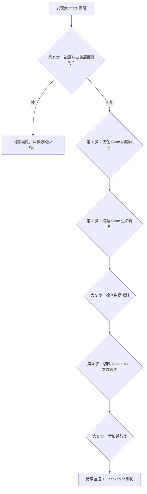
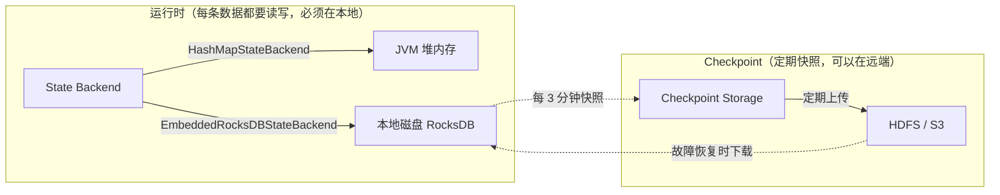
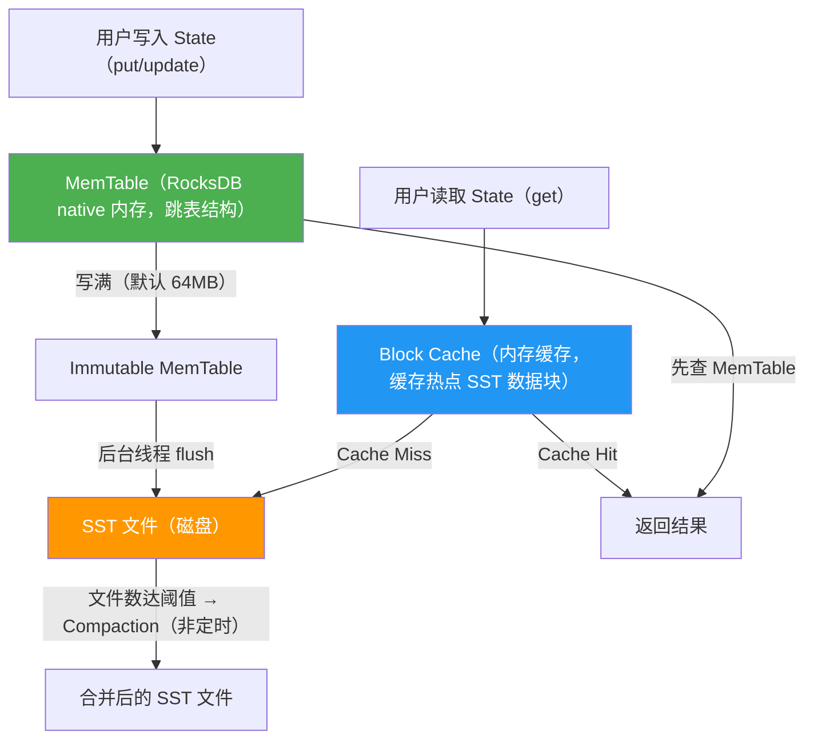
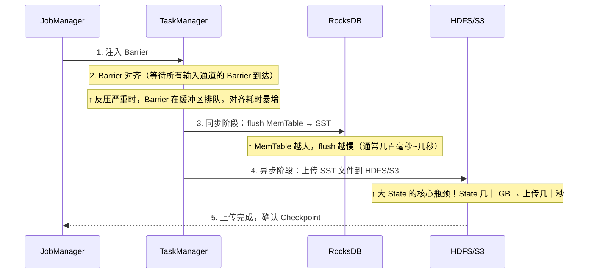

# Flink 大 State 处理专题

> **本文从 [05-Flink.md](./05-Flink.md) 的 5.7 节独立拆分而来**，系统化梳理生产环境中大 State 的排查思路和优化策略。

---

## 大 State 处理策略（体系化排查思路）

生产环境中，State 可能膨胀到几十 GB 甚至几百 GB，导致三类问题：运行时反压（State 读写慢）、Checkpoint 超时（State 上传慢）、启停/扩缩容慢（State 恢复慢）。排查和优化应按以下顺序逐层递进，先从业务层面消除不必要的 State，再从技术层面优化剩余 State 的存储和管理。



### 第 0 步：从业务层面避免不必要的 State

在优化 State 之前，首先检查是否有**误用 State 的场景**。以下是生产中常见的误用 case 和最优解法：

**误用 1：把维度数据存在 State 里做 Join**

错误做法是把商品信息、用户画像等维度数据全量加载到 `MapState` 或 `BroadcastState` 中，和事实流做 Join。当维度数据量达到百万级时，State 膨胀到几十 GB。

```java
// ❌ 误用：把百万级商品表存到 BroadcastState
MapStateDescriptor<String, Product> desc = new MapStateDescriptor<>("products", ...);
BroadcastStream<Product> broadcast = productStream.broadcast(desc);
// 每个 Sub-Task 都持有一份完整副本，State 膨胀
```

最优解法：维度数据放到外部存储（Redis/HBase），用 Async I/O 或 Temporal Table Join（Flink SQL）按需查询：

```java
// ✅ 正确：Async I/O 查 Redis，State 为零
AsyncDataStream.unorderedWait(orderStream, new RedisAsyncLookup(), 30, TimeUnit.SECONDS, 100);
```

```sql
-- ✅ 正确：Flink SQL Temporal Table Join，Flink 自动管理 Lookup Cache
SELECT o.*, p.product_name FROM orders AS o
JOIN products FOR SYSTEM_TIME AS OF o.proc_time AS p ON o.product_id = p.product_id;
```

**误用 2：存储原始明细而不是增量聚合结果**

错误做法是把窗口内的每条原始数据都存到 `ListState`，窗口触发时再遍历计算。如果窗口时间长或数据量大，State 无限增长。

```java
// ❌ 误用：把每条原始数据存入 ListState
ListState<Event> events = getRuntimeContext().getListState(new ListStateDescriptor<>("events", Event.class));
events.add(currentEvent);  // 窗口内数据越来越多
```

最优解法：用增量聚合（`ReduceFunction` / `AggregateFunction`），State 只存中间结果（如 count、sum），体积从 O(n) 降到 O(1)：

```java
// ✅ 正确：增量聚合，State 只存一个 Long（计数器）
stream.keyBy(...).window(...).aggregate(new AggregateFunction<Event, Long, Long>() {
    public Long createAccumulator() { return 0L; }
    public Long add(Event value, Long acc) { return acc + 1; }
    public Long getResult(Long acc) { return acc; }
    public Long merge(Long a, Long b) { return a + b; }
});
```

**误用 3：Flink SQL 聚合在高 QPS 下频繁访问 State**

Flink SQL 的 Group Aggregate 默认每条数据都会读写一次 State，QPS 高时成为瓶颈。这不是 State 本身大，而是 State 访问频率太高。

最优解法：开启 MiniBatch + LocalGlobal（详见主文档 6.1 节），将多次 State 访问合并为一次，吞吐量提升数倍。

**误用 4：不需要精确去重时使用精确 State**

如果业务只需要近似 UV（允许 1~2% 误差），用精确的 `MapState<userId, Boolean>` 存所有用户 ID 是浪费。

最优解法：用 [HyperLogLog（HLL）](../part3-java-deep/A1-核心数据结构原理.md#九hyperlogloghll用-12kb-估算亿级基数) 估算 UV，State 固定大小约 12KB，不随用户数增长。Flink SQL 中 `APPROX_COUNT_DISTINCT` 内部就是 HLL 实现。

**误用 5：State 中存储可重复计算的冗余信息**

比如在 State 中同时存储 `sum`、`count`、`avg`，其中 `avg = sum / count` 完全可以在输出时计算，无需额外存储。

### 第 1 步：优化 State 内容体积（序列化与数据结构）

确认 State 存的内容是必要的之后，接下来优化每条数据的存储体积。

**1.1 序列化优化：避免 Kryo fallback**

Flink 有三层序列化体系，优先级从高到低：

| 优先级 | 序列化器 | 触发条件 | 性能 | 体积 |
|-------|---------|---------|------|------|
| 1 | **Flink 原生 Tuple Serializer** | 使用 `Tuple2<String, Long>` 等 Flink 内置 Tuple 类型 | 最快 | 最小（字段紧凑排列，无类名/字段名开销） |
| 2 | **POJO Serializer** | 满足 POJO 条件的自定义类 | 快 | 小（按字段顺序序列化，带少量元数据） |
| 3 | **Kryo（兜底）** | 不满足 POJO 条件、或 Flink 无法推断类型 | 慢（比 POJO 慢约 4 倍） | 大（带完整类名、字段名等元数据） |

**Flink 原生 Tuple 是什么？** Flink 提供了 `Tuple0` 到 `Tuple25` 共 26 个泛型类（在 `org.apache.flink.api.java.tuple` 包下），每个 Tuple 的字段数量固定，通过 `.f0`、`.f1`、`.f2` 等公开字段访问。它们不是 Java 的 `java.util.Tuple`（Java 标准库没有 Tuple），而是 Flink 自己实现的：

```java
// Flink 原生 Tuple 示例：字段通过 f0, f1 访问
Tuple2<String, Long> result = Tuple2.of("user_001", 42L);
result.f0;  // "user_001"
result.f1;  // 42L

// Flink 知道 Tuple2 内部精确有 2 个字段，类型分别是 String 和 Long
// 序列化时直接按顺序写入 [String, Long]，无需类名/字段名等元数据
```

**POJO 类能不能表示为原生 Tuple？** 不能直接等价。上面的 `UserState` 有 3 个字段（userId, visitCount, lastVisitTime），你可以改写为 `Tuple3<String, Long, Long>`，序列化效率会略微提升，但代价是代码可读性大幅下降（`tuple.f0` vs `userState.userId`）。实践中的建议是：**简单的中间结果用 Tuple（如 `Tuple2<String, Long>` 做 word count），复杂的业务对象用 POJO**。只要 POJO 满足条件，Flink 的 POJO Serializer 已经足够高效，和 Tuple Serializer 的性能差距在 10% 以内，远小于 Kryo 的 75% 性能损失。

**Kryo 为什么是最差的？** Kryo 是一个通用的 Java 序列化框架，它什么类都能序列化（这是优点），但代价是：序列化时需要写入完整的类名（如 `com.example.BadState`）、字段名、字段类型等元数据，这些冗余信息让序列化后的体积比 POJO Serializer 大 2~5 倍；反序列化时需要通过反射创建对象和设置字段，比直接 `new` + 赋值慢很多。Flink 的 POJO Serializer 之所以快，是因为它在编译期就知道类的结构（字段数量、类型、顺序），序列化时按固定顺序直接写字段值，不需要任何元数据。

Benchmark 数据显示，从 POJO Serializer 降级到 Kryo，**性能损失高达 75%**。

Flink 自动识别 POJO 的条件是：public 类、有无参构造函数、所有字段可序列化且有 getter/setter（或 public 字段）。不满足任何一个条件就会 fallback 到 Kryo。

```java
// ✅ 满足 POJO 条件 → Flink 用高效的 POJO Serializer（自动，无需手动干预）
public class UserState {
    public String userId;        // public 字段
    public long visitCount;
    public long lastVisitTime;
    public UserState() {}        // 无参构造函数
}
// → 序列化时直接按顺序写入 [String, long, long]，无类名开销
// → 这个类也可以改写为 Tuple3<String, Long, Long>，但可读性差

// ❌ 不满足 POJO 条件 → Flink 退化到 Kryo（慢 + 大）
public class BadState {
    private Map<String, List<Integer>> complexField;  // 嵌套泛型，Flink 无法推断类型
    // 没有无参构造函数
    public BadState(String id) { ... }
}
// → 序列化时写入 "com.example.BadState" + 字段名 + 类型标记 + 值，体积膨胀
```

注意：你提到的"String 转数字/hash/bitmap"属于**数据结构精简**，和序列化优化是两个独立的维度。序列化优化是让 Flink 用更高效的序列化器（POJO Serializer 而非 Kryo），不需要手动做 String → 数字转换。但如果你的 State 中确实存了很多长字符串（如 URL、JSON），把它们压缩/编码确实能进一步减小体积：

```java
// 数据结构精简示例：URL 去重不需要存完整 URL
// ❌ 存原始 URL：MapState<String(URL), Boolean>，每条 URL 几百字节
// ✅ 存 URL 的 hash：MapState<Long(murmurhash), Boolean>，每条 8 字节
long urlHash = MurmurHash.hash64(url.getBytes());
deduplicationState.put(urlHash, true);
```

**1.2 MapState 替代 ValueState<集合>**

当需要存储"一个 key 对应多个子项"时，`ValueState<Map>` 或 `ValueState<Set>` 每次读写都要序列化/反序列化整个集合，State 越大越慢。`MapState` 在 RocksDB 中每个 entry 是独立的 key-value 对，只序列化单条数据：

```java
// ❌ ValueState<Set>：每次 get/update 序列化整个 Set（10 万用户 → 序列化 10 万条）
ValueState<Set<String>> usersState;
Set<String> users = usersState.value();  // 反序列化全部
users.add(newUserId);
usersState.update(users);                // 序列化全部

// ✅ MapState：只序列化一条（O(1) vs O(n)）
MapState<String, Boolean> usersMap;
usersMap.put(newUserId, true);           // 只写一条
boolean exists = usersMap.contains(userId); // 只查一条
```

**底层机制：为什么 ValueState 必须整体序列化/反序列化？**

RocksDB 的存储模型是 key-value 对。对于 `ValueState<T>`，Flink 在 RocksDB 中存储为**一个 key-value 对**：key 是 `(keyGroup, userKey, stateNamespace)` 的拼接，value 是整个 `T` 对象的序列化字节。调用 `valueState.value()` 时，Flink 从 RocksDB 读出这一整块字节并反序列化为 `T`；调用 `valueState.update(t)` 时，将 `T` 整体序列化后写回同一个 key。如果 `T` 是 `Set<String>`（包含 10 万个元素），那每次 `value()` 和 `update()` 都要序列化/反序列化这 10 万个元素——即使你只改了一个。

`MapState<UK, UV>` 的存储模型不同：每个 entry 在 RocksDB 中是**独立的 key-value 对**，key 是 `(keyGroup, userKey, stateNamespace, mapKey)` 的拼接，value 是单个 `UV` 的序列化字节。所以 `mapState.put(k, v)` 只序列化/写入一条记录，`mapState.get(k)` 只读取/反序列化一条记录。

**各种 State 类型的序列化行为对比**：

| State 类型 | RocksDB 中的存储方式 | 单次读写的序列化量 | 适用场景 |
|-----------|--------------------|-----------------|---------|
| `ValueState<T>` | 一个 KV 对，value = 整个 T | O(n)——整体序列化 | T 是简单类型（Boolean、Long、POJO）时最优 |
| `MapState<UK, UV>` | 每个 entry 一个 KV 对 | O(1)——单条序列化 | 一个 key 下有多个子项（如用户下的多个订单） |
| `ListState<T>` | 追加时一个 KV 对，**读取时整体反序列化** | 写 O(1)，读 O(n) | 适合只追加不读的场景（如 Checkpoint 时 flush）|
| `ReducingState<T>` / `AggregatingState` | 一个 KV 对，value = 聚合结果 | O(1)——只存聚合值 | 增量聚合场景（sum/count/max） |

注意：`ListState` 有一个容易踩的坑——`add()` 操作在 RocksDB backend 上确实是 O(1)（追加一个 KV 对），但 `get()` 返回的 `Iterable` 需要读取该 key 下的所有 entry 并逐条反序列化，是 O(n) 的。如果你频繁读取 ListState，性能可能比预期差很多。

**1.3 使用 Protobuf / Avro 替代 Java 原生序列化**

如果 State 中存储了复杂对象且数据量大，Protobuf 序列化后的体积通常比 Java 原生序列化小 50% 以上，反序列化速度也快数倍。

**"自定义 TypeSerializer" 到底指什么？** 下面的代码示例中有两个角色：`TypeInformation`（类型信息）是"自定义序列化"的关键——它告诉 Flink "这个类的结构是什么，应该用哪个 Serializer 来处理"。`ValueStateDescriptor` 只是一个 State 的描述符（名字 + 类型），它本身不做序列化。真正的序列化逻辑由 `TypeInformation` 内部关联的 `TypeSerializer` 完成：

```java
// 第 1 步：声明 TypeInformation —— 这一步是「自定义序列化」的核心
// TypeInformation.of() 会让 Flink 的类型系统分析 MyState 的结构
// 如果 MyState 满足 POJO 条件 → 自动使用 PojoSerializer
// 如果不满足 → fallback 到 Kryo（这正是我们要避免的）
TypeInformation<MyState> stateType = TypeInformation.of(new TypeHint<MyState>() {});

// 第 2 步：用 TypeInformation 创建 StateDescriptor
// descriptor 绑定了 stateType 中的 Serializer，后续 State 读写时用它来序列化
ValueStateDescriptor<MyState> descriptor = new ValueStateDescriptor<>("state", stateType);
```

如果你需要完全控制序列化逻辑（比如用 Protobuf），可以实现自定义的 `TypeSerializer<MyState>` 并通过 `ValueStateDescriptor` 的构造函数直接传入：

```java
// 完全自定义序列化：实现 TypeSerializer 接口
public class MyProtobufSerializer extends TypeSerializer<MyState> {
    @Override
    public void serialize(MyState record, DataOutputView target) {
        byte[] bytes = record.toProto().toByteArray();  // Protobuf 序列化
        target.writeInt(bytes.length);
        target.write(bytes);
    }
    @Override
    public MyState deserialize(DataInputView source) {
        int len = source.readInt();
        byte[] bytes = new byte[len];
        source.readFully(bytes);
        return MyState.fromProto(MyStateProto.parseFrom(bytes));  // Protobuf 反序列化
    }
    // ... 还需实现 snapshotConfiguration, duplicate, copy 等方法
}

// 直接传入自定义 Serializer，完全绕过 Flink 的类型推断
ValueStateDescriptor<MyState> descriptor = new ValueStateDescriptor<>("state", new MyProtobufSerializer());
```

### 第 2 步：缩短 State 生命周期（TTL 与清理）

大 State 最常见的根源是"只写不删"——数据源源不断流入，但过期数据永远不清理。

**检查 TTL 是否合理**：State 的 TTL 应该与业务语义精确匹配，不是越长越安全。TTL 设太长等于不清理，设太短会丢数据：

| 业务场景 | 推荐 TTL |
|---------|---------|
| 用户会话统计 | 会话最大超时 + 缓冲（如 30min + 10min = 40min） |
| 7 日留存窗口 | 7 天 + 1 天 = 8 天 |
| 实时去重 | 业务允许的重复窗口（如 24 小时） |
| 实时 TopN | 统计周期 + 缓冲（如 1 天 + 2 小时） |

```java
StateTtlConfig ttl = StateTtlConfig.newBuilder(Time.days(7))
    .setUpdateType(OnCreateAndWrite)          // 创建和写入时刷新 TTL
    .setStateVisibility(NeverReturnExpired)    // 不返回已过期的状态
    .cleanupIncrementally(10, true)            // 增量清理：每 10 条读取触发一次
    .build();
```

**注意**：State TTL 的清理不是精确的——过期数据不会立刻被删除，而是在下次访问或 RocksDB Compaction 时才被清理。如果需要更及时的清理，可以用 Timer 回调主动删除：

```java
// 用 Timer 主动清理过期状态（比 TTL 更精确）
public void processElement(Event event, Context ctx, Collector<Result> out) {
    state.update(event);
    // 注册一个 24 小时后的 Timer，到期后主动清理
    ctx.timerService().registerEventTimeTimer(event.getTimestamp() + 24 * 3600 * 1000);
}

@Override
public void onTimer(long timestamp, OnTimerContext ctx, Collector<Result> out) {
    state.clear();  // Timer 到期，主动清理状态
}
```

**检查聚合 key 粒度是否合理**：key 粒度对 State 总量的影响取决于你在 State 里存什么。需要分两种情况理解：

- **聚合场景（State 存聚合结果）**：key 粒度越细，State 条目越多。比如按 `user_id` 聚合 PV，State 有 100 万条（每个用户一条）；按 `user_id + page_url` 聚合，State 可能有 1 亿条（每个用户×页面一条），每条虽然都只存一个 count 值，但总条目数暴增 → State 总量更大。
- **明细场景（State 存原始数据）**：如果你存的是每个 key 下的行为明细（如用户的点击事件列表），那 key 粒度越粗，单个 key 下的明细越多 → 单个 State 越大。但这种情况下更应该关注的是 State 误用（应该用增量聚合替代存明细，见第 0 步误用 2）。

一般来说，如果业务允许更粗的粒度，优先用更粗的 key 来减少 State 条目总数。

### 第 3 步：检查数据倾斜

通过 Flink Web UI → Task Metrics，按 Sub-Task 查看 `rocksdb_estimate_live_data_size`。如果某个 Sub-Task 的 State 量远大于其他，说明存在数据倾斜。

解决方案详见主文档面试考点 15（数据倾斜处理），核心手段包括：

- 重新设计聚合 key：拆分热点 key（如"匿名用户"占 80%），用 `userId + 随机后缀` 打散后二次聚合
- 有窗口场景：两阶段聚合（加随机前缀 keyBy → 窗口聚合 → 去前缀 keyBy → 二次聚合）
- 无窗口场景：LocalKeyBy 预聚合（在 keyBy 上游用 buffer 攒一批数据预聚合后再发下游）
- Flink SQL 场景：开启 LocalGlobal（`table.optimizer.agg-phase-strategy: TWO_PHASE`）和 Split Distinct

**二次聚合的真实场景和代码示例**：假设你要统计每个城市的实时订单量，但 `city_id = "北京"` 的订单占 80%（热点 key），导致一个 Sub-Task 的 State 远大于其他。解决办法是在第一阶段给北京的 key 加随机后缀打散，第二阶段再合并回来：

```java
// ===== 真实 case：城市维度的实时订单量统计，北京是热点 key =====

// 第一阶段：加随机后缀打散热点 key
DataStream<Tuple2<String, Long>> firstStage = orderStream
    .map(order -> {
        String cityKey = order.getCityId();
        // 给所有 key 加随机后缀（0~9），热点 key 被分散到 10 个 Sub-Task
        String saltedKey = cityKey + "_" + ThreadLocalRandom.current().nextInt(10);
        return Tuple2.of(saltedKey, 1L);
    })
    .returns(Types.TUPLE(Types.STRING, Types.LONG))
    .keyBy(t -> t.f0)
    .window(TumblingEventTimeWindows.of(Time.minutes(1)))
    .reduce((a, b) -> Tuple2.of(a.f0, a.f1 + b.f1));
    // 此时 State 中有 "北京_0"、"北京_1" ... "北京_9" 共 10 个 key
    // 每个 key 的 State 只有原来的 1/10

// 第二阶段：去掉后缀，合并回真正的 city_id
DataStream<Tuple2<String, Long>> result = firstStage
    .map(t -> Tuple2.of(t.f0.split("_")[0], t.f1))  // "北京_3" → "北京"
    .returns(Types.TUPLE(Types.STRING, Types.LONG))
    .keyBy(t -> t.f0)
    .window(TumblingEventTimeWindows.of(Time.minutes(1)))
    .reduce((a, b) -> Tuple2.of(a.f0, a.f1 + b.f1));
    // 最终输出：("北京", 总订单量)
```

这种两阶段聚合在有窗口的场景下是标准做法。注意第二阶段的窗口必须和第一阶段一致（都是 1 分钟滚动窗口），否则不同窗口的数据会被混在一起。对于无窗口的实时聚合，应该使用 LocalKeyBy 预聚合（详见面试考点 15 的 `LocalKeyByFlatMap` 代码），而不是这种两阶段窗口聚合。

### 第 4 步：切换 RocksDB + 参数调优

如果 State 确实需要几十 GB 乃至更大，HashMapStateBackend（纯堆内存）已经不适用，必须使用 `EmbeddedRocksDBStateBackend`。

> **注意**：从 Flink 1.13 开始，默认的 State Backend 已经是 `HashMapStateBackend`（对应旧版的 `MemoryStateBackend` / `FsStateBackend`）。但在大多数生产环境中，用户会显式配置为 `EmbeddedRocksDBStateBackend`。如果你的集群已经在 `flink-conf.yaml` 中配置了 `state.backend: rocksdb`，则无需再手动切换。这里的"切换"是指：如果你当前还在用 `HashMapStateBackend`（State 在堆内存），需要改为 RocksDB。

**先澄清一个常见误解：能不能把 State Backend 改到 HDFS 来存更大的 State？**

不能。需要区分两个概念：**State Backend**（状态后端）决定运行时 State 存在哪里，**Checkpoint Storage**（检查点存储）决定快照保存到哪里。



运行时的 State 必须在本地（堆内存或本地磁盘），因为每条数据处理时都要 `state.get()` / `state.put()`，如果 State 在 HDFS 上，每次读写都要走网络 I/O，延迟从微秒级变成毫秒级甚至秒级，实时流处理完全不可用。HDFS 在这个体系里只是"备份仓库"（存 Checkpoint 快照），不是"工作台"（运行时 State）。想存更大的 State，正确做法是优化 State 内容 + RocksDB 调优 + 增加并行度分散，而不是把 State 搬到远端。

**RocksDB 的数据流转机制**：

选择 RocksDB 作为 State Backend 后，数据的完整流转路径是：



几个关键澄清：

- **不存在"先用 HashMap 再自动切换到 RocksDB"的机制**。选择哪种 State Backend 是部署时配置的，运行时不会自动切换。
- **数据一上来就进 RocksDB**。写入时先进 RocksDB 的 MemTable（native 内存，不在 JVM 堆上），MemTable 写满后 flush 到磁盘的 [SST 文件](./05-Flink.md#lsm-tree-的三种放大效应)。所以写操作确实先进内存，但这是 RocksDB 内部的 MemTable，不是 Flink 的 HashMapStateBackend。
- **RocksDB 并没有"根据阈值选择存内存还是硬盘"**。所有数据最终都会落盘为 [SST 文件](./05-Flink.md#lsm-tree-的三种放大效应)（MemTable 满了就刷盘），读取时通过 Block Cache 缓存热点数据到内存。
- **MemTable 和 Block Cache 的总内存**由 Flink 的 Managed Memory 控制（`taskmanager.memory.managed.fraction`，默认 0.4），Flink 通过 Write Buffer Manager 确保 RocksDB 不超出预算。

**RocksDB Compaction 的触发机制**：Compaction 不是定时执行的，而是由 SST 文件数量或文件大小触发的。RocksDB 有两种主要的 Compaction 策略：

- **Level Compaction**（Flink 默认，适合大 State）：L0 层的 SST 文件数量达到阈值（默认 4 个）时触发 L0→L1 的 Compaction；L1 及以下各层，当该层的总文件大小超过目标大小（每层比上一层大 10 倍）时触发向下一层的 Compaction。后台 Compaction 线程会持续监控这些条件，一旦满足就自动执行，不需要等待任何定时器。
- **Size-Tiered Compaction**（Universal Compaction）：当同一层内积累了足够多的大小相近的 SST 文件时触发合并。写放大更低，但读放大和空间放大更高。

Compaction 期间会消耗 CPU 和磁盘 I/O。如果 Compaction 速度跟不上写入速度（`rocksdb_compaction_pending` 指标持续增长），会导致 L0 文件堆积 → 读放大 → State 读取变慢 → 反压。可以通过增加后台线程数（`state.backend.rocksdb.thread.num`）来加速 Compaction。

**RocksDB 理论上能用满磁盘吗？**

理论上可以——RocksDB 数据存在本地磁盘，不受 JVM 堆限制，上限就是磁盘容量。但实际生产中有三个约束：

1. **Managed Memory 限制运行性能**：MemTable + Block Cache 的内存受限（由 `taskmanager.memory.managed.fraction` 控制，默认 0.4）。你的理解是对的——MemTable 的固定大小（如 64MB × 3 个 = 192MB）确实不会因为磁盘上的 State 增大而"撑爆"内存，因为它只是一个写缓冲区，写满就刷盘。但 State 越大，影响的是**读性能**：磁盘上的 SST 文件越多，热点数据在 Block Cache 中的命中率越低 → 更多读请求需要走磁盘 I/O → 算子处理延迟上升。同时 MemTable 在大 State 场景下也会间接影响性能：如果写入 QPS 很高，MemTable 写满的频率增加 → Immutable MemTable 堆积 → flush 和 Compaction 更频繁 → 磁盘 I/O 竞争加剧 → 拖慢整体吞吐。所以 Managed Memory 的限制不是"撑爆内存"，而是**限制了最高运行性能**。
2. **Checkpoint 上传瓶颈**：本地 State 越大，Checkpoint 时上传到 HDFS/S3 的数据越多。即使是增量 Checkpoint，也有增量链回溯开销。超过 `checkpoint.timeout` 就会失败。
3. **磁盘 I/O 写放大**：LSM-Tree 的多层 Compaction 导致实际写入磁盘的数据量是用户数据的 10~30 倍。HDD 上 State 几十 GB 就可能把 I/O 打满。

生产建议：单个 TaskManager 的 State 控制在几十 GB 以内，磁盘务必使用 SSD。

> **关于 [SST 文件](./05-Flink.md#lsm-tree-的三种放大效应)、LSM-Tree 等存储引擎的通用知识**（MemTable → Immutable MemTable → SST → Compaction 的分层结构），不仅 RocksDB 使用，Doris（底层也是 RocksDB / 类似 LSM 结构）、HBase（HFile + MemStore）、Cassandra（SSTable + Memtable）等都采用了类似架构。这些存储引擎的共性原理和调优思路可参考主文档的 [LSM-Tree 的三种放大效应](./05-Flink.md#lsm-tree-的三种放大效应)。

RocksDB 参数调优详见主文档 5.3 节（包括多磁盘目录、SSD 优化、Block Cache、MemTable 参数等）。

### 第 5 步：增加并行度分散 State

前四步优化后 State 仍然很大，说明这就是业务需要的数据量，通过增加并行度将 State 分散到更多 Sub-Task：

**操作步骤**：

1. **压测确定单并行度上限**：在 Kafka 中积压数据，启动 Flink 任务全速消费，出现反压时的吞吐量即为单并行度极限。
2. **计算最优并行度**：`并行度 = 峰值 QPS / 单并行度处理能力 × 1.2`（留 20% 余量）。
3. **检查 maxParallelism**：并行度不能超过 maxParallelism（默认 128）。如果需要更高并行度，必须提前设置更大的 maxParallelism——注意，修改 maxParallelism 后旧 Savepoint 无法恢复。相关配置参数详见 [05-Flink-配置参数速查.md](./05-Flink-配置参数速查.md)。
4. **Savepoint 扩缩容**：扩容时 Key Group 重新分配，每个 Sub-Task 从 HDFS 拉取属于自己的 Key Group 数据，首次启动可能较慢。缩容时多个 Sub-Task 的 State 合并到更少的 Sub-Task，需确保本地磁盘和内存足够。

**并行度不是越大越好**：太高会导致 Checkpoint 变慢（更多 subtask 需要协调对齐）、网络 shuffle 开销增大、RocksDB 实例数增多（每个 slot 一个 RocksDB 实例）。

### 持续监控 + Checkpoint 调优

大 State 处理的瓶颈往往不在运行时而在 Checkpoint。一个 Checkpoint 的完整过程包含以下阶段，每个阶段都可能成为瓶颈：



**为什么大 State 的 Checkpoint 瓶颈是上传而不是运行时？** 运行时 RocksDB 的读写性能可以通过 SSD、Block Cache、增加并行度来解决，但 Checkpoint 时必须把所有 [SST 文件](./05-Flink.md#rocksdb-增量-checkpoint-原理)（全量）或新增 SST 文件（增量）上传到 HDFS/S3，这个过程受网络带宽限制。10GB 的 State 即使用增量 Checkpoint，首次全量上传仍然需要几十秒；增量链过长时，恢复需要回溯多个增量快照叠加，恢复时间可能比全量 Checkpoint 还长。

**Checkpoint 调优参数**：

```java
CheckpointConfig config = env.getCheckpointConfig();
config.setCheckpointInterval(3 * 60 * 1000);          // 间隔 3 分钟
config.setMinPauseBetweenCheckpoints(4 * 60 * 1000);   // 两次 Checkpoint 之间至少暂停 4 分钟
config.setCheckpointTimeout(10 * 60 * 1000);           // 超时 10 分钟
config.enableExternalizedCheckpoints(RETAIN_ON_CANCELLATION);  // 取消任务时保留 Checkpoint

// 大 State 必开增量 Checkpoint
env.setStateBackend(new EmbeddedRocksDBStateBackend(true));  // true = 增量

// 反压严重时考虑 Unaligned Checkpoint（跳过 Barrier 对齐）
config.enableUnalignedCheckpoints();
```

**监控指标**：

| 监控指标 | 含义 | 告警阈值 |
|---------|------|---------|
| `checkpoint_duration` | Checkpoint 总耗时 | > interval 的 50% 告警 |
| `checkpoint_state_size` | 单次 Checkpoint 状态大小 | 持续增长且无收敛趋势告警 |
| `rocksdb_estimate_live_data_size` | RocksDB 实际数据量（按 Sub-Task） | 某个 Sub-Task 远大于其他 → 数据倾斜 |
| `rocksdb_num_immutable_mem_tables` | 不可变 MemTable 数量 | > 3 告警，写入压力过大 flush 不及时 |
| `rocksdb_compaction_times` | Compaction 次数 | 突增告警，可能 [SST 文件](./05-Flink.md#lsm-tree-的三种放大效应)过多 |

### 哪些场景需要 State？（不只是聚合）

一个常见的误解是"单条数据无需 State"——这不完全对。更准确的说法是：**只要算子需要"记住"跨数据的信息，就需要 State**，不仅限于聚合。以下是非聚合的 State 使用场景及代码示例：

**场景 1：去重（Deduplication）**——判断数据是否已出现过，不是聚合但需要状态：

```java
public class DeduplicationFunction extends KeyedProcessFunction<String, Event, Event> {
    private ValueState<Boolean> seenState;

    @Override
    public void open(Configuration parameters) {
        ValueStateDescriptor<Boolean> desc = new ValueStateDescriptor<>("seen", Boolean.class);
        desc.enableTimeToLive(StateTtlConfig.newBuilder(Time.hours(24)).build());
        seenState = getRuntimeContext().getState(desc);
    }

    @Override
    public void processElement(Event event, Context ctx, Collector<Event> out) throws Exception {
        if (seenState.value() == null) {
            seenState.update(true);    // 记住这个 key 已出现过
            out.collect(event);         // 首次出现，输出
        }
        // 重复数据，丢弃
    }
}
```

**场景 2：CEP 复杂事件处理**——检测事件序列模式，需要缓存已匹配的部分序列：

```java
// 检测"3 分钟内连续 3 次登录失败"模式
Pattern<LoginEvent, ?> pattern = Pattern.<LoginEvent>begin("first")
    .where(event -> event.getType().equals("FAIL"))
    .next("second")
    .where(event -> event.getType().equals("FAIL"))
    .next("third")
    .where(event -> event.getType().equals("FAIL"))
    .within(Time.minutes(3));  // Flink 在 State 中缓存已匹配到的 "first"、"second" 事件

CEP.pattern(loginStream.keyBy(LoginEvent::getUserId), pattern)
    .select((Map<String, List<LoginEvent>> matched) -> {
        return new Alert(matched.get("first").get(0).getUserId(), "连续登录失败");
    });
```

**场景 3：Interval Join**——两条流的数据到达时间不一致，先到的数据必须缓存在 State 中等待匹配：

```java
// 订单流和支付流做 Interval Join，支付可能比订单晚 5 分钟到达
orderStream.keyBy(Order::getOrderId)
    .intervalJoin(paymentStream.keyBy(Payment::getOrderId))
    .between(Time.minutes(-1), Time.minutes(5))  // 订单前 1 分钟到后 5 分钟内匹配支付
    // Flink 在 State 中缓存 -1min ~ +5min 范围内未匹配的订单和支付数据
    .process(new ProcessJoinFunction<Order, Payment, OrderWithPayment>() {
        @Override
        public void processElement(Order order, Payment payment, Context ctx,
                                   Collector<OrderWithPayment> out) {
            out.collect(new OrderWithPayment(order, payment));
        }
    });
```

**场景 4：自定义窗口触发器 / ProcessFunction 中的 Timer**——注册定时器触发逻辑，Timer 本身就是 State：

```java
// 监控传感器温度：如果温度连续 10 秒超过 100°C，输出告警
public class TemperatureAlert extends KeyedProcessFunction<String, SensorReading, Alert> {
    private ValueState<Long> timerState;  // 记录注册的 Timer 时间戳

    @Override
    public void processElement(SensorReading reading, Context ctx, Collector<Alert> out) {
        if (reading.getTemperature() > 100) {
            if (timerState.value() == null) {
                long timerTs = ctx.timerService().currentProcessingTime() + 10_000;
                ctx.timerService().registerProcessingTimeTimer(timerTs);
                timerState.update(timerTs);
            }
        } else {
            // 温度恢复正常，取消 Timer
            if (timerState.value() != null) {
                ctx.timerService().deleteProcessingTimeTimer(timerState.value());
                timerState.clear();
            }
        }
    }

    @Override
    public void onTimer(long timestamp, OnTimerContext ctx, Collector<Alert> out) {
        out.collect(new Alert(ctx.getCurrentKey(), "温度持续超标 10 秒"));
        timerState.clear();
    }
}
```

---

[← 返回 Flink 主文档](./05-Flink.md)
