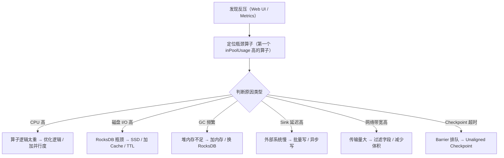

# Flink 面试深度剖析

> **本文从 [05-Flink.md](./05-Flink.md) 的第七章独立拆分而来**，包含 20 个高频面试考点的深度解析。

---

### 考点 1：Flink vs Spark Streaming

> **面试官**：「Flink 和 Spark Streaming 有什么区别？」

核心区别是计算模型：Spark Streaming（包括 Structured Streaming）是**微批次**——把流按时间间隔切成小批次，每个批次当作 RDD/DataFrame 处理，延迟在秒级。Flink 是**逐条处理**——每条事件到达即计算，延迟在毫秒级。Flink 在事件时间处理、Watermark、Exactly-Once 语义上更成熟。

### 考点 2：Checkpoint 和 Savepoint 的区别

> **面试官**：「Checkpoint 和 Savepoint 有什么区别？」

Checkpoint 是 Flink 自动定期触发的快照，用于故障恢复，生命周期和任务绑定（任务取消后可配置保留或删除）。Savepoint 是用户手动触发的快照，用于有计划的停机（升级代码、调整并行度）和迁移，永久保留。两者的格式和恢复机制相同。

### 考点 3：Watermark 怎么工作

> **面试官**：「如果数据严重乱序，Watermark 怎么设置？」

Watermark 的延迟容忍时间需要在"结果准确性"和"延迟"之间权衡。设得太小，迟到数据被丢弃，结果不准；设得太大，窗口迟迟不触发，延迟高。实践中先统计数据的乱序程度（P99 延迟），把 Watermark 设为 P99 值。严重迟到的数据用 Side Output 收集后异步修正。

### 考点 4：反压（Backpressure）

> **面试官**：「Flink 处理不过来怎么办？」

Flink 有天然的反压机制：下游算子处理不过来时，它的输入缓冲区满了，上游算子的输出缓冲区也随之满了，一层层传导到 Source，Source 自动降低读取速率。不需要额外配置。反压持续过久说明需要加资源（增加并行度）或优化算子逻辑。

### 考点 5：Key Group 和最大并行度

> **面试官**：「Flink 改并行度时状态怎么恢复？Key Group 是什么？」

Flink 用 Key Group 作为 Keyed State 重分配的原子单位。Key Group 数量 = 最大并行度，key 通过 `murmurHash(key.hashCode()) % maxParallelism` 分配到某个 Key Group，每个 Sub-Task 负责一段连续的 Key Group 范围。改变并行度时，Key Group 的归属重新划分，但 Key Group 到 key 的映射不变，所以状态能正确恢复。最大并行度一旦设定不能随意改，否则 Key Group 数量变化导致状态失效。默认值：并行度 < 128 时取 128，否则取 `parallelism + parallelism / 2`。

### 考点 6：Savepoint 恢复的坑

> **面试官**：「修改 Flink 作业代码后从 Savepoint 恢复，有哪些注意事项？」

最关键的是 UID——不手动指定 UID 时，Flink 自动 hash 生成，代码任何改动都可能导致 UID 变化，状态恢复失败。所以有状态的算子必须手动 `.uid()`。其他规则：新增无状态算子不影响恢复；删除有状态算子需加 `-n` 跳过；调整并行度可以恢复（≤ maxParallelism）；修改最大并行度会导致状态失效。

### 考点 7：Watermark 与 Barrier 的区别

> **面试官**：「Watermark 和 Barrier 有什么区别？」

两者都是混在数据流里的特殊记录，但本质不同。Watermark 是 Source 根据数据时间戳自主生成的，驱动事件时间推进，决定窗口何时触发、Timer 何时执行。Barrier 是 JobManager 通过 RPC 定时注入的，标志快照边界，协调全局状态一致性。Watermark 在多输入时取 min，Barrier 在多输入时对齐。一句话：Watermark 管"时间到了没"，Barrier 管"快照切在哪"。

### 考点 8：两阶段提交与端到端 Exactly-Once

> **面试官**：「Flink 怎么做到端到端 exactly-once？两阶段提交是怎么工作的？」

端到端 exactly-once 取决于整个数据管道的最弱一环，分为三层：内部 Checkpoint 保证、Source 支持重放、Sink 支持事务或幂等。Flink 内部通过 Checkpoint + Barrier 对齐实现状态一致性；Source 端如 Kafka 将 offset 保存到 State，故障后按 offset 重放；Sink 端通过 2PC 与外部事务系统配合：收到 Barrier 时预提交数据（写入但不 commit），Checkpoint 完成后收到 JobManager 确认再正式提交。Kafka 的 Consumer 下游必须设置 `read_committed` 隔离级别，否则可能读到未提交数据。生产环境常见坑是 Kafka 事务超时（默认 60s）小于 Flink Checkpoint 间隔，导致事务被 abort 数据丢失。若下游支持幂等，也可选择 at-least-once + 下游去重，性能更好。

### 考点 9：Checkpoint 为什么越大恢复越慢？增量 Checkpoint 恢复为什么可能比全量慢？

> **面试官**：「Checkpoint 大小和延迟有什么关系？增量 Checkpoint 恢复为什么可能比全量慢？」

Checkpoint 大小直接影响三个维度：快照写入时间（越大写入 HDFS 越慢）、网络带宽占用（并发 Checkpoint 时可能挤占业务带宽）、恢复时间（需要下载并反序列化更多状态数据）。

增量 Checkpoint 恢复**可能更慢**的原因是：恢复时需要回溯从上次全量 Checkpoint 以来的所有增量文件链。如果增量链很长（比如几十个增量 Checkpoint 后做一次全量），恢复时需要下载几十个文件并在本地重建 RocksDB，可能比下载一个全量文件更慢。因此 Flink 内部会定期形成新的全量基线，以控制增量链长度。

### 考点 10：为什么 Flink 1.11+ 引入 Unaligned Checkpoint？解决了什么问题？

> **面试官**：「Unaligned Checkpoint 解决了什么问题？和对齐 Checkpoint 的本质区别是什么？」

对齐 Checkpoint 在反压场景下，下游处理不过来导致 Barrier 无法对齐，对齐时间无限拉长，最终 Checkpoint 超时。Unaligned Checkpoint 通过不对齐、直接把缓冲数据也存入快照的方式，让 Checkpoint 不受反压影响，对齐时间几乎为零。本质区别在于：对齐 Checkpoint 的算子状态只包含 barrier 之前的数据结果；Unaligned Checkpoint 额外把 barrier 之后还在缓冲区的数据也快照进去，恢复时重新注入重新计算。用更大的快照体积换取更稳定的 Checkpoint 成功率。

**Unaligned Checkpoint 的副作用**：

- **快照体积显著增大**：除了算子状态本身，还需要额外保存所有输入缓冲区（input buffer）和输出缓冲区（output buffer）中的在途数据。反压越严重、缓冲区堆积越多，快照越大。极端情况下快照体积可能膨胀数倍。
- **恢复时间更长**：恢复时除了重建算子状态，还需要把快照中的缓冲数据重新注入各算子的输入队列，然后重新计算。缓冲数据越多，恢复后的"追赶"时间越长。
- **不支持 Savepoint**：Unaligned Checkpoint 只能用于故障恢复，不能用于 Savepoint（手动触发的全量快照），因为 Savepoint 的格式要求与 Unaligned 的缓冲数据快照不兼容。升级作业、调整并行度仍然必须用对齐模式的 Savepoint。
- **磁盘 I/O 压力增大**：更大的快照意味着写入 HDFS/S3 的数据量更大，对存储系统的吞吐和网络带宽有更高要求。如果 HDFS 本身就是瓶颈，可能导致快照写入变慢。
- **与部分功能不兼容**：Flink 早期版本中（1.11~1.14），Unaligned Checkpoint 与增量 Checkpoint、某些 Source/Sink 连接器存在兼容性问题。Flink 1.15+ 已修复大部分兼容性问题，但使用前仍需确认连接器版本。

**生产实践建议**：优先使用对齐 Checkpoint（默认行为），仅在 Checkpoint 频繁因反压超时时才启用 Unaligned Checkpoint。也可以配置 `execution.checkpointing.aligned-checkpoint-timeout`（如 30 秒），让 Flink 在对齐超时后自动降级为 Unaligned，兼顾两者优势。

### 考点 11：Broadcast State 的 Checkpoint 有什么特点？

> **面试官**：「Broadcast State 改变并行度时怎么恢复？」

Broadcast State 属于 Operator State，所有并行子任务持有**完全相同的副本**。Checkpoint 时每个 Sub-Task 都会保存完整副本；恢复时（无论并行度是否变化），每个 Sub-Task 都会获得完整副本。因此 Broadcast State 不涉及 Key Group 重分配，也不受并行度变化影响。典型场景是动态配置（如规则引擎），通过 Broadcast Stream 将规则广播到所有 Sub-Task，每个 Sub-Task 本地保存一份规则状态，避免每个 key 都存一份规则。

### 考点 12：场景题——每天从 00:00 开始，每小时累计统计 PV/UV

> **面试官**：「有一张 Kafka topic `user_visit_log`，字段有 user_id、user_type、visit_time。要求每天从 00:00 开始，每隔 1 小时输出一次截至当前小时的累计访问指标（按 user_type 分组，累计 PV 和 UV）。怎么设计 Flink SQL 或 DataStream 实现？」

**核心思路**：这不是普通的滚动窗口（Tumbling Window），而是**累积窗口（Cumulative Window）**——窗口起点固定（每天 00:00），终点逐步扩展，每次输出从起点到当前时刻的累计结果。Flink SQL 1.13+ 提供了 `CUMULATE` 窗口函数直接支持：

```sql
SELECT
  user_type,
  CUMULATE_START(visit_time, INTERVAL '1' HOUR, INTERVAL '1' DAY) AS window_start,
  CUMULATE_END(visit_time, INTERVAL '1' HOUR, INTERVAL '1' DAY) AS window_end,
  COUNT(*) AS pv,
  COUNT(DISTINCT user_id) AS uv
FROM user_visit_log
GROUP BY
  user_type,
  CUMULATE(visit_time, INTERVAL '1' HOUR, INTERVAL '1' DAY);
-- 语法：CUMULATE(timeCol, step, maxSize)
--   step    = INTERVAL '1' HOUR  → 每隔 1 小时输出一次
--   maxSize = INTERVAL '1' DAY   → 总跨度为 1 天（00:00 起始）
```

如果用 DataStream API，需要自己维护状态：用 `ProcessFunction` 或 `KeyedProcessFunction`，按 `user_type` 分组，状态中保存累计的 PV 计数和 UV 的 `MapState<user_id, Boolean>`（或 `ValueState<Set<String>>`，但大状态用 `MapState` 更好）。每来一条数据就更新状态，然后用 `Timer`（每天每小时触发）输出当前累计值。注意：状态必须设置 TTL（比如 25 小时），防止无限增长。

### 考点 13：场景题——实时 TopN（每小时热门商品 Top10）

> **面试官**：「实时统计每个小时销量最高的 Top10 商品，数据流中有商品 ID 和订单时间，怎么实现？」

**核心思路**：`TumblingWindow` + `aggregate` 先聚合出每个商品每小时的销量，然后用 `KeyedProcessFunction` 维护一个大小为 N 的优先队列（小顶堆）做 TopN。关键在于：**先按窗口聚合，再在每个窗口内做 TopN 排序**，避免把所有数据都存到内存里。

Flink SQL 实现更简洁：

```sql
SELECT *
FROM (
  SELECT
    product_id,
    window_start,
    window_end,
    sales_cnt,
    ROW_NUMBER() OVER (PARTITION BY window_start, window_end ORDER BY sales_cnt DESC) AS rn
  FROM (
    SELECT
      product_id,
      TUMBLE_START(order_time, INTERVAL '1' HOUR) AS window_start,
      TUMBLE_END(order_time, INTERVAL '1' HOUR) AS window_end,
      COUNT(*) AS sales_cnt
    FROM orders
    GROUP BY product_id, TUMBLE(order_time, INTERVAL '1' HOUR)
  )
) WHERE rn <= 10;
```

**踩坑点**：如果商品数量极大，`COUNT(DISTINCT)` 或 `ROW_NUMBER()` 的状态可能很大。如果只需要近似 TopN，可以用 `AggState` 或 `MapState<product_id, count>` 配合 TTL，避免状态无限增长。

### 考点 14：场景题——双流 Join（订单流 join 商品信息流）

> **面试官**：「有两条流：订单流（实时）和商品信息流（更新较少）。怎么把订单和商品信息 Join 起来？有哪些方案？」

**四种方案对比**：

| 方案 | 适用场景 | 原理 | 缺点 |
|------|---------|------|------|
| **Window Join** | 两条流都有明确时间窗口，且在窗口内能匹配 | 划分时间窗口（Tumbling/Sliding/Session），窗口内做笛卡尔积匹配 | 窗口外的数据无法匹配，容易丢数据；大窗口状态大 |
| **Interval Join** | 订单流在商品流前后一段时间内有匹配 | `KEY BY` 后，`between` 指定时间范围（如订单前后 5 分钟），状态保留范围内的数据 | 需要 key 相同，时间范围不能太大，否则状态爆炸 |
| **Temporal Table Join** | 商品流是维度表（更新少），订单流是事实流 | 商品流作为 Temporal Table（类似版本表），订单流按处理时间 lookup | 只支持处理时间，不支持事件时间；商品流更新频率不能太高 |
| **Async I/O + 外部存储** | 商品信息在外部（Redis/MySQL/HBase） | 订单流用 Async I/O 异步查询外部维度表 | 有外部依赖延迟，需要处理查询失败和超时 |

#### 方案一：Interval Join（DataStream API）

两条流按相同 key 关联，指定时间范围内匹配。适合两条流都是实时流、且能通过时间范围限定匹配关系的场景。

```java
// 订单流和商品信息流都按 product_id 分组
KeyedStream<Order, String> orderKeyed = orderStream
    .assignTimestampsAndWatermarks(...)
    .keyBy(Order::getProductId);

KeyedStream<Product, String> productKeyed = productStream
    .assignTimestampsAndWatermarks(...)
    .keyBy(Product::getProductId);

// Interval Join：订单事件时间前后 5 分钟内，匹配商品信息
orderKeyed
    .intervalJoin(productKeyed)
    .between(Time.minutes(-5), Time.minutes(5))  // 订单时间 ± 5 分钟
    .process(new ProcessJoinFunction<Order, Product, OrderWithProduct>() {
        @Override
        public void processElement(Order order, Product product, Context ctx,
                                   Collector<OrderWithProduct> out) {
            out.collect(new OrderWithProduct(
                order.getOrderId(),
                order.getProductId(),
                product.getProductName(),
                product.getPrice(),
                order.getOrderTime()
            ));
        }
    })
    .addSink(new KafkaSink<>());
```

#### 方案二：Interval Join（Flink SQL）

```sql
-- Flink SQL 的 Interval Join
SELECT
  o.order_id,
  o.product_id,
  p.product_name,
  p.price,
  o.order_time
FROM orders o, products p
WHERE o.product_id = p.product_id
  AND p.update_time BETWEEN o.order_time - INTERVAL '5' MINUTE
                        AND o.order_time + INTERVAL '5' MINUTE;
```

#### 方案三：Temporal Table Join（Flink SQL，维度表 Lookup）

商品信息作为维度表（更新频率低），订单流实时 lookup 最新的商品信息。适合"事实表 join 维度表"的经典场景。

```sql
-- 1. 先注册商品表为 Temporal Table（版本表）
-- 商品信息存在外部系统（如 MySQL），通过 JDBC Connector 接入
CREATE TABLE products (
  product_id STRING,
  product_name STRING,
  price DECIMAL(10, 2),
  update_time TIMESTAMP(3),
  PRIMARY KEY (product_id) NOT ENFORCED
) WITH (
  'connector' = 'jdbc',
  'url' = 'jdbc:mysql://localhost:3306/shop',
  'table-name' = 'products',
  'lookup.cache.max-rows' = '10000',        -- 本地缓存最多 1 万行
  'lookup.cache.ttl' = '60s'                -- 缓存 60 秒后刷新
);

-- 2. 订单流 Temporal Join 商品维度表
-- FOR SYSTEM_TIME AS OF 表示按订单的处理时间去查商品表的当前快照
SELECT
  o.order_id,
  o.product_id,
  p.product_name,
  p.price,
  o.order_time
FROM orders AS o
JOIN products FOR SYSTEM_TIME AS OF o.proc_time AS p
  ON o.product_id = p.product_id;
```

#### 方案四：Broadcast Join（DataStream API，小表广播）

商品信息量小（几千~几万条），直接广播到所有 Sub-Task，订单流本地查询，零网络延迟。

```java
// 1. 定义 Broadcast State 描述符
MapStateDescriptor<String, Product> productDesc =
    new MapStateDescriptor<>("products", String.class, Product.class);

// 2. 商品流广播
BroadcastStream<Product> broadcastProducts = productStream.broadcast(productDesc);

// 3. 订单流连接广播流
orderStream
    .connect(broadcastProducts)
    .process(new BroadcastProcessFunction<Order, Product, OrderWithProduct>() {

        @Override
        public void processElement(Order order, ReadOnlyContext ctx,
                                   Collector<OrderWithProduct> out) {
            // 从 Broadcast State 查商品信息
            ReadOnlyBroadcastState<String, Product> state =
                ctx.getBroadcastState(productDesc);
            Product product = state.get(order.getProductId());
            if (product != null) {
                out.collect(new OrderWithProduct(
                    order.getOrderId(), order.getProductId(),
                    product.getProductName(), product.getPrice(),
                    order.getOrderTime()
                ));
            }
        }

        @Override
        public void processBroadcastElement(Product product, Context ctx,
                                            Collector<OrderWithProduct> out) {
            // 商品信息更新时，写入 Broadcast State
            ctx.getBroadcastState(productDesc).put(product.getProductId(), product);
        }
    })
    .addSink(new KafkaSink<>());
```

#### 方案五：Async I/O（DataStream API，查外部存储）

商品信息量大、存在外部系统（Redis/HBase），用异步 I/O 查询，不阻塞主线程。

```java
// 异步查询 Redis 中的商品信息
DataStream<OrderWithProduct> result = AsyncDataStream.unorderedWait(
    orderStream,
    new AsyncFunction<Order, OrderWithProduct>() {
        private transient RedisClient redisClient;

        @Override
        public void open(Configuration parameters) {
            redisClient = RedisClient.create("redis://localhost:6379");
        }

        @Override
        public void asyncInvoke(Order order,
                                ResultFuture<OrderWithProduct> resultFuture) {
            // 异步查询 Redis
            CompletableFuture.supplyAsync(() -> {
                String productJson = redisClient.get("product:" + order.getProductId());
                return Product.fromJson(productJson);
            }).thenAccept(product -> {
                if (product != null) {
                    resultFuture.complete(Collections.singleton(
                        new OrderWithProduct(order, product)
                    ));
                } else {
                    resultFuture.complete(Collections.emptyList());
                }
            });
        }

        @Override
        public void timeout(Order order, ResultFuture<OrderWithProduct> resultFuture) {
            // 超时处理：输出空结果或写入侧输出流
            resultFuture.complete(Collections.emptyList());
        }
    },
    30, TimeUnit.SECONDS,  // 超时时间
    100                     // 最大并发请求数
);

result.addSink(new KafkaSink<>());
```

**推荐策略**：如果商品信息更新频率低且全量可控（几千~几万条），优先用 Broadcast Join，零外部依赖、零网络延迟；如果商品信息量大（百万级），用 Temporal Table Join（SQL）或 Async I/O（DataStream）查外部存储；如果两条流都是高频实时流，用 Interval Join 控制时间窗口。

### 考点 15：场景题——数据倾斜怎么处理？

> **面试官**：「Flink 作业中某个 Task 的并行度处理量远大于其他 Task，导致整体延迟，怎么排查和解决？」

**排查方法**：

- 看 Flink Web UI 的 `Backpressure` 和 `Records Received/Sent`，确认哪个 Sub-Task 接收或发送量异常。
- 看 Checkpoint 的 `Subtask-level Checkpoint Duration`，如果某个 Sub-Task 耗时远大于其他，说明该 Sub-Task 的状态量远大于其他，大概率是数据倾斜。

**解决方案**：

- **两阶段聚合（有窗口场景）**：先局部预聚合（如加随机前缀 `keyBy(randomPrefix + key)`），再全局聚合。Flink SQL 会自动做 `Local-Global` 聚合优化（详见主文档 6.1.2）。注意：有窗口时，第二阶段聚合必须携带 `windowEnd` 作为分组依据，避免不同窗口的结果被混在一起。
- **LocalKeyBy 预聚合（无窗口场景）**：无窗口的实时聚合中，简单的两阶段聚合不能解决倾斜——因为 Flink 来一条处理一条，第一阶段聚合后仍然向下游发一条结果，对第二阶段来说数据量并未减少，且会重复计算。正确做法是在 keyBy 上游用 `RichFlatMapFunction` 维护本地 buffer（HashMap），攒够一批数据后预聚合再发下游：

```java
class LocalKeyByFlatMap extends RichFlatMapFunction<String, Tuple2<String, Long>>
        implements CheckpointedFunction {
    // Checkpoint 时将 buffer 保存到 ListState，保证 Exactly-Once
    private ListState<Tuple2<String, Long>> localPvStatListState;
    private HashMap<String, Long> localPvStat;  // 本地 buffer
    private int batchSize;                       // 攒够多少条再发
    private AtomicInteger currentSize;

    LocalKeyByFlatMap(int batchSize) { this.batchSize = batchSize; }

    @Override
    public void flatMap(String appId, Collector<Tuple2<String, Long>> out) {
        Long pv = localPvStat.getOrDefault(appId, 0L);
        localPvStat.put(appId, pv + 1);

        if (currentSize.incrementAndGet() >= batchSize) {
            // 攒够一批，聚合后发往下游
            for (Map.Entry<String, Long> entry : localPvStat.entrySet()) {
                out.collect(Tuple2.of(entry.getKey(), entry.getValue()));
            }
            localPvStat.clear();
            currentSize.set(0);
        }
    }

    @Override
    public void snapshotState(FunctionSnapshotContext ctx) throws Exception {
        // Checkpoint 时将 buffer 中未发送的数据保存到状态
        localPvStatListState.clear();
        for (Map.Entry<String, Long> entry : localPvStat.entrySet()) {
            localPvStatListState.add(Tuple2.of(entry.getKey(), entry.getValue()));
        }
    }

    @Override
    public void initializeState(FunctionInitializationContext ctx) throws Exception {
        localPvStatListState = ctx.getOperatorStateStore().getListState(
            new ListStateDescriptor<>("localPvStat",
                TypeInformation.of(new TypeHint<Tuple2<String, Long>>() {})));
        localPvStat = new HashMap<>();
        if (ctx.isRestored()) {
            for (Tuple2<String, Long> entry : localPvStatListState.get()) {
                localPvStat.merge(entry.f0, entry.f1, Long::sum);
            }
            currentSize = new AtomicInteger(batchSize); // 恢复后立即触发一次发送
        } else {
            currentSize = new AtomicInteger(0);
        }
    }
}
```

- **keyBy 前数据倾斜**：如果 Kafka 各 partition 数据量不均匀导致 keyBy 之前就出现倾斜，使用 `shuffle()`、`rebalance()` 或 `rescale()` 强制重分布数据。
- **拆分热点 key**：如果某个 key 的数据量占 80%，可以把这个 key 的数据拆成多个子 key（比如 `key_0`、`key_1`...`key_N`），分散到多个 Sub-Task，最后再合并。
- **自定义分区器**：实现 `Partitioner` 接口，按数据分布自定义分区逻辑，避免默认的 `hashCode % parallelism` 导致倾斜。
- **状态层面**：如果倾斜是由 Keyed State 过大导致，考虑增加 `maxParallelism` 或重新设计 key（如从用户 ID 改为"用户 ID + 设备 ID"）。

### 考点 16：场景题——反压（Backpressure）怎么排查和处理？

> **面试官**：「Flink 作业出现反压，数据消费变慢，怎么排查和处理？」

#### 一、现象：怎么发现反压？

| 观察方式 | 具体指标 | 含义 |
|---------|---------|------|
| **Flink Web UI** | `Backpressure` 标签页显示 `OK / LOW / HIGH` | 从 Source 往下游逐个看，第一个出现 `HIGH` 的算子就是瓶颈所在 |
| **Metrics** | `outPoolUsage` 持续 > 90% | 该算子的输出缓冲区满了，说明**下游消费不过来** |
| **Metrics** | `inPoolUsage` 持续 > 90% | 该算子的输入缓冲区满了，说明**自己处理不过来** |
| **Metrics** | `numRecordsOutPerSecond` 突降 | 算子吞吐量骤降，下游开始堆积 |
| **Checkpoint** | 某个 Sub-Task 的 Checkpoint Duration 远大于其他 | 该 Sub-Task 状态过大或处理过慢 |
| **日志** | TaskManager 频繁 Full GC | 堆内存不足 |

**定位瓶颈算子的方法**：从 Source 开始往下游看，第一个 `outPoolUsage` 正常但 `inPoolUsage` 高的算子就是瓶颈——它处理不过来，导致上游的 `outPoolUsage` 也被撑满，压力一路向上传导到 Source。

#### 二、原因 → 处理方案

**原因 1：算子计算逻辑太重**

现象：某个算子的 CPU 使用率高、`numRecordsOutPerSecond` 远低于 `numRecordsInPerSecond`。

处理方案：

- 增加该算子的并行度，分摊计算压力。
- 优化算子逻辑：避免在 `processElement` 中做复杂计算（如正则匹配、JSON 反序列化可以提前做），减少每条数据的处理耗时。
- 如果是窗口聚合算子，考虑用 `AggregateFunction`（增量聚合）替代 `ProcessWindowFunction`（全量聚合），避免窗口触发时一次性处理大量数据。

**原因 2：State 操作成为瓶颈（大 State / RocksDB 慢查询）**

现象：`rocksdb_compaction_times` 突增、`rocksdb_memtable_flush_duration` > 5s、磁盘 I/O 使用率高。

处理方案：

- 检查 State 是否设置了 TTL，清理过期数据，控制 State 大小。
- 磁盘从 HDD 换成 SSD，消除 RocksDB 的 I/O 瓶颈。
- 增大 RocksDB 的 Block Cache（`state.backend.rocksdb.block.cache-size`），减少磁盘读取次数。
- 检查是否存在数据倾斜（某个 key 的 State 远大于其他），参考考点 15 的倾斜处理方案。

**原因 3：GC 停顿（JVM 堆内存不足）**

现象：TaskManager 日志频繁出现 Full GC，每次停顿几秒甚至几十秒，期间算子完全停止处理数据。

处理方案：

- 增加 TaskManager 的堆内存（`taskmanager.memory.task.heap.size`）。
- 如果使用 `HashMapStateBackend`（State 在堆内），可以评估切到 `EmbeddedRocksDBStateBackend`（State 在本地 RocksDB）。
- 检查用户代码是否有内存泄漏（如缓存了大量对象未释放）。

**原因 4：Sink 写入外部系统慢**

现象：Sink 算子的 `inPoolUsage` 高，但 CPU 不高；外部系统（MySQL/ES/Kafka）的写入延迟增大。

处理方案：

- 开启批量写入：将逐条写入改为攒批写入（如 JDBC Sink 的 `batch.size`、ES Sink 的 `bulk.flush.max.actions`）。
- 增加连接池大小或 Sink 并行度。
- 改用异步写入（`AsyncSinkBase` 或 `Async I/O`），让写入不阻塞主线程。
- 检查外部系统本身的瓶颈（如 MySQL 的锁等待、ES 的 refresh interval、Kafka 的分区数不足）。

**原因 5：网络传输瓶颈**

现象：跨 TaskManager 的数据传输量大，网络带宽打满。

处理方案：

- 在 `keyBy` 之前先做 `map` / `filter` 过滤不需要的字段，减少每条数据的体积。
- 避免传输大字段（如把完整日志传到下游，实际只需要其中几个字段）。
- 调整 TaskManager 的网络缓冲区参数（`taskmanager.network.memory.fraction`）。

**原因 6：反压导致 Checkpoint 超时（次生问题）**

现象：Checkpoint 频繁失败，日志报 `Checkpoint expired before completing`。反压导致 Barrier 在缓冲区中排队，迟迟无法对齐。

处理方案：

- 启用 Unaligned Checkpoint（`execution.checkpointing.unaligned.enabled: true` 或代码里 `enableUnalignedCheckpoints()`），让 Barrier 不需要排队，直接越过缓冲区。
- 或者配置 `execution.checkpointing.aligned-checkpoint-timeout`（如 30s），对齐超时后自动降级为 Unaligned。
- 增大 `checkpoint.timeout`，给更多时间完成 Checkpoint（治标不治本，需同时解决反压根因）。

#### 三、排查流程总结



### 考点 17：场景题——实时去重（用户行为去重）

> **面试官**：「实时统计每个用户的首次购买行为，同一个用户多次购买只算一次，怎么实现？」

**核心思路**：本质上就是**按 key 去重**。Flink 提供两种去重机制：

**方案一：状态去重（First-Row）**

完整的 `KeyedProcessFunction` 实现，包含 State 初始化、TTL 配置和去重逻辑：

```java
// 1. 按 user_id 分组，交给去重算子处理
orderStream
    .keyBy(Order::getUserId)
    .process(new FirstRowDeduplicator())
    .addSink(new KafkaSink<>());

// 2. 去重算子：只输出每个用户的首次购买行为
public class FirstRowDeduplicator extends KeyedProcessFunction<String, Order, Order> {

    // 用 ValueState<Boolean> 记录该 key（user_id）是否已经出现过
    // 因为已经按 user_id 做了 keyBy，所以每个 key 只需要一个 Boolean 值
    private transient ValueState<Boolean> seenState;

    @Override
    public void open(Configuration parameters) throws Exception {
        // 配置 State TTL：7 天后自动清理，防止状态无限增长
        StateTtlConfig ttlConfig = StateTtlConfig
            .newBuilder(Time.days(7))
            .setUpdateType(StateTtlConfig.UpdateType.OnCreateAndWrite)  // 写入时刷新过期时间
            .setStateVisibility(StateTtlConfig.StateVisibility.NeverReturnExpired)
            .cleanupFullSnapshot()  // 仅在 full snapshot 时裁剪过期状态，不会立刻清理本地状态
            .build();

        ValueStateDescriptor<Boolean> descriptor =
            new ValueStateDescriptor<>("seen", Boolean.class);
        descriptor.enableTimeToLive(ttlConfig);  // 启用 TTL
        seenState = getRuntimeContext().getState(descriptor);
    }

    @Override
    public void processElement(Order order, Context ctx, Collector<Order> out) throws Exception {
        // 如果 seenState 为 null，说明该用户是首次出现
        if (seenState.value() == null) {
            seenState.update(true);     // 标记为已处理
            out.collect(order);          // 输出首次购买行为
        }
        // 非首次购买，直接丢弃，不输出
    }
}
```

**为什么用 `ValueState<Boolean>` 而不是 `MapState<String, Boolean>`？** 因为已经按 `user_id` 做了 `keyBy`，Flink 会自动按 key 隔离状态，每个 key 只需要一个简单的 Boolean 值标记"是否已出现"。`MapState` 适合在一个 key 下存多个子项的场景（如"一个商户下的多个订单"）。

**Flink SQL 写法更简洁**（SQL 层面的 First-Row 去重）：

```sql
-- Flink SQL 原生去重：按 user_id 分组，只保留每个用户的第一条记录
SELECT user_id, product_id, order_time
FROM (
  SELECT *,
    ROW_NUMBER() OVER (PARTITION BY user_id ORDER BY order_time ASC) AS rn
  FROM orders
) WHERE rn = 1;
```

优点：精确，不需要外部依赖。缺点：状态无限增长（所有用户 ID 都要存）。**必须设置 TTL**，比如"只保留 7 天内的用户状态"，超期的用户可以重新算一次（业务上通常可接受）。

**方案二：[Bloom Filter](../part3-java-deep/A1-核心数据结构原理.md#三布隆过滤器bloom-filter用-1-的误判换-99-的内存节省) 去重**

用 Bloom Filter 近似判断用户是否已出现。优点：内存占用极小（百万级用户只需几 MB）。缺点：有误判率（可能把新用户误判为已存在，漏掉首次行为）。适合允许少量误差的场景（如广告曝光去重）。

**方案三：[HyperLogLog](../part3-java-deep/A1-核心数据结构原理.md#九hyperlogloghll用-12kb-估算亿级基数) 去重**

如果只需要统计 UV 数量而不需要精确知道每个用户是否首次，可以用 HyperLogLog 近似计数。Flink SQL 的 `COUNT(DISTINCT)` 底层会自动优化。

### 考点 18：场景题——延迟数据怎么处理？

> **面试官**：「Watermark 已经推进到 12:00 了，但突然来了一条 11:55 的数据，怎么处理？」

**Flink 的延迟数据处理机制**：

- **Watermark 的作用**：Watermark 标记了"小于该时间戳的数据应该都已到达"，窗口基于 Watermark 触发。如果 Watermark 已到 12:00，则 11:00~12:00 的窗口已经计算并输出，11:55 的数据属于**延迟数据**。
- **Allowed Lateness**：窗口可以配置 `allowedLateness`，允许在窗口触发后的一段时间内继续接收延迟数据。延迟数据到达时，窗口会重新触发计算（输出更新结果）。适合窗口结果需要修正的场景。

```java
window
    .allowedLateness(Time.minutes(5))  // 窗口触发后，允许 5 分钟内延迟数据到达
    .sideOutputLateData(lateTag);       // 超过 allowedLateness 的延迟数据输出到侧输出流
```

- **Side Output**：超过 `allowedLateness` 的延迟数据会被输出到侧输出流（Side Output），可以单独处理（如写入日志、或进入离线补数流程）。
- **Watermark 策略**：如果业务对延迟数据容忍度低，可以用 `WatermarkStrategy.forBoundedOutOfOrderness` 设置更长的乱序容忍时间，但会增大窗口延迟（Watermark 推进更慢）。需要在"延迟容忍度"和"结果实时性"之间权衡。

#### Watermark 延迟 + allowedLateness 的叠加关系

这两个"延迟"是**叠加关系**，作用在不同阶段。假设 Watermark 乱序容忍 5 分钟、`allowedLateness` 5 分钟，则总共允许数据延迟 10 分钟，但前 5 分钟是"静默等待"（不额外输出），后 5 分钟是"补算更新"（会输出修正结果）。

**第一层：Watermark 乱序容忍（推迟窗口触发）**

```java
WatermarkStrategy.forBoundedOutOfOrderness(Duration.ofMinutes(5))
```

Watermark = 当前看到的最大事件时间 - 5 分钟。假设当前最大事件时间是 13:10，Watermark 只推进到 13:05。此时 12:00~13:00 的窗口还不会触发，13:05 之前到达的"迟到"数据仍然能正常进入窗口参与计算。这一层的效果是**推迟窗口触发时机**，让窗口"多等一会儿"，迟到数据静默进入，不会产生额外输出。

**第二层：allowedLateness（窗口触发后的补救）**

窗口触发并输出结果后，窗口状态**不会立即清除**，而是再保留 5 分钟。在这 5 分钟内到达的迟到数据，仍然会被加入窗口并**重新触发一次计算**（输出更新后的结果）。

**用一个具体例子串起来**（`12:00~13:00` 的滚动窗口）：

```mermaid
gantt
    title 滚动窗口 12:00-13:00 延迟数据处理时间线
    dateFormat HH:mm
    axisFormat %H:%M

    section 窗口生命周期
    窗口收集数据                   :active, w1, 12:00, 13:00
    Watermark 容忍期 - 静默等待     :w2, 13:00, 13:05
    allowedLateness - 补算期        :crit, w3, 13:05, 13:10
    窗口状态彻底清除                :milestone, m1, 13:10, 0min

    section 数据到达效果
    正常数据 静默进入窗口            :done, d1, 12:00, 13:05
    迟到数据 重新触发计算输出修正     :crit, d2, 13:05, 13:10
    超期数据 进入 Side Output        :d3, 13:10, 13:15
```



- **13:05 之前到达**的 12:xx 数据：被 Watermark 容忍，正常进入窗口，窗口还没触发，不算迟到，不产生额外输出。
- **13:05~13:10 之间到达**的 12:xx 数据：窗口已触发，但 `allowedLateness` 还没过期，数据加入窗口并**重新触发计算**，输出修正结果。
- **13:10 之后到达**的 12:xx 数据：窗口状态已清除，数据被丢弃或进入 Side Output。

**容易踩的坑：allowedLateness 导致下游数据重复**

`allowedLateness` 期间的迟到数据会让窗口**重复触发**，下游 Sink 会收到**多条结果**（初始结果 + 一次或多次修正结果）。如果下游是追加写入（如 Kafka、日志文件），同一个窗口会出现多条记录；如果下游是 MySQL，必须用 `UPSERT`（按窗口主键 `INSERT ... ON DUPLICATE KEY UPDATE`）而不是 `INSERT`，否则会出现重复数据。

```java
// 完整的延迟数据处理示例
OutputTag<Event> lateTag = new OutputTag<Event>("late-data") {};

SingleOutputStreamOperator<Result> result = stream
    .keyBy(Event::getUserId)
    .window(TumblingEventTimeWindows.of(Time.hours(1)))
    .allowedLateness(Time.minutes(5))
    .sideOutputLateData(lateTag)
    .aggregate(new MyAggregateFunction());

// 主流：窗口正常结果 + allowedLateness 期间的修正结果
result.addSink(new UpsertMySQLSink());  // 必须用 UPSERT，不能 INSERT

// 侧输出流：超过 allowedLateness 的严重迟到数据
DataStream<Event> lateStream = result.getSideOutput(lateTag);
lateStream.addSink(new LateDataLogSink());  // 写日志或进入离线补数
```

### 考点 19：Flink SQL 聚合性能优化有哪些手段？

> **面试官**：「Flink SQL 的 Group Aggregate 在高 QPS 下吞吐量上不去，怎么优化？如果遇到 COUNT DISTINCT 热点呢？」

**核心回答**：Flink SQL 的聚合优化有四个层次，依次递进：

**第一层：MiniBatch（提升吞吐）**。默认每条数据都会访问一次 State，QPS 高时 State 访问成为瓶颈。开启 MiniBatch 后，在每个 Task 上攒一批数据（如 5 秒或 2 万条），一次性处理并输出，将多次 State 读写合并为一次。配置 `table.exec.mini-batch.enabled = true`，适用于所有聚合场景，代价是增加几秒延迟。注意 Flink 1.12 之前的 MiniBatch 有 Bug 不清理过期状态。

**第二层：LocalGlobal（解决普通聚合热点）**。将一层 Aggregate 拆为 Local + Global 两阶段：Local 阶段在上游本地预聚合，减少发往 Global 的数据量。依赖 MiniBatch，配置 `table.optimizer.agg-phase-strategy = TWO_PHASE`。适用于 SUM/COUNT/MAX/MIN/AVG，UDAF 需实现 Merge 方法。

**第三层：Split Distinct（解决 COUNT DISTINCT 热点）**。LocalGlobal 对 COUNT DISTINCT 效果不好，因为 Local 阶段去重率低。Split Distinct 自动将 COUNT DISTINCT 拆为两层：第一层按 `MOD(HASH_CODE(distinct_key), bucket_num)` 打散做 COUNT DISTINCT，第二层 SUM 汇总。配置 `table.optimizer.distinct-agg.split.enabled = true`。Flink 1.9+ 支持。

**第四层：AGG WITH FILTER（共享状态）**。多维 COUNT DISTINCT 场景（如同时统计总 UV、App UV、Web UV），用 `FILTER` 语法替代 `CASE WHEN`，Flink 能识别出它们作用在同一字段上，共享一个状态实例而非维护三个独立状态。

**判断优化是否生效**：查看拓扑图节点名——出现 `LocalGroupAggregate` / `GlobalGroupAggregate` 表示 LocalGlobal 生效，出现 `Expand` 节点表示 Split Distinct 生效。

### 考点 20：Kafka 分区空闲导致窗口不触发怎么办？

> **面试官**：「Flink 消费 Kafka，某些分区长时间没数据，导致窗口一直不触发，怎么回事？怎么解决？」

**根本原因**：Flink 取所有上游并行数据源 Watermark 的最小值来推进全局 Watermark。如果某个 Kafka 分区没有新数据，该分区的 Watermark 就不会推进，"拖住"了全局 Watermark，导致所有窗口、Timer 都无法触发。

**解决方案**：使用 `WatermarkStrategy.withIdleness(Duration)` 标记空闲源。当一个分区在指定时间内没有新数据，Flink 会将其标记为"空闲"，不再参与 Watermark 最小值计算，直到该分区重新有数据到来时恢复活跃：

```java
consumer.assignTimestampsAndWatermarks(
    WatermarkStrategy
        .<String>forBoundedOutOfOrderness(Duration.ofMinutes(2))
        .withIdleness(Duration.ofMinutes(5))  // 5 分钟无数据则标记为空闲
);
```

**延伸问题——如何为 Kafka 配置 per-partition Watermark**：在 FlinkKafkaConsumer 上直接调用 `assignTimestampsAndWatermarks()`，Flink 会自动在消费端内部为每个 Kafka 分区独立生成 Watermark，然后取所有活跃分区 Watermark 的最小值。如果每个分区内部有序，使用 `forMonotonousTimestamps()` 可以生成完美的全局 Watermark。

---

[← 返回 Flink 主文档](./05-Flink.md)