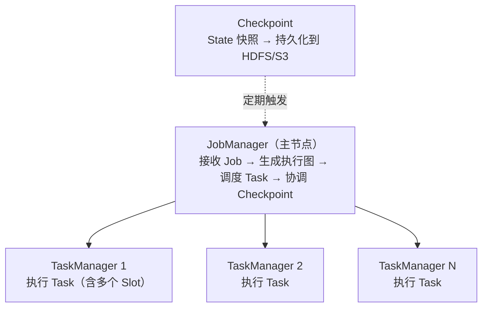

# 6.5 Flink——实时计算引擎

> **一句话定位**：Spark 是"用批处理的思路模拟流"（微批次），Flink 是"原生流处理引擎"——每条数据到达即处理，毫秒级延迟。它是实时大盘、实时风控、实时推荐等场景的首选引擎，也是目前实时计算领域的事实标准。

---

## 一、流处理的核心挑战

实时计算和批处理最大的区别是：**数据没有尽头**。批处理有明确的输入边界（昨天的日志文件），处理完就结束。流处理面对的是源源不断涌入的事件，永远不会"处理完"。

这带来三个独特挑战：

| 挑战 | 含义 | 举例 |
|------|------|------|
| **乱序** | 事件到达顺序 ≠ 事件发生顺序 | 用户 10:00:01 的点击事件在 10:00:05 才到达 Flink |
| **延迟** | 事件可能在很久之后才到达 | 移动端断网恢复后批量上报 |
| **窗口** | 无限流上怎么做聚合？需要把流切成有限的"窗口" | "最近 5 分钟的订单总额" |

Flink 的核心价值就是提供了一套完整的机制来应对这三个挑战。

---

## 二、核心概念

### 2.1 事件时间 vs 处理时间

| 时间语义 | 含义 | 优劣 |
|---------|------|------|
| **Event Time（事件时间）** | 事件实际发生的时间（嵌在数据中） | 结果准确，但需要处理乱序和延迟 |
| **Processing Time（处理时间）** | 事件到达 Flink 的时间 | 最简单、延迟最低，但结果受处理速度影响 |

> **生产经验**：大多数场景用 Event Time。只有对延迟极其敏感且允许结果不精确的场景（如实时监控告警）才用 Processing Time。

### 2.2 Watermark（水位线）——解决乱序

Watermark 是 Flink 用来衡量"事件时间推进到哪了"的机制。它本质是一个时间戳，含义是：**所有时间戳 ≤ Watermark 的事件都已经到达**。

```
数据流：[10:01, 10:03, 10:02, 10:05, 10:04]  ← 乱序到达
Watermark 策略：允许 2 秒乱序

当收到 10:05 的事件时，生成 Watermark = 10:05 - 2s = 10:03
意味着 Flink 认为 10:03 之前的事件都到了，可以触发 10:00-10:03 窗口的计算
```

如果 10:03 之后还来了一个 10:02 的事件——这就是**迟到数据**。Flink 可以配置丢弃、放入侧输出流（Side Output）、或允许窗口更新。

### 2.3 窗口（Window）

窗口把无限流切成有限的数据集来做聚合。Flink 支持四种窗口：

| 窗口类型 | 含义 | 示例 |
|---------|------|------|
| **滚动窗口（Tumbling）** | 固定大小、不重叠 | 每 5 分钟统计一次 PV |
| **滑动窗口（Sliding）** | 固定大小、可重叠 | 窗口 10 分钟、每 1 分钟滑动一次 |
| **会话窗口（Session）** | 按活跃间隔动态切分 | 用户 30 分钟无操作则关闭会话 |
| **全局窗口（Global）** | 所有数据在一个窗口，需自定义触发器 | 特殊场景 |

---

## 三、架构



| 组件 | 职责 | 类比 |
|------|------|------|
| **JobManager** | 接收用户 Job，生成执行图（JobGraph → ExecutionGraph），调度 Task，协调 Checkpoint | 类似 Spark Driver |
| **TaskManager** | 执行具体的算子逻辑，每个 TaskManager 有多个 **Slot**（执行线程） | 类似 Spark Executor |
| **Slot** | TaskManager 中的资源单元（内存隔离），一个 Slot 运行一条算子链 | 类似 Spark 的 Task |

---

## 四、容错机制——Checkpoint + Exactly-Once

### 4.1 Checkpoint（检查点）

Flink 的容错核心是 **Chandy-Lamport 分布式快照算法**。JobManager 定期向数据流注入 **Barrier（屏障）**，Barrier 随数据流向下游传播。当一个算子收到所有输入流的 Barrier 后，它把自己的 State 快照保存到持久化存储（HDFS/S3）。

```
Source → [Barrier] → Map → [Barrier] → Aggregate → [Barrier] → Sink
                         ↓ 对齐 Barrier 时保存快照
                    State Snapshot → HDFS
```

任务失败时，从最近一次成功的 Checkpoint 恢复 State，数据源（如 Kafka）从对应 offset 重放，实现 **Exactly-Once** 语义。

### 4.2 Exactly-Once 的前提条件

Exactly-Once 不是 Flink 单方面保证的，还需要：数据源支持重放（Kafka 可以按 offset 回溯），数据汇（Sink）支持事务或幂等写入。Flink 通过**两阶段提交（2PC）**协议与支持事务的 Sink（如 Kafka Producer）配合实现端到端 Exactly-Once。详见 [A3 两阶段提交](../part3-java-deep/A3-两阶段提交.md)。

---

## 五、Flink SQL

Flink 也支持 SQL 接口，语法和 Hive SQL / 标准 SQL 类似，但增加了流处理专用语法：

```sql
-- 创建 Kafka 数据源表
CREATE TABLE user_clicks (
    user_id BIGINT,
    url STRING,
    click_time TIMESTAMP(3),
    WATERMARK FOR click_time AS click_time - INTERVAL '5' SECOND  -- Watermark
) WITH (
    'connector' = 'kafka',
    'topic' = 'clicks',
    'properties.bootstrap.servers' = 'kafka:9092',
    'format' = 'json'
);

-- 每 10 分钟统计每个用户的点击次数（滚动窗口）
SELECT 
    user_id,
    TUMBLE_START(click_time, INTERVAL '10' MINUTE) as window_start,
    COUNT(*) as click_count
FROM user_clicks
GROUP BY user_id, TUMBLE(click_time, INTERVAL '10' MINUTE);
```

---

## 六、面试深度剖析

### 考点 1：Flink vs Spark Streaming

> **面试官**：「Flink 和 Spark Streaming 有什么区别？」

核心区别是计算模型：Spark Streaming（包括 Structured Streaming）是**微批次**——把流按时间间隔切成小批次，每个批次当作 RDD/DataFrame 处理，延迟在秒级。Flink 是**逐条处理**——每条事件到达即计算，延迟在毫秒级。Flink 在事件时间处理、Watermark、Exactly-Once 语义上更成熟。

### 考点 2：Checkpoint 和 Savepoint 的区别

> **面试官**：「Checkpoint 和 Savepoint 有什么区别？」

Checkpoint 是 Flink 自动定期触发的快照，用于故障恢复，生命周期和任务绑定（任务取消后可配置保留或删除）。Savepoint 是用户手动触发的快照，用于有计划的停机（升级代码、调整并行度）和迁移，永久保留。两者的格式和恢复机制相同。

### 考点 3：Watermark 怎么工作

> **面试官**：「如果数据严重乱序，Watermark 怎么设置？」

Watermark 的延迟容忍时间需要在"结果准确性"和"延迟"之间权衡。设得太小，迟到数据被丢弃，结果不准；设得太大，窗口迟迟不触发，延迟高。实践中先统计数据的乱序程度（P99 延迟），把 Watermark 设为 P99 值。严重迟到的数据用 Side Output 收集后异步修正。

### 考点 4：反压（Backpressure）

> **面试官**：「Flink 处理不过来怎么办？」

Flink 有天然的反压机制：下游算子处理不过来时，它的输入缓冲区满了，上游算子的输出缓冲区也随之满了，一层层传导到 Source，Source 自动降低读取速率。不需要额外配置。反压持续过久说明需要加资源（增加并行度）或优化算子逻辑。

---

[← 6.4 Spark](./04-Spark.md) | [返回本章目录](./README.md) | [6.6 Doris →](./06-Doris.md)
