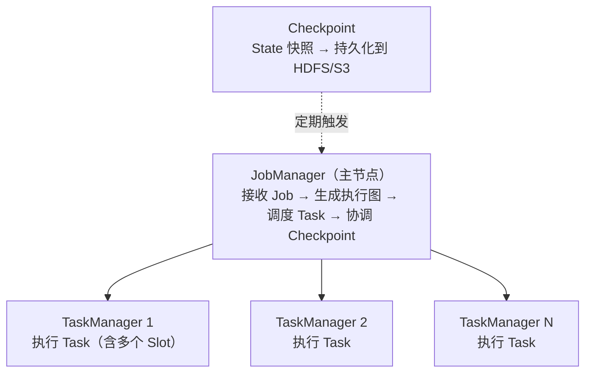

# 6.5 Flink——实时计算引擎

> **一句话定位**：Spark 是"用批处理的思路模拟流"（微批次），Flink 是"原生流处理引擎"——每条数据到达即处理，毫秒级延迟。它是实时大盘、实时风控、实时推荐等场景的首选引擎，也是目前实时计算领域的事实标准。

---

## 一、流处理的核心挑战

实时计算和批处理最大的区别是：**数据没有尽头**。批处理有明确的输入边界（昨天的日志文件），处理完就结束。流处理面对的是源源不断涌入的事件，永远不会"处理完"。

这带来三个独特挑战：

| 挑战 | 含义 | 举例 |
|------|------|------|
| **乱序** | 事件到达顺序 ≠ 事件发生顺序 | 用户 10:00:01 的点击事件在 10:00:05 才到达 Flink |
| **延迟** | 事件可能在很久之后才到达 | 移动端断网恢复后批量上报 |
| **窗口** | 无限流上怎么做聚合？需要把流切成有限的"窗口" | "最近 5 分钟的订单总额" |

Flink 的核心价值就是提供了一套完整的机制来应对这三个挑战。

---

## 二、核心概念

### 2.1 事件时间 vs 处理时间

| 时间语义 | 含义 | 优劣 |
|---------|------|------|
| **Event Time（事件时间）** | 事件实际发生的时间（嵌在数据中） | 结果准确，但需要处理乱序和延迟 |
| **Processing Time（处理时间）** | 事件到达 Flink 的时间 | 最简单、延迟最低，但结果受处理速度影响 |

> **生产经验**：大多数场景用 Event Time。只有对延迟极其敏感且允许结果不精确的场景（如实时监控告警）才用 Processing Time。

### 2.2 Watermark（水位线）——解决乱序

Watermark 是 Flink 用来衡量"事件时间推进到哪了"的机制。它本质是一个时间戳，含义是：**所有时间戳 ≤ Watermark 的事件都已经到达**。

```
数据流：[10:01, 10:03, 10:02, 10:05, 10:04]  ← 乱序到达
Watermark 策略：允许 2 秒乱序

当收到 10:05 的事件时，生成 Watermark = 10:05 - 2s = 10:03
意味着 Flink 认为 10:03 之前的事件都到了，可以触发 10:00-10:03 窗口的计算
```

如果 10:03 之后还来了一个 10:02 的事件——这就是**迟到数据**。Flink 可以配置丢弃、放入侧输出流（Side Output）、或允许窗口更新。

#### Watermark 生成逻辑：maxTimestamp 只增不减

上游生成 Watermark 的逻辑是：维护一个 `maxTimestamp`（已见过的最大时间戳），每次有数据进来，取 `max(maxTimestamp, 当前数据时间戳)` 更新它，然后定期发出 `Watermark(maxTimestamp - allowedLateness)`。

当乱序数据 10:02 在 10:05 之后到达时，数据和 Watermark 走两条独立的逻辑：

```
数据 10:05 到达 → maxTimestamp = max(-∞, 10:05) = 10:05 → 发出 Watermark(10:05 - 2s) = 10:03
数据 10:02 到达 → maxTimestamp = max(10:05, 10:02) = 10:05 → maxTimestamp 不变, 不发新的 Watermark
```

数据 10:02 本身照常往下游流——它是一条普通数据记录，该处理还是处理。但因为它比 maxTimestamp 小，不会更新 maxTimestamp，也就不会产生更小的 Watermark。**数据可以下发，但水位线不会回退。**

这个 10:02 的数据流到下游后，下游算子发现它的时间戳 < 当前 Watermark（10:03），判定为迟到数据，走迟到处理逻辑（丢弃、侧输出、或更新已关闭的窗口）。

#### Watermark 不是数据字段，是流里的特殊记录

Watermark 不是加在每条数据上的新字段，而是数据流里穿插的一种**特殊记录**。可以把它想象成一条管道，里面流着两种类型的元素：

```
[数据] [数据] [数据] [Watermark: 10:03] [数据] [数据] [Watermark: 10:05] [数据] ...
```

它们共享同一条通道，混在一起往下游传。算子处理时会判断元素类型：普通数据走业务逻辑，Watermark 走时间推进逻辑（更新时钟、触发 Timer、关闭窗口等）。

这一点解释了几个关键问题：

Watermark 能跨算子传播——因为它是流里的元素，上游生成后自然跟着数据往下游流，下游收到就能用，不需要每条数据额外携带。

Watermark 不影响数据序列化结构——你的 POJO、Row、JSON 里都没有 Watermark 字段，它是 Flink 运行时层面的东西，对用户数据模型完全透明。

SQL 里 `WATERMARK FOR click_time AS click_time - INTERVAL '5' SECOND` 也不是给表加了列，而是告诉 Flink："请根据 click_time 的值，定期往流里插入 Watermark 记录。"

#### 每个 Task 维护一个事件时间时钟

事件时间时钟不是 per executor 的，而是 **per Task（并行子任务）**。比如并行度为 4，一个算子有 4 个 Task，每个 Task 各自维护独立的事件时间时钟，互不影响。

时钟由收到的 **Watermark 记录**驱动前进（不是直接根据数据时间戳），规则如下：

单输入：收到更大的 Watermark 就推进，取最新值。Watermark 不能倒退。

多输入（如 KeyedCoProcessFunction 有两个输入流）：每个输入流各自维护收到的最新 Watermark，Task 的时钟取**两者中的最小值**。任何一个输入流的 Watermark 没推进，整体时钟就不动。这就是多流"等待"机制的实现方式。

为什么取 min 而不是 max？因为水位线的语义是"这个时间之前的数据都到了"。多个输入流各自有各自的进度，只有当**所有**输入都认为自己推进到了某个时间，才能说"这个时间之前所有流的数据都齐了"。取 max 意味着 A 说到 10:08 了但 B 才到 10:06，10:06 到 10:08 之间 B 的数据可能还没到，提前推进就会漏数据。取 min 就是取"最保守"的时间——被最慢的那个输入拖住，宁可等也不能漏。

```
当前 inputA=10:08, inputB=10:06

取 max → 时钟 = 10:08  ← 激进：B 在 10:06~10:08 的数据可能还没到，会漏
取 min → 时钟 = 10:06  ← 保守：两个流都保证到 10:06，安全
```

Watermark 记录本身不携带"来源流 ID"之类的字段——它只包含一个时间戳。下游 Task 能区分 Watermark 来自哪个输入，靠的是物理通道：每个输入是一条独立的物理通道，Task 内部为每个输入分别维护一个 watermark 值。Watermark 从哪条通道进来，就更新那个输入对应的值。

```
Watermark 记录结构：{ timestamp: 10:06 }，没有别的字段

Task 内部维护：
  input A 的最新 watermark: 10:08   ← 从通道 A 收到的
  input B 的最新 watermark: 10:06   ← 从通道 B 收到的
  当前时钟 = min(10:08, 10:06) = 10:06
```

#### Watermark 实时处理，单调递增不回退

Watermark 的处理是实时的——每收到一条 Watermark，立刻更新该输入通道的值并重新算 min，没有攒批、没有窗口。而且**单个输入通道的 watermark 只增不减**：收到更大的才更新，比当前值小的直接丢弃。因此整体时钟（min）也一定是单调递增的，永远不会回退。

```
时刻1: A 发来 WM=10:03, B 还没发 → inputA=10:03, inputB=-∞, 时钟=min=−∞
时刻2: B 发来 WM=10:04            → inputA=10:03, inputB=10:04, 时钟=min=10:03
时刻3: A 发来 WM=10:05            → inputA=10:05, inputB=10:04, 时钟=min=10:04
时刻4: B 发来 WM=10:06            → inputA=10:05, inputB=10:06, 时钟=min=10:05
时刻5: A 异常发来 WM=10:01        → 10:01 < 10:05, 丢弃, inputA 保持 10:05
```

每个输入只增不减，min 也只增不减，但增长速度被最慢的那个输入拖住。

#### Watermark 不仅驱动窗口

窗口是 Watermark 最常见的消费者，但不是唯一的。Watermark 是整个事件时间体系的"全局时钟指针"，以下机制都订阅这个时钟：

窗口：Watermark 推进到窗口结束时间时，触发计算并关闭窗口。

Event Time Timer：用 `ProcessFunction` 注册的事件时间定时器（如"在事件时间 10:10 时执行某段逻辑"），靠 Watermark 推进来触发，与窗口无关。

Interval Join / 时间维表关联：两个流做时间窗口 join 时，Watermark 决定何时可以认为某时间段数据"齐了"，可以开始 join 并清理过期状态。这里没有传统意义上的窗口，但依然依赖 Watermark。

State 清理：某些算子基于事件时间清理过期状态（如"保留最近 1 小时的状态"），这个"1 小时"按 Watermark 推进来算。

#### Watermark 的代码示例

DataStream API 中手动生成 Watermark：

```java
DataStream<Event> stream = env
    .addSource(new MySource())
    // 为流分配 Watermark 策略：最大乱序 2 秒
    .assignTimestampsAndWatermarks(
        WatermarkStrategy
            .<Event>forBoundedOutOfOrderness(Duration.ofSeconds(2))
            .withTimestampAssigner((event, ts) -> event.getTimestamp())
    );
```

`forBoundedOutOfOrderness` 的内部逻辑就是：记录已见过的最大时间戳 `maxTimestamp`，定期发出 `Watermark(maxTimestamp - 2s)`。这个 Watermark 作为特殊记录混在数据流里往下游传。

多输入场景下（如 Interval Join），每个流各自走自己的 Watermark 策略，各自发送自己的 Watermark，下游算子取最小值推进：

```java
// 两个流各自分配 Watermark 策略
DataStream<Order> orders = env.addSource(...)
    .assignTimestampsAndWatermarks(
        WatermarkStrategy.<Order>forBoundedOutOfOrderness(Duration.ofSeconds(3))
            .withTimestampAssigner((o, ts) -> o.getOrderTime()));

DataStream<Payment> payments = env.addSource(...)
    .assignTimestampsAndWatermarks(
        WatermarkStrategy.<Payment>forBoundedOutOfOrderness(Duration.ofSeconds(5))
            .withTimestampAssigner((p, ts) -> p.getPayTime()));

// Interval Join：下游算子取两个流 Watermark 的最小值作为事件时间时钟
orders
    .keyBy(Order::getOrderId)
    .intervalJoin(payments.keyBy(Payment::getOrderId))
    .between(Time.seconds(-10), Time.seconds(10))
    .process(new OrderPaymentJoinFunc());
```

### 2.3 窗口（Window）

窗口把无限流切成有限的数据集来做聚合。Flink 支持四种窗口：

| 窗口类型 | 含义 | 示例 |
|---------|------|------|
| **滚动窗口（Tumbling）** | 固定大小、不重叠 | 每 5 分钟统计一次 PV |
| **滑动窗口（Sliding）** | 固定大小、可重叠 | 窗口 10 分钟、每 1 分钟滑动一次 |
| **会话窗口（Session）** | 按活跃间隔动态切分 | 用户 30 分钟无操作则关闭会话 |
| **全局窗口（Global）** | 所有数据在一个窗口，需自定义触发器 | 特殊场景 |

---

## 三、架构



| 组件 | 职责 | 类比 |
|------|------|------|
| **JobManager** | 接收用户 Job，生成执行图（JobGraph → ExecutionGraph），调度 Task，协调 Checkpoint | 类似 Spark Driver |
| **TaskManager** | 执行具体的算子逻辑，每个 TaskManager 有多个 **Slot**（执行线程） | 类似 Spark Executor |
| **Slot** | TaskManager 中的资源单元（内存隔离），一个 Slot 运行一条算子链 | 类似 Spark 的 Task |

---

## 四、容错机制——Checkpoint + Exactly-Once

### 4.1 Checkpoint（检查点）

#### Chandy-Lamport 分布式快照算法

Flink 的容错核心是 **Chandy-Lamport 分布式快照算法**。这个算法解决的问题是：在一个持续流动的分布式数据流中，如何在不暂停计算的情况下，给整个系统拍一个一致的"全局快照"。

核心思路是引入 **Marker（标记消息）**——在 Chandy-Lamport 原始论文中叫 marker，Flink 里叫 **Barrier（屏障）**。它是一种特殊的控制消息，混在数据流里跟普通数据一起传输，思路跟 Watermark 类似。

算法流程：

1. **发起**：协调器（Flink 中是 JobManager）决定做快照，向所有 Source 注入一条 Barrier N。
2. **Source 快照**：Source 收到 Barrier N 后，记录自己的状态（如 Kafka 的 offset），然后把 Barrier N 往下游发。
3. **中游对齐**：当一个算子有多个输入时，收到第一个输入的 Barrier N 后，**暂停**该输入的数据处理（先缓冲起来），等所有输入都收到 Barrier N——这叫 **Barrier 对齐**。对齐后，算子保存自己的 State，然后把 Barrier N 往下游发。
4. **完成**：所有算子都保存完 State 后，JobManager 确认这次快照成功。

```
Source → [Barrier N] → Map → [Barrier N] → Aggregate → [Barrier N] → Sink
                           ↓ 对齐 Barrier 时保存快照
                      State Snapshot → HDFS
```

关键点在于 Barrier 把数据流切成了"快照前"和"快照后"两部分。一个算子在 Barrier N 之前处理的数据都属于快照 N 的状态，之后的数据属于下一个快照。因为所有算子都按同一个 Barrier 做切分，所以全局状态是一致的。

#### Watermark 与 Barrier 的区别

两者都是混在数据流里的特殊记录，但触发机制、语义和作用完全不同：

| 维度 | Watermark | Barrier |
|------|-----------|---------|
| **触发方式** | Source 根据数据时间戳**自主生成**，数据驱动 | JobManager 通过 RPC**统一注入**，定时触发（按 checkpoint interval） |
| **语义** | 所有时间戳 ≤ Watermark 的事件都已到达 | 标志快照边界，Barrier 之前的数据属于快照 N，之后属于快照 N+1 |
| **多输入处理** | 取**min**（最小值），推进事件时间时钟 | 取**对齐**（等所有输入都收到），然后保存快照 |
| **方向** | 从 Source 往下游流，驱动时间推进 | 从 Source 往下游流，协调全局快照 |
| **作用** | 驱动窗口触发、Event Time Timer、Interval Join、State 清理 | 驱动 Checkpoint 状态快照 |
| **是否可丢弃** | 比当前值小的会被丢弃（只增不减） | 不能丢弃，必须严格按编号顺序处理 |
| **生成位置** | Source 或任何能提取时间戳的算子 | 仅由 JobManager 注入，从 Source 开始 |

一句话总结：**Watermark 管"时间到了没"，Barrier 管"快照切在哪"**。Watermark 推进事件时间，决定业务逻辑何时触发；Barrier 推进快照进度，决定容错状态何时保存。两者互不干扰，各自在数据流里独立传播。

**Barrier 对齐的代价**：多输入算子需要对齐 Barrier，对齐期间会暂停处理较快输入的数据（缓冲起来），这会引入短暂延迟。Flink 还提供了 **非对齐 Checkpoint（Unaligned Checkpoint）** 选项：不做对齐，直接把缓冲区里的数据也存进快照。这样更快，但快照更大。适合反压严重、对齐时间过长的场景。

任务失败时，从最近一次成功的 Checkpoint 恢复 State，数据源（如 Kafka）从对应 offset 重放，实现 **Exactly-Once** 语义。

### 4.2 Exactly-Once 的前提条件

Exactly-Once 不是 Flink 单方面保证的，还需要：数据源支持重放（Kafka 可以按 offset 回溯），数据汇（Sink）支持事务或幂等写入。Flink 通过**两阶段提交（2PC）**协议与支持事务的 Sink（如 Kafka Producer）配合实现端到端 Exactly-Once。详见 [A3 两阶段提交](../part3-java-deep/A3-两阶段提交.md)。

---

## 五、Flink SQL

Flink 也支持 SQL 接口，语法和 Hive SQL / 标准 SQL 类似，但增加了流处理专用语法：

```sql
-- 创建 Kafka 数据源表
CREATE TABLE user_clicks (
    user_id BIGINT,
    url STRING,
    click_time TIMESTAMP(3),
    WATERMARK FOR click_time AS click_time - INTERVAL '5' SECOND  -- Watermark
) WITH (
    'connector' = 'kafka',
    'topic' = 'clicks',
    'properties.bootstrap.servers' = 'kafka:9092',
    'format' = 'json'
);

-- 每 10 分钟统计每个用户的点击次数（滚动窗口）
SELECT 
    user_id,
    TUMBLE_START(click_time, INTERVAL '10' MINUTE) as window_start,
    COUNT(*) as click_count
FROM user_clicks
GROUP BY user_id, TUMBLE(click_time, INTERVAL '10' MINUTE);
```

---

## 六、面试深度剖析

### 考点 1：Flink vs Spark Streaming

> **面试官**：「Flink 和 Spark Streaming 有什么区别？」

核心区别是计算模型：Spark Streaming（包括 Structured Streaming）是**微批次**——把流按时间间隔切成小批次，每个批次当作 RDD/DataFrame 处理，延迟在秒级。Flink 是**逐条处理**——每条事件到达即计算，延迟在毫秒级。Flink 在事件时间处理、Watermark、Exactly-Once 语义上更成熟。

### 考点 2：Checkpoint 和 Savepoint 的区别

> **面试官**：「Checkpoint 和 Savepoint 有什么区别？」

Checkpoint 是 Flink 自动定期触发的快照，用于故障恢复，生命周期和任务绑定（任务取消后可配置保留或删除）。Savepoint 是用户手动触发的快照，用于有计划的停机（升级代码、调整并行度）和迁移，永久保留。两者的格式和恢复机制相同。

### 考点 3：Watermark 怎么工作

> **面试官**：「如果数据严重乱序，Watermark 怎么设置？」

Watermark 的延迟容忍时间需要在"结果准确性"和"延迟"之间权衡。设得太小，迟到数据被丢弃，结果不准；设得太大，窗口迟迟不触发，延迟高。实践中先统计数据的乱序程度（P99 延迟），把 Watermark 设为 P99 值。严重迟到的数据用 Side Output 收集后异步修正。

### 考点 4：反压（Backpressure）

> **面试官**：「Flink 处理不过来怎么办？」

Flink 有天然的反压机制：下游算子处理不过来时，它的输入缓冲区满了，上游算子的输出缓冲区也随之满了，一层层传导到 Source，Source 自动降低读取速率。不需要额外配置。反压持续过久说明需要加资源（增加并行度）或优化算子逻辑。

---

[← 6.4 Spark](./04-Spark.md) | [返回本章目录](./README.md) | [6.6 Doris →](./06-Doris.md)
