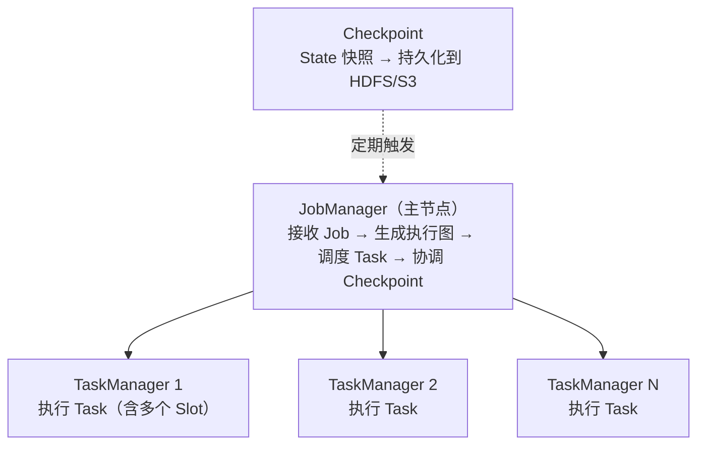

# 6.5 Flink——实时计算引擎

> **一句话定位**：Spark 是"用批处理的思路模拟流"（微批次），Flink 是"原生流处理引擎"——每条数据到达即处理，毫秒级延迟。它是实时大盘、实时风控、实时推荐等场景的首选引擎，也是目前实时计算领域的事实标准。

---

## 一、流处理的核心挑战

实时计算和批处理最大的区别是：**数据没有尽头**。批处理有明确的输入边界（昨天的日志文件），处理完就结束。流处理面对的是源源不断涌入的事件，永远不会"处理完"。

这带来三个独特挑战：

| 挑战 | 含义 | 举例 |
|------|------|------|
| **乱序** | 事件到达顺序 ≠ 事件发生顺序 | 用户 10:00:01 的点击事件在 10:00:05 才到达 Flink |
| **延迟** | 事件可能在很久之后才到达 | 移动端断网恢复后批量上报 |
| **窗口** | 无限流上怎么做聚合？需要把流切成有限的"窗口" | "最近 5 分钟的订单总额" |

Flink 的核心价值就是提供了一套完整的机制来应对这三个挑战。

---

## 二、核心概念

### 2.1 事件时间 vs 处理时间

| 时间语义 | 含义 | 优劣 |
|---------|------|------|
| **Event Time（事件时间）** | 事件实际发生的时间（嵌在数据中） | 结果准确，但需要处理乱序和延迟 |
| **Processing Time（处理时间）** | 事件到达 Flink 的时间 | 最简单、延迟最低，但结果受处理速度影响 |

> **生产经验**：大多数场景用 Event Time。只有对延迟极其敏感且允许结果不精确的场景（如实时监控告警）才用 Processing Time。

### 2.2 Watermark（水位线）——解决乱序

Watermark 是 Flink 用来衡量"事件时间推进到哪了"的机制。它本质是一个时间戳，含义是：**所有时间戳 ≤ Watermark 的事件都已经到达**。

```
数据流：[10:01, 10:03, 10:02, 10:05, 10:04]  ← 乱序到达
Watermark 策略：允许 2 秒乱序

当收到 10:05 的事件时，生成 Watermark = 10:05 - 2s = 10:03
意味着 Flink 认为 10:03 之前的事件都到了，可以触发 10:00-10:03 窗口的计算
```

如果 10:03 之后还来了一个 10:02 的事件——这就是**迟到数据**。Flink 可以配置丢弃、放入侧输出流（Side Output）、或允许窗口更新。

#### Watermark 生成逻辑：maxTimestamp 只增不减

上游生成 Watermark 的逻辑是：维护一个 `maxTimestamp`（已见过的最大时间戳），每次有数据进来，取 `max(maxTimestamp, 当前数据时间戳)` 更新它，然后定期发出 `Watermark(maxTimestamp - allowedLateness)`。

当乱序数据 10:02 在 10:05 之后到达时，数据和 Watermark 走两条独立的逻辑：

```
数据 10:05 到达 → maxTimestamp = max(-∞, 10:05) = 10:05 → 发出 Watermark(10:05 - 2s) = 10:03
数据 10:02 到达 → maxTimestamp = max(10:05, 10:02) = 10:05 → maxTimestamp 不变, 不发新的 Watermark
```

数据 10:02 本身照常往下游流——它是一条普通数据记录，该处理还是处理。但因为它比 maxTimestamp 小，不会更新 maxTimestamp，也就不会产生更小的 Watermark。**数据可以下发，但水位线不会回退。**

这个 10:02 的数据流到下游后，下游算子发现它的时间戳 < 当前 Watermark（10:03），判定为迟到数据，走迟到处理逻辑（丢弃、侧输出、或更新已关闭的窗口）。

#### Watermark 不是数据字段，是流里的特殊记录

Watermark 不是加在每条数据上的新字段，而是数据流里穿插的一种**特殊记录**。可以把它想象成一条管道，里面流着两种类型的元素：

```
[数据] [数据] [数据] [Watermark: 10:03] [数据] [数据] [Watermark: 10:05] [数据] ...
```

它们共享同一条通道，混在一起往下游传。算子处理时会判断元素类型：普通数据走业务逻辑，Watermark 走时间推进逻辑（更新时钟、触发 Timer、关闭窗口等）。

这一点解释了几个关键问题：

Watermark 能跨算子传播——因为它是流里的元素，上游生成后自然跟着数据往下游流，下游收到就能用，不需要每条数据额外携带。

Watermark 不影响数据序列化结构——你的 POJO、Row、JSON 里都没有 Watermark 字段，它是 Flink 运行时层面的东西，对用户数据模型完全透明。

SQL 里 `WATERMARK FOR click_time AS click_time - INTERVAL '5' SECOND` 也不是给表加了列，而是告诉 Flink："请根据 click_time 的值，定期往流里插入 Watermark 记录。"

#### 每个 Task 维护一个事件时间时钟

事件时间时钟不是 per executor 的，而是 **per Task（并行子任务）**。比如并行度为 4，一个算子有 4 个 Task，每个 Task 各自维护独立的事件时间时钟，互不影响。

时钟由收到的 **Watermark 记录**驱动前进（不是直接根据数据时间戳），规则如下：

单输入：收到更大的 Watermark 就推进，取最新值。Watermark 不能倒退。

多输入（如 KeyedCoProcessFunction 有两个输入流）：每个输入流各自维护收到的最新 Watermark，Task 的时钟取**两者中的最小值**。任何一个输入流的 Watermark 没推进，整体时钟就不动。这就是多流"等待"机制的实现方式。

为什么取 min 而不是 max？因为水位线的语义是"这个时间之前的数据都到了"。多个输入流各自有各自的进度，只有当**所有**输入都认为自己推进到了某个时间，才能说"这个时间之前所有流的数据都齐了"。取 max 意味着 A 说到 10:08 了但 B 才到 10:06，10:06 到 10:08 之间 B 的数据可能还没到，提前推进就会漏数据。取 min 就是取"最保守"的时间——被最慢的那个输入拖住，宁可等也不能漏。

```
当前 inputA=10:08, inputB=10:06

取 max → 时钟 = 10:08  ← 激进：B 在 10:06~10:08 的数据可能还没到，会漏
取 min → 时钟 = 10:06  ← 保守：两个流都保证到 10:06，安全
```

Watermark 记录本身不携带"来源流 ID"之类的字段——它只包含一个时间戳。下游 Task 能区分 Watermark 来自哪个输入，靠的是物理通道：每个输入是一条独立的物理通道，Task 内部为每个输入分别维护一个 watermark 值。Watermark 从哪条通道进来，就更新那个输入对应的值。

```
Watermark 记录结构：{ timestamp: 10:06 }，没有别的字段

Task 内部维护：
  input A 的最新 watermark: 10:08   ← 从通道 A 收到的
  input B 的最新 watermark: 10:06   ← 从通道 B 收到的
  当前时钟 = min(10:08, 10:06) = 10:06
```

#### Watermark 实时处理，单调递增不回退

Watermark 的处理是实时的——每收到一条 Watermark，立刻更新该输入通道的值并重新算 min，没有攒批、没有窗口。而且**单个输入通道的 watermark 只增不减**：收到更大的才更新，比当前值小的直接丢弃。因此整体时钟（min）也一定是单调递增的，永远不会回退。

```
时刻1: A 发来 WM=10:03, B 还没发 → inputA=10:03, inputB=-∞, 时钟=min=−∞
时刻2: B 发来 WM=10:04            → inputA=10:03, inputB=10:04, 时钟=min=10:03
时刻3: A 发来 WM=10:05            → inputA=10:05, inputB=10:04, 时钟=min=10:04
时刻4: B 发来 WM=10:06            → inputA=10:05, inputB=10:06, 时钟=min=10:05
时刻5: A 异常发来 WM=10:01        → 10:01 < 10:05, 丢弃, inputA 保持 10:05
```

每个输入只增不减，min 也只增不减，但增长速度被最慢的那个输入拖住。

#### Watermark 不仅驱动窗口

窗口是 Watermark 最常见的消费者，但不是唯一的。Watermark 是整个事件时间体系的"全局时钟指针"，以下机制都订阅这个时钟：

窗口：Watermark 推进到窗口结束时间时，触发计算并关闭窗口。

Event Time Timer：用 `ProcessFunction` 注册的事件时间定时器（如"在事件时间 10:10 时执行某段逻辑"），靠 Watermark 推进来触发，与窗口无关。

Interval Join / 时间维表关联：两个流做时间窗口 join 时，Watermark 决定何时可以认为某时间段数据"齐了"，可以开始 join 并清理过期状态。这里没有传统意义上的窗口，但依然依赖 Watermark。

State 清理：某些算子基于事件时间清理过期状态（如"保留最近 1 小时的状态"），这个"1 小时"按 Watermark 推进来算。

#### Watermark 的代码示例

DataStream API 中手动生成 Watermark：

```java
DataStream<Event> stream = env
    .addSource(new MySource())
    // 为流分配 Watermark 策略：最大乱序 2 秒
    .assignTimestampsAndWatermarks(
        WatermarkStrategy
            .<Event>forBoundedOutOfOrderness(Duration.ofSeconds(2))
            .withTimestampAssigner((event, ts) -> event.getTimestamp())
    );
```

`forBoundedOutOfOrderness` 的内部逻辑就是：记录已见过的最大时间戳 `maxTimestamp`，定期发出 `Watermark(maxTimestamp - 2s)`。这个 Watermark 作为特殊记录混在数据流里往下游传。

多输入场景下（如 Interval Join），每个流各自走自己的 Watermark 策略，各自发送自己的 Watermark，下游算子取最小值推进：

```java
// 两个流各自分配 Watermark 策略
DataStream<Order> orders = env.addSource(...)
    .assignTimestampsAndWatermarks(
        WatermarkStrategy.<Order>forBoundedOutOfOrderness(Duration.ofSeconds(3))
            .withTimestampAssigner((o, ts) -> o.getOrderTime()));

DataStream<Payment> payments = env.addSource(...)
    .assignTimestampsAndWatermarks(
        WatermarkStrategy.<Payment>forBoundedOutOfOrderness(Duration.ofSeconds(5))
            .withTimestampAssigner((p, ts) -> p.getPayTime()));

// Interval Join：下游算子取两个流 Watermark 的最小值作为事件时间时钟
orders
    .keyBy(Order::getOrderId)
    .intervalJoin(payments.keyBy(Payment::getOrderId))
    .between(Time.seconds(-10), Time.seconds(10))
    .process(new OrderPaymentJoinFunc());
```

### 2.3 窗口（Window）

窗口把无限流切成有限的数据集来做聚合。Flink 支持四种窗口：

| 窗口类型 | 含义 | 示例 |
|---------|------|------|
| **滚动窗口（Tumbling）** | 固定大小、不重叠 | 每 5 分钟统计一次 PV |
| **滑动窗口（Sliding）** | 固定大小、可重叠 | 窗口 10 分钟、每 1 分钟滑动一次 |
| **会话窗口（Session）** | 按活跃间隔动态切分 | 用户 30 分钟无操作则关闭会话 |
| **全局窗口（Global）** | 所有数据在一个窗口，需自定义触发器 | 特殊场景 |

---

## 三、架构



| 组件 | 职责 | 类比 |
|------|------|------|
| **JobManager** | 接收用户 Job，生成执行图（JobGraph → ExecutionGraph），调度 Task，协调 Checkpoint | 类似 Spark Driver |
| **TaskManager** | 执行具体的算子逻辑，每个 TaskManager 有多个 **Slot**（执行线程） | 类似 Spark Executor |
| **Slot** | TaskManager 中的资源单元（内存隔离），一个 Slot 运行一条算子链 | 类似 Spark 的 Task |

---

## 四、容错机制——Checkpoint + Exactly-Once

### 4.1 Checkpoint（检查点）

#### Chandy-Lamport 分布式快照算法

Flink 的容错核心是 **Chandy-Lamport 分布式快照算法**。这个算法解决的问题是：在一个持续流动的分布式数据流中，如何在不暂停计算的情况下，给整个系统拍一个一致的"全局快照"。

核心思路是引入 **Marker（标记消息）**——在 Chandy-Lamport 原始论文中叫 marker，Flink 里叫 **Barrier（屏障）**。它是一种特殊的控制消息，混在数据流里跟普通数据一起传输，思路跟 Watermark 类似。

算法流程：

1. **发起**：协调器（Flink 中是 JobManager）决定做快照，向所有 Source 注入一条 Barrier N。
2. **Source 快照**：Source 收到 Barrier N 后，记录自己的状态（如 Kafka 的 offset），然后把 Barrier N 往下游发。
3. **中游对齐**：当一个算子有多个输入时，收到第一个输入的 Barrier N 后，**暂停**该输入的数据处理（先缓冲起来），等所有输入都收到 Barrier N——这叫 **Barrier 对齐**。对齐后，算子保存自己的 State，然后把 Barrier N 往下游发。
4. **完成**：所有算子都保存完 State 后，JobManager 确认这次快照成功。

```
Source → [Barrier N] → Map → [Barrier N] → Aggregate → [Barrier N] → Sink
                           ↓ 对齐 Barrier 时保存快照
                      State Snapshot → HDFS
```

关键点在于 Barrier 把数据流切成了"快照前"和"快照后"两部分。一个算子在 Barrier N 之前处理的数据都属于快照 N 的状态，之后的数据属于下一个快照。因为所有算子都按同一个 Barrier 做切分，所以全局状态是一致的。

#### Watermark 与 Barrier 的区别

两者都是混在数据流里的特殊记录，但触发机制、语义和作用完全不同：

| 维度 | Watermark | Barrier |
|------|-----------|---------|
| **触发方式** | Source 根据数据时间戳**自主生成**，数据驱动 | JobManager 通过 RPC**统一注入**，定时触发（按 checkpoint interval） |
| **语义** | 所有时间戳 ≤ Watermark 的事件都已到达 | 标志快照边界，Barrier 之前的数据属于快照 N，之后属于快照 N+1 |
| **多输入处理** | 取**min**（最小值），推进事件时间时钟 | 取**对齐**（等所有输入都收到），然后保存快照 |
| **方向** | 从 Source 往下游流，驱动时间推进 | 从 Source 往下游流，协调全局快照 |
| **作用** | 驱动窗口触发、Event Time Timer、Interval Join、State 清理 | 驱动 Checkpoint 状态快照 |
| **是否可丢弃** | 比当前值小的会被丢弃（只增不减） | 不能丢弃，必须严格按编号顺序处理 |
| **生成位置** | Source 或任何能提取时间戳的算子 | 仅由 JobManager 注入，从 Source 开始 |

一句话总结：**Watermark 管"时间到了没"，Barrier 管"快照切在哪"**。Watermark 推进事件时间，决定业务逻辑何时触发；Barrier 推进快照进度，决定容错状态何时保存。两者互不干扰，各自在数据流里独立传播。

**Barrier 对齐的代价**：多输入算子需要对齐 Barrier，对齐期间会暂停处理较快输入的数据（缓冲起来），这会引入短暂延迟。Flink 还提供了 **非对齐 Checkpoint（Unaligned Checkpoint）** 选项：不做对齐，直接把缓冲区里的数据也存进快照。这样更快，但快照更大。适合反压严重、对齐时间过长的场景。

#### 非对齐 Checkpoint（Unaligned Checkpoint）的精确原理

传统对齐 Checkpoint 在反压严重时，对齐时间会无限拉长（因为下游处理不过来，上游数据堆积，Barrier 迟迟无法对齐），最终导致 Checkpoint 超时。Flink 1.11+ 引入的 Unaligned Checkpoint 解决了这个问题：

- 当某个输入流的 Barrier 到达时，算子**不需要等待其他输入流**，而是立即将当前所有输入缓冲区中 barrier 之后的数据、输出缓冲区中待发送的数据，连同当前算子状态一起存入快照。
- 恢复时，这些被快照的缓冲数据会重新注入到算子的输入队列中重新计算。关键是：**算子状态本身只包含 barrier 之前的数据处理结果**，barrier 之后的数据只是被"缓存"在快照里，恢复时重新消费，所以不会重复也不会丢失。
- 优点：Checkpoint 不受反压影响，对齐时间几乎为零。
- 缺点：快照需要额外保存缓冲数据，体积更大；恢复时需要重新注入缓冲数据，启动时间稍长。

Flink 1.11+ 可以通过配置 `execution.checkpointing.unaligned: true` 启用，也可以配置 `alignment-timeout`（默认 0ms，即立即降级），当对齐时间超过阈值时自动降级为 Unaligned Checkpoint。

#### 生产环境 Checkpoint 配置

| 配置参数 | 含义 | 生产建议 |
|---------|------|---------|
| `checkpoint.interval` | 两次 Checkpoint 的间隔 | 通常 1~10 分钟，太小会拖垮系统，太大会增加恢复时数据重放量 |
| `checkpoint.timeout` | 单次 Checkpoint 的超时时间 | 通常设为 interval 的 2~3 倍，超时则失败 |
| `max-concurrent-checkpoints` | 最大并发 Checkpoint 数 | 默认 1；如果单次 Checkpoint 耗时 > interval，建议增加，但不宜过大 |
| `min-pause-between-checkpoints` | 两次 Checkpoint 之间的最小间隔 | 防止 Checkpoint 过于密集，给 Task 留出处理时间 |
| `execution.checkpointing.unaligned` | 是否启用非对齐 Checkpoint | 反压严重时启用；正常场景建议保持对齐（默认 false） |
| `execution.checkpointing.max-aligned-checkpoint-size` | 对齐 Checkpoint 的最大缓冲数据量 | 控制 Unaligned Checkpoint 的内存上限 |
| `state.checkpoints.dir` | Checkpoint 存储路径（HDFS/S3） | 生产必选，取消作业后如未配置 `externalized-checkpoint` 则数据丢失 |
| `execution.checkpointing.externalized-checkpoint-retention` | 作业取消后是否保留 Checkpoint | 生产必须设为 `RETAIN_ON_CANCELLATION`，否则取消作业后无法恢复 |

**关于 `externalized-checkpoint` 的坑**：默认情况下，作业取消（cancel）时 Flink 会自动删除对应的 Checkpoint 数据。如果后续想从该 Checkpoint 恢复（如回滚版本），会发现数据已丢失。生产环境必须配置 `execution.checkpointing.externalized-checkpoint-retention: RETAIN_ON_CANCELLATION`，这样 Checkpoint 才会保留。

任务失败时，从最近一次成功的 Checkpoint 恢复 State，数据源（如 Kafka）从对应 offset 重放，实现 **Exactly-Once** 语义。


### 4.2 端到端 Exactly-Once 语义

#### Checkpoint 与两阶段提交（2PC）的关系

首先需要澄清一个常见误区：**Checkpoint 本身只保证 Flink 内部算子状态的 exactly-once**——即算子状态在故障恢复后不丢不重。但 Checkpoint 不负责 Sink 写入外部系统（如 Kafka、MySQL）的一致性。如果 Sink 在 Checkpoint 完成后、数据真正写入外部系统前崩溃，外部系统仍可能丢失或重复数据。

**两阶段提交（2PC）解决的是 Sink 端与外部系统的一致性**。它不是在替代 Checkpoint，而是在 Checkpoint 保证内部一致性的基础上，**额外保证外部系统的一致性**。两者的关系是协作：Checkpoint 负责"算子状态不丢不重"，2PC 负责"外部写入不丢不重"。只有 Sink 需要事务时，才需要 2PC；Source 端只需要支持按 offset 重放（不需要 2PC）。

Exactly-Once 不是 Flink 单方面保证的，而是整个数据管道所有组件一致性的**木桶效应**——整个端到端一致性级别取决于所有组件中最弱的一环。具体可以划分为三个层面：

| 层面 | 要求 | 实现方式 |
|------|------|---------|
| **内部保证** | Flink 自身不丢不重 | Checkpoint 机制 + Barrier 对齐 |
| **Source 端** | 故障后可重放，不丢数据 | 数据源支持按 offset / 位置回溯重读（Kafka Consumer 保存 offset） |
| **Sink 端** | 故障恢复时不重复写入外部系统 | 幂等（Idempotent）写入 或 事务性（Transactional）写入 |

Flink 通过**两阶段提交（2PC）**协议与支持事务的 Sink（如 Kafka 0.11+）配合，实现真正的端到端 Exactly-Once。

#### 4.2.1 幂等写入（Idempotent Writes）

幂等操作是指重复执行多次，只导致一次结果更改。如果 Sink 系统天然支持幂等（如按主键去重的数据库、按 doc id 索引的 Elasticsearch），可以用 **at-least-once + 下游幂等** 替代 2PC，性能更好。典型做法是：为每条数据生成唯一标识（如业务主键），Sink 写入时冲突即覆盖或忽略。

#### 4.2.2 事务写入

事务写入的核心思想是：**构建的事务对应着 Checkpoint，等到 Checkpoint 真正完成时，才把所有对应结果写入 Sink 系统**。DataStream API 提供了 `GenericWriteAheadSink`（预写日志 WAL）和 `TwoPhaseCommitSinkFunction`（两阶段提交）两种事务性写入模板。

##### 预写日志（WAL）

把结果数据先作为 State 缓存，收到 Checkpoint 完成通知后，一次性批量写入 Sink。简单通用，但延迟较大，且外部系统需要支持批量写入。

##### 两阶段提交（2PC）

两阶段提交协议（Two-Phase Commit）是分布式系统中协调多节点事务一致性的经典算法。在 Flink 中，它被用来协调 Sink 与 Checkpoint 的提交节奏：

**第一阶段（预提交）**：当 Checkpoint 启动时，JobManager 向数据流注入 Barrier。Sink 收到 Barrier 后，将当前事务中的数据写入外部系统（如 Kafka），但**不提交**——此时数据处于预提交状态，对外部消费者不可见（Kafka 的 `read_committed` 隔离级别下）。然后 Sink 将当前事务 ID 等状态保存到 Checkpoint。

**第二阶段（正式提交）**：当所有算子的 Checkpoint 都成功完成后，JobManager 向所有 Task 发送确认通知。Sink 收到通知后，调用外部系统的事务提交（如 `producer.commitTransaction()`），数据才真正变为可见和可消费。

如果 Checkpoint 失败或作业崩溃，Flink 从最近一次成功的 Checkpoint 恢复，Sink 会重新执行 `commit()`（因为 Checkpoint 中已记录待提交的事务信息）。这要求**提交操作必须是幂等的**——Kafka 在相同事务 ID 下重复调用 `commitTransaction` 是安全的。

#### 4.2.3 两阶段提交的完整时序

以 Flink + Kafka 为例，端到端 exactly-once 的时序如下：

```
1. 数据持续流入，Kafka Producer 在事务中写入数据（预提交，未 commit）
2. JobManager 注入 Barrier N
3. Source 收到 Barrier，保存 offset 到状态后端，向下游传递 Barrier
4. Sink 收到 Barrier N，将当前事务数据 flush 到 Kafka，但不 commit
5. Sink 开启新事务（用于 Checkpoint N+1 的数据），将 Barrier 继续向下传递
6. 所有算子完成状态快照，JobManager 确认 Checkpoint N 成功
7. Sink 收到 Checkpoint 完成通知，正式提交旧事务（commitTransaction）
8. Kafka 中该事务的数据变为可见，消费者可以读取
```

关键点：预提交阶段的数据已写入 Kafka 的日志，但消费者通过 `read_committed` 隔离级别看不到；只有 `commitTransaction` 后，事务内消息才从 `uncommitted` 变为 `committed`。

#### 4.2.4 2PC 对外部 Sink 系统的要求

并非所有 Sink 都支持 2PC，需要满足以下条件：

- 外部系统必须提供**事务支持**（或 Sink 能模拟事务）。
- 在 Checkpoint 间隔期间内，能**开启事务并接受数据写入**。
- 在收到 Checkpoint 完成通知前，事务必须处于**"等待提交"**状态。若事务超时关闭（如 Kafka 事务超时），未提交数据会丢失。
- Sink 必须能在**进程失败后恢复事务**（通过 Checkpoint 中的事务状态）。
- **提交事务必须是幂等操作**（支持重复提交相同事务）。

#### 4.2.5 Flink + Kafka 端到端 Exactly-Once

Flink + Kafka 是经典的端到端 exactly-once 数据管道（Kafka 进、Kafka 出）。各组件的职责如下：

| 组件 | 保证机制 |
|------|---------|
| **Flink 内部** | Checkpoint 保存算子状态，故障时从 State Backend 恢复 |
| **Kafka Source** | Consumer 将 offset 作为 State 保存，恢复时按 offset 重放，不丢数据 |
| **Kafka Sink** | Producer 启用事务（`transactional.id`），通过 2PC 与 Flink Checkpoint 配合，不重复写入 |
| **Kafka Consumer（下游）** | 必须设置 `isolation.level=read_committed`，否则可能读取到被 abort 的事务数据，破坏端到端一致性 |

**Kafka Producer 的事务代码示例**：

```java
Properties props = new Properties();
props.put("bootstrap.servers", "kafka:9092");
props.put("transactional.id", "my-producer-id"); // 启用事务，必须设置唯一事务 ID
props.put("enable.idempotence", "true");         // 开启幂等性

KafkaProducer<String, String> producer = new KafkaProducer<>(props);
producer.initTransactions();
producer.beginTransaction();
producer.send(new ProducerRecord<>("topic", "key", "value"));
producer.commitTransaction(); // 或 abortTransaction()
```

#### 4.2.6 生产环境配置与常见踩坑

**事务超时与 Checkpoint 间隔的匹配**

Kafka 的 `transaction.timeout.ms` 默认是 60 秒。如果 Flink 的 Checkpoint 间隔（`checkpoint.interval`）设置得太大（比如 5 分钟），在 Checkpoint 完成前 Kafka 事务可能已超时并被 Coordinator 中止，导致数据丢失。

**解决方法**：确保 Kafka 的事务超时 > Flink 的 Checkpoint 间隔 + 最大容忍时间。Flink 的 `KafkaSink` 提供了 `transaction.timeout.ms` 配置，应与 Kafka Broker 端的 `transaction.max.timeout.ms` 相匹配。

```java
// Flink KafkaSink 事务超时配置（应小于 Kafka broker 的 transaction.max.timeout.ms）
KafkaSink<String> sink = KafkaSink.<String>builder()
    .setBootstrapServers("kafka:9092")
    .setRecordSerializer(...)
    .setDeliveryGuarantee(DeliveryGuarantee.EXACTLY_ONCE)
    .setProperty("transaction.timeout.ms", "900000") // 15 分钟，需匹配 broker 配置
    .build();
```

**其他常见踩坑**：

- 下游消费者未设置 `read_committed`：即使 Flink 做到了 exactly-once，下游消费者用 `read_uncommitted` 仍会读到未提交或被 abort 的数据。
- `transactional.id` 冲突：同一个 `transactional.id` 不能同时被两个 Producer 实例使用，否则 Kafka 会报错。Flink 通过 `subtaskIndex` 来生成唯一的事务 ID，确保每个并行子任务互不冲突。
- 事务协调器故障：Kafka 的 Transaction Coordinator 负责管理事务状态，如果 Coordinator 发生故障转移，正在等待提交的 2PC 事务可能会超时，需要合理设置超时参数。

#### 4.2.7 API 演进：FlinkKafkaProducer 与 KafkaSink

Flink 的 Kafka Sink API 经历了演进：

- **Flink 1.4~1.14**：使用 `FlinkKafkaProducer`，需继承 `TwoPhaseCommitSinkFunction` 实现自定义 2PC Sink。这是较老的 API，已在 Flink 1.15 起标记为 deprecated。
- **Flink 1.15+**：推荐使用 `KafkaSink`，内置 `EXACTLY_ONCE` / `AT_LEAST_ONCE` / `NONE` 三种投递保证，通过 `DeliveryGuarantee` 枚举直接配置，无需手动实现 2PC 接口。

```java
// Flink 1.15+ 推荐使用的新 API
KafkaSink<String> sink = KafkaSink.<String>builder()
    .setBootstrapServers("kafka:9092")
    .setRecordSerializer(KafkaRecordSerializationSchema.builder()
        .setTopic("output-topic")
        .setValueSerializationSchema(new SimpleStringSchema())
        .build())
    .setDeliveryGuarantee(DeliveryGuarantee.EXACTLY_ONCE)
    .build();

stream.sinkTo(sink);
```

#### 4.2.8 2PC 与 at-least-once + 幂等的权衡

| 方案 | 优点 | 缺点 | 适用场景 |
|------|------|------|---------|
| **2PC** | 严格 exactly-once，不依赖下游去重 | 有性能开销（事务协调、屏障同步、超时限制），Checkpoint 间隔不能太大 | 金融交易、对账、不允许重复的关键业务 |
| **at-least-once + 幂等** | 性能更好，无事务超时限制，实现简单 | 需要 Sink 系统或业务层支持幂等 | 日志写入、指标上报、下游支持主键去重 |

如果下游系统天然支持幂等（如按主键更新的 MySQL、按 doc id 写入的 Elasticsearch），**at-least-once + 幂等** 通常是更轻量、更可靠的选择。只有在下游无法幂等、且业务对重复零容忍时，才必须使用 2PC。


---

## 五、状态管理

### 5.1 State 分类

一个 Flink Job 通常由 Source → Transformation → Sink 组成，每个算子在一个或多个 Task 中并行运行。State 就是流处理过程中需要"记住"的数据快照，既包括业务数据（如累加计数），也包括元数据（如 Kafka Consumer 的 offset）。

| 类型 | 作用域 | 典型场景 | 缩放行为 |
|------|--------|---------|---------|
| **Keyed State** | 每个 key 一份，仅在 KeyedStream 上可用 | 按 key 聚合的计数、求和、窗口状态 | 按 Key Group 重新分配 |
| **Operator State** | 每个 Sub-Task（并行实例）一份 | Kafka Source 的 offset 列表、Broadcast State | 按 List 重新分配 |

Keyed State 可以理解为"分布式 Map"——从每条记录中提取 key，状态按 key 隔离存储。常见的 Keyed State 类型：ValueState（单值）、ListState（列表）、MapState（映射）、ReducingState（聚合）、AggregatingState（聚合输出不同类型）。

Operator State 常见类型：ListState（如 Kafka Source 每个 Sub-Task 维护自己消费的 partition offset 列表）、BroadcastState（广播状态，所有 Sub-Task 持有完整副本）。

### 5.1.1 State TTL（状态过期清理）

Keyed State 可以设置 TTL（Time-To-Live），让状态在一定时间后自动清理，防止状态无限增长撑爆磁盘/内存。这对累积型统计（如"最近 24 小时的用户点击数"）非常关键——如果不清理，State 会永远增长，最终因 Checkpoint 过大或 RocksDB 文件过多而失败。

```java
StateTtlConfig ttlConfig = StateTtlConfig
    .newBuilder(Time.hours(24))          // 状态存活 24 小时
    .setUpdateType(StateTtlConfig.UpdateType.OnCreateAndWrite)  // 每次读写都刷新过期时间
    .setStateVisibility(StateTtlConfig.StateVisibility.NeverReturnExpired)  // 过期后不可见
    .build();

ValueStateDescriptor<String> descriptor = new ValueStateDescriptor<>("userState", String.class);
descriptor.enableTimeToLive(ttlConfig);
ValueState<String> state = getRuntimeContext().getState(descriptor);
```

**清理策略**：

- **惰性清理（Lazy Cleanup）**：读取时判断是否过期，过期则删除。不会主动扫描，但可能留下"僵尸状态"（如果某 key 再也不被访问，就永远不会被清理）。
- **RocksDB Compaction 时清理**：RocksDB 做后台 Compaction 时，会检查并删除过期的状态。需要依赖 RocksDB 的 Compaction 频率，不是实时的。
- **全量快照清理**：在生成 Checkpoint 快照时，清理过期状态。恢复后不会再有过期数据，但 Checkpoint 文件本身仍包含过期数据（只是恢复后会被清理）。

**实践建议**：生产环境必须根据业务语义设置 TTL，避免 State 无限膨胀。例如，按用户会话统计时，会话超时后相关状态就应清理。TTL 时间应略大于业务最大窗口或超时时间。

### 5.2 为算子设置 UID——Savepoint 恢复的关键

Flink 在恢复 State 时，通过 **UID** 将 Savepoint 中的状态映射到对应的算子。UID 和状态唯一绑定。

默认情况下，Flink 通过遍历 JobGraph 并 hash 算子属性自动生成 UID。这很方便但**非常脆弱**——任何对 JobGraph 的改动（加算子、改顺序、调并行度）都可能导致 UID 变化，进而导致状态无法恢复。

```java
// 强烈建议：给所有有状态的算子手动指定 UID（包括 Source 和 Sink）
env.addSource(new MySource()).uid("my-source")
    .keyBy(anInt -> 0)
    .map(new MyStatefulFunction()).uid("my-map")
    .addSink(new DiscardingSink<>()).uid("my-sink");
```

**实践原则**：有状态的算子必须设 UID，无状态的算子设了也没坏处。如果通过 SQL 层或解析器间接生成 Flink Job，要确保解析器能生成稳定的 UID，否则修改 SQL 后 Savepoint 恢复会大面积丢失状态。

### 5.3 State 存储后端

以最常用的 **RocksDBStateBackend** 为例，状态数据的流动分为三层：

```
用户代码 → 本地 RocksDB 文件（实时读写） → HDFS/S3（Checkpoint 异步同步）
```

- 用户代码产生的 State 实时存储在 TaskManager 本地的 RocksDB 文件中，100% 本地性，不需要网络传输。
- Checkpoint 触发时，RocksDB 的增量快照异步同步到远端分布式文件系统（HDFS/S3）。
- 各 Sub-Task 只负责自己所属的那部分状态，不需要互相传输，也不频繁读写 HDFS。
- 作业重启时，从 HDFS 取回 State 数据到本地 RocksDB，恢复现场。

#### RocksDB 增量 Checkpoint 原理

RocksDB 采用 LSM-Tree 结构：新数据先写入内存 MemTable，MemTable 满了之后刷盘生成不可变的 SST 文件（Sorted String Table）。已存在的 SST 文件不会被修改（只能被合并/删除）。

基于这个特性，增量 Checkpoint 的工作方式是：

- **全量 Checkpoint**：将 RocksDB 当前所有的 SST 文件全部上传到 HDFS/S3。
- **增量 Checkpoint**：只上传**自上次 Checkpoint 以来新增或修改的 SST 文件**。因为旧的 SST 文件一旦生成就不会改变，所以不需要重复上传。
- 每次 Checkpoint 只记录一个"文件清单"（manifest），包含哪些 SST 文件属于该次快照。恢复时按照清单从 HDFS 拉取所有涉及的 SST 文件重建本地状态。

**优点与代价**：增量 Checkpoint 大幅减少了上传的数据量，缩短了 Checkpoint 时间。但代价是状态历史链（SST 文件链）会越来越长，恢复时需要回溯并下载多个增量文件，全量恢复时间可能更长。因此生产环境需要定期做全量 Checkpoint（Flink 会自动做全量对齐，也可以通过配置触发）。

| State Backend | 存储位置 | 适用场景 | 特点 |
|---------------|---------|---------|------|
| **MemoryStateBackend** | 纯内存（Java 堆） | 验证、测试 | 不推荐生产，State 大小受 JVM 堆限制 |
| **FsStateBackend** | 内存 + 文件（HDFS/S3） | 中小规模 State | State 在内存中，Checkpoint 时写文件 |
| **RocksDBStateBackend** | 本地 RocksDB 文件 + HDFS/S3 | 大规模 State（生产首选） | 支持增量 Checkpoint，State 大小不受 JVM 堆限制 |

### 5.4 State 重分布——改变并行度时的状态分配

Flink 不支持运行时动态改变并行度，必须先停止作业，修改并行度后从 Savepoint 恢复。改变并行度后，State 怎么分配给新的 Sub-Task？

**Operator State 的重分布**：

- **ListState**：将所有 Sub-Task 的 List 取出合并，然后按元素个数均匀分配给新的 Sub-Task。
- **UnionListState**：将所有 List 拼接起来，不做划分，直接完整分发给每个新的 Sub-Task（由用户自行处理）。
- **BroadcastState**：直接复制到所有新的 Sub-Task（每个 Sub-Task 持有完整副本）。

**Keyed State 的重分布——Key Group 机制**：

如果没有状态，改变并行度只需要重新分配数据流即可。但 Keyed State 的状态数据存在 HDFS 里，并行度变化后需要决定哪些状态分给哪个 Sub-Task。

最朴素的想法是按 `hash(key) % newParallelism` 重新分配。但问题在于：Checkpoint 时状态是顺序写入文件的，恢复时需要随机读（HDFS 不带按 key 的索引），效率极低；而且重新分配后各 Sub-Task 处理的 key 可能和之前完全不同，本地性很差。

为解决这个问题，Flink 引入了 **Key Group（键组）**：

- Key Group 是 Keyed State 分配的**原子单位**，不能再细分。
- Key Group 的数量 = **最大并行度（maxParallelism）**，索引范围为 `[0, maxParallelism - 1]`。
- 每个 Sub-Task 处理一个或多个 Key Group。

**key 如何分配到 Key Group？** 对 key 做两重哈希（一次取 hashCode，一次做 MurmurHash）后对最大并行度取余：

```
keyGroupIndex = MathUtils.murmurHash(key.hashCode()) % maxParallelism
```

**Key Group 如何分配到 Sub-Task？** 由并行度、最大并行度和 Sub-Task 索引共同决定：

```
// 简化逻辑
int keyGroupsPerTask = maxParallelism / parallelism  // 均匀分配
startGroup = subTaskIndex * keyGroupsPerTask
endGroup = startGroup + keyGroupsPerTask - 1
```

例如，最大并行度 = 10，当前并行度从 3 改为 4：

```
并行度 = 3 时：
  Sub-Task 0 → Key Group [0, 1, 2, 3]    (4 个)
  Sub-Task 1 → Key Group [4, 5, 6]        (3 个)
  Sub-Task 2 → Key Group [7, 8, 9]        (3 个)

并行度 = 4 时（从 Savepoint 恢复）：
  Sub-Task 0 → Key Group [0, 1]           (2 个)
  Sub-Task 1 → Key Group [2, 3, 4]        (3 个)
  Sub-Task 2 → Key Group [5, 6, 7]        (3 个)
  Sub-Task 3 → Key Group [8, 9]           (2 个)
```

每个 Sub-Task 只需要从 Checkpoint 中读取自己负责的 Key Group 的数据，不需要读取整个文件，解决了随机读和本地性问题。

### 5.5 最大并行度（Max Parallelism）

Key Group 的数量 = 最大并行度，这意味着**当前并行度不能超过最大并行度**，否则有 Sub-Task 分不到 Key Group 变成空转，Flink 会直接报错：

```
Caused by: org.apache.flink.runtime.JobException: 
  Vertex Map's parallelism (4) is higher than the max parallelism (2).
  Please lower the parallelism or increase the max parallelism.
```

**最大并行度一旦设置就不可轻易修改**——因为 Key Group 数量变了，Checkpoint 中的状态快照无法映射到新的 Key Group，所有状态快照会失效。

**默认值规则**（未手动设置时）：

- 当并行度 < 128 时，最大并行度默认 = 128
- 当并行度 ≥ 128 时，最大并行度 = `parallelism + parallelism / 2`，上限为 32768（2^15）

**设置方式**：

```java
final StreamExecutionEnvironment env = StreamExecutionEnvironment.getExecutionEnvironment();
env.getConfig().setMaxParallelism(4);
```

**实践建议**：最大并行度应根据未来数据增量预估设置——当前并行度 ≤ 最大并行度，留出扩容空间。但不要设得过大，因为 Key Group 数量越多，状态元数据越大，Checkpoint 快照也随之增大，会降低性能。在满足业务需求的前提下设置尽可能小的最大并行度。

### 5.6 Savepoint 恢复规则

从 Savepoint 恢复时，Flink 按 UID 匹配算子状态。以下是各种代码变更的恢复情况：

| 变更类型 | 能否恢复 | 说明 |
|---------|---------|------|
| 算子顺序改变，UID 不变 | 可以 | 按 UID 匹配，与位置无关 |
| 新增无状态算子 | 可以 | 无状态不涉及恢复 |
| 新增有状态算子 | 可以（新算子无初始状态） | 不影响已有算子恢复 |
| 删除有状态算子 | 默认报错 | 需加 `-allowNonRestoredState`（`-n`）跳过 |
| UID 变了 | 恢复失败 | 找不到对应状态，最常见的事故 |
| 调整并行度 | 可以（≤ maxParallelism） | 按 Key Group 重新分配 |
| 修改最大并行度 | 状态失效 | Key Group 数量变化，无法映射 |

#### Savepoint 格式与兼容性

Flink 1.11+ 开始，Checkpoint 和 Savepoint 的格式已经统一（都基于 `canonical` 格式），两者可以互换使用。但它们的**默认保存路径**不同：Checkpoint 使用 `state.checkpoints.dir`，Savepoint 使用 `state.savepoints.dir`。

从 Savepoint 恢复时，如果算子拓扑发生变化（如删除有状态算子），需要加 `--allowNonRestoredState`（或 `-n`）跳过缺失的状态，否则恢复会报错。新增有状态算子不影响恢复（新算子从空状态启动）。

```bash
# 从 Savepoint 恢复，允许跳过缺失的状态
flink run -s hdfs://path/to/savepoint -n -c com.example.MyJob my-job.jar
```
---

## 六、Flink SQL

Flink 也支持 SQL 接口，语法和 Hive SQL / 标准 SQL 类似，但增加了流处理专用语法：

```sql
-- 创建 Kafka 数据源表
CREATE TABLE user_clicks (
    user_id BIGINT,
    url STRING,
    click_time TIMESTAMP(3),
    WATERMARK FOR click_time AS click_time - INTERVAL '5' SECOND  -- Watermark
) WITH (
    'connector' = 'kafka',
    'topic' = 'clicks',
    'properties.bootstrap.servers' = 'kafka:9092',
    'format' = 'json'
);

-- 每 10 分钟统计每个用户的点击次数（滚动窗口）
SELECT 
    user_id,
    TUMBLE_START(click_time, INTERVAL '10' MINUTE) as window_start,
    COUNT(*) as click_count
FROM user_clicks
GROUP BY user_id, TUMBLE(click_time, INTERVAL '10' MINUTE);
```

---

## 七、面试深度剖析

### 考点 1：Flink vs Spark Streaming

> **面试官**：「Flink 和 Spark Streaming 有什么区别？」

核心区别是计算模型：Spark Streaming（包括 Structured Streaming）是**微批次**——把流按时间间隔切成小批次，每个批次当作 RDD/DataFrame 处理，延迟在秒级。Flink 是**逐条处理**——每条事件到达即计算，延迟在毫秒级。Flink 在事件时间处理、Watermark、Exactly-Once 语义上更成熟。

### 考点 2：Checkpoint 和 Savepoint 的区别

> **面试官**：「Checkpoint 和 Savepoint 有什么区别？」

Checkpoint 是 Flink 自动定期触发的快照，用于故障恢复，生命周期和任务绑定（任务取消后可配置保留或删除）。Savepoint 是用户手动触发的快照，用于有计划的停机（升级代码、调整并行度）和迁移，永久保留。两者的格式和恢复机制相同。

### 考点 3：Watermark 怎么工作

> **面试官**：「如果数据严重乱序，Watermark 怎么设置？」

Watermark 的延迟容忍时间需要在"结果准确性"和"延迟"之间权衡。设得太小，迟到数据被丢弃，结果不准；设得太大，窗口迟迟不触发，延迟高。实践中先统计数据的乱序程度（P99 延迟），把 Watermark 设为 P99 值。严重迟到的数据用 Side Output 收集后异步修正。

### 考点 4：反压（Backpressure）

> **面试官**：「Flink 处理不过来怎么办？」

Flink 有天然的反压机制：下游算子处理不过来时，它的输入缓冲区满了，上游算子的输出缓冲区也随之满了，一层层传导到 Source，Source 自动降低读取速率。不需要额外配置。反压持续过久说明需要加资源（增加并行度）或优化算子逻辑。

### 考点 5：Key Group 和最大并行度

> **面试官**：「Flink 改并行度时状态怎么恢复？Key Group 是什么？」

Flink 用 Key Group 作为 Keyed State 重分配的原子单位。Key Group 数量 = 最大并行度，key 通过 `murmurHash(key.hashCode()) % maxParallelism` 分配到某个 Key Group，每个 Sub-Task 负责一段连续的 Key Group 范围。改变并行度时，Key Group 的归属重新划分，但 Key Group 到 key 的映射不变，所以状态能正确恢复。最大并行度一旦设定不能随意改，否则 Key Group 数量变化导致状态失效。默认值：并行度 < 128 时取 128，否则取 `parallelism + parallelism / 2`。

### 考点 6：Savepoint 恢复的坑

> **面试官**：「修改 Flink 作业代码后从 Savepoint 恢复，有哪些注意事项？」

最关键的是 UID——不手动指定 UID 时，Flink 自动 hash 生成，代码任何改动都可能导致 UID 变化，状态恢复失败。所以有状态的算子必须手动 `.uid()`。其他规则：新增无状态算子不影响恢复；删除有状态算子需加 `-n` 跳过；调整并行度可以恢复（≤ maxParallelism）；修改最大并行度会导致状态失效。

### 考点 7：Watermark 与 Barrier 的区别

> **面试官**：「Watermark 和 Barrier 有什么区别？」

两者都是混在数据流里的特殊记录，但本质不同。Watermark 是 Source 根据数据时间戳自主生成的，驱动事件时间推进，决定窗口何时触发、Timer 何时执行。Barrier 是 JobManager 通过 RPC 定时注入的，标志快照边界，协调全局状态一致性。Watermark 在多输入时取 min，Barrier 在多输入时对齐。一句话：Watermark 管"时间到了没"，Barrier 管"快照切在哪"。

### 考点 8：两阶段提交与端到端 Exactly-Once

> **面试官**：「Flink 怎么做到端到端 exactly-once？两阶段提交是怎么工作的？」

端到端 exactly-once 取决于整个数据管道的最弱一环，分为三层：内部 Checkpoint 保证、Source 支持重放、Sink 支持事务或幂等。Flink 内部通过 Checkpoint + Barrier 对齐实现状态一致性；Source 端如 Kafka 将 offset 保存到 State，故障后按 offset 重放；Sink 端通过 2PC 与外部事务系统配合：收到 Barrier 时预提交数据（写入但不 commit），Checkpoint 完成后收到 JobManager 确认再正式提交。Kafka 的 Consumer 下游必须设置 `read_committed` 隔离级别，否则可能读到未提交数据。生产环境常见坑是 Kafka 事务超时（默认 60s）小于 Flink Checkpoint 间隔，导致事务被 abort 数据丢失。若下游支持幂等，也可选择 at-least-once + 下游去重，性能更好。

### 考点 9：Checkpoint 为什么越大恢复越慢？增量 Checkpoint 恢复为什么可能比全量慢？

> **面试官**：「Checkpoint 大小和延迟有什么关系？增量 Checkpoint 恢复为什么可能比全量慢？」

Checkpoint 大小直接影响三个维度：快照写入时间（越大写入 HDFS 越慢）、网络带宽占用（并发 Checkpoint 时可能挤占业务带宽）、恢复时间（需要下载并反序列化更多状态数据）。

增量 Checkpoint 恢复快的原因：恢复时需要回溯从上次全量 Checkpoint 以来的所有增量文件链。如果增量链很长（比如几十个增量 Checkpoint 后做一次全量），恢复时需要下载几十个文件并在本地重建 RocksDB，可能比下载一个全量文件更慢。因此 Flink 内部会定期做全量对齐（或触发全量 Checkpoint），以控制增量链长度。

### 考点 10：为什么 Flink 1.11+ 引入 Unaligned Checkpoint？解决了什么问题？

> **面试官**：「Unaligned Checkpoint 解决了什么问题？和对齐 Checkpoint 的本质区别是什么？」

对齐 Checkpoint 在反压场景下，下游处理不过来导致 Barrier 无法对齐，对齐时间无限拉长，最终 Checkpoint 超时。Unaligned Checkpoint 通过不对齐、直接把缓冲数据也存入快照的方式，让 Checkpoint 不受反压影响，对齐时间几乎为零。本质区别在于：对齐 Checkpoint 的算子状态只包含 barrier 之前的数据结果；Unaligned Checkpoint 额外把 barrier 之后还在缓冲区的数据也快照进去，恢复时重新注入重新计算。用更大的快照体积换取更稳定的 Checkpoint 成功率。

### 考点 11：Broadcast State 的 Checkpoint 有什么特点？

> **面试官**：「Broadcast State 改变并行度时怎么恢复？」

Broadcast State 属于 Operator State，所有并行子任务持有**完全相同的副本**。Checkpoint 时每个 Sub-Task 都会保存完整副本；恢复时（无论并行度是否变化），每个 Sub-Task 都会获得完整副本。因此 Broadcast State 不涉及 Key Group 重分配，也不受并行度变化影响。典型场景是动态配置（如规则引擎），通过 Broadcast Stream 将规则广播到所有 Sub-Task，每个 Sub-Task 本地保存一份规则状态，避免每个 key 都存一份规则。

---

[← 6.4 Spark](./04-Spark.md) | [返回本章目录](./README.md) | [6.6 Doris →](./06-Doris.md)
