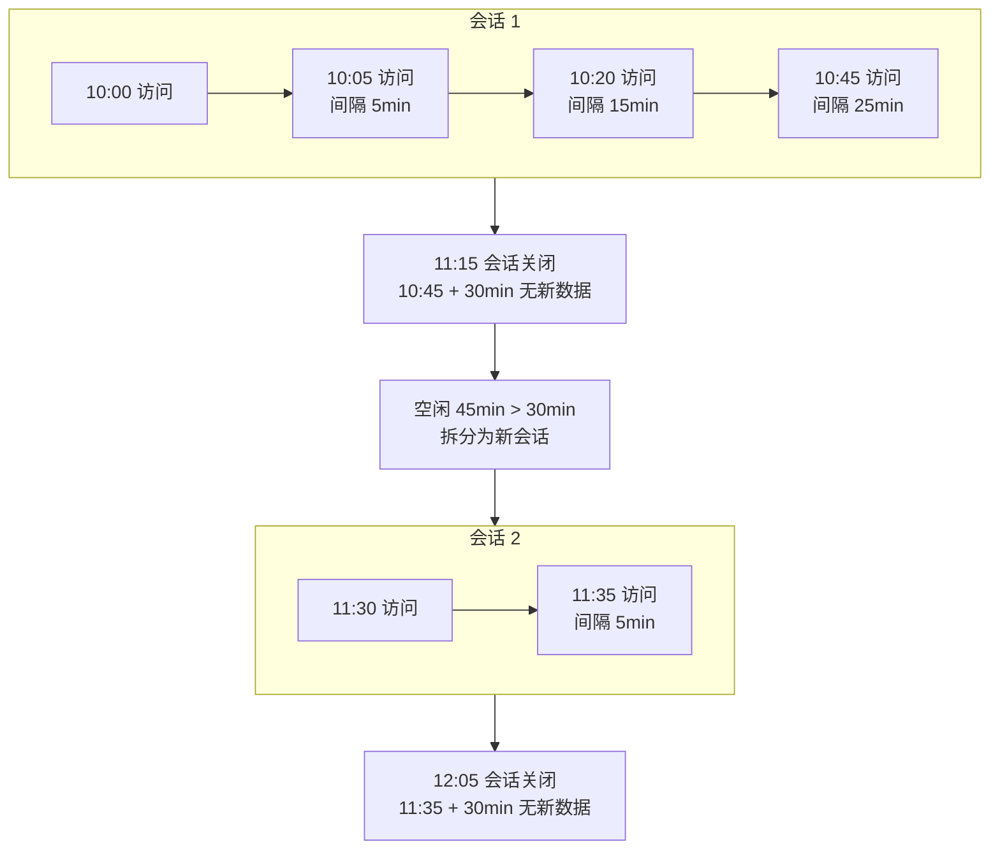
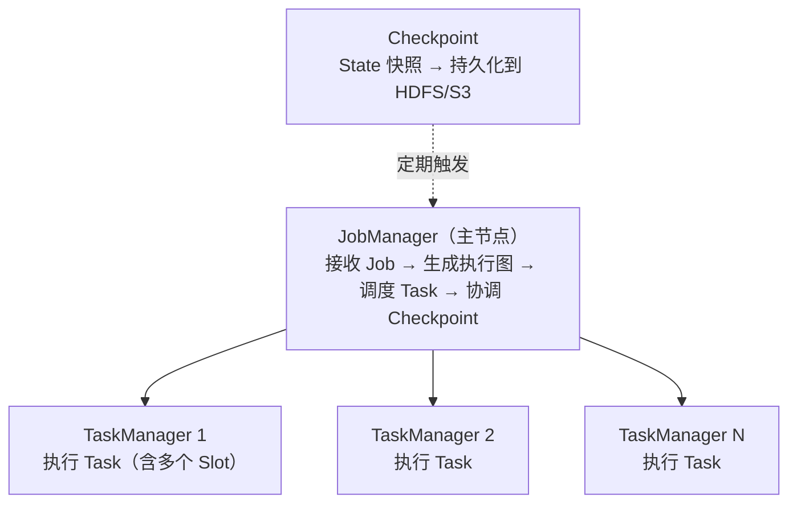
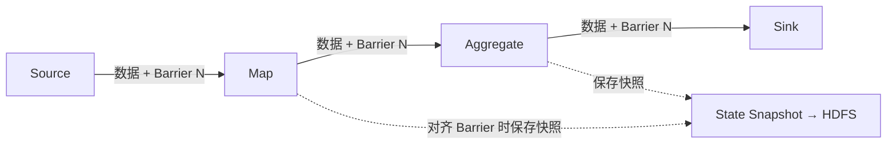
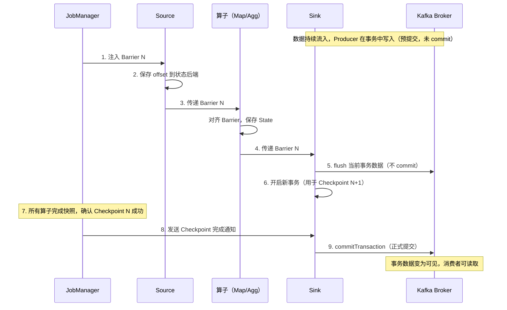
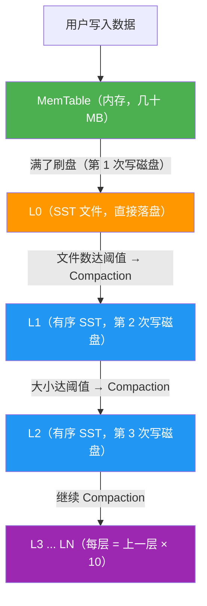

# 6.5 Flink——实时计算引擎

> **一句话定位**：Spark 是"用批处理的思路模拟流"（微批次），Flink 是"原生流处理引擎"——每条数据到达即处理，毫秒级延迟。它是实时大盘、实时风控、实时推荐等场景的首选引擎，也是目前实时计算领域的事实标准。

---

## 一、流处理的核心挑战

实时计算和批处理最大的区别是：**数据没有尽头**。批处理有明确的输入边界（昨天的日志文件），处理完就结束。流处理面对的是源源不断涌入的事件，永远不会"处理完"。

这带来三个独特挑战：

| 挑战 | 含义 | 举例 |
|------|------|------|
| **乱序** | 事件到达顺序 ≠ 事件发生顺序 | 用户 10:00:01 的点击事件在 10:00:05 才到达 Flink |
| **延迟** | 事件可能在很久之后才到达 | 移动端断网恢复后批量上报 |
| **窗口** | 无限流上怎么做聚合？需要把流切成有限的"窗口" | "最近 5 分钟的订单总额" |

Flink 的核心价值就是提供了一套完整的机制来应对这三个挑战。

---

## 二、核心概念

### 2.1 事件时间 vs 处理时间

| 时间语义 | 含义 | 优劣 |
|---------|------|------|
| **Event Time（事件时间）** | 事件实际发生的时间（嵌在数据中） | 结果准确，但需要处理乱序和延迟 |
| **Processing Time（处理时间）** | 事件到达 Flink 的时间 | 最简单、延迟最低，但结果受处理速度影响 |

> **生产经验**：大多数场景用 Event Time。只有对延迟极其敏感且允许结果不精确的场景（如实时监控告警）才用 Processing Time。

### 2.2 Watermark（水位线）——解决乱序

Watermark 是 Flink 用来衡量"事件时间推进到哪了"的机制。它本质是一个时间戳，含义是：**所有时间戳 ≤ Watermark 的事件都已经到达**。

```
数据流：[10:01, 10:03, 10:02, 10:05, 10:04]  ← 乱序到达
Watermark 策略：允许 2 秒乱序

当收到 10:05 的事件时，生成 Watermark = 10:05 - 2s = 10:03
意味着 Flink 认为 10:03 之前的事件都到了，可以触发 10:00-10:03 窗口的计算
```

如果 10:03 之后还来了一个 10:02 的事件——这就是**迟到数据**。Flink 可以配置丢弃、放入侧输出流（Side Output）、或允许窗口更新。

#### Watermark 解决乱序的本质

一个常见误解是"Watermark 屏蔽了过期数据"。实际上 Watermark **不屏蔽任何数据**，它解决乱序的方式是**"等"**——通过让时间推进故意慢于数据到达，给乱序数据留出到达的时间窗口。

没有 Watermark 的世界里，Flink 无法判断"12:00~13:00 的数据是否到齐了"。如果按处理时间判断（收到 13:01 的数据就关窗），那 12:58 的乱序数据就会被丢掉；如果永远等下去，窗口就永远不触发。

Watermark 的做法是设置一个"容忍时间"（比如 5 分钟）：

```
实际到达顺序：12:30 → 12:50 → 12:10 → 13:05 → 12:58 → 13:10
                                                  ↑
                                            乱序到达，但没丢

当 13:05 到达时：Watermark = 13:05 - 5min = 13:00
                 → 12:00~13:00 窗口还不触发（Watermark 刚好 = 窗口结束时间）

当 12:58 到达时：12:58 < 13:00，正常进入 12:00~13:00 窗口
                 Watermark 不变（maxTimestamp 仍是 13:05）

当 13:10 到达时：Watermark = 13:10 - 5min = 13:05 > 13:00
                 → 触发 12:00~13:00 窗口计算，12:58 的数据已经在窗口里了
```

**关键理解**：Watermark 不是"控制窗口的开合按钮"，而是**驱动事件时间推进的全局时钟指针**。窗口的触发条件是"Watermark ≥ 窗口结束时间"，但即使没有窗口，Watermark 也在工作——`KeyedProcessFunction` 的 Event Time Timer、Interval Join 的状态清理、State TTL 的时间计算都依赖 Watermark 推进。

**Watermark 和数据是两套独立的逻辑**：数据来了就正常往下游流（该进窗口进窗口、该更新状态更新状态），Watermark 只负责推进时间。乱序数据到达时，数据照常处理，只是不会让 Watermark 回退（因为 maxTimestamp 只增不减）。

#### Watermark 生成逻辑：maxTimestamp 只增不减

上游生成 Watermark 的逻辑是：维护一个 `maxTimestamp`（已见过的最大时间戳），每次有数据进来，取 `max(maxTimestamp, 当前数据时间戳)` 更新它，然后定期发出 `Watermark(maxTimestamp - allowedLateness)`。

当乱序数据 10:02 在 10:05 之后到达时，数据和 Watermark 走两条独立的逻辑：

```
数据 10:05 到达 → maxTimestamp = max(-∞, 10:05) = 10:05 → 发出 Watermark(10:05 - 2s) = 10:03
数据 10:02 到达 → maxTimestamp = max(10:05, 10:02) = 10:05 → maxTimestamp 不变, 不发新的 Watermark
```

数据 10:02 本身照常往下游流——它是一条普通数据记录，该处理还是处理。但因为它比 maxTimestamp 小，不会更新 maxTimestamp，也就不会产生更小的 Watermark。**数据可以下发，但水位线不会回退。**

这个 10:02 的数据流到下游后，下游算子发现它的时间戳 < 当前 Watermark（10:03），判定为迟到数据，走迟到处理逻辑（丢弃、侧输出、或更新已关闭的窗口）。

#### Watermark 不是数据字段，是流里的特殊记录

Watermark 不是加在每条数据上的新字段，而是数据流里穿插的一种**特殊记录**。可以把它想象成一条管道，里面流着两种类型的元素：

```
[数据] [数据] [数据] [Watermark: 10:03] [数据] [数据] [Watermark: 10:05] [数据] ...
```

它们共享同一条通道，混在一起往下游传。算子处理时会判断元素类型：普通数据走业务逻辑，Watermark 走时间推进逻辑（更新时钟、触发 Timer、关闭窗口等）。

这一点解释了几个关键问题：

Watermark 能跨算子传播——因为它是流里的元素，上游生成后自然跟着数据往下游流，下游收到就能用，不需要每条数据额外携带。

Watermark 不影响数据序列化结构——你的 POJO、Row、JSON 里都没有 Watermark 字段，它是 Flink 运行时层面的东西，对用户数据模型完全透明。

SQL 里 `WATERMARK FOR click_time AS click_time - INTERVAL '5' SECOND` 也不是给表加了列，而是告诉 Flink："请根据 click_time 的值，定期往流里插入 Watermark 记录。"

#### 每个 Task 维护一个事件时间时钟

事件时间时钟不是 per executor 的，而是 **per Task（并行子任务）**。比如并行度为 4，一个算子有 4 个 Task，每个 Task 各自维护独立的事件时间时钟，互不影响。

时钟由收到的 **Watermark 记录**驱动前进（不是直接根据数据时间戳），规则如下：

单输入：收到更大的 Watermark 就推进，取最新值。Watermark 不能倒退。

多输入（如 KeyedCoProcessFunction 有两个输入流）：每个输入流各自维护收到的最新 Watermark，Task 的时钟取**两者中的最小值**。任何一个输入流的 Watermark 没推进，整体时钟就不动。这就是多流"等待"机制的实现方式。

为什么取 min 而不是 max？因为水位线的语义是"这个时间之前的数据都到了"。多个输入流各自有各自的进度，只有当**所有**输入都认为自己推进到了某个时间，才能说"这个时间之前所有流的数据都齐了"。取 max 意味着 A 说到 10:08 了但 B 才到 10:06，10:06 到 10:08 之间 B 的数据可能还没到，提前推进就会漏数据。取 min 就是取"最保守"的时间——被最慢的那个输入拖住，宁可等也不能漏。

```
当前 inputA=10:08, inputB=10:06

取 max → 时钟 = 10:08  ← 激进：B 在 10:06~10:08 的数据可能还没到，会漏
取 min → 时钟 = 10:06  ← 保守：两个流都保证到 10:06，安全
```

Watermark 记录本身不携带"来源流 ID"之类的字段——它只包含一个时间戳。下游 Task 能区分 Watermark 来自哪个输入，靠的是物理通道：每个输入是一条独立的物理通道，Task 内部为每个输入分别维护一个 watermark 值。Watermark 从哪条通道进来，就更新那个输入对应的值。

```
Watermark 记录结构：{ timestamp: 10:06 }，没有别的字段

Task 内部维护：
  input A 的最新 watermark: 10:08   ← 从通道 A 收到的
  input B 的最新 watermark: 10:06   ← 从通道 B 收到的
  当前时钟 = min(10:08, 10:06) = 10:06
```

#### Watermark 实时处理，单调递增不回退

Watermark 的处理是实时的——每收到一条 Watermark，立刻更新该输入通道的值并重新算 min，没有攒批、没有窗口。而且**单个输入通道的 watermark 只增不减**：收到更大的才更新，比当前值小的直接丢弃。因此整体时钟（min）也一定是单调递增的，永远不会回退。

```
时刻1: A 发来 WM=10:03, B 还没发 → inputA=10:03, inputB=-∞, 时钟=min=−∞
时刻2: B 发来 WM=10:04            → inputA=10:03, inputB=10:04, 时钟=min=10:03
时刻3: A 发来 WM=10:05            → inputA=10:05, inputB=10:04, 时钟=min=10:04
时刻4: B 发来 WM=10:06            → inputA=10:05, inputB=10:06, 时钟=min=10:05
时刻5: A 异常发来 WM=10:01        → 10:01 < 10:05, 丢弃, inputA 保持 10:05
```

每个输入只增不减，min 也只增不减，但增长速度被最慢的那个输入拖住。

#### Watermark 不仅驱动窗口

窗口是 Watermark 最常见的消费者，但不是唯一的。Watermark 是整个事件时间体系的"全局时钟指针"，以下机制都订阅这个时钟：

窗口：Watermark 推进到窗口结束时间时，触发计算并关闭窗口。

Event Time Timer：用 `ProcessFunction` 注册的事件时间定时器（如"在事件时间 10:10 时执行某段逻辑"），靠 Watermark 推进来触发，与窗口无关。

Interval Join / 时间维表关联：两个流做时间窗口 join 时，Watermark 决定何时可以认为某时间段数据"齐了"，可以开始 join 并清理过期状态。这里没有传统意义上的窗口，但依然依赖 Watermark。

State 清理：某些算子基于事件时间清理过期状态（如"保留最近 1 小时的状态"），这个"1 小时"按 Watermark 推进来算。

#### Watermark 的代码示例

DataStream API 中手动生成 Watermark：

```java
DataStream<Event> stream = env
    .addSource(new MySource())
    // 为流分配 Watermark 策略：最大乱序 2 秒
    .assignTimestampsAndWatermarks(
        WatermarkStrategy
            .<Event>forBoundedOutOfOrderness(Duration.ofSeconds(2))
            .withTimestampAssigner((event, ts) -> event.getTimestamp())
    );
```

`forBoundedOutOfOrderness` 的内部逻辑就是：记录已见过的最大时间戳 `maxTimestamp`，定期发出 `Watermark(maxTimestamp - 2s)`。这个 Watermark 作为特殊记录混在数据流里往下游传。

多输入场景下（如 Interval Join），每个流各自走自己的 Watermark 策略，各自发送自己的 Watermark，下游算子取最小值推进：

```java
// 两个流各自分配 Watermark 策略
DataStream<Order> orders = env.addSource(...)
    .assignTimestampsAndWatermarks(
        WatermarkStrategy.<Order>forBoundedOutOfOrderness(Duration.ofSeconds(3))
            .withTimestampAssigner((o, ts) -> o.getOrderTime()));

DataStream<Payment> payments = env.addSource(...)
    .assignTimestampsAndWatermarks(
        WatermarkStrategy.<Payment>forBoundedOutOfOrderness(Duration.ofSeconds(5))
            .withTimestampAssigner((p, ts) -> p.getPayTime()));

// Interval Join：下游算子取两个流 Watermark 的最小值作为事件时间时钟
orders
    .keyBy(Order::getOrderId)
    .intervalJoin(payments.keyBy(Payment::getOrderId))
    .between(Time.seconds(-10), Time.seconds(10))
    .process(new OrderPaymentJoinFunc());
```

### 2.3 窗口（Window）

窗口把无限流切成有限的数据集来做聚合。Flink 支持四种窗口：

| 窗口类型 | 含义 | 示例 |
|---------|------|------|
| **滚动窗口（Tumbling）** | 固定大小、不重叠 | 每 5 分钟统计一次 PV |
| **滑动窗口（Sliding）** | 固定大小、可重叠 | 窗口 10 分钟、每 1 分钟滑动一次 |
| **会话窗口（Session）** | 按活跃间隔动态切分 | 用户 30 分钟无操作则关闭会话 |
| **全局窗口（Global）** | 所有数据在一个窗口，需自定义触发器 | 特殊场景 |

#### 滚动窗口（Tumbling Window）

**SQL**：

```sql
-- 统计每 5 分钟每个商品的订单数
SELECT
  product_id,
  TUMBLE_START(order_time, INTERVAL '5' MINUTE) AS window_start,
  TUMBLE_END(order_time, INTERVAL '5' MINUTE) AS window_end,
  COUNT(*) AS order_cnt
FROM orders
GROUP BY
  product_id,
  TUMBLE(order_time, INTERVAL '5' MINUTE);
```

**Java DataStream**：

```java
DataStream<Order> orders = env.addSource(new KafkaSource<>())
    .assignTimestampsAndWatermarks(
        WatermarkStrategy.<Order>forBoundedOutOfOrderness(Duration.ofSeconds(5))
            .withTimestampAssigner((o, ts) -> o.getOrderTime()));

orders
    .keyBy(Order::getProductId)
    .window(TumblingEventTimeWindows.of(Time.minutes(5)))  // 5 分钟滚动窗口
    .aggregate(new OrderCountAggregate())  // 自定义聚合函数
    .addSink(new KafkaSink<>());
```

#### 滑动窗口（Sliding Window）

Flink SQL 中滑动窗口的函数名叫 `HOP` 而不是 `SLIDING`，这是因为 SQL 标准（Apache Calcite）采用了不同的命名视角：`Sliding` 强调窗口在时间轴上"滑动"，`HOP` 强调每隔一个步长"跳出"一个新窗口。两者是完全相同的东西，只是 DataStream API 沿用流计算传统叫 `SlidingWindow`，SQL 层沿用 SQL 标准叫 `HOP`。

**SQL**：

```sql
-- 每 1 分钟统计一次最近 10 分钟的订单数
SELECT
product_id,
HOP_START(order_time, INTERVAL '1' MINUTE, INTERVAL '10' MINUTE) AS window_start,
  HOP_END(order_time, INTERVAL '1' MINUTE, INTERVAL '10' MINUTE) AS window_end,
  COUNT(*) AS order_cnt
FROM orders
GROUP BY
  product_id,
  HOP(order_time, INTERVAL '1' MINUTE, INTERVAL '10' MINUTE);
-- 语法：HOP(timeCol, slideSize, windowSize)
```

**Java DataStream**：

```java
orders
    .keyBy(Order::getProductId)
    .window(SlidingEventTimeWindows.of(
        Time.minutes(10),   // 窗口大小
        Time.minutes(1)   // 滑动步长
    ))
    .aggregate(new OrderCountAggregate())
    .addSink(new KafkaSink<>());
```

#### 会话窗口（Session Window）

会话窗口的隔离靠 key（如 `user_id`），切分和触发靠事件时间 + Watermark。`GROUP BY user_id, SESSION(visit_time, INTERVAL '30' MINUTE)` 的含义是：先按 `user_id` 分组（每个用户独立维护自己的会话），然后在每个用户的数据流内，按 `visit_time` 判断两条相邻数据之间的间隔是否超过 30 分钟来切分会话。



**触发机制**：不是固定时间触发，而是靠 Watermark 推进。当 Watermark 推进到"会话最后一条数据的时间 + gap（30 分钟）"时，Flink 认为这个会话不会再有新数据了，触发计算。

**Session Window vs Tumbling Window（都是 30 分钟）的区别**：

虽然都涉及"30 分钟"，但两者的语义完全不同。用同一份用户访问数据来对比：

```mermaid
gantt
    title 同一份数据 - Tumbling vs Session 对比
    dateFormat HH:mm
    axisFormat %H:%M

    section Tumbling Window - 固定30分钟切一刀
    pv=3 含 10:00 10:05 10:20      :t1, 10:00, 10:30
    pv=1 含 10:45                  :t2, 10:30, 11:00
    空窗口 无输出                   :t3, 11:00, 11:30
    pv=2 含 11:30 11:35            :t4, 11:30, 12:00

    section Session Window - 30分钟无活动才切
    pv=4 用户连续活跃               :s1, 10:00, 11:15
    pv=2 新会话                    :s2, 11:30, 12:05
```



| 对比维度 | Tumbling Window（30 分钟） | Session Window（gap 30 分钟） |
|---------|--------------------------|-------------------------------|
| **窗口边界** | 固定：整点切割（10:00、10:30、11:00...） | 动态：由数据驱动，每个 key 不同 |
| **窗口数量** | 固定：24 小时 = 48 个窗口（不管有没有数据） | 不固定：活跃用户多、不活跃用户少 |
| **30 分钟的含义** | 窗口的固定大小 | 两条数据之间的最大间隔（超过则拆分会话） |
| **连续活跃时** | 用户连续活跃 2 小时会被切成 4 个窗口 | 用户连续活跃 2 小时只算 1 个会话 |
| **适用场景** | 固定时间段的聚合统计（每 30 分钟的 PV） | 用户行为分析（会话时长、会话内页面数） |

**核心区别一句话**：Tumbling 是"按时间切蛋糕"，不管用户行为，到点就切；Session 是"按用户行为切蛋糕"，用户不动了才切。

**SQL**：

```sql
-- 统计用户会话，30 分钟无操作则关闭会话
SELECT
user_id,
SESSION_START(visit_time, INTERVAL '30' MINUTE) AS session_start,
SESSION_END(visit_time, INTERVAL '30' MINUTE) AS session_end,
COUNT(*) AS pv
FROM user_visits
GROUP BY
user_id,
SESSION(visit_time, INTERVAL '30' MINUTE);
```

**Java DataStream**：

```java
orders
.keyBy(Order::getUserId)
.window(EventTimeSessionWindows.withDynamicGap(
(Order o) -> Time.minutes(30)  // 动态间隔，也可固定
))
// 或固定间隔：.window(EventTimeSessionWindows.withGap(Time.minutes(30)))
.aggregate(new SessionAggregate())
.addSink(new KafkaSink<>());
```

#### 累积窗口（Cumulative Window）

**SQL**（Flink 1.13+）：

```sql
-- 每天从 00:00 开始，每 1 小时输出一次累计结果（截至当前小时）
SELECT
  product_id,
  CUMULATE_START(order_time, INTERVAL '1' HOUR, INTERVAL '1' DAY) AS window_start,
  CUMULATE_END(order_time, INTERVAL '1' HOUR, INTERVAL '1' DAY) AS window_end,
  COUNT(*) AS pv
FROM orders
GROUP BY
  product_id,
  CUMULATE(order_time, INTERVAL '1' HOUR, INTERVAL '1' DAY);
-- 语法：CUMULATE(timeCol, step, maxSize)
--   step    = INTERVAL '1' HOUR  → 每隔 1 小时输出一次累计结果
--   maxSize = INTERVAL '1' DAY   → 累计窗口的总跨度（00:00 ~ 24:00）
-- 产生的窗口：[00:00,01:00), [00:00,02:00), [00:00,03:00), ... [00:00,24:00)
```

**Java DataStream**（Flink 1.13+ 无原生 Cumulative Window API，需用 ProcessFunction + Timer 模拟）：

```java
// 用 KeyedProcessFunction 实现累积窗口
orders
    .keyBy(Order::getProductId)
    .process(new KeyedProcessFunction<String, Order, Result>() {
        private ValueState<Long> pvState;
        private ValueState<Long> lastOutputHour;

        @Override
        public void open(Configuration parameters) {
            pvState = getRuntimeContext().getState(
                new ValueStateDescriptor<>("pv", Long.class));
            lastOutputHour = getRuntimeContext().getState(
                new ValueStateDescriptor<>("lastHour", Long.class));
        }

        @Override
        public void processElement(Order order, Context ctx, Collector<Result> out) throws Exception {
            long currentPv = pvState.value() == null ? 0 : pvState.value();
            pvState.update(currentPv + 1);

            // 注册当天每小时结束的 Timer
            long eventTime = order.getOrderTime();
            long hourEnd = (eventTime / 3600000 + 1) * 3600000; // 下一小时的边界
            ctx.timerService().registerEventTimeTimer(hourEnd);
        }

        @Override
        public void onTimer(long timestamp, OnTimerContext ctx, Collector<Result> out) throws Exception {
            long pv = pvState.value() == null ? 0 : pvState.value();
            out.collect(new Result(ctx.getCurrentKey(), timestamp, pv));
        }
    });
```

#### 全局窗口（Global Window）+ 自定义触发器

**SQL**：SQL 层无全局窗口概念，需用 `GROUP BY` 无窗口聚合配合 `EMIT` 策略。

**Java DataStream**：

```java
// 全局窗口 + 自定义触发器：每 100 条数据或 1 分钟触发一次计算
orders
    .keyBy(Order::getProductId)
    .window(GlobalWindows.create())
    .trigger(CountTrigger.of(100))  // 每 100 条触发
    // 或组合触发器：.trigger(CountTrigger.of(100).or(ProcessingTimeTrigger.of(Time.minutes(1))))
    .aggregate(new OrderCountAggregate())
    .addSink(new KafkaSink<>());
```

---

## 三、架构



| 组件 | 职责 | 类比 |
|------|------|------|
| **JobManager** | 接收用户 Job，生成执行图（JobGraph → ExecutionGraph），调度 Task，协调 Checkpoint | 类似 Spark Driver |
| **TaskManager** | 执行具体的算子逻辑，每个 TaskManager 有多个 **Slot**（执行线程） | 类似 Spark Executor |
| **Slot** | TaskManager 中的资源单元（内存隔离），一个 Slot 运行一条算子链 | 类似 Spark 的 Task |

---

## 四、容错机制——Checkpoint + Exactly-Once

### 4.1 Checkpoint（检查点）

#### Chandy-Lamport 分布式快照算法

Flink 的容错核心是 **Chandy-Lamport 分布式快照算法**。这个算法解决的问题是：在一个持续流动的分布式数据流中，如何在不暂停计算的情况下，给整个系统拍一个一致的"全局快照"。

核心思路是引入 **Marker（标记消息）**——在 Chandy-Lamport 原始论文中叫 marker，Flink 里叫 **Barrier（屏障）**。它是一种特殊的控制消息，混在数据流里跟普通数据一起传输，思路跟 Watermark 类似。

算法流程：

1. **发起**：协调器（Flink 中是 JobManager）决定做快照，向所有 Source 注入一条 Barrier N。
2. **Source 快照**：Source 收到 Barrier N 后，记录自己的状态（如 Kafka 的 offset），然后把 Barrier N 往下游发。
3. **中游对齐**：当一个算子有多个输入时，收到第一个输入的 Barrier N 后，**暂停**该输入的数据处理（先缓冲起来），等所有输入都收到 Barrier N——这叫 **Barrier 对齐**。对齐后，算子保存自己的 State，然后把 Barrier N 往下游发。
4. **完成**：所有算子都保存完 State 后，JobManager 确认这次快照成功。



关键点在于 Barrier 把数据流切成了"快照前"和"快照后"两部分。一个算子在 Barrier N 之前处理的数据都属于快照 N 的状态，之后的数据属于下一个快照。因为所有算子都按同一个 Barrier 做切分，所以全局状态是一致的。

#### Watermark 与 Barrier 的区别

两者都是混在数据流里的特殊记录，但触发机制、语义和作用完全不同：

| 维度 | Watermark | Barrier |
|------|-----------|---------|
| **触发方式** | Source 根据数据时间戳**自主生成**，数据驱动 | JobManager 通过 RPC**统一注入**，定时触发（按 checkpoint interval） |
| **语义** | 所有时间戳 ≤ Watermark 的事件都已到达 | 标志快照边界，Barrier 之前的数据属于快照 N，之后属于快照 N+1 |
| **多输入处理** | 取**min**（最小值），推进事件时间时钟 | 取**对齐**（等所有输入都收到），然后保存快照 |
| **方向** | 从 Source 往下游流，驱动时间推进 | 从 Source 往下游流，协调全局快照 |
| **作用** | 驱动窗口触发、Event Time Timer、Interval Join、State 清理 | 驱动 Checkpoint 状态快照 |
| **是否可丢弃** | 比当前值小的会被丢弃（只增不减） | 不能丢弃，必须严格按编号顺序处理 |
| **生成位置** | Source 或任何能提取时间戳的算子 | 仅由 JobManager 注入，从 Source 开始 |

一句话总结：**Watermark 管"时间到了没"，Barrier 管"快照切在哪"**。Watermark 推进事件时间，决定业务逻辑何时触发；Barrier 推进快照进度，决定容错状态何时保存。两者互不干扰，各自在数据流里独立传播。

**Barrier 对齐的代价**：多输入算子需要对齐 Barrier，对齐期间会暂停处理较快输入的数据（缓冲起来），这会引入短暂延迟。Flink 还提供了 **非对齐 Checkpoint（Unaligned Checkpoint）** 选项：不做对齐，直接把缓冲区里的数据也存进快照。这样更快，但快照更大。适合反压严重、对齐时间过长的场景。

#### 非对齐 Checkpoint（Unaligned Checkpoint）的精确原理

传统对齐 Checkpoint 在反压严重时，对齐时间会无限拉长（因为下游处理不过来，上游数据堆积，Barrier 迟迟无法对齐），最终导致 Checkpoint 超时。Flink 1.11+ 引入的 Unaligned Checkpoint 解决了这个问题：

- 当某个输入流的 Barrier 到达时，算子**不需要等待其他输入流**，而是立即将当前所有输入缓冲区中 barrier 之后的数据、输出缓冲区中待发送的数据，连同当前算子状态一起存入快照。
- 恢复时，这些被快照的缓冲数据会重新注入到算子的输入队列中重新计算。关键是：**算子状态本身只包含 barrier 之前的数据处理结果**，barrier 之后的数据只是被"缓存"在快照里，恢复时重新消费，所以不会重复也不会丢失。
- 优点：Checkpoint 不受反压影响，对齐时间几乎为零。
- 缺点：快照需要额外保存缓冲数据，体积更大；恢复时需要重新注入缓冲数据，启动时间稍长。

Flink 1.11+ 可以通过代码 `env.getCheckpointConfig().enableUnalignedCheckpoints()` 启用；如果使用 `flink-conf.yaml`，则对应配置项是 `execution.checkpointing.unaligned.enabled: true`。如果再设置 `execution.checkpointing.aligned-checkpoint-timeout`（例如 `30 s`），当对齐耗时超过阈值时，本次 Checkpoint 会切换为 Unaligned Checkpoint。

#### 生产环境 Checkpoint 配置

> **说明**：下表以 Flink 1.20 常用配置名为准，优先使用 `execution.checkpointing.*` 这一套配置键。

| 配置参数 | 含义 | 生产建议 |
|---------|------|---------|
| `execution.checkpointing.interval` | 两次 Checkpoint 的基础触发间隔 | 通常 1~10 分钟，太小会拖垮系统，太大会增加恢复时数据重放量 |
| `execution.checkpointing.timeout` | 单次 Checkpoint 的超时时间 | 通常设为 interval 的 2~3 倍，超时则失败 |
| `execution.checkpointing.max-concurrent-checkpoints` | 最大并发 Checkpoint 数 | 默认 1；如果单次 Checkpoint 耗时 > interval，可酌情增加，但不宜过大 |
| `execution.checkpointing.min-pause` | 两次 Checkpoint 之间的最小间隔 | 防止 Checkpoint 过于密集，给 Task 留出处理时间 |
| `execution.checkpointing.unaligned.enabled` | 是否启用 Unaligned Checkpoint | 反压严重、对齐经常超时时启用；要求 `EXACTLY_ONCE` 且并发 Checkpoint = 1 |
| `execution.checkpointing.aligned-checkpoint-timeout` | 对齐 Checkpoint 的超时时间 | 常作为对齐 -> Unaligned 的自动降级阈值，例如 `30 s` |
| `execution.checkpointing.dir` | Checkpoint 存储路径（HDFS/S3） | 生产必选，要求所有 JobManager / TaskManager 都可访问 |
| `execution.checkpointing.externalized-checkpoint-retention` | 作业取消后是否保留 Checkpoint | 生产通常设为 `RETAIN_ON_CANCELLATION`，否则取消作业后无法回滚 |
| `execution.checkpointing.incremental` | 是否启用增量 Checkpoint | 在 EmbeddedRocksDBStateBackend + 大状态场景下通常建议显式开启 |

**关于 `externalized-checkpoint` 的坑**：默认情况下，作业取消（cancel）时 Flink 会自动删除对应的 Checkpoint 数据。如果后续想从该 Checkpoint 恢复（如回滚版本），会发现数据已丢失。生产环境必须配置 `execution.checkpointing.externalized-checkpoint-retention: RETAIN_ON_CANCELLATION`，这样 Checkpoint 才会保留。

任务失败时，从最近一次成功的 Checkpoint 恢复 State，数据源（如 Kafka）从对应 offset 重放，实现 **Exactly-Once** 语义。


### 4.2 端到端 Exactly-Once 语义

#### Checkpoint 与两阶段提交（2PC）的关系

首先需要澄清一个常见误区：**Checkpoint 本身只保证 Flink 内部算子状态的 exactly-once**——即算子状态在故障恢复后不丢不重。但 Checkpoint 不负责 Sink 写入外部系统（如 Kafka、MySQL）的一致性。如果 Sink 在 Checkpoint 完成后、数据真正写入外部系统前崩溃，外部系统仍可能丢失或重复数据。

**两阶段提交（2PC）解决的是 Sink 端与外部系统的一致性**。它不是在替代 Checkpoint，而是在 Checkpoint 保证内部一致性的基础上，**额外保证外部系统的一致性**。两者的关系是协作：Checkpoint 负责"算子状态不丢不重"，2PC 负责"外部写入不丢不重"。只有 Sink 需要事务时，才需要 2PC；Source 端只需要支持按 offset 重放（不需要 2PC）。

Exactly-Once 不是 Flink 单方面保证的，而是整个数据管道所有组件一致性的**木桶效应**——整个端到端一致性级别取决于所有组件中最弱的一环。具体可以划分为三个层面：

| 层面 | 要求 | 实现方式 |
|------|------|---------|
| **内部保证** | Flink 自身不丢不重 | Checkpoint 机制 + Barrier 对齐 |
| **Source 端** | 故障后可重放，不丢数据 | 数据源支持按 offset / 位置回溯重读（Kafka Consumer 保存 offset） |
| **Sink 端** | 故障恢复时不重复写入外部系统 | 幂等（Idempotent）写入 或 事务性（Transactional）写入 |

Flink 通过**两阶段提交（2PC）**协议与支持事务的 Sink（如 Kafka 0.11+）配合，实现真正的端到端 Exactly-Once。

#### 4.2.1 幂等写入（Idempotent Writes）

幂等操作是指重复执行多次，只导致一次结果更改。如果 Sink 系统天然支持幂等（如按主键去重的数据库、按 doc id 索引的 Elasticsearch），可以用 **at-least-once + 下游幂等** 替代 2PC，性能更好。典型做法是：为每条数据生成唯一标识（如业务主键），Sink 写入时冲突即覆盖或忽略。

#### 4.2.2 事务写入

事务写入的核心思想是：**构建的事务对应着 Checkpoint，等到 Checkpoint 真正完成时，才把所有对应结果写入 Sink 系统**。DataStream API 提供了 `GenericWriteAheadSink`（预写日志 WAL）和 `TwoPhaseCommitSinkFunction`（两阶段提交）两种事务性写入模板。

##### 预写日志（WAL）

把结果数据先作为 State 缓存，收到 Checkpoint 完成通知后，一次性批量写入 Sink。简单通用，但延迟较大，且外部系统需要支持批量写入。

##### 两阶段提交（2PC）

两阶段提交协议（Two-Phase Commit）是分布式系统中协调多节点事务一致性的经典算法。在 Flink 中，它被用来协调 Sink 与 Checkpoint 的提交节奏：

**第一阶段（预提交）**：当 Checkpoint 启动时，JobManager 向数据流注入 Barrier。Sink 收到 Barrier 后，将当前事务中的数据写入外部系统（如 Kafka），但**不提交**——此时数据处于预提交状态，对外部消费者不可见（Kafka 的 `read_committed` 隔离级别下）。然后 Sink 将当前事务 ID 等状态保存到 Checkpoint。

**第二阶段（正式提交）**：当所有算子的 Checkpoint 都成功完成后，JobManager 向所有 Task 发送确认通知。Sink 收到通知后，调用外部系统的事务提交（如 `producer.commitTransaction()`），数据才真正变为可见和可消费。

如果 Checkpoint 失败或作业崩溃，Flink 从最近一次成功的 Checkpoint 恢复，Sink 会重新执行 `commit()`（因为 Checkpoint 中已记录待提交的事务信息）。这要求**提交操作必须是幂等的**——Kafka 在相同事务 ID 下重复调用 `commitTransaction` 是安全的。

#### 4.2.3 两阶段提交的完整时序

以 Flink + Kafka 为例，端到端 exactly-once 的时序如下：



关键点：预提交阶段的数据已写入 Kafka 的日志，但消费者通过 `read_committed` 隔离级别看不到；只有 `commitTransaction` 后，事务内消息才从 `uncommitted` 变为 `committed`。

#### 4.2.4 2PC 对外部 Sink 系统的要求

并非所有 Sink 都支持 2PC，需要满足以下条件：

- 外部系统必须提供**事务支持**（或 Sink 能模拟事务）。
- 在 Checkpoint 间隔期间内，能**开启事务并接受数据写入**。
- 在收到 Checkpoint 完成通知前，事务必须处于**"等待提交"**状态。若事务超时关闭（如 Kafka 事务超时），未提交数据会丢失。
- Sink 必须能在**进程失败后恢复事务**（通过 Checkpoint 中的事务状态）。
- **提交事务必须是幂等操作**（支持重复提交相同事务）。

#### 4.2.5 Flink + Kafka 端到端 Exactly-Once

Flink + Kafka 是经典的端到端 exactly-once 数据管道（Kafka 进、Kafka 出）。各组件的职责如下：

| 组件 | 保证机制 |
|------|---------|
| **Flink 内部** | Checkpoint 保存算子状态，故障时从 State Backend 恢复 |
| **Kafka Source** | Consumer 将 offset 作为 State 保存，恢复时按 offset 重放，不丢数据 |
| **Kafka Sink** | Producer 启用事务（`transactional.id`），通过 2PC 与 Flink Checkpoint 配合，不重复写入 |
| **Kafka Consumer（下游）** | 必须设置 `isolation.level=read_committed`，否则可能读取到被 abort 的事务数据，破坏端到端一致性 |

**Kafka Producer 的事务代码示例**：

```java
Properties props = new Properties();
props.put("bootstrap.servers", "kafka:9092");
props.put("transactional.id", "my-producer-id"); // 启用事务，必须设置唯一事务 ID
props.put("enable.idempotence", "true");         // 开启幂等性

KafkaProducer<String, String> producer = new KafkaProducer<>(props);
producer.initTransactions();
producer.beginTransaction();
producer.send(new ProducerRecord<>("topic", "key", "value"));
producer.commitTransaction(); // 或 abortTransaction()
```

#### 4.2.6 生产环境配置与常见踩坑

**事务超时与 Checkpoint 间隔的匹配**

Kafka 的 `transaction.timeout.ms` 默认是 60 秒。如果 Flink 的 Checkpoint 间隔（`execution.checkpointing.interval`）设置得太大（比如 5 分钟），在 Checkpoint 完成前 Kafka 事务可能已超时并被 Coordinator 中止，导致数据丢失。

**解决方法**：确保 Kafka 的事务超时 > Flink 的 Checkpoint 间隔 + 最大容忍时间。Flink 的 `KafkaSink` 提供了 `transaction.timeout.ms` 配置，应与 Kafka Broker 端的 `transaction.max.timeout.ms` 相匹配。

```java
// Flink KafkaSink 事务超时配置（应小于 Kafka broker 的 transaction.max.timeout.ms）
KafkaSink<String> sink = KafkaSink.<String>builder()
    .setBootstrapServers("kafka:9092")
    .setRecordSerializer(...)
    .setDeliveryGuarantee(DeliveryGuarantee.EXACTLY_ONCE)
    .setProperty("transaction.timeout.ms", "900000") // 15 分钟，需匹配 broker 配置
    .build();
```

**其他常见踩坑**：

- 下游消费者未设置 `read_committed`：即使 Flink 做到了 exactly-once，下游消费者用 `read_uncommitted` 仍会读到未提交或被 abort 的数据。
- `transactional.id` 冲突：同一个 `transactional.id` 不能同时被两个 Producer 实例使用，否则 Kafka 会报错。Flink 通过 `subtaskIndex` 来生成唯一的事务 ID，确保每个并行子任务互不冲突。
- 事务协调器故障：Kafka 的 Transaction Coordinator 负责管理事务状态，如果 Coordinator 发生故障转移，正在等待提交的 2PC 事务可能会超时，需要合理设置超时参数。

#### 4.2.7 API 演进：FlinkKafkaProducer 与 KafkaSink

Flink 的 Kafka Sink API 经历了演进：

- **Flink 1.4~1.14**：使用 `FlinkKafkaProducer`，需继承 `TwoPhaseCommitSinkFunction` 实现自定义 2PC Sink。这是较老的 API，已在 Flink 1.15 起标记为 deprecated。
- **Flink 1.15+**：推荐使用 `KafkaSink`，内置 `EXACTLY_ONCE` / `AT_LEAST_ONCE` / `NONE` 三种投递保证，通过 `DeliveryGuarantee` 枚举直接配置，无需手动实现 2PC 接口。

```java
// Flink 1.15+ 推荐使用的新 API
KafkaSink<String> sink = KafkaSink.<String>builder()
    .setBootstrapServers("kafka:9092")
    .setRecordSerializer(KafkaRecordSerializationSchema.builder()
        .setTopic("output-topic")
        .setValueSerializationSchema(new SimpleStringSchema())
        .build())
    .setDeliveryGuarantee(DeliveryGuarantee.EXACTLY_ONCE)
    .build();

stream.sinkTo(sink);
```

#### 4.2.8 2PC 与 at-least-once + 幂等的权衡

| 方案 | 优点 | 缺点 | 适用场景 |
|------|------|------|---------|
| **2PC** | 严格 exactly-once，不依赖下游去重 | 有性能开销（事务协调、屏障同步、超时限制），Checkpoint 间隔不能太大 | 金融交易、对账、不允许重复的关键业务 |
| **at-least-once + 幂等** | 性能更好，无事务超时限制，实现简单 | 需要 Sink 系统或业务层支持幂等 | 日志写入、指标上报、下游支持主键去重 |

如果下游系统天然支持幂等（如按主键更新的 MySQL、按 doc id 写入的 Elasticsearch），**at-least-once + 幂等** 通常是更轻量、更可靠的选择。只有在下游无法幂等、且业务对重复零容忍时，才必须使用 2PC。


---

## 五、状态管理

### 5.1 State 分类

一个 Flink Job 通常由 Source → Transformation → Sink 组成，每个算子在一个或多个 Task 中并行运行。State 就是流处理过程中需要"记住"的数据快照，既包括业务数据（如累加计数），也包括元数据（如 Kafka Consumer 的 offset）。

| 类型 | 作用域 | 典型场景 | 缩放行为 |
|------|--------|---------|---------|
| **Keyed State** | 每个 key 一份，仅在 KeyedStream 上可用 | 按 key 聚合的计数、求和、窗口状态 | 按 Key Group 重新分配 |
| **Operator State** | 每个 Sub-Task（并行实例）一份 | Kafka Source 的 offset 列表、Broadcast State | 按 List 重新分配 |

Keyed State 可以理解为"分布式 Map"——从每条记录中提取 key，状态按 key 隔离存储。常见的 Keyed State 类型：ValueState（单值）、ListState（列表）、MapState（映射）、ReducingState（聚合）、AggregatingState（聚合输出不同类型）。

Operator State 常见类型：ListState（如 Kafka Source 每个 Sub-Task 维护自己消费的 partition offset 列表）、BroadcastState（广播状态，所有 Sub-Task 持有完整副本）。

#### Broadcast State 详解

Broadcast State 用来解决"**一条主数据流需要动态参照另一份配置/规则**"的场景。典型例子：实时订单流（每秒几万条）需要根据运营后台动态下发的欺诈检测规则来判断是否可疑。规则是动态变化的，不能写死在代码里。

做法是把规则流通过 `broadcast()` 广播出去，每个处理订单的 Sub-Task 都会收到**完整的一份规则副本**，存在本地的 Broadcast State 里。订单数据来了直接从本地状态读规则做判断，不需要查外部系统。

```java
// 1. 定义 Broadcast State 的描述符
MapStateDescriptor<String, Rule> ruleDescriptor =
    new MapStateDescriptor<>("rules", String.class, Rule.class);

// 2. 规则流广播出去
BroadcastStream<Rule> broadcastRules = ruleStream.broadcast(ruleDescriptor);

// 3. 订单流连接广播流，用 BroadcastProcessFunction 处理
orderStream
    .connect(broadcastRules)
    .process(new BroadcastProcessFunction<Order, Rule, Alert>() {

        @Override
        public void processElement(Order order, ReadOnlyContext ctx, Collector<Alert> out) {
            // 处理订单：从 Broadcast State 读取当前规则（只读）
            ReadOnlyBroadcastState<String, Rule> state =
                ctx.getBroadcastState(ruleDescriptor);
            Rule rule = state.get(order.getCategory());
            if (rule != null && rule.matches(order)) {
                out.collect(new Alert(order, "命中规则: " + rule.getName()));
            }
        }

        @Override
        public void processBroadcastElement(Rule rule, Context ctx, Collector<Alert> out) {
            // 处理规则更新：写入 Broadcast State（所有 Sub-Task 都会执行）
            BroadcastState<String, Rule> state = ctx.getBroadcastState(ruleDescriptor);
            state.put(rule.getCategory(), rule);
        }
    });
```

**为什么不直接查 Redis/MySQL？** 每条订单都查一次外部系统，QPS 太高会把外部系统打挂，而且有网络延迟。Broadcast State 把规则存在本地内存，读取是纯本地操作，零延迟、零外部依赖。

**Checkpoint 行为**：每个 Sub-Task 持有完全相同的规则副本，Checkpoint 时各自保存一份完整副本。恢复时不管并行度怎么变，每个 Sub-Task 直接拿到完整副本，不需要像 Keyed State 那样做 Key Group 重分配。

**典型使用场景**：动态规则引擎（风控/反欺诈）、AB 实验配置下发、黑名单/白名单实时更新、维度表小表广播 Join。

**限制**：Broadcast State 适合数据量小、更新频率低的配置数据。如果广播的数据量很大（如百万级维度表），每个 Sub-Task 都持有完整副本，内存开销会很大，应改用 Async I/O 查外部存储。

### 5.1.1 State TTL（状态过期清理）

Keyed State 可以设置 TTL（Time-To-Live），让状态在一定时间后自动清理，防止状态无限增长撑爆磁盘/内存。这对累积型统计（如"最近 24 小时的用户点击数"）非常关键——如果不清理，State 会永远增长，最终因 Checkpoint 过大或 RocksDB 文件过多而失败。

```java
StateTtlConfig ttlConfig = StateTtlConfig
    .newBuilder(Time.hours(24))          // 状态存活 24 小时
    .setUpdateType(StateTtlConfig.UpdateType.OnCreateAndWrite)  // 每次读写都刷新过期时间
    .setStateVisibility(StateTtlConfig.StateVisibility.NeverReturnExpired)  // 过期后不可见
    .build();

ValueStateDescriptor<String> descriptor = new ValueStateDescriptor<>("userState", String.class);
descriptor.enableTimeToLive(ttlConfig);
ValueState<String> state = getRuntimeContext().getState(descriptor);
```

**清理策略**：

- **惰性清理（Lazy Cleanup）**：读取时判断是否过期，过期则删除。不会主动扫描，但可能留下"僵尸状态"（如果某 key 再也不被访问，就永远不会被清理）。
- **RocksDB Compaction 时清理**：RocksDB 做后台 Compaction 时，会检查并删除过期的状态。需要依赖 RocksDB 的 Compaction 频率，不是实时的。
- **全量快照清理**：在生成 **full snapshot** 时，不再把已过期状态写入快照，从而减小快照体积；它不会立刻清理本地 working state，因此本地堆内存 / RocksDB 中的过期数据可能仍会暂时存在。对 RocksDB 的**增量 Checkpoint**，这个策略不生效。

**实践建议**：生产环境必须根据业务语义设置 TTL，避免 State 无限膨胀。例如，按用户会话统计时，会话超时后相关状态就应清理。TTL 时间应略大于业务最大窗口或超时时间。

### 5.2 为算子设置 UID——Savepoint 恢复的关键

Flink 在恢复 State 时，通过 **UID** 将 Savepoint 中的状态映射到对应的算子。UID 和状态唯一绑定。

默认情况下，Flink 通过遍历 JobGraph 并 hash 算子属性自动生成 UID。这很方便但**非常脆弱**——任何对 JobGraph 的改动（加算子、改顺序、调并行度）都可能导致 UID 变化，进而导致状态无法恢复。

```java
// 强烈建议：给所有有状态的算子手动指定 UID（包括 Source 和 Sink）
env.addSource(new MySource()).uid("my-source")
    .keyBy(anInt -> 0)
    .map(new MyStatefulFunction()).uid("my-map")
    .addSink(new DiscardingSink<>()).uid("my-sink");
```

**实践原则**：有状态的算子必须设 UID，无状态的算子设了也没坏处。如果通过 SQL 层或解析器间接生成 Flink Job，要确保解析器能生成稳定的 UID，否则修改 SQL 后 Savepoint 恢复会大面积丢失状态。

### 5.3 State 存储后端

以 Flink 1.20 常用的 **EmbeddedRocksDBStateBackend** 为例，状态数据的流动分为三层：

```
用户代码 → 本地 RocksDB 文件（实时读写） → HDFS/S3（Checkpoint 异步同步）
```

- 用户代码产生的 State 实时存储在 TaskManager 本地的 RocksDB 文件中，100% 本地性，不需要网络传输。
- Checkpoint 触发时，RocksDB 的增量快照异步同步到远端分布式文件系统（HDFS/S3）。
- 各 Sub-Task 只负责自己所属的那部分状态，不需要互相传输，也不频繁读写 HDFS。
- 作业重启时，从 HDFS 取回 State 数据到本地 RocksDB，恢复现场。

#### RocksDB 增量 Checkpoint 原理

> **LSM-Tree / SST 文件的完整原理**（MemTable → SST → Compaction 分层结构、三种放大效应、读写流程、各系统对比）已独立成节，详见 [A1 附录 · 十一、LSM-Tree 与 SST 文件](../part3-java-deep/A1-核心数据结构原理.md#十一lsm-tree-与-sst-文件写优化存储引擎的通用原理)。本节只讲 Flink 增量 Checkpoint 如何利用 SST 不可变性。

RocksDB 采用 LSM-Tree 结构：新数据先写入内存 MemTable，MemTable 满了之后刷盘生成不可变的 SST 文件（Sorted String Table）。已存在的 SST 文件不会被修改（只能被合并/删除）。

基于这个特性，增量 Checkpoint 的工作方式是：

- **全量 Checkpoint**：将 RocksDB 当前所有的 SST 文件全部上传到 HDFS/S3。
- **增量 Checkpoint**：只上传**自上次 Checkpoint 以来新增或修改的 SST 文件**。因为旧的 SST 文件一旦生成就不会改变，所以不需要重复上传。
- 每次 Checkpoint 只记录一个"文件清单"（manifest），包含哪些 SST 文件属于该次快照。恢复时按照清单从 HDFS 拉取所有涉及的 SST 文件重建本地状态。

**优点与代价**：增量 Checkpoint 大幅减少了上传的数据量，缩短了 Checkpoint 时间。但代价是状态历史链（SST 文件链）会越来越长，恢复时需要回溯并下载多个增量文件，全量恢复时间可能更长。因此生产环境需要定期做全量 Checkpoint（Flink 会自动做全量对齐，也可以通过配置触发）。

#### LSM-Tree 的三种放大效应

> **详细原理**（分层结构、Compaction 局部合并机制、读取为什么从新到旧查、Block Cache 与 MemTable 分工）详见 [A1 附录 · 十一、LSM-Tree 与 SST 文件](../part3-java-deep/A1-核心数据结构原理.md#十一lsm-tree-与-sst-文件写优化存储引擎的通用原理)。本节聚焦三种放大效应对 Flink 大 State 的影响。

RocksDB 底层的 LSM-Tree（Log-Structured Merge-Tree）虽然写入性能极高（顺序写），但存在三种放大效应，直接影响 Flink 大 State 场景的稳定性：

**写放大（Write Amplification）**

用户写入 1 条数据，实际磁盘写入量可能是 10~30 倍。原因是 LSM-Tree 的分层 Compaction 机制：



每层 Compaction 时，RocksDB 需要**读取当前层和下一层的 SST 文件，合并排序后写回下一层**。一条数据从 L0 一路被"搬运"到 LN，每经过一层就被读写一次。假设有 6 层，写放大就是 6 倍；如果层间大小比为 10，Level Compaction 的理论写放大约为 `10 × (层数 - 1)`。

**写放大对 Flink 的影响**：如果 Flink 算子每秒更新 10 万条 State，实际磁盘写入量可能是每秒 100 万~300 万条的 I/O 量。HDD 的随机写 IOPS 只有几百，根本扛不住；即使 SSD 也需要关注磁盘写入寿命（TBW）。

**读放大（Read Amplification）**

读取一条数据时，最坏情况下需要从 L0 到 LN 逐层查找。每层可能需要读取一个 SST 文件的 Index Block + Data Block。L0 的文件之间没有排序，需要全部扫描。读放大 = 需要读取的 SST 文件数。

RocksDB 通过 **[Bloom Filter](../part3-java-deep/A1-核心数据结构原理.md#三布隆过滤器bloom-filter用-1-的误判换-99-的内存节省)** 缓解读放大：每个 SST 文件附带一个 Bloom Filter，可以快速判断"这个 key 肯定不在这个文件里"，跳过不必要的磁盘读取。Flink 默认启用了 Bloom Filter（`state.backend.rocksdb.bloom-filter.per-key-bits`）。

**空间放大（Space Amplification）**

同一个 key 可能在多层中都有记录（旧值在低层，新值在高层），直到 Compaction 合并后才会清除旧值。空间放大 = 磁盘实际占用 / 有效数据量。

**两种 Compaction 策略对比**：

| 策略 | 写放大 | 读放大 | 空间放大 | 适用场景 |
|------|--------|--------|---------|---------|
| **Size-Tiered**（默认） | 低（每层内合并，层间不交叉） | 高（L0 文件多，无序） | 高（同 key 多副本） | 写多读少 |
| **Level Compaction** | 高（层间合并，写入量大） | 低（每层有序，Bloom Filter 有效） | 低（及时清理旧值） | 读写均衡、大 State |

**Flink 生产优化建议**：

```yaml
# flink-conf.yaml 中的 RocksDB 调优
state.backend.rocksdb.predefined-options: FLASH_SSD_OPTIMIZED  # SSD 优化预设，使用 Level Compaction
state.backend.rocksdb.memory.managed: true                     # 使用 Flink 托管内存，避免 OOM
state.backend.rocksdb.writebuffer.size: 64mb                   # 单个 MemTable 大小（默认 64MB）
state.backend.rocksdb.writebuffer.count: 3                     # MemTable 数量（默认 2）
state.backend.rocksdb.block.cache-size: 256mb                  # Block Cache 大小（读缓存）
state.backend.rocksdb.thread.num: 4                            # 后台 flush/compaction 线程数（默认 1，机械硬盘建议 4）
state.backend.rocksdb.writebuffer.number-to-merge: 3           # flush 前合并的 writebuffer 数（默认 1）
state.backend.local-recovery: true                             # 本地恢复，失败时优先从本地状态恢复，减少 HDFS 拉取
```

**多磁盘目录配置**：当一个 TaskManager 有多个 slot 时，所有并行度共用同一块磁盘会造成 I/O 争抢，吞吐量大幅下降。通过 `state.backend.rocksdb.localdir` 配置多块**不同物理磁盘**的目录，Flink 会随机分配给各并行度，分散 I/O 压力：

```yaml
# 必须配置到不同物理磁盘，不要配置同一磁盘的多个目录
state.backend.rocksdb.localdir: /data1/flink/rocksdb,/data2/flink/rocksdb,/data3/flink/rocksdb
```

实测数据表明，三个并行度分别使用三块磁盘时，每块磁盘 I/O 平均使用率约 45%；而两个并行度共用一块磁盘时，该磁盘 I/O 使用率飙升到 91.6%，直接导致吞吐量腰斩。如果服务器有 SSD，强烈建议将 RocksDB 目录配置到 SSD 上——从 HDD 改为 SSD 对性能的提升可能比调 10 个参数更有效。

**生产优化总结**：

- 使用 SSD 是第一优先级，可以把写放大的 I/O 代价降低一个数量级。
- 大 State 场景下切换为 Level Compaction（`FLASH_SSD_OPTIMIZED` 预设），用更高的写放大换取更低的读放大和空间放大。
- 增大 MemTable 大小和数量，减少刷盘频率，让 Compaction 更高效（但会占用更多托管内存）。
- 多磁盘目录 + SSD 是解决 I/O 瓶颈的物理手段，优先于参数调优。
- 开启 `local-recovery` 可以加速故障恢复（优先从本地磁盘恢复，不需从 HDFS 拉取全量状态）。

#### 增量 vs 全量 Checkpoint 的选择

增量和全量 Checkpoint 都可以选择，但**只有 `EmbeddedRocksDBStateBackend` 支持增量快照**；`HashMapStateBackend` 不支持（它没有 RocksDB SST 文件这类可复用的不可变文件）。

**配置方式**：

```java
// 方式一：代码中直接配置（推荐）
// 构造参数 true = 启用增量 Checkpoint
env.setStateBackend(new EmbeddedRocksDBStateBackend(true));

// 方式二：flink-conf.yaml 全局配置（Flink 1.20）
// state.backend.type: rocksdb
// execution.checkpointing.incremental: true    # 启用增量（默认 false）
```

**如何选择**：

| 模式 | 快照速度 | 快照大小 | 恢复速度 | 适用场景 |
|------|---------|---------|---------|---------|
| **全量** | 慢（每次上传全部 SST 文件） | 大（完整状态） | 快（只下载一份完整快照） | 状态小（< 1GB）、恢复速度优先 |
| **增量** | 快（只上传新增 SST 文件） | 小（仅增量部分） | 可能较慢（需回溯增量链） | 状态大（GB~TB 级）、生产首选 |

**生产建议**：状态超过几百 MB 时，通常就应该显式开启增量 Checkpoint。Flink 会自动管理增量链，并在需要时形成新的全量基线，不需要手动维护。如果对恢复时间非常敏感（如金融场景），可以在低峰期手动触发一次 Savepoint（全量快照），避免恢复时回溯过长的增量链。

| State Backend | 存储位置 | 适用场景 | 特点 |
|---------------|---------|---------|------|
| **HashMapStateBackend** | JVM 堆内对象 | 状态能稳定放进内存、追求吞吐 | 访问快，但不支持增量 Checkpoint，受堆大小限制 |
| **EmbeddedRocksDBStateBackend** | 本地 RocksDB 文件 + HDFS/S3 | 大状态、长窗口、需要增量 Checkpoint | 支持增量 Checkpoint，吞吐略低于堆态，但可扩展到磁盘容量 |

> 说明：`MemoryStateBackend` / `FsStateBackend` / `RocksDBStateBackend` 是旧版本资料里常见的名称；Flink 1.15+ 官方文档主要使用 `HashMapStateBackend` 与 `EmbeddedRocksDBStateBackend`。

### 5.4 State 重分布——改变并行度时的状态分配

Flink 不支持运行时动态改变并行度，必须先停止作业，修改并行度后从 Savepoint 恢复。改变并行度后，State 怎么分配给新的 Sub-Task？

**Operator State 的重分布**：

- **ListState**：将所有 Sub-Task 的 List 取出合并，然后按元素个数均匀分配给新的 Sub-Task。
- **UnionListState**：将所有 List 拼接起来，不做划分，直接完整分发给每个新的 Sub-Task（由用户自行处理）。
- **BroadcastState**：直接复制到所有新的 Sub-Task（每个 Sub-Task 持有完整副本）。

**Keyed State 的重分布——Key Group 机制**：

如果没有状态，改变并行度只需要重新分配数据流即可。但 Keyed State 的状态数据存在 HDFS 里，并行度变化后需要决定哪些状态分给哪个 Sub-Task。

最朴素的想法是按 `hash(key) % newParallelism` 重新分配。但问题在于：Checkpoint 时状态是顺序写入文件的，恢复时需要随机读（HDFS 不带按 key 的索引），效率极低；而且重新分配后各 Sub-Task 处理的 key 可能和之前完全不同，本地性很差。

为解决这个问题，Flink 引入了 **Key Group（键组）**：

- Key Group 是 Keyed State 分配的**原子单位**，不能再细分。
- Key Group 的数量 = **最大并行度（maxParallelism）**，索引范围为 `[0, maxParallelism - 1]`。
- 每个 Sub-Task 处理一个或多个 Key Group。

**key 如何分配到 Key Group？** 对 key 做两重哈希（一次取 hashCode，一次做 MurmurHash）后对最大并行度取余：

```
keyGroupIndex = MathUtils.murmurHash(key.hashCode()) % maxParallelism
```

**Key Group 如何分配到 Sub-Task？** 由并行度、最大并行度和 Sub-Task 索引共同决定：

```
// 简化逻辑
int keyGroupsPerTask = maxParallelism / parallelism  // 均匀分配
startGroup = subTaskIndex * keyGroupsPerTask
endGroup = startGroup + keyGroupsPerTask - 1
```

例如，最大并行度 = 10，当前并行度从 3 改为 4：

```
并行度 = 3 时：
  Sub-Task 0 → Key Group [0, 1, 2, 3]    (4 个)
  Sub-Task 1 → Key Group [4, 5, 6]        (3 个)
  Sub-Task 2 → Key Group [7, 8, 9]        (3 个)

并行度 = 4 时（从 Savepoint 恢复）：
  Sub-Task 0 → Key Group [0, 1]           (2 个)
  Sub-Task 1 → Key Group [2, 3, 4]        (3 个)
  Sub-Task 2 → Key Group [5, 6, 7]        (3 个)
  Sub-Task 3 → Key Group [8, 9]           (2 个)
```

每个 Sub-Task 只需要从 Checkpoint 中读取自己负责的 Key Group 的数据，不需要读取整个文件，解决了随机读和本地性问题。

### 5.5 最大并行度（Max Parallelism）

Key Group 的数量 = 最大并行度，这意味着**当前并行度不能超过最大并行度**，否则有 Sub-Task 分不到 Key Group 变成空转，Flink 会直接报错：

```
Caused by: org.apache.flink.runtime.JobException: 
  Vertex Map's parallelism (4) is higher than the max parallelism (2).
  Please lower the parallelism or increase the max parallelism.
```

**最大并行度一旦设置就不可轻易修改**——因为 Key Group 数量变了，Checkpoint 中的状态快照无法映射到新的 Key Group，所有状态快照会失效。

**默认值规则**（未手动设置时）：

- 当并行度 < 128 时，最大并行度默认 = 128
- 当并行度 ≥ 128 时，最大并行度 = `parallelism + parallelism / 2`，上限为 32768（2^15）

**设置方式**：

```java
final StreamExecutionEnvironment env = StreamExecutionEnvironment.getExecutionEnvironment();
env.getConfig().setMaxParallelism(4);
```

**实践建议**：最大并行度应根据未来数据增量预估设置——当前并行度 ≤ 最大并行度，留出扩容空间。但不要设得过大，因为 Key Group 数量越多，状态元数据越大，Checkpoint 快照也随之增大，会降低性能。在满足业务需求的前提下设置尽可能小的最大并行度。

### 5.6 Savepoint 恢复规则

从 Savepoint 恢复时，Flink 按 UID 匹配算子状态。以下是各种代码变更的恢复情况：

| 变更类型 | 能否恢复 | 说明 |
|---------|---------|------|
| 算子顺序改变，UID 不变 | 可以 | 按 UID 匹配，与位置无关 |
| 新增无状态算子 | 可以 | 无状态不涉及恢复 |
| 新增有状态算子 | 可以（新算子无初始状态） | 不影响已有算子恢复 |
| 删除有状态算子 | 默认报错 | 需加 `-allowNonRestoredState`（`-n`）跳过 |
| UID 变了 | 恢复失败 | 找不到对应状态，最常见的事故 |
| 调整并行度 | 可以（≤ maxParallelism） | 按 Key Group 重新分配 |
| 修改最大并行度 | 状态失效 | Key Group 数量变化，无法映射 |

#### Savepoint 格式与兼容性

Flink 1.11+ 开始，Checkpoint 和 Savepoint 的格式已经统一（都基于 `canonical` 格式），两者可以互换使用。但它们的**默认保存路径**不同：Checkpoint 通常配置 `execution.checkpointing.dir`，Savepoint 通常配置 `execution.checkpointing.savepoint-dir`。

从 Savepoint 恢复时，如果算子拓扑发生变化（如删除有状态算子），需要加 `--allowNonRestoredState`（或 `-n`）跳过缺失的状态，否则恢复会报错。新增有状态算子不影响恢复（新算子从空状态启动）。

```bash
# 从 Savepoint 恢复，允许跳过缺失的状态
flink run -s hdfs://path/to/savepoint -n -c com.example.MyJob my-job.jar
```

### 5.7 大 State 处理策略（体系化排查思路）

> **本节内容已独立拆分为专题文档，详见 [05-Flink-大State专题.md](./05-Flink-大State专题.md)。RocksDB / Checkpoint / 并行度等完整配置参数另见 [05-Flink-配置参数速查.md](./05-Flink-配置参数速查.md)。**

生产环境中 State 膨胀到几十 GB 甚至几百 GB 时，会导致运行时反压、Checkpoint 超时、启停扩缩容慢三类问题。专题文档按 6 步体系化排查思路逐层递进：

- **第 0 步**：从业务层面消除 5 种常见 State 误用（维度数据存 State、存原始明细、高 QPS 频繁访问、精确去重替代近似、冗余信息）
- **第 1 步**：优化 State 体积（POJO Serializer 避免 Kryo fallback、MapState 替代 ValueState<集合>、Protobuf/Avro）
- **第 2 步**：缩短 State 生命周期（TTL + Timer 主动清理）
- **第 3 步**：检查并解决数据倾斜
- **第 4 步**：切换 RocksDB + 参数调优（含 State Backend vs Checkpoint Storage 区分、RocksDB 数据流转机制详解）
- **第 5 步**：增加并行度分散 State
- **持续监控**：Checkpoint 瓶颈分析、调优参数、监控指标

同时包含非聚合 State 使用场景（去重、CEP、Interval Join、Timer）的完整代码示例。

---

## 六、Flink SQL


Flink 也支持 SQL 接口，语法和 Hive SQL / 标准 SQL 类似，但增加了流处理专用语法：

```sql
-- 创建 Kafka 数据源表
CREATE TABLE user_clicks (
    user_id BIGINT,
    url STRING,
    click_time TIMESTAMP(3),
    WATERMARK FOR click_time AS click_time - INTERVAL '5' SECOND  -- Watermark
) WITH (
    'connector' = 'kafka',
    'topic' = 'clicks',
    'properties.bootstrap.servers' = 'kafka:9092',
    'format' = 'json'
);

-- 每 10 分钟统计每个用户的点击次数（滚动窗口）
SELECT 
    user_id,
    TUMBLE_START(click_time, INTERVAL '10' MINUTE) as window_start,
    COUNT(*) as click_count
FROM user_clicks
GROUP BY user_id, TUMBLE(click_time, INTERVAL '10' MINUTE);
```

### 6.1 Flink SQL 调优

Flink SQL 的性能优化主要围绕 **Group Aggregate** 和 **TopN** 两个最容易出现性能瓶颈的场景展开。核心思路是：减少对 State 的访问频率、降低数据倾斜的影响、减少向下游发送的数据量。

#### 6.1.1 MiniBatch 微批处理（提升吞吐）

默认情况下，Flink SQL 的 Group Aggregate 算子对每条输入数据都会访问一次 State、计算一次、输出一次结果。当 QPS 很高时，State 访问成为瓶颈。MiniBatch 的思路是在每个 Task 上缓存一小批数据，到达阈值后一次性处理并输出，将多次 State 访问合并为一次，大幅提升吞吐量。

```java
TableEnvironment tEnv = ...;
Configuration config = tEnv.getConfig().getConfiguration();

// 开启 MiniBatch
config.setString("table.exec.mini-batch.enabled", "true");
// 批量输出的间隔时间（缓存多久后触发一次处理）
config.setString("table.exec.mini-batch.allow-latency", "5 s");
// 每个批次最多缓存的数据条数（防止 OOM）
config.setString("table.exec.mini-batch.size", "20000");
```

MiniBatch 通过增加延迟换取高吞吐，适用于聚合场景。如果业务对延迟敏感（要求毫秒级输出），不建议开启。注意：Flink 1.12 之前的版本存在 Bug——开启 MiniBatch 后不会清理过期状态（即使设置了 State TTL），1.12 版本修复了这个问题（FLINK-17096）。

#### 6.1.2 LocalGlobal 两阶段聚合（解决数据热点）

LocalGlobal 优化将原来的一层 Aggregate 拆成 Local + Global 两阶段：第一阶段在上游节点本地攒一批数据做局部聚合（LocalAgg），输出增量值（Accumulator）；第二阶段将收到的 Accumulator 合并（Merge），得到最终结果（GlobalAgg）。本质上靠 LocalAgg 的预聚合过滤掉部分倾斜数据，降低 GlobalAgg 的热点。

```java
// LocalGlobal 依赖 MiniBatch，必须先开启 MiniBatch
config.setString("table.exec.mini-batch.enabled", "true");
config.setString("table.exec.mini-batch.allow-latency", "5 s");
config.setString("table.exec.mini-batch.size", "20000");

// 开启 LocalGlobal 两阶段聚合
config.setString("table.optimizer.agg-phase-strategy", "TWO_PHASE");
```

判断是否生效：观察最终生成的拓扑图（Plan）中，节点名字是否包含 `GlobalGroupAggregate` 和 `LocalGroupAggregate`。如果仍然是单层 `GroupAggregate`，说明优化器判断两阶段聚合收益不大，没有应用。

LocalGlobal 适用于 SUM、COUNT、MAX、MIN、AVG 等普通聚合函数。注意：如果使用了自定义聚合函数（UDAF），该 UDAF 必须实现 `Merge` 方法才能启用 LocalGlobal。

#### 6.1.3 Split Distinct（解决 COUNT DISTINCT 热点）

LocalGlobal 对普通聚合效果好，但对 `COUNT DISTINCT` 收效不明显——因为 Local 聚合阶段对 Distinct Key 的去重率不高，热点数据仍然集中到 Global 节点。Flink 1.9+ 提供了 COUNT DISTINCT 自动打散功能（Split Distinct），将原来的一层聚合自动拆成两层：第一层按 Distinct Key 取模打散做 COUNT DISTINCT，第二层对打散后的结果做 SUM 汇总。

```java
// 开启 Split Distinct（不依赖 MiniBatch，但可以配合使用）
config.setString("table.optimizer.distinct-agg.split.enabled", "true");
// 第一层打散的 bucket 数目（默认 1024）
config.setString("table.optimizer.distinct-agg.split.bucket-num", "1024");
```

**原理等价于手动改写的两阶段聚合**。以统计每天 UV 为例：

```sql
-- 原始写法（可能存在热点）
SELECT day, COUNT(DISTINCT user_id) FROM T GROUP BY day;

-- 手动两阶段改写（Split Distinct 自动帮你做这件事）
SELECT day, SUM(cnt) FROM (
    SELECT day, COUNT(DISTINCT user_id) AS cnt
    FROM T
    GROUP BY day, MOD(HASH_CODE(user_id), 1024)  -- 第一层：按 user_id 哈希取模打散
) GROUP BY day;                                   -- 第二层：SUM 汇总
```

判断是否生效：观察拓扑图中是否出现 `Expand` 节点，或者原来一层的聚合变成了两层。

#### 6.1.4 AGG WITH FILTER（多维 COUNT DISTINCT 共享状态）

当需要在同一个 GROUP BY 中对同一个字段做多个条件的 COUNT DISTINCT 时（如同时统计总 UV、App UV、Web UV），如果使用 `CASE WHEN` 语法，Flink 会为每个 COUNT DISTINCT 维护独立的状态实例，状态量翻倍。改用 SQL 标准的 `FILTER` 语法后，Flink 优化器能识别出它们作用在同一个字段上，共享一个状态实例：

```sql
-- 不推荐：CASE WHEN 语法，三个独立状态实例
SELECT day,
  COUNT(DISTINCT user_id) AS total_uv,
  COUNT(DISTINCT CASE WHEN flag IN ('android', 'iphone') THEN user_id ELSE NULL END) AS app_uv,
  COUNT(DISTINCT CASE WHEN flag IN ('wap', 'other') THEN user_id ELSE NULL END) AS web_uv
FROM T GROUP BY day;

-- 推荐：FILTER 语法，一个共享状态实例
SELECT day,
  COUNT(DISTINCT user_id) AS total_uv,
  COUNT(DISTINCT user_id) FILTER (WHERE flag IN ('android', 'iphone')) AS app_uv,
  COUNT(DISTINCT user_id) FILTER (WHERE flag IN ('wap', 'other')) AS web_uv
FROM T GROUP BY day;
```

#### 6.1.5 TopN 优化

Flink SQL 的 TopN 有三种内部算法，性能差异很大：

| 算法 | 触发条件 | 性能 | 说明 |
|------|---------|------|------|
| **UpdateFastRank** | 输入流有 PK，且排序字段单调递增/递减（如 `ORDER BY COUNT DESC`） | 最优 | 只需更新变化的行，增量输出 |
| **AppendFast** | 输入流是追加流（非更新流），如直接从 Source 取 TopN | 较优 | 结果只追加不更新 |
| **RetractRank** | 不满足上述条件时的兜底算法 | 最差 | 每次更新可能导致大量回撤和重发，生产中应尽量避免 |

算法名称会显示在拓扑图的节点名上，如果发现是 `RetractRank`，应检查输入流是否有 PK 信息，尝试调整为 `UpdateFastRank`。

**无排名优化（解决数据膨胀）**：TopN 输出中默认包含 `rownum` 字段作为结果表主键的一部分。当排名发生变化时（如原排名第 9 的数据升到第 1），排名 1~9 的所有行都需要更新，产生大量写入。如果业务不需要展示排名数字（只需要 Top N 的数据），在外层查询中去掉 `rownum` 字段即可大幅减少输出量：

```sql
-- 不输出 rownum，减少数据膨胀
SELECT col1, col2, col3
FROM (
  SELECT col1, col2, col3,
    ROW_NUMBER() OVER (PARTITION BY col1 ORDER BY col2 DESC) AS rownum
  FROM table_name
) WHERE rownum <= 10;
```

**增加 TopN Cache**：TopN 内部有 State Cache 层，命中率公式为 `cache_hit = cache_size × parallelism / top_n / partition_key_num`。当 PartitionBy 的 key 维度很大时（如 10 万级），默认 10000 条缓存的命中率极低，大量请求会击穿到 State（磁盘），性能急剧下降。可以通过增大 Cache 提高命中率：

```java
// 默认 10000 条，调大 TopN Cache
config.setString("table.exec.topn.cache-size", "200000");
```

**PartitionBy 必须包含时间字段**：如果做每天的排名，`PARTITION BY` 中必须包含日期字段（如 `day`），否则 State TTL 过期后数据会错乱——因为昨天和今天的数据混在同一个分区里，过期清理会导致排名不准确。

#### 6.1.6 SQL 调优参数总结

```java
TableEnvironment tEnv = ...;
Configuration config = tEnv.getConfig().getConfiguration();

// --- Group Aggregate 优化 ---
config.setString("table.exec.mini-batch.enabled", "true");         // 开启微批
config.setString("table.exec.mini-batch.allow-latency", "5 s");    // 微批间隔
config.setString("table.exec.mini-batch.size", "20000");           // 微批大小
config.setString("table.optimizer.agg-phase-strategy", "TWO_PHASE"); // 两阶段聚合

// --- COUNT DISTINCT 优化 ---
config.setString("table.optimizer.distinct-agg.split.enabled", "true"); // 自动打散
config.setString("table.optimizer.distinct-agg.split.bucket-num", "1024"); // 打散桶数

// --- TopN 优化 ---
config.setString("table.exec.topn.cache-size", "200000");          // TopN 缓存大小

// --- 时区 ---
config.setString("table.local-time-zone", "Asia/Shanghai");        // 避免时区错乱
```

### 6.2 KafkaSource 调优

#### 6.2.1 动态发现分区

Flink 任务运行中，如果 Kafka Topic 新增了分区，默认情况下 FlinkKafkaConsumer 不会自动发现。通过设置 `flink.partition-discovery.interval-millis` 参数开启定期检测：

```java
Properties props = new Properties();
props.setProperty("bootstrap.servers", "kafka:9092");
props.setProperty("group.id", "my-group");
// 每 30 秒检测一次新分区（默认不开启）
props.setProperty(FlinkKafkaConsumerBase.KEY_PARTITION_DISCOVERY_INTERVAL_MILLIS, "30000");

FlinkKafkaConsumer<String> consumer = new FlinkKafkaConsumer<>("my-topic", new SimpleStringSchema(), props);
```

新发现的分区会自动分配给对应的 subtask，从 earliest 位置开始消费。

#### 6.2.2 per-partition Watermark 生成

Kafka 单分区内有序，多分区间无序。Flink 提供了 Kafka 分区级别的 Watermark 生成机制——在消费端内部针对**每个 Kafka 分区**独立生成 Watermark，然后按照"取所有分区 Watermark 的最小值"进行合并。如果单分区内是严格有序的，使用时间戳单调递增策略就能生成完美的全局 Watermark：

```java
FlinkKafkaConsumer<String> consumer = new FlinkKafkaConsumer<>("topic", new SimpleStringSchema(), props);

// 在 Kafka Consumer 上直接设置 Watermark 策略（per-partition 生成）
consumer.assignTimestampsAndWatermarks(
    WatermarkStrategy
        .forBoundedOutOfOrderness(Duration.ofMinutes(2))  // 允许 2 分钟乱序
);

env.addSource(consumer);
```

#### 6.2.3 空闲分区处理（withIdleness）

如果 Kafka Topic 的某些分区长时间没有新数据，该分区的 Watermark 不会推进。由于下游算子取所有上游分区 Watermark 的最小值，一个空闲分区就会"拖住"全局 Watermark，导致所有窗口、Timer 都无法触发。这是生产中非常常见的坑。

解决方案是使用 `withIdleness` 标记空闲源：

```java
consumer.assignTimestampsAndWatermarks(
    WatermarkStrategy
        .<String>forBoundedOutOfOrderness(Duration.ofMinutes(2))
        .withIdleness(Duration.ofMinutes(5))  // 5 分钟无数据则标记为空闲，不再参与 Watermark 计算
);
```

被标记为空闲的分区不再参与下游 Watermark 的最小值计算，直到该分区重新有数据到来时恢复活跃。

#### 6.2.4 Kafka offset 消费策略

FlinkKafkaConsumer 提供 5 种 offset 消费策略，注意它们**只在首次启动时生效**——一旦开启了 Checkpoint，后续重启会从 Checkpoint 中保存的 offset 恢复，这些策略会被忽略：

| 方法 | 行为 | 适用场景 |
|------|------|---------|
| `setStartFromGroupOffsets()` | 默认策略，读取上次提交的 offset；首次启动时按 `auto.offset.reset` 配置决定 | 生产首选 |
| `setStartFromEarliest()` | 从最早的数据开始消费 | 数据回溯、测试 |
| `setStartFromLatest()` | 从最新的数据开始消费 | 只关心增量数据 |
| `setStartFromSpecificOffsets(Map)` | 从指定的 partition-offset 位置消费 | 精确回放 |
| `setStartFromTimestamp(long)` | 从指定时间点之后的数据开始消费 | 按时间回溯 |

#### 6.2.5 并行度设置实践

生产环境中，Flink 各端的并行度设置有不同的考量：

| 位置 | 并行度建议 | 原因 |
|------|----------|------|
| **Source** | = Kafka Topic 的分区数 | 一个并行度消费一至多个分区；并行度多于分区数会有空闲实例浪费资源 |
| **keyBy 之前的算子**（map/filter/flatMap） | 与 Source 保持一致 | 这些算子通常计算轻量，无需额外并行度 |
| **keyBy 之后的算子** | 大并发设为 2 的整数次幂（128/256/512） | 2 的整数次幂在 hash 取模时分布更均匀 |
| **Sink** | 根据下游抗压能力评估 | Sink 到 Kafka 可设为 Topic 分区数；Sink 到数据库需评估数据库写入能力，避免把下游写挂 |

**最优并行度计算公式**：先通过压测确定单并行度的处理上限（QPS），然后 `并行度 = 高峰 QPS / 单并行度处理能力 × 1.2`（留 20% 余量）。压测方法：先在 Kafka 中积压数据（水库蓄水），然后启动 Flink 任务全速消费（泄洪），出现反压时的吞吐量即为单并行度的处理极限。

---

## 七、面试深度剖析

> **本章内容已独立拆分为专题文档，详见 [05-Flink-面试深度剖析.md](./05-Flink-面试深度剖析.md)**

包含 20 个高频面试考点的深度解析，覆盖以下主题：

- **基础概念**（考点 1~8）：Flink vs Spark Streaming、Checkpoint vs Savepoint、Watermark 机制、反压原理、Key Group、Savepoint 恢复的坑、Watermark 与 Barrier 的区别、两阶段提交与端到端 Exactly-Once
- **深度原理**（考点 9~11）：Checkpoint 大小与恢复速度的关系、Unaligned Checkpoint 原理与副作用、Broadcast State 的 Checkpoint 特点
- **场景题**（考点 12~20）：累积窗口 PV/UV、实时 TopN、双流 Join（5 种方案完整代码）、数据倾斜排查与 LocalKeyBy 实现、反压排查流程、实时去重、延迟数据处理（Watermark + allowedLateness 叠加关系）、Flink SQL 聚合四层优化、Kafka 分区空闲导致窗口不触发

---

[← 6.4 Spark](./04-Spark.md) | [返回本章目录](./README.md) | [6.6 Doris →](./06-Doris.md)
