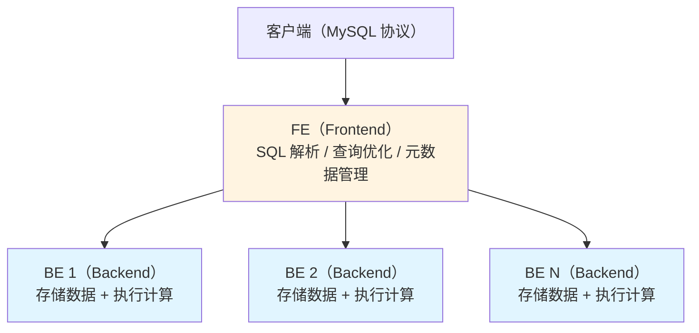

# 6.6 Doris——MPP 实时分析数据库

> **一句话定位**：Apache Doris（原百度 Palo）是一个 MPP（大规模并行处理）分析型数据库，定位是**实时 OLAP**——用标准 SQL 在亿级数据上做秒级聚合查询。它填补了 Hive（分钟级延迟）和 MySQL（扛不住大数据量分析）之间的空白，是实时 BI 看板、实时报表的热门选择。

---

## 一、Doris 解决什么问题？

在大数据技术栈中，不同组件处理不同延迟级别的查询：

| 场景 | 延迟要求 | 适合的引擎 |
|------|---------|-----------|
| T+1 离线报表 | 分钟~小时 | Hive / Spark SQL |
| 实时看板、Ad-hoc 查询 | **秒级** | **Doris** / ClickHouse / StarRocks |
| 事务性读写 | 毫秒级 | MySQL / TiDB |

Hive 延迟太高做不了实时看板，MySQL 数据量大了扛不住分析查询。Doris 的定位就是"能用 SQL、秒级返回、扛得住亿级数据"的分析引擎。

---

## 二、核心架构——FE + BE



| 角色 | 职责 | 特点 |
|------|------|------|
| **FE（Frontend）** | 接收 SQL、解析优化、管理元数据、协调查询 | 可多个 FE 做 HA，用 Paxos/BDB-JE 选主 |
| **BE（Backend）** | 存储数据（本地磁盘）+ 执行计算 | 存算一体，MPP 架构并行查询 |

**两个显著优势**：兼容 **MySQL 协议**（JDBC/MySQL CLI 直连，后端开发者零学习成本）；**存算一体**（不依赖 HDFS，自己管数据，运维简单）。

---

## 三、数据模型

Doris 提供三种数据模型，适合不同的分析场景：

| 模型 | 特点 | 适用场景 |
|------|------|---------|
| **Duplicate（明细模型）** | 存储原始明细数据，不做聚合 | 日志分析、行为明细查询 |
| **Aggregate（聚合模型）** | 相同 key 的数据自动按指定方式聚合（SUM/MAX/MIN/REPLACE） | 实时指标统计（PV/UV/GMV） |
| **Unique（唯一模型）** | 相同 key 只保留最新一条（REPLACE 语义） | 维度表、需要 UPDATE 语义的场景 |

```sql
-- Aggregate 模型示例：按日期+城市自动汇总订单
CREATE TABLE daily_orders (
    dt          DATE,
    city        VARCHAR(64),
    order_count BIGINT      SUM,     -- 自动求和
    total_amount DECIMAL(18,2) SUM,  -- 自动求和
    max_amount  DECIMAL(18,2) MAX    -- 自动取最大值
)
AGGREGATE KEY (dt, city)
DISTRIBUTED BY HASH(city) BUCKETS 16;
```

写入时，相同 `(dt, city)` 的数据自动合并聚合，查询时直接读取预聚合结果，速度极快。

---

## 四、核心特性

### 4.1 列式存储 + 向量化执行

Doris 底层是列式存储（按列组织数据），查询时只读需要的列，IO 大幅减少。执行引擎采用向量化（Vectorized Execution）——批量处理数据而非逐行处理，充分利用 CPU 缓存和 SIMD 指令。

**向量化执行引擎的核心原理**：

```
传统逐行执行（Volcano 模型）：
  for each row:
    读取一行 → 过滤 → 计算表达式 → 聚合
  问题：每行都有函数调用开销，CPU 分支预测失败率高，缓存命中率低

向量化执行（Doris 的方式）：
  for each batch (4096 行):
    批量读取一列数据到连续内存 → 批量过滤 → 批量计算 → 批量聚合
  优势：循环内无虚函数调用，数据连续排列利用 CPU Cache Line，可用 SIMD 指令并行处理
```

**为什么快**：

| 优化维度 | 逐行模型 | 向量化模型 |
|---------|---------|-----------|
| **函数调用** | 每行调用一次 next() 虚函数 | 每批（4096行）调用一次 |
| **CPU 缓存** | 行式数据跨列跳跃，Cache Miss 高 | 同列数据连续排列，Cache Line 命中率高 |
| **SIMD 指令** | 无法利用（数据不连续） | 连续 int/double 数组可用 SSE/AVX 一次处理 4-8 个值 |
| **分支预测** | 每行判断一次 WHERE 条件 | 批量生成 selection vector（位图），无分支 |
| **编译优化** | 循环体复杂，编译器难优化 | 紧凑循环，编译器自动向量化 |

**具体执行流程**：

```
SQL: SELECT city, SUM(amount) FROM orders WHERE status = 'paid' GROUP BY city

Step 1: Scan（列式读取）
  从 Tablet 中批量读取 status 列 → [paid, refund, paid, paid, ...]  4096个值
  从 Tablet 中批量读取 amount 列 → [100, 50, 200, 150, ...]
  从 Tablet 中批量读取 city 列   → [北京, 上海, 北京, 广州, ...]

Step 2: Filter（向量化过滤）
  status == 'paid' → selection_vector = [1, 0, 1, 1, ...]  ← 位图，无分支判断
  
Step 3: Project（向量化投影）
  根据 selection_vector 只保留命中行的 city 和 amount

Step 4: Aggregate（向量化聚合）
  批量 hash(city) → 批量累加 amount 到对应桶
  利用 SIMD 加速 hash 计算和求和
```

**性能提升**：向量化引擎相比传统逐行模型通常快 **5-10 倍**，这也是 Doris 查湖表时虽然失去了本地索引优势，但计算速度仍然比 Trino（Java 实现，JIT 优化）和 Hive（MapReduce）快的核心原因。

> **与其他系统的对比**：ClickHouse 也是向量化执行（C++ 实现），性能与 Doris 接近。Trino 虽然也做了部分向量化优化，但受限于 Java 的内存模型（对象头开销、GC 停顿），在纯计算密集场景下仍不如 C++ 实现的 Doris/ClickHouse。

### 4.2 物化视图（Materialized View）

物化视图是预计算的聚合结果，查询时 Doris 自动路由到最匹配的物化视图，避免实时聚合。

```sql
-- 在明细表上创建物化视图：按城市预聚合
CREATE MATERIALIZED VIEW city_summary AS
SELECT city, SUM(amount), COUNT(*)
FROM orders
GROUP BY city;

-- 查询时自动命中物化视图（用户不需要知道它的存在）
SELECT city, SUM(amount) FROM orders GROUP BY city;
```

### 4.3 数据导入方式

| 方式 | 场景 | 特点 |
|------|------|------|
| **Stream Load** | 实时小批量导入 | HTTP 协议推送，毫秒级延迟 |
| **Broker Load** | 从 HDFS/S3 批量导入 | 离线数仓到 Doris 的标准方式 |
| **Routine Load** | 从 Kafka 持续消费导入 | 实时数据管道，自动消费 Kafka Topic |
| **INSERT INTO** | SQL 插入 | 小批量或测试用，不适合大数据量 |

---

## 五、Doris vs ClickHouse vs StarRocks

这三个是实时 OLAP 领域最常被比较的引擎：

| 维度 | Doris | ClickHouse | StarRocks |
|------|-------|------------|-----------|
| 架构 | FE + BE，存算一体 | 无中心化，每个节点独立 | FE + BE（Doris 的商业分支） |
| SQL 兼容性 | 兼容 MySQL 协议 | 自有协议，SQL 方言多 | 兼容 MySQL 协议 |
| JOIN 能力 | MPP 多表 JOIN 较好 | 单表聚合极快，多表 JOIN 较弱 | MPP 多表 JOIN 好 |
| 实时写入 | Stream Load / Routine Load | 支持但高频写入可能影响查询 | 类似 Doris |
| 运维难度 | 较简单（不依赖外部组件） | 较复杂（ZooKeeper、副本管理） | 较简单 |
| 生态 | Apache 顶级项目，国内社区活跃 | 俄罗斯 Yandex 开源，全球社区 | 商业公司主导 |

> **选型建议**：如果团队是 MySQL 技术栈、需要多表 JOIN 和简单运维，选 Doris 或 StarRocks；如果是单表超大规模聚合查询且团队有 ClickHouse 运维经验，选 ClickHouse。

---

## 六、面试深度剖析

### 考点 1：Doris 的定位

> **面试官**：「Doris 和 MySQL、Hive 有什么区别？」

三者定位不同：MySQL 是 OLTP 数据库（事务+精确查询），Hive 是离线数仓查询引擎（分钟级延迟），Doris 是实时 OLAP 分析引擎（秒级延迟+亿级聚合）。Doris 不适合做事务性读写，也不适合做 T+1 全量离线计算。

### 考点 2：三种数据模型怎么选

> **面试官**：「Doris 的 Aggregate 模型和 Unique 模型有什么区别？」

Aggregate 模型支持多种聚合方式（SUM/MAX/MIN/REPLACE），适合指标汇总。Unique 模型只支持 REPLACE（保留最新），本质是 Aggregate 模型的特例，适合需要"更新"语义的场景（维度表、状态表）。Duplicate 模型不做任何聚合，保留全部明细。

### 考点 3：Doris 为什么查询快

> **面试官**：「Doris 凭什么在亿级数据上秒级返回？」

四个层面：列式存储（只读需要的列，减少 IO）；向量化执行（批量处理，利用 CPU 缓存）；MPP 并行（查询拆分到多个 BE 节点并行执行，最后汇总）；预聚合（Aggregate 模型 + 物化视图，查询时直接读结果而非实时计算）。

### 考点 4：数据怎么导入 Doris

> **面试官**：「实时数据怎么进 Doris？」

最常用的方案是 Routine Load——Doris 直接从 Kafka Topic 持续消费数据，自动导入。上游应用把数据发到 Kafka，Doris 负责消费，解耦生产者和消费者。小批量实时导入也可以用 Stream Load（HTTP 推送）。离线数仓数据用 Broker Load 从 HDFS 批量导入。

---

[← 6.5 Flink](./05-Flink.md) | [返回本章目录](./README.md)
