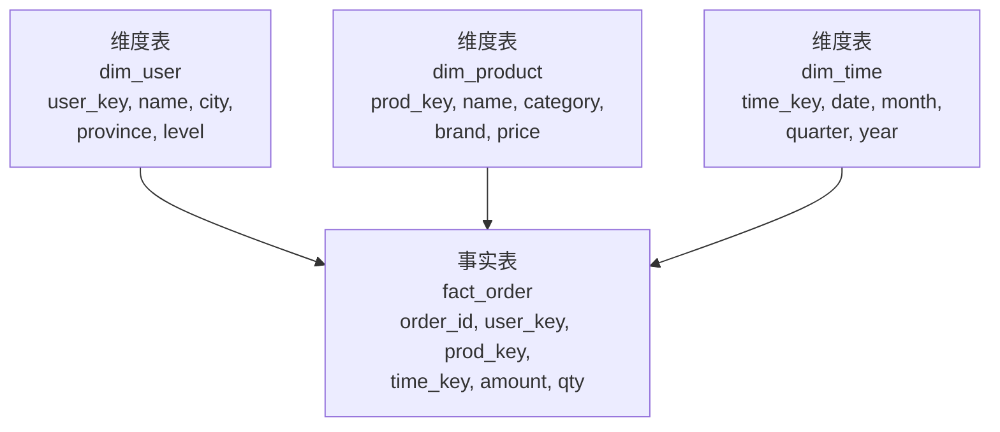
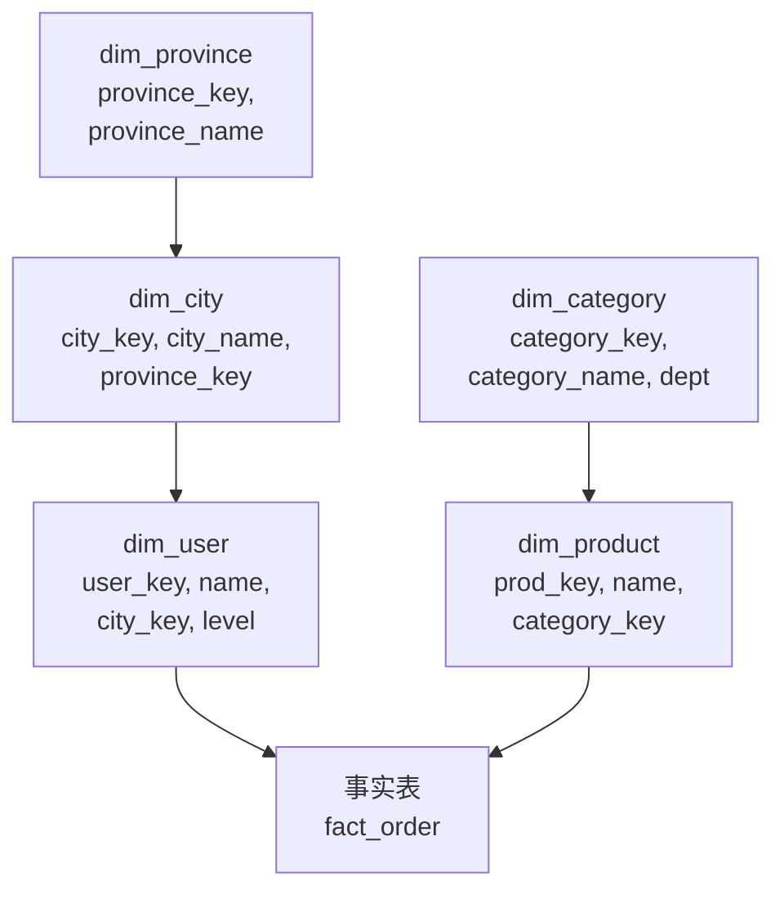
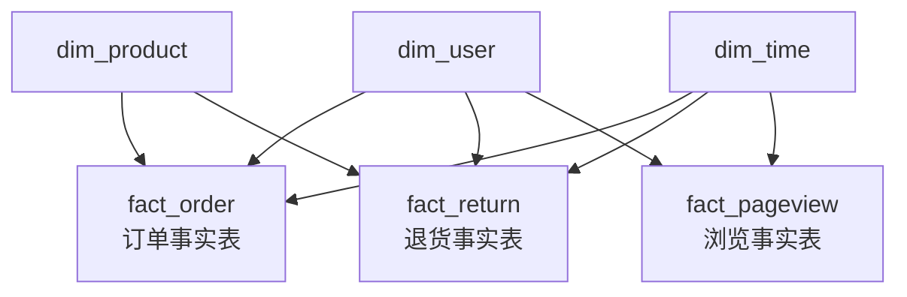

# 6.7 数据仓库设计——建模方法、设计模式与面试要点

> **一句话定位**：[6.1 全景](./01-大数据技术栈全景.md) 讲了数仓分层（ODS→DWD→DWS→ADS）解决"数据怎么组织"，本章深入讲**数仓怎么建模**——维度建模、星型模型、雪花模型、宽表、拉链表、缓慢变化维等设计模式，以及它们背后的取舍逻辑。这些是数据开发岗和高级后端岗面试的高频考点。

---

## 一、数仓建模的两大流派

数仓建模方法论主要有两大流派，理解它们的出发点才能理解后面所有设计模式的取舍。

### 1.1 Inmon 范式建模（自顶向下）

Bill Inmon 被称为"数据仓库之父"。他的方法论是先设计一个**企业级的、规范化（3NF）的数据仓库**，再从中派生出面向各部门的数据集市（Data Mart）。

核心思路：像设计 OLTP 数据库一样设计数仓，遵循第三范式减少冗余，确保"一个事实只存一个地方"。

优点是数据一致性好、冗余少；缺点是建设周期长、查询时需要大量 JOIN（3NF 表太碎了）。

### 1.2 Kimball 维度建模（自底向上）

Ralph Kimball 提出的方法论是先从业务需求出发，构建面向分析主题的**维度模型**（星型/雪花模型），再逐步整合成企业数仓。

核心思路：分析场景的核心是"指标 + 维度"——"按地区、按时间、按品类看 GMV"，所以把数据组织成**事实表**（存指标/度量值）和**维度表**（存描述性属性）。

优点是查询直观、性能好（预聚合 + 少 JOIN）；缺点是有数据冗余。

> **现实选择**：互联网公司绝大多数采用 **Kimball 维度建模**，因为业务变化快、查询性能要求高、能容忍适度冗余。下文重点讲维度建模。

---

## 二、维度建模的核心概念

### 2.1 事实表（Fact Table）

事实表存储的是业务过程中可度量的数值——也就是"发生了什么事，数字是多少"。

```
订单事实表 fact_order：
┌──────────┬──────────┬──────────┬────────┬────────┐
│ order_id │ user_key │ prod_key │ amount │ qty    │
├──────────┼──────────┼──────────┼────────┼────────┤
│ 10001    │ U_2048   │ P_305    │ 299.00 │ 1      │
│ 10002    │ U_1024   │ P_118    │ 59.90  │ 2      │
└──────────┴──────────┴──────────┴────────┴────────┘
  ↑ 外键指向维度表        ↑ 度量值（可聚合）
```

事实表有三种类型：

| 类型 | 存什么 | 示例 |
|------|--------|------|
| **事务事实表** | 每条业务事件一行 | 订单表（一行 = 一笔订单） |
| **周期快照事实表** | 固定周期的状态快照 | 每日库存表（一行 = 某商品某天的库存量） |
| **累积快照事实表** | 业务流程中多个里程碑时间 | 订单生命周期表（下单时间、支付时间、发货时间、签收时间） |

### 2.2 维度表（Dimension Table）

维度表存储的是分析的"角度"——也就是"从哪个视角看这些数字"。

```
用户维度表 dim_user：
┌──────────┬────────┬─────┬────────┬──────────┐
│ user_key │ name   │ age │ city   │ level    │
├──────────┼────────┼─────┼────────┼──────────┤
│ U_2048   │ 张三   │ 28  │ 北京   │ 黄金     │
│ U_1024   │ 李四   │ 35  │ 上海   │ 白银     │
└──────────┴────────┴─────┴────────┴──────────┘
  ↑ 被事实表引用
```

维度表的特点是：行数相对少（几万~几百万），列数多（描述性属性丰富），变化慢（用户信息不会每秒变）。

### 2.3 度量值（Measure）与粒度（Grain）

**度量值**是事实表中可以聚合的数值列（SUM/AVG/COUNT），比如金额、数量、时长。

**粒度**是事实表中一行代表什么，是建模时**最先确定**的事情。粒度定错，后面全错：

```
粒度太粗：一行 = 某用户某月的总订单金额
  → 无法回答"某用户某天买了什么"
  → 无法拆分到单笔订单

粒度太细：一行 = 某订单的某个商品的某个促销活动的某次价格变更
  → 数据量爆炸，查询慢，大部分维度用不到

合适的粒度：一行 = 一笔订单（或一行 = 一笔订单的一个商品）
  → 可以向上聚合（按天/按用户/按品类），也能看明细
```

> **面试记忆点**：粒度 = 事实表中一行代表的最细粒度业务事件。确定粒度是维度建模的**第一步**，它决定了能回答哪些分析问题。

---

## 三、星型模型、雪花模型与星座模型

这三种模型是维度建模的三种**物理组织形式**，区别在于维度表是否进一步拆分。

### 3.1 星型模型（Star Schema）

事实表在中心，维度表直接围绕事实表，维度表不再拆分（即使有冗余）。



注意 dim_user 中 city 和 province 存在函数依赖（city → province），在 3NF 建模中应该拆分，但星型模型**故意保留冗余**。

**优点**：查询只需要一层 JOIN（事实表 JOIN 维度表），简单直观，查询性能好。

**缺点**：维度表有冗余（北京对应的 province = "北京"被重复存储在每个北京用户的行里）。

### 3.2 雪花模型（Snowflake Schema）

在星型模型的基础上，把维度表进一步规范化——拆出子维度表。



维度表像雪花一样向外分支，所以叫雪花模型。

**优点**：减少冗余，维度表更规范。

**缺点**：查询时需要多层 JOIN（事实表 → dim_user → dim_city → dim_province），在大数据场景下多层 JOIN 的代价远大于冗余存储的代价。

### 3.3 星座模型（Galaxy Schema / Constellation）

多个事实表共享维度表。这不是一种新的建模理念，而是**真实数仓的常态**——一个数仓中有订单事实表、退货事实表、浏览事实表，它们共享 dim_user、dim_product、dim_time 等维度表。



### 3.4 三种模型的选型

| 维度 | 星型模型 | 雪花模型 | 星座模型 |
|------|---------|---------|---------|
| 维度表结构 | 扁平，有冗余 | 规范化，无冗余 | 多事实表共享维度 |
| JOIN 层数 | 1 层 | 多层 | 1 层（单事实表查询） |
| 查询性能 | 最好 | 较差（多层 JOIN） | 好 |
| 存储空间 | 略大 | 最小 | 取决于事实表数量 |
| 维护复杂度 | 低 | 高 | 中 |
| 适用场景 | 大数据数仓（Hive/Spark） | 传统数仓（Oracle/Teradata） | 企业级数仓（多业务线） |

> **互联网公司的现实**：绝大多数用**星型模型**。原因很直接——在 Hive/Spark 中多层 JOIN 的 Shuffle 代价远大于冗余存储的成本。磁盘便宜，Shuffle 贵。

---

## 四、宽表——互联网数仓的务实选择

### 4.1 什么是宽表

宽表是把事实表和所有相关维度表 JOIN 好之后**预先物化**的结果——一张表就包含了分析需要的所有字段，查询时不需要再 JOIN。

```sql
-- 宽表 dws_order_wide：事实 + 所有维度预先拼好
SELECT 
    o.order_id, o.amount, o.qty, o.create_time,
    u.name as user_name, u.city, u.province, u.level,
    p.product_name, p.category, p.brand
FROM fact_order o
JOIN dim_user u ON o.user_key = u.user_key
JOIN dim_product p ON o.prod_key = p.prod_key;
-- 这个结果物化成一张表，后续查询直接用
```

### 4.2 宽表 vs 星型模型

| 维度 | 星型模型 | 宽表 |
|------|---------|------|
| JOIN | 查询时 JOIN | 提前 JOIN 好，查询时不 JOIN |
| 灵活性 | 维度变了只改维度表 | 维度变了要重跑宽表 |
| 查询性能 | 需要 JOIN，较慢 | 直接 SELECT，最快 |
| 存储空间 | 事实表 + 维度表 | 冗余最大（所有维度展开） |
| 适用层 | DWD 层 | DWS / ADS 层 |

> **生产经验**：DWD 层用星型模型保持灵活性，DWS/ADS 层出宽表保证查询性能。这是分层设计和建模设计的配合。

---

## 五、缓慢变化维（SCD）与拉链表

维度表的数据会变化——用户换了城市、商品改了品类、员工升了职级。如何在数仓中**保留历史**是一个经典问题。

### 5.1 缓慢变化维的三种处理策略

| 类型 | 策略 | 做法 | 能看历史吗 | 示例 |
|------|------|------|-----------|------|
| **SCD Type 1** | 直接覆盖 | 用新值覆盖旧值 | 不能 | 用户改了手机号，只保留新号码 |
| **SCD Type 2** | 新增行 | 新增一行，用 start_date/end_date 标记有效期 | 能 | 用户从北京搬到上海，两行都保留 |
| **SCD Type 3** | 新增列 | 在同一行增加 current_city / previous_city | 只能看一层 | 简单场景，只需要"上一次"的值 |

SCD Type 2 是数仓中最常用的，因为它能完整保留历史变化轨迹。

### 5.2 SCD Type 2 示例

```
用户张三从北京搬到上海：

修改前：
┌──────────┬──────┬──────┬────────────┬────────────┬────────┐
│ user_key │ name │ city │ start_date │ end_date   │ is_cur │
├──────────┼──────┼──────┼────────────┼────────────┼────────┤
│ U_2048   │ 张三 │ 北京 │ 2020-01-01 │ 9999-12-31 │ Y      │
└──────────┴──────┴──────┴────────────┴────────────┴────────┘

修改后：
┌──────────┬──────┬──────┬────────────┬────────────┬────────┐
│ user_key │ name │ city │ start_date │ end_date   │ is_cur │
├──────────┼──────┼──────┼────────────┼────────────┼────────┤
│ U_2048   │ 张三 │ 北京 │ 2020-01-01 │ 2024-06-28 │ N      │  ← 旧行关闭
│ U_2048   │ 张三 │ 上海 │ 2024-06-29 │ 9999-12-31 │ Y      │  ← 新行生效
└──────────┴──────┴──────┴────────────┴────────────┴────────┘
```

查当前数据加 `WHERE is_cur = 'Y'`，查历史数据用时间范围匹配 `WHERE '2023-06-15' BETWEEN start_date AND end_date`。

### 5.3 拉链表——SCD Type 2 在大数据中的落地

拉链表是 SCD Type 2 在 Hive 中的具体实现。它用 start_date 和 end_date 两个字段记录每行数据的有效期，把全量快照变成增量存储。

**为什么需要拉链表？** 如果每天做一次全量快照（把整个用户表复制一份），365 天就是 365 份全量，存储量巨大。拉链表只存"变化"——数据没变的行不会新增记录，只有发生变化时才插入新行并关闭旧行。

```sql
-- 拉链表典型查询：查某个历史时间点的用户状态
SELECT * FROM dim_user_zipper
WHERE '2024-03-15' >= start_date 
  AND '2024-03-15' <= end_date;

-- 查当前最新状态
SELECT * FROM dim_user_zipper
WHERE end_date = '9999-12-31';
```

<details>
<summary><b>展开：拉链表的 ETL 实现思路</b></summary>

拉链表的每日更新分三步：

**第一步**：获取当天变化的数据（通过对比全量/binlog/CDC 等方式识别哪些行发生了变化）。

**第二步**：关闭旧行——把昨天有效但今天发生变化的行的 end_date 从 `9999-12-31` 改为昨天的日期。

**第三步**：插入新行——把变化后的数据作为新行插入，start_date = 今天，end_date = `9999-12-31`。

```sql
-- 拉链表更新的 Hive SQL 伪代码
INSERT OVERWRITE TABLE dim_user_zipper
-- 关闭变化行的旧记录
SELECT user_key, name, city, level,
       start_date,
       CASE WHEN changed.user_key IS NOT NULL 
            THEN '2024-06-28'   -- 昨天
            ELSE end_date 
       END AS end_date
FROM dim_user_zipper old
LEFT JOIN today_changed changed ON old.user_key = changed.user_key
WHERE old.end_date = '9999-12-31'

UNION ALL

-- 插入变化行的新记录
SELECT user_key, name, city, level,
       '2024-06-29' AS start_date,   -- 今天
       '9999-12-31' AS end_date
FROM today_changed

UNION ALL

-- 历史已关闭的行不动
SELECT * FROM dim_user_zipper
WHERE end_date < '9999-12-31';
```

</details>

### 5.4 全量快照 vs 增量 vs 拉链表

| 方案 | 存储开销 | 查历史 | ETL 复杂度 | 适用场景 |
|------|---------|--------|-----------|---------|
| **每日全量快照** | 最大（N 天 × 全量） | 简单（直接查对应分区） | 最低 | 数据量小的维度表 |
| **只保留最新** | 最小 | 不能 | 最低 | 不需要历史的场景 |
| **拉链表** | 适中（只存变化） | 支持任意时间点 | 较高 | 数据量大且需要历史 |

---

## 六、数仓分层模型详解

[6.1 全景](./01-大数据技术栈全景.md) 中简要介绍了四层模型，这里展开讲每层的设计要点。

### 6.1 各层职责与建模风格

| 层级 | 数据来源 | 建模风格 | 设计要点 |
|------|---------|---------|---------|
| **ODS** | 业务库同步 / 日志采集 | 无建模，保留原貌 | 外部表 + 按天分区 + 保留原始字段 |
| **DWD** | ODS 清洗 | **维度建模（星型模型）** | 确定粒度 → 识别事实和维度 → 清洗规范化 |
| **DWS** | DWD 聚合 | **宽表** | 按主题域汇总（用户域/交易域/流量域） |
| **ADS** | DWS 加工 | **面向应用** | 直接对接 BI / API，一张表解决一个报表需求 |

### 6.2 DIM 层——维度层

有些数仓架构会把维度表从 DWD 中独立出来，形成专门的 DIM 层。DIM 层存放所有维度表（dim_user / dim_product / dim_time / dim_region），由多个 DWD 事实表共享引用。

```
典型数仓分层：
  ODS（原始数据）
   ↓
  DWD（明细事实表）  ←──── DIM（维度表）
   ↓
  DWS（汇总宽表）
   ↓
  ADS（应用报表）
```

### 6.3 主题域划分

DWS 层的组织方式是按"主题域"——每个主题域对应一类分析视角：

| 主题域 | 包含什么 | 典型宽表 |
|--------|---------|---------|
| **用户域** | 用户行为、画像、留存 | dws_user_behavior_1d（用户日行为汇总） |
| **交易域** | 订单、支付、退款 | dws_trade_order_1d（交易日汇总） |
| **流量域** | PV、UV、页面路径 | dws_traffic_page_1d（流量日汇总） |
| **商品域** | 商品曝光、点击、转化 | dws_product_click_1d（商品点击日汇总） |

表命名规范通常是 `dws_{主题域}_{数据域}_{时间粒度}`，比如 `dws_trade_order_1d` 表示交易域订单主题的天级汇总。

---

## 七、数据质量与治理

### 7.1 数据质量的六个维度

| 维度 | 含义 | 检查手段 |
|------|------|---------|
| **完整性** | 数据有没有缺失 | 空值比例、行数对比（源端 vs 数仓） |
| **准确性** | 数据对不对 | 业务规则校验（金额 > 0、日期合法） |
| **一致性** | 同一数据在不同地方是否一致 | 跨表/跨层对账（DWD 求和 = ODS 求和） |
| **及时性** | 数据有没有按时产出 | 调度监控（任务延迟告警） |
| **唯一性** | 有没有重复 | 主键去重检查 |
| **有效性** | 数据是否在合理范围内 | 枚举值校验、阈值校验 |

### 7.2 数据治理常见实践

**元数据管理**：记录每张表的 owner、业务含义、字段口径、血缘关系。没有元数据管理的数仓很快会变成"数据沼泽"——数据很多，但没人知道哪张表可信。

**数据血缘**：追踪数据的来源链路（ODS 的哪张表 → DWD 的哪张表 → DWS → ADS），排查数据问题时沿着血缘链路往上追溯。

**数据生命周期**：设置数据保留策略（ODS 保留 90 天、DWD 保留 1 年、DWS 保留 3 年），避免存储无限膨胀。

---

## 八、面试深度剖析

### 考点 1：星型模型 vs 雪花模型

> **面试官**：「星型模型和雪花模型有什么区别？你们用的哪个？」

星型模型的维度表是扁平的（有冗余但查询只需一层 JOIN），雪花模型的维度表进一步规范化拆分（无冗余但多层 JOIN）。互联网大数据场景几乎都用星型模型，因为 Hive/Spark 中多层 JOIN 的 Shuffle 代价远大于存储冗余的成本。

### 考点 2：事实表的粒度怎么定

> **面试官**：「设计一张订单事实表，粒度应该是什么？」

先问业务需要回答什么问题。如果只需要"每天多少订单、多少 GMV"，粒度可以是一行一笔订单。如果需要"每笔订单中每个商品的销量"，粒度就要细化到订单-商品级别（即订单明细表）。原则是**粒度定到最细的分析需要**，向上聚合总是可以的，向下拆分则不行。

### 考点 3：什么是拉链表？什么场景用？

> **面试官**：「维度表每天变化怎么处理？」

拉链表用 start_date / end_date 记录每行数据的有效期。适合数据量大（不适合每天全量快照）且需要查历史状态的场景。查当前数据加 `WHERE end_date = '9999-12-31'`，查历史时间点用范围匹配。

### 考点 4：数仓分层的意义和各层职责

> **面试官**：「为什么分 ODS/DWD/DWS/ADS？能不能少分几层？」

每层有明确职责：ODS 负责"搬运"（保留原貌），DWD 负责"清洗"（只做一次，多表复用），DWS 负责"聚合"（按主题汇总），ADS 负责"出口"（直接对接应用）。分层的核心好处是**解耦和复用**——修改指标口径只改 DWD→DWS 的一条 ETL，不需要改每个报表。类比代码的 Controller/Service/DAO 分层。可以少分层吗？可以，小团队可能只有 ODS + DWS + ADS，但层越少耦合越重，后期维护成本越高。

### 考点 5：宽表的优缺点

> **面试官**：「宽表好用，为什么不全部用宽表？」

宽表查询快（不需要 JOIN），但冗余大、灵活性差（维度变了要重跑宽表）。所以 DWD 层保持星型模型的灵活性，DWS/ADS 层出宽表保证性能——这是分层设计和建模设计的配合。全部用宽表意味着任何维度变化都要重跑所有表，ETL 维护成本爆炸。

<details>
<summary><b>展开：面试高频追问——实际项目中遇到的数仓设计挑战</b></summary>

**数据倾斜导致 ETL 超时**：某个维度（如城市）数据分布极不均匀，核心城市的数据量是其他城市的 100 倍。解决方案：DWS 层按城市分桶 + 两阶段聚合。

**口径不一致**：同一个"日活"指标在不同报表中定义不同（有的包含 Bot 流量，有的不包含）。解决方案：DWD 层统一定义原子指标口径，DWS 层派生衍生指标，所有报表从同一个 DWS 表取数。

**维度缓慢变化**：商品换了品类，历史订单应该关联新品类还是旧品类？看业务需求。财务对账必须用下单时的品类（用拉链表回溯），营销分析可能用最新品类（直接 JOIN 当前维度表）。

**数据延迟**：上游业务库的数据同步延迟导致 DWD 层数据缺失。解决方案：ETL 中增加数据完整性校验（对比源端行数），不满足则重试或告警，不产出不完整的下游数据。

</details>

---

[← 6.6 Doris](./06-Doris.md) | [返回本章目录](./README.md) | [返回全书目录](../README.md)
