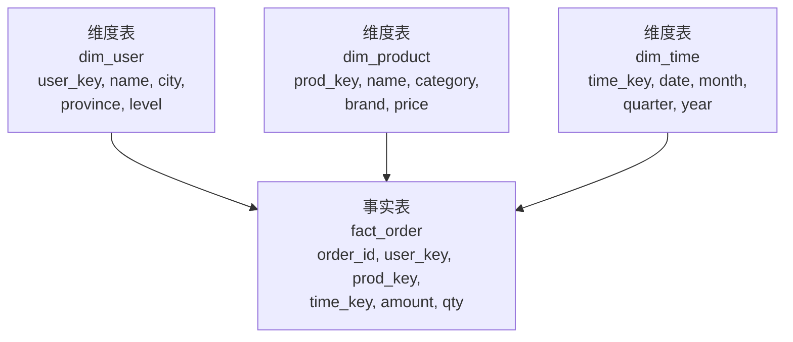
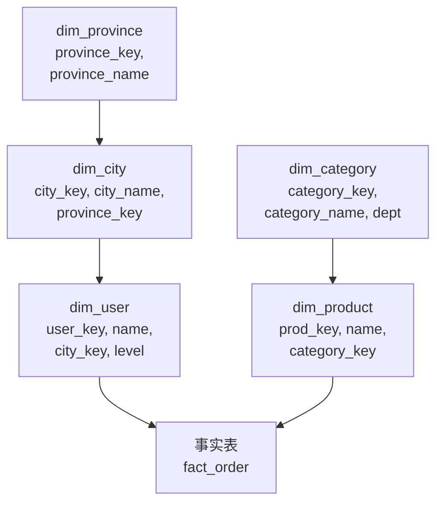
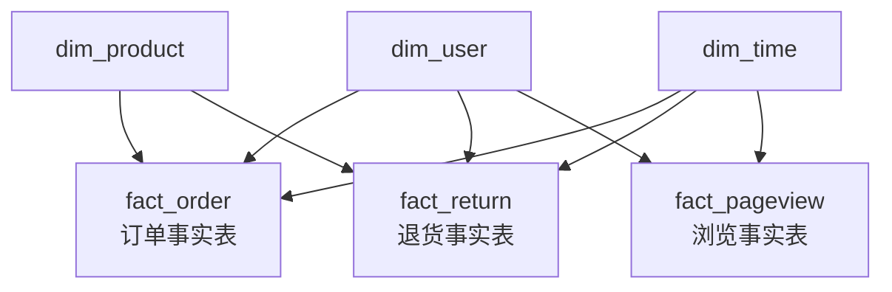

# 6.7 数据仓库设计——建模方法、设计模式与面试要点

> **一句话定位**：[6.1 全景](./01-大数据技术栈全景.md) 讲了数仓分层（ODS→DWD→DWS→ADS）解决"数据怎么组织"，本章深入讲**数仓怎么建模**——维度建模、星型模型、雪花模型、宽表、拉链表、缓慢变化维等设计模式，以及它们背后的取舍逻辑。这些是数据开发岗和高级后端岗面试的高频考点。

---

## 一、数仓建模的两大流派

数仓建模方法论主要有两大流派，理解它们的出发点才能理解后面所有设计模式的取舍。

### 1.1 Inmon 范式建模（自顶向下）

Bill Inmon 被称为"数据仓库之父"。他的方法论是先设计一个**企业级的、规范化（3NF）的数据仓库**，再从中派生出面向各部门的数据集市（Data Mart）。

核心思路：像设计 OLTP 数据库一样设计数仓，遵循第三范式减少冗余，确保"一个事实只存一个地方"。

优点是数据一致性好、冗余少；缺点是建设周期长、查询时需要大量 JOIN（3NF 表太碎了）。

### 1.2 Kimball 维度建模（自底向上）

Ralph Kimball 提出的方法论是先从业务需求出发，构建面向分析主题的**维度模型**（星型/雪花模型），再逐步整合成企业数仓。

核心思路：分析场景的核心是"指标 + 维度"——"按地区、按时间、按品类看 GMV"，所以把数据组织成**事实表**（存指标/度量值）和**维度表**（存描述性属性）。

优点是查询直观、性能好（预聚合 + 少 JOIN）；缺点是有数据冗余。

> **现实选择**：互联网公司绝大多数采用 **Kimball 维度建模**，因为业务变化快、查询性能要求高、能容忍适度冗余。下文重点讲维度建模。

---

## 二、维度建模的核心概念

### 2.1 事实表（Fact Table）

事实表存储的是业务过程中可度量的数值——也就是"发生了什么事，数字是多少"。

```
订单事实表 fact_order：
┌──────────┬──────────┬──────────┬────────┬────────┐
│ order_id │ user_key │ prod_key │ amount │ qty    │
├──────────┼──────────┼──────────┼────────┼────────┤
│ 10001    │ U_2048   │ P_305    │ 299.00 │ 1      │
│ 10002    │ U_1024   │ P_118    │ 59.90  │ 2      │
└──────────┴──────────┴──────────┴────────┴────────┘
  ↑ 外键指向维度表        ↑ 度量值（可聚合）
```

事实表有三种类型：

| 类型 | 存什么 | 示例 |
|------|--------|------|
| **事务事实表** | 每条业务事件一行 | 订单表（一行 = 一笔订单） |
| **周期快照事实表** | 固定周期的状态快照 | 每日库存表（一行 = 某商品某天的库存量） |
| **累积快照事实表** | 业务流程中多个里程碑时间 | 订单生命周期表（下单时间、支付时间、发货时间、签收时间） |

### 2.2 维度表（Dimension Table）

维度表存储的是分析的"角度"——也就是"从哪个视角看这些数字"。

```
用户维度表 dim_user：
┌──────────┬────────┬─────┬────────┬──────────┐
│ user_key │ name   │ age │ city   │ level    │
├──────────┼────────┼─────┼────────┼──────────┤
│ U_2048   │ 张三   │ 28  │ 北京   │ 黄金     │
│ U_1024   │ 李四   │ 35  │ 上海   │ 白银     │
└──────────┴────────┴─────┴────────┴──────────┘
  ↑ 被事实表引用
```

维度表的特点是：行数相对少（几万~几百万），列数多（描述性属性丰富），变化慢（用户信息不会每秒变）。

### 2.3 度量值（Measure）与粒度（Grain）

**度量值**是事实表中可以聚合的数值列（SUM/AVG/COUNT），比如金额、数量、时长。

**粒度**是事实表中一行代表什么，是建模时**最先确定**的事情。粒度定错，后面全错：

```
粒度太粗：一行 = 某用户某月的总订单金额
  → 无法回答"某用户某天买了什么"
  → 无法拆分到单笔订单

粒度太细：一行 = 某订单的某个商品的某个促销活动的某次价格变更
  → 数据量爆炸，查询慢，大部分维度用不到

合适的粒度：一行 = 一笔订单（或一行 = 一笔订单的一个商品）
  → 可以向上聚合（按天/按用户/按品类），也能看明细
```

> **面试记忆点**：粒度 = 事实表中一行代表的最细粒度业务事件。确定粒度是维度建模的**第一步**，它决定了能回答哪些分析问题。

---

## 三、星型模型、雪花模型与星座模型

这三种模型是维度建模的三种**物理组织形式**，区别在于维度表是否进一步拆分。

### 3.1 星型模型（Star Schema）

事实表在中心，维度表直接围绕事实表，维度表不再拆分（即使有冗余）。



注意 dim_user 中 city 和 province 存在函数依赖（city → province），在 3NF 建模中应该拆分，但星型模型**故意保留冗余**。

**优点**：查询只需要一层 JOIN（事实表 JOIN 维度表），简单直观，查询性能好。

**缺点**：维度表有冗余（北京对应的 province = "北京"被重复存储在每个北京用户的行里）。

### 3.2 雪花模型（Snowflake Schema）

在星型模型的基础上，把维度表进一步规范化——拆出子维度表。



维度表像雪花一样向外分支，所以叫雪花模型。

**优点**：减少冗余，维度表更规范。

**缺点**：查询时需要多层 JOIN（事实表 → dim_user → dim_city → dim_province），在大数据场景下多层 JOIN 的代价远大于冗余存储的代价。

### 3.3 星座模型（Galaxy Schema / Constellation）

多个事实表共享维度表。这不是一种新的建模理念，而是**真实数仓的常态**——一个数仓中有订单事实表、退货事实表、浏览事实表，它们共享 dim_user、dim_product、dim_time 等维度表。



### 3.4 三种模型的选型

| 维度 | 星型模型 | 雪花模型 | 星座模型 |
|------|---------|---------|---------|
| 维度表结构 | 扁平，有冗余 | 规范化，无冗余 | 多事实表共享维度 |
| JOIN 层数 | 1 层 | 多层 | 1 层（单事实表查询） |
| 查询性能 | 最好 | 较差（多层 JOIN） | 好 |
| 存储空间 | 略大 | 最小 | 取决于事实表数量 |
| 维护复杂度 | 低 | 高 | 中 |
| 适用场景 | 大数据数仓（Hive/Spark） | 传统数仓（Oracle/Teradata） | 企业级数仓（多业务线） |

> **互联网公司的现实**：绝大多数用**星型模型**。原因很直接——在 Hive/Spark 中多层 JOIN 的 Shuffle 代价远大于冗余存储的成本。磁盘便宜，Shuffle 贵。

---

## 四、宽表——互联网数仓的务实选择

### 4.1 什么是宽表

宽表是把事实表和所有相关维度表 JOIN 好之后**预先物化**的结果——一张表就包含了分析需要的所有字段，查询时不需要再 JOIN。

```sql
-- 宽表 dws_order_wide：事实 + 所有维度预先拼好
SELECT 
    o.order_id, o.amount, o.qty, o.create_time,
    u.name as user_name, u.city, u.province, u.level,
    p.product_name, p.category, p.brand
FROM fact_order o
JOIN dim_user u ON o.user_key = u.user_key
JOIN dim_product p ON o.prod_key = p.prod_key;
-- 这个结果物化成一张表，后续查询直接用
```

### 4.2 宽表 vs 星型模型

| 维度 | 星型模型 | 宽表 |
|------|---------|------|
| JOIN | 查询时 JOIN | 提前 JOIN 好，查询时不 JOIN |
| 灵活性 | 维度变了只改维度表 | 维度变了要重跑宽表 |
| 查询性能 | 需要 JOIN，较慢 | 直接 SELECT，最快 |
| 存储空间 | 事实表 + 维度表 | 冗余最大（所有维度展开） |
| 适用层 | DWD 层 | DWS / ADS 层 |

> **生产经验**：DWD 层用星型模型保持灵活性，DWS/ADS 层出宽表保证查询性能。这是分层设计和建模设计的配合。

---

## 五、缓慢变化维（SCD）与拉链表

维度表的数据会变化——用户换了城市、商品改了品类、员工升了职级。如何在数仓中**保留历史**是一个经典问题。

### 5.1 缓慢变化维的三种处理策略

| 类型 | 策略 | 做法 | 能看历史吗 | 示例 |
|------|------|------|-----------|------|
| **SCD Type 1** | 直接覆盖 | 用新值覆盖旧值 | 不能 | 用户改了手机号，只保留新号码 |
| **SCD Type 2** | 新增行 | 新增一行，用 start_date/end_date 标记有效期 | 能 | 用户从北京搬到上海，两行都保留 |
| **SCD Type 3** | 新增列 | 在同一行增加 current_city / previous_city | 只能看一层 | 简单场景，只需要"上一次"的值 |

SCD Type 2 是数仓中最常用的，因为它能完整保留历史变化轨迹。

### 5.2 SCD Type 2 示例

```
用户张三从北京搬到上海：

修改前：
┌──────────┬──────┬──────┬────────────┬────────────┬────────┐
│ user_key │ name │ city │ start_date │ end_date   │ is_cur │
├──────────┼──────┼──────┼────────────┼────────────┼────────┤
│ U_2048   │ 张三 │ 北京 │ 2020-01-01 │ 9999-12-31 │ Y      │
└──────────┴──────┴──────┴────────────┴────────────┴────────┘

修改后：
┌──────────┬──────┬──────┬────────────┬────────────┬────────┐
│ user_key │ name │ city │ start_date │ end_date   │ is_cur │
├──────────┼──────┼──────┼────────────┼────────────┼────────┤
│ U_2048   │ 张三 │ 北京 │ 2020-01-01 │ 2024-06-28 │ N      │  ← 旧行关闭
│ U_2048   │ 张三 │ 上海 │ 2024-06-29 │ 9999-12-31 │ Y      │  ← 新行生效
└──────────┴──────┴──────┴────────────┴────────────┴────────┘
```

查当前数据加 `WHERE is_cur = 'Y'`，查历史数据用时间范围匹配 `WHERE '2023-06-15' BETWEEN start_date AND end_date`。

### 5.3 拉链表——SCD Type 2 在大数据中的落地

**什么是拉链表？** 拉链表是 SCD Type 2 在 Hive 中的具体实现。它用 start_date 和 end_date 两个字段记录每行数据的有效期——每行数据像拉链的一个齿，首尾相连形成完整的历史变化链条，因此得名"拉链表"。数据没变的行不会新增记录，只有发生变化时才插入新行并关闭旧行。

**为什么需要拉链表？** 如果每天做一次全量快照（把整个用户表复制一份），365 天就是 365 份全量，存储量巨大。拉链表只存"变化"，把全量快照变成增量存储，在保留完整历史的同时大幅节省存储空间。

```sql
-- 拉链表典型查询：查某个历史时间点的用户状态
SELECT * FROM dim_user_zipper
WHERE '2024-03-15' >= start_date 
  AND '2024-03-15' <= end_date;

-- 查当前最新状态
SELECT * FROM dim_user_zipper
WHERE end_date = '9999-12-31';
```

<details>
<summary><b>展开：拉链表的 ETL 实现思路</b></summary>

拉链表的每日更新分三步：

**第一步**：获取当天变化的数据（通过对比全量/binlog/CDC 等方式识别哪些行发生了变化）。

**第二步**：关闭旧行——把昨天有效但今天发生变化的行的 end_date 从 `9999-12-31` 改为昨天的日期。

**第三步**：插入新行——把变化后的数据作为新行插入，start_date = 今天，end_date = `9999-12-31`。

```sql
-- 拉链表更新的 Hive SQL 伪代码
INSERT OVERWRITE TABLE dim_user_zipper
-- 关闭变化行的旧记录
SELECT user_key, name, city, level,
       start_date,
       CASE WHEN changed.user_key IS NOT NULL 
            THEN '2024-06-28'   -- 昨天
            ELSE end_date 
       END AS end_date
FROM dim_user_zipper old
LEFT JOIN today_changed changed ON old.user_key = changed.user_key
WHERE old.end_date = '9999-12-31'

UNION ALL

-- 插入变化行的新记录
SELECT user_key, name, city, level,
       '2024-06-29' AS start_date,   -- 今天
       '9999-12-31' AS end_date
FROM today_changed

UNION ALL

-- 历史已关闭的行不动
SELECT * FROM dim_user_zipper
WHERE end_date < '9999-12-31';
```

</details>

### 5.4 全量快照 vs 增量 vs 拉链表

| 方案 | 存储开销 | 查历史 | ETL 复杂度 | 适用场景 |
|------|---------|--------|-----------|---------|
| **每日全量快照** | 最大（N 天 × 全量） | 简单（直接查对应分区） | 最低 | 数据量小的维度表 |
| **只保留最新** | 最小 | 不能 | 最低 | 不需要历史的场景 |
| **拉链表** | 适中（只存变化） | 支持任意时间点 | 较高 | 数据量大且需要历史 |

---

## 六、数仓分层模型详解

[6.1 全景](./01-大数据技术栈全景.md) 中简要介绍了四层模型，这里展开讲每层的设计要点。

### 6.1 各层职责与建模风格

| 层级 | 数据来源 | 建模风格 | 设计要点 |
|------|---------|---------|---------|
| **ODS** | 业务库同步 / 日志采集 | 无建模，保留原貌 | 外部表 + 按天分区 + 保留原始字段 |
| **DWD** | ODS 清洗 | **维度建模（星型模型）** | 确定粒度 → 识别事实和维度 → 清洗规范化 |
| **DWS** | DWD 聚合 | **宽表** | 按主题域汇总（用户域/交易域/流量域） |
| **ADS** | DWS 加工 | **面向应用** | 直接对接 BI / API，一张表解决一个报表需求 |

### 6.2 DIM 层——维度层

有些数仓架构会把维度表从 DWD 中独立出来，形成专门的 DIM 层。DIM 层存放所有维度表（dim_user / dim_product / dim_time / dim_region），由多个 DWD 事实表共享引用。

```
典型数仓分层：
  ODS（原始数据）
   ↓
  DWD（明细事实表）  ←──── DIM（维度表）
   ↓
  DWS（汇总宽表）
   ↓
  ADS（应用报表）
```

### 6.3 主题域划分

DWS 层的组织方式是按"主题域"——每个主题域对应一类分析视角：

| 主题域 | 包含什么 | 典型宽表 |
|--------|---------|---------|
| **用户域** | 用户行为、画像、留存 | dws_user_behavior_1d（用户日行为汇总） |
| **交易域** | 订单、支付、退款 | dws_trade_order_1d（交易日汇总） |
| **流量域** | PV、UV、页面路径 | dws_traffic_page_1d（流量日汇总） |
| **商品域** | 商品曝光、点击、转化 | dws_product_click_1d（商品点击日汇总） |

表命名规范通常是 `dws_{主题域}_{数据域}_{时间粒度}`，比如 `dws_trade_order_1d` 表示交易域订单主题的天级汇总。

---

## 七、数据质量与治理

### 7.1 数据质量的六个维度

| 维度 | 含义 | 检查手段 |
|------|------|---------|
| **完整性** | 数据有没有缺失 | 空值比例、行数对比（源端 vs 数仓） |
| **准确性** | 数据对不对 | 业务规则校验（金额 > 0、日期合法） |
| **一致性** | 同一数据在不同地方是否一致 | 跨表/跨层对账（DWD 求和 = ODS 求和） |
| **及时性** | 数据有没有按时产出 | 调度监控（任务延迟告警） |
| **唯一性** | 有没有重复 | 主键去重检查 |
| **有效性** | 数据是否在合理范围内 | 枚举值校验、阈值校验 |

### 7.2 数据治理常见实践

**元数据管理**：记录每张表的 owner、业务含义、字段口径、血缘关系。没有元数据管理的数仓很快会变成"数据沼泽"——数据很多，但没人知道哪张表可信。

**数据血缘**：追踪数据的来源链路（ODS 的哪张表 → DWD 的哪张表 → DWS → ADS），排查数据问题时沿着血缘链路往上追溯。

**数据生命周期**：设置数据保留策略（ODS 保留 90 天、DWD 保留 1 年、DWS 保留 3 年），避免存储无限膨胀。

---

## 八、ETL 任务优化方法论

ETL（Extract → Transform → Load）任务是数仓的"生产线"，它的性能直接决定了数据能否按时产出。ETL 优化不是"调调参数"这么简单，而是一套系统方法论。这里从数仓设计的角度总结 ETL 优化的核心原则，具体的 Spark 参数调优见 [6.4 Spark · 性能优化](./04-Spark.md)。

### 8.1 建模层面——ETL 性能的天花板由模型决定

很多 ETL 任务慢，根因不在 Spark 参数，而在**模型设计不合理**——依赖链路过长、复杂度过高、中间表缺失。

**依赖链路优化**：衡量一个 ETL 任务是否合理，先看它的上游依赖链有多长。如果一个 ADS 表需要经过 5 层计算（ODS → DWD → 中间表 A → 中间表 B → DWS → ADS），其中 3 层可以合并，就应该简化。链路每多一层就多一次调度等待 + 一次全量读写。

**中间表建设**：当一段逻辑被多个下游任务复用时，应该建成中间表（DWD/DWS 层的公共表），而不是每个下游任务各自从 ODS 重新计算。这和代码中"提取公共方法"是同一个道理。

**预聚合**：如果下游只需要天级汇总数据，但 ETL 任务从明细表读取了上亿行，应该在 DWS 层建一个天级汇总表，下游直接读汇总表。

### 8.2 SQL 层面——避免常见的性能陷阱

ETL 任务的 SQL 虽然不像 OLTP 那样追求毫秒级响应，但"写得好"和"写得差"的 SQL 在大数据场景下可以有数十倍的性能差异。

**JOIN 前先过滤**：先把 WHERE 条件推到子查询内部，减少参与 JOIN 的数据量。不要依赖 Spark 的谓词下推——外连接场景下很多条件不会自动下推。

**大表 JOIN 前先聚合**：如果 JOIN 的目的是关联维度再聚合，考虑先按 JOIN Key 做 GROUP BY 压缩数据量，再 JOIN 维度表。这样参与 Shuffle 的数据量可能少一个数量级。

**避免 SELECT \***：显式列出需要的字段。ORC/Parquet 列式存储下，多读一列 = 多读一整列的 IO。

**谓词下推的外连接陷阱**：LEFT JOIN 场景下，左表的过滤条件写在 WHERE 中可以下推，右表的过滤条件写在 WHERE 中**不能**下推（会改变 JOIN 语义，把 LEFT 变成 INNER），应该写在 JOIN ON 中。这是后端开发者最容易踩的坑。

### 8.3 调度层面——队列资源与调度策略

ETL 任务的总耗时 = 上游等待 + 队列等待 + 实际计算。很多时候任务慢不是 Spark 的问题，而是**队列等待**占了一半以上。

**分级分时调度**：大 V 任务（核心链路卡点）优先调度、给充足资源；SLA 任务保证承诺时间；普通任务错峰执行，避免集中在早高峰挤兑队列资源。

**任务并发控制**：同一时间段提交过多任务会导致队列资源耗尽，每个任务都在等待，没有一个能跑起来。合理控制并发数比给单个任务加资源更有效。

---

## 九、Kimball 高级建模技术——事实表

> 本节补充 Kimball《数据仓库工具箱》中事实表的高级设计技术，是区分"了解维度建模"和"深入掌握维度建模"的分水岭。

### 9.1 事实的可加性分类

事实表中的度量值按**能否跨维度聚合**分为三类：

| 类型 | 定义 | 示例 | 能做什么 |
|------|------|------|---------|
| **可加事实（Additive）** | 可以沿所有维度求和 | 订单金额、数量 | SUM 按时间/地区/品类都有意义 |
| **半可加事实（Semi-Additive）** | 只能沿部分维度求和，不能沿时间维度求和 | 账户余额、库存量 | 可以按地区 SUM，但不能按时间 SUM（余额不能累加） |
| **不可加事实（Non-Additive）** | 不能沿任何维度求和 | 比率、百分比、单价 | 只能 AVG / 加权平均，不能 SUM |

```sql
-- 半可加事实的正确聚合方式
-- ❌ 错误：SUM(balance) 按月求和没有意义
-- ✅ 正确：取月末快照值，或用 AVG
SELECT city, AVG(balance) AS avg_balance
FROM fact_account_snapshot
WHERE snapshot_date BETWEEN '2024-01-01' AND '2024-01-31'
GROUP BY city;
```

> **面试记忆点**：面试官问"库存量能不能 SUM？"——不能按时间 SUM（1月库存100 + 2月库存120 = 220 没有意义），但可以按仓库 SUM（仓库A 100 + 仓库B 50 = 总库存150）。这就是半可加事实。

### 9.2 一致性事实

当**同一个度量出现在不同的事实表中**时，必须保证技术定义完全相同，并使用相同的命名。

```
✅ 正确：
  fact_order.order_amount  — 定义：已支付且未退款的订单金额
  fact_return.order_amount — 定义：已支付且未退款的订单金额（同上）
  → 两张表的 order_amount 可以直接对比、合并

❌ 错误：
  fact_order.gmv           — 定义：含退款
  fact_return.gmv          — 定义：不含退款
  → 同名不同义，跨表分析时产生错误结论
```

> **面试记忆点**：一致性事实 = 同一个指标在不同事实表中定义相同、命名相同。这是跨表钻取（Drill-Across）的前提。

### 9.3 无事实的事实表（Factless Fact Table）

有些业务事件**只记录"发生了"，没有可度量的数值**。此时事实表中只有外键（维度引用），没有度量列。

```
场景：记录用户的搜索行为
┌──────────┬──────────┬──────────┬──────────┐
│ user_key │ time_key │ query_key│ page_key │
├──────────┼──────────┼──────────┼──────────┤
│ U_2048   │ T_0115   │ Q_火锅   │ P_首页   │
│ U_1024   │ T_0115   │ Q_奶茶   │ P_搜索页 │
└──────────┴──────────┴──────────┴──────────┘
  ↑ 没有金额、数量等度量列，只有维度外键
```

**两种典型场景**：
1. **事件跟踪**：用户搜索、页面浏览、广告曝光——只需要 COUNT(*)
2. **覆盖分析**：哪些商品在某天有促销活动？用"商品-日期-促销"无事实表，通过 NOT IN 找出没有促销的商品

```sql
-- 覆盖分析：找出某天没有促销的商品
SELECT p.product_name
FROM dim_product p
WHERE p.prod_key NOT IN (
    SELECT prod_key FROM fact_promotion_coverage
    WHERE date_key = '2024-01-15'
);
```

### 9.4 聚集事实表（Aggregate Fact Table）

对原子粒度事实表进行**数字化上卷**（预聚合），目的是提高查询性能。

```
原子粒度事实表：fact_order（一行 = 一笔订单）
  → 聚集事实表：fact_order_daily_city（一行 = 某城市某天的订单汇总）

原子表：10亿行，查询 5 秒
聚集表：100万行，查询 50 毫秒
```

**设计原则**：
- 聚集表是原子表的**冗余副本**，不是替代品——原子表必须保留
- 聚集表的维度是原子表维度的**子集**（粒度更粗）
- BI 工具应该自动选择合适的聚集表（聚集导航 / Aggregate Navigation）

> **与 DWS 层的关系**：Kimball 的"聚集事实表"就是互联网数仓中 DWS 层汇总表的理论基础。

### 9.5 合并事实表（Consolidated Fact Table）

将**来自多个业务过程、但粒度相同**的事实合并到一张表中，方便对比分析。

```
场景：美团大搜请求粒度主题表
  = 搜索请求事实 + 曝光事实 + 点击事实 + 下单事实
  → 合并为一张表，每行 = 一次搜索请求

┌──────────┬──────────┬──────────┬──────────┬──────────┐
│ req_id   │ user_key │ impressions│ clicks  │ orders   │
├──────────┼──────────┼──────────┼──────────┼──────────┤
│ R_001    │ U_2048   │ 15       │ 3        │ 1        │
│ R_002    │ U_1024   │ 20       │ 5        │ 0        │
└──────────┴──────────┴──────────┴──────────┴──────────┘
```

**好处**：一次查询就能计算转化漏斗（曝光→点击→下单），不需要多表 JOIN。

**前提**：合并的事实必须具有**相同粒度**。如果粒度不同（如订单粒度 vs 浏览粒度），不能强行合并。

---

## 十、Kimball 高级建模技术——维度表

### 10.1 维度代理键（Surrogate Key）

维度表的主键**不使用业务系统的自然键**（如用户ID、商品编号），而是使用数仓自己生成的无意义整数序列。

```
自然键：user_id = "MT_2048"（来自业务系统）
代理键：user_key = 10001（数仓自己生成的整数）
```

**为什么需要代理键**：
| 问题 | 自然键的风险 | 代理键的解决 |
|------|------------|------------|
| 业务系统重构 | user_id 格式变了 | 代理键不受影响 |
| 多源系统合并 | 两个系统的 user_id 冲突 | 代理键全局唯一 |
| SCD Type 2 | 同一用户有多行历史，自然键重复 | 每行有唯一代理键 |
| JOIN 性能 | 字符串 JOIN 慢 | 整数 JOIN 快 |

### 10.2 自然键、持久键与超自然键

| 键类型 | 定义 | 示例 |
|--------|------|------|
| **自然键（Natural Key）** | 业务系统中的标识符 | 员工工号 EMP001 |
| **代理键（Surrogate Key）** | 数仓生成的无意义整数 | user_key = 10001 |
| **持久超自然键（Durable Supernatural Key）** | 跨系统、永不变化的唯一标识 | 全局用户 GUID |

持久超自然键用于解决"同一个人在不同系统中有不同自然键"的问题——即使员工换了工号、换了部门系统，持久键始终不变。

### 10.3 退化维度（Degenerate Dimension）

维度**除了主键本身没有其他属性**，不值得单独建维度表，直接放在事实表中。

```
典型例子：订单号、发票号、提货单号

事实表 fact_order：
┌──────────┬──────────┬──────────┬────────┐
│ order_no │ user_key │ prod_key │ amount │  ← order_no 就是退化维度
└──────────┴──────────┴──────────┴────────┘

不需要建 dim_order 表（因为订单号没有额外属性可以描述）
```

> **面试记忆点**：退化维度 = 维度退化到了事实表中。订单号、发票号几乎总是退化维度。

### 10.4 杂项维度（Junk Dimension）

业务过程中产生的**一堆低基数标志位和指示器**（如搜索来源、设备类型、是否首单、支付方式），如果每个都建一张维度表太浪费，就把它们**合并成一张杂项维度表**。

```
杂项维度表 dim_search_junk：
┌──────────┬──────────┬──────────┬──────────┐
│ junk_key │ 搜索来源  │ 搜索框架  │ 设备类型  │
├──────────┼──────────┼──────────┼──────────┤
│ 1        │ 手工输入  │ 旧结果页  │ 安卓     │
│ 2        │ Sug输入  │ 旧结果页  │ 安卓     │
│ 3        │ 热词输入  │ 百花园   │ 苹果     │
│ ...      │ ...      │ ...      │ ...      │
└──────────┴──────────┴──────────┴──────────┘

事实表只需要一个 junk_key 外键，而不是 3 个独立的标志位列。
```

**设计要点**：
- 杂项维度的行数 = 各标志位取值的笛卡尔积（但实际只保留出现过的组合）
- 命名建议：`dim_xxx_junk` 或 `dim_xxx_indicator`
- 适用于：支付方式、渠道来源、设备类型、是否新客等低基数标志

### 10.5 日历日期维度（Calendar Date Dimension）

**每个数仓都应该有一张预建的日期维度表**，而不是在查询时用函数计算日期属性。

```sql
CREATE TABLE dim_date (
    date_key      INT PRIMARY KEY,    -- 20240115
    full_date     DATE,               -- 2024-01-15
    day_of_week   VARCHAR(10),        -- Monday
    day_of_month  INT,                -- 15
    week_of_year  INT,                -- 3
    month_name    VARCHAR(10),        -- January
    month_num     INT,                -- 1
    quarter       INT,                -- 1
    year          INT,                -- 2024
    is_weekend    BOOLEAN,            -- false
    is_holiday    BOOLEAN,            -- false
    holiday_name  VARCHAR(50),        -- null
    fiscal_year   INT,                -- 2024（财年可能与自然年不同）
    fiscal_quarter INT                -- 3（财年Q3）
);
```

**为什么不用函数**：
- 节假日、财年、特殊日期（双11、618）无法用函数计算
- 预建维度表查询更快（直接 JOIN，不需要运行时计算）
- 支持"按工作日"、"按财年季度"等业务特定的时间切面

### 10.6 扮演角色的维度（Role-Playing Dimension）

**同一张维度表在事实表中被多次引用**，每次扮演不同的"角色"。

```
订单事实表有 3 个日期：下单日期、支付日期、发货日期
→ 都引用同一张 dim_date，但扮演不同角色

fact_order：
┌──────────┬──────────────┬──────────────┬──────────────┬────────┐
│ order_id │ order_date_key│ pay_date_key │ ship_date_key│ amount │
└──────────┴──────────────┴──────────────┴──────────────┴────────┘
                ↓                ↓               ↓
            dim_date         dim_date        dim_date
          (下单日期角色)    (支付日期角色)   (发货日期角色)
```

**实现方式**：物理上只有一张 dim_date 表，但在 SQL 中通过别名实现多角色：
```sql
SELECT o.order_id, o.amount,
       d1.full_date AS order_date,
       d2.full_date AS pay_date,
       d3.full_date AS ship_date
FROM fact_order o
JOIN dim_date d1 ON o.order_date_key = d1.date_key
JOIN dim_date d2 ON o.pay_date_key = d2.date_key
JOIN dim_date d3 ON o.ship_date_key = d3.date_key;
```

### 10.7 支架维度（Outrigger Dimension）

维度表中包含**对另一个维度表的外键引用**。本质上是维度表之间的关联。

```
dim_product：
┌──────────┬──────────────┬──────────────┐
│ prod_key │ product_name │ brand_key    │  ← 引用了 dim_brand
└──────────┴──────────────┴──────────────┘
                                ↓
                          dim_brand：
                          ┌──────────┬────────────┐
                          │ brand_key│ brand_name │
                          └──────────┴────────────┘
```

**使用原则**：
- 尽量少用——多数情况下维度之间的关联应该通过事实表实现
- 只在维度属性确实属于另一个独立实体时才用（如商品→品牌）
- 过度使用支架维度会退化成雪花模型，失去星型模型的查询优势

### 10.8 多值维度与桥接表（Bridge Table）

当事实表的一行需要关联**多个维度值**时（多对多关系），用桥接表解决。

```
场景：一次搜索请求可能命中多个意图（美食、外卖、团购）

事实表 fact_search：
┌──────────┬──────────┬──────────────┐
│ search_id│ user_key │ intent_group │  ← 指向桥接表
└──────────┴──────────┴──────────────┘
                            ↓
桥接表 bridge_intent：
┌──────────────┬────────────┬────────┐
│ intent_group │ intent_key │ weight │
├──────────────┼────────────┼────────┤
│ IG_001       │ 美食       │ 0.5    │
│ IG_001       │ 外卖       │ 0.3    │
│ IG_001       │ 团购       │ 0.2    │
└──────────────┴────────────┴────────┘
                      ↓
维度表 dim_intent：
┌────────────┬─────────────┐
│ intent_key │ intent_name │
└────────────┴─────────────┘
```

**weight 列**：用于分摊度量值，避免重复计算（一次搜索的 GMV 按意图权重分摊）。

### 10.9 微型维度（Mini-Dimension）

当维度表中某些属性**变化频繁且基数较高**时，把这些属性拆出来形成独立的小维度表。

```
场景：用户的年龄段、收入段、活跃度等级变化频繁

不拆分：dim_user 每次变化都要新增 SCD Type 2 行 → 行数爆炸
拆分后：
  dim_user（稳定属性）：姓名、注册日期、性别
  dim_user_profile（频繁变化属性）：年龄段、收入段、活跃等级
  → 事实表同时引用两个维度的外键
```

微型维度是 SCD Type 4 的基础（见下文 SCD 高级类型）。

---

## 十一、一致性维度与企业集成

> Kimball 体系中，一致性维度是实现**企业级数据仓库**的核心机制——让不同业务线的数据能够合并分析。

### 11.1 一致性维度（Conformed Dimension）

当不同事实表引用的维度表具有**相同的列名和领域内容**时，称为一致性维度。

```
fact_order（订单事实表）  ──→ dim_user（用户维度）
fact_pageview（浏览事实表）──→ dim_user（同一张用户维度）
fact_return（退货事实表）  ──→ dim_user（同一张用户维度）

→ 三张事实表共享同一个 dim_user，可以跨表合并分析
```

**一致性维度的要求**：
- 相同的代理键生成逻辑
- 相同的属性列名和含义
- 相同的数据质量标准
- 由统一的 ETL 流程维护

### 11.2 缩减维度（Shrunken Dimension）

一致性维度的**子集版本**——行数更少或列数更少，但与完整维度保持一致。

```
完整维度：dim_date（365 行/年，含日/周/月/季/年属性）
缩减维度：dim_month（12 行/年，只含月级属性）

月度汇总事实表引用 dim_month，日度明细事实表引用 dim_date
→ 两者可以通过月份关联进行跨表分析
```

### 11.3 跨表钻取（Drill-Across）

通过一致性维度，将**来自不同事实表的指标合并到同一个报表**中。

```sql
-- 跨表钻取：合并订单和浏览数据
-- 前提：两张事实表共享一致性维度 dim_user 和 dim_date
SELECT d.full_date, u.city,
       order_summary.total_gmv,
       pv_summary.total_pv
FROM dim_date d
JOIN (
    SELECT date_key, user_key, SUM(amount) AS total_gmv
    FROM fact_order GROUP BY date_key, user_key
) order_summary ON d.date_key = order_summary.date_key
JOIN (
    SELECT date_key, user_key, COUNT(*) AS total_pv
    FROM fact_pageview GROUP BY date_key, user_key
) pv_summary ON d.date_key = pv_summary.date_key
               AND order_summary.user_key = pv_summary.user_key
JOIN dim_user u ON order_summary.user_key = u.user_key;
```

> **面试记忆点**：跨表钻取 ≠ 多表 JOIN。它是先在各事实表内按一致性维度聚合，再通过一致性维度合并结果。前提是维度必须一致。

### 11.4 价值链（Value Chain）

企业的核心业务流程形成一条**价值链**，每个环节对应一个业务过程（一张事实表）。

```
美团外卖价值链：
  用户搜索 → 商家曝光 → 用户点击 → 加购 → 下单 → 支付 → 配送 → 评价
     ↓          ↓          ↓        ↓      ↓      ↓       ↓       ↓
  fact_search  fact_imp  fact_click  ...  fact_order  ...  fact_delivery  fact_review
```

价值链帮助识别需要建设哪些事实表，以及它们之间通过哪些一致性维度关联。

### 11.5 企业数据仓库总线矩阵（Bus Matrix）

总线矩阵是 Kimball 架构的**规划工具**——行是业务过程（事实表），列是维度，交叉点标记哪个事实表使用哪个维度。

```
                    dim_user  dim_product  dim_date  dim_city  dim_channel
fact_order            ✓           ✓          ✓         ✓          ✓
fact_pageview         ✓                      ✓         ✓          ✓
fact_delivery         ✓           ✓          ✓         ✓
fact_review           ✓           ✓          ✓
fact_promotion                    ✓          ✓                    ✓
```

**总线矩阵的价值**：
- 识别一致性维度（列中多个 ✓ 的维度）
- 规划建设优先级（先建被最多事实表共享的维度）
- 评估跨表分析能力（两张事实表能否合并分析，看它们是否共享维度）

---

## 十二、缓慢变化维度高级类型（SCD Type 0/4/5/6/7）

> 第五章已介绍 SCD Type 1-3，这里补充 Kimball 体系中的完整 SCD 类型。

### 12.1 SCD Type 0——固定不变

属性一旦赋值就**永不改变**，即使源系统中发生了变化也不更新。

适用场景：出生日期、首次注册日期、原始信用评级。

### 12.2 SCD Type 4——微型维度分离

将**频繁变化的属性**从主维度表中拆出，形成独立的微型维度表。事实表同时引用主维度和微型维度。

```
主维度 dim_user：user_key, name, gender, register_date（稳定属性）
微型维度 dim_user_demo：demo_key, age_band, income_band, activity_level（频繁变化）

事实表 fact_order：
  ..., user_key, demo_key, amount
       ↓           ↓
    dim_user    dim_user_demo
```

**好处**：主维度表不会因为频繁变化而行数爆炸（避免 Type 2 的膨胀问题）。

### 12.3 SCD Type 5——Type 4 + Type 1 支架

在 Type 4 的基础上，在主维度表中增加一个**当前微型维度外键**（Type 1 覆盖更新），方便直接获取用户当前的人口统计属性。

```
dim_user：
  user_key, name, gender, register_date, current_demo_key（← Type 1 覆盖更新）
                                              ↓
                                        dim_user_demo
```

这样查询当前状态时不需要通过事实表绕行。

### 12.4 SCD Type 6——Type 1 + Type 2 + Type 3 混合

在 Type 2 的历史行中，同时保留**当前值列**（Type 1 覆盖）和**变化前值列**（Type 3），实现"既能看历史，又能快速取当前值"。

```
dim_user（Type 6）：
┌──────────┬──────┬──────────┬──────────────┬────────────┬────────────┐
│ user_key │ name │ city_cur │ city_history │ start_date │ end_date   │
├──────────┼──────┼──────────┼──────────────┼────────────┼────────────┤
│ U_2048   │ 张三 │ 上海     │ 北京         │ 2020-01-01 │ 2024-06-28 │
│ U_2048   │ 张三 │ 上海     │ 上海         │ 2024-06-29 │ 9999-12-31 │
└──────────┴──────┴──────────┴──────────────┴────────────┴────────────┘
  city_cur = 当前值（所有行都更新为最新值，Type 1）
  city_history = 该行有效期内的值（Type 2 历史）
```

### 12.5 SCD Type 7——双视图

同时维护一张 Type 2 的完整历史维度表和一个**只含当前行的视图**，事实表通过两个外键分别关联历史版本和当前版本。

```
事实表 fact_order：
  ..., user_key_history（→ Type 2 历史行）, user_key_current（→ 当前行视图）
```

适用于需要同时支持"按历史属性分析"和"按当前属性分析"的场景。

### 12.6 迟到维度（Late-Arriving Dimension）

事实数据先到达，但对应的维度数据**尚未到达**。此时先插入一个"占位"维度行（只有代理键和自然键，属性为空或默认值），等维度数据到达后再更新。

```
Step 1: 订单事实到达，user_id = "NEW_USER_999"，但 dim_user 中还没有这个用户
  → 在 dim_user 中插入占位行：user_key=99999, user_id="NEW_USER_999", name="Unknown"

Step 2: 用户注册数据延迟到达
  → 更新占位行：name="王五", city="深圳", ...
```

> **面试记忆点**：迟到维度的处理策略是"先占位后补全"，保证事实数据不丢失。

---

## 十三、层次关系与下钻/上卷

### 13.1 下钻（Drill-Down）与上卷（Roll-Up）

| 操作 | 方向 | 做法 | 示例 |
|------|------|------|------|
| **下钻** | 从粗到细 | 在查询中增加一个更细粒度的维度属性 | 年→季→月→日 |
| **上卷** | 从细到粗 | 在查询中移除一个维度属性，聚合数据 | 日→月→季→年 |

```sql
-- 上卷：从日粒度到月粒度
SELECT d.month_name, SUM(f.amount)
FROM fact_order f JOIN dim_date d ON f.date_key = d.date_key
GROUP BY d.month_name;

-- 下钻：从月粒度到日粒度（增加 full_date 列）
SELECT d.month_name, d.full_date, SUM(f.amount)
FROM fact_order f JOIN dim_date d ON f.date_key = d.date_key
GROUP BY d.month_name, d.full_date;
```

> **关键理解**：下钻不需要预定义层次路径——可以沿任何维度属性下钻（按城市下钻、按品类下钻、按渠道下钻），这是维度建模的灵活性所在。

### 13.2 固定深度层次

维度中存在**固定层级**的层次关系，每个层级都作为维度表的一个列。

```
dim_region（固定 4 级）：
┌────────────┬─────────┬──────┬──────┬────────┐
│ region_key │ country │ province │ city │ district │
├────────────┼─────────┼──────┼──────┼────────┤
│ 1          │ 中国    │ 北京  │ 北京 │ 朝阳区  │
│ 2          │ 中国    │ 北京  │ 北京 │ 海淀区  │
└────────────┴─────────┴──────┴──────┴────────┘
```

固定深度层次直接用扁平列表示，查询简单高效。

### 13.3 参差不齐 / 可变深度层次与层次桥接表

当层次深度**不固定**时（如组织架构树、商品分类树），不能用固定列数表示，需要用**桥接表**。

```
组织架构：CEO → VP → Director → Manager → IC（但有些部门只有 3 级）

层次桥接表 bridge_org：
┌──────────────┬──────────────┬───────┐
│ ancestor_key │ descendant_key│ depth │
├──────────────┼──────────────┼───────┤
│ CEO          │ CEO          │ 0     │
│ CEO          │ VP_Tech      │ 1     │
│ CEO          │ Dir_Backend  │ 2     │
│ VP_Tech      │ Dir_Backend  │ 1     │
│ VP_Tech      │ VP_Tech      │ 0     │
└──────────────┴──────────────┴───────┘
```

通过桥接表可以查询任意节点的所有下级（`WHERE ancestor_key = 'VP_Tech'`），支持任意深度的上卷和下钻。

### 13.4 多层次维度

一个维度表中包含**多个独立的层次**。

```
dim_date 中有两个独立层次：
  层次1：年 → 季 → 月 → 日（自然日历）
  层次2：年 → 周（ISO 周历）

dim_product 中有两个独立层次：
  层次1：大类 → 中类 → 小类
  层次2：品牌 → 系列
```

多层次维度直接在同一张维度表中用不同的列组表示，不需要拆表。

---

## 十四、面试深度剖析

### 考点 1：星型模型 vs 雪花模型

> **面试官**：「星型模型和雪花模型有什么区别？你们用的哪个？」

星型模型的维度表是扁平的（有冗余但查询只需一层 JOIN），雪花模型的维度表进一步规范化拆分（无冗余但多层 JOIN）。互联网大数据场景几乎都用星型模型，因为 Hive/Spark 中多层 JOIN 的 Shuffle 代价远大于存储冗余的成本。

### 考点 2：事实表的粒度怎么定

> **面试官**：「设计一张订单事实表，粒度应该是什么？」

先问业务需要回答什么问题。如果只需要"每天多少订单、多少 GMV"，粒度可以是一行一笔订单。如果需要"每笔订单中每个商品的销量"，粒度就要细化到订单-商品级别（即订单明细表）。原则是**粒度定到最细的分析需要**，向上聚合总是可以的，向下拆分则不行。

### 考点 3：什么是拉链表？什么场景用？

> **面试官**：「维度表每天变化怎么处理？」

拉链表用 start_date / end_date 记录每行数据的有效期。适合数据量大（不适合每天全量快照）且需要查历史状态的场景。查当前数据加 `WHERE end_date = '9999-12-31'`，查历史时间点用范围匹配。

### 考点 4：数仓分层的意义和各层职责

> **面试官**：「为什么分 ODS/DWD/DWS/ADS？能不能少分几层？」

每层有明确职责：ODS 负责"搬运"（保留原貌），DWD 负责"清洗"（只做一次，多表复用），DWS 负责"聚合"（按主题汇总），ADS 负责"出口"（直接对接应用）。分层的核心好处是**解耦和复用**——修改指标口径只改 DWD→DWS 的一条 ETL，不需要改每个报表。类比代码的 Controller/Service/DAO 分层。可以少分层吗？可以，小团队可能只有 ODS + DWS + ADS，但层越少耦合越重，后期维护成本越高。

### 考点 5：宽表的优缺点

> **面试官**：「宽表好用，为什么不全部用宽表？」

宽表查询快（不需要 JOIN），但冗余大、灵活性差（维度变了要重跑宽表）。所以 DWD 层保持星型模型的灵活性，DWS/ADS 层出宽表保证性能——这是分层设计和建模设计的配合。全部用宽表意味着任何维度变化都要重跑所有表，ETL 维护成本爆炸。

### 考点 6：可加、半可加、不可加事实

> **面试官**：「库存量能不能 SUM？」

不能按时间 SUM（1月库存100 + 2月库存120 = 220 没有意义），但可以按仓库 SUM（仓库A 100 + 仓库B 50 = 总库存150）。这就是半可加事实——只能沿部分维度聚合。类似的还有账户余额、在线人数。不可加事实（如比率、单价）则不能沿任何维度 SUM，只能 AVG 或加权平均。

### 考点 7：退化维度和杂项维度

> **面试官**：「订单号要不要建维度表？一堆标志位怎么处理？」

订单号是退化维度——除了主键本身没有其他属性，不值得建维度表，直接放在事实表中。一堆低基数标志位（搜索来源、设备类型、是否首单）合并成一张杂项维度表，事实表只需一个外键引用。

### 考点 8：一致性维度和跨表钻取

> **面试官**：「不同业务线的数据怎么合并分析？」

通过一致性维度——不同事实表引用相同的维度表（相同列名、相同含义、相同 ETL 维护）。跨表钻取是先在各事实表内按一致性维度聚合，再通过一致性维度合并结果。前提是维度必须一致，否则合并出来的数据没有意义。总线矩阵是规划一致性维度的工具。

### 考点 9：SCD 高级类型选择

> **面试官**：「用户属性变化频繁，Type 2 行数爆炸怎么办？」

用 SCD Type 4（微型维度）——把频繁变化的属性（年龄段、活跃等级）拆到独立的微型维度表中，主维度表只保留稳定属性。事实表同时引用两个维度外键。如果还需要在主维度表上快速获取当前状态，用 Type 5（Type 4 + Type 1 支架）。

### 考点 10：迟到维度怎么处理

> **面试官**：「事实数据先到了，维度数据还没来怎么办？」

先在维度表中插入占位行（只有代理键和自然键，属性为默认值），事实表正常关联。等维度数据到达后再更新占位行的属性。这样保证事实数据不丢失，也不阻塞 ETL 流程。

<details>
<summary><b>展开：面试高频追问——实际项目中遇到的数仓设计挑战</b></summary>

**数据倾斜导致 ETL 超时**：某个维度（如城市）数据分布极不均匀，核心城市的数据量是其他城市的 100 倍。解决方案：DWS 层按城市分桶 + 两阶段聚合。

**口径不一致**：同一个"日活"指标在不同报表中定义不同（有的包含 Bot 流量，有的不包含）。解决方案：DWD 层统一定义原子指标口径，DWS 层派生衍生指标，所有报表从同一个 DWS 表取数。

**维度缓慢变化**：商品换了品类，历史订单应该关联新品类还是旧品类？看业务需求。财务对账必须用下单时的品类（用拉链表回溯），营销分析可能用最新品类（直接 JOIN 当前维度表）。

**数据延迟**：上游业务库的数据同步延迟导致 DWD 层数据缺失。解决方案：ETL 中增加数据完整性校验（对比源端行数），不满足则重试或告警，不产出不完整的下游数据。

**多值维度设计**：一个订单有多个优惠券，怎么建模？用桥接表——事实表引用 coupon_group_key，桥接表展开为多行（每行一个优惠券 + 分摊权重），避免事实表粒度被打散。

**总线矩阵规划**：新业务线接入数仓时，先画总线矩阵——确认哪些维度可以复用现有一致性维度，哪些需要新建。复用越多，跨业务分析能力越强。

</details>

---

[← 6.6 Doris](./06-Doris.md) | [返回本章目录](./README.md) | [6.8 大模型数据工程 →](./08-大模型数据工程.md)
