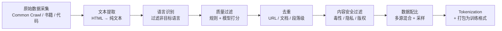

# 6.8 大模型数据工程——预训练数据的采集、清洗与多模态处理

> **一句话定位**：大模型的能力上限不取决于模型架构，而取决于**训练数据的质量**。这一节站在数据工程师（而非算法研究员）的视角，讲清楚预训练数据从"原始互联网噪音"变成"可供模型学习的高质量语料"需要经过哪些环节，以及多模态数据（图文、视频、音频）的处理有什么特殊之处。

---

## 一、为什么数据工程是大模型的核心瓶颈

后端开发者习惯的数据链路是"业务库 → 数仓 → 报表"，数据是结构化的、有 Schema 的、质量可控的。但大模型预训练面对的数据完全不同：

```
传统数仓 ETL：
  数据源：业务 MySQL、埋点日志（结构化/半结构化）
  数据量：TB 级
  质量：有 Schema 约束，字段含义明确
  目标：聚合计算、出报表

大模型数据工程：
  数据源：整个互联网（网页、书籍、代码、图片、视频、音频）
  数据量：PB 级（GPT-4 训练数据估计 13T tokens）
  质量：充斥广告、垃圾内容、色情、隐私信息、重复页面
  目标：筛选出高质量、多样化、无害的训练语料
```

业界已经形成共识：**Scaling Law 的前提是数据质量**——低质量数据堆量不如高质量数据少量。Meta 的 Llama 3 用 15T tokens 训练，但数据处理 pipeline 过滤掉了原始数据的 85% 以上。

---

## 二、文本数据处理流程——从 Common Crawl 到训练语料

文本预训练数据的处理是一条多阶段的 pipeline，每个阶段都有明确的目标。以业界最常引用的开源数据集处理方案（RedPajama、Dolma、FineWeb）为参考，标准流程如下：



### 2.1 原始数据采集

大模型训练数据的主要来源：

| 数据源 | 规模 | 特点 |
|--------|------|------|
| **Common Crawl** | 每月 ~3B 网页，累计 PB 级 | 互联网最大的公开爬取存档，是几乎所有开源 LLM 的基础数据源 |
| **书籍语料** | 数百万册 | 长文本、语法规范、知识密度高，但版权敏感 |
| **代码数据** | GitHub 公开仓库 | 提升模型的代码能力和逻辑推理能力 |
| **学术论文** | arXiv、PubMed 等 | 提升科学领域能力 |
| **维基百科** | 多语言 wiki dump | 高质量百科知识，但体量相对小（~20GB） |
| **对话数据** | Reddit、StackOverflow | 提升对话和问答能力 |

Common Crawl 是绝大多数工作的起点。它以 WARC（Web ARChive）格式存储，包含完整的 HTTP 响应头和 HTML 内容。单次爬取约 200-300TB 压缩数据。

### 2.2 文本提取——从 HTML 到纯文本

原始网页是 HTML，包含导航栏、广告、脚本、样式表等大量非正文内容。文本提取的目标是只保留"人类会阅读的正文"。

```
常用工具：
  trafilatura  —— 业界最常用的正文提取器，精度高
  jusText      —— 基于段落分类的提取（正文 vs 模板）
  Resiliparse  —— C++ 实现，速度快，FineWeb 使用
  readability  —— Mozilla 的可读性提取算法

提取后的清洗规则（典型）：
  去除 HTML 标签、JavaScript、CSS
  去除导航栏、页脚、侧边栏等模板内容
  去除 Cookie 提示、登录弹窗等非正文元素
  保留段落结构（标题、正文、列表）
  处理编码问题（UTF-8 统一）
```

### 2.3 语言识别

多语言模型需要控制各语言的配比，单语言模型需要过滤掉非目标语言。

```
常用工具：
  fastText lid（langdetect）——Meta 开源，176 种语言，速度极快
  CLD3（Compact Language Detector）——Google Chrome 的语言检测器

典型做法：
  对每个文档用 fastText 做语言识别
  置信度 < 0.65 的文档丢弃（混合语言或识别不准）
  按目标语言比例筛选（如中文 30%、英文 50%、代码 15%、其他 5%）
```

### 2.4 质量过滤——规则过滤 + 模型打分

这是整个 pipeline 中最关键的环节。质量过滤分两层：先用廉价的规则过滤掉明显的垃圾，再用模型对剩余内容打分排序。

**规则过滤（Heuristic Filters）**

```
常见的规则过滤条件（以 FineWeb / RedPajama 为参考）：

长度过滤：
  文档 < 100 字符 → 丢弃（太短，无有效信息）
  文档 > 100,000 字符 → 丢弃或截断（可能是数据库 dump）
  平均句长 < 5 词或 > 200 词 → 丢弃

重复性检查：
  文档中重复行占比 > 30% → 丢弃（SEO 垃圾、模板页面）
  文档中重复 n-gram 占比 > 20% → 丢弃
  连续重复段落 > 3 个 → 丢弃

内容质量信号：
  特殊字符占比 > 30% → 丢弃（乱码、加密文本）
  "lorem ipsum" 等占位符 → 丢弃
  全大写文本占比 > 50% → 丢弃
  停用词占比过低 → 丢弃（可能不是自然语言，而是关键词堆砌）
  标点符号密度异常 → 丢弃

URL / 域名过滤：
  已知低质量域名黑名单（广告站、内容农场）
  成人内容域名 → 丢弃
```

**模型打分（Quality Classifier）**

规则过滤后仍有大量"看起来正常但质量不高"的内容。业界的做法是训练一个二分类器区分"高质量"和"低质量"文本：

```
训练数据构造：
  正样本 = 维基百科、书籍、高质量网站（curated sources）
  负样本 = 随机采样的 Common Crawl 文本

常用模型：
  fastText 分类器（轻量，处理速度快）
  KenLM perplexity 打分（语言模型困惑度，低困惑度 = 高质量）
  BERT 小模型微调（精度更高，但成本也更高）

使用方式：
  对每个文档打分 0-1
  设定阈值（如 > 0.5 保留）
  或者按分数做加权采样（高分文档多采、低分文档少采）
```

### 2.5 去重——文档级与段落级

互联网上的内容大量重复（转载、镜像、模板页面），训练数据中的重复会导致模型"记住"某些内容而非"学会"知识，影响泛化能力。去重是预训练数据处理中计算量最大的环节之一。

| 去重级别 | 方法 | 原理 | 适用场景 |
|---------|------|------|---------|
| **URL 去重** | 精确匹配 | 同一 URL 只保留一份 | 第一步粗筛，成本最低 |
| **文档级精确去重** | SHA-256 / MD5 | 对文档全文计算 hash，hash 相同则重复 | 完全相同的文档 |
| **文档级模糊去重** | **MinHash + LSH** | 将文档转为 n-gram 集合，用 MinHash 近似 Jaccard 相似度，LSH 做快速近邻搜索 | 高度相似但不完全相同的文档（转载后小幅修改） |
| **段落级去重** | Suffix Array / n-gram 匹配 | 在段落或句子级别找重复 | 不同文档中包含相同的段落（如新闻通稿） |

**MinHash + LSH 是业界标准方案**，几乎所有主流数据集都使用。它的核心思路：

```
MinHash 去重原理（简化版）：

① 把文档拆成 n-gram 集合（如 5-gram）
   "今天天气很好" → {"今天天气很", "天天气很好"}

② 用多个哈希函数对 n-gram 集合做 MinHash 签名
   每个哈希函数取最小 hash 值，得到一个签名向量
   签名向量的相似度 ≈ 原始集合的 Jaccard 相似度

③ 用 LSH（局部敏感哈希）做快速近邻搜索
   把签名向量分成多个 band，每个 band 做 hash
   至少一个 band 的 hash 相同 → 候选重复对

④ 对候选对计算精确 Jaccard 相似度
   相似度 > 阈值（如 0.8）→ 标记为重复，保留其中一份

实现参考：
  datasketch（Python 库）—— MinHash / LSH 的标准实现
  text-dedup（BigScience）—— 专为 LLM 数据去重设计
  Spark 实现：对每个文档计算 MinHash 签名 → groupBy band hash → 组内两两比较
```

### 2.6 内容安全过滤

```
三类安全过滤：

① 毒性过滤（Toxicity）
   有害内容（仇恨言论、暴力、色情等）
   工具：Perspective API、自训练分类器
   策略：高毒性直接丢弃，中等毒性降低采样权重

② 隐私脱敏（PII Removal）
   个人身份信息（邮箱、电话、身份证号、地址）
   方法：正则匹配 + NER 模型识别 → 替换为占位符
   注意：过度脱敏会损失数据质量，需要平衡

③ 版权内容处理
   受版权保护的书籍、新闻付费内容
   策略：移除已知版权内容、使用 robots.txt 合规爬取
```

### 2.7 数据配比与课程学习

不同来源的数据对模型能力的影响不同，配比是"调配方"的过程。

```
典型的预训练数据配比（以 Llama 3 为参考）：
  网页数据      50%   ← 通用知识和语言能力
  代码数据      15%   ← 代码生成和逻辑推理
  书籍          15%   ← 长文本理解和深度知识
  学术论文       5%   ← 科学领域能力
  维基百科       5%   ← 高质量事实知识
  对话数据       5%   ← 对话和问答能力
  数学数据       5%   ← 数学推理

课程学习（Curriculum Learning）：
  训练不是一次性把所有数据混在一起喂给模型
  而是分阶段调整数据配比：
    早期：大量网页数据建立基础语言能力
    中期：增加代码和学术数据提升推理能力
    后期：增加高质量数据（书籍、wiki）做"精修"
```

---

## 三、多模态数据处理——图文、视频与音频

多模态大模型（如 GPT-4o、Gemini、Qwen-VL）需要处理文本之外的数据——图像、视频、音频。多模态数据处理的核心挑战不是单模态的处理本身，而是**跨模态的对齐**（让模型理解"这段文字描述的是这张图"）。

### 3.1 图文数据

图文数据是多模态训练中最成熟的方向。核心数据形态是**图文对（image-text pair）**——一张图配一段描述文字。

**数据来源**

| 数据集 | 规模 | 来源 | 特点 |
|--------|------|------|------|
| **LAION-5B** | 58 亿图文对 | 互联网 alt 标签 | 规模最大的开源图文数据集，但质量参差不齐 |
| **DataComp** | 12.8 亿（筛选后） | LAION 子集 | 专注数据筛选方法论，配套完整的 benchmark |
| **COYO-700M** | 7 亿 | 互联网 | 韩国 Kakao 开源 |
| **SA-1B** | 11 亿张图 + 分割标注 | Meta SAM 项目 | 侧重图像分割 |

**图文对的采集与对齐**

互联网图片通常附带 alt 标签（HTML ``），这是最廉价的图文对来源——但 alt 标签经常是"image001.jpg"、"点击查看大图"之类的无效文本。

```
图文对处理流程：

① 从网页中提取  标签和对应的 alt 文本 / 周围文本
② 图像过滤：
   尺寸过小（< 200×200）→ 丢弃
   宽高比异常（> 3:1）→ 丢弃（可能是 banner 广告）
   NSFW 检测 → 丢弃
   重复图片检测（pHash / dHash）→ 去重
③ 文本过滤：
   alt 文本 < 5 个词 → 丢弃
   alt 文本是文件名、URL 等无效文本 → 丢弃
④ 图文对齐质量评分：
   用 CLIP 模型计算图像和文本的余弦相似度
   相似度 < 0.25 → 丢弃（图文不匹配）
   按相似度分数做加权采样
```

**CLIP 打分是图文数据质量控制的核心手段**。CLIP（Contrastive Language-Image Pre-training）是 OpenAI 训练的图文对齐模型，它能把图像和文本映射到同一个向量空间——相似度越高说明图文越匹配。

**合成描述（Captioning）**

当原始 alt 标签质量不够时，可以用已有的视觉语言模型为图片生成高质量描述。

```
合成描述的常用方案：
  BLIP-2 / LLaVA / CogVLM → 生成详细的图像描述
  优点：描述质量远高于 alt 标签，且可以控制描述的风格和细粒度
  缺点：计算成本高（每张图需要一次推理）
  折中：只对 CLIP 分数处于中间地带的图文对做重新描述
```

### 3.2 视频数据

视频是"带时间轴的图文"，处理复杂度比静态图文高一个量级。

```
视频数据处理流程：

① 视频采集与元数据提取
   来源：YouTube（字幕丰富）、短视频平台、教学视频
   提取元数据：时长、分辨率、语言、标签、标题

② 帧提取（Frame Sampling）
   不是每一帧都有用——每秒 1-2 帧（fps=1~2）即可捕捉大部分视觉信息
   关键帧提取：场景切换时的帧比固定间隔采样更有效
   去重：连续相似帧只保留一帧（SSIM / pHash 相似度判断）

③ 字幕 / 语音对齐
   优先使用人工字幕（如 YouTube 的 CC 字幕）
   无字幕时用 ASR（Automatic Speech Recognition）模型转录
   常用 ASR：Whisper（OpenAI）、Paraformer（阿里）
   字幕与帧的时间戳对齐：每句话对应哪些帧

④ 视频描述生成
   用视频理解模型（如 InternVideo、VideoChat）生成视频片段的描述
   或者对关键帧做图像描述 + 字幕拼接

⑤ 质量过滤
   画质过低（分辨率 < 360p）→ 丢弃
   纯静态视频（PPT 录屏无讲解）→ 看场景决定
   内容安全检查（NSFW、暴力）
```

### 3.3 音频数据

音频数据主要服务于语音大模型（如 GPT-4o 的语音对话能力）和音频理解模型。

```
音频数据处理流程：

① 数据来源
   有声书 / 播客 / 演讲录音 / 对话数据集
   开源数据集：LibriSpeech（1000h 英文朗读）、WenetSpeech（10000h 中文）、GigaSpeech

② 音频预处理
   格式统一：转为 WAV / FLAC，16kHz 采样率、16bit
   分段：按静音段切分为 5-30 秒的片段（太长不利于训练）
   去噪：去除背景音乐、环境噪声
   音量归一化

③ 语音转文字对齐
   用 ASR 模型（Whisper）转录，得到（音频片段, 文字, 时间戳）三元组
   用 CER/WER（字符/词错误率）过滤低质量转录
   CER > 20% → 丢弃（转录质量太差）

④ 说话人识别与分离
   多人对话场景需要区分不同说话人
   工具：pyannote（说话人分割）、ECAPA-TDNN（声纹识别）

⑤ 多模态对齐
   音频 + 文字 + 时间戳打包为训练样本
   视频场景中：音频 + 视频帧 + 字幕三模态对齐
```

### 3.4 OCR 与文档理解

除了自然图像，大量知识存储在扫描文档、PDF、表格、幻灯片中。这类数据需要 OCR（光学字符识别）提取文字，并保留文档的布局结构信息。

```
文档数据处理：

① OCR 引擎
   PaddleOCR（百度）—— 中文效果好，开源免费
   Tesseract（Google）—— 老牌引擎，多语言
   EasyOCR —— 轻量，支持 80+ 语言
   商用 API —— Azure Document Intelligence、Google Cloud Vision

② 布局分析（Layout Analysis）
   不只是"提取文字"，还要理解"文字在哪个区域"
   识别标题、正文、表格、图片、页眉页脚等区域
   工具：LayoutLMv3、DocTR、PaddleStructure

③ 表格识别
   表格结构提取：行列关系、合并单元格
   转为结构化格式（Markdown 表格 / HTML / JSON）

④ 公式识别
   数学公式 OCR：转为 LaTeX 格式
   工具：Nougat（Meta）、Pix2Tex

⑤ 质量检查
   OCR 置信度过低的页面人工抽检或丢弃
   布局识别错误（正文被识别为页眉）的修正
```

---

## 四、去重技术深入——MinHash 与 SimHash

去重是预训练数据处理中计算量最大的环节（PB 级数据的两两比较），也是工程上最有挑战的部分。这里展开两种核心算法。

### 4.1 MinHash——近似 Jaccard 相似度

MinHash 的数学基础：两个集合 A、B 的 Jaccard 相似度 J(A,B) = |A∩B| / |A∪B|。MinHash 定理证明：随机哈希函数下两个集合最小哈希值相等的概率恰好等于 Jaccard 相似度。

```
MinHash 工作流程：

文档 A = "今天天气真好适合出去玩"
文档 B = "今天天气不错可以出去逛逛"

① 分词 / n-gram
   A 的 3-gram = {"今天天", "天天气", "天气真", "气真好", "真好适", ...}
   B 的 3-gram = {"今天天", "天天气", "天气不", "气不错", "不错可", ...}

② 用 k 个不同的哈希函数（如 k=128）
   对每个集合的所有 n-gram 分别计算哈希值
   每个哈希函数取最小值 → 得到长度为 k 的签名向量

   A 的签名 = [h1_min, h2_min, h3_min, ..., h128_min]
   B 的签名 = [h1_min, h2_min, h3_min, ..., h128_min]

③ 签名相似度 ≈ Jaccard 相似度
   签名中相同位置值相等的比例 = 近似 Jaccard 相似度
   k 越大，近似越准确

④ LSH 加速
   把 128 维签名分成 b 个 band（如 b=16，每个 band r=8 维）
   每个 band 内做 hash → 同一个 hash bucket 的文档是候选重复对
   只对候选对计算精确相似度
```

### 4.2 SimHash——海明距离近似

SimHash 是另一种常用的去重算法，原理不同于 MinHash。它把文档映射为一个固定长度（如 64-bit）的指纹，两个指纹的海明距离（不同 bit 数）越小说明文档越相似。

```
SimHash 工作流程：

① 分词 + 加权
   对文档分词，用 TF-IDF 给每个词一个权重
   "今天"(0.3)  "天气"(0.5)  "真好"(0.8)

② 每个词计算哈希值（如 64-bit）
   "今天" → 1010 0110 ...（64 位）
   "天气" → 0111 1001 ...（64 位）

③ 加权合并
   每一位：hash 值为 1 → 加权重，为 0 → 减权重
   所有词加权后得到 64 维的向量

④ 二值化
   向量每一位 > 0 → 1，≤ 0 → 0
   得到 64-bit 的 SimHash 指纹

⑤ 比较
   两个文档指纹的海明距离 ≤ 3 → 判定为近似重复
```

**MinHash vs SimHash 对比**

| 维度 | MinHash | SimHash |
|------|---------|---------|
| 相似度度量 | Jaccard（集合交并比） | 余弦相似度（加权特征） |
| 指纹大小 | 较大（128+ 个 hash 值） | 固定（64-bit 或 128-bit） |
| 适合场景 | 集合比较（n-gram 集合） | 加权特征比较（TF-IDF） |
| 精度 | 高（k 越大越准） | 中等（64-bit 信息有损） |
| 业界使用 | **主流方案**（Dolma、FineWeb、RedPajama 均使用） | Google 搜索引擎网页去重 |

---

## 五、工程实现——大规模数据处理的技术栈

预训练数据处理的数据量是 PB 级别，单机处理一个 Common Crawl 月度 dump 需要数月。这里的工程挑战和传统数仓 ETL 高度相似，可以直接复用 [6.4 Spark](./04-Spark.md) 中的优化经验。

### 5.1 技术栈选型

```
主流技术栈组合：

Spark + HDFS/S3（大规模批处理）
  适合：文本清洗、去重、质量过滤等 CPU 密集型任务
  优势：和现有数仓基础设施复用，团队熟悉
  场景：处理 Common Crawl、文本 pipeline 全流程

Ray / Ray Data（分布式 Python）
  适合：需要调用 GPU 模型的环节（CLIP 打分、质量分类器推理）
  优势：Python 原生，和 ML 框架（PyTorch）无缝集成
  场景：图文对齐评分、模型质量打分、Embedding 计算

Spark + Ray 混合：
  文本清洗/去重 → Spark（CPU 密集，Spark 更成熟）
  模型推理/打分 → Ray（GPU 密集，Ray 更灵活）
  数据通过 Parquet 文件在两者之间传递
```

### 5.2 数据存储格式

```
预训练数据常用的存储格式：

Parquet（Apache 列式格式）
  文本数据的默认选择
  列式存储 + 压缩 → 存储效率高
  Spark / Ray / DuckDB / Polars 都原生支持

JSONL（JSON Lines）
  每行一个 JSON 对象
  可读性好，但存储效率低
  常用于中间数据和调试

WebDataset（.tar 打包）
  图文数据的业界标准格式
  把图片 + 文本 + 元数据打包成 tar 文件
  支持流式读取，适合分布式训练
  LAION / DataComp / OpenCLIP 均使用

Arrow / IPC
  内存列式格式，零拷贝
  Hugging Face datasets 库的底层格式
  适合单机处理和数据集分发
```

### 5.3 与传统 ETL 的对比

做过数仓 ETL 的工程师转做大模型数据工程，会发现很多概念是相通的：

| 维度 | 数仓 ETL | 大模型数据工程 |
|------|---------|--------------|
| 数据源 | 业务库、日志、埋点 | 互联网、书籍、代码、图片、视频 |
| 数据格式 | 结构化（表）、半结构化（JSON） | 非结构化（文本、图片、音频） |
| 核心工具 | Hive / Spark SQL | Spark + Ray + Python 脚本 |
| 质量控制 | DQC 规则（空值率、主键重复） | 质量分类器、CLIP 打分、去重 |
| 分层思想 | ODS → DWD → DWS → ADS | Raw → Cleaned → Filtered → Deduplicated → Final |
| 调度 | Airflow / DolphinScheduler | Airflow / Prefect / 自研 |
| 存储 | HDFS + Hive 表 | HDFS/S3 + Parquet/WebDataset |
| 数据血缘 | 表级别血缘 | 数据集版本管理（Hugging Face Hub / DVC） |

> **经验法则**：如果你已经熟悉 Spark ETL，大模型数据处理的工程部分学习成本不高——核心差异在于"质量定义"从"字段级规则"变成了"内容级的模型判断"，以及多了 GPU 推理环节。

---

## 六、面试深度剖析

### 考点 1：预训练数据处理的核心流程

> **面试官**：「大模型的预训练数据是怎么准备的？」

从 Common Crawl 等原始数据出发，经过文本提取（HTML → 纯文本）、语言识别、质量过滤（规则 + 模型打分）、去重（MinHash + LSH）、内容安全过滤（毒性/隐私/版权）、数据配比，最后 Tokenize 成训练格式。每个环节都会过滤掉大量数据——Llama 3 的原始数据过滤掉了 85% 以上。

### 考点 2：为什么去重这么重要

> **面试官**：「训练数据有重复会怎样？去重用什么方法？」

数据重复会导致模型"记忆"而非"学习"，降低泛化能力，还可能导致特定文本在生成时被逐字复现（隐私和版权风险）。去重主要用 MinHash + LSH 做文档级模糊去重——把文档转为 n-gram 集合，用 MinHash 近似 Jaccard 相似度，LSH 做快速近邻搜索。相似度超过阈值（如 0.8）的文档只保留一份。这是 PB 级数据上唯一可行的方案，精确两两比较的复杂度是 O(n²)，不可行。

### 考点 3：多模态数据的核心挑战

> **面试官**：「图文多模态训练的数据怎么处理？」

核心挑战是**图文对齐**——互联网图片的 alt 标签质量很差，需要用 CLIP 模型计算图文相似度来过滤不匹配的图文对。高质量的图文对不够时，可以用视觉语言模型（BLIP-2 / LLaVA）为图片重新生成描述（合成 captioning）。图像本身也需要过滤：尺寸过小、宽高比异常、NSFW、重复图片（pHash 去重）都要处理。

### 考点 4：数据质量 vs 数据数量

> **面试官**：「训练数据是不是越多越好？」

不是。Scaling Law 的前提是数据质量。Chinchilla 论文指出存在最优的模型大小和数据量比例，盲目堆量收益递减。Llama 3 用 15T tokens 训练但过滤了 85% 原始数据，FineWeb 用更精细的过滤在更小的数据量上达到了更好的效果。业界的趋势是"数据质量 > 数据数量"——投入在数据清洗 pipeline 上的工程努力，比单纯增加数据量更有效。

### 考点 5：数据配比怎么确定

> **面试官**：「不同来源的数据怎么混合？」

没有放之四海皆准的最优配比，需要通过实验确定。通用做法是：网页数据占大头（50-60%，提供通用语言能力），代码数据 10-15%（提升逻辑推理），书籍和学术论文各 5-15%（提供深度知识）。训练过程中还可以动态调整（课程学习）：早期多用网页数据建立基础能力，后期增加高质量数据做精修。配比的评估通常用下游 benchmark（MMLU / HumanEval / GSM8K 等）的表现来衡量。

<details>
<summary><b>展开：大模型数据工程的典型面试追问</b></summary>

**Common Crawl 到底有多大？处理需要多少资源？**

Common Crawl 每月爬取约 3 亿个网页，存储为 WARC 格式约 200-300TB 压缩数据，解压后超过 PB 级。处理一个月度 dump 的完整 pipeline（提取+清洗+去重），使用 1000 核 Spark 集群大约需要 3-5 天。MinHash 去重是计算瓶颈——需要对所有文档两两比较（LSH 加速后仍然很重）。

**如何评估数据清洗 pipeline 的效果？**

两个维度：一是看过滤后的数据统计（重复率、毒性比例、质量分数分布）；二是做 ablation study——用不同阶段的数据训练小模型（如 1B 参数），对比下游 benchmark 表现。后者更可靠但成本高，业界通常在小模型上验证 pipeline 后再用于大模型训练。

**中文预训练数据和英文有什么不同？**

中文的特殊挑战：分词粒度（中文没有空格天然分词，n-gram 的粒度选择更敏感）；繁简体统一；中文互联网的内容农场问题更严重（大量低质量 SEO 内容）；高质量中文语料相对英文更稀缺（英文有维基百科、大量学术论文，中文的公开高质量语料有限）。

</details>

---

[← 6.7 数据仓库设计](./07-数据仓库设计.md) | [返回本章目录](./README.md) | [返回全书目录](../README.md)
