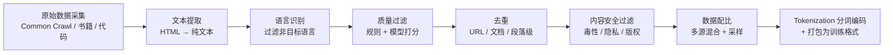

# 6.8 大模型数据工程——预训练数据的采集、清洗与多模态处理

> **一句话定位**：大模型的能力上限不取决于模型架构，而取决于**训练数据的质量**。这一节站在数据工程师（而非算法研究员）的视角，讲清楚预训练数据从"原始互联网噪音"变成"可供模型学习的高质量语料"需要经过哪些环节，以及多模态数据（图文、视频、音频）的处理有什么特殊之处。

---

## 一、为什么数据工程是大模型的核心瓶颈

后端开发者习惯的数据链路是"业务库 → 数仓 → 报表"，数据是结构化的、有 Schema 的、质量可控的。但大模型预训练面对的数据完全不同：

```
传统数仓 ETL：
  数据源：业务 MySQL、埋点日志（结构化/半结构化）
  数据量：TB 级
  质量：有 Schema 约束，字段含义明确
  目标：聚合计算、出报表

大模型数据工程：
  数据源：整个互联网（网页、书籍、代码、图片、视频、音频）
  数据量：PB 级（GPT-4 训练数据估计 13T tokens）
  质量：充斥广告、垃圾内容、色情、隐私信息、重复页面
  目标：筛选出高质量、多样化、无害的训练语料
```

业界已经形成共识：**Scaling Law（规模定律，即模型能力随参数量、数据量、计算量的增加而可预测地提升）的前提是数据质量**——低质量数据堆量不如高质量数据少量。Meta 的 Llama 3 用 15T tokens 训练，但数据处理 pipeline 过滤掉了原始数据的 85% 以上。

---

## 二、文本数据处理流程——从 Common Crawl 到训练语料

文本预训练数据的处理是一条多阶段的 pipeline，每个阶段都有明确的目标。以业界最常引用的开源数据集处理方案（RedPajama、Dolma、FineWeb）为参考，标准流程如下：



### 2.1 原始数据采集

大模型训练数据的主要来源：

| 数据源 | 规模 | 特点 |
|--------|------|------|
| **Common Crawl** | 每月 ~3B 网页，累计 PB 级 | 互联网最大的公开爬取存档，是几乎所有开源 LLM 的基础数据源 |
| **书籍语料** | 数百万册 | 长文本、语法规范、知识密度高，但版权敏感 |
| **代码数据** | GitHub 公开仓库 | 提升模型的代码能力和逻辑推理能力 |
| **学术论文** | arXiv、PubMed 等 | 提升科学领域能力 |
| **维基百科** | 多语言 wiki dump | 高质量百科知识，但体量相对小（~20GB） |
| **对话数据** | Reddit、StackOverflow | 提升对话和问答能力 |

Common Crawl 是绝大多数工作的起点。它以 WARC（Web ARChive，网页归档格式，类似一个包含完整 HTTP 请求和响应的压缩包）格式存储，包含完整的 HTTP 响应头和 HTML 内容。单次爬取约 200-300TB 压缩数据。

### 2.2 文本提取——从 HTML 到纯文本

原始网页是 HTML，包含导航栏、广告、脚本、样式表等大量非正文内容。文本提取的目标是只保留"人类会阅读的正文"。

```
常用工具：
  trafilatura  —— 业界最常用的正文提取器，精度高
  jusText      —— 基于段落分类的提取（正文 vs 模板）
  Resiliparse  —— C++ 实现，速度快，FineWeb 使用
  readability  —— Mozilla 的可读性提取算法

提取后的清洗规则（典型）：
  去除 HTML 标签、JavaScript、CSS
  去除导航栏、页脚、侧边栏等模板内容
  去除 Cookie 提示、登录弹窗等非正文元素
  保留段落结构（标题、正文、列表）
  处理编码问题（UTF-8 统一）
```

### 2.3 语言识别

多语言模型需要控制各语言的配比，单语言模型需要过滤掉非目标语言。

这里用到的核心工具是 **fastText**——Meta（原 Facebook）开源的文本分类和词向量工具库。fastText 本身是一个通用工具，能做很多事（文本分类、词向量训练、相似词查找等），但在大模型数据处理 pipeline 中主要用在两个环节：

```
fastText 在数据处理中的两个用途：

用途 1：语言识别（Language Identification）
  作用：判断一段文本是哪种语言（文档级别的分类，不是翻译也不是分词）
  模型：fastText lid.176.bin（预训练好的语言识别模型，直接下载使用）
  能力：识别 176 种语言
  输入输出示例：
    输入 "今天天气很好"        → 输出 zh（中文），置信度 0.99
    输入 "Today is a nice day" → 输出 en（英文），置信度 0.98
    输入 "今天 weather 很好"   → 输出 zh（中文），置信度 0.72（混合语言，置信度下降）
  速度：每秒处理数十万条文本——这在 PB 级数据处理中至关重要

用途 2：质量分类器（详见 2.4 节）
  作用：判断一段文本是"高质量"还是"低质量"
  模型：需要自己训练（用维基百科做正样本，Common Crawl 随机样本做负样本）
  输入输出：输入一段文本 → 输出质量分数 0-1
```

注意 fastText 在语言识别中的粒度是**文档级别**——它判断的是"这整段文字是什么语言"，不是逐词逐句识别。对于中英混杂的文本（如技术博客），它会给出一个主要语言标签但置信度较低。

```
常用工具对比：
  fastText lid —— Meta 开源，176 种语言，速度极快，业界首选
  CLD3（Compact Language Detector）—— Google Chrome 的语言检测器，速度快但语言数少

典型做法：
  对每个文档用 fastText 做语言识别
  置信度 < 0.65 的文档丢弃（混合语言或识别不准）
  按目标语言比例筛选（如中文 30%、英文 50%、代码 15%、其他 5%）
```

### 2.4 质量过滤——规则过滤 + 模型打分

这是整个 pipeline 中最关键的环节。质量过滤分两层：先用廉价的规则过滤掉明显的垃圾，再用模型对剩余内容打分排序。

**规则过滤（Heuristic Filters）**

```
常见的规则过滤条件（以 FineWeb / RedPajama 为参考）：

长度过滤：
  文档 < 100 字符 → 丢弃（太短，无有效信息）
  文档 > 100,000 字符 → 丢弃或截断（可能是数据库 dump）
  平均句长 < 5 词或 > 200 词 → 丢弃

重复性检查：
  文档中重复行占比 > 30% → 丢弃（SEO 垃圾、模板页面）
  文档中重复 n-gram 占比 > 20% → 丢弃
  连续重复段落 > 3 个 → 丢弃

内容质量信号：
  特殊字符占比 > 30% → 丢弃（乱码、加密文本）
  "lorem ipsum" 等占位符 → 丢弃
  全大写文本占比 > 50% → 丢弃
  停用词占比过低 → 丢弃（可能不是自然语言，而是关键词堆砌）
  标点符号密度异常 → 丢弃

URL / 域名过滤：
  已知低质量域名黑名单（广告站、内容农场）
  成人内容域名 → 丢弃
```

**模型打分（Quality Classifier）**

规则过滤后仍有大量"看起来正常但质量不高"的内容。业界的做法是训练一个二分类器区分"高质量"和"低质量"文本：

```
训练数据构造：
  正样本 = 维基百科、书籍、高质量网站（curated sources）
  负样本 = 随机采样的 Common Crawl 文本

常用模型：
  fastText 分类器（轻量，处理速度快）
  KenLM perplexity 打分（KenLM 是轻量级 n-gram 语言模型工具，perplexity 即困惑度，
    衡量文本在语言模型看来有多"意外"：低困惑度 = 正常语言 = 高质量）
  BERT 小模型微调（BERT 是 Google 开源的预训练语言模型，可用于各种文本分类任务；
    精度更高，但计算成本也更高）

使用方式：
  对每个文档打分 0-1
  设定阈值（如 > 0.5 保留）
  或者按分数做加权采样（高分文档多采、低分文档少采）
```

### 2.5 去重——文档级与段落级

互联网上的内容大量重复（转载、镜像、模板页面），训练数据中的重复会导致模型"记住"某些内容而非"学会"知识，影响泛化能力。去重是预训练数据处理中计算量最大的环节之一。两种核心去重算法 MinHash 和 SimHash 的详细原理见下文 [第四章：去重技术深入](#四去重技术深入minhash-与-simhash)。

| 去重级别 | 方法 | 原理 | 适用场景 |
|---------|------|------|---------|
| **URL 去重** | 精确匹配 | 同一 URL 只保留一份 | 第一步粗筛，成本最低 |
| **文档级精确去重** | SHA-256 / MD5（密码学哈希算法，为任意内容生成固定长度的"指纹"） | 对文档全文计算 hash，hash 相同则重复 | 完全相同的文档 |
| **文档级模糊去重** | **[MinHash + LSH](#四去重技术深入minhash-与-simhash)** | 将文档转为 n-gram（连续 n 个字符的子串）集合，用 MinHash 近似 Jaccard 相似度（两个集合的交集与并集之比），LSH（Locality-Sensitive Hashing，局部敏感哈希）做快速近邻搜索 | 高度相似但不完全相同的文档（转载后小幅修改） |
| **段落级去重** | Suffix Array（后缀数组，一种高效的字符串匹配数据结构）/ n-gram 匹配 | 在段落或句子级别找重复 | 不同文档中包含相同的段落（如新闻通稿） |

**MinHash + LSH 是业界标准方案**，几乎所有主流数据集都使用。它的核心思路：

```
MinHash 去重原理（简化版，详见第四节完整数值示例）：

① 把文档拆成 n-gram 集合（连续 n 个字符的滑动窗口）
  "今天天气真好"(6 字) 的 3-gram = {"今天天", "天天气", "天气真", "气真好"}  ← 4 个
  "今天天气不错"(6 字) 的 3-gram = {"今天天", "天天气", "天气不", "气不错"}  ← 4 个

② 用多个哈希函数对 n-gram 集合做 MinHash 签名
  每个哈希函数对所有 n-gram 计算哈希值，取最小值
  多个哈希函数的最小值组成签名向量
  签名向量的相似度 ≈ 原始集合的 Jaccard 相似度

③ 用 LSH（局部敏感哈希）做快速近邻搜索
  把签名向量分成多个 band，每个 band 做 hash
   至少一个 band 的 hash 相同 → 候选重复对

④ 对候选对计算精确 Jaccard 相似度
   相似度 > 阈值（如 0.8）→ 标记为重复，保留其中一份

实现参考：
  datasketch（Python 库）—— MinHash / LSH 的标准实现
  text-dedup（BigScience）—— 专为 LLM 数据去重设计
  Spark 实现：对每个文档计算 MinHash 签名 → groupBy band hash → 组内两两比较
```

### 2.6 内容安全过滤

```
三类安全过滤：

① 毒性过滤（Toxicity）
   有害内容（仇恨言论、暴力、色情等）
   工具：Perspective API（Google 开源的文本毒性检测接口）、自训练分类器
   策略：高毒性直接丢弃，中等毒性降低采样权重

② 隐私脱敏（PII Removal）
   个人身份信息（邮箱、电话、身份证号、地址）
   方法：正则匹配 + NER（Named Entity Recognition，命名实体识别，
     自动识别文本中的人名/地址/组织等实体）模型识别 → 替换为占位符
   注意：过度脱敏会损失数据质量，需要平衡

③ 版权内容处理
   受版权保护的书籍、新闻付费内容
   策略：移除已知版权内容、使用 robots.txt 合规爬取
```

### 2.7 数据配比与课程学习

不同来源的数据对模型能力的影响不同，配比是"调配方"的过程。

```
典型的预训练数据配比（以 Llama 3 为参考）：
  网页数据      50%   ← 通用知识和语言能力
  代码数据      15%   ← 代码生成和逻辑推理
  书籍          15%   ← 长文本理解和深度知识
  学术论文       5%   ← 科学领域能力
  维基百科       5%   ← 高质量事实知识
  对话数据       5%   ← 对话和问答能力
  数学数据       5%   ← 数学推理

课程学习（Curriculum Learning）：
  训练不是一次性把所有数据混在一起喂给模型
  而是分阶段调整数据配比：
    早期：大量网页数据建立基础语言能力
    中期：增加代码和学术数据提升推理能力
    后期：增加高质量数据（书籍、wiki）做"精修"
```

---

## 三、多模态数据处理——图文、视频与音频

多模态大模型（如 GPT-4o、Gemini、Qwen-VL）需要处理文本之外的数据——图像、视频、音频。多模态数据处理的核心挑战不是单模态的处理本身，而是**跨模态的对齐**（让模型理解"这段文字描述的是这张图"）。

**什么是多模态对齐？有哪些方法？**

"对齐"就是让不同模态的数据在语义空间中"对得上"——图片里是一只猫，配的文字也应该描述猫而不是狗。业界主要使用以下几种对齐方法：

```
多模态对齐方法总览：

① 对比学习（Contrastive Learning）—— 最主流
   代表：CLIP（图文）、CLAP（音文）、ImageBind（六模态）
   原理：把图像和文本分别编码为向量，拉近匹配对的距离、推远不匹配对
   训练数据：大量图文对（如 LAION-5B 的 50 亿对）
   用途：图文匹配质量评分、零样本分类、跨模态检索
   类比：就像给图片和文字各生成一个"指纹"，匹配的图文指纹应该相似

② 生成式对齐（Generative Alignment）
   代表：BLIP-2、LLaVA、Qwen-VL
   原理：用视觉编码器提取图像特征，通过一个"桥接模块"（Q-Former / 线性映射）
        把视觉特征转换为语言模型能理解的 token，再用 LLM 生成文字描述
   用途：图片描述生成（captioning）、视觉问答（VQA）、合成高质量图文对
   和对比学习的区别：对比学习是"判断匹配不匹配"，生成式是"看图说话"

③ 自监督时序对齐（Self-supervised Temporal Alignment）
   代表：VideoBERT、VideoMAE
   原理：视频天然包含多模态的时序关系（画面 + 声音 + 字幕同时发生），
        利用时间戳让同一时刻的视频帧、音频片段、字幕文本互相对齐
   用途：视频理解、视频字幕生成、音视频同步
   特点：不需要人工标注，时间戳本身就是对齐信号

④ 跨模态注意力融合（Cross-modal Attention Fusion）
   代表：Flamingo、GPT-4o
   原理：在 Transformer 的注意力层中，让文本 token 能"看到"图像 token，
        图像 token 也能"看到"文本 token，通过注意力权重自动学习对齐关系
   用途：多模态理解与生成的统一架构
   特点：对齐不是预处理步骤，而是模型训练过程中自动学会的

⑤ 人工标注对齐（Manual Annotation）
   代表：COCO Captions、Visual Genome
   原理：人工为图片写描述、标注区域和物体关系
   用途：高质量评测基准、微调数据
   特点：质量最高但成本极高，无法大规模使用，通常只用于小规模精调数据集
```

实际的大模型训练中，这些方法经常组合使用：先用对比学习（CLIP）做大规模粗过滤（丢弃图文不匹配的数据），再用生成式模型（BLIP-2）为过滤后的图片重新生成高质量描述，最后用少量人工标注数据做精调。下面按模态分别介绍具体的数据处理流程。

### 3.1 图文数据

图文数据是多模态训练中最成熟的方向。核心数据形态是**图文对（image-text pair）**——一张图配一段描述文字。

**数据来源**

| 数据集 | 规模 | 来源 | 特点 |
|--------|------|------|------|
| **LAION-5B** | 58 亿图文对 | 互联网 alt 标签 | 规模最大的开源图文数据集，但质量参差不齐 |
| **DataComp** | 12.8 亿（筛选后） | LAION 子集 | 专注数据筛选方法论，配套完整的 benchmark |
| **COYO-700M** | 7 亿 | 互联网 | 韩国 Kakao 开源 |
| **SA-1B** | 11 亿张图 + 分割标注 | Meta SAM 项目 | 侧重图像分割 |

**图文对的采集与对齐**

互联网图片通常附带 **alt 标签**——HTML 中 `` 标签的 `alt` 属性（alternate text，替代文本），原本是为了在图片无法加载时显示替代说明，也用于屏幕阅读器为视障用户朗读图片内容。例如 ``，这里的 `alt` 值就是对图片内容的文字描述。对于大模型数据工程来说，alt 标签是最廉价的图文对来源——但实际中 alt 标签经常是"image001.jpg"、"点击查看大图"之类的无效文本。

```
图文对处理流程：

① 从网页中提取  标签和对应的 alt 文本 / 周围文本
② 图像过滤：
   尺寸过小（< 200×200）→ 丢弃
   宽高比异常（> 3:1）→ 丢弃（可能是 banner 广告）
   NSFW 检测 → 丢弃
   重复图片检测（pHash / dHash，感知哈希算法，把图片压缩为一个短指纹，
     相似图片的指纹接近）→ 去重
③ 文本过滤：
   alt 文本 < 5 个词 → 丢弃
   alt 文本是文件名、URL 等无效文本 → 丢弃
④ 图文对齐质量评分：
   用 CLIP 模型计算图像和文本的余弦相似度
   相似度 < 0.25 → 丢弃（图文不匹配）
   按相似度分数做加权采样
```

**CLIP 打分是图文数据质量控制的核心手段**。CLIP（Contrastive Language-Image Pre-training）是 OpenAI 训练的图文对齐模型，它能把图像和文本映射到同一个向量空间——相似度越高说明图文越匹配。

CLIP 的使用方式有三种，按成本从低到高排列：

```
① 直接用预训练权重（Zero-shot，最常见）
   下载 OpenAI 开源的 CLIP 权重（ViT-B/32、ViT-L/14 等），直接推理打分
   适用：通用图文过滤（互联网数据清洗、LAION/DataComp 等开源数据集均使用此方式）
   优点：零成本，开箱即用
   局限：对特定领域（医学影像、遥感、工业质检）的理解能力有限

② 微调（Fine-tuning，垂直领域常用）
   在预训练权重基础上，用领域内的图文对数据继续训练
   适用：医疗（X 光 + 诊断报告）、电商（商品图 + 标题描述）、遥感等
   代表工作：BiomedCLIP（生物医学）、RemoteCLIP（遥感）
   成本：需要领域标注数据 + GPU 训练，但数据量要求不大（几万到几十万对即可）

③ 从头训练（From scratch，大规模项目）
   用自己的数据从零训练一个 CLIP 架构的模型
   适用：数据分布和互联网差异极大、且有足够数据量的场景
   代表工作：OpenCLIP（开源复现，用 LAION-2B 训练）
   成本：极高（需要数亿图文对 + 数千 GPU 小时）
```

大多数预训练数据处理 pipeline 使用方式①——直接用 OpenAI 开源的预训练权重做图文匹配打分。它在互联网通用数据上的效果已经足够好，LAION-5B、DataComp、FineWeb 等主流数据集的图文过滤都是这么做的。只有当你的数据和互联网差异很大（比如医学影像配病理报告，和 CLIP 训练时见过的"猫狗风景"完全不同）时，才需要考虑微调或从头训练。

**合成描述（Captioning）**

当原始 alt 标签质量不够时，可以用已有的视觉语言模型为图片生成高质量描述。

```
合成描述的常用方案：
  BLIP-2 / LLaVA / CogVLM → 生成详细的图像描述
  优点：描述质量远高于 alt 标签，且可以控制描述的风格和细粒度
  缺点：计算成本高（每张图需要一次推理）
  折中：只对 CLIP 分数处于中间地带的图文对做重新描述
```

### 3.2 视频数据

视频是"带时间轴的图文"，处理复杂度比静态图文高一个量级。

```
视频数据处理流程：

① 视频采集与元数据提取
   来源：YouTube（字幕丰富）、短视频平台、教学视频
   提取元数据：时长、分辨率、语言、标签、标题

② 帧提取（Frame Sampling）
   不是每一帧都有用——每秒 1-2 帧（fps=1~2）即可捕捉大部分视觉信息
   关键帧提取：场景切换时的帧比固定间隔采样更有效
   去重：连续相似帧只保留一帧（SSIM（Structural Similarity，结构相似性指标，
     衡量两张图片的视觉相似程度）/ pHash 相似度判断）

③ 字幕 / 语音对齐
   优先使用人工字幕（如 YouTube 的 CC 字幕）
   无字幕时用 ASR（Automatic Speech Recognition）模型转录
   常用 ASR：Whisper（OpenAI 开源的多语言语音识别模型，支持 99 种语言）、Paraformer（阿里达摩院开源）
   字幕与帧的时间戳对齐：每句话对应哪些帧

④ 视频描述生成
   用视频理解模型（如 InternVideo、VideoChat）生成视频片段的描述
   或者对关键帧做图像描述 + 字幕拼接

⑤ 质量过滤
   画质过低（分辨率 < 360p）→ 丢弃
   纯静态视频（PPT 录屏无讲解）→ 看场景决定
   内容安全检查（NSFW、暴力）
```

### 3.3 音频数据

音频数据主要服务于语音大模型（如 GPT-4o 的语音对话能力）和音频理解模型。

```
音频数据处理流程：

① 数据来源
   有声书 / 播客 / 演讲录音 / 对话数据集
   开源数据集：LibriSpeech（1000h 英文朗读）、WenetSpeech（10000h 中文）、GigaSpeech

② 音频预处理
   格式统一：转为 WAV / FLAC，16kHz 采样率、16bit
   分段：按静音段切分为 5-30 秒的片段（太长不利于训练）
   去噪：去除背景音乐、环境噪声
   音量归一化

③ 语音转文字对齐
   用 ASR 模型（Whisper）转录，得到（音频片段, 文字, 时间戳）三元组
   用 CER/WER（字符/词错误率）过滤低质量转录
   CER > 20% → 丢弃（转录质量太差）

④ 说话人识别与分离
   多人对话场景需要区分不同说话人
   工具：pyannote（说话人分割）、ECAPA-TDNN（声纹识别）

⑤ 多模态对齐
   音频 + 文字 + 时间戳打包为训练样本
   视频场景中：音频 + 视频帧 + 字幕三模态对齐
```

### 3.4 OCR 与文档理解

除了自然图像，大量知识存储在扫描文档、PDF、表格、幻灯片中。这类数据需要 OCR（光学字符识别）提取文字，并保留文档的布局结构信息。

```
文档数据处理：

① OCR 引擎
   PaddleOCR（百度）—— 中文效果好，开源免费
   Tesseract（Google）—— 老牌引擎，多语言
   EasyOCR —— 轻量，支持 80+ 语言
   商用 API —— Azure Document Intelligence、Google Cloud Vision

② 布局分析（Layout Analysis）
   不只是"提取文字"，还要理解"文字在哪个区域"
   识别标题、正文、表格、图片、页眉页脚等区域
   工具：LayoutLMv3、DocTR、PaddleStructure

③ 表格识别
   表格结构提取：行列关系、合并单元格
   转为结构化格式（Markdown 表格 / HTML / JSON）

④ 公式识别
   数学公式 OCR：转为 LaTeX 格式
   工具：Nougat（Meta）、Pix2Tex

⑤ 质量检查
   OCR 置信度过低的页面人工抽检或丢弃
   布局识别错误（正文被识别为页眉）的修正
```

### 3.5 案例：特斯拉 FSD 的多模态数据引擎

前面 3.1-3.4 介绍的是**通用多模态大模型**（GPT-4o、Gemini 等）的数据处理——数据来自互联网，核心挑战是图文对齐和质量过滤。但在**垂直领域的多模态大模型**中，数据处理的思路有本质不同。特斯拉的 FSD（Full Self-Driving）是一个典型案例，它揭示了"物理世界多模态数据"和"互联网多模态数据"在工程上的巨大差异。

**数据来源：自有车队而非互联网**

特斯拉全球超过 400 万辆车构成了一个巨大的数据采集网络。每辆车配备 7-8 路摄像头，持续采集视频流。FSD 累计训练里程已超 70 亿英里，车队每日贡献约 1400 万英里的真实驾驶数据——这个数据量级是任何公开数据集无法比拟的。

和互联网数据不同，特斯拉的数据是**多传感器融合**的：每个时间点不只有图像，还有 IMU（惯性测量单元，包含 3 轴加速度计测量 x/y/z 方向的加速度 + 3 轴陀螺仪测量 x/y/z 方向的角速度，共 6 自由度；部分方案还加 3 轴磁力计达到 9 自由度）、GPS、里程计、导航信息甚至音频信号，所有数据都带精确的时间戳。多路摄像头图像通过 **BEV（Bird's Eye View，鸟瞰图）变换**融合为统一的空间表征——把不同视角的 2D 图像投影到一个俯视的 3D 坐标系中，再输入后续的感知网络。这个多摄像头→BEV 融合的过程本身就是一个数据处理环节，需要精确的摄像头标定参数和时间同步。

**数据引擎（Data Engine）：闭环迭代**

特斯拉最核心的数据处理方法论不是"一次性清洗"，而是一个持续运转的**数据闭环**：

```
特斯拉数据引擎的五步闭环：

① 数据采集：车队在真实驾驶中持续回传传感器数据
② 自动标注：离线系统用全时序数据联合优化，生成高精度 4D 标注
③ 模型训练：在 Dojo 超算 + GPU 集群上训练
④ 部署验证：通过 OTA 推送到量产车队，Shadow Mode 在后台对比人类驾驶
⑤ 误差识别 & 重采：异常接管、预测偏差、突发障碍物 → 自动挑出
→ 形成增量训练数据 → 回到 ①

这个闭环和互联网大模型的"静态数据集 + RLHF"模式完全不同：
互联网大模型：收集数据 → 训练 → 人工评估 → 重新标注（周期：月）
特斯拉数据引擎：采集 → 训练 → 部署 → 自动发现问题 → 重采（周期：天）
```

**关于第③步的 Dojo 超算**：Dojo 本质上也是一个大型计算集群（可以类比为"机房"），但和通用 GPU 集群的核心区别在于芯片架构——GPU 集群使用英伟达 A100/H100 等通用 GPU，而 Dojo 使用特斯拉自研的 D1 芯片，专门为视频训练（大量连续帧的时序处理）定制。D1 芯片之间通过高带宽互联组成"训练瓦片（Training Tile）"，多个瓦片再组成 ExaPod（单个 ExaPod 算力约 1 EFLOPS）。两者的关系是**互补而非替代**：GPU 集群成熟稳定，是当前主力；Dojo 是特斯拉为降低对英伟达依赖、针对自身视频训练场景优化的长期投资，目前仍在逐步扩展中。简单类比：GPU 集群 ≈ 通用云服务器，Dojo ≈ 为特定工作负载定制的专用硬件（类似 Google 用 TPU 替代部分 GPU 训练）。

**关于第④步的 Shadow Mode 部署**：这里的"车辆"不是专门的测试车，而是**全球所有已售出的量产车**（400 万+辆）。Shadow Mode（影子模式）的工作方式是：新模型通过 OTA（Over-The-Air，空中下载）推送到量产车上，模型在后台默默运行并输出驾驶决策，但**不实际控制车辆**——方向盘仍由人类或当前稳定版 FSD 控制。系统对比新模型的预测轨迹与人类实际操作，发现偏差就记录下来。车辆也不会"重走训练路径"——每个车主每天正常通勤、出行，走的都是各自不同的真实路线。这正是特斯拉数据引擎的核心优势：400 万辆车每天在全球各地遇到的场景远比任何固定测试路线丰富得多，模型在真实世界中"被动考试"，而不是在已知的测试路径上"开卷复习"。

关于 OTA 推送和数据回传的商业与法律层面：网络方面，特斯拉车辆内置蜂窝网络模组（4G/LTE），车主购车时即包含"基础连接"（Basic Connectivity）服务，OTA 更新和安全相关的数据传输在此范围内，不额外收费；高级连接（Premium Connectivity，含实时交通、视频流等）则是付费订阅。用户同意方面，车主在购车时签署的用户协议中包含数据采集和远程更新条款，FSD Beta 测试阶段还需额外签署知情同意书；但"同意"的范围和透明度一直存在争议——Shadow Mode 级别的后台推理并不总是明确告知用户。硬件损耗方面，Shadow Mode 确实会额外消耗车载计算芯片（HW3/HW4，即 FSD Computer）的算力和产生额外热量，但特斯拉在硬件设计时已预留了 Shadow Mode 的算力余量（FSD Computer 并非满载运行），且推理负载远低于训练负载，对芯片寿命的影响在可控范围内。不过，这种"用用户硬件为公司跑模型验证"的做法在行业内确实存在伦理讨论。

其中第⑤步"误差识别"的核心机制是**主动学习（Active Learning）**——系统不是随机回传数据，而是自动识别"模型表现不好"的场景并优先回传。具体触发条件包括：驾驶员异常接管（人类突然接管方向盘说明模型决策有误）、模型预测与实际行为偏差过大（规划的轨迹和人类实际驾驶轨迹差异超过阈值）、突发障碍物或罕见场景（施工区、动物穿越、极端天气）。这些边缘场景（corner case）是模型进步的关键燃料——日常的直行和跟车场景价值很低，弯道上的施工区让道才是训练重点。

闭环中还有一个重要环节是**仿真验证**——特斯拉构建了基于神经网络的闭环仿真系统，让新版模型在虚拟环境中完成完整的驾驶过程（而非只看单帧预测），与人类驾驶真值对比评估。仿真系统还能生成现实中难以采集的极端场景（如连续急弯上的逆行车辆），为这些场景提供完美标注。

**自动标注（Auto-Labeling）：核心创新**

传统做法是人工标注（标注员画框、标点），成本高且精度受限。特斯拉从 2D 手工标注逐步升级到 **4D 自动标注**——离线标注系统不受车端算力和延迟限制，可以用多帧时序数据联合重建 3D 场景，标注精度反而高于人工。

这个思路可以类比为"用大模型生成训练小模型的标签"——本质上是用离线的高精度模型为在线的低延迟模型生成训练数据。

**时序视频替代单帧图像**

通用多模态大模型（GPT-4o 等）处理图像时通常是"一张图配一段文字"。但特斯拉的 FSD 以 **10-60 秒的视频片段**为训练单元，包含连续帧图像 + 传感器数据。Transformer 架构处理连续帧序列，使模型具备短时记忆能力——这对自动驾驶至关重要（前方车辆被遮挡后再出现，模型需要"记住"它的存在）。

**Occupancy Network：从目标检测到空间理解**

传统感知方案是"检测已知类别的物体"（行人、车辆、交通灯），但无法处理**未知障碍物**（掉落的沙发、施工路障）。Occupancy Network 将 3D 空间划分为**体素网格（Voxel Grid）**——把车辆周围的三维空间像搭乐高一样切成大量小立方体（体素 Voxel = Volume + Pixel，即"体积像素"，是像素从 2D 到 3D 的延伸），每个小立方体标注"空闲/占据/未观测"三种状态，对未知类别统一归类为 General Objects（GOs）。训练数据通过多摄像头时序数据联合 3D 重建生成。

V14 架构进一步升级为基于 Transformer 的**连续有向距离场（SDF, Signed Distance Field）**。SDF 不是一种 Transformer 架构，而是一种**空间表征方式**——对 3D 空间中的每一个点，记录它到最近物体表面的距离值：正值表示在物体外部，负值表示在物体内部，零值就是物体表面。相比体素网格的"空闲/占据"二值标注，SDF 是连续数值，能更精确地表达物体形状和边界。这里"基于 Transformer 的 SDF"是指用 Transformer 网络来预测每个空间点的 SDF 值，从而把分辨率从 ~0.3m（体素网格的一个小立方体边长 30cm）提升到 10cm。

**从模块化到端到端：架构演进与数据需求变化**

自动驾驶系统的架构设计有两种根本不同的思路，可以用后端开发者熟悉的概念来类比：

**模块化架构（Pipeline / Modular）**——类似微服务架构。把"从摄像头看到图像到控制方向盘"这个过程拆成多个独立模块，每个模块负责一个子任务，上游的输出作为下游的输入。就像后端的 数据采集服务 → 清洗服务 → 计算服务 → 推送服务，每个服务独立开发、独立测试。优点是可解释、可调试（哪个模块出错一目了然），缺点是模块间通过结构化数据（如检测框坐标）传递信息，会丢失上游感知到的丰富细节，且上游的误差会逐级放大。

**端到端架构（End-to-End / E2E）**——类似"一个大单体应用"。"端到端"中的两个"端"指的是**输入端（摄像头原始图像）和输出端（方向盘转角/油门/刹车）**，中间不再拆模块，而是用一个统一的大型神经网络直接从原始输入映射到最终输出。系统从人类驾驶行为中学习"看到这种画面应该怎么操作"，不需要人工定义中间表示。优点是信息无损传递、整体最优化，缺点是黑盒不可解释、需要海量训练数据。

特斯拉 FSD 的架构经历了三个阶段，每个阶段对训练数据的要求完全不同：

```
阶段 1 · 模块化架构（早期 Autopilot）：
感知模块 → 规划模块 → 控制模块，各自独立训练

  感知模块：识别"前方有什么"（行人检测框、车道线、交通灯状态）
  规划模块：决策"应该怎么走"（保持车道 / 变道 / 减速）
  控制模块：执行"具体操作"（方向盘转 15°、刹车力度 30%）

数据需求：每个模块单独标注（检测框、车道线、可行驶区域）
问题：模块间通过结构化数据（如"前方 30m 有行人"）传递，丢失原始图像细节；
     感知模块漏检一个行人 → 规划模块根本不知道有行人 → 误差逐级放大

阶段 2 · 端到端（FSD V12）：
摄像头视频 → 【一个统一的神经网络】→ 直接输出控制指令（转向/加速/制动）
不再拆分感知/规划/控制模块，模型自己学会"看到什么画面就做什么操作"

关于命名：为什么叫"端到端"而不叫"端到端控制"或"端到端感知"？
因为"端到端"的重点恰恰是【不区分】感知和控制——它描述的是整条链路的集成方式
而非某个子任务。如果说"端到端感知"，暗示只有感知部分是端到端的、规划和控制
还是独立模块，这与事实不符。"端到端"就是"从最初的输入端到最终的输出端，
中间没有人工定义的模块边界"，已经包含了感知+规划+控制的全部。

V12 的神经网络：
  不是大模型：参数量约数亿级（几百M），远小于 GPT-4 的万亿级
  不是多模态：只接受视频输入，没有语言/音频等其他模态
  不是 VLA：没有语言理解能力，不产生语义描述
  本质上是一个针对驾驶任务的专用卷积/Transformer 网络（类似 ResNet/ViT 量级）

数据需求：不再需要中间标注（检测框、车道线等），只需要"人类驾驶行为"作为标签
突破：训练数据量从百万级跃升到十亿级里程

阶段 3 · VLA 多模态大模型（V14，2025）：
输入 = 七路摄像头视频 + 车辆运动 + 导航 + 音频（多模态）
中间层 = 语义分割 + 占用网格 + 3D 高斯特征 + 语言推理（引入语言模态）
最终输出 = 控制动作

和阶段 2 的三个核心区别：
  ① 多模态：不再只有视频，还融合 IMU/GPS/导航/音频等多种输入
  ② 大模型：参数量从数亿级跃升到数十亿级（~10B），引入 LLM 级别的语言理解能力
  ③ VLA 框架：Vision-Language-Action，语言作为中间监督信号而非最终输出
     模型在做决策时内部生成类似"前方斑马线有行人"的语义描述
     兼顾端到端的性能和可解释性

车端部署问题：这么大的模型能在车上跑吗？
  答案是可以，但不是把训练用的完整大模型直接搬到车上，而是：
  ① 模型蒸馏（Distillation）：用大模型（教师）的输出训练一个小模型（学生），
     小模型保留大模型的关键能力但参数量缩小数倍
  ② 量化（Quantization）：把浮点权重（FP32）压缩为 INT8/INT4，
     模型体积缩小 4-8 倍，推理速度提升数倍，精度损失很小
  ③ 车载专用芯片：HW4（FSD Computer）算力约 300 TOPS（INT8），
     HW5 预计提升到 ~2000 TOPS，专门为大参数量推理设计
  绝对不会实时上传图像到云端调用大模型——网络延迟（100ms+）在时速 120 km/h
  下意味着车辆盲行 3.3 米，这对安全关键系统完全不可接受。
  所有推理都在车端本地完成，要求毫秒级响应。

数据需求：多模态对齐标注，训练数据中需要增加驾驶场景的语言描述
```

V14 引入的 **VLA（Vision-Language-Action）框架**是一个值得关注的趋势——它把语言理解能力融入自动驾驶模型，语言不是最终输出而是中间监督信号。比如模型在做出"减速让行"的决策时，中间层会生成类似"前方斑马线上有行人正在过马路"的语义描述。这种设计让模型的决策过程更可解释，也便于安全审查。从数据工程的角度看，这意味着训练数据中需要增加**驾驶场景的语言描述标注**——又一次印证了"多模态对齐"是数据处理的核心挑战。

**与通用多模态大模型的对比**

| 维度 | 通用多模态大模型（GPT-4o 等） | 特斯拉 FSD |
|------|---------------------------|-----------|
| 数据来源 | 互联网公开数据 | 自有车队物理世界采集 |
| 核心模态 | 文本 + 图像 + 音频 | 视频 + 传感器（IMU/GPS）+ 导航 |
| 标注方式 | 人工标注 + RLHF | 4D 自动标注（离线高精度模型生成） |
| 数据迭代 | 静态数据集，月级更新 | 数据闭环，天级迭代 |
| 时序要求 | 弱（单帧理解为主） | 强（连续帧 + 短时记忆） |
| 3D 理解 | 以 2D 语义为主 | Occupancy Network / 3D 重建 |
| 质量控制 | CLIP 打分 + 规则过滤 | 主动学习 + Shadow Mode 自动挖掘边缘场景 |
| 空间融合 | 以 2D 为主 | BEV 多摄像头融合 → 3D 统一坐标系 |
| 架构模式 | 单一大模型 | 端到端演进（模块化→E2E→VLA 多模态） |
| 仿真验证 | 人工评测 + Benchmark | 神经网络闭环仿真 + 极端场景生成 |
| 延迟约束 | 无严格限制 | 毫秒级实时推理 |
| 安全要求 | 容错性较高 | 安全关键，零容忍 |

> **对数据工程师的启示**：特斯拉的案例说明，垂直领域的多模态数据处理和通用大模型有两个根本差异。第一是**数据闭环**——不是"收集一次数据训练一次"，而是"部署后持续从失败案例中学习"，这对数据 pipeline 的实时性和自动化程度要求极高。第二是**自动标注**——当标注成本成为瓶颈时，用高精度离线模型生成标签是可行的方案，本质上和通用大模型领域用 GPT-4 生成训练数据（蒸馏）是同一个思路。

---

## 四、去重技术——MinHash 与 SimHash

去重是预训练数据处理中计算量最大的环节（PB 级数据的两两比较），也是工程上最有挑战的部分。核心使用两种算法：**MinHash + LSH**（业界主流，Dolma / FineWeb / RedPajama 均使用）和 **SimHash**（Google 搜索引擎网页去重）。

这两种算法本质上是通用的概率数据结构，和布隆过滤器属于同一类"用概率换性能"的思想，广泛应用于搜索引擎去重、爬虫去重、抄袭检测等场景，并非大模型专属。因此它们的完整原理（n-gram 拆分、哈希签名数值示例、LSH 加速、SimHash 工作流程、两者对比）已整理到通用数据结构附录中：

> **→ 详见 [附录 A1 · 第八节：MinHash 与 SimHash](../part3-java-deep/A1-核心数据结构原理.md#八minhash-与-simhash文档去重的概率算法)**

本节 2.5 中的去重流程描述了它们在大模型预训练数据处理中的具体使用方式（精确去重 + MinHash 近似去重 + URL/段落级去重的三层策略）。

---

## 五、工程实现——大规模数据处理的技术栈

预训练数据处理的数据量是 PB 级别，单机处理一个 Common Crawl 月度 dump 需要数月。这里的工程挑战和传统数仓 ETL 高度相似，可以直接复用 [6.4 Spark](./04-Spark.md) 中的优化经验。

### 5.1 技术栈选型

```
主流技术栈组合：

Spark + HDFS/S3（大规模批处理）
  适合：文本清洗、去重、质量过滤等 CPU 密集型任务
  优势：和现有数仓基础设施复用，团队熟悉
  场景：处理 Common Crawl、文本 pipeline 全流程

Ray / Ray Data（分布式 Python）
  适合：需要调用 GPU 模型的环节（CLIP 打分、质量分类器推理）
  优势：Python 原生，和 ML 框架（PyTorch）无缝集成
  场景：图文对齐评分、模型质量打分、Embedding 计算

Spark + Ray 混合：
  文本清洗/去重 → Spark（CPU 密集，Spark 更成熟）
  模型推理/打分 → Ray（GPU 密集，Ray 更灵活）
  数据通过 Parquet 文件在两者之间传递
```

### 5.2 数据存储格式

```
预训练数据常用的存储格式：

Parquet（Apache 列式格式）
  文本数据的默认选择
  列式存储 + 压缩 → 存储效率高
  Spark / Ray / DuckDB / Polars 都原生支持

JSONL（JSON Lines）
  每行一个 JSON 对象
  可读性好，但存储效率低
  常用于中间数据和调试

WebDataset（.tar 打包）
  图文数据的业界标准格式
  把图片 + 文本 + 元数据打包成 tar 文件
  支持流式读取，适合分布式训练
  LAION / DataComp / OpenCLIP 均使用

Arrow / IPC
  内存列式格式，零拷贝
  Hugging Face datasets 库的底层格式
  适合单机处理和数据集分发
```

### 5.3 与传统 ETL 的对比

做过数仓 ETL 的工程师转做大模型数据工程，会发现很多概念是相通的：

| 维度 | 数仓 ETL | 大模型数据工程 |
|------|---------|--------------|
| 数据源 | 业务库、日志、埋点 | 互联网、书籍、代码、图片、视频 |
| 数据格式 | 结构化（表）、半结构化（JSON） | 非结构化（文本、图片、音频） |
| 核心工具 | Hive / Spark SQL | Spark + Ray + Python 脚本 |
| 质量控制 | DQC 规则（空值率、主键重复） | 质量分类器、CLIP 打分、去重 |
| 分层思想 | ODS → DWD → DWS → ADS | Raw → Cleaned → Filtered → Deduplicated → Final |
| 调度 | Airflow / DolphinScheduler | Airflow / Prefect / 自研 |
| 存储 | HDFS + Hive 表 | HDFS/S3 + Parquet/WebDataset |
| 数据血缘 | 表级别血缘 | 数据集版本管理（Hugging Face Hub / DVC） |

> **经验法则**：如果你已经熟悉 Spark ETL，大模型数据处理的工程部分学习成本不高——核心差异在于"质量定义"从"字段级规则"变成了"内容级的模型判断"，以及多了 GPU 推理环节。

---

## 六、面试深度剖析

### 考点 1：预训练数据处理的核心流程

> **面试官**：「大模型的预训练数据是怎么准备的？」

从 Common Crawl 等原始数据出发，经过文本提取（HTML → 纯文本）、语言识别、质量过滤（规则 + 模型打分）、去重（MinHash + LSH）、内容安全过滤（毒性/隐私/版权）、数据配比，最后 Tokenize 成训练格式。每个环节都会过滤掉大量数据——Llama 3 的原始数据过滤掉了 85% 以上。

### 考点 2：为什么去重这么重要

> **面试官**：「训练数据有重复会怎样？去重用什么方法？」

数据重复会导致模型"记忆"而非"学习"，降低泛化能力，还可能导致特定文本在生成时被逐字复现（隐私和版权风险）。去重主要用 MinHash + LSH 做文档级模糊去重——把文档转为 n-gram 集合，用 MinHash 近似 Jaccard 相似度，LSH 做快速近邻搜索。相似度超过阈值（如 0.8）的文档只保留一份。这是 PB 级数据上唯一可行的方案，精确两两比较的复杂度是 O(n²)，不可行。

### 考点 3：多模态数据的核心挑战

> **面试官**：「图文多模态训练的数据怎么处理？」

核心挑战是**图文对齐**——互联网图片的 alt 标签质量很差，需要用 CLIP 模型计算图文相似度来过滤不匹配的图文对。高质量的图文对不够时，可以用视觉语言模型（BLIP-2 / LLaVA）为图片重新生成描述（合成 captioning）。图像本身也需要过滤：尺寸过小、宽高比异常、NSFW、重复图片（pHash 去重）都要处理。

### 考点 4：数据质量 vs 数据数量

> **面试官**：「训练数据是不是越多越好？」

不是。Scaling Law 的前提是数据质量。Chinchilla 论文指出存在最优的模型大小和数据量比例，盲目堆量收益递减。Llama 3 用 15T tokens 训练但过滤了 85% 原始数据，FineWeb 用更精细的过滤在更小的数据量上达到了更好的效果。业界的趋势是"数据质量 > 数据数量"——投入在数据清洗 pipeline 上的工程努力，比单纯增加数据量更有效。

### 考点 5：数据配比怎么确定

> **面试官**：「不同来源的数据怎么混合？」

没有放之四海皆准的最优配比，需要通过实验确定。通用做法是：网页数据占大头（50-60%，提供通用语言能力），代码数据 10-15%（提升逻辑推理），书籍和学术论文各 5-15%（提供深度知识）。训练过程中还可以动态调整（课程学习）：早期多用网页数据建立基础能力，后期增加高质量数据做精修。配比的评估通常用下游 benchmark（MMLU / HumanEval / GSM8K 等）的表现来衡量。

<details>
<summary><b>展开：大模型数据工程的典型面试追问</b></summary>

**Common Crawl 到底有多大？处理需要多少资源？**

Common Crawl 每月爬取约 3 亿个网页，存储为 WARC 格式约 200-300TB 压缩数据，解压后超过 PB 级。处理一个月度 dump 的完整 pipeline（提取+清洗+去重），使用 1000 核 Spark 集群大约需要 3-5 天。MinHash 去重是计算瓶颈——需要对所有文档两两比较（LSH 加速后仍然很重）。

**如何评估数据清洗 pipeline 的效果？**

两个维度：一是看过滤后的数据统计（重复率、毒性比例、质量分数分布）；二是做 ablation study——用不同阶段的数据训练小模型（如 1B 参数），对比下游 benchmark 表现。后者更可靠但成本高，业界通常在小模型上验证 pipeline 后再用于大模型训练。

**中文预训练数据和英文有什么不同？**

中文的特殊挑战：分词粒度（中文没有空格天然分词，n-gram 的粒度选择更敏感）；繁简体统一；中文互联网的内容农场问题更严重（大量低质量 SEO 内容）；高质量中文语料相对英文更稀缺（英文有维基百科、大量学术论文，中文的公开高质量语料有限）。

</details>

---

[← 6.7 数据仓库设计](./07-数据仓库设计.md) | [返回本章目录](./README.md) | [返回全书目录](../README.md)
