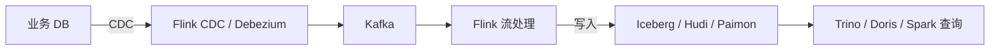

# 6.9 湖仓一体（LakeHouse）

> **一句话定位**：湖仓一体是数据仓库（结构化、强 Schema、ACID）和数据湖（低成本、半/非结构化、Schema-on-Read）的融合架构——在廉价对象存储上，用开放表格式实现仓级别的事务、Schema 管理和查询性能。

---

## 一、架构演进：从数仓到湖仓

### 1.1 三代架构对比

| 代际 | 架构 | 存储 | 优势 | 痛点 |
|------|------|------|------|------|
| 第一代 | **数据仓库** | 专有存储（Teradata/Greenplum） | 强 Schema、ACID、高性能 SQL | 贵、封闭、扩展难、不支持非结构化 |
| 第二代 | **数据湖** | HDFS / S3 / OSS | 便宜、开放、支持任意格式 | 无事务、无 Schema 演进、数据沼泽 |
| 第三代 | **湖仓一体** | 对象存储 + 开放表格式 | 兼具两者优势 | 生态仍在快速演进 |

### 1.2 湖仓一体的核心思想

```
┌─────────────────────────────────────────────────────┐
│                   统一访问层                          │
│   Spark SQL / Flink / Trino / Doris / Presto        │
├─────────────────────────────────────────────────────┤
│                 开放表格式层                          │
│   Iceberg / Hudi / Paimon（ACID + Schema + 元数据）  │
├─────────────────────────────────────────────────────┤
│                 统一 Catalog                          │
│   Hive Metastore / Nessie / Unity / Gravitino       │
├─────────────────────────────────────────────────────┤
│                 廉价存储层                            │
│   S3 / HDFS / OSS / MinIO（Parquet / ORC 文件）     │
└─────────────────────────────────────────────────────┘
```

**关键特征**：
1. **ACID 事务** — 并发读写不冲突，支持 UPDATE/DELETE/MERGE
2. **Schema Evolution** — 加列、改类型、重命名不需要重写数据
3. **Time Travel** — 按快照回溯历史版本，支持审计和回滚
4. **Partition Evolution** — 分区策略可以在线变更，无需重写
5. **开放格式** — 不绑定特定引擎，任何引擎都能读写

---

## 二、三大开放表格式对比

### 2.1 Apache Iceberg

**背景**：Netflix 开源（2018），Apache 顶级项目。设计哲学是「正确性优先」。

**核心架构**：
```
Catalog（表注册）
  └── Metadata File（JSON，指向当前 Snapshot）
        └── Snapshot（指向 Manifest List）
              └── Manifest List（指向多个 Manifest File）
                    └── Manifest File（记录数据文件列表 + 统计信息）
                          └── Data Files（Parquet/ORC/Avro）
```

**核心特性**：
| 特性 | 说明 |
|------|------|
| **快照隔离** | 每次写入生成新 Snapshot，读写互不阻塞（MVCC） |
| **Hidden Partitioning** | 分区对用户透明，SQL 不需要写分区列过滤 |
| **Partition Evolution** | 分区策略可在线变更（如从按天→按小时），历史数据不动 |
| **Schema Evolution** | 基于列 ID（非列名），加列/删列/重命名/改类型安全 |
| **Time Travel** | `SELECT * FROM t VERSION AS OF snapshot_id` |
| **Data Skipping** | Manifest 中存 min/max 统计，查询时跳过无关文件 |
| **Sort Order** | 表级排序定义，写入时自动排序，加速范围查询 |

**适用场景**：大规模批处理、数仓替代、需要强一致性的分析场景。

### 2.2 Apache Hudi

**背景**：Uber 开源（2016），Apache 顶级项目。设计哲学是「增量处理优先」。

**两种表类型**：
| 类型 | 写入方式 | 读取方式 | 适用场景 |
|------|---------|---------|---------|
| **Copy-on-Write (CoW)** | 写入时合并，生成新 Parquet | 直接读 Parquet，查询快 | 读多写少 |
| **Merge-on-Read (MoR)** | 写入 Avro 日志，后台异步合并 | 读时合并（或读已合并部分） | 写多读少、近实时 |

**核心特性**：
- **Upsert 原生支持** — 基于主键的增量更新，天然适合 CDC
- **增量查询** — 只读取上次之后的变更（增量 ETL 的基础）
- **Compaction** — MoR 表的后台合并，平衡写入延迟和查询性能
- **Timeline** — 所有操作记录在时间线上，支持回滚和审计
- **多索引** — Bloom Filter Index / HBase Index / Bucket Index 加速 Upsert

**适用场景**：CDC 入湖、近实时数仓、增量 ETL 管道。

### 2.3 Apache Paimon

**背景**：原名 Flink Table Store，2023 年进入 Apache 孵化。设计哲学是「流批一体原生」。

**核心架构**：[LSM-Tree](../part3-java-deep/A1-核心数据结构原理.md#十一lsm-tree-与-sst-文件写优化存储引擎的通用原理) + 湖存储
```
写入 → Sorted Run（Level 0）→ Compaction → Level 1/2/...（Parquet）
```

**核心特性**：
| 特性 | 说明 |
|------|------|
| **流批一体原生** | Flink 流式写入 + 批式读取，无需额外 Compaction 作业 |
| **Changelog 生产** | 自动生成变更日志，下游可增量消费（类似 Kafka） |
| **Partial Update** | 支持部分列更新，适合宽表场景 |
| **主键表 + 仅追加表** | 主键表自动去重合并，仅追加表高吞吐 |
| **Tag 管理** | 类似 Git Tag，标记快照用于批读 |
| **Lookup Join** | 流处理中高效维表关联 |

**适用场景**：Flink 实时入湖、流批一体、实时数仓。

### 2.4 三者横向对比

| 维度 | Iceberg | Hudi | Paimon |
|------|---------|------|--------|
| **设计出发点** | 正确性、大规模批处理 | 增量处理、CDC | 流批一体、Flink 原生 |
| **ACID** | ✅ Snapshot 隔离 | ✅ MVCC | ✅ LSM + Snapshot |
| **Upsert 性能** | 一般（需 Merge-on-Read） | ⭐ 原生优化 | ⭐ LSM 天然支持 |
| **流式写入** | 支持（Flink Sink） | 支持 | ⭐ 原生最优 |
| **Schema Evolution** | ⭐ 最完善（列 ID） | 支持 | 支持 |
| **Partition Evolution** | ⭐ 独有 | 不支持 | 不支持 |
| **Time Travel** | ✅ | ✅ | ✅（Tag） |
| **引擎兼容性** | ⭐ 最广（Spark/Flink/Trino/Doris/...） | 广（Spark/Flink/Presto/Hive） | Flink 最优，Spark/Trino 在追赶 |
| **社区活跃度** | ⭐ 最高 | 高 | 快速增长 |
| **生产成熟度** | ⭐ 最成熟 | 成熟 | 较新，快速迭代 |

**选型建议**：
- **通用湖仓底座** → Iceberg（生态最广、Schema/Partition Evolution 最强）
- **CDC 入湖、增量 ETL** → Hudi（Upsert 原生优化）
- **Flink 实时数仓** → Paimon（流批一体原生、Changelog 生产）

---

## 三、统一 Catalog

### 3.1 为什么需要统一 Catalog

在湖仓架构中，多个引擎（Spark、Flink、Trino、Doris）需要访问同一张表。Catalog 是「表在哪里、长什么样」的注册中心——如果每个引擎各自维护一份元数据，就会出现不一致。

### 3.2 主流 Catalog 方案

| Catalog | 定位 | 特点 |
|---------|------|------|
| **Hive Metastore (HMS)** | 传统标准 | 最广泛兼容，但设计老旧、无版本控制、扩展性差 |
| **Nessie** | Git-like Catalog | 支持分支/合并/回滚，适合数据工程的 CI/CD |
| **Unity Catalog** | Databricks 开源 | 统一管理表/模型/函数/权限，与 Delta Lake 深度集成 |
| **Gravitino** | Apache 孵化 | 多 Catalog 联邦，统一管理 Hive/Iceberg/Kafka/模型等异构元数据 |
| **Polaris** | Snowflake 开源 | Iceberg REST Catalog 实现，跨引擎互操作 |

### 3.3 Iceberg REST Catalog 协议

Iceberg 社区定义了 REST Catalog 标准接口，任何引擎只要实现这个 HTTP API 就能互操作：

```
GET    /v1/namespaces/{ns}/tables/{table}    → 获取表元数据位置
POST   /v1/namespaces/{ns}/tables            → 创建表
POST   /v1/namespaces/{ns}/tables/{table}    → 提交新 Snapshot（原子）
```

这是湖仓生态走向「引擎解耦」的关键标准。

---

## 四、实时入湖

### 4.1 典型架构



### 4.2 三种入湖方案对比

| 方案 | 链路 | 延迟 | 复杂度 | 适用场景 |
|------|------|------|--------|---------|
| **Flink + Iceberg** | Flink Sink → Iceberg | 分钟级（Checkpoint 间隔） | 中 | 通用湖仓，对延迟要求不极端 |
| **Flink + Hudi** | Flink Sink → Hudi MoR | 分钟级 | 中高（需管理 Compaction） | CDC 场景、需要增量查询 |
| **Flink + Paimon** | Flink Sink → Paimon | 秒~分钟级 | 低（原生集成） | Flink 实时数仓、流批一体 |

### 4.3 关键设计考量

1. **Checkpoint 间隔** — 决定数据可见延迟（通常 1-5 分钟）
2. **小文件问题** — 高频写入产生大量小文件，需要 Compaction 策略
3. **Exactly-Once** — Flink Checkpoint + 两阶段提交保证端到端一致
4. **Schema 变更传播** — 上游 DDL 变更如何自动同步到湖表
5. **乱序数据处理** — Late data 如何处理（覆盖 vs 丢弃 vs 侧输出）

---

## 五、批流一体计算

### 5.1 什么是批流一体

传统架构中，批处理（T+1 离线）和流处理（实时）是两套独立系统（Lambda 架构）。批流一体的目标是**用同一套代码、同一套引擎、同一份存储**同时支持批和流。

### 5.2 Lambda vs Kappa vs 湖仓批流一体

| 架构 | 批处理 | 流处理 | 存储 | 问题 |
|------|--------|--------|------|------|
| **Lambda** | Spark/Hive | Flink/Storm | 分开（HDFS + Kafka） | 两套代码、数据不一致 |
| **Kappa** | 无 | Flink（全量重放 Kafka） | Kafka | Kafka 存储成本高、历史回溯慢 |
| **湖仓批流一体** | Spark/Flink Batch | Flink Streaming | 统一湖表 | ⭐ 一份数据、一套代码 |

### 5.3 Paimon 的批流一体实现

```sql
-- 流式写入（Flink Streaming）
INSERT INTO paimon_table SELECT * FROM kafka_source;

-- 批式读取（Spark/Flink Batch）
SELECT * FROM paimon_table WHERE dt = '2024-01-01';

-- 增量读取（Flink Streaming，从某个 Snapshot 开始）
SELECT * FROM paimon_table /*+ OPTIONS('scan.mode'='from-snapshot', 'scan.snapshot-id'='10') */;
```

Paimon 的 Changelog 机制让下游可以像消费 Kafka 一样消费湖表的变更流——实现了「湖表即消息队列」。

---

## 六、湖上查询加速

### 6.1 Data Skipping

利用文件级别的统计信息（min/max/null count/distinct count）跳过不相关的数据文件：

```
查询: WHERE city = 'Beijing' AND dt = '2024-01-01'
→ 读取 Manifest 中每个文件的 city 列 min/max
→ 跳过 city 范围不包含 'Beijing' 的文件
→ 实际只读取 5% 的数据
```

### 6.2 Z-Order / Hilbert 排序

多维数据的空间填充曲线排序，让多个列的相关数据物理上聚集在一起：

```sql
-- Iceberg: 按 city 和 dt 做 Z-Order 排序
ALTER TABLE t WRITE ORDERED BY zorder(city, dt);
```

**效果**：单列排序只能加速该列的过滤；Z-Order 可以同时加速多列过滤的 Data Skipping。

### 6.3 物化视图 / 预计算

- **Doris/StarRocks** 的物化视图可以直接建在湖表之上
- **Iceberg** 支持 Manifest 缓存，避免每次查询都扫描元数据
- **Paimon** 的 Aggregation Table 可以在写入时预聚合

### 6.4 缓存策略

| 层级 | 方案 | 说明 |
|------|------|------|
| 元数据缓存 | Catalog Cache | 避免每次查询都访问 Catalog |
| 文件列表缓存 | Manifest Cache | Iceberg 的 Manifest 文件缓存 |
| 数据缓存 | Alluxio / 本地 SSD | 热数据缓存到计算节点本地 |
| 结果缓存 | Query Result Cache | 相同查询直接返回缓存结果 |

---

## 七、生产实践要点

### 7.1 小文件治理

| 策略 | 说明 |
|------|------|
| **Compaction** | 定期合并小文件为大文件（Iceberg: `rewrite_data_files`） |
| **写入攒批** | 增大 Checkpoint 间隔或 Sink 的 batch size |
| **分区粒度** | 避免过细分区（按小时 vs 按分钟） |
| **自动 Compaction** | Paimon 内置、Hudi 内置、Iceberg 需外部触发 |

### 7.2 表维护操作

```sql
-- Iceberg: 过期快照清理（释放存储）
CALL system.expire_snapshots('db.table', TIMESTAMP '2024-01-01 00:00:00');

-- Iceberg: 合并小文件
CALL system.rewrite_data_files('db.table');

-- Iceberg: 删除孤立文件
CALL system.remove_orphan_files('db.table');
```

### 7.3 权限与安全

- **Ranger + Iceberg** — 行级/列级权限过滤
- **Catalog 级别 ACL** — 控制谁能访问哪些表
- **加密** — 列级加密（Parquet 原生支持）
- **审计** — 通过 Catalog 操作日志追踪所有 DDL/DML

---

## 八、面试深度剖析

### Q1: 为什么需要湖仓一体？传统数仓和数据湖各有什么问题？

**答**：数仓贵且封闭，不支持非结构化数据；数据湖便宜但无事务、无 Schema 管理，容易变成「数据沼泽」。湖仓一体在廉价存储上加了表格式层，兼得两者优势。

### Q2: Iceberg 的 Snapshot 隔离是怎么实现的？

**答**：每次写入生成新 Snapshot（指向新的 Manifest List），读取时绑定某个 Snapshot。写入通过 CAS（Compare-And-Swap）原子更新 Metadata File 中的 current-snapshot-id。读写互不阻塞，类似数据库的 MVCC。

### Q3: Hudi 的 CoW 和 MoR 怎么选？

**答**：读多写少选 CoW（查询无额外开销）；写多读少或需要低延迟写入选 MoR（写入快，但查询需要合并日志）。生产中通常 ODS 层用 MoR（CDC 高频写入），DWS/ADS 层用 CoW（查询性能优先）。

### Q4: 实时入湖的小文件问题怎么解决？

**答**：① 增大 Checkpoint 间隔攒批；② 后台 Compaction 定期合并；③ 合理设置分区粒度；④ Paimon 的 LSM 结构天然缓解（Level 0 小文件会被 Compaction 到更大的 Level）。

### Q5: Paimon 和 Iceberg 的核心区别是什么？

**答**：Iceberg 是「湖上加事务」的思路，底层仍是 Parquet 文件 + Manifest 元数据；Paimon 是「[LSM-Tree](../part3-java-deep/A1-核心数据结构原理.md#十一lsm-tree-与-sst-文件写优化存储引擎的通用原理) 搬到湖上」的思路，天然支持高频 Upsert 和 Changelog 生产。Iceberg 生态更广、更成熟；Paimon 在 Flink 实时场景下性能更优。

---

## 九、与本书其他章节的关联

| 关联章节 | 关系 |
|---------|------|
| [6.3 Hive](./03-Hive.md) | Hive Metastore 是最传统的 Catalog，湖仓 Catalog 是其演进 |
| [6.5 Flink](./05-Flink.md) | Flink 是实时入湖的核心引擎，Checkpoint 机制保证 Exactly-Once |
| [6.7 数据仓库设计](./07-数据仓库设计.md) | 湖仓一体不改变分层建模思想，只改变底层存储和事务能力 |
| [6.12 Presto 查询引擎](./12-Presto查询引擎.md) | Presto/Trino 是湖上查询的主力引擎之一 |
| [3.10 分布式理论](../part3-java-deep/10-分布式理论与一致性.md) | Snapshot 隔离、CAS 原子提交背后的一致性理论 |

---

[← 6.8 大模型数据工程](./08-大模型数据工程.md) | [返回本章目录](./README.md) | [6.10 语义层与指标平台 →](./10-语义层与指标平台.md)
