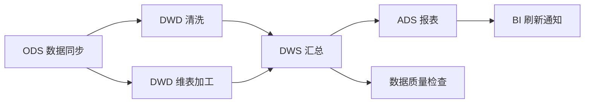

# 6.13 任务调度

> **一句话定位**：任务调度系统是大数据平台的「中枢神经」——它负责按照依赖关系、时间规则和优先级，自动编排和执行数据处理任务（ETL、数据同步、报表刷新、模型训练等），并在失败时自动重试和告警。

---

## 一、为什么需要任务调度

### 1.1 没有调度系统的痛点

```
场景：每天凌晨需要跑 200+ 个数据任务
  → 任务之间有依赖（DWD 表依赖 ODS 表，DWS 依赖 DWD）
  → 有些任务失败了需要重跑
  → 有些任务跑太久需要告警
  → 资源有限，不能所有任务同时跑

没有调度系统：
  ❌ 用 crontab → 无法管理依赖关系
  ❌ 手动触发 → 凌晨谁来盯？
  ❌ 脚本串联 → 一个失败全链路卡住
  ❌ 无法追溯 → 昨天的任务到底跑没跑？
```

### 1.2 调度系统解决什么

| 能力 | 说明 |
|------|------|
| **DAG 依赖管理** | 定义任务之间的上下游关系，自动按拓扑序执行 |
| **定时触发** | Cron 表达式、事件触发、手动触发 |
| **失败重试** | 自动重试 N 次，超过阈值告警 |
| **资源管理** | 队列/优先级/并发控制，避免资源争抢 |
| **可观测性** | 任务状态、耗时、日志、历史记录一目了然 |
| **回填（Backfill）** | 补跑历史某天的数据 |

---

## 二、核心概念

### 2.1 DAG（有向无环图）

调度系统的核心抽象——任务之间的依赖关系用 DAG 表示：



### 2.2 关键术语

| 术语 | 定义 | 类比 |
|------|------|------|
| **DAG** | 一组有依赖关系的任务集合 | 一条流水线 |
| **Task / Node** | DAG 中的一个执行单元 | 流水线上的一个工位 |
| **Instance / Run** | 某次具体的执行实例 | 今天这一班的执行记录 |
| **Schedule** | 触发规则（Cron / 事件 / 手动） | 什么时候开工 |
| **Dependency** | 任务间的前后关系 | 上一道工序完成才能开始下一道 |
| **Backfill** | 补跑历史数据 | 补做昨天漏掉的活 |
| **SLA** | 任务必须在某时间前完成 | 交付截止时间 |
| **Worker** | 实际执行任务的进程/容器 | 干活的工人 |

---

## 三、主流调度系统对比

### 3.1 Apache Airflow

**背景**：Airbnb 开源（2014），Python 生态，全球最流行的调度系统。

**架构**：
```
┌──────────────┐     ┌──────────────┐     ┌──────────────┐
│  Web Server  │     │  Scheduler   │     │   Worker     │
│  (UI + API)  │     │ (调度决策)    │     │ (执行任务)    │
└──────┬───────┘     └──────┬───────┘     └──────┬───────┘
       │                    │                    │
       └────────────────────┼────────────────────┘
                            │
                    ┌───────▼───────┐
                    │   Metadata DB  │
                    │  (PostgreSQL)  │
                    └───────────────┘
```

**核心特点**：
- **DAG as Code** — 用 Python 代码定义 DAG（灵活但门槛高）
- **丰富的 Operator** — 内置 Spark/Hive/K8s/HTTP/SQL 等 Operator
- **XCom** — 任务间传递小数据
- **Pool / Priority** — 资源池和优先级控制
- **Plugin 机制** — 可扩展 Operator、Hook、Sensor

```python
# Airflow DAG 示例
from airflow import DAG
from airflow.operators.bash import BashOperator
from datetime import datetime

with DAG('daily_etl', schedule='0 2 * * *', start_date=datetime(2024,1,1)) as dag:
    extract = BashOperator(task_id='extract', bash_command='python extract.py')
    transform = BashOperator(task_id='transform', bash_command='spark-submit transform.py')
    load = BashOperator(task_id='load', bash_command='python load.py')
    
    extract >> transform >> load  # 定义依赖
```

**优势**：生态最丰富、社区最大、Python 原生、云厂商托管版（MWAA/Cloud Composer）。
**劣势**：Scheduler 单点（需 HA 配置）、大规模 DAG 性能下降、不支持实时调度。

### 3.2 Apache DolphinScheduler

**背景**：易观开源（2019），Apache 顶级项目，国内最流行。

**架构**：
```
┌──────────────┐     ┌──────────────┐     ┌──────────────┐
│   API Server │     │ Master Server│     │ Worker Server │
│  (UI + API)  │     │ (调度+分发)   │     │ (执行任务)    │
└──────────────┘     └──────────────┘     └──────────────┘
        │                    │                    │
        └────────────────────┼────────────────────┘
                             │
              ┌──────────────┼──────────────┐
              │              │              │
        ┌─────▼─────┐ ┌─────▼─────┐ ┌─────▼─────┐
        │ MySQL/PG  │ │ ZooKeeper │ │  Registry │
        └───────────┘ └───────────┘ └───────────┘
```

**核心特点**：
- **可视化拖拽** — Web UI 拖拽定义 DAG，非开发人员也能用
- **去中心化** — Master 多节点，无单点故障
- **多租户** — 原生支持租户/项目/用户权限隔离
- **丰富任务类型** — Shell/SQL/Spark/Flink/Python/HTTP/条件分支/子流程
- **告警** — 内置邮件/钉钉/企微/飞书告警

**优势**：开箱即用、可视化友好、去中心化高可用、国内社区活跃。
**劣势**：Python 生态不如 Airflow 丰富、国际社区较小。

### 3.3 其他调度系统

| 系统 | 背景 | 特点 | 适用 |
|------|------|------|------|
| **Azkaban** | LinkedIn 开源 | 轻量、基于 Flow 的 YAML 定义 | 小规模 Hadoop 集群 |
| **Oozie** | Apache | Hadoop 原生、XML 定义 | 老旧 Hadoop 集群 |
| **Dagster** | 新一代 | 数据感知、Software-Defined Assets | 现代数据栈 |
| **Prefect** | 新一代 | Python 原生、动态 DAG | Python 数据团队 |
| **Temporal** | Uber 开源 | 工作流引擎（非纯调度） | 微服务编排 |
| **XXL-Job** | 国内开源 | 轻量级分布式任务调度 | Java 后端定时任务 |

### 3.4 横向对比

| 维度 | Airflow | DolphinScheduler | Azkaban |
|------|---------|-----------------|---------|
| **DAG 定义** | Python 代码 | 可视化拖拽 + JSON | YAML |
| **高可用** | 需配置 HA | ⭐ 原生去中心化 | 主从 |
| **多租户** | 弱（RBAC） | ⭐ 原生多租户 | 弱 |
| **任务类型** | ⭐ 最丰富（Operator） | 丰富 | 基础 |
| **扩展性** | ⭐ Plugin 机制 | 支持 | 有限 |
| **学习曲线** | 高（需 Python） | 低（可视化） | 中 |
| **社区** | ⭐ 全球最大 | 国内最大 | 较小 |
| **云托管** | ⭐ AWS/GCP 托管 | 少 | 无 |
| **适用规模** | 中大型 | 中大型 | 小型 |

---

## 四、调度系统核心设计

### 4.1 调度策略

| 策略 | 说明 | 示例 |
|------|------|------|
| **Cron 定时** | 按 Cron 表达式周期触发 | `0 2 * * *`（每天凌晨2点） |
| **依赖触发** | 上游任务完成后自动触发 | DWD 完成 → 触发 DWS |
| **事件触发** | 外部事件触发（文件到达/消息/API） | S3 新文件到达 → 触发处理 |
| **手动触发** | 人工触发执行 | 紧急补数 |
| **Backfill** | 补跑历史日期的实例 | 补跑上周一到周五的数据 |

### 4.2 依赖管理

```
强依赖：上游失败 → 下游不执行（默认）
弱依赖：上游失败 → 下游仍执行（标记为降级）
跨 DAG 依赖：DAG A 的某个任务完成 → 触发 DAG B
跨周期依赖：今天的任务依赖昨天同一任务完成（自依赖）
```

### 4.3 失败处理

```
任务失败
  → 自动重试（配置重试次数和间隔）
    → 重试成功 → 继续下游
    → 重试耗尽 → 标记失败
      → 告警通知（邮件/IM/电话）
      → 阻塞下游任务
      → 等待人工介入（修复后手动重跑）
```

**重试策略**：
| 策略 | 说明 |
|------|------|
| 固定间隔 | 每次重试间隔固定（如 5 分钟） |
| 指数退避 | 间隔递增（1min → 2min → 4min → 8min） |
| 仅重试特定错误 | 网络超时重试，逻辑错误不重试 |

### 4.4 资源管理

| 机制 | 说明 |
|------|------|
| **队列（Queue）** | 不同优先级的任务放不同队列 |
| **并发控制** | 限制同时运行的任务数（全局/DAG/任务级） |
| **资源池（Pool）** | 限制特定资源的并发（如 Spark 集群最多 10 个任务） |
| **优先级** | 高优先级任务优先获取资源 |
| **超时控制** | 任务超时自动 Kill |

### 4.5 SLA 监控

```yaml
# SLA 配置示例
sla_rules:
  - dag: daily_report
    deadline: "08:00"          # 必须在早上8点前完成
    alert_before: "30min"      # 距离 deadline 30分钟未完成就告警
    alert_channels: ["oncall_phone", "im_group"]
    escalation:
      - after: "15min"         # 超时15分钟升级
        to: ["manager"]
```

---

## 五、与数据平台的集成

### 5.1 典型数据平台调度架构

```
┌─────────────────────────────────────────────────────┐
│                   调度系统                            │
│  DAG 管理 │ 定时触发 │ 依赖管理 │ 重试 │ 告警       │
├─────────────────────────────────────────────────────┤
│                   任务类型                            │
│  ┌────────┐ ┌────────┐ ┌────────┐ ┌────────┐      │
│  │数据同步 │ │Spark   │ │Flink   │ │SQL 任务│      │
│  │(CDC)   │ │批处理   │ │流任务   │ │(Presto)│      │
│  └────────┘ └────────┘ └────────┘ └────────┘      │
│  ┌────────┐ ┌────────┐ ┌────────┐ ┌────────┐      │
│  │数据质量 │ │报表刷新 │ │模型训练 │ │通知推送│      │
│  │检查    │ │        │ │        │ │        │      │
│  └────────┘ └────────┘ └────────┘ └────────┘      │
├─────────────────────────────────────────────────────┤
│                   执行引擎                            │
│  YARN │ K8s │ Spark Cluster │ Flink Cluster        │
└─────────────────────────────────────────────────────┘
```

### 5.2 数据开发工作流

```
数据开发者的日常：
  1. 在数据开发 IDE 中写 SQL/Spark 任务
  2. 配置调度（Cron + 依赖）
  3. 提交到调度系统
  4. 调度系统按时执行
  5. 执行完成后触发数据质量检查
  6. 质量通过 → 数据可用
  7. 质量不通过 → 告警 + 阻断下游
```

---

## 六、面试深度剖析

### Q1: 为什么不用 crontab 做调度？

**答**：crontab 只能做定时触发，无法管理任务依赖（A 完成后才能跑 B）、无法自动重试、无法做资源控制、无法回填历史数据、无法可视化监控。当任务数超过几十个且有复杂依赖时，crontab 完全不可用。

### Q2: Airflow 和 DolphinScheduler 怎么选？

**答**：看团队背景——Python 技术栈、需要高度定制、有国际化需求选 Airflow；Java 技术栈、需要可视化操作、多租户隔离、国内生态选 DolphinScheduler。两者都能支撑大规模生产，核心差异在 DAG 定义方式（代码 vs 可视化）和生态。

### Q3: 调度系统怎么保证高可用？

**答**：① Scheduler/Master 多节点部署，通过 ZooKeeper 或数据库做选主；② Worker 无状态，可水平扩展；③ 任务状态持久化到数据库，节点故障后可恢复；④ 任务级别的超时和重试机制；⑤ 告警兜底。DolphinScheduler 的去中心化设计天然支持 HA。

### Q4: 如何处理数据任务的依赖？

**答**：分三层——① DAG 内依赖：通过 DAG 拓扑序自动处理；② 跨 DAG 依赖：通过 Sensor/Trigger 机制（Airflow 的 ExternalTaskSensor、DolphinScheduler 的跨项目依赖）；③ 跨周期依赖：自依赖（今天的任务依赖昨天同一任务完成）。复杂场景还需要考虑弱依赖（上游失败但下游仍可降级执行）。

### Q5: 大规模调度系统的性能瓶颈在哪？

**答**：① Scheduler 扫描频率——DAG 数量多时，扫描所有 DAG 判断是否可调度会变慢（Airflow 的经典瓶颈）；② 数据库压力——所有状态变更都写 DB；③ Worker 资源争抢——并发任务过多时资源不足。解决方案：分库分表、Scheduler 分片、Worker 弹性扩缩（K8s）、DAG 分组调度。

---

## 七、与本书其他章节的关联

| 关联章节 | 关系 |
|---------|------|
| [6.4 Spark](./04-Spark.md) | Spark 任务是调度系统最常见的任务类型 |
| [6.5 Flink](./05-Flink.md) | Flink 流任务的启停和监控也需要调度系统管理 |
| [6.14 数据质量](./14-数据质量.md) | 数据质量检查通常作为 DAG 中的一个节点 |
| [6.7 数据仓库设计](./07-数据仓库设计.md) | 数仓分层的 ETL 链路由调度系统编排 |
| [3.7 高可用架构](../part3-java-deep/07-高可用架构.md) | 调度系统本身的高可用设计 |

---

[← 6.12 Presto 查询引擎](./12-Presto查询引擎.md) | [返回本章目录](./README.md) | [6.14 数据质量 →](./14-数据质量.md)
