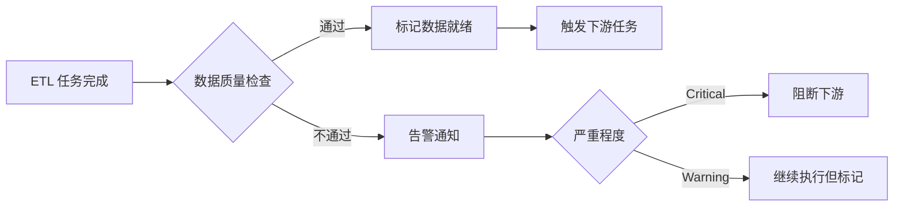

# 6.14 数据质量

> **一句话定位**：数据质量是数据平台的「质检车间」——它通过规则引擎、异常检测和 SLA 监控，确保流入下游的数据是准确、完整、及时、一致的，避免「垃圾进垃圾出」（Garbage In, Garbage Out）。

---

## 一、为什么数据质量重要

### 1.1 数据质量问题的代价

```
场景：某天 ODS 层数据同步延迟 2 小时，但下游 ETL 照常跑了
  → DWD 层产出的数据缺了 2 小时
  → DWS 层的 GMV 指标比实际少了 15%
  → CEO 早会看到的经营日报数字异常
  → 数据团队花半天排查 + 修复 + 重跑
  → 业务方对数据团队的信任度下降
```

**数据质量问题的影响链**：
- 💰 **决策失误** — 基于错误数据做出错误业务决策
- ⏰ **排查成本** — 数据团队 30-50% 的时间花在排查数据问题
- 🔗 **信任危机** — 业务方不信任数据，回到「拍脑袋」决策
- 📊 **指标失真** — AgentBI/BI 报表展示错误数字

### 1.2 数据质量六维度

| 维度 | 定义 | 示例 |
|------|------|------|
| **准确性（Accuracy）** | 数据值是否正确反映真实世界 | 订单金额是否正确、状态是否真实 |
| **完整性（Completeness）** | 数据是否有缺失 | 必填字段是否为空、数据条数是否符合预期 |
| **一致性（Consistency）** | 不同系统/表的同一数据是否一致 | 订单表和支付表的金额是否匹配 |
| **及时性（Timeliness）** | 数据是否按时产出 | T+1 数据是否在早上 8 点前就绪 |
| **唯一性（Uniqueness）** | 数据是否有重复 | 同一订单是否出现多次 |
| **有效性（Validity）** | 数据是否符合业务规则 | 年龄是否在 0-150 之间、手机号是否 11 位 |

---

## 二、数据质量规则体系

### 2.1 规则分类

| 类别 | 规则类型 | 示例 |
|------|---------|------|
| **表级规则** | 行数检查 | 今天行数 vs 昨天行数，波动 > 30% 告警 |
| | 表产出时间 | 表必须在 08:00 前产出 |
| | 表是否为空 | 分区数据不能为空 |
| **字段级规则** | 空值率 | user_id 空值率 < 0.1% |
| | 值域检查 | amount > 0 AND amount < 1000000 |
| | 格式检查 | phone 匹配正则 `^1[3-9]\d{9}$` |
| | 枚举检查 | status IN ('paid', 'refund', 'cancel') |
| **跨表规则** | 一致性检查 | 订单表总金额 = 支付表总金额 |
| | 引用完整性 | 订单表的 user_id 都能在用户表找到 |
| **趋势规则** | 同比/环比 | 今天 GMV vs 上周同天，偏差 > 20% 告警 |
| | 波动检测 | 基于历史均值 ± 3σ 检测异常 |

### 2.2 规则配置示例

```yaml
# 数据质量规则配置
rules:
  - table: dws_order_daily
    partition: dt=${bizdate}
    checks:
      # 表级
      - type: row_count
        expect: "> 100000"
        severity: critical
        
      - type: freshness
        expect: "before 08:00"
        severity: critical
        
      # 字段级
      - type: null_rate
        column: user_id
        expect: "< 0.001"
        severity: warning
        
      - type: value_range
        column: order_amount
        expect: "> 0 AND < 10000000"
        severity: critical
        
      # 趋势
      - type: day_over_day
        metric: "COUNT(*)"
        expect: "abs(change) < 0.3"  # 日环比波动 < 30%
        severity: warning
        
      # 跨表一致性
      - type: cross_table
        sql: |
          SELECT ABS(a.total - b.total) / a.total AS diff_rate
          FROM (SELECT SUM(amount) AS total FROM dws_order_daily WHERE dt='${bizdate}') a,
               (SELECT SUM(pay_amount) AS total FROM dws_payment_daily WHERE dt='${bizdate}') b
        expect: "diff_rate < 0.01"  # 差异率 < 1%
        severity: critical
```

### 2.3 规则引擎架构

```
┌─────────────────────────────────────────────────────┐
│                   规则管理层                          │
│  规则配置 │ 规则模板 │ 规则继承 │ 规则版本管理       │
├─────────────────────────────────────────────────────┤
│                   执行引擎层                          │
│  SQL 规则执行 │ 统计规则计算 │ 自定义函数           │
├─────────────────────────────────────────────────────┤
│                   调度集成层                          │
│  任务完成触发 │ 定时触发 │ 手动触发                 │
├─────────────────────────────────────────────────────┤
│                   结果处理层                          │
│  告警通知 │ 阻断下游 │ 质量报告 │ 趋势分析          │
└─────────────────────────────────────────────────────┘
```

---

## 三、异常检测

### 3.1 基于统计的异常检测

| 方法 | 原理 | 适用场景 |
|------|------|---------|
| **固定阈值** | 超过预设值即告警 | 明确的业务边界（如金额 > 0） |
| **3σ 原则** | 超出均值 ± 3 倍标准差 | 正态分布的指标 |
| **IQR（四分位距）** | 超出 Q1-1.5×IQR 或 Q3+1.5×IQR | 有偏分布的指标 |
| **同比/环比** | 与历史同期对比，偏差超阈值 | 有周期性的指标 |
| **滑动窗口** | 与近 N 天均值对比 | 趋势平稳的指标 |

### 3.2 基于机器学习的异常检测

| 方法 | 原理 | 优势 |
|------|------|------|
| **Isolation Forest** | 随机切分，异常点更容易被隔离 | 无需假设分布 |
| **Prophet** | Facebook 时序预测，偏离预测值即异常 | 自动处理周期性和趋势 |
| **LSTM** | 深度学习时序模型 | 捕捉复杂模式 |
| **聚类** | 偏离聚类中心的点为异常 | 多维度联合检测 |

### 3.3 告警降噪

数据质量告警最大的问题是**告警疲劳**——太多误报导致真正的问题被忽略。

| 策略 | 说明 |
|------|------|
| **分级告警** | Critical 打电话、Warning 发 IM、Info 仅记录 |
| **告警收敛** | 同一问题 10 分钟内只告一次 |
| **告警抑制** | 上游已告警时，下游不重复告警 |
| **智能基线** | 用历史数据自动学习正常范围，减少固定阈值误报 |
| **确认机制** | 告警需要人工确认，未确认的升级 |

---

## 四、数据质量平台架构

### 4.1 整体架构

```
┌─────────────────────────────────────────────────────────┐
│                      用户层                               │
│  质量大盘 │ 规则配置 │ 告警管理 │ 质量报告 │ SLA 监控   │
├─────────────────────────────────────────────────────────┤
│                      服务层                               │
│  ┌──────────┐ ┌──────────┐ ┌──────────┐ ┌──────────┐  │
│  │规则引擎   │ │异常检测   │ │告警服务   │ │报告服务   │  │
│  └──────────┘ └──────────┘ └──────────┘ └──────────┘  │
├─────────────────────────────────────────────────────────┤
│                      执行层                               │
│  Spark SQL 执行 │ Presto 执行 │ 自定义检查脚本          │
├─────────────────────────────────────────────────────────┤
│                      集成层                               │
│  调度系统 │ 元数据中心 │ 数据血缘 │ 指标平台             │
├─────────────────────────────────────────────────────────┤
│                      存储层                               │
│  规则库(MySQL) │ 检查结果(ClickHouse) │ 历史趋势         │
└─────────────────────────────────────────────────────────┘
```

### 4.2 与调度系统的集成



**关键设计**：质量检查作为 DAG 中的一个节点，插在 ETL 任务和下游消费之间。Critical 级别的质量问题会阻断下游，避免错误数据扩散。

---

## 五、开源方案

| 方案 | 定位 | 语言 | 特点 |
|------|------|------|------|
| **Great Expectations** | Python 数据质量框架 | Python | 声明式规则、丰富的内置检查、数据文档生成 |
| **dbt tests** | dbt 内置测试 | SQL | 与 dbt 深度集成，SQL 定义规则 |
| **Apache Griffin** | 大数据质量平台 | Java/Scala | 支持批和流、Spark 执行、可视化 |
| **Deequ (AWS)** | Spark 数据质量库 | Scala | Amazon 开源，基于 Spark，支持异常检测 |
| **Soda** | 数据可靠性平台 | Python | SodaCL 语言定义检查，多数据源支持 |
| **Monte Carlo** | 数据可观测性（商业） | — | 自动异常检测、数据血缘、根因分析 |

### Great Expectations 示例

```python
import great_expectations as gx

context = gx.get_context()
validator = context.sources.pandas_default.read_csv("orders.csv")

# 定义期望
validator.expect_column_values_to_not_be_null("user_id")
validator.expect_column_values_to_be_between("amount", min_value=0, max_value=1000000)
validator.expect_column_values_to_be_in_set("status", ["paid", "refund", "cancel"])
validator.expect_table_row_count_to_be_between(min_value=100000)

# 执行验证
results = validator.validate()
```

---

## 六、数据质量治理体系

### 6.1 质量治理流程

```
事前预防 → 事中检测 → 事后修复 → 持续改进
```

| 阶段 | 措施 |
|------|------|
| **事前预防** | 数据接入规范、Schema 校验、数据契约（Data Contract） |
| **事中检测** | 规则引擎实时/准实时检查、异常检测 |
| **事后修复** | 根因分析、数据修复、重跑、影响评估 |
| **持续改进** | 质量报告、趋势分析、规则优化、流程改进 |

### 6.2 数据契约（Data Contract）

数据契约是上下游之间的「协议」——上游承诺数据的格式、质量和 SLA，下游基于契约消费：

```yaml
# 数据契约示例
contract:
  name: "订单事实表"
  owner: "数据平台团队"
  version: "2.1"
  
  schema:
    - name: order_id
      type: BIGINT
      nullable: false
      description: "订单唯一ID"
    - name: amount
      type: DECIMAL(18,2)
      nullable: false
      constraints:
        - "> 0"
        
  sla:
    freshness: "T+1, before 06:00"
    availability: "99.9%"
    
  quality:
    - null_rate(user_id) < 0.001
    - row_count > 100000
    - day_over_day(row_count) < 0.3
```

### 6.3 质量评分

为每张表/每个指标计算质量评分，量化数据质量：

```
质量评分 = Σ(规则权重 × 规则通过率)

示例：
  - 完整性规则（权重 30%）：通过率 98% → 29.4 分
  - 准确性规则（权重 30%）：通过率 100% → 30 分
  - 及时性规则（权重 20%）：通过率 95% → 19 分
  - 一致性规则（权重 20%）：通过率 90% → 18 分
  
  总分 = 96.4 / 100
```

---

## 七、面试深度剖析

### Q1: 如何设计一个数据质量平台？

**答**：五层架构——① 规则管理层（规则配置/模板/继承）；② 执行引擎层（SQL 规则用 Spark/Presto 执行，统计规则用自定义计算）；③ 调度集成层（与任务调度系统联动，ETL 完成后自动触发检查）；④ 告警处理层（分级告警/收敛/抑制/升级）；⑤ 可视化层（质量大盘/趋势/报告）。核心是与调度系统深度集成，质量检查作为 DAG 节点。

### Q2: 数据质量检查会不会影响数据产出时效？

**答**：会，但可以优化——① 检查规则尽量用轻量 SQL（COUNT/MAX/MIN），避免全表扫描；② 采样检查（大表只检查 1% 的数据）；③ 异步检查（非阻断规则异步执行，不影响下游）；④ 增量检查（只检查新增分区的数据）；⑤ 设置检查超时，超时则跳过并告警。

### Q3: 如何处理告警疲劳？

**答**：① 分级——Critical 才打电话，Warning 发 IM；② 收敛——同一问题短时间内只告一次；③ 抑制——上游已告警时下游不重复告；④ 智能基线——用历史数据自动学习正常范围，替代固定阈值；⑤ 确认机制——未确认的告警自动升级；⑥ 定期 Review——清理无效规则。

### Q4: 数据质量和数据血缘有什么关系？

**答**：血缘帮助质量做两件事——① **影响分析**：某张表质量有问题，通过血缘快速找到所有受影响的下游表和报表；② **根因定位**：某个指标异常，通过血缘向上追溯找到问题源头（是 ODS 同步问题还是 ETL 逻辑问题）。

### Q5: 实时数据的质量怎么保障？

**答**：① Flink 任务内置质量检查算子（如空值率、延迟监控）；② 实时 vs 离线对账（实时结果和 T+1 离线结果对比）；③ 数据延迟监控（Watermark 延迟、端到端延迟）；④ 流量突变检测（QPS 突增/突降告警）；⑤ 采样抽检（定期采样验证数据正确性）。

---

## 八、与本书其他章节的关联

| 关联章节 | 关系 |
|---------|------|
| [6.7 数据仓库设计](./07-数据仓库设计.md) | 数仓分层中每层都需要质量检查 |
| [6.13 任务调度](./13-任务调度.md) | 质量检查作为调度 DAG 中的节点 |
| [6.10 语义层](./10-语义层与指标平台.md) | 指标口径一致性是数据质量的重要维度 |
| [6.5 Flink](./05-Flink.md) | 实时数据质量监控 |
| [3.7 高可用架构](../part3-java-deep/07-高可用架构.md) | 告警、监控、SLA 的设计思路相通 |

---

[← 6.13 任务调度](./13-任务调度.md) | [返回本章目录](./README.md) | [6.15 平台可观测性 →](./15-平台可观测性.md)
