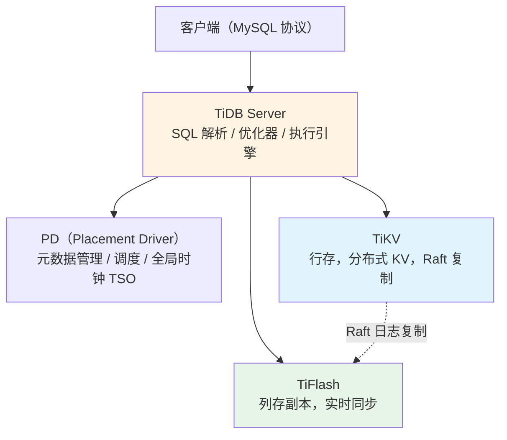

# 6.18 TiDB 与 HTAP 数据库

> **一句话定位**：TiDB 是一个分布式 NewSQL 数据库，目标是"像 MySQL 一样好用、像分布式系统一样能水平扩展、还能像分析引擎一样直接跑复杂查询"。它是 HTAP（Hybrid Transactional/Analytical Processing，混合事务分析处理）理念最具代表性的落地——同一份数据，既服务在线事务（OLTP），又服务实时分析（OLAP），不需要额外的 ETL 搬运到另一套分析系统。

---

## 一、为什么需要 HTAP

### 1.1 传统架构的割裂

在 [6.6 Doris](./06-Doris.md) 里已经看到过这张分层表：事务性读写用 MySQL/TiDB，秒级分析用 Doris/ClickHouse，T+1 离线报表用 Hive/Spark。这个分层本身没问题，但它隐含了一个代价——**业务数据库（MySQL）和分析数据库（Doris/ClickHouse）是两套独立的系统**，数据要通过 CDC 或者定时同步（详见 [6.16 数据接入与数据集成](./16-数据接入与数据集成.md)）从 MySQL 搬到分析系统里，这中间存在同步延迟（通常几秒到几分钟）、存在两套系统的运维成本、也存在"业务库和分析库数据可能对不上"的一致性隐患。

对于一些既要支撑高频交易又要支撑实时分析决策的场景（比如金融风控需要在一笔交易发生的同时立刻分析这个用户的历史交易模式），传统架构里"业务库写完、等 CDC 同步、分析库才能查到"的延迟窗口是不能接受的。

### 1.2 HTAP 的核心思路

HTAP 的解法是：**同一份数据，用两种不同的存储格式各存一份，实时保持同步，查询时由优化器自动决定走哪种存储**。行存格式服务事务性的点查和小范围扫描（OLTP 场景），列存格式服务大范围聚合分析（OLAP 场景）。这不是"一份数据两个用途"这么简单的口号，而是要解决几个硬核工程问题：行存到列存的实时复制怎么做到低延迟不影响事务性能、两种存储的一致性怎么保证、查询优化器怎么自动判断一个 SQL 该走行存还是列存。

TiDB 是这个理念在开源生态里最成熟的实现之一（同类的还有 OceanBase、阿里云 Hologres，这也是为什么原 JD 里 "TiDB/Holo" 经常被放在一起提及——它们解决的是同一类问题）。

---

## 二、TiDB 的整体架构

| 组件 | 职责 | 类比 |
|------|------|------|
| **TiDB Server** | 无状态的 SQL 计算层，负责解析 SQL、生成执行计划、下推算子 | 类似 [6.6 Doris](./06-Doris.md) 的 FE，但完全无状态可任意扩容 |
| **PD（Placement Driver）** | 集群大脑，管理元数据、Region 调度、分配全局递增的事务时间戳（TSO） | 类似 HDFS 的 NameNode，但是多副本、自身也是分布式共识系统 |
| **TiKV** | 分布式行存引擎，数据按 Region 分片，每个 Region 用 Raft 协议做多副本复制 | 存储的"主账本"，服务 OLTP 点查和范围扫描 |
| **TiFlash** | 列存副本，通过 Raft Learner 角色异步/准实时同步 TiKV 的数据 | 存储的"分析副本"，服务 OLAP 聚合查询 |

### 2.1 数据分片与 Raft 复制

TiDB 把数据按主键范围切分成一个个 **Region**（默认 96MB 一个），每个 Region 在多个 TiKV 节点上保存 3 副本，副本之间用 **Raft 协议**（详见 [第三章 A9 分布式系统核心专题](../part3-java-deep/A9-分布式系统核心专题.md) 里对共识算法的讨论）保证强一致——写入必须半数以上副本确认才算成功，Leader 故障后能自动选出新 Leader 继续服务，这套机制让 TiDB 具备了传统单机 MySQL 不具备的高可用能力：单个节点宕机不丢数据、不中断服务。

### 2.2 TiFlash：HTAP 的关键拼图

TiFlash 是理解 TiDB 如何做到 HTAP 的核心。它不是独立的一套存储，而是以 **Raft Learner**（只接收日志、不参与选举投票的特殊角色）的身份挂载到 TiKV 的 Raft 复制组里——TiKV 的每一条写入的 Raft 日志，会被异步复制一份给 TiFlash，TiFlash 把这些行式的日志转换成列式格式（类似 Doris/ClickHouse 的列存）保存。这个设计有两个关键好处：数据同步走的是 Raft 日志复制这条已经存在、经过验证的强一致通道，不需要额外搭一套 CDC 链路；同步延迟通常在秒级甚至亚秒级，比传统"MySQL → Binlog → CDC → Kafka → 分析引擎"的链路短得多。

查询优化器会根据 SQL 的特征自动选择物理执行计划——一个简单的主键点查会走 TiKV（行存，索引查找快），一个跨大量数据的聚合分析（`GROUP BY` + `SUM`）会走 TiFlash（列存，向量化执行快），业务方写的还是标准 SQL，感知不到底层走的是哪套存储，这是 HTAP"一份数据两种引擎"的核心体验。

---

## 三、TiDB vs 传统分库分表 vs Doris/ClickHouse

理解 TiDB 的定位，最好放在几个熟悉的对比坐标系里看。

**TiDB vs MySQL 分库分表**：[第三章数据库 MySQL](../part3-java-deep/09-数据库MySQL.md) 提到的分库分表本质是应用层手工把数据切开，业务代码需要感知分片规则，跨分片 JOIN、分布式事务都要业务方自己想办法（或者引入 Seata 这类分布式事务框架，详见 [第三章 3.11 分布式事务](../part3-java-deep/11-分布式事务.md)）。TiDB 把分片这件事下沉到了数据库内核层——业务方写的还是单库 SQL，分片、路由、跨分片事务全部由 TiDB 内部处理，这是"业务无感的水平扩展"和"业务感知的手工分片"之间的本质区别。

**TiDB vs Doris/ClickHouse**：Doris 和 ClickHouse 是纯 OLAP 引擎，不支持高频的单行事务性更新（虽然支持 UPDATE/DELETE，但设计定位不是给交易系统用的），TiDB 是能同时支撑交易和分析的 HTAP 数据库。如果业务场景是"纯分析、数据来自其他系统同步"，Doris/ClickHouse 更合适；如果业务场景是"既要支撑核心交易又要支撑实时分析、且不希望引入额外的数据同步链路"，TiDB 的 HTAP 架构价值更大。

**TiDB vs 传统数仓分层**：一个容易产生的误解是"有了 TiDB 是不是就不需要数仓分层了"。实际上 TiDB 通常解决的是"业务系统本身"和"业务系统的实时分析"这个局部问题，[第六章数仓建模](./07-数据仓库设计.md)里 ODS→DWD→DWS→ADS 的分层体系，解决的是"跨多个业务系统的数据整合、历史沉淀、主题建模"这个更大范围的问题，两者不是替代关系——一个成熟的数据架构里，TiDB 可能是某个核心业务域的存储引擎（同时支撑该业务的交易和局部分析），数仓依然需要把 TiDB（以及其他业务库）的数据通过 CDC 汇总到统一的数仓分层里做企业级的整合分析。

---

## 四、面试深度剖析

### Q1：TiDB 是怎么做到 HTAP 的？

**答**：核心是 TiFlash 以 Raft Learner 身份挂载到 TiKV 的复制组里，异步获取行存的 Raft 日志并转换成列式存储，形成"同一份数据的两种物理副本"。查询优化器根据 SQL 特征（点查 vs 大范围聚合）自动路由到 TiKV 或 TiFlash，业务方写标准 SQL 即可，不需要关心底层存储选择。

### Q2：TiDB 和分库分表相比，解决了什么核心痛点？

**答**：分库分表是应用层手工切分，业务代码需要感知分片规则，跨分片 JOIN 和分布式事务都需要额外处理。TiDB 把分片下沉到数据库内核（按 Region 自动分片、自动调度、内置分布式事务支持 MVCC+2PC），业务方写单库 SQL 即可获得水平扩展能力，是"业务无感"和"业务感知"的区别。

### Q3：TiDB 的强一致性是怎么保证的？

**答**：数据按 Region 分片，每个 Region 的多个副本之间用 Raft 协议复制——写入需要半数以上副本确认才算成功，读取可以从 Leader 强一致读，也可以配置从 Follower 读（需要配合 Raft 的 ReadIndex 或 Lease 机制保证不读到脏数据）。PD 负责全局分配单调递增的事务时间戳（TSO），配合 MVCC 实现跨 Region 的分布式事务。

### Q4：什么场景该选 TiDB，什么场景该选 Doris/ClickHouse？

**答**：如果业务本身就是高频交易系统，同时需要对交易数据做实时分析（不能接受传统 CDC 同步的秒级到分钟级延迟），选 TiDB 这类 HTAP 数据库。如果分析的数据来自多个异构业务系统汇总而来，业务系统本身不需要 TiDB 的强一致事务能力，选 Doris/ClickHouse 这类纯 OLAP 引擎成本更低、生态更成熟。两者也可以组合使用——核心交易域用 TiDB，企业级数仓整合分析用 Doris。

### Q5：TiFlash 的数据同步会不会影响 TiKV 的写入性能？

**答**：TiFlash 是 Raft Learner，只被动接收日志不参与投票，因此不会增加 Raft 写入需要的"半数确认"的门槛（写入成功与否只看 TiKV 的 Voter 副本），TiFlash 的同步是异步旁路进行的，正常情况下不会拖慢 TiKV 主链路的写入延迟，只是 TiFlash 侧的数据可见性会有一个小的滞后窗口。

---

## 五、与本书其他章节的关联

| 关联章节 | 关系 |
|---------|------|
| [3.9 数据库 MySQL](../part3-java-deep/09-数据库MySQL.md) | 分库分表的对比基准，理解手工分片与内核级分片的差异 |
| [3.11 分布式事务](../part3-java-deep/11-分布式事务.md) | TiDB 内置的分布式事务（MVCC + 2PC 思路）与 Seata 等框架的对比 |
| [A9 分布式系统核心专题](../part3-java-deep/A9-分布式系统核心专题.md) | Raft 共识算法是 TiKV 多副本复制的理论基础 |
| [6.6 Doris](./06-Doris.md) | 同为向量化列存 OLAP 引擎，TiFlash 与 Doris 的列存执行原理相通 |
| [6.16 数据接入与数据集成](./16-数据接入与数据集成.md) | TiDB 减少了对传统 CDC 同步链路的依赖，但企业级数仓整合仍需 CDC |
| [6.9 湖仓一体](./09-湖仓一体.md) | 都是"解决数据新鲜度和分析灵活性矛盾"的架构思路，湖仓面向海量离线数据，HTAP 面向在线业务数据 |

---

[← 6.17 多租户与权限体系](./17-多租户与权限体系.md) | [返回本章目录](./README.md) | [返回全书目录](../README.md)
