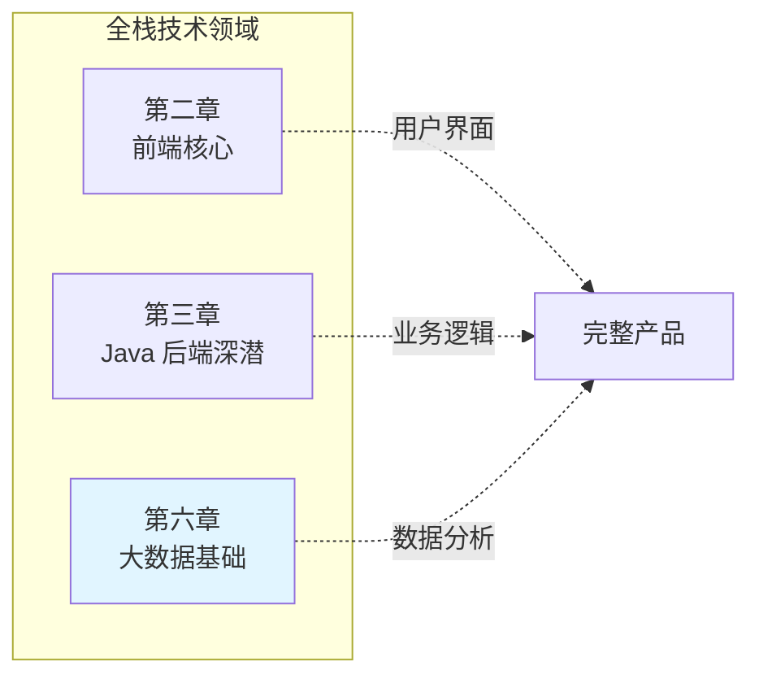

# 第六章 · 大数据基础——当单机 MySQL 扛不住时

> **读者画像**：你是一个 Java 后端开发者，日常和 MySQL 打交道。但当数据量从百万级增长到亿级甚至十亿级时，单机数据库在存储、计算、实时性三个维度上都会触碰天花板。这一章帮你理解大数据技术栈的全景、核心组件的定位与原理，以及它们和你熟悉的后端技术之间的关系。

---

## 本章定位

大数据和前端、后端一样，是全栈体系下的一个**平行技术领域**，不是后端的附属品。对于 Java 后端转全栈的开发者来说，你不需要成为大数据专家，但需要理解：

- 什么场景下该从 MySQL 切换到大数据技术栈
- 数据仓库分层模型（ODS→DWD→DWS→ADS）的设计思路
- 批处理（Hive/Spark）和实时计算（Flink）各自的定位
- 和你已经熟悉的 [消息队列 Kafka](../part3-java-deep/12-消息队列.md)、[MySQL](../part3-java-deep/09-数据库MySQL.md)、[ElasticSearch](../part3-java-deep/A5-ElasticSearch.md) 之间的协作关系

---

## 各节导读

**[6.1 大数据技术栈全景](./01-大数据技术栈全景.md)** —— 为什么需要大数据技术（MySQL 三大瓶颈）、核心技术栈全景图（采集→存储→计算→应用）、存储分类（SQL/NoSQL/搜索/分布式文件）、计算/查询/采集/管道组件速查、数据仓库分层模型（ODS/DWD/DWS/ADS）、Lambda 架构 vs Kappa 架构、大数据与后端的协作模式。

**[6.2 HDFS](./02-HDFS.md)** —— 分布式文件系统的基石。NameNode + DataNode 架构、数据分块（128MB）与 3 副本放置策略、读写流程、NameNode HA 与 Federation。*面试剖析覆盖：HDFS 适合/不适合什么、NameNode 单点问题、小文件问题、Block 大小选择。*

**[6.3 Hive](./03-Hive.md)** —— 用 SQL 查大数据。Hive 的本质（SQL 翻译器 + MetaStore）、内部表 vs 外部表、分区裁剪（最重要的优化手段）、分桶、文件格式（ORC/Parquet）、SQL 差异速查、数据倾斜解决方案。*面试剖析覆盖：Hive 和数据库的区别、内外部表区别、数据倾斜排查、ORC vs Parquet 选型。*

**[6.4 Spark](./04-Spark.md)** —— 内存计算引擎。RDD 核心抽象（不可变/分区/惰性/血缘容错）、Transformation vs Action、宽窄依赖与 Shuffle、Job→Stage→Task 划分、Spark SQL 与 Catalyst 优化器、内存模型与 YARN 资源管理。性能优化专题（数据倾斜八种修复方案、Shuffle 调优、Spark UI 分析方法）见 [Spark 性能优化](./04-Spark-性能优化.md)，作业日志体系与调试运维（日志类型、排查方法、常见故障）见 [Spark 调试运维](./04-Spark-调试运维.md)。*面试剖析覆盖：Spark vs MapReduce、RDD 容错机制、Shuffle 原理、数据倾斜处理、内存模型。*

**[6.5 Flink](./05-Flink.md)** —— 实时计算引擎。流处理三大挑战（乱序/延迟/窗口）、Event Time vs Processing Time、Watermark 机制、四种窗口类型、Checkpoint + Exactly-Once 语义、Flink SQL。*面试剖析覆盖：Flink vs Spark Streaming、Checkpoint vs Savepoint、Watermark 设置、反压机制。*

**[6.6 Doris](./06-Doris.md)** —— MPP 实时分析数据库。FE + BE 架构、三种数据模型（Duplicate/Aggregate/Unique）、列式存储 + 向量化执行、物化视图、数据导入方式、Doris vs ClickHouse vs StarRocks 对比。*面试剖析覆盖：Doris 定位、数据模型选型、查询为什么快、实时数据导入方案。*

**[6.7 数据仓库设计](./07-数据仓库设计.md)** —— 数仓怎么建模。两大建模流派（Inmon 范式 vs Kimball 维度建模）、事实表与维度表、星型/雪花/星座模型对比、宽表设计、缓慢变化维（SCD）与拉链表、数仓分层各层设计要点、主题域划分、数据质量六维度。*面试剖析覆盖：星型 vs 雪花模型选型、事实表粒度设计、拉链表原理与实现、分层意义、宽表优缺点。*

**[6.8 大模型数据工程](./08-大模型数据工程.md)** —— 预训练数据从采集到入模。文本数据处理全流程（Common Crawl → 文本提取 → 语言识别 → 质量过滤 → 去重 → 安全过滤 → 数据配比）、多模态数据处理（图文对齐与 CLIP 打分、视频帧提取与字幕对齐、音频 ASR 转录、OCR 与文档理解）、去重技术深入（MinHash + LSH、SimHash）、工程实现技术栈（Spark + Ray、Parquet/WebDataset 格式）、与传统 ETL 的对比。*面试剖析覆盖：预训练数据核心流程、去重重要性与方法、多模态核心挑战、数据质量 vs 数量、数据配比策略。*

**[6.9 湖仓一体](./09-湖仓一体.md)** —— LakeHouse 架构演进（数仓→数据湖→湖仓一体）、三大开放表格式对比（Iceberg/Hudi/Paimon 的 ACID/Schema Evolution/Time Travel/Partition Evolution）、统一 Catalog（HMS/Nessie/Unity/Gravitino）、实时入湖方案（Flink+Iceberg/Flink+Paimon）、批流一体计算、湖上查询加速（Z-Order/Data Skipping/Manifest 缓存）。*面试剖析覆盖：为什么需要湖仓、Snapshot 隔离实现、CoW vs MoR 选型、小文件治理、Paimon vs Iceberg 区别。*

**[6.10 语义层与指标平台](./10-语义层与指标平台.md)** —— 语义层概念（Metrics Layer/Headless BI）、维度/度量/指标/数据集建模、指标口径管理（技术口径 vs 业务口径）、SQL 生成引擎、查询下推与路由、权限过滤（行级/列级）、开源方案对比（dbt Metrics/Cube.js/MetricFlow）、与 AgentBI 的关系。*面试剖析覆盖：语义层 vs ADS 层、查询下推实现、行级权限性能、指标口径变更、指标平台架构设计。*

**[6.11 ClickHouse](./11-ClickHouse.md)** —— 列式 OLAP 极致性能。列式存储 + 向量化执行 + 高压缩率、MergeTree 引擎族（Replacing/Summing/Aggregating/Collapsing）、稀疏索引与 Data Skipping、分布式架构（Shard + Replica + ZooKeeper）、物化视图、数据导入方式、ClickHouse vs Doris 深度对比与选型。*面试剖析覆盖：为什么快、Merge 过程、UPDATE/DELETE 处理、分布式查询流程、高可用方案。*

**[6.12 Presto 查询引擎（附 Trino 简介）](./12-Presto查询引擎.md)** —— 分布式交互式 SQL 查询引擎。Coordinator + Worker 架构、Pipeline 执行模型（vs Spark 的 Stage 模型）、Connector 机制与联邦查询、CBO 优化与 JOIN 策略、内存管理、与 Spark SQL 的定位对比、Trino 与 PrestoDB 的关系与差异。*面试剖析覆盖：为什么比 Hive/Spark 快、Connector 工作原理、联邦 JOIN、内存不足处理、Presto vs Trino 选型。*

**[6.13 任务调度](./13-任务调度.md)** —— 数据平台的中枢神经。DAG 依赖管理、Cron/事件/手动触发、失败重试与告警、资源管理与优先级、Backfill 回填、Airflow vs DolphinScheduler vs Azkaban 对比、调度系统核心设计（依赖管理/失败处理/资源控制/SLA 监控）。*面试剖析覆盖：为什么不用 crontab、Airflow vs DolphinScheduler 选型、高可用设计、依赖处理、大规模性能瓶颈。*

**[6.14 数据质量](./14-数据质量.md)** —— 数据平台的质检车间。数据质量六维度（准确/完整/一致/及时/唯一/有效）、规则体系（表级/字段级/跨表/趋势）、规则引擎架构、异常检测（统计方法/ML 方法）、告警降噪、数据契约（Data Contract）、质量评分、开源方案（Great Expectations/dbt tests/Soda）。*面试剖析覆盖：质量平台设计、检查对时效的影响、告警疲劳处理、与血缘的关系、实时数据质量。*

**[6.15 平台可观测性](./15-平台可观测性.md)** —— 数据链路的全景监控。任务层/引擎层/数据链路/资源层四维监控、Spark/Flink/Presto 核心指标、端到端延迟监控、SLA 达成率、资源利用率分析、故障根因分析、Grafana 大盘设计、技术选型（Prometheus/ES/Grafana/Alertmanager）。*面试剖析覆盖：与微服务可观测性的区别、端到端延迟监控、Flink 反压排查、告警体系设计、资源成本优化。*

**[6.16 数据接入与数据集成](./16-数据接入与数据集成.md)** —— 数据平台的入口。批量接入（DataX/SeaTunnel/Sqoop）vs 实时接入（CDC）、Flink CDC 全增量一体、Debezium + Kafka 架构、Canal 简介、日志采集（Filebeat/Fluentd）、Schema Registry 与 Schema Evolution、异构数据源适配层设计、统一接入平台架构。*面试剖析覆盖：CDC vs 全量同步、Flink CDC 全增量一体原理、Schema 变更处理、不丢不重保障、DataX vs SeaTunnel 选型。*

**[6.17 多租户与权限体系](./17-多租户与权限体系.md)** —— 数据安全与隔离。多租户隔离方案（物理/资源/逻辑）、RBAC + ABAC 权限模型、行级权限（SQL 改写注入）、列级权限与数据脱敏（动态/静态）、Apache Ranger 架构与策略、数据分类分级、审计日志、合规要求映射（个保法/GDPR）、权限与平台各层的集成。*面试剖析覆盖：行级权限实现与性能、多租户资源隔离、Ranger Plugin 机制、脱敏方案选型、统一权限体系设计。*

---

## 阅读建议

- 如果你是纯后端开发者，先读 6.1 建立全景认知，再挑和你工作相关的组件深入
- 如果面试大数据相关岗位，6.2-6.8 的面试剖析部分是重点
- 如果你需要和数据团队协作，重点理解数仓分层（6.1）、数仓建模（6.7）和 Kafka 的桥梁作用
- 如果你对 AI / 大模型方向感兴趣，6.8 介绍了预训练数据工程的全流程，和 6.4 Spark 的优化经验直接相通；更深入的 AI 工程知识（RAG、Prompt Engineering、模型部署、微调、Agent）详见 [第七章 AI 工程基础](../part7-ai-engineering/README.md)
- SQL 基础和查询优化详见 [附录 A4 SQL 语言与查询优化](../part3-java-deep/A4-SQL语言与数据处理.md)
- Kafka 的详细介绍在 [3.12 消息队列](../part3-java-deep/12-消息队列.md)
