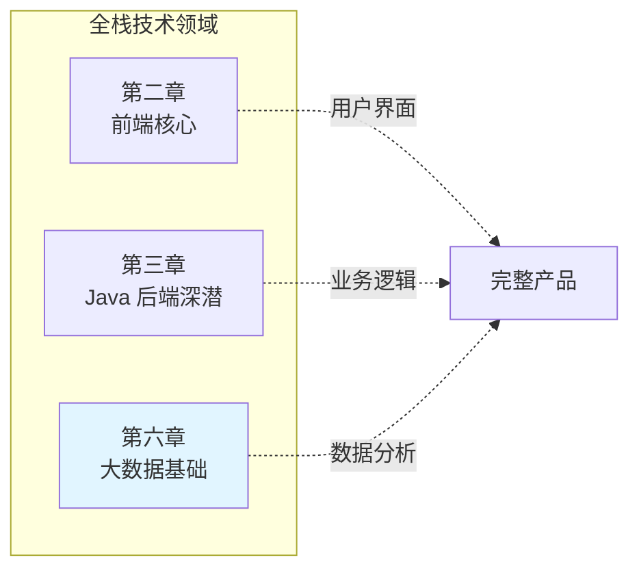

# 第六章 · 大数据基础——当单机 MySQL 扛不住时

> **读者画像**：你是一个 Java 后端开发者，日常和 MySQL 打交道。但当数据量从百万级增长到亿级甚至十亿级时，单机数据库在存储、计算、实时性三个维度上都会触碰天花板。这一章帮你理解大数据技术栈的全景、核心组件的定位与原理，以及它们和你熟悉的后端技术之间的关系。

---

## 本章定位

大数据和前端、后端一样，是全栈体系下的一个**平行技术领域**，不是后端的附属品。对于 Java 后端转全栈的开发者来说，你不需要成为大数据专家，但需要理解：

- 什么场景下该从 MySQL 切换到大数据技术栈
- 数据仓库分层模型（ODS→DWD→DWS→ADS）的设计思路
- 批处理（Hive/Spark）和实时计算（Flink）各自的定位
- 和你已经熟悉的 [消息队列 Kafka](../part3-java-deep/12-消息队列.md)、[MySQL](../part3-java-deep/09-数据库MySQL.md)、[ElasticSearch](../part3-java-deep/A5-ElasticSearch.md) 之间的协作关系

---

## 各节导读

**[6.1 大数据技术栈全景](./01-大数据技术栈全景.md)** —— 为什么需要大数据技术（MySQL 三大瓶颈）、核心技术栈全景图（采集→存储→计算→应用）、数据仓库分层模型（ODS/DWD/DWS/ADS）、核心组件速查（HDFS/Hive/Spark/Flink/HBase/ClickHouse）、Hive SQL vs MySQL SQL 的关键差异、Lambda 架构 vs Kappa 架构、大数据与后端的协作模式。

---

## 阅读建议

- 如果你是纯后端开发者，先读 6.1 建立全景认知，重点理解"什么场景用什么组件"
- 如果你需要和数据团队协作（比如提供数据接口、接收数据分析结果），重点理解数仓分层和数据流转
- SQL 基础和查询优化详见 [附录 A4 SQL 语言与查询优化](../part3-java-deep/A4-SQL语言与数据处理.md)
- Kafka 的详细介绍在 [3.12 消息队列](../part3-java-deep/12-消息队列.md)
