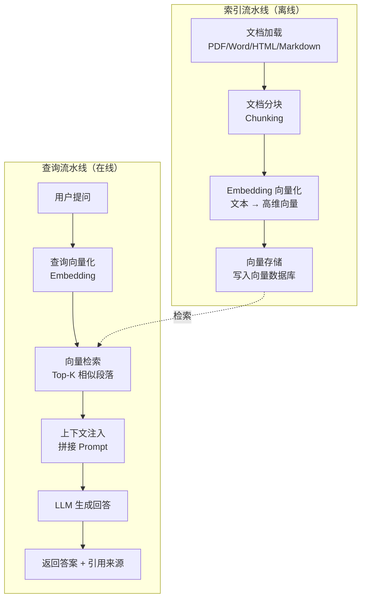
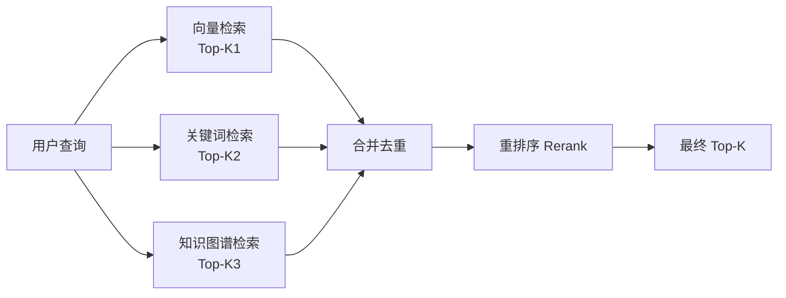
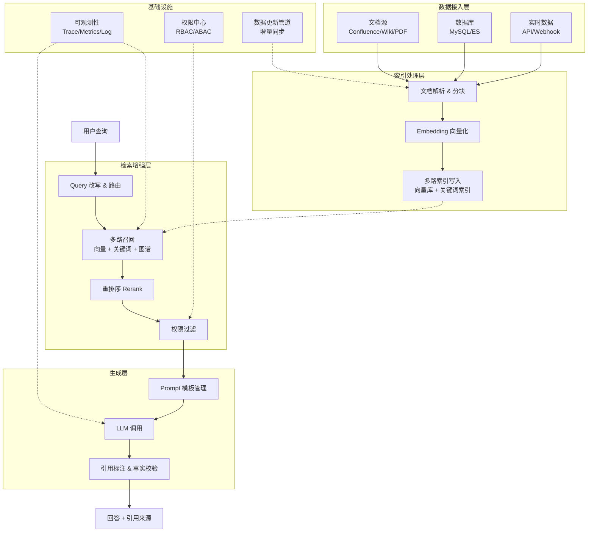

# 7.1 RAG 实战——检索增强生成

> **一句话定位**：LLM（Large Language Model，大语言模型）很强，但它不知道你的私有数据、会编造事实、知识有截止日期。RAG（Retrieval-Augmented Generation，检索增强生成）就是让 LLM "开卷考试"——先从你的知识库里检索相关内容，再让 LLM 基于检索结果生成回答。这一节站在后端工程师的视角，讲清楚 RAG 的完整流程、每个环节的工程决策，以及企业级架构的落地。

---

## 一、为什么需要 RAG

### 1.1 LLM 的三大局限

直接用 LLM 回答业务问题，会遇到三个硬伤：

| 局限 | 表现 | 后端类比 |
|------|------|---------|
| **知识截止（Knowledge Cutoff）** | 模型训练数据有截止日期，不知道最新事件 | 像一个只读了去年文档的运维，不知道今天刚发的版 |
| **幻觉（Hallucination）** | 模型会一本正经地编造不存在的事实 | 像 RPC 调用超时后返回了一个"看起来合理但完全捏造"的响应 |
| **无法访问私有数据** | 模型没见过你的内部文档、数据库、业务系统 | 像一个新来的实习生，能力强但完全不了解公司业务 |

### 1.2 RAG 的核心思路

RAG 的思路极其朴素：**别让模型"裸考"，给它开卷**。

```
传统 LLM 调用（闭卷考试）：
  用户提问 → LLM 直接回答 → 可能瞎编

RAG（开卷考试）：
  用户提问 → 先查知识库找到相关段落 → 把段落塞进 Prompt → LLM 基于段落回答
```

用后端的思维来理解：RAG ≈ **带缓存的微服务调用**——先用用户请求去查本地知识库（缓存命中），再把检索到的内容作为上下文传给 LLM（回源生成）。LLM 本身不变，变的是你给它喂了什么上下文。

### 1.3 RAG vs 微调（Fine-tuning）

| 维度 | RAG | 微调（Fine-tuning） |
|------|-----|-------------------|
| **解决什么** | 知识时效性、私有数据接入、减少幻觉 | 改变模型的行为风格、领域适配、特定任务能力 |
| **数据更新** | 实时更新知识库即可，无需重训 | 需要重新训练或增量训练 |
| **成本** | 低（只需向量数据库 + 检索逻辑） | 高（需要 GPU 训练 + 数据标注） |
| **可解释性** | 强（能溯源到具体文档段落） | 弱（知识"焊"在权重里，无法溯源） |
| **幻觉控制** | 较好（有出处可查） | 一般（可能学到了错误模式） |
| **适合场景** | 企业知识问答、文档检索、客服 | 专业领域术语、输出格式定制、特定语言风格 |

**经验法则**：知识问题用 RAG，能力/风格问题用微调。两者不互斥——先用微调让模型"懂行话"，再用 RAG 给它"最新资料"，是很多企业的最终选择。

---

## 二、RAG 核心流程

### 2.1 完整流程图

RAG 分为两条流水线：**索引流水线**（离线，建库）和**查询流水线**（在线，问答）。



### 2.2 用后端架构类比

| RAG 环节 | 后端类比 | 说明 |
|----------|---------|------|
| 文档加载 | 数据采集 ETL | 从多数据源拉取原始数据 |
| 文档分块 | 分库分表 | 把大文档拆成可管理的小单元 |
| Embedding | 建索引（B+ Tree / 倒排索引） | 把文本变成可快速检索的向量表示 |
| 向量存储 | 写入存储引擎 | 持久化到向量数据库 |
| 向量检索 | ES 全文搜索 | 根据查询找到最相似的 Top-K 条记录 |
| 上下文注入 | 请求参数组装 | 把检索结果拼成 LLM 能理解的 Prompt |
| LLM 生成 | 调用下游微服务 | 把组装好的请求发给 LLM，拿到响应 |

---

## 三、文档分块策略

### 3.1 为什么要分块

分块（Chunking）是 RAG 中影响检索质量最关键的环节之一，原因有二：

1. **LLM 上下文窗口限制**：即使是 128K 窗口的模型，塞入整本手册也不现实——成本高且注意力会稀释
2. **检索精度**：如果一整篇 50 页文档存为一个向量，检索时无法定位到具体段落；分成小块后，每块向量语义集中，检索更精准

### 3.2 分块方法对比

| 方法 | 原理 | 优点 | 缺点 | 适用场景 |
|------|------|------|------|---------|
| **固定长度分块** | 按固定字符数/token 数切割 | 实现简单、速度快 | 可能切断句子和段落 | 纯文本、格式统一的日志 |
| **递归字符分块** | 按分隔符层级递归切割（段落 → 句子 → 字符） | 尽量保持语义完整 | 需要调分隔符和块大小 | 通用文本（LangChain 默认） |
| **语义分块** | 用 Embedding 计算相邻句子相似度，相似度骤降处切割 | 语义边界最自然 | 计算成本高 | 高质量问答场景 |
| **按文档结构分块** | 按 Markdown 标题、HTML 标签、PDF 章节切割 | 保留文档层级结构 | 依赖文档格式规范 | 技术文档、手册、论文 |

### 3.3 分块大小与重叠窗口

**分块大小**是一个需要权衡的核心参数：

```
块太大（如 4096 tokens）：
  ✗ 检索时一个块包含太多信息，向量被"稀释"，语义不集中
  ✗ 浪费 LLM 上下文窗口

块太小（如 128 tokens）：
  ✗ 上下文断裂，"张三负责的项目"可能和"项目预算"分在两块
  ✗ 需要检索更多块才能拼出完整信息

经验值：512 ~ 1024 tokens（中英文混合可偏大一些）
```

**重叠窗口（Overlap）**：相邻块之间保留一部分重复内容，防止在切割边界丢失上下文。通常设置为块大小的 10%~20%。

```
块1: [AAAA BBBB CCCC]
块2:           [CCCC DDDD EEEE]   ← CCCC 是重叠部分
块3:                      [EEEE FFFF GGGG]
```

### 3.4 代码示例：递归字符分块

```python
# 伪代码：递归字符分块（LangChain RecursiveCharacterTextSplitter 的核心逻辑）

def recursive_split(text, chunk_size=512, chunk_overlap=64, separators=None):
    """递归字符分块：按分隔符优先级逐层切割，尽量在自然边界处分块"""
    if separators is None:
        separators = ["\n\n", "\n", "。", ".", " ", ""]  # 从大到小

    # 用第一个能切出足够小块的分隔符
    for sep in separators:
        if sep == "":
            # 兜底：按字符硬切
            chunks = [text[i:i+chunk_size] for i in range(0, len(text), chunk_size)]
            break
        splits = text.split(sep)
        # 如果切出来的块仍然太大，换更细的分隔符
        if any(len(s) > chunk_size for s in splits):
            # 递归处理超大的子块
            result = []
            for s in splits:
                if len(s) > chunk_size:
                    result.extend(recursive_split(s, chunk_size, chunk_overlap, separators[1:]))
                else:
                    result.append(s)
            splits = result
        # 把小块合并到 chunk_size 附近，保留 overlap
        chunks = merge_with_overlap(splits, sep, chunk_size, chunk_overlap)
        break

    return chunks

def merge_with_overlap(splits, sep, chunk_size, overlap):
    """将切分后的小片段合并为目标大小的块，块间保留重叠"""
    chunks = []
    current = ""
    for s in splits:
        candidate = current + sep + s if current else s
        if len(candidate) <= chunk_size:
            current = candidate
        else:
            if current:
                chunks.append(current)
            # overlap：从当前块的尾部截取 overlap 长度作为下一块的头部
            current = current[-overlap:] + sep + s if overlap else s
    if current:
        chunks.append(current)
    return chunks
```

---

## 四、Embedding 与向量检索

### 4.1 什么是 Embedding

Embedding（嵌入）是将文本映射为高维浮点数向量的过程。核心直觉：**语义相似的文本，向量距离近；语义无关的文本，向量距离远**。

```
"如何部署 Java 微服务"   → [0.12, -0.34, 0.56, ..., 0.78]  (768 维)
"Java 服务上线流程"      → [0.15, -0.31, 0.52, ..., 0.75]  (768 维) ← 和上面很接近
"今天天气不错"           → [-0.89, 0.42, -0.11, ..., 0.03] (768 维) ← 和上面差很远
```

**Java 类比**：Embedding 类似 `hashCode()`——都是把复杂对象映射为数值向量。但有关键区别：

| | `hashCode()` | Embedding |
|--|-------------|-----------|
| 目标 | 均匀分布，减少哈希冲突 | 语义聚类，相似文本向量靠近 |
| 维度 | 1 维（int） | 几百到几千维（float 向量） |
| 可逆性 | 不可逆 | 不可逆（但保留了语义信息） |
| 用途 | 哈希表定位 | 语义相似度检索 |

### 4.2 常用 Embedding 模型

| 模型 | 维度 | 特点 | 适用场景 |
|------|------|------|---------|
| **OpenAI text-embedding-3** | 1536 / 3072 | 效果好、多语言、但需调 API、数据出境 | 对效果要求高、可接受 API 依赖 |
| **BGE（BAAI General Embedding）** | 768 / 1024 | 中文效果优秀、开源可私有部署 | 中文场景首选开源方案 |
| **M3E** | 768 | 中文社区流行、适合通用问答 | 中文通用问答 |
| **GTE（General Text Embeddings）** | 768 / 1024 | 阿里达摩院出品、多语言 | 中英混合场景 |

> **选型建议**：国内企业优先考虑 BGE 或 GTE——效果好且能私有化部署，避免数据出境问题。

### 4.3 向量数据库对比

向量数据库专门优化了"在高维空间中找最相似的 K 个向量"这一操作（ANN，Approximate Nearest Neighbor，近似最近邻搜索）。

| 向量数据库 | 部署方式 | 特点 | 适用场景 |
|-----------|---------|------|---------|
| **Milvus** | 自部署 / 云托管 | 开源、分布式、支持亿级向量、生态成熟 | 大规模生产环境 |
| **Pinecone** | 全托管 SaaS | 零运维、API 简单、按量付费 | 快速验证、不想运维 |
| **Weaviate** | 自部署 / 云托管 | 内置混合检索（向量 + 关键词）、支持 GraphQL | 需要混合检索的场景 |
| **Chroma** | 嵌入式 / 本地 | 轻量、Python 友好、开发体验好 | 原型开发、小规模 |
| **FAISS** | 库（非数据库） | Meta 开源、纯计算库、极致性能、无持久化 | 已有自己的存储层、只需要检索能力 |

> **后端类比**：FAISS 是"库"（类似 Java 的 Lucene），Milvus/Pinecone 是"数据库"（类似 ES）。

### 4.4 向量检索 vs 关键词检索 vs 混合检索

| 检索方式 | 原理 | 擅长 | 不擅长 |
|---------|------|------|--------|
| **关键词检索（BM25）** | 词频 + 逆文档频率，精确匹配 | 专有名词、ID、代码、缩写 | 语义相近但措辞不同 |
| **向量检索** | 语义相似度匹配 | 同义改写、跨语言、模糊意图 | 精确匹配专有名词 |
| **混合检索（Hybrid Search）** | 向量 + 关键词加权融合 | 兼顾语义和精确匹配 | 需要调融合权重 |

```
用户问："K8s Pod 一直 CrashLoopBackOff 怎么排查？"

纯关键词检索：能精确匹配 "CrashLoopBackOff" 这个术语 ✅
纯向量检索：可能匹配到 "容器反复重启的排查方法"，但错过了精确术语 ❌
混合检索：两者都召回，重排后取最优 ✅
```

**经验**：生产环境几乎都用混合检索。ES 8.x 也已原生支持 KNN 向量检索，可以一个引擎同时做 BM25 + 向量。

### 4.5 相似度度量

三种常用的向量距离度量，用 2D 向量直观理解：

```
余弦相似度（Cosine Similarity）：
  衡量向量方向夹角，不关心长度
  公式: cos(θ) = A·B / (|A|×|B|)
  范围: [-1, 1]，越接近 1 越相似

  A=(1, 2), B=(2, 4)  → cos = 1.0  (方向相同，极度相似)
  A=(1, 2), B=(-1,-2) → cos = -1.0 (方向相反)
  A=(1, 0), B=(0, 1)  → cos = 0.0  (正交，无关)

欧氏距离（L2 Distance）：
  衡量空间中两点的直线距离
  公式: d = √(Σ(Ai - Bi)²)
  范围: [0, +∞)，越小越相似

内积（Inner Product / Dot Product）：
  A·B = Σ(Ai × Bi)
  当向量已归一化时，内积 = 余弦相似度
```

| 度量方式 | 适用场景 | 注意事项 |
|---------|---------|---------|
| 余弦相似度 | 文本 Embedding（最常用） | 只看方向，忽略向量模长 |
| 欧氏距离 | 图像检索、异常检测 | 对向量模长敏感 |
| 内积 | 向量已归一化时 | 计算最快，等价于余弦相似度 |

---

## 五、检索优化

基础 RAG（直接用用户查询做向量检索）往往效果不够好。以下是从工程实践中总结的优化手段。

### 5.1 基础检索的问题：语义鸿沟

用户提问和文档内容的表述方式经常不同，导致向量相似度不高：

```
用户查询："怎么让接口响应更快？"
知识库文档："性能优化方案：引入 Redis 缓存、数据库加索引、异步化处理"

→ 查询说的是"快"，文档说的是"性能优化"，字面差异大，向量可能不够近
```

### 5.2 Query 改写

**HyDE（Hypothetical Document Embeddings，假设性文档嵌入）**：先让 LLM 根据用户问题生成一个"假想回答"，用这个回答去检索——因为回答和文档的表述风格更接近，检索效果更好。

```
原始流程：
  用户问题 → Embedding → 检索文档

HyDE 流程：
  用户问题 → LLM 生成假想回答 → 用回答做 Embedding → 检索文档
  （"怎么让接口更快？" → LLM 生成 "要提升接口响应速度，可以从缓存、索引、异步化等方面入手..."
   这段假想回答和知识库文档的表述更接近，检索更准）
```

其他改写策略：

| 策略 | 做法 | 类比 |
|------|------|------|
| **同义扩展** | LLM 将查询改写为多个同义问法 | MySQL 查询的 OR 条件扩展 |
| **子查询分解** | 复杂问题拆成多个子问题分别检索 | 把一个大 SQL 拆成多个子查询 |
| **多轮对话改写** | 结合历史对话补全指代 | 把 "他那个项目" 改写为 "张三负责的电商项目" |

### 5.3 多路召回

不依赖单一检索方式，同时从多个渠道召回候选，再合并去重：



### 5.4 重排序（Reranking）

两阶段检索，类比搜索引擎的经典架构：

```
阶段 1 - 粗排（召回）：向量检索快速召回 Top-50 候选
  → 用 ANN 近似搜索，速度快，精度够用即可

阶段 2 - 精排（重排）：用 Cross-Encoder 模型对 50 个候选逐一打分
  → Cross-Encoder 把 [查询, 文档] 拼在一起输入模型，精度远高于向量相似度
  → 但计算慢，只能用于少量候选

最终取精排后 Top-5 注入 LLM
```

| | 粗排（向量检索） | 精排（Cross-Encoder） |
|--|----------------|---------------------|
| 模型类型 | Bi-Encoder（双塔） | Cross-Encoder（交叉编码） |
| 速度 | 极快（ANN 索引） | 慢（逐对计算） |
| 精度 | 中等 | 高 |
| 候选量 | 数千 | 数十 |
| 类比 | ES 的 BM25 初筛 | 精排模型的最终排序 |

常用 Reranker 模型：BGE-Reranker、Cohere Rerank、bge-reranker-large。

### 5.5 Parent Document Retriever

**问题**：小块检索精准但上下文不足，大块上下文完整但检索不精确。

**方案**：检索时用小块，返回时用大块——检索小块的"精度"，返回大块的"上下文"。

```
索引阶段：
  大文档 → 大块（Parent，如 2000 tokens）
  大块   → 小块（Child，如 200 tokens）
  小块做 Embedding 存入向量库，大块存入文档库，建立映射关系

检索阶段：
  查询 → 向量检索匹配小块 → 通过映射找到对应大块 → 返回大块
```

**Java 类比**：这就是 MySQL 的**覆盖索引 → 回表**——先用索引（小块向量）快速定位，再回表（文档库）取完整数据（大块）。

---

## 六、企业级 RAG 架构

### 6.1 RAG 的演进阶段

| 阶段 | 特点 | 典型做法 |
|------|------|---------|
| **简单 RAG（Naive RAG）** | 直接检索 + 生成，无优化 | 单一向量检索，Top-5 注入 |
| **高级 RAG（Advanced RAG）** | 检索前后加优化 | Query 改写 + 多路召回 + 重排序 |
| **模块化 RAG（Modular RAG）** | 各环节可插拔、可编排 | 路由、检索、后处理、生成各自独立模块，支持动态编排 |

### 6.2 企业级 RAG 架构图



### 6.3 企业级额外考量

| 考量点 | 问题 | 方案 |
|--------|------|------|
| **权限控制** | 用户 A 不能看到部门 B 的文档 | 检索时按用户身份过滤（检索前或检索后过滤） |
| **数据更新** | 文档改了怎么同步 | 增量更新管道：文件变更 → 重新分块 → 更新向量 |
| **多租户** | 不同团队知识库隔离 | 向量库按 Collection/Partition 隔离 |
| **可观测性** | 回答质量怎么追踪 | 记录检索命中、引用来源、用户反馈，构建评估闭环 |
| **成本控制** | LLM 调用贵 | 缓存高频问答、使用更小的模型做粗筛 |

### 6.4 常见框架对比

| 框架 | 定位 | 特点 | 适用场景 |
|------|------|------|---------|
| **LangChain** | 通用 LLM 应用框架 | 生态最大、组件丰富、支持 Agent | 需要灵活编排多步骤 LLM 应用 |
| **LlamaIndex** | 专注 RAG 的数据框架 | 对文档处理和检索优化支持更深 | 以 RAG 为核心的场景 |
| **Haystack** | 企业级搜索 + RAG | 搜索引擎基因、管道设计清晰 | 已有搜索基础设施的企业 |

> **选型建议**：快速验证用 LangChain（文档多、社区活跃），深度 RAG 用 LlamaIndex（检索优化组件更完善），企业搜索融合用 Haystack。

---

## 七、面试深度剖析

### 面试官问：RAG 检索效果差怎么优化？

**回答**：

检索效果差是一个系统性问题，需要逐环节排查和优化，我按"从易到难"的顺序说：

1. **分块策略**：检查分块是否合理。块太大语义被稀释，太小上下文断裂。先用递归字符分块调到 512-1024 tokens，再考虑按文档结构分块或语义分块。

2. **Embedding 模型**：换一个更适合业务领域的模型。中文场景用 BGE 或 GTE 往往比通用模型好。确保 Embedding 模型和 LLM 语言的匹配。

3. **Query 改写**：用户问题可能和文档表述差异大。用 HyDE 让 LLM 先生成假想回答再检索，或做同义扩展、子查询分解。

4. **多路召回**：不要只靠向量检索。加上 BM25 关键词检索做混合检索，专有名词和精确匹配场景效果提升明显。

5. **重排序**：向量检索只是粗排，加一个 Cross-Encoder Reranker 做精排，能显著提升 Top-K 的准确率。

6. **Parent Document Retriever**：如果问题是检索到的块上下文不足，用小块检索、大块返回的方式。

最后一定要加评估闭环——用 Recall@K 和 MRR 持续监控检索质量，有数据才能判断优化是否有效。

---

### 面试官问：RAG 和微调怎么选？

**回答**：

核心判断标准是**问题出在"知识"还是"能力"**：

- 如果问题是"模型不知道这些信息"——用 RAG。比如企业内部文档问答、最新政策解读、实时数据查询。RAG 的优势是知识可实时更新、可溯源、不需要 GPU 训练。

- 如果问题是"模型不懂这个领域的表达方式"或"输出格式不符合要求"——用微调。比如医疗领域的专业术语理解、让模型按特定格式输出结构化 JSON、让模型模仿某种客服话术风格。

- 两者结合的场景：先用领域数据微调一个"懂行话"的基座模型，再用 RAG 接入最新知识。这在金融、医疗、法律等专业领域很常见。

实操上，优先试 RAG——成本低、见效快、可溯源。RAG 解决不了的能力问题再考虑微调。

---

### 面试官问：如何评估 RAG 系统的质量？

**回答**：

RAG 分检索和生成两个阶段，需要分别评估：

**检索阶段指标**：

| 指标 | 含义 | 说明 |
|------|------|------|
| **Recall@K** | Top-K 结果中包含正确答案的比例 | 衡量"有没有召回"，最关键 |
| **MRR（Mean Reciprocal Rank）** | 正确答案排名倒数的均值 | 衡量"排得准不准"，排名越靠前分越高 |
| **Precision@K** | Top-K 中相关结果的比例 | 衡量召回的精准度 |

**生成阶段指标**：

| 指标 | 含义 | 说明 |
|------|------|------|
| **Faithfulness（忠实度）** | 回答是否忠于检索到的上下文 | 检测幻觉：回答中的事实是否都能在上下文中找到 |
| **Answer Relevancy（答案相关性）** | 回答是否切题 | 检测跑题：回答是否真正回应了用户问题 |
| **Context Relevancy（上下文相关性）** | 检索到的上下文是否和问题相关 | 检测检索质量：召回的内容有没有用 |

业界常用框架：RAGAS（RAG Assessment）和 TruLens，可以自动化计算上述指标。流程是：准备测试集（问题 + 标准答案 + 相关文档），跑 RAG 管道，用 LLM 做裁判自动打分。

---

### 面试官问：向量数据库和 ES 的区别？什么时候用混合检索？

**回答**：

**核心区别**：

| 维度 | 向量数据库（如 Milvus） | ES |
|------|----------------------|-----|
| 检索方式 | ANN 近似最近邻（语义相似度） | 倒排索引 + BM25（关键词匹配） |
| 数据结构 | 高维浮点向量 | 倒排索引（词 → 文档列表） |
| 擅长 | 语义模糊匹配、同义改写 | 精确匹配、短语搜索、聚合分析 |
| 不擅长 | 精确匹配专有名词 | 语义相似（虽然 8.x 支持 KNN，但不如专业向量库高效） |
| 典型场景 | RAG 语义检索、推荐系统 | 全文搜索、日志分析、结构化过滤 |

**什么时候用混合检索**：

当知识库同时包含"语义描述类内容"和"包含专有名词/代码/ID 的内容"时，单一检索都有盲区。混合检索的流程是：向量检索和 BM25 各自召回 Top-K，然后做分数归一化（因为两种分数的量纲不同），加权融合后取最终 Top-K。

实际工程中，如果已经有 ES 基础设施，ES 8.x 的 KNN 功能可以直接做混合检索，不需要额外引入向量数据库。如果向量数据量到亿级或对检索延迟有极致要求，用专业向量数据库（Milvus）+ ES 做多路召回更合适。

---

[← 返回本章导读](./README.md) | [下一节：7.2 Prompt Engineering →](./02-Prompt-Engineering.md)
