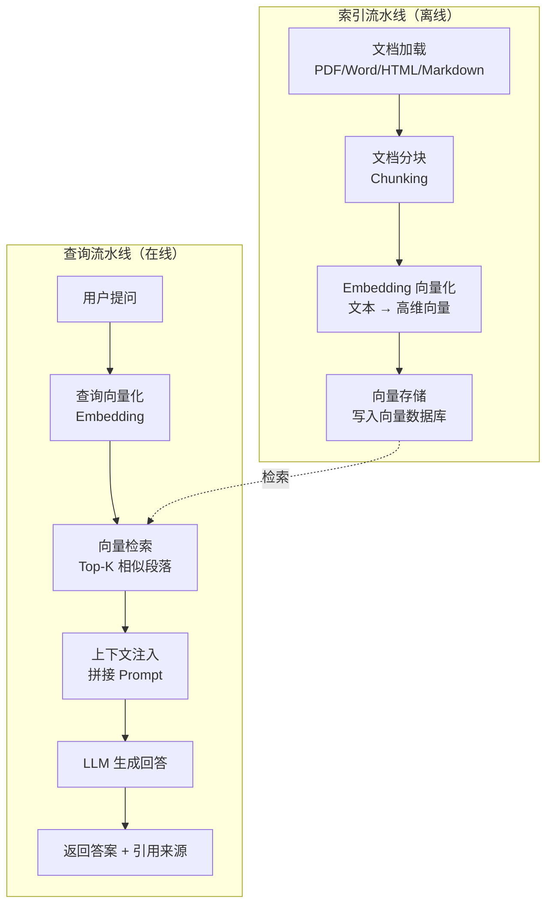
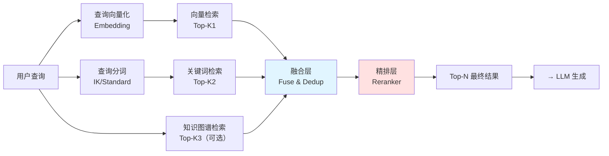
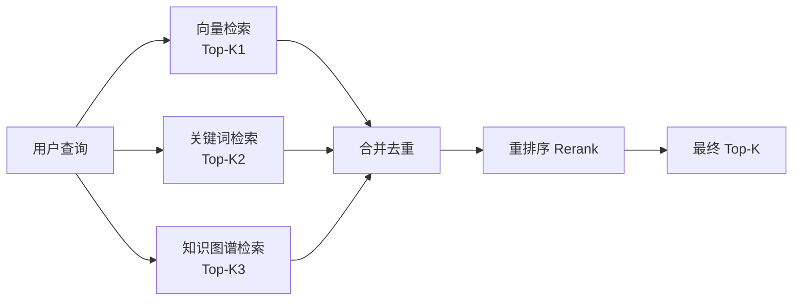
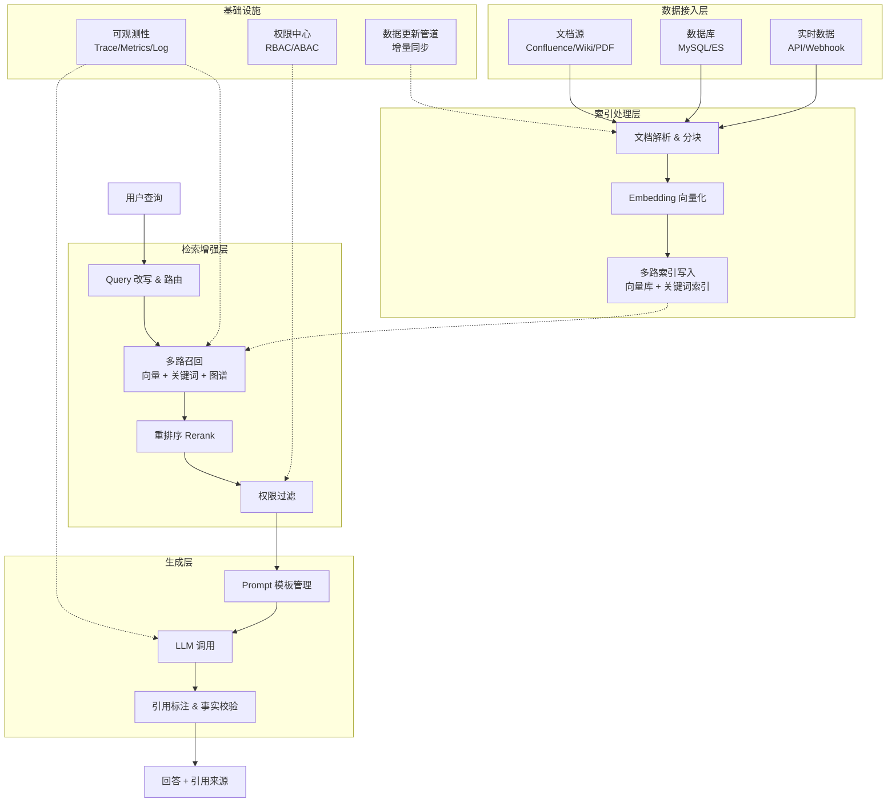

# 7.1 RAG 实战——检索增强生成

> **一句话定位**：LLM（Large Language Model，大语言模型）很强，但它不知道你的私有数据、会编造事实、知识有截止日期。RAG（Retrieval-Augmented Generation，检索增强生成）就是让 LLM "开卷考试"——先从你的知识库里检索相关内容，再让 LLM 基于检索结果生成回答。这一节站在后端工程师的视角，讲清楚 RAG 的完整流程、每个环节的工程决策，以及企业级架构的落地。

---

## 一、为什么需要 RAG

### 1.1 LLM 的三大局限

直接用 LLM 回答业务问题，会遇到三个硬伤：

| 局限 | 表现 | 后端类比 |
|------|------|---------|
| **知识截止（Knowledge Cutoff）** | 模型训练数据有截止日期，不知道最新事件 | 像一个只读了去年文档的运维，不知道今天刚发的版 |
| **幻觉（Hallucination）** | 模型会一本正经地编造不存在的事实 | 像 RPC 调用超时后返回了一个"看起来合理但完全捏造"的响应 |
| **无法访问私有数据** | 模型没见过你的内部文档、数据库、业务系统 | 像一个新来的实习生，能力强但完全不了解公司业务 |

### 1.2 RAG 的核心思路

RAG 的思路极其朴素：**别让模型"裸考"，给它开卷**。

```
传统 LLM 调用（闭卷考试）：
  用户提问 → LLM 直接回答 → 可能瞎编

RAG（开卷考试）：
  用户提问 → 先查知识库找到相关段落 → 把段落塞进 Prompt → LLM 基于段落回答
```

用后端的思维来理解：RAG ≈ **带缓存的微服务调用**——先用用户请求去查本地知识库（缓存命中），再把检索到的内容作为上下文传给 LLM（回源生成）。LLM 本身不变，变的是你给它喂了什么上下文。

### 1.3 RAG vs 微调（Fine-tuning）

| 维度 | RAG | 微调（Fine-tuning） |
|------|-----|-------------------|
| **解决什么** | 知识时效性、私有数据接入、减少幻觉 | 改变模型的行为风格、领域适配、特定任务能力 |
| **数据更新** | 实时更新知识库即可，无需重训 | 需要重新训练或增量训练 |
| **成本** | 低（只需向量数据库 + 检索逻辑） | 高（需要 GPU 训练 + 数据标注） |
| **可解释性** | 强（能溯源到具体文档段落） | 弱（知识"焊"在权重里，无法溯源） |
| **幻觉控制** | 较好（有出处可查） | 一般（可能学到了错误模式） |
| **适合场景** | 企业知识问答、文档检索、客服 | 专业领域术语、输出格式定制、特定语言风格 |

**经验法则**：知识问题用 RAG，能力/风格问题用微调。两者不互斥——先用微调让模型"懂行话"，再用 RAG 给它"最新资料"，是很多企业的最终选择。

---

## 二、RAG 核心流程

### 2.1 完整流程图

RAG 分为两条流水线：**索引流水线**（离线，建库）和**查询流水线**（在线，问答）。


```mermaid
graph TB
    subgraph 索引流水线["索引流水线（离线）"]
        A["文档加载<br/>PDF/Word/HTML/Markdown"] --> B["文档分块<br/>Chunking"]
        B --> C["Embedding 向量化<br/>文本 → 高维向量"]
        C --> D["向量存储<br/>写入向量数据库"]
    end

    subgraph 查询流水线["查询流水线（在线）"]
        E["用户提问"] --> F["查询向量化<br/>Embedding"]
        F --> G["向量检索<br/>Top-K 相似段落"]
        G --> H["上下文注入<br/>拼接 Prompt"]
        H --> I["LLM 生成回答"]
        I --> J["返回答案 + 引用来源"]
    end

    D -.->|"检索"| G
```

### 2.2 用后端架构类比

| RAG 环节 | 后端类比 | 说明 |
|----------|---------|------|
| 文档加载 | 数据采集 ETL | 从多数据源拉取原始数据 |
| 文档分块 | 分库分表 | 把大文档拆成可管理的小单元 |
| Embedding | 建索引（B+ Tree / 倒排索引） | 把文本变成可快速检索的向量表示 |
| 向量存储 | 写入存储引擎 | 持久化到向量数据库 |
| 向量检索 | ES 全文搜索 | 根据查询找到最相似的 Top-K 条记录 |
| 上下文注入 | 请求参数组装 | 把检索结果拼成 LLM 能理解的 Prompt |
| LLM 生成 | 调用下游微服务 | 把组装好的请求发给 LLM，拿到响应 |

---

## 三、文档分块策略

### 3.1 为什么要分块

分块（Chunking）是 RAG 中影响检索质量最关键的环节之一，原因有二：

1. **LLM 上下文窗口限制**：即使是 128K 窗口的模型，塞入整本手册也不现实——成本高且注意力会稀释
2. **检索精度**：如果一整篇 50 页文档存为一个向量，检索时无法定位到具体段落；分成小块后，每块向量语义集中，检索更精准

### 3.2 分块方法对比

| 方法 | 原理 | 优点 | 缺点 | 适用场景 |
|------|------|------|------|---------|
| **固定长度分块** | 按固定字符数/token 数切割 | 实现简单、速度快 | 可能切断句子和段落 | 纯文本、格式统一的日志 |
| **递归字符分块** | 按分隔符层级递归切割（段落 → 句子 → 字符） | 尽量保持语义完整 | 需要调分隔符和块大小 | 通用文本（LangChain 默认） |
| **语义分块** | 用 Embedding 计算相邻句子相似度，相似度骤降处切割 | 语义边界最自然 | 计算成本高 | 高质量问答场景 |
| **按文档结构分块** | 按 Markdown 标题、HTML 标签、PDF 章节切割 | 保留文档层级结构 | 依赖文档格式规范 | 技术文档、手册、论文 |

### 3.3 分块大小与重叠窗口

**分块大小**是一个需要权衡的核心参数：

```
块太大（如 4096 tokens）：
  ✗ 检索时一个块包含太多信息，向量被"稀释"，语义不集中
  ✗ 浪费 LLM 上下文窗口

块太小（如 128 tokens）：
  ✗ 上下文断裂，"张三负责的项目"可能和"项目预算"分在两块
  ✗ 需要检索更多块才能拼出完整信息

经验值：512 ~ 1024 tokens（中英文混合可偏大一些）
```

**重叠窗口（Overlap）**：相邻块之间保留一部分重复内容，防止在切割边界丢失上下文。通常设置为块大小的 10%~20%。

```
块1: [AAAA BBBB CCCC]
块2:           [CCCC DDDD EEEE]   ← CCCC 是重叠部分
块3:                      [EEEE FFFF GGGG]
```

### 3.4 代码示例：递归字符分块

```python
# 伪代码：递归字符分块（LangChain RecursiveCharacterTextSplitter 的核心逻辑）

def recursive_split(text, chunk_size=512, chunk_overlap=64, separators=None):
    """递归字符分块：按分隔符优先级逐层切割，尽量在自然边界处分块"""
    if separators is None:
        separators = ["\n\n", "\n", "。", ".", " ", ""]  # 从大到小

    # 用第一个能切出足够小块的分隔符
    for sep in separators:
        if sep == "":
            # 兜底：按字符硬切
            chunks = [text[i:i+chunk_size] for i in range(0, len(text), chunk_size)]
            break
        splits = text.split(sep)
        # 如果切出来的块仍然太大，换更细的分隔符
        if any(len(s) > chunk_size for s in splits):
            # 递归处理超大的子块
            result = []
            for s in splits:
                if len(s) > chunk_size:
                    result.extend(recursive_split(s, chunk_size, chunk_overlap, separators[1:]))
                else:
                    result.append(s)
            splits = result
        # 把小块合并到 chunk_size 附近，保留 overlap
        chunks = merge_with_overlap(splits, sep, chunk_size, chunk_overlap)
        break

    return chunks

def merge_with_overlap(splits, sep, chunk_size, overlap):
    """将切分后的小片段合并为目标大小的块，块间保留重叠"""
    chunks = []
    current = ""
    for s in splits:
        candidate = current + sep + s if current else s
        if len(candidate) <= chunk_size:
            current = candidate
        else:
            if current:
                chunks.append(current)
            # overlap：从当前块的尾部截取 overlap 长度作为下一块的头部
            current = current[-overlap:] + sep + s if overlap else s
    if current:
        chunks.append(current)
    return chunks
```

---

## 四、Embedding 与向量检索

### 4.1 什么是 Embedding

Embedding（嵌入）是将文本映射为高维浮点数向量的过程。核心直觉：**语义相似的文本，向量距离近；语义无关的文本，向量距离远**。

```
"如何部署 Java 微服务"   → [0.12, -0.34, 0.56, ..., 0.78]  (768 维)
"Java 服务上线流程"      → [0.15, -0.31, 0.52, ..., 0.75]  (768 维) ← 和上面很接近
"今天天气不错"           → [-0.89, 0.42, -0.11, ..., 0.03] (768 维) ← 和上面差很远
```

**Java 类比**：Embedding 类似 `hashCode()`——都是把复杂对象映射为数值向量。但有关键区别：

| | `hashCode()` | Embedding |
|--|-------------|-----------|
| 目标 | 均匀分布，减少哈希冲突 | 语义聚类，相似文本向量靠近 |
| 维度 | 1 维（int） | 几百到几千维（float 向量） |
| 可逆性 | 不可逆 | 不可逆（但保留了语义信息） |
| 用途 | 哈希表定位 | 语义相似度检索 |

### 4.2 常用 Embedding 模型

| 模型 | 维度 | 特点 | 适用场景 |
|------|------|------|---------|
| **OpenAI text-embedding-3** | 1536 / 3072 | 效果好、多语言、但需调 API、数据出境 | 对效果要求高、可接受 API 依赖 |
| **BGE（BAAI General Embedding）** | 768 / 1024 | 中文效果优秀、开源可私有部署 | 中文场景首选开源方案 |
| **M3E** | 768 | 中文社区流行、适合通用问答 | 中文通用问答 |
| **GTE（General Text Embeddings）** | 768 / 1024 | 阿里达摩院出品、多语言 | 中英混合场景 |

> **选型建议**：国内企业优先考虑 BGE 或 GTE——效果好且能私有化部署，避免数据出境问题。

### 4.3 向量数据库对比

向量数据库专门优化了"在高维空间中找最相似的 K 个向量"这一操作（ANN，Approximate Nearest Neighbor，近似最近邻搜索）。

| 向量数据库 | 部署方式 | 特点 | 适用场景 |
|-----------|---------|------|---------|
| **Milvus** | 自部署 / 云托管 | 开源、存算分离分布式架构、支持亿级向量、索引类型最全 | 大规模生产环境 |
| **Qdrant** | 自部署 / 云托管 | Rust 实现、内存效率高、**带过滤的向量检索性能极强** | 需要强属性过滤的场景 |
| **pgvector** | PostgreSQL 扩展 | 复用现有 PG 实例、向量与业务数据同库事务 | 千万级以下、已有 PG 基建 |
| **Pinecone** | 全托管 SaaS | 零运维、API 简单、按量付费 | 快速验证、不想运维 |
| **Weaviate** | 自部署 / 云托管 | 内置混合检索（向量 + 关键词）、支持 GraphQL | 需要混合检索的场景 |
| **Chroma** | 嵌入式 / 本地 | 轻量、Python 友好、开发体验好 | 原型开发、小规模 |
| **FAISS** | 库（非数据库） | Meta 开源、纯计算库、极致性能、无持久化 | 已有自己的存储层、只需要检索能力 |

> **后端类比**：FAISS 是"库"（类似 Java 的 [Lucene](../part3-java-deep/A5-ElasticSearch.md#612-底层存储引擎lucene-到底长什么样)），Milvus/Pinecone 是"数据库"（类似 ES）。这个类比很贴切——Lucene 只提供索引和检索能力，分布式、分片、副本、REST API 都是 ES 在它之上加的；FAISS 与 Milvus 的关系完全相同。

**选型决策树**：

```
数据量 < 100 万，已有 PostgreSQL
  → pgvector（不引入新组件，向量和业务数据同库，可用事务保证一致性）

数据量 100 万 ~ 1 亿，需要按标签/时间/租户强过滤
  → Qdrant（过滤与向量检索融合执行，不会像其他库那样先检索后过滤丢召回）

数据量 > 1 亿，需要分布式扩展、多索引类型、多租户
  → Milvus（存算分离，可独立扩 Query Node / Data Node）

只需要检索能力，存储自己管
  → FAISS（嵌入到自己的服务里，性能最优但要自己做持久化和分布式）
```

> **pgvector 的关键限制**：向量检索在 PG 里是单进程执行，无法像 Milvus 那样横向扩展 Query Node。当向量数超过千万级或 QPS 要求超过百级时，PG 的单机瓶颈会显现。它的价值在于「省一个组件」，而不是「性能更好」。

### 4.4 ANN 索引算法深入

暴力检索（Brute Force / FLAT）需要把查询向量和库里每一个向量都算一次距离——100 万条 1024 维向量，单次查询要做 10 亿次浮点乘法。ANN 索引的本质是**用一点点召回率换取几个数量级的速度提升**。

#### 4.4.1 三大索引家族

| 索引家族 | 核心思路 | 代表 | 类比 |
|---------|---------|------|------|
| **暴力检索** | 全量计算，100% 准确 | FLAT | 全表扫描 |
| **聚类倒排** | 先聚类分桶，只搜最近的几个桶 | IVF_FLAT / IVF_PQ / IVF_SQ8 | 分区表 + 分区裁剪 |
| **图索引** | 构建近邻图，从入口点贪心走到目标 | HNSW / NSG / DiskANN | 跳表的高维推广 |
| **哈希/量化** | 把向量压缩成短码，牺牲精度换内存 | LSH / PQ / SQ | 有损压缩 |

#### 4.4.2 HNSW 原理——高维空间的跳表

HNSW（Hierarchical Navigable Small World，分层可导航小世界图）是当前生产环境最主流的向量索引。理解它最好的切入点是**跳表**（详见 [A1 核心数据结构](../part3-java-deep/A1-核心数据结构原理.md)）。

```
跳表（一维有序）：            HNSW（高维无序）：

Level 2:  1 --------→ 9      Level 2:  ●-----------●     稀疏层，长距离跳跃
          ↓          ↓                 ↓           ↓
Level 1:  1 --→ 5 --→ 9      Level 1:  ●----●------●     中等密度
          ↓     ↓    ↓                 ↓    ↓      ↓
Level 0:  1→3→5→7→9→11      Level 0:  ●-●-●-●-●-●-●     全量节点，稠密近邻图

跳表靠"值的大小"决定往左还是往右
HNSW 靠"向量距离"决定往哪个邻居走

竖线 ↓ 表示【同一个节点】在不同层的身份，不是两个不同的点
```

**核心机制**：

- **分层构建**：每个向量插入时，以指数衰减的概率决定它出现在第几层（和跳表的抛硬币一样）。顶层节点少、连接长；底层包含全部节点、连接短。
- **查询流程**：从顶层的入口点出发，在当前层贪心地走向距离查询向量更近的邻居，走不动了就下沉一层继续，直到 Level 0 收敛。
- **为什么快**：顶层的长连接让查询一开始就能"跨越大半个空间"，避免在底层一步步爬。查询复杂度从 O(N) 降到约 O(log N)。

**空间是怎么"分层"的**——这是最容易误解的地方：**分层不是对空间的划分，而是对节点的抽样。**

```
❌ 错误理解：像地图缩放那样，把空间切成粗/中/细三块区域
✓ 正确理解：所有层覆盖【同一个完整空间】，只是节点密度不同

  Level 2: 从全部节点中随机抽 ~0.01%  → 散布在整个空间，彼此距离远
  Level 1: 从全部节点中随机抽 ~2%     → 散布在整个空间，密度中等
  Level 0: 100% 节点                  → 完整的稠密近邻图
```

层数由**纯随机**决定，和向量在空间中的位置**毫无关系**：

```python
# 插入每个节点时掷一次"指数分布的骰子"
level = floor(-ln(uniform(0,1)) * mL)      # mL = 1/ln(M)，归一化因子

# M=16 时的实际分布：
#   Level 0 : 100%      （所有节点必然在 Level 0）
#   Level 1 : ~6.25%
#   Level 2 : ~0.39%
#   Level 3 : ~0.024%
```

**关键推论：一个节点会同时存在于多个层。** 如果节点 A 掷出 level=2，那么 A 同时出现在 Level 2、Level 1、Level 0 里——**是同一个向量、同一份数据，只是在不同层拥有不同的邻居集合**（上层邻居稀疏而远，下层邻居稠密而近）。

所以上面那张 ASCII 图里，Level 2 的 `●` 和 Level 0 的某些 `●` **是同一批点**，图里的竖线 `↓` 表示的正是"同一个节点在不同层的身份"，而不是两个不同的点。

**为什么随机抽样就能形成"长距离跳跃"**：因为上层节点稀少，它们之间即使连"最近的 M 个邻居"，这些邻居在空间中也隔得很远——**稀疏性自动产生了长边**，不需要刻意设计。

**查询时到底何时下降**——不是"逐个找完再下降"，而是**在当前层贪心走到局部最优就立刻下降**：

```
查询向量 q，从 Level 2 的固定入口点 ep 出发：

  ┌─ 在当前层循环：
  │    看当前节点的所有邻居
  │    如果某个邻居比当前节点更接近 q → 移动过去，继续循环
  │    如果【所有邻居都不如当前节点近】→ 本层到此为止（局部最优）
  └─ 把这个局部最优点作为【下一层的入口点】，下降一层

  Level 2：走 2~3 步就走不动了 → 得到粗略位置，下降
  Level 1：以上层结果为起点，走几步 → 更精确，下降
  Level 0：以上层结果为起点，用 efSearch 大小的候选队列做
           更充分的搜索 → 返回 Top-K
```

注意两个细节：**上层每次只保留 1 个最优点**（`ef=1`，纯粹为了导航定位），**只有 Level 0 才用 `efSearch` 维护一个候选队列**做真正的 Top-K 搜索。这解释了为什么 `efSearch` 只影响最底层的搜索质量——上层的任务只是"把你送到正确的邻域"。

用地理类比：**Level 2 像坐飞机跨省，Level 1 像开车进城，Level 0 像步行找门牌号**。飞机不会送你到家门口，它只负责让你别在错误的省份里步行。

**下降的判据只有一条**——把上面的循环写成可执行的判断：

```
在 Level 2，当前节点 = A，查询向量 = q

  ① 算 d(A, q)                      ← 当前最优距离
  ② 取 A 的全部邻居，逐个算 d(ni, q)
  ③ 取其中最小的 d(best, q)

  ④ d(best, q) <  d(A, q)  → 移动到 best，回到 ①（继续本层）
     d(best, q) ≥ d(A, q)  → 所有邻居都不比 A 近
                            → A 是本层局部最优，下降一层，以 A 为新入口
```

**没有步数限制、没有距离阈值、没有超时**，纯粹看"还能不能变近"。走个例子：

```
第 1 步：当前 ep，d=100，邻居距离 [85, 120, 95, 200] → 85 < 100，移动
第 2 步：当前 A， d=85， 邻居距离 [70, 90, 88, 150]  → 70 < 85， 移动
第 3 步：当前 B， d=70， 邻居距离 [72, 95, 80, 110]  → 72 ≥ 70，停！
        → B 是 Level 2 局部最优，下降到 Level 1，从 B 继续
```

注意「走不动」**不代表 B 是全局最近邻**，只代表**在这个稀疏层的分辨率下已经无法改进**。下降到 Level 1 后节点密度提升约 16 倍，之前"看不见"的中间节点出现，又能继续变近了。这正是地图缩放的逻辑——在省级地图上定位到杭州后，再怎么拖动也精确不到街道，必须换街道级地图。

##### 每一步到底算多少次距离

这是理解"为什么快"的核心，也是最容易想错的地方：**任何一层都不需要计算全层节点的距离。**

```
❌ 错误理解：Level 2 算完所有节点的距离，找出最近的，再下降
✓ 正确理解：从【固定入口点】出发，每步只算【当前节点的邻居】

  索引维护一个全局固定入口点 ep（层数最高的那个节点）
  → 不管查什么向量，都从这同一个点出发，不需要计算就能确定起点

  每一步的代价 = M 次距离计算（常数）
  与该层有多少节点【完全无关】
```

一次完整查询的实际计算量（1000 万向量，M=16，efSearch=100）：

```
  Level 3~1（导航层）：每层走几步    → 合计约 100~300 次距离计算
  Level 0  （搜索层）：efSearch 队列 → 约 1000~3000 次距离计算
  ─────────────────────────────────────────────────────
  总计约几千次        vs   暴力检索 1000 万次   → 快约 3000 倍
```

**任何一层都没有出现"节点总数"这个量级的计算**——Level 2 有 4 万个节点，你可能只碰了 48 个（3 步 × 16 邻居）。如果每层都要全扫，分层就毫无意义了。

> **与 IVF 的根本差异**：IVF 反而**有**全量扫描环节——必须和全部 `nlist` 个簇心比一遍距离，才能选出最近的 `nprobe` 个簇。只不过簇心数量（几千）远小于向量总数。**HNSW 是"摸着邻居走路"，IVF 是"先全局比簇心再局部暴力扫"**，这是两种索引最本质的区别。

##### 存储结构：每层各存一份邻居列表

既然一个节点同时存在于多层，它的邻居怎么存？**向量只存一份，邻居列表每层各存一份**：

```
节点 A（level = 2）的实际存储：

  向量数据          : [0.12, -0.34, ...]              ← 只存一份
  Level 2 的邻居列表: [id_7, id_92]                    ← 最多 M 个
  Level 1 的邻居列表: [id_23, id_51, id_88, ...]       ← 最多 M 个
  Level 0 的邻居列表: [id_5, id_11, id_19, ...]        ← 最多 2M 个
```

Level 0 的连接数是 `2M` 而非 `M`，因为底层承担精确定位，需要更密的连边保证连通性和精度。

**各层的邻居是包含关系吗**——这里要精确区分两件事：

```
节点集合：严格嵌套    Level 2 ⊂ Level 1 ⊂ Level 0
邻居列表：不保证包含，但通常高度重叠
```

原因是**邻居列表有大小上限**。A 在 Level 2 的邻居 P，到了 Level 1 候选集扩大 16 倍，可能冒出更近的新节点把 P 挤掉；到 Level 0 再扩大 16 倍，竞争更激烈。

**而且"被挤掉"恰恰是应该发生的**：Level 2 的邻居在稀疏层算"最近"，但绝对距离可能很远（比如 500）；Level 0 的邻居距离可能只有 20。如果 Level 0 硬要保留那个 500 距离的点，就浪费了一个宝贵的邻居名额——**每层的邻居质量应当匹配该层的任务：上层要长边跨越空间，下层要短边精确定位。**

多层邻居的内存开销很小，因为上层节点呈指数衰减：

```
1000 万向量，M=16

  Level 0：1000 万 × 32 邻居 × 4B = 1280 MB   ← 占图结构的 97%
  Level 1：约 62 万 × 16 × 4B     =   40 MB
  Level 2：约 4 万  × 16 × 4B     =  2.5 MB
  Level 3：约 2400  × 16 × 4B     = 0.15 MB
  ────────────────────────────────────────
  图结构合计 ≈ 1.3 GB
  而向量本身：1000万 × 1024 × 4B ≈ 41 GB      ← 大 30 倍
```

> **推论：省内存要靠量化，不是调小 `M`。** 向量数据是图结构的 30 倍，FP32 → int8 直接省 4 倍（约 30GB），而把 `M` 从 32 砍到 16 只省 0.6GB 却显著损害召回率。这也是下面内存估算公式直接按 Level 0 的 `2M` 计算、忽略上层的原因。

**Small World 的含义**：图中任意两点间的平均路径长度很短（六度分隔理论），这靠的是在构建时**同时保留近距离连接（保证精度）和少量远距离连接（保证可达性）**。如果只连最近的邻居，图会退化成一堆孤立的簇，查询会卡在局部最优。

实际的 HNSW 用的是**邻居选择启发式**（`SELECT-NEIGHBORS-HEURISTIC`），而不是简单取最近的 M 个：

```
简单策略「取最近 M 个」的问题：
  这 M 个可能全挤在同一个方向上 → 另一侧完全没有边 → 那片区域走不过去

启发式策略：
  若候选 c 到【已选邻居】的距离，比 c 到 A 的距离还近
  → 说明 c 所在方向已被覆盖，跳过它，改选方向不同的候选
  → 保证邻居在各个方向上分散，图不会退化成孤立簇
```

#### 4.4.3 HNSW 三大核心参数

这是面试和调优的重点：

| 参数 | 含义 | 影响 | 典型值 |
|------|------|------|-------|
| **M** | 每个节点在 Level 0 以上的最大连接数（Level 0 为 `2*M`） | ↑ 精度↑、内存↑、构建慢 | 16 ~ 48 |
| **efConstruction** | 构建索引时的候选队列大小 | ↑ 图质量↑、构建极慢；**不影响查询速度** | 100 ~ 500 |
| **efSearch** | 查询时的候选队列大小 | ↑ 召回率↑、查询慢；**运行时可调** | 从 `top_k` 起，按需调到 100~500 |

**`M` 是什么**——**每个节点最多连多少个邻居**，也就是图的边密度。它是图的**物理结构参数**，建索引时写死。

```
M = 16 的含义：
  Level 1 及以上：每个节点最多 16 个邻居
  Level 0：       每个节点最多 32 个（2M，底层需要更密的边保证精度）

M 越大 → 每个节点的"出路"越多
  ① 召回率↑    路径选择多，不易困在局部最优
  ② 内存↑      邻居列表变长
  ③ 查询变慢   每一步要算 M 次距离，M 大则每步更贵
  ④ 构建变慢   每个节点要挑更多邻居

M 太小（如 4） → 图接近断裂，很多区域走不到，召回率暴跌
M 太大（如 96）→ 收益饱和，纯粹浪费内存和延迟
```

经验规律：**向量维度越高、数据分布越复杂，`M` 要越大**。1024 维通常取 32。

**`efConstruction` 用在哪个阶段**——**只在建索引阶段，查询时完全不起作用**。理解它的关键在于：**给新节点找邻居这件事，本身就是一次 HNSW 查询。**

```
插入新节点 X 的完整流程：

  ① 掷骰子决定 X 的层数，比如 level = 1
  ② 从顶层入口点出发，一路导航到 Level 1
  ③ 在 Level 1 执行一次搜索，队列大小 = efConstruction   ← 就是这里
     → 找出离 X 最近的一批候选点
  ④ 用邻居选择启发式，从候选中挑 M 个作为 X 的邻居
  ⑤ 【双向连边】X 连向它们，它们也要连回 X
     若某个老节点因此超过 M 个邻居，需裁剪掉最差的一个
  ⑥ 下降到 Level 0，重复 ③④⑤（这层挑 2M 个）
```

```
efConstruction = 40（偏小）
  → 候选池小，可能没找到真正的近邻
  → 挑出的 M 个邻居质量差 → 图有缺陷 → 查询时召回率上不去

efConstruction = 200（推荐基线）
  → 候选池充分，邻居质量高 → 图质量好

efConstruction = 800（过大）
  → 图质量仅提升 1~2%，构建时间涨 3 倍以上 → 不划算
```

**`efConstruction` 与 `efSearch` 是同一机制的两个应用**：

| | `efConstruction` | `efSearch` |
|---|---|---|
| 何时用 | 建索引时给新节点找邻居 | 查询时找 Top-K |
| 影响什么 | **图的质量**（永久固化进索引） | **单次查询的搜索广度** |
| 能否修改 | 改了要重建索引 | 随时可调 |
| 调大的代价 | 构建慢（几小时 → 十几小时） | 单次查询慢 |

> **一句话区分**：`efConstruction` 决定"这张图建得好不好"，`efSearch` 决定"这次查询搜得仔不仔细"。**图建坏了，再大的 `efSearch` 也救不回来**——所以只有当 `efSearch` 已调到很大（如 500）、召回率仍上不去时，才说明图本身有问题，需要提高 `efConstruction` 重建。

**`ef` 到底是什么**——`ef` = exploration factor（探索因子），本质是**候选队列的大小**，也就是「**同时保留多少条备选路线**」。

Level 0 的搜索维护两个集合：

```
candidates（待探索队列）：还没展开邻居的点，按距离排序
results   （结果集）    ：目前找到的最好的 efSearch 个点

循环：
  ① 从 candidates 取出离 q 最近的点 c
  ② 若 c 比 results 里最差的还远 → 没救了，结束
  ③ 展开 c 的邻居，算距离，有希望的放进两个集合
  ④ results 超过 efSearch 个就丢掉最差的
  ⑤ 回到 ①
最后从 results 返回 Top-K
```

关键在步骤 ①：**即使当前这条路走不动了，队列里还有别的候选可以继续尝试**——这就是导航层没有的"回头试别的路"能力。

```
efSearch = 1     → 退化成纯贪心，走进死胡同就结束，容易困在局部最优
efSearch = 100   → 保留 100 条备选路线，一条不通还能换方向 → 召回率高
efSearch = 10000 → 接近暴力检索，召回率逼近 100%，但失去 ANN 的意义
```

三个必须记住的点：**`efSearch` 必须 ≥ `top_k`**（要返回 Top-10，队列至少装得下 10 个）；**它只影响 Level 0**（导航层固定 `ef=1`）；**它可运行时调整、无需重建索引**——这正是 [7.11 检索平台工程](./11-检索平台工程.md)把「动态降 `efSearch`」作为降级手段的原因：高峰期调小立刻降延迟，代价是召回率略降。

> `efConstruction` 是同一机制的构建版：建索引时为每个新节点找邻居也要跑一次类似搜索，`efConstruction` 就是那次搜索的队列大小。队列越大找到的邻居越优质、图质量越高，但构建越慢。
>
> **本质区别**：`M` / `efConstruction` 决定**索引的物理结构**（改了要重建，几小时起步）；`efSearch` 只是**查询时的一个参数**（随时可调）。

```
内存估算（重要，容易被面试问到）：

  单条向量内存 ≈ 向量本身 + 图连接
                = dim × 4 字节(FP32) + M × 2 × 4 字节(邻居 ID)

  例：1000 万条 × 1024 维 × FP32，M=32
    向量：1000万 × 1024 × 4B  = 40.96 GB
    图：  1000万 × 32 × 2 × 4B = 2.56 GB
    合计约 43.5 GB —— 必须常驻内存，这是 HNSW 最大的成本
```

> **工程要点**：`efConstruction` 只在建索引时生效，`efSearch` 在查询时生效。这意味着 **`efSearch` 可以按业务场景动态调整**——离线批量任务调大追求召回，在线实时接口调小保延迟。很多团队不知道这点，把两个参数混为一谈。

#### 4.4.4 IVF 系列——用分区裁剪的思路做向量检索

IVF（Inverted File Index）的思路对后端工程师最亲切：**先把向量空间用 K-Means 聚成 `nlist` 个簇，查询时只搜距离最近的 `nprobe` 个簇**。这就是分区表的分区裁剪。

```
建索引：K-Means 把 1000 万向量聚成 nlist=4096 个簇
        每个簇约 2400 条向量，记录簇心

查询：  ① 算查询向量到 4096 个簇心的距离（4096 次计算，很快）
        ② 取最近的 nprobe=32 个簇
        ③ 只在这 32 个簇内暴力检索（32 × 2400 ≈ 7.7 万次，而非 1000 万次）

        召回率损失来源：目标向量落在第 33 个近的簇里 → 被漏掉
```

| 变体 | 向量存储方式 | 内存 | 精度 | 适用 |
|------|------------|------|------|------|
| **IVF_FLAT** | 原始 FP32 向量 | 高（等同原始数据） | 最高 | 内存充足，要精度 |
| **IVF_SQ8** | 标量量化到 int8 | 约为 FLAT 的 1/4 | 略降（通常 <1%） | **性价比最优，生产首选** |
| **IVF_PQ** | 乘积量化，切分子空间后码本编码 | 可压到 1/32 | 明显下降 | 超大规模、内存极度受限 |

#### 4.4.5 HNSW vs IVF 选型对比

| 维度 | HNSW | IVF_FLAT / IVF_SQ8 |
|------|------|-------------------|
| **查询延迟** | 更低（图跳转） | 略高（需扫多个簇） |
| **召回率** | 同等延迟下更高 | 需调大 `nprobe` 才能追上 |
| **内存占用** | 高（向量 + 图结构） | 较低（尤其 SQ8/PQ） |
| **构建速度** | 慢（逐条插入建图） | 快（一次 K-Means） |
| **增量写入** | 支持，但图质量会随插入退化 | 需要定期重训簇心 |
| **删除** | 通常标记删除，需定期重建 | 同样标记删除 |

**经验法则**：

```
QPS 高、延迟敏感、内存充足        → HNSW
数据量极大、内存是瓶颈             → IVF_SQ8（或 IVF_PQ）
数据量 < 100 万                   → FLAT 就够了，别过度优化
写入频繁、需要近实时可见           → IVF 系列 + 定期重建，或用 Milvus 的增量段机制
```

> **反直觉的一点**：数据量小的时候（几万到几十万），FLAT 暴力检索往往比 HNSW 更快——因为 HNSW 的图跳转有随机内存访问开销，而暴力检索是连续内存扫描，对 CPU 缓存和 SIMD 极度友好。**不要在小数据集上过早引入 ANN 索引。**

### 4.5 索引调优实践

#### 4.5.1 调参的正确顺序

```
① 先确定业务的召回率底线（如 Recall@10 ≥ 0.95）
   → 用 FLAT 暴力检索的结果作为 Ground Truth

② 固定 M=16、efConstruction=200 建一版索引

③ 只调 efSearch，画出「efSearch - 召回率 - 延迟」曲线
   → 找到满足召回率底线的最小 efSearch

④ 如果延迟仍超标 → 回头调大 M（16→32），重建索引，回到步骤 ③
   如果内存超标   → 换 IVF_SQ8，或降低 Embedding 维度

⑤ 上线后监控真实查询的召回率（定期抽样和 FLAT 对比）
```

> **最常见的错误**：一上来就把 `M` 和 `efConstruction` 调到很大，导致索引构建要跑十几个小时，却没意识到 `efSearch` 才是查询侧的主要杠杆，而且它不需要重建索引。

#### 4.5.2 带过滤的向量检索（Filtered Search）

这是生产环境最容易踩坑的地方。业务场景几乎总是"在**某个租户**的、**某个时间范围**内的文档里做语义检索"。三种实现方式：

| 策略 | 做法 | 问题 |
|------|------|------|
| **后过滤（Post-filter）** | 先 ANN 检索 Top-K，再用条件过滤 | **召回塌陷**——如果 Top-100 里只有 2 条满足条件，就只剩 2 条结果 |
| **前过滤（Pre-filter）** | 先用条件筛出子集，再在子集内暴力检索 | 子集大时退化成暴力检索，慢 |
| **过滤感知遍历** | 在图遍历/簇扫描过程中实时判断条件 | 实现复杂，但兼顾召回和性能 |

**Qdrant 在这一点上有明显优势**——它把 payload 过滤条件下推到 HNSW 图遍历过程中，并会根据过滤条件的选择性（selectivity）自动在「图遍历 + 过滤」和「直接暴力扫子集」之间切换。Milvus 通过 Partition（按租户/时间分区）来缓解这个问题，本质是把过滤转化为分区裁剪。

```
多租户 RAG 的实践建议：

  租户数少（< 1000）、单租户数据量大
    → 物理隔离：每个租户一个 Collection（Milvus）/ 一个 Collection（Qdrant）
    → 优点：过滤开销为零、租户间完全隔离、可独立扩缩容
    → 参见 6.17 多租户与权限体系的隔离方案对比

  租户数多（万级）、单租户数据量小
    → 逻辑隔离：单 Collection + tenant_id 作为过滤字段
    → 必须用支持过滤感知遍历的引擎，否则召回塌陷
```

#### 4.5.3 pgvector 的索引选择

pgvector 提供两种索引，语法上就是 PostgreSQL 的标准索引：

```sql
-- HNSW 索引（推荐，查询快、召回高）
CREATE INDEX ON documents
  USING hnsw (embedding vector_cosine_ops)
  WITH (m = 16, ef_construction = 64);

-- 查询时调 efSearch（会话级参数）
SET hnsw.ef_search = 100;

-- IVFFlat 索引（构建快、内存省，但召回率通常不如 HNSW）
CREATE INDEX ON documents
  USING ivfflat (embedding vector_cosine_ops)
  WITH (lists = 1000);   -- lists ≈ sqrt(行数)

SET ivfflat.probes = 32;
```

| 距离操作符 | 对应度量 | 索引 ops 类 |
|-----------|---------|------------|
| `<=>` | 余弦距离 | `vector_cosine_ops` |
| `<->` | 欧氏距离（L2） | `vector_l2_ops` |
| `<#>` | 负内积 | `vector_ip_ops` |

> **pgvector 的独特价值**：因为向量和业务数据在同一个库，可以直接写出 `WHERE tenant_id = ? AND created_at > ? ORDER BY embedding <=> ?` 这样的查询，让 PG 的查询规划器统一决定用哪个索引——**过滤和向量检索天然融合，不存在召回塌陷问题**。代价是单机性能上限低。这个权衡和 [3.9 MySQL 分库分表](../part3-java-deep/09-数据库MySQL.md) 里「不到万不得已不要分库」的逻辑是一致的。

#### 4.5.4 召回率评估方法

**召回率的准确口径**——它衡量的是「ANN 索引相对暴力检索丢了多少结果」：

```math
\text{Recall@K} = \frac{|\ \text{ANN 返回的 Top-K} \cap \text{暴力检索的 Top-K}\ |}{K}
```

**Ground Truth（真值）只能由 FLAT 暴力检索产生**——它遍历全部向量逐一算距离，结果 100% 准确，是唯一可信的基准。

```
查询 q，K = 10

  FLAT 暴力检索 Top-10（真值）：[3, 7, 12, 25, 31, 44, 58, 60, 72, 89]
  HNSW 返回 Top-10：           [3, 7, 12, 25, 31, 44, 58, 60, 72, 95]
                                                                 ↑ 错一个
  交集 9 个 → Recall@10 = 9/10 = 0.9
```

> **必须区分两种"召回率"**，混淆它们会导致优化方向完全错误：
>
> | | **ANN 召回率**（本节） | **业务召回率** |
> |---|---|---|
> | 衡量什么 | 近似算法丢了多少本该找到的向量 | 用户想要的文档有没有被找到 |
> | 基准 | FLAT 暴力检索 | 人工标注的相关文档 |
> | 取决于 | `M` / `efSearch` / 索引类型 | Embedding 模型、分块策略、Query 改写 |
> | 属性 | 纯技术指标，与业务无关 | 端到端效果指标 |
>
> **即使 ANN 召回率 = 1.0（完全等同暴力检索），如果 Embedding 模型不行，业务效果照样差。** 所以"检索效果不好"时，第一步要先分清是索引丢了结果，还是向量本身就没编码对语义——这两者的解法完全不同。

**评估必须用真实查询分布**：用随机生成的向量测出来的召回率会偏高，因为真实查询往往集中在向量空间的某些区域，那里图结构更拥挤、更容易出错。

上线前必须量化召回损失，否则「向量检索效果不好」会变成一笔糊涂账：

```python
# 用 FLAT 暴力检索作为 Ground Truth，评估 ANN 索引的召回率
def recall_at_k(ann_results, ground_truth, k):
    """
    ann_results:   ANN 索引返回的 Top-K ID 列表
    ground_truth:  FLAT 暴力检索返回的 Top-K ID 列表（真值）
    """
    hits = len(set(ann_results[:k]) & set(ground_truth[:k]))
    return hits / k

# 评估流程：
# 1. 抽样 1000 条真实查询
# 2. 每条查询分别用 FLAT 和 HNSW 检索 Top-10
# 3. 计算平均 Recall@10
# 4. 同时记录 P50 / P99 延迟
```

| 指标 | 含义 | 生产参考值 |
|------|------|-----------|
| **Recall@K** | ANN 结果与真值的重合比例 | ≥ 0.95（RAG 场景） |
| **QPS** | 每秒查询数 | 按业务定 |
| **P99 延迟** | 99 分位查询延迟 | < 100ms（在线检索） |
| **构建时间** | 索引构建耗时 | 影响数据更新频率 |
| **内存占用** | 索引常驻内存大小 | 决定单机能放多少数据 |

> **可观测性建议**：把 `efSearch`、召回率、P99 延迟这三个指标做成看板，并在每次索引重建后自动跑一次召回率回归测试。这和 [6.14 数据质量](../part6-bigdata/14-数据质量.md) 里对数据管道做质量校验是同一个思路——**检索质量也是一种数据质量**。

### 4.6 向量索引的生命周期管理

前面讲的是「索引建好之后怎么查」。但生产环境真正的工作量在**索引建起来之后怎么维护**——数据每天在变，索引会退化，重建要停服吗？这一节讲工程落地。

#### 4.6.1 建索引到底要多久

HNSW 的构建复杂度约为 $O(N \cdot \log N \cdot M \cdot \text{efConstruction})$，其中 $N$ 是向量数。实际耗时的量级感受：

```
1024 维向量，M=16，efConstruction=200，32 核机器

  100 万向量   →  约 3 ~ 8 分钟
  1000 万向量  →  约 40 ~ 90 分钟
  1 亿向量     →  约 8 ~ 15 小时（且单机内存通常已放不下，必须分片）

参数对构建耗时的影响（相对值）：
  efConstruction: 100 → 400   构建耗时约 ×3.5，召回率仅 +1~2%
  M:              16  → 48    构建耗时约 ×2.5，内存 ×2.3
```

> **这就是 [4.5.1](#451-调参的正确顺序) 强调"先调 `efSearch`"的现实原因**——`efSearch` 改一下立即生效，而 `M`/`efConstruction` 改一次要等几小时甚至一整天。**在千万级以上规模，每一次重建都是一次需要排期的运维操作，不是随手可做的调参。**

构建期间的资源占用同样要规划：CPU 会被打满（HNSW 构建是计算密集型，可多线程并行），内存峰值约为最终索引大小的 1.5 倍（构建中间态 + 最终图结构）。**如果和在线查询挤在同一批节点上，构建会直接拖垮线上延迟**——这是 §5.1 里「Milvus 索引重建导致查询超时」的根因。

#### 4.6.2 增量更新与图退化

HNSW **支持增量插入**，但代价是**图质量会缓慢退化**。理解这一点要回到它的构建逻辑：

```
HNSW 建图时，每个新节点要与已有节点建立 M 条边。
选哪 M 条？靠【当时图里已有的节点】做贪心搜索找最近邻。

  批量构建：所有向量一次性参与，每个节点的邻居是"全局视野"下选出的
  增量插入：新节点只能看到"此刻已存在"的节点
           → 后插入的节点邻居质量尚可
           → 但【早期插入的节点】无法感知后来者，边的质量越来越差
```

更严重的是**删除**。HNSW **无法真正删除节点**——删掉一个节点会破坏图的连通性，导致某些区域再也走不到。所以所有向量库都采用**标记删除**：

```
删除 doc_42
   ↓
① 在 bitmap 里标记 doc_42 已删除（图结构完全不动）
② 查询时照常遍历到 doc_42，走完它的边，但【结果里过滤掉它】
   ↓
后果：
  · 磁盘/内存不释放
  · 【查询变慢】——遍历路径上的墓碑节点仍要计算距离
  · 【召回率下降】——Top-K 里被墓碑占位，实际有效结果不足 K
```

这和 [ES Segment 的标记删除](../part3-java-deep/A5-ElasticSearch.md#65-segment-与写入性能)是完全相同的机制和代价，只是向量库的墓碑对**召回率**的伤害更直接。

**什么时候必须重建**——给几个可量化的触发条件：

| 信号 | 阈值参考 | 说明 |
|------|---------|------|
| **删除率** | > 10~20% | 最重要的指标，墓碑占比过高直接拖累召回和延迟 |
| **召回率回归** | 较基线下降 > 3% | 用固定测试集定期跑 Recall@K 对比 |
| **P99 延迟** | 较基线上涨 > 30% | 同样 `efSearch` 下延迟上涨说明图在退化 |
| **累计增量占比** | 新增 > 30% 原始规模 | 增量太多时图结构已明显偏离最优 |

> **关键实践：把这四个指标做成自动巡检 + 告警**，而不是等用户投诉"搜不准了"。检索质量的退化是**渐进且无声**的——不主动监控，你永远不会发现它。

#### 4.6.3 不停服重建：双 Collection 灰度切换

重建索引必然耗时数小时，生产环境不可能停服。标准做法是**影子索引 + 别名切换**（思路与 [ES 的 Reindex + 别名](../part3-java-deep/A5-ElasticSearch.md#62-索引设计与分片规划)完全一致）：

```
① 线上服务通过【别名】access_alias 访问 collection_v1
        ↓
② 后台创建 collection_v2，从数据源全量重建索引
   （用独立的构建节点，不占用线上 Query Node 资源）
        ↓
③ 构建期间的增量数据【双写】到 v1 和 v2
   或：记录构建起始时间戳，构建完成后追平这段时间的增量
        ↓
④ 对 v2 跑召回率回归测试 —— 【这一步是质量门禁，不能省】
   用固定测试集比对 Recall@10，不达标就不切
        ↓
⑤ 灰度切流：先切 5% 流量到 v2，观察延迟和召回指标
        ↓
⑥ 全量切换别名 access_alias → collection_v2
        ↓
⑦ 观察 24 小时无异常后，删除 collection_v1
```

```python
# Milvus 的别名切换是原子操作，这是能做灰度的前提
client.create_collection("docs_v2", schema)
build_index("docs_v2")                      # 耗时数小时
assert evaluate_recall("docs_v2") >= 0.95   # 质量门禁

client.alter_alias(collection_name="docs_v2", alias="docs")  # 原子切换
```

**代价是双份存储**——重建期间 v1 和 v2 同时存在，容量规划时必须预留这部分空间。这是"不停服"的必要成本。

对于**分区友好的场景**还有更省的做法：按时间或租户做 Partition，只重建受影响的分区，而不是整个 Collection。

#### 4.6.4 三类典型故障的根因

[7.11 §5.1](./11-检索平台工程.md) 列了故障的处置动作，这里补充**为什么会发生**：

**① 内存暴涨**

```
根因链条：
  · HNSW 图结构必须【全量常驻内存】才能保证低延迟
  · 内存占用 ≈ 向量数 × (维度 × 4字节 + M × 2 × 4字节 + 元数据)
  · 触发暴涨的三个常见原因：
      a) 墓碑累积 —— 删除的向量仍占内存，只是不返回
      b) 并发查询的临时开销 —— 每个查询要维护 efSearch 大小的候选队列，
         高并发 × 大 efSearch = 内存瞬时飙升
      c) 索引重建期间新旧索引共存 —— 内存需求翻倍

处置的优先级：
  先降 efSearch（立竿见影）→ 再清墓碑（重建）→ 最后才是扩容
```

**② 检索延迟抖动**

这是向量库最典型的"玄学问题"，实际有明确成因：

```
· 墓碑节点导致遍历路径变长（渐进式变慢，非抖动）
· 【GC 停顿】—— Java/Go 实现的向量库在大堆下的 STW
· 【冷热不均】—— 部分数据被换出内存，触发磁盘 IO（DiskANN 场景尤其明显）
· 【查询向量分布不均】—— 落在图稀疏区域的查询需要更多跳数才能收敛
· 后台 Compaction / 段合并抢占 CPU（与 ES 的 merge 风暴同理）
```

> **排查顺序**：先看 P99 与 P50 的比值（比值大说明是抖动而非整体变慢）→ 看 GC 日志和内存水位 → 看是否有后台任务在跑 → 最后才怀疑数据分布。

**③ 重建期间召回率下降**

如果没做双 Collection，直接在原索引上重建，重建过程中图结构是**不完整**的——部分节点已重新连边、部分还没有，查询走到半成品区域就会漏召回。**这正是必须用影子索引的原因**，而不是图省事原地重建。

### 4.7 混合检索——多路召回与结果融合

#### 4.7.1 三种检索方式的互补关系

| 检索方式 | 原理 | 擅长 | 不擅长 |
|---------|------|------|--------|
| **关键词检索（BM25）** | 词频 + 逆文档频率，精确匹配 | 专有名词、ID、代码、缩写 | 语义相近但措辞不同 |
| **向量检索** | 语义相似度匹配 | 同义改写、跨语言、模糊意图 | 精确匹配专有名词 |
| **混合检索（Hybrid Search）** | 向量 + 关键词多路召回后融合 | 兼顾语义和精确匹配 | 需要调融合策略 |

```
用户问："K8s Pod 一直 CrashLoopBackOff 怎么排查？"

纯关键词检索：能精确匹配 "CrashLoopBackOff" 这个术语 ✅
纯向量检索：可能匹配到 "容器反复重启的排查方法"，但错过了精确术语 ❌
混合检索：两者都召回，融合后取最优 ✅
```

**经验**：生产环境几乎都用混合检索。ES 8.x 已原生支持 KNN + BM25 + RRF 一体化（见 [A5 §6.9](../part3-java-deep/A5-ElasticSearch.md)），也可以用 ES + Milvus 两路独立召回后自行融合。

#### 4.7.2 多路召回架构

生产级的混合检索不是简单地"查两路拼一起"，而是有完整的召回-融合-精排流水线：


```mermaid
graph LR
    Q["用户查询"] --> QV["查询向量化<br/>Embedding"]
    Q --> QK["查询分词<br/>IK/Standard"]

    QV --> V["向量检索<br/>Top-K1"]
    QK --> K["关键词检索<br/>Top-K2"]
    Q --> G["知识图谱检索<br/>Top-K3（可选）"]

    V --> F["融合层<br/>Fuse & Dedup"]
    K --> F
    G --> F

    F --> R["精排层<br/>Reranker"]
    R --> T["Top-N 最终结果"]
    T --> L["→ LLM 生成"]

    style F fill:#e1f5ff
    style R fill:#ffe1e1
```

```
各路召回的典型配额：
  向量检索：   Top-50  （语义宽召回）
  关键词检索： Top-50  （精确匹配兜底）
  图谱检索：   Top-10  （结构化关系，可选）

融合后去重：100+ → ~70（向量与关键词有重叠）
精排后截断：70 → Top-5~10 （送入 LLM 的最终结果）
```

> **为什么各路召回要多取一些**：精排（Reranker）是逐对计算的 Cross-Encoder，候选数直接决定延迟。但如果召回太少，Reranker 再强也"巧妇难为无米之炊"。典型配比是每路取最终所需数的 5~10 倍，融合去重后送入精排。

#### 4.7.3 三种结果融合策略

多路召回的结果要融合成一个排序列表。这是工程上最容易被面试官追问的点——**因为分数不能直接比**。

```
问题：BM25 分数和余弦相似度不能直接比较

  BM25 分数：   典型范围 [0, ~15]，分布偏右尾
  余弦相似度：  范围 [0, 1]，分布偏左尾（大多在 0.7~0.9）

  直接加权：0.7 × BM25_score + 0.3 × cosine_score
  → BM25 的数值范围碾压余弦相似度，权重形同虚设
```

| 融合策略 | 原理 | 优点 | 缺点 | 适用 |
|---------|------|------|------|------|
| **加权融合（需归一化）** | 先把各路分数归一化到 [0,1]，再加权求和 | 直觉清晰，可调权重 | 归一化方法敏感，权重需调参 | 各路分数分布稳定 |
| **RRF（Reciprocal Rank Fusion）** | 只看排名，不看分数 | **无需归一化、鲁棒** | 丢失分数差异信息 | **生产首选** |
| **级联过滤** | 一路做初筛，另一路做精排 | 简单 | 浪费另一路的召回能力 | 一强一弱的场景 |

#### 4.7.4 RRF——生产环境首选的融合算法

RRF（Reciprocal Rank Fusion，倒数排名融合）的核心思想极其简单：**不看分数，只看排名**。排名越靠前贡献越大，且贡献按倒数衰减。

```
RRF 公式：

  RRF_score(d) = Σ  1 / (k + rank_i(d))
                i∈sources

  rank_i(d) : 文档 d 在第 i 路检索结果中的排名（从 1 开始）
  k         : 平滑常数（默认 60），防止排名第 1 的贡献过大
```

**注意 RRF 不是"把各路的第一名并列放到最前面"**——融合的目的是产出**唯一的一个排序**。它把每个文档在各路的排名折算成分数后**累加**，同一文档在多路出现时贡献会叠加。用一个三路的例子最能说明问题：

```
                向量召回   BM25召回   标题召回
  文档 A          1          20         -         ← 只有两路命中
  文档 B          3           2          5        ← 哪一路都不是第一
  文档 C          2           -          1
  文档 D          -           1          -        ← 单路第一名

k = 60：

  RRF(A) = 1/61 + 1/80         = 0.01639 + 0.01250           = 0.02889
  RRF(B) = 1/63 + 1/62 + 1/65  = 0.01587 + 0.01613 + 0.01538 = 0.04739  ← 最高
  RRF(C) = 1/62 + 1/61         = 0.01613 + 0.01639           = 0.03252
  RRF(D) = 1/61                                              = 0.01639  ← 最低

  最终排序：B > C > A > D
```

两个反直觉的结果值得注意：**文档 D 在 BM25 里是第一名，却排到了最后**，因为只有一路认可它；**文档 B 在任何一路都不是第一**（第 3、第 2、第 5），却夺得首位，因为三路都认可它。

> **RRF 的核心思想：共识优先于单路的极致排名。** 一个文档被多路召回同时认可，比它在某一路排第一更能说明相关性——因为不同召回路径的失效模式是独立的，能同时骗过三路的概率远低于骗过一路。

**RRF 为什么好**：

- **无需归一化**——BM25 可能是 12.3，余弦可能是 0.85，RRF 完全不关心绝对数值，只用排名
- **鲁棒**——某个引擎偶发的分数异常（如 BM25 某词的 IDF 极高导致分数飙升）不会影响融合
- **参数极少**——只有一个 `k`（默认 60），而且对结果不敏感

**为什么用倒数**——倒数产生了**边际递减**，和 [BM25 的词频饱和](../part3-java-deep/A5-ElasticSearch.md#52-k1-与-b-两个调优参数)是同一个思路：

```
  rank=1  → 1/61  = 0.01639
  rank=2  → 1/62  = 0.01613    比第 1 名仅低 1.6%
  rank=10 → 1/70  = 0.01429    比第 1 名低 13%
  rank=50 → 1/110 = 0.00909    比第 1 名低 45%

  排名越靠后，每下降一名的损失越小
  → 第 1 与第 2 难分伯仲（差距小），第 1 与第 50 差距明显
```

> **k 的真正作用是压制头部差距**：
>
> ```
> k = 0 ：rank=1 → 1.0，rank=2 → 0.5    第一名是第二名的 2 倍！
>         → 单路第一名强势主导，"多路共识"失去意义
> k = 60：rank=1 → 0.01639，rank=2 → 0.01613    仅差 1.6%
>         → 头部被拉平，共识才能起决定作用
> ```
>
> 所以 **`k` 越大越看重"出现在多少路里"，`k` 越小越看重"在单路里排多前"**。60 是原论文的经验值，**除非有明确实验数据，否则不要动它**。

**RRF 的代价是丢失分数的绝对信息**：

```
向量召回结果：
  文档 X 相似度 0.95   ← 极其相关
  文档 Y 相似度 0.31   ← 勉强沾边

在 RRF 眼里：X 是 rank=1，Y 是 rank=2，只差 1.6%
→ 那个巨大的质量鸿沟被完全抹平
```

所以当**某一路的召回质量明显优于其他路**时，加权融合（见 [4.7.5](#475-加权融合与分数归一化)）会更好——代价是必须做归一化、调权重，并有离线评估支撑。

```python
def rrf_fusion(results: dict[str, list], k: int = 60, top_n: int = 10) -> list:
    """
    results: {"vector": [(doc_id, score), ...], "bm25": [(doc_id, score), ...]}
    返回融合排序后的 Top-N
    """
    scores = defaultdict(float)
    for source, hits in results.items():
        for rank, (doc_id, _) in enumerate(hits, 1):   # rank 从 1 开始
            scores[doc_id] += 1.0 / (k + rank)

    return sorted(scores.items(), key=lambda x: -x[1])[:top_n]
```

> **ES 8.x 内置 RRF**：如果你用 ES 做混合检索，ES 8.14+ 的 `retriever` API 原生支持 RRF（见 [A5 §6.9](../part3-java-deep/A5-ElasticSearch.md) 的示例），不需要自己写融合逻辑。只有用 ES + Milvus 分离架构时才需要自己在应用层实现 RRF。

#### 4.7.5 加权融合与分数归一化

如果业务需要对各路召回的权重做精细控制（如"向量检索更重要，权重 0.7"），就必须先做分数归一化：

```python
def normalize_scores(hits: list[tuple[str, float]], method: str = "minmax") -> list[tuple[str, float]]:
    """把分数归一化到 [0, 1]"""
    if not hits:
        return hits
    scores = [s for _, s in hits]
    lo, hi = min(scores), max(scores)

    if method == "minmax":
        return [(doc_id, (s - lo) / (hi - lo + 1e-9)) for doc_id, s in hits]
    elif method == "zscore":
        mu, sigma = statistics.mean(scores), statistics.stdev(scores)
        # z-score → sigmoid 映射到 [0,1]
        return [(doc_id, 1 / (1 + math.exp(-(s - mu) / (sigma + 1e-9)))) for doc_id, s in hits]

def weighted_fusion(results: dict, weights: dict, top_n: int = 10) -> list:
    """
    results:  {"vector": [(doc_id, score), ...], "bm25": [(doc_id, score), ...]}
    weights:  {"vector": 0.7, "bm25": 0.3}
    """
    normalized = {
        src: dict(normalize_scores(hits)) for src, hits in results.items()
    }
    combined = defaultdict(float)
    for src, weight in weights.items():
        for doc_id, score in normalized[src].items():
            combined[doc_id] += weight * score
    return sorted(combined.items(), key=lambda x: -x[1])[:top_n]
```

| 归一化方法 | 特点 | 适用 |
|-----------|------|------|
| **Min-Max** | 简单，但受极端值影响大（一个异常高分把其他都压成 0） | 分数分布均匀 |
| **Z-Score + Sigmoid** | 对极端值鲁棒，输出平滑 | 分数有离群点 |
| **RRF（不用归一化）** | **最鲁棒，最省心** | **默认选择** |

> **选型建议**：**先用 RRF，不满意再考虑加权融合**。RRF 在绝大多数场景的效果已经足够好，加权融合的调参成本（需要离线评估不同权重的效果）往往不值得。只有当某一路召回质量明显优于另一路时，加权融合才有意义。

#### 4.7.6 Rerank 工程化

[5.4](#54-重排序reranking) 讲了 Rerank 的原理（Cross-Encoder 精排）。这里补充工程落地的关键决策。

**延迟预算**——这是 Rerank 在生产中最需要注意的点：

```
端到端检索延迟预算（P99 目标 < 200ms）：

  查询向量化（Embedding API）：  ~20ms
  向量检索 + BM25 并行：         ~30ms（并行取 max）
  融合去重：                     ~5ms
  ─── 到这里约 55ms ───
  Rerank 精排（Cross-Encoder）：  ~80ms（取决于候选数和模型）
  ─── 总计约 135ms ───
  余量：                         ~65ms（网络传输、序列化等）

  Rerank 的延迟 = 候选数 × 单次推理时间
  例：50 候选 × 1.5ms/对 = 75ms（GPU）
      50 候选 × 5ms/对  = 250ms（CPU，超预算！）
```

**控制 Rerank 延迟的三种手段**：

| 手段 | 做法 | 效果 |
|------|------|------|
| **减少候选数** | 融合后只取 Top-20 送入 Rerank，而非 100 | 延迟线性下降 |
| **批量推理** | 把 (query, doc) 对打包成一个 batch 送 GPU | GPU 利用率提升 5~10 倍 |
| **模型量化** | FP16 → INT8 量化 Reranker | 推理速度提升 2~3 倍 |

```python
# 批量推理的典型实现
def rerank_batch(query: str, candidates: list[str], model, batch_size: int = 32) -> list[tuple[str, float]]:
    """Cross-Encoder 批量精排"""
    pairs = [(query, doc) for doc in candidates]
    scores = []

    for i in range(0, len(pairs), batch_size):
        batch = pairs[i:i + batch_size]
        # Cross-Encoder 一次性处理一个 batch
        batch_scores = model.predict(batch)   # 返回 [batch_size] 的相似度
        scores.extend(batch_scores)

    ranked = list(zip(candidates, scores))
    return sorted(ranked, key=lambda x: -x[1])
```

**Rerank 模型选型**：

| 模型 | 语言 | 特点 | 延迟（20 候选，GPU） | 适用 |
|------|------|------|---------------------|------|
| **bge-reranker-v2-m3** | 多语言 | 效果好、体积适中 | ~30ms | 中文场景首选 |
| **bge-reranker-large** | 多语言 | 效果更好、体积大 | ~60ms | 对精度要求高 |
| **Cohere Rerank 3** | 多语言 | 托管 API、无需 GPU | ~100ms（网络） | 不想运维 GPU |
| **jina-reranker-v2** | 多语言 | 轻量、速度快 | ~20ms | 延迟敏感 |

> **选型建议**：中文场景首选 `bge-reranker-v2-m3`，效果和延迟的平衡好且开源可私有部署。如果有 GPU 资源，自部署比调 API 快且省钱；没有 GPU 或想快速验证，用 Cohere 的托管 API。

**Rerank 不是必须的**——如果候选只有 10 条以下，直接用 RRF 融合后的排序就够了。Rerank 的价值在于候选量在 20~100 之间时，Cross-Encoder 能显著纠正向量检索的粗排错误。**候选太少时 Rerank 的延迟收益是负的。**

#### 4.7.7 召回不足的诊断与工程优化

**先厘清一件事：分块（Chunking）和分词（Tokenization）是两个完全不同的阶段**，诊断时经常被混为一谈。

```
文档入库的完整链路：

  原始文档
     │
     ├─【① 分块 Chunking】把长文档切成 200~500 字的片段
     │     目的：适配 Embedding 模型的输入长度上限、控制语义粒度
     │     产出：chunk_1, chunk_2, chunk_3 ...
     │
     └─ 每个 chunk 分别走两条路入库：
         │
         ├─ 向量路：chunk → Embedding 模型 → 1024 维向量 → 向量库
         │           【不分词】整段文本直接编码
         │
         └─ 关键词路：chunk → 【② 分词 Tokenization】→ 倒排索引 → ES
                     用 IK 等分析器切成 [布隆, 过滤器, 误判率]
```

| | 分块 Chunking | 分词 Tokenization |
|---|---|---|
| 处理对象 | 整篇文档 → 多个片段 | 一个片段 → 多个词条 |
| 粒度 | 段落级（几百字） | 词级（1~4 字） |
| 目的 | 控制语义完整性和输入长度 | 建倒排索引 |
| 服务于 | **两路都需要** | **只有 BM25 关键词路需要** |
| 出问题的表现 | 答案被切断、语义稀释 | 专有名词被切碎、搜不到精确术语 |

> **关键认知**：混合检索里**只有 BM25 那一路有分词**，向量检索这一路是把整个 chunk 交给 Embedding 模型，根本不存在分词环节。所以「用 `_analyze` 检查分词」这个动作，**只对关键词召回路有意义**。
>
> 这也解释了为什么诊断要**分路排查**——两路的失效原因完全不同：关键词路失效多半是分词/词典问题，向量路失效多半是 Embedding 模型或分块问题。

```
症状：用户反馈"搜不到""答案不准""漏了关键信息"

诊断清单（按优先级排查）：

  ① 【先分路定位】分别打印向量 Top-K 和 BM25 Top-K
    → 这一步决定了后面该查什么，必须最先做
    → 目标文档在向量路有、关键词路没有 → 查②（分词/词典）
    → 在关键词路有、向量路没有         → 查⑤（Embedding/分块）
    → 两路都有但融合后排不上           → 问题在融合策略（试 RRF）
    → 两路都没有                       → 查④（分块）或索引本身

  ② 检查分词【仅关键词召回路】
    → 用 _analyze 看查询和文档的分词结果是否一致
    → 最常见的问题：业务专有名词没进自定义词典，被切碎了
    → 注意：向量检索不经过分词，这一步对它无意义

  ③ 检查 Rerank
    → 看 Rerank 前后的排序变化，如果变化剧烈说明粗排质量差
    → 换一个更强的 Reranker 或增大送入 Rerank 的候选数

  ④ 检查分块
    → 答案被切在两个 chunk 里 → 调大分块或用 Parent-Document Retrieval
    → chunk 太大导致语义被稀释 → 调小分块

  ⑤ 检查 Embedding 模型
    → 中文场景用 BGE/GTE 而非通用英文模型
    → 确保索引和查询用的是同一个模型版本
```

**幻觉的工程防护**——不完全依赖模型自觉，在系统层面兜底：

| 手段 | 做法 | 效果 |
|------|------|------|
| **引用强制** | Prompt 要求 LLM 每条结论都标注 `[doc_id]`，输出校验时检查引用是否存在 | 能拦截无中生有的回答 |
| **置信度阈值** | Rerank 分数低于阈值时不回答，返回"知识库中未找到相关内容" | 宁可拒答也不编造 |
| **Grounding 校验** | 用 NLI（自然语言推理）模型检查"回答是否被检索到的上下文支持" | 技术上可检测幻觉 |
| **兜底 Prompt** | "如果检索结果与问题无关，请直接说不知道" | 最简单但有效 |

```python
def rag_generate_with_guardrails(query, retrieved_context):
    # 置信度检查
    max_score = max(doc.rerank_score for doc in retrieved_context)
    if max_score < CONFIDENCE_THRESHOLD:
        return "抱歉，知识库中未找到与该问题相关的内容。"

    # 生成 + 引用强制
    prompt = f"""
基于以下参考资料回答问题。要求：
1. 只使用参考资料中的信息，不要编造
2. 每条结论后用 [来源编号] 标注引用
3. 如果参考资料无法回答该问题，直接回答"根据现有资料无法回答"

参考资料：
{format_context_with_ids(retrieved_context)}

问题：{query}
"""
    answer = llm.complete(prompt)

    # 引用校验
    cited_ids = extract_citations(answer)
    valid_ids = {doc.id for doc in retrieved_context}
    invalid_citations = cited_ids - valid_ids
    if invalid_citations:
        logger.warning(f"hallucinated citations: {invalid_citations}")
        answer = strip_invalid_citations(answer, invalid_citations)

    return answer
```

### 4.8 相似度度量

三种常用的向量距离度量，用 2D 向量直观理解：

```
余弦相似度（Cosine Similarity）：
  衡量向量方向夹角，不关心长度
  公式: cos(θ) = A·B / (|A|×|B|)
  范围: [-1, 1]，越接近 1 越相似

  A=(1, 2), B=(2, 4)  → cos = 1.0  (方向相同，极度相似)
  A=(1, 2), B=(-1,-2) → cos = -1.0 (方向相反)
  A=(1, 0), B=(0, 1)  → cos = 0.0  (正交，无关)

欧氏距离（L2 Distance）：
  衡量空间中两点的直线距离
  公式: d = √(Σ(Ai - Bi)²)
  范围: [0, +∞)，越小越相似

内积（Inner Product / Dot Product）：
  A·B = Σ(Ai × Bi)
  当向量已归一化时，内积 = 余弦相似度
```

| 度量方式 | 适用场景 | 注意事项 |
|---------|---------|---------|
| 余弦相似度 | 文本 Embedding（最常用） | 只看方向，忽略向量模长 |
| 欧氏距离 | 图像检索、异常检测 | 对向量模长敏感 |
| 内积 | 向量已归一化时 | 计算最快，等价于余弦相似度 |

---

## 五、检索优化

基础 RAG（直接用用户查询做向量检索）往往效果不够好。以下是从工程实践中总结的优化手段。

### 5.1 基础检索的问题：语义鸿沟

用户提问和文档内容的表述方式经常不同，导致向量相似度不高：

```
用户查询："怎么让接口响应更快？"
知识库文档："性能优化方案：引入 Redis 缓存、数据库加索引、异步化处理"

→ 查询说的是"快"，文档说的是"性能优化"，字面差异大，向量可能不够近
```

### 5.2 Query 改写

**HyDE（Hypothetical Document Embeddings，假设性文档嵌入）**：先让 LLM 根据用户问题生成一个"假想回答"，用这个回答去检索——因为回答和文档的表述风格更接近，检索效果更好。

```
原始流程：
  用户问题 → Embedding → 检索文档

HyDE 流程：
  用户问题 → LLM 生成假想回答 → 用回答做 Embedding → 检索文档
  （"怎么让接口更快？" → LLM 生成 "要提升接口响应速度，可以从缓存、索引、异步化等方面入手..."
   这段假想回答和知识库文档的表述更接近，检索更准）
```

其他改写策略：

| 策略 | 做法 | 类比 |
|------|------|------|
| **同义扩展** | LLM 将查询改写为多个同义问法 | MySQL 查询的 OR 条件扩展 |
| **子查询分解** | 复杂问题拆成多个子问题分别检索 | 把一个大 SQL 拆成多个子查询 |
| **多轮对话改写** | 结合历史对话补全指代 | 把 "他那个项目" 改写为 "张三负责的电商项目" |

### 5.3 多路召回

不依赖单一检索方式，同时从多个渠道召回候选，再合并去重：


```mermaid
graph LR
    Q["用户查询"] --> V["向量检索<br/>Top-K1"]
    Q --> K["关键词检索<br/>Top-K2"]
    Q --> G["知识图谱检索<br/>Top-K3"]
    V --> M["合并去重"]
    K --> M
    G --> M
    M --> R["重排序 Rerank"]
    R --> F["最终 Top-K"]
```

### 5.4 重排序（Reranking）

两阶段检索，类比搜索引擎的经典架构：

```
阶段 1 - 粗排（召回）：向量检索快速召回 Top-50 候选
  → 用 ANN 近似搜索，速度快，精度够用即可

阶段 2 - 精排（重排）：用 Cross-Encoder 模型对 50 个候选逐一打分
  → Cross-Encoder 把 [查询, 文档] 拼在一起输入模型，精度远高于向量相似度
  → 但计算慢，只能用于少量候选

最终取精排后 Top-5 注入 LLM
```

| | 粗排（向量检索） | 精排（Cross-Encoder） |
|--|----------------|---------------------|
| 模型类型 | Bi-Encoder（双塔） | Cross-Encoder（交叉编码） |
| 速度 | 极快（ANN 索引） | 慢（逐对计算） |
| 精度 | 中等 | 高 |
| 候选量 | 数千 | 数十 |
| 类比 | ES 的 BM25 初筛 | 精排模型的最终排序 |

常用 Reranker 模型：BGE-Reranker、Cohere Rerank、bge-reranker-large。

### 5.5 Parent Document Retriever

**问题**：小块检索精准但上下文不足，大块上下文完整但检索不精确。

**方案**：检索时用小块，返回时用大块——检索小块的"精度"，返回大块的"上下文"。

```
索引阶段：
  大文档 → 大块（Parent，如 2000 tokens）
  大块   → 小块（Child，如 200 tokens）
  小块做 Embedding 存入向量库，大块存入文档库，建立映射关系

检索阶段：
  查询 → 向量检索匹配小块 → 通过映射找到对应大块 → 返回大块
```

**Java 类比**：这就是 MySQL 的**覆盖索引 → 回表**——先用索引（小块向量）快速定位，再回表（文档库）取完整数据（大块）。

---

## 六、企业级 RAG 架构

### 6.1 RAG 的演进阶段

| 阶段 | 特点 | 典型做法 |
|------|------|---------|
| **简单 RAG（Naive RAG）** | 直接检索 + 生成，无优化 | 单一向量检索，Top-5 注入 |
| **高级 RAG（Advanced RAG）** | 检索前后加优化 | Query 改写 + 多路召回 + 重排序 |
| **模块化 RAG（Modular RAG）** | 各环节可插拔、可编排 | 路由、检索、后处理、生成各自独立模块，支持动态编排 |

### 6.2 企业级 RAG 架构图


```mermaid
graph TB
    subgraph 数据接入层["数据接入层"]
        D1["文档源<br/>Confluence/Wiki/PDF"]
        D2["数据库<br/>MySQL/ES"]
        D3["实时数据<br/>API/Webhook"]
    end

    subgraph 索引处理层["索引处理层"]
        P1["文档解析 & 分块"]
        P2["Embedding 向量化"]
        P3["多路索引写入<br/>向量库 + 关键词索引"]
    end

    subgraph 检索增强层["检索增强层"]
        R1["Query 改写 & 路由"]
        R2["多路召回<br/>向量 + 关键词 + 图谱"]
        R3["重排序 Rerank"]
        R4["权限过滤"]
    end

    subgraph 生成层["生成层"]
        G1["Prompt 模板管理"]
        G2["LLM 调用"]
        G3["引用标注 & 事实校验"]
    end

    subgraph 基础设施["基础设施"]
        O1["可观测性<br/>Trace/Metrics/Log"]
        O2["权限中心<br/>RBAC/ABAC"]
        O3["数据更新管道<br/>增量同步"]
    end

    D1 --> P1
    D2 --> P1
    D3 --> P1
    P1 --> P2
    P2 --> P3

    U["用户查询"] --> R1
    R1 --> R2
    R2 --> R3
    R3 --> R4
    R4 --> G1
    G1 --> G2
    G2 --> G3
    G3 --> A["回答 + 引用来源"]

    P3 -.-> R2
    O2 -.-> R4
    O1 -.-> R2
    O1 -.-> G2
    O3 -.-> P1
```

### 6.3 企业级额外考量

| 考量点 | 问题 | 方案 |
|--------|------|------|
| **权限控制** | 用户 A 不能看到部门 B 的文档 | 检索时按用户身份过滤（检索前或检索后过滤） |
| **数据更新** | 文档改了怎么同步 | 增量更新管道：文件变更 → 重新分块 → 更新向量 |
| **多租户** | 不同团队知识库隔离 | 向量库按 Collection/Partition 隔离 |
| **可观测性** | 回答质量怎么追踪 | 记录检索命中、引用来源、用户反馈，构建评估闭环 |
| **成本控制** | LLM 调用贵 | 缓存高频问答、使用更小的模型做粗筛 |

### 6.4 常见框架对比

| 框架 | 定位 | 特点 | 适用场景 |
|------|------|------|---------|
| **LangChain** | 通用 LLM 应用框架 | 生态最大、组件丰富、支持 Agent | 需要灵活编排多步骤 LLM 应用 |
| **LlamaIndex** | 专注 RAG 的数据框架 | 对文档处理和检索优化支持更深 | 以 RAG 为核心的场景 |
| **Haystack** | 企业级搜索 + RAG | 搜索引擎基因、管道设计清晰 | 已有搜索基础设施的企业 |

> **选型建议**：快速验证用 LangChain（文档多、社区活跃），深度 RAG 用 LlamaIndex（检索优化组件更完善），企业搜索融合用 Haystack。

---

## 七、面试深度剖析

### 面试官问：RAG 检索效果差怎么优化？

**回答**：

检索效果差是一个系统性问题，需要逐环节排查和优化，我按"从易到难"的顺序说：

1. **分块策略**：检查分块是否合理。块太大语义被稀释，太小上下文断裂。先用递归字符分块调到 512-1024 tokens，再考虑按文档结构分块或语义分块。

2. **Embedding 模型**：换一个更适合业务领域的模型。中文场景用 BGE 或 GTE 往往比通用模型好。确保 Embedding 模型和 LLM 语言的匹配。

3. **Query 改写**：用户问题可能和文档表述差异大。用 HyDE 让 LLM 先生成假想回答再检索，或做同义扩展、子查询分解。

4. **多路召回**：不要只靠向量检索。加上 BM25 关键词检索做混合检索，专有名词和精确匹配场景效果提升明显。

5. **重排序**：向量检索只是粗排，加一个 Cross-Encoder Reranker 做精排，能显著提升 Top-K 的准确率。

6. **Parent Document Retriever**：如果问题是检索到的块上下文不足，用小块检索、大块返回的方式。

最后一定要加评估闭环——用 Recall@K 和 MRR 持续监控检索质量，有数据才能判断优化是否有效。

---

### 面试官问：RAG 和微调怎么选？

**回答**：

核心判断标准是**问题出在"知识"还是"能力"**：

- 如果问题是"模型不知道这些信息"——用 RAG。比如企业内部文档问答、最新政策解读、实时数据查询。RAG 的优势是知识可实时更新、可溯源、不需要 GPU 训练。

- 如果问题是"模型不懂这个领域的表达方式"或"输出格式不符合要求"——用微调。比如医疗领域的专业术语理解、让模型按特定格式输出结构化 JSON、让模型模仿某种客服话术风格。

- 两者结合的场景：先用领域数据微调一个"懂行话"的基座模型，再用 RAG 接入最新知识。这在金融、医疗、法律等专业领域很常见。

实操上，优先试 RAG——成本低、见效快、可溯源。RAG 解决不了的能力问题再考虑微调。

---

### 面试官问：如何评估 RAG 系统的质量？

**回答**：

RAG 分检索和生成两个阶段，需要分别评估：

**检索阶段指标**：

| 指标 | 含义 | 说明 |
|------|------|------|
| **Recall@K** | Top-K 结果中包含正确答案的比例 | 衡量"有没有召回"，最关键 |
| **MRR（Mean Reciprocal Rank）** | 正确答案排名倒数的均值 | 衡量"排得准不准"，排名越靠前分越高 |
| **Precision@K** | Top-K 中相关结果的比例 | 衡量召回的精准度 |

**生成阶段指标**：

| 指标 | 含义 | 说明 |
|------|------|------|
| **Faithfulness（忠实度）** | 回答是否忠于检索到的上下文 | 检测幻觉：回答中的事实是否都能在上下文中找到 |
| **Answer Relevancy（答案相关性）** | 回答是否切题 | 检测跑题：回答是否真正回应了用户问题 |
| **Context Relevancy（上下文相关性）** | 检索到的上下文是否和问题相关 | 检测检索质量：召回的内容有没有用 |

业界常用框架：RAGAS（RAG Assessment）和 TruLens，可以自动化计算上述指标。流程是：准备测试集（问题 + 标准答案 + 相关文档），跑 RAG 管道，用 LLM 做裁判自动打分。

---

### 面试官问：向量数据库和 ES 的区别？什么时候用混合检索？

**回答**：

**核心区别**：

| 维度 | 向量数据库（如 Milvus） | ES |
|------|----------------------|-----|
| 检索方式 | ANN 近似最近邻（语义相似度） | 倒排索引 + BM25（关键词匹配） |
| 数据结构 | 高维浮点向量 | 倒排索引（词 → 文档列表） |
| 擅长 | 语义模糊匹配、同义改写 | 精确匹配、短语搜索、聚合分析 |
| 不擅长 | 精确匹配专有名词 | 语义相似（虽然 8.x 支持 KNN，但不如专业向量库高效） |
| 典型场景 | RAG 语义检索、推荐系统 | 全文搜索、日志分析、结构化过滤 |

**什么时候用混合检索**：

当知识库同时包含"语义描述类内容"和"包含专有名词/代码/ID 的内容"时，单一检索都有盲区。混合检索的流程是：向量检索和 BM25 各自召回 Top-K，然后做分数归一化（因为两种分数的量纲不同），加权融合后取最终 Top-K。

实际工程中，如果已经有 ES 基础设施，ES 8.x 的 KNN 功能可以直接做混合检索，不需要额外引入向量数据库。如果向量数据量到亿级或对检索延迟有极致要求，用专业向量数据库（Milvus）+ ES 做多路召回更合适。

---

[← 返回本章导读](./README.md) | [下一节：7.2 Prompt Engineering →](./02-Prompt-Engineering.md)
