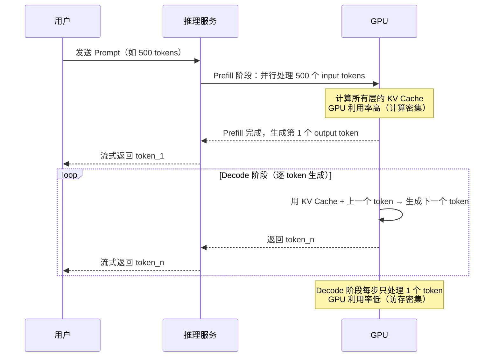
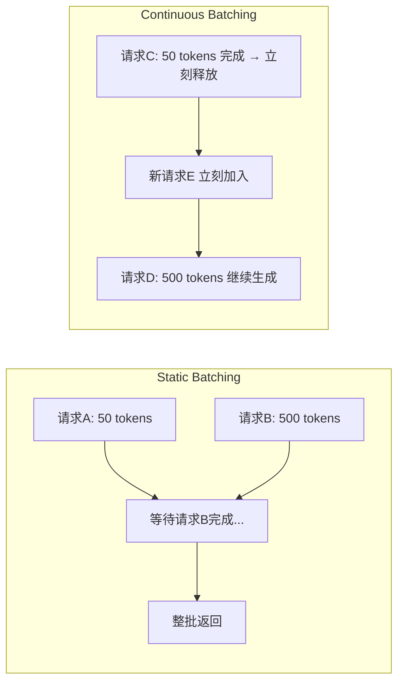

# 7.3 模型部署基础——从训练到上线

> **一句话定位**：模型训练好了不等于能上线。这一节从后端工程师最熟悉的"部署 + 调优"视角出发，讲清楚 LLM 推理的全链路——两阶段生成、KV Cache、量化压缩、推理框架选型、性能容量规划——让你能用已有的 Tomcat / JVM / Redis 经验，快速建立对模型部署的系统认知。

---

## 一、为什么模型部署是后端工程师的必修课

### 1.1 AI 应用的"最后一公里"

很多人以为"AI 工程 = 训练模型"，实际上训练只是起点。一个模型从实验室到生产环境，至少要经过：

```
训练（Training）         → 产出模型权重文件（几十 GB ~ 几百 GB）
模型转换 / 量化          → 压缩体积、适配推理框架
推理服务化（Serving）    → 包装成 HTTP/gRPC 接口，提供实时响应
性能调优                 → 控制延迟、提升吞吐、降低显存占用
高可用部署               → 多副本、负载均衡、灰度发布、监控告警
```

这条链路的后半段——从服务化到高可用——和你把一个 Spring Boot 应用部署到 Kubernetes 的流程高度相似，正是后端工程师的主场。

### 1.2 后端工程师在 AI 团队的角色

在一个典型的 AI 应用团队中，分工是这样的：

| 角色 | 负责的事 | 类比 |
|------|----------|------|
| 算法工程师 | 模型选型、微调、评估 | 业务开发写代码 |
| **后端 / 平台工程师** | **推理服务化、性能优化、高可用** | **运维 + SRE + 性能调优** |
| 前端工程师 | 对话界面、流式渲染 | 前端开发 |

你会发现，模型部署的核心挑战——延迟、吞吐、内存、并发——和你做 Tomcat 调优、JVM GC 调优时面对的问题是同构的。

### 1.3 一个关键类比

```
模型训练     ≈  编写 Java 代码
模型文件     ≈  编译后的 JAR 包
推理框架     ≈  Tomcat / Jetty（Servlet 容器）
部署上线     ≈  把 JAR 部署到 Tomcat 并做 JVM 参数调优
GPU 显存     ≈  JVM 堆内存
KV Cache     ≈  Redis 缓存
量化         ≈  JPEG 有损压缩
```

带着这个类比往下看，你会发现很多概念"似曾相识"。

---

## 二、LLM 推理的两个阶段

大语言模型（LLM, Large Language Model）的推理不像传统后端服务那样"请求进来 → 一次性算完 → 返回结果"。它分为两个截然不同的阶段：

### 2.1 Prefill（预填充）阶段

用户发送 Prompt（提示词，即输入文本）后，模型需要一次性处理所有 input tokens（输入词元），计算出 KV Cache（后面详细讲）。

**特点**：可以高度并行。所有 input tokens 同时参与矩阵运算，GPU 并行计算能力被充分利用。

**后端类比**：Tomcat 接收到 HTTP 请求后，解析 HTTP header + body、反序列化 JSON、校验参数——这些都是在"真正处理业务逻辑"之前的准备工作。

### 2.2 Decode（解码）阶段

Prefill 完成后，模型开始逐个生成 output tokens（输出词元）。每次只能生成一个 token，因为第 N 个 token 的生成依赖于第 N-1 个 token 的结果。

**特点**：必须串行。无论你有多少 GPU 核心，每一步都只能前进一个 token。

**后端类比**：HTTP 流式响应（Chunked Transfer Encoding）——服务端每生成一小段就立刻推送给客户端，而不是等全部生成完再返回。ChatGPT 的"打字机效果"就是这个原理。

### 2.3 两阶段流程图



### 2.4 为什么 output token 比 input token 贵？

这是很多 API 定价（如 OpenAI）让人困惑的地方：output token 的价格通常是 input token 的 2-4 倍。原因很简单：

| 对比维度 | Input Token（Prefill） | Output Token（Decode） |
|---------|----------------------|----------------------|
| 计算方式 | 并行处理，一次搞定 | 串行生成，一次一个 |
| GPU 利用率 | 高（计算密集型，compute-bound） | 低（访存密集型，memory-bound） |
| 耗时特征 | 500 tokens 和 1000 tokens 耗时差距不大 | 生成 100 tokens 耗时 ≈ 生成 50 tokens 的 2 倍 |
| 硬件瓶颈 | GPU 算力（FLOPS） | GPU 显存带宽（GB/s） |

用后端类比：Prefill 像批量插入数据库（`INSERT INTO ... VALUES (...), (...), ...`），一次搞定效率高；Decode 像逐行插入（`INSERT INTO ... VALUES (...)`，循环 N 次），每次都有固定开销。

---

## 三、KV Cache——LLM 推理的核心优化

### 3.1 为什么需要 KV Cache

Transformer 架构中，生成每一个新 token 时，Attention（注意力机制，即模型"关注"输入中哪些部分与当前生成最相关的计算过程）需要用到之前所有 token 的 Key 和 Value 向量。

如果不做缓存：

```
生成 token_1：计算 token_0 的 K、V
生成 token_2：重新计算 token_0、token_1 的 K、V    ← 重复计算！
生成 token_3：重新计算 token_0、token_1、token_2 的 K、V  ← 更多重复！
...
生成 token_N：重新计算前面所有 N-1 个 token 的 K、V   ← O(N²) 复杂度！
```

### 3.2 KV Cache 的工作原理

KV Cache 就是把每一层 Transformer 计算过的 Key 和 Value 矩阵缓存起来，后续生成新 token 时直接复用：

```
生成 token_1：计算 token_0 的 K、V → 存入 Cache
生成 token_2：从 Cache 取 token_0 的 K、V，只计算 token_1 的 K、V → 追加 Cache
生成 token_3：从 Cache 取 token_0~1 的 K、V，只计算 token_2 的 K、V → 追加 Cache
...
生成 token_N：从 Cache 取前 N-2 的 K、V，只计算 token_{N-1} 的 K、V → 追加 Cache
```

复杂度从 O(N^2) 降到 O(N)。

### 3.3 后端类比

```
不用 KV Cache = 不用 Redis，每次请求都从数据库重新查询全部历史数据
使用 KV Cache = 用 Redis 缓存历史查询结果，每次只查增量部分

后端视角：
  请求 1：SELECT * FROM orders WHERE user_id = 1  → 结果存入 Redis
  请求 2：Redis 命中，只查 "新增的订单"           → 追加到 Redis

LLM 视角：
  生成 token_5：Cache 命中 token_0~3 的 KV，只算 token_4 的 KV → 追加到 Cache
```

### 3.4 KV Cache 的内存占用

KV Cache 是推理时显存的最大消耗项之一。计算公式：

```
KV Cache 大小 = 2 × num_layers × hidden_dim × seq_len × bytes_per_element

其中：
  2            → Key 和 Value 各一份
  num_layers   → Transformer 层数
  hidden_dim   → 隐藏维度（每个头的维度 × 头数）
  seq_len      → 序列长度（已生成的 token 总数）
  bytes_per_element → 每个元素占的字节数（FP16 = 2 字节，FP32 = 4 字节）
```

以 LLaMA-7B（32 层，hidden_dim = 4096）为例，FP16 精度下：

```
单条请求、序列长度 2048 的 KV Cache：
  = 2 × 32 × 4096 × 2048 × 2 字节
  = 1,073,741,824 字节
  ≈ 1 GB

如果同时处理 16 条并发请求：
  = 1 GB × 16 = 16 GB  ← 这就占满了一块消费级 GPU 的显存！
```

这就是为什么并发数受限——不是 GPU 算力不够，而是**显存被 KV Cache 吃完了**。

---

## 四、推理优化技术

### 4.1 FlashAttention——计算顺序优化

标准 Attention 的计算流程会在 GPU 的高带宽内存（HBM, High Bandwidth Memory，GPU 的主存，容量大但相对慢）和片上缓存（SRAM, Static RAM，GPU 计算单元旁边的小容量高速缓存）之间来回搬运数据。数据搬运是瓶颈。

FlashAttention 的核心思想：重新安排计算顺序，把大矩阵分成小块（tiling），在 SRAM 上完成尽可能多的计算，减少对 HBM 的读写次数。

```
标准 Attention 的数据流：
  HBM → 读取 Q, K, V → SRAM 计算 → 写回中间结果到 HBM → 再读取 → 再计算 → 写回最终结果
  数据搬运次数：多次

FlashAttention 的数据流：
  HBM → 读取一块 Q, K, V → SRAM 上完成该块所有计算 → 写回最终结果到 HBM
  数据搬运次数：大幅减少
```

**后端类比**：这和 JVM / CPU 的**缓存行优化**是同一个道理——利用时间局部性（Temporal Locality，刚用过的数据很快会再用）和空间局部性（Spatial Locality，相邻的数据会一起被用到），把计算集中在离处理器最近的高速缓存上完成，避免频繁访问慢速内存。

### 4.2 MQA / GQA——减少 KV Cache 体积

标准的多头注意力（MHA, Multi-Head Attention）为每个注意力头都维护独立的 K、V 向量，KV Cache 很大。后续的改进方案通过共享 K、V 来减少缓存体积：

| 方案 | Key/Value 头数 | KV Cache 大小 | 代表模型 |
|------|---------------|--------------|---------|
| MHA（Multi-Head Attention） | 与 Query 头数相同（如 32） | 最大（基准） | GPT-3、LLaMA-1 |
| MQA（Multi-Query Attention） | 只有 1 个头（所有 Query 共享） | 最小（约 1/32） | PaLM、Falcon |
| GQA（Grouped-Query Attention） | 分组共享（如 8 个头分 4 组） | 折中（约 1/4 ~ 1/8） | LLaMA-2 70B、Mistral |

```
MHA：  Q 有 32 个头，K 也有 32 个头，V 也有 32 个头  → KV Cache 最大
MQA：  Q 有 32 个头，K 只有 1 个头，V 只有 1 个头    → KV Cache 最小，但精度有损失
GQA：  Q 有 32 个头，K 有 8 个头，V 有 8 个头        → 折中方案，精度接近 MHA
```

GQA 是当前主流选择——在 KV Cache 节省与模型精度之间取得了最佳平衡。

### 4.3 投机采样（Speculative Decoding）

Decode 阶段的串行生成是最大瓶颈。投机采样的思路是：用一个小模型（Draft Model）快速猜测未来 K 个 token，再用大模型（Target Model）一次性验证。

```
传统 Decode（串行）：
  大模型生成 token_1 → 大模型生成 token_2 → 大模型生成 token_3 → ...
  每步都用大模型，慢

投机采样：
  小模型快速猜测 token_1, token_2, token_3（很快，因为模型小）
  大模型一次性验证这 3 个 token 是否合理（并行验证，GPU 利用率高）
  如果前 2 个猜对了，第 3 个猜错了 → 接受前 2 个，从第 3 个重新生成
```

**后端类比**：这就是数据库的**乐观锁**——先假设不会冲突（小模型先猜），提交时再验证（大模型验证）。大部分情况下猜测是对的，所以整体速度提升了 2-3 倍。

### 4.4 连续批处理（Continuous Batching）

传统静态批处理（Static Batching）：一批请求中，如果有一条生成了 500 tokens，另一条只需要 50 tokens，短的那条必须等长的生成完才能释放资源。

连续批处理：短的请求完成后立刻释放资源，新请求立刻加入，不需要等整批结束。



**后端类比**：这就是 Tomcat 的 **NIO（非阻塞 I/O）模式 vs BIO（阻塞 I/O）模式**。BIO 模式下，一个线程绑死一个连接，即使连接空闲也不释放；NIO 模式下，线程在连接空闲时被归还线程池，可以服务其他请求。

---

## 五、量化——模型压缩的核心手段

### 5.1 为什么要量化

一个 70B 参数的模型，FP16 精度下需要 140 GB 显存，一块 A100（80GB）都放不下。量化（Quantization）通过降低数值精度来减小模型体积和加速推理。

**后端类比**：量化就像 JPEG 有损压缩。FP32 是 RAW 原图（完美保真但体积巨大），INT8 是高质量 JPEG（肉眼几乎看不出差别），INT4 是高压缩 JPEG（仔细看能发现细节损失，但文件小了 8 倍）。

### 5.2 数据精度对比

| 精度格式 | 每个参数字节数 | 数值范围 | 特点 |
|---------|-------------|---------|------|
| FP32（单精度浮点） | 4 字节 | ±3.4×10^38 | 训练默认精度，范围大、精度高 |
| FP16（半精度浮点） | 2 字节 | ±65504 | 推理常用，精度损失极小 |
| BF16（Brain Float 16） | 2 字节 | ±3.4×10^38 | 指数位和 FP32 一样，范围大，精度比 FP16 略低 |
| INT8（8 位整数） | 1 字节 | -128 ~ 127 | 模型体积减半（相比 FP16），速度提升显著 |
| INT4（4 位整数） | 0.5 字节 | -8 ~ 7 | 体积再减半，但精度开始有明显损失 |

```
模型体积示例（LLaMA-7B，7 billion 参数）：
  FP32：7B × 4 = 28 GB
  FP16：7B × 2 = 14 GB
  INT8：7B × 1 = 7 GB   ← 一块消费级 GPU（8GB）刚好放得下
  INT4：7B × 0.5 = 3.5 GB ← 甚至能在笔记本上跑
```

### 5.3 PTQ vs QAT

| 方式 | 全称 | 做法 | 优点 | 缺点 |
|------|------|------|------|------|
| PTQ | Post-Training Quantization（训练后量化） | 模型训练完后直接将权重转换为低精度 | 简单快捷，不需要重新训练 | INT4 时精度损失较大 |
| QAT | Quantization-Aware Training（量化感知训练） | 训练过程中模拟量化误差，让模型学会"适应"低精度 | 精度更好 | 需要重新训练，成本高 |

实际工程中，PTQ 是主流选择——因为大模型重新训练的成本太高了。只有在 PTQ 精度损失不可接受时，才考虑 QAT。

### 5.4 常用量化方案对比

| 方案 | 量化位数 | 方法 | 需要校准数据 | 推理速度 | 精度保持 | 适用框架 |
|------|---------|------|------------|---------|---------|---------|
| GPTQ | INT4 / INT8 | 基于 Hessian 矩阵的逐层量化 | 需要少量（128 条） | 快 | 好 | vLLM、TGI |
| AWQ | INT4 | 保护"重要权重"不量化 | 需要少量 | 快 | 更好 | vLLM、TGI |
| GGUF（llama.cpp） | Q2 ~ Q8 | 分块量化，纯 CPU 友好 | 不需要 | 中等 | 因位数而异 | llama.cpp、Ollama |
| bitsandbytes | INT8 / NF4 | 动态量化，按需反量化 | 不需要 | 中等 | 好 | HuggingFace |

### 5.5 量化选型经验

```
选 INT8 的场景：
  - 精度要求高（金融、医疗等严肃场景）
  - GPU 显存充足，主要想加速推理
  - 推荐方案：bitsandbytes INT8 或 GPTQ INT8

选 INT4 的场景：
  - GPU 显存紧张（消费级显卡 8-24GB）
  - 容忍轻微精度损失（对话、摘要等场景）
  - 推荐方案：AWQ INT4（精度最好）或 GPTQ INT4

选 GGUF 的场景：
  - 没有 GPU，纯 CPU 推理
  - 本地开发、个人实验
  - 推荐方案：llama.cpp 加载 Q4_K_M 或 Q5_K_M 量化

精度损失评估方法：
  1. 跑标准 Benchmark（如 MMLU、HumanEval）对比量化前后的分数
  2. 用业务真实场景的测试集做 A/B 对比
  3. 经验值：INT8 精度损失 < 1%，INT4 精度损失 2-5%
```

---

## 六、推理框架对比

### 6.1 主流框架概览

| 框架 | 核心特性 | 吞吐量 | 延迟 | 硬件要求 | 易用性 | 适合场景 |
|------|---------|-------|------|---------|-------|---------|
| **vLLM** | PagedAttention 显存管理 | 最高 | 低 | NVIDIA GPU | 中等 | 生产环境高并发服务 |
| **TensorRT-LLM** | NVIDIA 专用 Kernel 融合 | 极高 | 最低 | NVIDIA GPU（专用） | 较难 | 极致性能、NVIDIA 生态 |
| **Ollama** | 一键本地部署 | 低 | 中等 | CPU / GPU 均可 | 最简单 | 个人开发、本地实验 |
| **llama.cpp** | 纯 C++ CPU 推理 | 低 | 较高 | CPU（可选 GPU 加速） | 中等 | 无 GPU 环境、嵌入式 |

### 6.2 vLLM 与 PagedAttention

vLLM 的核心创新是 PagedAttention——它解决的是 KV Cache 的**显存碎片化**问题。

传统方式：为每条请求预分配最大序列长度的连续显存。如果请求实际只用了 100 tokens，但你预分配了 2048 tokens 的空间，中间的差距就是浪费。

PagedAttention：把 KV Cache 拆成固定大小的"页"（Block），按需分配，不需要连续内存。

```
传统 KV Cache 内存分配（类比 C 语言 malloc）：
  请求A：预分配 2048 tokens 连续空间 → 实际用了 200 → 浪费 90%
  请求B：预分配 2048 tokens 连续空间 → 实际用了 1500 → 浪费 25%
  总显存利用率：很低

PagedAttention（类比 OS 虚拟内存分页）：
  请求A：按需分配 page_1, page_2, page_3 → 每页 16 tokens → 用了 200 tokens = 13 页
  请求B：按需分配 page_4, page_5, ... → 用了 1500 tokens = 94 页
  页可以不连续存放 → 显存利用率接近 100%
```

**后端类比**：这和操作系统的**虚拟内存分页**是同一个思想。物理内存不需要连续，通过页表映射，应用程序看到的是连续的虚拟地址空间。vLLM 用同样的方式管理 GPU 显存，把"KV Cache 显存浪费"这个问题从根本上解决了。

### 6.3 本地快速体验（Ollama）

如果你只是想在本地快速跑一个模型感受一下：

```bash
# 安装 Ollama（macOS）
brew install ollama

# 拉取并运行模型（自动下载量化后的模型文件）
ollama run llama3.1:8b

# 通过 API 调用（兼容 OpenAI 格式）
curl http://localhost:11434/v1/chat/completions \
  -H "Content-Type: application/json" \
  -d '{
    "model": "llama3.1:8b",
    "messages": [{"role": "user", "content": "用 Java 写一个快速排序"}],
    "stream": true
  }'
```

---

## 七、性能指标与容量规划

### 7.1 核心性能指标

| 指标 | 英文全称 | 含义 | 后端类比 |
|------|---------|------|---------|
| TTFT | Time To First Token（首 Token 延迟） | 用户发送请求到收到第一个输出 token 的时间 | HTTP 响应首字节时间（TTFB） |
| TPOT | Time Per Output Token（每 Token 延迟） | 每生成一个 output token 的平均耗时 | 流式响应中每个 chunk 的间隔 |
| 吞吐量 | Throughput（tokens/sec） | 系统每秒生成的 token 总数（跨所有请求） | QPS（每秒请求数） |
| 端到端延迟 | End-to-End Latency | 从请求发送到完整响应生成的总时间 | 接口 P99 延迟 |

```
延迟计算公式：
  端到端延迟 = TTFT + (output_tokens - 1) × TPOT

示例（生成 200 个 output tokens）：
  TTFT = 500ms，TPOT = 30ms
  端到端延迟 = 500 + 199 × 30 = 6,470ms ≈ 6.5 秒
```

### 7.2 容量估算

给定模型和硬件，估算能支撑多少并发：

```
显存总预算 = GPU 显存 - 模型权重占用

其中：
  模型权重显存 = 参数量 × 每参数字节数
  KV Cache 显存 = 2 × 层数 × 隐藏维度 × (输入长度 + 输出长度) × 每元素字节数
  最大并发数 ≈ 显存总预算 ÷ 单请求 KV Cache 大小

示例（LLaMA-7B FP16，A100 80GB）：
  模型权重  = 7B × 2 = 14 GB
  剩余显存  = 80 - 14 = 66 GB
  单请求 KV Cache（序列长度 2048）= 约 1 GB
  最大并发  ≈ 66 ÷ 1 = 66 条请求

注意：实际并发还要留出显存给激活值、框架开销等，打七折估算：
  实际安全并发 ≈ 66 × 0.7 ≈ 46 条
```

### 7.3 后端视角：和 JVM 调优的对照

```
JVM 调优三角：
  CPU 资源（线程数）  ←→  GPU 算力（CUDA 核心数）
  堆内存（-Xmx）      ←→  GPU 显存（VRAM）
  GC 停顿             ←→  KV Cache 管理开销

Tomcat 线程池调优：
  maxThreads = 200     ←→  最大并发请求数 = 46
  acceptCount = 100    ←→  排队队列长度
  connectionTimeout    ←→  TTFT 超时阈值

两者的本质都是在"计算资源、内存资源、延迟要求"三者之间做权衡。
```

---

## 八、面试深度剖析

### 考点 1：Prefill 和 Decode 的区别？为什么 output token 更贵？

> **面试官问**：LLM 推理分为哪两个阶段？为什么 API 定价中 output token 通常比 input token 贵好几倍？

**回答**：LLM 推理分为 Prefill 和 Decode 两个阶段。Prefill 阶段一次性并行处理所有 input tokens，GPU 的并行计算能力被充分利用，属于计算密集型（compute-bound）。Decode 阶段逐个生成 output token，每一步都依赖上一步的结果，只能串行执行，GPU 大部分时间在等待数据从显存搬到计算单元，属于访存密集型（memory-bound）。所以同样数量的 token，Decode 阶段占用 GPU 的时间更长，资源利用率更低，成本更高。这就好比批量插入数据库很高效，但逐条插入就慢得多——每次插入都有固定的网络和事务开销。

### 考点 2：KV Cache 是什么？不用 KV Cache 会怎样？

> **面试官问**：什么是 KV Cache？如果去掉 KV Cache，推理性能会受到什么影响？

**回答**：KV Cache 是在 Decode 阶段缓存每一层 Transformer 已经计算过的 Key 和 Value 矩阵。生成第 N 个 token 时，Attention 需要用到前 N-1 个 token 的 K、V，如果没有 Cache 就要全部重新计算，时间复杂度是 O(N^2)；有了 Cache 只需要计算新增的那一个 token 的 K、V，复杂度降为 O(N)。类比后端开发：不用 KV Cache 就像不用 Redis，每次请求都从数据库重查全部数据。代价是 KV Cache 本身要占显存，以 LLaMA-7B 为例，单请求在序列长度 2048 时 KV Cache 约占 1GB，这也是限制并发数的关键因素。

### 考点 3：INT8 量化会损失多少精度？怎么评估？

> **面试官问**：模型量化到 INT8 会不会影响效果？怎么评估精度损失？

**回答**：INT8 量化的精度损失通常很小，在主流 Benchmark（如 MMLU、HumanEval）上一般不超过 1 个百分点。评估方法有三个层次：第一，跑标准 Benchmark 对比量化前后的得分；第二，用业务自己的测试集做 A/B 评测，因为标准 Benchmark 不一定反映你的场景；第三，对关键 Case 做人工评估。量化可以类比 JPEG 有损压缩——INT8 相当于质量 95% 的 JPEG，肉眼几乎看不出差别，但文件小了一半。如果 INT8 精度不够，可以考虑 AWQ 方案，它会自动识别"重要权重"保持高精度，其余权重才做量化，效果比均匀量化好。

### 考点 4：vLLM 的 PagedAttention 解决了什么问题？

> **面试官问**：vLLM 为什么比传统推理框架吞吐量高？PagedAttention 的核心思想是什么？

**回答**：传统推理框架为每条请求预分配最大序列长度的连续显存存放 KV Cache，但实际大部分请求用不了那么长的序列，导致显存浪费严重，实测浪费率可达 60-80%。PagedAttention 借鉴了操作系统虚拟内存的分页机制，把 KV Cache 拆成固定大小的 Block（页），按需分配、不要求物理连续，通过 Block Table（类似页表）做映射。这样显存利用率接近 100%，同样的 GPU 能支撑更多的并发请求，吞吐量因此显著提升。打个后端的比方：传统方式像 Java 数组，必须预先分配连续空间；PagedAttention 像 LinkedList，按需追加节点，空间利用更灵活。

---

[← 上一节：7.2 Prompt Engineering](./02-Prompt-Engineering.md) | [返回本章导读](./README.md) | [下一节：7.4 Transformer 核心 →](./04-Transformer核心.md)
