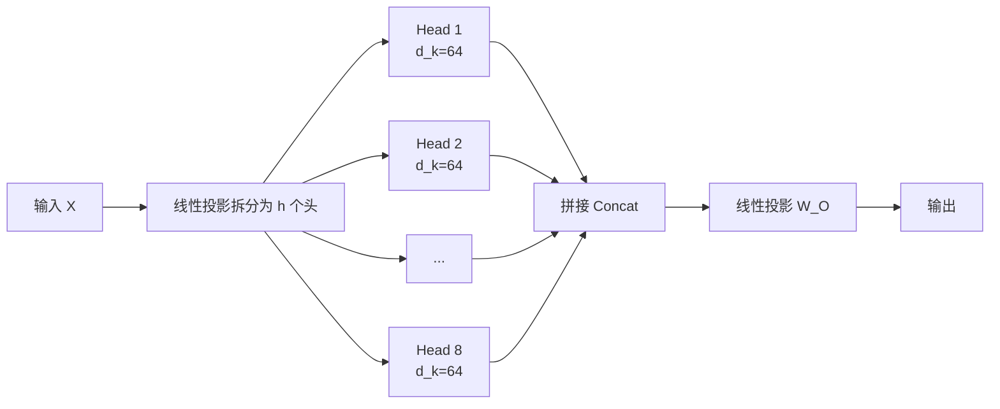
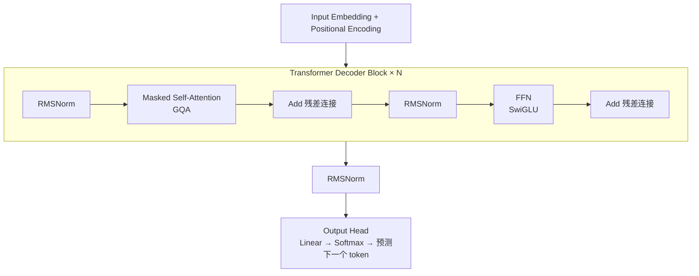

# 7.4 Transformer 核心——大模型的心脏

> **一句话定位**：如果说 GPU 是大模型的"发动机"，那 Transformer 就是"发动机的设计图"。这一节用 Java 后端最熟悉的 SQL 查询和并发模型做类比，把 Self-Attention、Multi-Head、位置编码、FFN 这些核心组件拆解到你能手推矩阵的程度——面试能答、原理能懂、代码能读。

---

## 一、为什么 Transformer 统治了 AI

### 1.1 一篇改变世界的论文

2017 年，Google 发表论文 "Attention Is All You Need"，提出了 Transformer 架构。在此之前，序列建模的主流是 RNN（Recurrent Neural Network，循环神经网络）和 LSTM（Long Short-Term Memory，长短期记忆网络）。

Transformer 一经提出便迅速取代了 RNN/LSTM，成为 NLP（Natural Language Processing，自然语言处理）领域的基础架构。后来更扩展到视觉（ViT）、语音、多模态等几乎所有 AI 领域。

### 1.2 核心优势：从串行到并行

用 Java 后端的并发模型来类比：

| 特性 | RNN（串行） | Transformer（并行） |
|------|-------------|---------------------|
| 处理方式 | 逐词处理，类似单线程 for 循环 | 所有词同时处理，类似多线程并行 |
| 长程依赖 | 距离远的词信息会"衰减"，类似长链路微服务调用丢失上下文 | 任意两个词直接交互，类似广播通信 |
| 训练速度 | 慢（无法并行） | 快（GPU 矩阵运算天然并行） |
| 类比 | 单线程处理请求队列 | 线程池 + Fork/Join 并行处理 |

```
// RNN 的伪代码 —— 串行，后一步依赖前一步
for (int i = 0; i < sequenceLength; i++) {
    hidden[i] = f(hidden[i-1], input[i]);  // 必须等上一步完成
}

// Transformer 的伪代码 —— 并行，所有位置同时计算
output = attention(allInputs, allInputs, allInputs);  // 一次矩阵运算搞定
```

### 1.3 Encoder-Decoder vs Decoder-Only

原始 Transformer 是 Encoder-Decoder 结构（用于翻译任务）。但当前主流的大语言模型（GPT、LLaMA、Mistral）都是 **Decoder-Only** 架构。

| 架构 | 代表模型 | 适用场景 | 类比 |
|------|----------|----------|------|
| Encoder-Only | BERT | 理解型任务（分类、抽取） | 只读数据库——只做 SELECT |
| Encoder-Decoder | T5、原始 Transformer | 翻译、摘要 | 读写分离——SELECT 后 INSERT |
| **Decoder-Only** | **GPT、LLaMA、Mistral** | **生成型任务（对话、写作）** | **流式写入——边读边写** |

为什么 Decoder-Only 胜出？因为生成任务天然是"已有前文，预测下一个 token"，Decoder-Only 结构最简洁高效。

---

## 二、Self-Attention 机制

### 2.1 核心三元组：Query、Key、Value

Self-Attention（自注意力）是 Transformer 的灵魂。它的核心思想是：对于序列中的每个词，计算它应该"关注"其他哪些词、关注多少。

每个输入词会被线性变换为三个向量：

- **Query（查询向量）**：代表"我在找什么"
- **Key（键向量）**：代表"我能提供什么信息"
- **Value（值向量）**：代表"我实际携带的内容"

### 2.2 用 SQL 类比理解 Attention

这是最直觉的理解方式：

```sql
-- Self-Attention ≈ 每个词对所有词执行一次"模糊查询"
SELECT
    SUM(value * similarity_score) AS attention_output
FROM
    all_tokens
WHERE
    -- similarity_score = softmax(query · key / √d_k)
    -- 不是硬匹配，而是按相似度加权
ORDER BY
    similarity_score DESC;
```

| SQL 概念 | Attention 概念 | 说明 |
|----------|----------------|------|
| WHERE 条件 | Query | 定义"我要找什么" |
| 索引字段（被匹配的列） | Key | 定义"我有什么特征可以被匹配" |
| SELECT 的数据列 | Value | 匹配到之后，实际取出的内容 |
| JOIN ON 相似度 | QK^T 点积 | 计算匹配程度 |
| 加权求和 | Softmax × V | 按匹配程度加权汇总结果 |

### 2.3 Attention 计算公式拆解

核心公式：

```
Attention(Q, K, V) = Softmax(Q × K^T / √d_k) × V
```

逐步拆解：

| 步骤 | 操作 | 含义 | 矩阵维度（假设序列长度 n，维度 d_k） |
|------|------|------|--------------------------------------|
| 1 | Q × K^T | 计算每对词之间的相似度（点积） | (n × d_k) × (d_k × n) = n × n |
| 2 | / √d_k | 缩放，防止数值过大 | n × n |
| 3 | Softmax | 归一化为概率分布（每行和为 1） | n × n |
| 4 | × V | 用概率加权汇总 Value | (n × n) × (n × d_k) = n × d_k |

### 2.4 为什么要除以 √d_k

这是面试高频考点。直觉理解：

- 当维度 d_k 很大时，Q 和 K 的点积结果会很大（方差 ≈ d_k）
- 点积值过大 → Softmax 输出趋近 one-hot（一个接近 1，其余接近 0）
- 梯度消失 → 训练困难

除以 √d_k 相当于把方差标准化回 1，让 Softmax 保持在"有区分度但不极端"的区间。

```
类比 Java：
- 不缩放 = 用 int 做金额计算，数值溢出
- 缩放   = 用 BigDecimal，保持数值在合理范围
```

### 2.5 数值示例：手推一遍 Attention

假设序列长度 n=3（三个词："我"、"爱"、"AI"），维度 d_k=2：

```
输入 X = [[1, 0],    // "我"
           [0, 1],    // "爱"
           [1, 1]]    // "AI"

假设 W_Q = W_K = W_V = 单位矩阵（简化示例）

则 Q = K = V = X

Step 1: Q × K^T = [[1,0], [0,1], [1,1]] × [[1,0,1], [0,1,1]]
       = [[1, 0, 1],
          [0, 1, 1],
          [1, 1, 2]]

Step 2: / √d_k = / √2 ≈ / 1.414
       = [[0.71, 0.00, 0.71],
          [0.00, 0.71, 0.71],
          [0.71, 0.71, 1.41]]

Step 3: Softmax（按行）
       第一行: softmax([0.71, 0.00, 0.71]) ≈ [0.39, 0.19, 0.42]
       第二行: softmax([0.00, 0.71, 0.71]) ≈ [0.19, 0.39, 0.42]
       第三行: softmax([0.71, 0.71, 1.41]) ≈ [0.24, 0.24, 0.52]

Step 4: × V
       第一行输出 = 0.39×[1,0] + 0.19×[0,1] + 0.42×[1,1] = [0.81, 0.61]
       第二行输出 = 0.19×[1,0] + 0.39×[0,1] + 0.42×[1,1] = [0.61, 0.81]
       第三行输出 = 0.24×[1,0] + 0.24×[0,1] + 0.52×[1,1] = [0.76, 0.76]
```

观察结果："AI"（第三行）对所有词都有较高关注度（0.52 关注自己），因为它与所有词都相关。

---

## 三、Multi-Head Attention 与演进

### 3.1 为什么需要多头

单个 Attention 只能学习一种"关注模式"。但语言中的关系是多维度的：

- 语法关系：主语关注谓语
- 语义关系：近义词互相关注
- 位置关系：相邻词互相关注

类比 SQL：

```sql
-- 单头 Attention ≈ 只有一个 GROUP BY 维度
SELECT * FROM tokens GROUP BY syntax_relation;

-- 多头 Attention ≈ 多个 GROUP BY 维度并行
-- Head 1: GROUP BY syntax_relation   (语法关系)
-- Head 2: GROUP BY semantic_similarity (语义相似度)
-- Head 3: GROUP BY position_proximity  (位置关系)
-- 最后 UNION ALL 合并结果
```

### 3.2 多头的计算流程

```
MultiHead(Q, K, V) = Concat(head_1, head_2, ..., head_h) × W_O

其中每个 head_i = Attention(Q × W_Qi, K × W_Ki, V × W_Vi)
```

假设总维度 d_model = 512，头数 h = 8，则每个头的维度 d_k = 512 / 8 = 64。



### 3.3 MHA → MQA → GQA 演进

随着模型变大，KV Cache（推理时缓存的 Key 和 Value）成为显存瓶颈。因此出现了共享 KV 的优化方案：

| 方案 | 全称 | Q 头数 | KV 头数 | KV Cache 大小 | 精度 | 代表模型 |
|------|------|--------|---------|---------------|------|----------|
| MHA | Multi-Head Attention | h | h | 100% | 最高 | GPT-3、BERT |
| MQA | Multi-Query Attention | h | 1 | 1/h | 略降 | PaLM、Falcon |
| **GQA** | **Grouped-Query Attention** | **h** | **h/g（分组）** | **g/h** | **接近 MHA** | **LLaMA 2/3、Mistral** |

```
举例：LLaMA-2-70B
- 总 Q 头数 = 64
- GQA 分组数 g = 8（即 8 个 KV 头，每个 KV 头被 8 个 Q 头共享）
- KV Cache 减少到 MHA 的 1/8
- 精度几乎无损
```

GQA 是当前主流选择：在 MHA 的精度和 MQA 的效率之间找到了最佳平衡点。

---

## 四、位置编码（Positional Encoding）

### 4.1 为什么需要位置编码

Self-Attention 本质上是一个**集合操作**——打乱输入顺序，输出不变。但语言是有顺序的，"我爱AI" 和 "AI爱我" 含义完全不同。

```
类比：
- Attention 不加位置编码 ≈ SQL 查询没有 ORDER BY，结果集无序
- 加了位置编码 ≈ 加了 ORDER BY + ROW_NUMBER()，每行有了确定的位置
```

### 4.2 三种方案对比

| 方案 | 原理 | 能否外推到更长序列 | 代表模型 | 状态 |
|------|------|-------------------|----------|------|
| 绝对位置编码（正弦函数） | 用 sin/cos 函数为每个位置生成固定向量 | 理论上可以，但效果差 | 原始 Transformer | 已过时 |
| ALiBi（相对位置） | 在 Attention Score 上加线性偏置，距离越远惩罚越大 | 支持一定外推 | BLOOM、MPT | 部分使用 |
| **RoPE（旋转位置编码）** | **把位置信息编码为向量的旋转角度** | **天然支持长度外推** | **LLaMA、Mistral、Qwen** | **当前主流** |

### 4.3 RoPE 的直觉理解

RoPE（Rotary Position Embedding，旋转位置编码）的核心思想：

- 把每对相邻维度看作一个二维平面
- 位置 m 的编码 = 把向量在该平面旋转 m × θ 角度
- 两个位置的相对距离 = 旋转角度之差

```
直觉类比：
想象一个钟表：
- 位置 1 = 时针指向 1 点钟方向（旋转 30°）
- 位置 2 = 时针指向 2 点钟方向（旋转 60°）
- 相对距离 = 60° - 30° = 30°（只取决于相对位置，不取决于绝对位置）

这就是为什么 RoPE 天然支持长度外推：
- 训练时见过位置 1~4096
- 推理时遇到位置 8000，只要"继续旋转"即可
```

RoPE 成为主流的原因：
1. 只依赖相对位置，泛化性强
2. 计算简单（只需要三角函数旋转）
3. 与线性 Attention 的各种加速方案兼容
4. 通过 NTK-aware 缩放等技巧，可以廉价扩展到 100K+ 上下文

---

## 五、FFN 前馈网络与激活函数

### 5.1 Transformer Block = Attention + FFN

每个 Transformer Block 由两个核心子层组成：

```
Transformer Block = Self-Attention + FFN

- Self-Attention：负责"看到哪些信息"（词与词之间的交互）
- FFN：负责"处理这些信息"（对每个位置独立做非线性变换）
```

类比：
- Self-Attention ≈ 分布式系统中的"消息广播"——收集各节点信息
- FFN ≈ 每个节点收到消息后的"本地计算"——独立处理

### 5.2 FFN 的结构

标准 FFN 是两层全连接网络：

```
FFN(x) = W2 × activation(W1 × x + b1) + b2

其中：
- W1: d_model → d_ff（升维，通常 d_ff = 4 × d_model）
- W2: d_ff → d_model（降维，还原回原始维度）
```

### 5.3 激活函数演进

| 激活函数 | 公式 | 特点 | 使用模型 |
|----------|------|------|----------|
| ReLU | max(0, x) | 简单但有"死神经元"问题 | 早期 Transformer |
| GELU | x × Φ(x) | 平滑版 ReLU，概率性"门控" | GPT-2、BERT |
| **SwiGLU** | **Swish(xW₁) ⊙ (xW₃)** | **门控机制 + 平滑激活** | **LLaMA、Mistral、PaLM** |

SwiGLU 胜出的原因：引入了额外的门控矩阵 W₃，让网络自己学习"哪些信息该通过、哪些该抑制"，实验证明在相同参数量下效果更好。

### 5.4 LayerNorm 的位置

LayerNorm（层归一化）用于稳定训练过程，有两种放置方式：

| 方式 | 位置 | 优势 | 代表 |
|------|------|------|------|
| Post-Norm | 子层之后 | 原始论文方案 | 原始 Transformer |
| **Pre-Norm** | **子层之前** | **训练更稳定，不需要 Warm-up** | **GPT、LLaMA 全系列** |

```
// Post-Norm（原始方案，容易梯度爆炸）
output = LayerNorm(x + SubLayer(x))

// Pre-Norm（现代方案，训练更稳定）
output = x + SubLayer(LayerNorm(x))
```

现代大模型几乎都用 Pre-Norm + RMSNorm（Root Mean Square Layer Normalization，均方根层归一化——比 LayerNorm 少算一次均值，速度更快）。

---

## 六、完整架构拆解

### 6.1 Transformer Decoder Block 结构



完整数据流：

```
Token IDs
  → Embedding 层（词表大小 × d_model）
  → + RoPE 位置编码
  → N 个 Decoder Block:
      → RMSNorm
      → Masked Self-Attention (GQA)
      → 残差连接
      → RMSNorm
      → FFN (SwiGLU)
      → 残差连接
  → RMSNorm
  → 线性输出层 (d_model → 词表大小)
  → Softmax → 概率分布
  → 取概率最高的 token（或采样）
```

### 6.2 Masked Self-Attention 的含义

Decoder 中的 Attention 必须加 Mask（掩码）：每个位置只能看到它之前的位置，不能"偷看"未来。

```
Mask 矩阵示例（1=可见，0=遮挡）:

       位置1  位置2  位置3  位置4
位置1 [  1      0      0      0  ]
位置2 [  1      1      0      0  ]
位置3 [  1      1      1      0  ]
位置4 [  1      1      1      1  ]

类比：考试时只能看到前面已答的题目，不能翻到后面的题。
```

### 6.3 参数量计算：以 LLaMA-7B 为例

| 组件 | 参数计算 | 参数量（约） | 占比 |
|------|----------|-------------|------|
| Embedding | vocab_size × d_model = 32000 × 4096 | 131M | 1.9% |
| Attention（Q/K/V/O 权重 × 32层） | 4 × d_model² × 32 | 2,147M | 31.1% |
| FFN（W1/W2/W3 × 32层） | 3 × d_model × d_ff × 32 = 3 × 4096 × 11008 × 32 | 4,328M | 62.7% |
| RMSNorm + 其他 | 少量 | ~300M | 4.3% |
| **总计** | | **≈ 6,907M ≈ 7B** | **100%** |

关键发现：**FFN 占了超过 60% 的参数量**，Attention 只占约 30%。这就是为什么模型压缩经常从 FFN 入手。

```
参数量换算：
- 7B = 70 亿参数
- FP16 存储：7B × 2 bytes = 14 GB 显存
- INT4 量化：7B × 0.5 bytes = 3.5 GB 显存（可以塞进消费级显卡）
```

---

## 七、面试深度剖析

### 考点 1：Self-Attention 的计算过程？时间复杂度？

**标准答案要点**：

1. 输入 X 经过三个线性变换得到 Q、K、V
2. 计算 Attention Score = QK^T / √d_k
3. 对 Score 做 Softmax 归一化
4. 用归一化后的权重加权求和 V

时间复杂度：O(n² × d)，其中 n 是序列长度，d 是维度。瓶颈在 QK^T 的矩阵乘法（n×d 乘 d×n = n×n）。这就是为什么长文本推理很贵——128K 上下文的计算量是 4K 的 (128/4)² = 1024 倍。

**加分回答**：提及 FlashAttention 通过分块计算 + IO 感知优化，减少了显存占用，但时间复杂度本身不变。

### 考点 2：为什么要多头？多头之间是独立还是共享参数？

**标准答案要点**：

- 多头让模型同时学习不同的关注模式（语法、语义、位置等）
- 每个头有**独立的** W_Q、W_K、W_V 参数矩阵
- 多头的输出拼接后经过一个**共享的** W_O 投影矩阵
- 总计算量与单头（使用完整维度）相当：h 个 d_k 维的头 = 1 个 d_model 维的头（d_model = h × d_k）

**加分回答**：提及 GQA 中 KV 头是跨 Q 头共享的，是精度和效率的权衡。

### 考点 3：位置编码的作用？RoPE 和绝对位置编码的区别？

**标准答案要点**：

- 作用：Attention 是集合操作（置换不变性），位置编码注入顺序信息
- 绝对位置编码：为每个绝对位置生成固定向量，加到输入 Embedding 上
- RoPE：将位置编码为 Q/K 向量的旋转角度，Attention Score 只依赖相对位置差

关键区别：

| 维度 | 绝对位置编码 | RoPE |
|------|-------------|------|
| 编码对象 | 加在输入 Embedding | 作用在 Q 和 K 上 |
| 依赖关系 | 绝对位置 | 相对位置差 |
| 长度外推 | 差（超出训练长度后退化严重） | 好（旋转角度可外推） |
| 当前使用 | 几乎不用 | LLaMA/Mistral/Qwen 全系列 |

### 考点 4：Transformer 的参数量怎么算？7B 模型有多少参数？

**标准答案要点**：

主要参数来源（以 LLaMA-7B 为例）：

```
1. Embedding 层: vocab_size × d_model
   = 32000 × 4096 = 131M

2. 每个 Attention 层: 4 × d_model × d_model（Q/K/V/O 四个矩阵）
   = 4 × 4096 × 4096 = 67M

3. 每个 FFN 层: 3 × d_model × d_ff（SwiGLU 有三个矩阵）
   = 3 × 4096 × 11008 = 135M

4. 每个 Block: 67M + 135M ≈ 202M

5. 总计: 131M + 32 × 202M ≈ 6.6B + Norm 参数 ≈ 7B
```

**加分回答**：
- 70 亿参数 ≠ 70 亿字节。FP16 下每个参数 2 字节，所以模型文件约 14GB
- 推理时显存 = 模型参数 + KV Cache + 激活值。KV Cache 随序列长度线性增长

---

[← 上一节：7.3 模型部署基础](./03-模型部署基础.md) | [返回本章导读](./README.md) | [下一节：7.5 微调入门 →](./05-微调入门.md)
