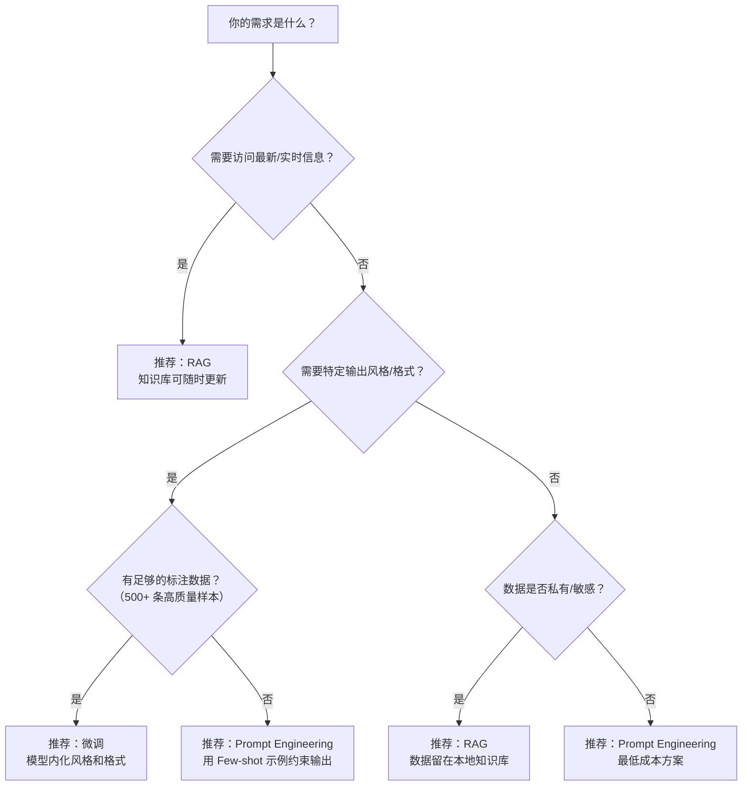

# 7.5 微调入门——让大模型学会你的业务

> **一句话定位**：通用大模型就像 Spring 框架——功能强大但不懂你的业务。这一节从"为什么需要微调"出发，讲清楚全量微调与 PEFT、LoRA 原理、QLoRA 单卡微调、数据准备、工具链，以及微调 vs RAG vs Prompt 的选型决策，帮你从"调 API 的人"变成"能训模型的人"。

---

## 一、为什么需要微调

### 1.1 通用大模型的 Gap

GPT-4、LLaMA 这类通用大模型在开放域对话、常识问答上表现出色，但一旦进入你的业务领域，就会暴露问题：

```
场景 1：让模型按你公司的工单模板输出 JSON → 格式经常出错
场景 2：让模型理解你行业的专业术语（如金融的"T+1 交割"）→ 回答模棱两可
场景 3：让模型风格符合企业客服的语气 → 时而正式时而随意
```

核心矛盾：**通用模型追求"什么都会"，你的业务需要"这件事做得特别好"。**

### 1.2 一个关键类比

```
大模型     ≈  Spring 框架（通用能力强大，但不包含你的业务逻辑）
微调       ≈  写业务 Controller（在框架之上注入领域知识和行为规范）
Prompt     ≈  在 Controller 方法里写注释/Javadoc（指导框架行为，但不改代码）
RAG        ≈  调用外部数据库/微服务（运行时动态获取领域数据）
```

### 1.3 三种适配方式对比

| 对比维度 | Prompt Engineering | RAG（检索增强生成） | 微调（Fine-Tuning） |
|---------|-------------------|-------------------|-------------------|
| 核心做法 | 设计更好的提示词 | 检索外部知识注入上下文 | 用领域数据重新训练模型 |
| 是否修改模型 | 否 | 否 | 是 |
| 成本 | 最低（零成本） | 中等（需建向量库） | 最高（需 GPU + 标注数据） |
| 知识时效性 | 受限于模型训练截止日期 | 实时（外部知识库可更新） | 训练时固化 |
| 输出风格控制 | 弱（靠 Prompt 约束） | 弱 | 强（模型内化了风格） |
| 适用场景 | 快速验证、通用任务 | 需要最新/私有知识 | 需要特定风格/格式/行为 |
| 后端类比 | 改 API 请求参数 | 加 Redis 缓存 + 查外部数据源 | 改框架源码/写插件 |

**关键结论**：三者不是互斥的，很多生产系统是 **微调 + RAG + Prompt** 组合使用。

---

## 二、全量微调 vs 参数高效微调（PEFT）

### 2.1 全量微调

全量微调（Full Fine-Tuning）的做法很直接：把预训练模型的**所有参数**都拿来重新训练。

```
LLaMA-7B 的参数量：7,000,000,000（70 亿）
全量微调 = 更新这 70 亿个参数
所需显存 ≈ 模型权重（14GB FP16）+ 梯度（14GB）+ 优化器状态（28GB Adam）= 56 GB 起步
还没算 KV Cache 和激活值！实际需要 4-8 块 A100（80GB）
```

对于大多数团队来说，全量微调**成本太高**，而且容易发生灾难性遗忘（Catastrophic Forgetting，模型学了新知识忘了旧知识）。

### 2.2 PEFT 的核心思想

PEFT（Parameter-Efficient Fine-Tuning，参数高效微调）：冻结预训练模型的绝大部分参数，只训练少量新增参数。

```
全量微调：更新 70 亿参数    → 需要 4-8 块 A100
PEFT：   更新 几百万参数    → 1 块消费级 GPU 就够
```

### 2.3 类比

```
全量微调 ≈ 把 Spring 框架的源码 fork 出来，从头改到尾
PEFT    ≈ 写一个 Spring 拦截器（Interceptor）/ AOP 切面
           不动框架源码，只在关键位置插入你的逻辑
```

### 2.4 PEFT 方法分类

| 方法 | 核心思想 | 新增参数量 | 优点 | 缺点 |
|------|---------|-----------|------|------|
| Adapter | 在 Transformer 层之间插入小型全连接网络 | 中等（0.5-5%） | 效果稳定 | 推理时增加额外计算 |
| Prefix-Tuning | 在每层 Attention 前加可学习的前缀向量 | 较少（0.1-1%） | 不改模型结构 | 长前缀影响上下文窗口 |
| Prompt Tuning | 只在输入层加可学习的 soft prompt | 最少（<0.1%） | 极简，可多任务复用 | 小模型效果不稳定 |
| **LoRA** | 用低秩分解近似权重更新 | 少（0.1-1%） | 推理零开销（可合并回原模型） | 超参数需调节 |

**LoRA 是当前最主流的 PEFT 方法**——效果好、推理零开销、实现简单。后面重点讲它。

---

## 三、LoRA 原理

### 3.1 低秩分解的直觉

LoRA（Low-Rank Adaptation，低秩适配）的核心洞察来自一篇关键论文：**预训练模型在微调时，权重的变化量（ΔW）是低秩的**——也就是说，虽然权重矩阵很大，但实际有意义的变化可以用一个小得多的矩阵来近似表示。

```
直觉类比：
  一张 4096×4096 的图片，里面其实只画了几条线
  用 JPEG 压缩后，文件从 64MB 缩到 100KB
  信息量没变，但存储量大幅减少

同理：
  一个 4096×4096 的权重变化矩阵，"有效信息"可能只需要 rank=8 就能表达
  用两个小矩阵 B(4096×8) × A(8×4096) 近似 → 参数量从 1600 万降到 6.5 万
```

### 3.2 数学原理

原始模型中某一层的权重矩阵是 W（维度 d × d），微调后变成 W'。LoRA 不直接更新 W，而是学习一个增量 ΔW：

```
W' = W + ΔW = W + B × A

其中：
  W ：原始权重矩阵，维度 d × d，冻结不动
  ΔW：权重的变化量，维度 d × d
  B ：低秩矩阵，维度 d × r（r 远小于 d）
  A ：低秩矩阵，维度 r × d
  r ：秩（rank），LoRA 的核心超参数，通常取 4、8、16
```

前向传播时：

```
原始：  y = W × x
LoRA：  y = W × x + B × A × x
                      ↑
               只有 B 和 A 参与训练，W 冻结
```

### 3.3 参数量对比

以一个 d=4096 的权重矩阵为例：

```
原始矩阵参数量：d × d = 4096 × 4096 = 16,777,216（约 1677 万）

LoRA 参数量（rank r = 8）：
  B 的参数量：d × r = 4096 × 8 = 32,768
  A 的参数量：r × d = 8 × 4096 = 32,768
  总计：32,768 + 32,768 = 65,536（约 6.5 万）

压缩比：16,777,216 ÷ 65,536 = 256 倍
```

用不到原始参数量的 **0.4%**，就能近似表达权重变化。

### 3.4 类比：LoRA ≈ Git 的增量补丁

```
Git 全量备份  ≈  全量微调
  存储整个仓库的每一个版本 → 占用空间巨大

Git diff 补丁  ≈  LoRA
  只存储变化的部分 → 体积极小
  应用补丁：original + diff = new_version
  合并权重：W + B×A = W'

好处完全一致：
  1. 存储小（一个 LoRA 权重通常只有几十 MB，原模型可能几十 GB）
  2. 可叠加（多个 LoRA 可以切换/组合，像 Git 的多个 patch）
  3. 可回滚（去掉 LoRA 就恢复原模型）
```

### 3.5 LoRA 的超参数

| 超参数 | 含义 | 典型值 | 影响 |
|--------|------|--------|------|
| rank (r) | 低秩矩阵的秩 | 4 / 8 / 16 / 64 | 越大表达能力越强，但参数越多 |
| alpha (α) | 缩放因子，实际缩放比 = α/r | 16 / 32 | 控制 LoRA 更新的幅度 |
| target_modules | 对哪些层应用 LoRA | q_proj, v_proj | 通常对 Attention 的 Q、V 矩阵加 LoRA |
| dropout | LoRA 层的 Dropout 率 | 0.05 / 0.1 | 防过拟合 |

```
经验法则：
  简单任务（格式转换、风格调整）：r=8, alpha=16
  中等任务（领域问答、指令跟随）：r=16, alpha=32
  复杂任务（代码生成、数学推理）：r=64, alpha=128
  target_modules 首选 q_proj + v_proj，资源充足时加上 k_proj、o_proj、gate_proj 等
```

---

## 四、QLoRA——单卡微调大模型

### 4.1 LoRA 的局限

LoRA 虽然大幅减少了可训练参数，但**原始模型的权重仍需加载到 GPU 显存中**。一个 65B 模型 FP16 权重就要 130GB，远超单卡显存。

QLoRA（Quantized LoRA）解决了这个问题。

### 4.2 QLoRA 的四大创新

```
创新 1：NF4 量化加载模型
  把冻结的模型权重从 FP16（2字节）量化到 NF4（0.5字节）
  65B 模型：FP16 需要 130GB → NF4 只需要 ~33GB

创新 2：双重量化（Double Quantization）
  量化参数（scale/zero-point）本身也做量化
  额外节省约 3GB 显存

创新 3：LoRA 适配器
  可训练参数仍用 BF16 精度
  只训练 LoRA 的 B 和 A 矩阵（几百万参数）

创新 4：分页优化器（Paged Optimizer）
  当 GPU 显存不够时，优化器状态可临时卸载到 CPU 内存
  类似操作系统的虚拟内存 swap
```

### 4.3 NF4——为神经网络定制的 4-bit 格式

NF4（Normal Float 4-bit）不是简单的均匀量化，而是基于一个关键观察：**预训练模型的权重近似服从正态分布**。

```
均匀 INT4 量化：
  把 [-1, 1] 均匀分成 16 个桶
  桶的宽度相同 → 密集区域和稀疏区域被同等对待 → 信息损失大

NF4 量化：
  按正态分布的分位数分桶
  均值附近（权重密集区）桶更窄 → 精度更高
  尾部（权重稀疏区）桶更宽 → 反正这里权重少，影响小
```

这就好比**直方图均衡化**——把"表达能力"集中分配给数据最密集的区域。

### 4.4 LoRA vs QLoRA 对比

| 对比维度 | LoRA（FP16 基座） | QLoRA（NF4 基座） |
|---------|-------------------|-------------------|
| 基座模型精度 | FP16（2 字节/参数） | NF4（0.5 字节/参数） |
| 7B 模型显存 | ~14 GB + 训练开销 | ~4 GB + 训练开销 |
| 65B 模型显存 | ~130 GB（需多卡） | ~33 GB（单张 A100 48GB 可行） |
| 训练速度 | 基准 | 慢 20-30%（需反量化计算） |
| 精度损失 | 无（基座不变） | 极小（NF4 信息保留率高） |
| 推荐硬件 | 7B: 1×24GB, 13B: 1×40GB | 7B: 1×8GB, 65B: 1×48GB |

**核心价值**：QLoRA 让"单卡微调 65B 模型"从不可能变为可能，极大降低了微调门槛。

---

## 五、微调数据准备

### 5.1 SFT 数据格式

SFT（Supervised Fine-Tuning，有监督微调）是最常见的微调方式。训练数据通常是 instruction-input-output 三元组：

```json
[
  {
    "instruction": "将以下客户投诉分类为：产品质量/物流问题/售后服务/其他",
    "input": "我买的手机屏幕第二天就碎了，质量也太差了吧",
    "output": "产品质量"
  },
  {
    "instruction": "用 Java 实现一个线程安全的单例模式",
    "input": "",
    "output": "public class Singleton {\n    private static volatile Singleton instance;\n    private Singleton() {}\n    public static Singleton getInstance() {\n        if (instance == null) {\n            synchronized (Singleton.class) {\n                if (instance == null) {\n                    instance = new Singleton();\n                }\n            }\n        }\n        return instance;\n    }\n}"
  },
  {
    "instruction": "将以下 SQL 转化为自然语言描述",
    "input": "SELECT department, AVG(salary) FROM employees GROUP BY department HAVING AVG(salary) > 10000",
    "output": "查询平均工资超过 10000 的部门，返回部门名称和该部门的平均工资。"
  }
]
```

另一种常见格式是多轮对话格式（ShareGPT 风格），用 `conversations` 数组存储 human/gpt 交替的对话轮次。

### 5.2 数据质量 > 数据数量

LIMA 论文（"Less Is More for Alignment"）的一个重要结论：**1000 条高质量数据就能让模型产生显著的行为变化**。

```
数据质量清单：
  ✓ 指令清晰、无歧义
  ✓ 输出是该指令的最佳回答（而不是"还行"的回答）
  ✓ 覆盖多样化的场景（不要 1000 条都是同一类问题）
  ✓ 格式统一（JSON 字段名、语气、长度一致）
  ✗ 避免：低质量自动生成 + 未经人工审核的数据
  ✗ 避免：大量重复/相似的样本（模型会过拟合到这些模式）
```

### 5.3 数据来源

| 来源 | 优点 | 缺点 | 适用场景 |
|------|------|------|---------|
| 人工标注 | 质量最高 | 成本高、速度慢 | 核心业务场景、高精度需求 |
| GPT-4 生成 | 速度快、成本低 | 可能有幻觉、受版权限制 | 快速原型、冷启动 |
| 开源数据集（Alpaca、ShareGPT） | 免费、量大 | 与你业务不一定匹配 | 通用能力增强、预热 |
| 业务日志提炼 | 最贴合业务 | 需脱敏、需清洗 | 已有线上系统的迭代优化 |

推荐做法：先用 GPT-4 生成种子数据（500-1000 条）快速验证 → 人工审核修正 → 收集线上真实交互数据持续补充 → 定期清洗去重。

---

## 六、微调实战工具

### 6.1 HuggingFace PEFT 库

PEFT 库是 HuggingFace 官方提供的参数高效微调工具，支持 LoRA、QLoRA 等多种方法。核心流程只需四步：

```python
# 步骤 1：加载基座模型（QLoRA 方式：4-bit 量化加载）
from transformers import AutoModelForCausalLM, BitsAndBytesConfig

bnb_config = BitsAndBytesConfig(
    load_in_4bit=True,                    # 4-bit 加载
    bnb_4bit_quant_type="nf4",            # 使用 NF4 量化
    bnb_4bit_compute_dtype=torch.bfloat16 # 计算时用 BF16
)
model = AutoModelForCausalLM.from_pretrained(
    "meta-llama/Llama-2-7b-hf",
    quantization_config=bnb_config
)

# 步骤 2：配置 LoRA
from peft import LoraConfig, get_peft_model

lora_config = LoraConfig(
    r=8,                          # 秩
    lora_alpha=16,                # 缩放因子
    target_modules=["q_proj", "v_proj"],  # 对 Q、V 矩阵加 LoRA
    lora_dropout=0.05,
    task_type="CAUSAL_LM"
)
model = get_peft_model(model, lora_config)
model.print_trainable_parameters()
# 输出：trainable params: 4,194,304 || all params: 6,742,609,920 || trainable%: 0.0622%

# 步骤 3：训练
from transformers import Trainer, TrainingArguments

training_args = TrainingArguments(
    output_dir="./output",
    num_train_epochs=3,
    per_device_train_batch_size=4,
    learning_rate=2e-4,
    logging_steps=10,
    save_strategy="epoch"
)
trainer = Trainer(model=model, args=training_args, train_dataset=dataset)
trainer.train()

# 步骤 4：合并权重并保存
merged_model = model.merge_and_unload()  # LoRA 权重合并回基座
merged_model.save_pretrained("./merged_model")
```

### 6.2 LLaMA-Factory

如果你不想写代码，LLaMA-Factory 提供了 Web UI 界面，支持"零代码微调"：

```bash
# 安装
git clone https://github.com/hiyouga/LLaMA-Factory.git
cd LLaMA-Factory
pip install -e ".[torch,metrics]"

# 启动 Web UI
llamafactory-cli webui
```

在 Web UI 上可以：选模型、上传数据、配 LoRA 参数、一键训练、查看 loss 曲线、对话测试。

### 6.3 微调效果评估

```
评估维度 1：训练 Loss 曲线
  - 正常：Loss 持续下降并趋于平稳
  - 异常：Loss 震荡不收敛 → 学习率过高
  - 异常：Loss 降到极低 → 可能过拟合

评估维度 2：业务指标
  - 准确率：对分类任务，微调后准确率是否提升？
  - 格式合规率：输出 JSON 的格式正确率是否从 70% 提升到 95%？
  - 人工评分：随机抽样 100 条输出，人工打分对比微调前后

评估维度 3：通用能力回归
  - 跑 MMLU 等通用 Benchmark，确认微调没有让模型"忘记"通用知识
  - 如果通用能力显著下降，说明微调数据太偏或训练过度
```

---

## 七、微调 vs RAG vs Prompt 选型决策树

### 7.1 决策流程



### 7.2 组合使用场景

实际生产中，三种方案常常组合使用：

| 场景 | 微调负责 | RAG 负责 | Prompt 负责 |
|------|---------|---------|------------|
| 企业客服 | 客服语气和回复格式 | 检索产品文档和 FAQ | 定义角色和边界 |
| 代码助手 | 公司代码规范 | 检索内部 API 文档 | Few-shot 指导输出格式 |
| 金融报告 | 行业术语和报告结构 | 最新市场数据和公告 | 报告模板和引用格式 |

---

## 八、面试深度剖析

### 考点 1：LoRA 的原理？为什么低秩分解有效？

> **面试官问**：LoRA 的原理是什么？为什么权重变化矩阵可以用低秩近似？

**回答**：LoRA 把微调时的权重更新 ΔW 分解为两个低秩矩阵的乘积 B×A（维度 d×r 和 r×d，r 远小于 d），冻结原始权重 W 只训练 B 和 A。低秩分解有效是因为预训练模型具有很低的“内在维度”（Intrinsic Dimension）——虽然有数十亿参数，微调时真正需要调整的自由度远小于参数总量。类比 Git diff 只记录变更行而不存储完整文件，因为两个版本间的差异远小于文件本身。

### 考点 2：QLoRA 为什么能单卡微调 65B 模型？

> **面试官问**：QLoRA 做了什么优化，使得 65B 的模型可以在一块 48GB 的 GPU 上微调？

**回答**：QLoRA 四项关键技术：① NF4 量化把冻结权重从 FP16 压到 0.5 字节/参数，65B 模型从 130GB 压到约 33GB，NF4 根据权重正态分布设计分桶策略，信息损失极小；② 双重量化对量化参数再做 8-bit 量化，再省约 3GB；③ LoRA 只训练原模型 0.06% 的参数，梯度和优化器状态显存极少；④ 分页优化器显存不足时可 swap 到 CPU 内存。四项加起来，65B 微调压缩到约 40-48GB 显存，一块 A100 48GB 就够了。

### 考点 3：微调和 RAG 怎么选？

> **面试官问**：什么时候用微调，什么时候用 RAG？

**回答**：三个判断维度：① 知识时效性——需要最新信息用 RAG，微调知识是训练时固化的；② 输出风格/格式——需要模型始终以特定风格回答用微调，Prompt 约束不够稳定；③ 部署成本——没 GPU 先用 RAG + Prompt 达 80 分，验证后再微调冲 95 分。实践中最常见的是组合方案：微调掌握领域能力 + RAG 注入实时知识 + Prompt 精细控制。

### 考点 4：微调数据量需要多少？质量和数量哪个更重要？

> **面试官问**：微调需要多少数据？如果只有很少的数据怎么办？

**回答**：质量远比数量重要。LIMA 论文证明，仅用 1000 条精心筛选的高质量数据，就能让模型在对齐方面达到接近 GPT-4 的效果。实践中的经验是：简单任务（如格式转换、分类）500-1000 条高质量数据通常够了；中等任务（如领域问答）需要 1000-5000 条；复杂任务（如代码生成、复杂推理）可能需要 5000-50000 条。如果数据很少，有几个策略：一是用 GPT-4 生成种子数据做冷启动（Self-Instruct 方法），再人工审核修正；二是做数据增强（Data Augmentation），通过改写、同义替换等方式扩充样本；三是增大 LoRA 的 rank，在有限数据下增强模型的拟合能力；四是减少训练轮次，避免在小数据上过拟合。

---

[← 上一节：7.4 Transformer 核心](./04-Transformer核心.md) | [返回本章导读](./README.md) | [下一节：7.6 Agent 基础 →](./06-Agent基础.md)
