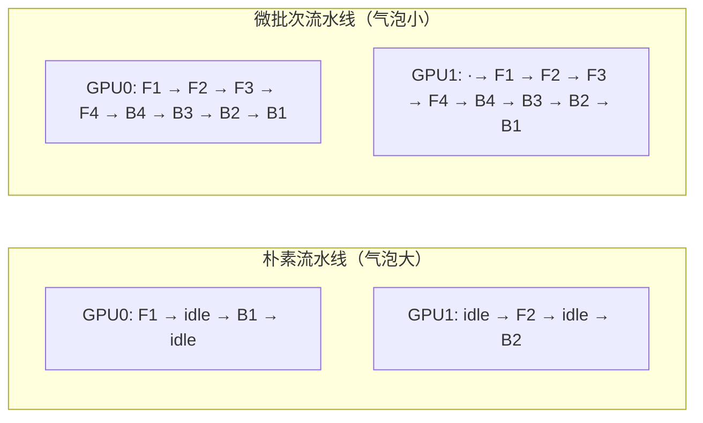
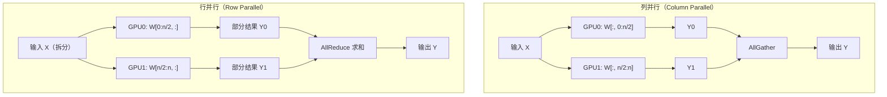
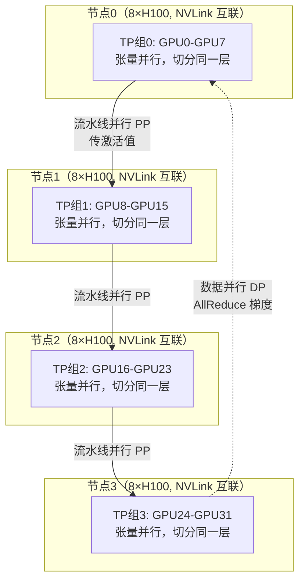

# 7.7 分布式训练——万卡集群怎么训模型

> **一句话定位**：大模型的参数量动辄百亿千亿，单张 GPU 既装不下也训不动。分布式训练（Distributed Training）就是用成百上千张 GPU 协同训练一个模型——这和你做分库分表、用 MapReduce 跑批处理的动机完全一致：单机存储不够就拆数据，单机算力不够就拆任务。这一节站在后端工程师的视角，讲清楚数据并行、模型并行、混合并行三大策略，以及 ZeRO、流水线 bubble、通信优化等核心工程问题。

---

## 一、为什么需要分布式训练

### 1.1 单卡装不下：显存墙

训练一个模型，显存里要同时放下四样东西：

| 存储项 | 说明 | 大小（以 Adam 优化器为例） |
|--------|------|--------------------------|
| **模型参数（Parameters）** | 模型权重本身 | 每个参数 2 字节（FP16） |
| **梯度（Gradients）** | 反向传播算出的梯度 | 每个参数 2 字节（FP16） |
| **优化器状态（Optimizer States）** | Adam 的一阶动量 + 二阶动量 | 每个参数 8 字节（2 份 FP32） |
| **激活值（Activations）** | 前向传播的中间结果，反向传播时要用 | 随 batch size 和序列长度增长 |

以 LLaMA-70B 为例做一个粗略估算：

```
LLaMA-70B 训练显存估算（Adam + FP16 混合精度）：
  参数:      70B × 2 bytes  = 140 GB
  梯度:      70B × 2 bytes  = 140 GB
  优化器状态: 70B × 8 bytes  = 560 GB  （Adam 的 m 和 v，各一份 FP32）
  激活值:    ~50 GB         （取决于 batch size 和序列长度）
  ─────────────────────────
  总计:      ~890 GB

单张 A100 显存: 80 GB
需要几张？  890 / 80 ≈ 12 张（仅放权重相关，不算激活值）
```

结论很直接：**单张 GPU 根本放不下**。这就是"显存墙"——不是算力不够，而是物理上塞不进去。

### 1.2 训练时间：算力墙

即使模型小到单卡能放下（比如 LLaMA-7B），训练时间也是个大问题：

```
LLaMA-7B 训练时间估算：
  训练 Token 数: 1 Trillion（1 万亿）
  单卡吞吐量:    ~4000 tokens/s（A100）
  单卡需要时间:  1T / 4000 ≈ 2,500,000 秒 ≈ 29 天

实际还要算上通信开销、Checkpoint 保存、验证等，单卡训完要数月。
如果是 LLaMA-70B，单卡理论需要数年——工程上不可接受。
```

### 1.3 后端类比：分布式动机

| 分布式训练的动机 | 后端/大数据的类比 | 解决方案 |
|-----------------|------------------|---------|
| 模型太大，单卡装不下 | 单表数据太大，单库存不下 | **模型并行**（拆模型 ≈ 分表） |
| 算力不够，训练太慢 | 单机计算太慢 | **数据并行**（拆数据 ≈ MapReduce） |
| 两者都不够 | 分库分表 + 读写分离 | **混合并行**（3D Parallel） |

你做分库分表时，先按业务分库（垂直拆），再按数据量分表（水平拆）。分布式训练的思路一模一样：先按模型结构拆（模型并行），再按数据拆（数据并行），两者叠加就是 3D 并行。

---

## 二、数据并行（Data Parallel）

### 2.1 核心思想

**数据并行（Data Parallel, DP）** 的核心思路：每张 GPU 持有**完整的模型副本**，各自处理**不同的数据批次**，各自算梯度，最后把梯度汇总（Reduce）取平均，统一更新参数。

```
数据并行的一个训练步骤：
  1. 将一个 batch 均匀拆分到 N 张 GPU（每张拿 batch/N 条数据）
  2. 每张 GPU 各自做前向传播 + 反向传播，算出本地梯度
  3. 所有 GPU 的梯度做 AllReduce（汇总取平均）
  4. 每张 GPU 用平均梯度更新各自的模型参数（更新后各卡参数一致）
```

用 MapReduce 来类比再贴切不过：**Map 阶段**——每个 Worker（GPU）处理一部分数据（子 batch），算出本地梯度；**Reduce 阶段**——所有梯度汇总取平均，统一更新。唯一的区别是 MapReduce 的 Reduce 在结束时做一次，而数据并行在每个训练 step 都要做一次梯度同步。

### 2.2 DP → DDP → FSDP 的演进

数据并行经历了三代演进，每一代都在解决前一代的瓶颈：

| 演进阶段 | 全称 | 通信方式 | 核心改进 | 瓶颈/局限 |
|---------|------|---------|---------|----------|
| **DP** | DataParallel | 参数服务器（Parameter Server） | 单进程多线程，主 GPU 汇总梯度 | Python GIL 限制、主 GPU 通信瓶颈 |
| **DDP** | DistributedDataParallel | AllReduce（环形通信） | 多进程，去中心化通信，每张 GPU 通信量均衡 | 每张卡仍存完整模型副本，大模型装不下 |
| **FSDP** | Fully Sharded Data Parallel | AllReduce + AllGather + ReduceScatter | 分片存储参数/梯度/优化器状态，按需聚合 | 通信次数增多，需要精细的通信-计算重叠 |

**DP 的问题**：PyTorch 的 `DataParallel` 是单进程多线程的。Python 有 GIL（全局解释器锁），多线程无法真正并行利用多卡。而且它用"参数服务器"模式——一张主 GPU 收集所有梯度再广播，主 GPU 成为通信瓶颈。

**DDP 的改进**：改用多进程（每张 GPU 一个进程），通信从"星型"改成"环形 AllReduce"——每张 GPU 只和相邻两张 GPU 通信，通信量与 GPU 数量无关，带宽利用率高。但 DDP 每张卡仍然存完整的模型副本，70B 模型还是放不下。

**FSDP 的突破**：借鉴 ZeRO 策略，把参数、梯度、优化器状态都分片存储。每张卡只存 1/N 的模型状态，需要用的时候再临时聚合（AllGather）。这样 70B 模型用 16 张卡就能放下。

```python
# DDP 用法（PyTorch 原生，每张卡存完整模型）
model = MyModel().cuda()
model = DDP(model, device_ids=[local_rank])

# FSDP 用法（分片存储，大模型友好）
model = MyModel().cuda()
model = FSDP(model)  # 参数/梯度/优化器状态自动分片到各卡
```

### 2.3 ZeRO：显存极致优化

**ZeRO（Zero Redundancy Optimizer，零冗余优化器）** 是 DeepSpeed 提出的显存优化策略。它发现 DDP 中每张卡都存了一份完整的模型副本——这是巨大的冗余。ZeRO 分三个阶段逐步消除冗余：

| 阶段 | 分片对象 | 显存占用（70B 模型，16 卡） | 通信开销 | 适用场景 |
|------|---------|---------------------------|---------|---------|
| **ZeRO-1** | 优化器状态 | 参数 140G + 梯度 140G + 优化器 35G = 315G | 与 DDP 相同 | 中等模型，想省优化器显存 |
| **ZeRO-2** | 优化器状态 + 梯度 | 参数 140G + 梯度 9G + 优化器 35G = 184G | 略增（ReduceScatter 替代 AllReduce） | 大模型，通信不是瓶颈 |
| **ZeRO-3** | 优化器状态 + 梯度 + 参数 | 参数 9G + 梯度 9G + 优化器 35G = 53G | 显著增加（需要 AllGather 参数） | 超大模型，显存极度紧张 |

> 上表中每项除以 16（卡数）得到单卡显存。ZeRO-3 把单卡显存从 ~56G 降到 ~3.3G，代价是前向和反向传播时都要做一次 AllGather 把参数临时聚合回来。

**选择建议**：从 ZeRO-1 开始试，显存不够就上 ZeRO-2，还不够就 ZeRO-3。通信开销递增，但显存节省递减——找到你的卡在显存和通信之间的甜点。

---

## 三、模型并行（Model Parallel）

数据并行解决的是"算力不够"，但解决不了"单卡装不下"——因为每张卡还是要存完整模型。模型并行（Model Parallel, MP）直接把模型拆开，分到多张 GPU 上。

### 3.1 流水线并行（Pipeline Parallel）

**流水线并行（Pipeline Parallel, PP）** 把模型按层切分：比如一个 80 层的 Transformer，前 40 层放 GPU 0，后 40 层放 GPU 1。数据像流水线一样从 GPU 0 流向 GPU 1。

**问题：Pipeline Bubble（气泡）**。GPU 0 算完前 40 层把结果传给 GPU 1 后，GPU 0 就闲着等 GPU 1 算完后 40 层——这就是"气泡"，GPU 利用率很低。

```
朴素流水线（无微批次）—— 大量气泡：
  时间 ──────────────────────────────────────→
  GPU 0: [F1][    idle    ][B1][    idle    ]
  GPU 1: [idle][    F2    ][idle][    B2    ]
  
  F=前向  B=反向  idle=空闲（气泡）
```

**解决：微批次（Micro-batch）流水线**。把一个 batch 拆成多个微批次，GPU 0 处理完微批次 1 的前向后立即传给 GPU 1，自己马上处理微批次 2。就像工厂流水线——第一道工序完成的产品立即传给第二道工序，第一道工序不用等整批完成。



微批次越多，气泡占比越小。气泡比例约为 `(PP - 1) / (PP - 1 + M)`，其中 PP 是流水线阶段数，M 是微批次数。当 M 远大于 PP 时，气泡可以忽略不计。

**后端类比**：这就像 MapReduce 的 Shuffle 阶段——Map 任务不用等全部完成才开始 Shuffle，可以先完成的先 Shuffle。流水线并行也是同理：前面的层不用等整 batch 算完，先完成的微批次直接往后传。

### 3.2 张量并行（Tensor Parallel）

**张量并行（Tensor Parallel, TP）** 不按层切，而是把每一层内部的矩阵拆到多张 GPU 上。具体来说，把权重矩阵按行或按列切分。

**列并行（Column Parallel）**：把权重矩阵 W 按列切，每张 GPU 拿一部分列。输入 X 分别乘以各 GPU 的 W 切片，各自得到部分输出，最后 AllGather 拼接。

**行并行（Row Parallel）**：把权重矩阵 W 按行切，输入 X 也按对应维度切分，各 GPU 分别做矩阵乘法得到部分结果，最后 AllReduce 求和。



**Megatron-LM** 的经典做法：在 Transformer 的 FFN（前馈网络）层，先做列并行（第一个线性层），再做行并行（第二个线性层），两个并行的通信刚好抵消——列并行的 AllGather 和行并行的 AllReduce 之间不需要额外通信。这就是"列并行 + 行并行"的精妙组合。

**后端类比**：张量并行就像**矩阵分块运算**——线性代数中的分块矩阵乘法，一个大矩阵乘法可以拆成多个小矩阵乘法再组合。也像分库分表中的"水平拆分"——同一张表的数据按 ID 取模拆到不同库，查询时再合并结果。

---

## 四、混合并行（3D Parallel）

### 4.1 三种并行叠加

现实中的大模型训练，三种并行策略同时使用，称为 **3D Parallel（三维并行）**：

```
3D Parallel = 数据并行（DP） × 流水线并行（PP） × 张量并行（TP）

以 LLaMA 3 70B 为例（16384 张 H100）：
  TP = 8    （节点内 8 张 GPU 做张量并行，NVLink 高带宽）
  PP = 4    （4 个流水线阶段）
  DP = 512  （数据并行组数）
  总 GPU = 8 × 4 × 512 = 16384
```

**分配原则**：
- **TP 放节点内**：张量并行通信最频繁，需要最高带宽，放在同一个节点的 NVLink 互联范围内（通常 8 张）。
- **PP 跨节点**：流水线并行通信量中等（只传激活值），可以跨节点，但也尽量少跨。
- **DP 放最外层**：数据并行通信量相对可控（每 step 一次梯度同步），适合大规模扩展。



### 4.2 如何选择并行组合

| 并行策略 | 解决的问题 | 通信频率 | 通信量 | 推荐放置 |
|---------|-----------|---------|--------|---------|
| **张量并行 TP** | 单层权重太大 | 每层前向+反向 | 大 | 节点内（NVLink） |
| **流水线并行 PP** | 模型层数太多 | 微批次边界 | 中 | 节点间（InfiniBand） |
| **数据并行 DP** | 训练速度太慢 | 每 step 一次 | 中 | 最外层，大规模扩展 |

**经验法则**：TP 尽量小（8 以内，受限于节点内 GPU 数），PP 适中（4-8），DP 尽量大（提供线性加速比）。先确定 TP（按单层显存需求），再确定 PP（按总层数），剩余 GPU 全给 DP。

---

## 五、通信瓶颈与优化

### 5.1 三大通信原语

分布式训练的核心通信操作有三个，理解它们是优化通信的基础：

| 通信原语 | 全称 | 行为 | 后端类比 |
|---------|------|------|---------|
| **AllReduce** | All Reduce | 所有 GPU 的数据做规约（如求和），结果发回所有 GPU | MapReduce 的 Reduce + Broadcast |
| **AllGather** | All Gather | 每张 GPU 收集所有 GPU 的分片，拼成完整数据 | 分布式缓存的全量同步 |
| **ReduceScatter** | Reduce Scatter | AllReduce 的拆分版：先规约再按 GPU 分片分发 | Reduce 后再 Shuffle 分发 |

```
AllReduce（梯度同步，DDP 核心）：
  GPU0: [1]          GPU0: [6]
  GPU1: [2]   ──→   GPU1: [6]    （所有 GPU 拿到求和结果 1+2+3=6）
  GPU2: [3]          GPU2: [6]

AllGather（参数聚合，FSDP/ZeRO-3 核心）：
  GPU0: [A]          GPU0: [A, B, C]
  GPU1: [B]   ──→   GPU1: [A, B, C]  （所有 GPU 拿到完整拼接结果）
  GPU2: [C]          GPU2: [A, B, C]
```

### 5.2 GPU 互联拓扑

通信速度取决于物理链路，不同层级的互联带宽差异巨大：

| 互联方式 | 连接范围 | 带宽 | 延迟 | 后端类比 |
|---------|---------|------|------|---------|
| **NVLink** | 节点内 GPU 间 | 300-900 GB/s | 极低 | 同机多核共享内存 |
| **InfiniBand（IB）** | 节点间 | 200-400 GB/s | 低 | 机房内万兆/十万兆网络 |
| **RoCE** | 节点间（以太网） | 100-200 GB/s | 中 | 数据中心普通网络 |
| **PCIe** | 节点内 CPU-GPU | 32-64 GB/s | 中 | 主板总线 |

这就是为什么张量并行（通信最频繁）必须放在节点内用 NVLink，而数据并行（通信相对不频繁）可以跨节点用 InfiniBand。

### 5.3 通信-计算重叠

朴素的做法是"先通信再计算"——通信时 GPU 空闲，计算时网络空闲。优化思路是**重叠（Overlap）**：把计算和通信并行执行。

```python
# 朴素方式：通信和计算串行
loss = forward()        # 计算
loss.backward()         # 计算
all_reduce(gradients)   # 通信（GPU 空闲等待）
optimizer.step()        # 计算

# 优化方式：梯度就绪后立即启动通信，同时继续反向计算下一层
# PyTorch DDP 的梯度桶（Gradient Bucketing）就是这么做的：
#   - 把梯度分成多个桶
#   - 一个桶的梯度算完就立即 AllReduce
#   - 同时反向传播还在算其他层的梯度
#   - 通信和计算重叠，隐藏通信延迟
```

### 5.4 梯度累积

**梯度累积（Gradient Accumulation）** 的思路：不每个 step 都同步梯度，而是累积几个 step 的梯度后再做一次 AllReduce。通信频率从"每 step 一次"变成"每 N step 一次"，通信开销降低 N 倍。

```
普通训练（每 step 同步）：
  step 1: 前向→反向→AllReduce→更新
  step 2: 前向→反向→AllReduce→更新
  step 3: 前向→反向→AllReduce→更新
  通信次数: 3 次

梯度累积（accumulation_steps=3）：
  step 1: 前向→反向→累积梯度（不同步）
  step 2: 前向→反向→累积梯度（不同步）
  step 3: 前向→反向→AllReduce→更新（累积3步的梯度）
  通信次数: 1 次（减少 2/3）
```

**代价**：等效 batch size 变大（实际 batch = micro_batch × accumulation_steps × DP），可能影响训练收敛。需要在通信效率和收敛性之间权衡。

### 5.5 混合精度训练

**混合精度训练（Mixed Precision Training）** 是几乎标配的优化：用低精度（FP16/BF16）做前向和反向传播（快、省显存），用高精度（FP32）做优化器更新（保证数值稳定性）。

```
混合精度训练一个 step 的流程：
  1. FP32 权重 → 转成 FP16（用于前向/反向）
  2. FP16 前向传播 → 算 loss
  3. FP16 反向传播 → 算 FP16 梯度
  4. FP16 梯度 → 转成 FP32（用于优化器更新）
  5. FP32 优化器更新（Adam 的 m、v 用 FP32 维护）
  6. 更新后的 FP32 权重 → 下一轮

收益：
  - 前向/反向速度快 ~2x（FP16 算力是 FP32 的 2 倍）
  - 激活值显存减半（FP16 存储是 FP32 的一半）
  - 优化器状态仍用 FP32，保证收敛稳定性
```

**为什么用 BF16 而不是 FP16？** FP16 的指数位只有 5 位（动态范围小），大梯度容易溢出（变成 inf），小梯度容易下溢（变成 0）。**BF16（BFloat16）** 的指数位有 8 位——和 FP32 相同，动态范围一致，不会溢出。代价是尾数位少（精度略低），但对训练影响不大。现代 GPU（A100 及以后）原生支持 BF16，已经成为大模型训练的事实标准。

---

## 六、训练框架对比

### 6.1 主流框架

| 框架 | 出品方 | 核心能力 | 支持的并行 | 易用性 | 适合规模 |
|------|--------|---------|-----------|--------|---------|
| **DeepSpeed** | Microsoft | ZeRO 系列、ZeRO-Infinity（NVMe 卸载） | DP + ZeRO + PP（有限 TP） | 中（配置文件驱动） | 千亿级，万卡 |
| **Megatron-LM** | NVIDIA | 张量并行 + 流水线并行的标杆实现 | TP + PP + DP（3D Parallel） | 低（需深度改造代码） | 千亿级，万卡 |
| **FSDP** | PyTorch 官方 | ZeRO-3 的原生实现 | DP + ZeRO-3 | 高（几行代码） | 百亿级，千卡 |
| **Accelerate** | HuggingFace | 轻量封装，最小代码改动 | DP + DDP + FSDP | 极高（几乎零改动） | 十亿~百亿级 |

### 6.2 选型建议

```python
# DeepSpeed 示例：用 JSON 配置文件控制 ZeRO 阶段
# ds_config.json
{
  "zero_optimization": {
    "stage": 2,               // ZeRO-2：分片优化器状态 + 梯度
    "allgather_partitions": true,
    "reduce_scatter": true
  },
  "bf16": { "enabled": true }  // 混合精度
}

# 启动命令
# deepspeed --num_gpus=8 train.py --deepspeed ds_config.json

# -----

# FSDP 示例：PyTorch 原生，几行代码搞定
from torch.distributed.fsdp import FullyShardedDataParallel as FSDP

model = MyModel().cuda()
model = FSDP(model)  # 自动分片参数/梯度/优化器状态

# -----

# Accelerate 示例：最小改动
from accelerate import Accelerator
accelerator = Accelerator()

model, optimizer, dataloader = accelerator.prepare(
    model, optimizer, dataloader
)  # 自动处理分布式包装、设备放置、梯度同步
```

**选型经验**：
- **中小团队、快速验证**：Accelerate + FSDP，零成本上手。
- **大规模训练、需要极致优化**：DeepSpeed（ZeRO）或 Megatron-LM（3D Parallel），需要较多工程投入。
- **两者结合**：DeepSpeed-Megatron（DeepSpeed 的 ZeRO + Megatron 的 TP/PP），是当前万亿参数模型训练的主流方案。

---

## 七、面试深度剖析

### 考点 1：三种并行策略分别解决什么问题？如何选择？

**回答**：三种并行解决不同维度的问题——**数据并行**解决"训练太慢"，每张卡处理不同数据，加速训练；**张量并行**解决"单层太大"，把每层权重矩阵拆到多卡，解决单卡显存不够；**流水线并行**解决"层数太多"，按层切分到多卡，解决模型纵向放不下。选择策略看瓶颈在哪：算力瓶颈用 DP，单层显存瓶颈用 TP（放节点内 NVLink），总层数瓶颈用 PP（跨节点）。实际大模型训练三者叠加——TP 在节点内、PP 跨少量节点、DP 做大规模扩展。用后端的话说：TP 像分表（拆同一张表），PP 像分库（拆不同库），DP 像 MapReduce（拆数据并行处理）。

### 考点 2：ZeRO 的三个阶段各分片什么？显存节省多少？

**回答**：ZeRO 逐步消除数据并行中的冗余存储。**ZeRO-1** 分片优化器状态（Adam 的 m 和 v），显存从 16×Ψ 降到 4×Ψ（Ψ 为参数量，以 FP16 + Adam 为例），通信开销不变。**ZeRO-2** 额外分片梯度，显存降到 ~2×Ψ，通信用 ReduceScatter 替代 AllReduce，开销略增。**ZeRO-3** 再额外分片参数本身，显存降到 ~2×Ψ/N（N 为卡数），但前向和反向都需要 AllGather 临时聚合参数，通信开销显著增加。以 70B 模型 16 卡为例，DDP 单卡需 ~890GB（放不下），ZeRO-3 单卡只需 ~53GB（能放下）。本质是用更多通信换更少显存，在显存和带宽之间找平衡。

### 考点 3：流水线并行的 bubble 问题怎么解决？

**回答**：朴素流水线并行中，GPU 0 算完前向传给 GPU 1 后就空闲等待，GPU 1 算完后向再传回 GPU 0——这段空闲就是"气泡"。解决方案是**微批次流水线**：把一个 batch 拆成 M 个微批次，GPU 0 算完微批次 1 就立即传给 GPU 1，自己马上算微批次 2。气泡比例约为 `(PP - 1) / (PP - 1 + M)`，M 越大气泡越小。还有 GPipe 和 1F1B 等调度策略进一步优化——1F1B（one Forward one Backward）让前向和反向交替执行，减少同时驻留的激活值数量，既减气泡又省显存。类比工厂流水线：不是等整批产品做完第一道工序再传第二道，而是每件产品做完就传，保持所有工序持续运转。

### 考点 4：为什么混合精度训练用 BF16 而不是 FP16？

**回答**：关键在于指数位的差异。FP16 有 5 位指数（动态范围约 6×10^-5 到 65504），FP32 有 8 位指数（动态范围约 10^-38 到 3×10^38）。训练中梯度值的动态范围很大——大梯度在 FP16 下会溢出成 inf（上溢），小梯度会变成 0（下溢），导致训练崩溃或不收敛。BF16（BFloat16）有 8 位指数——和 FP32 完全相同，动态范围一致，不会溢出。虽然尾数只有 7 位（精度低于 FP16 的 10 位），但训练对精度的容忍度远高于对动态范围的要求。打个比方：FP16 像一个量程小但刻度细的尺子，容易超出量程；BF16 像一个量程大但刻度粗的尺子，虽然不够精细但不会超出范围。现代 GPU（A100+）原生支持 BF16，已成为大模型训练的事实标准。

---

[← 上一节：7.6 Agent 基础](./06-Agent基础.md) | [返回本章导读](./README.md)
