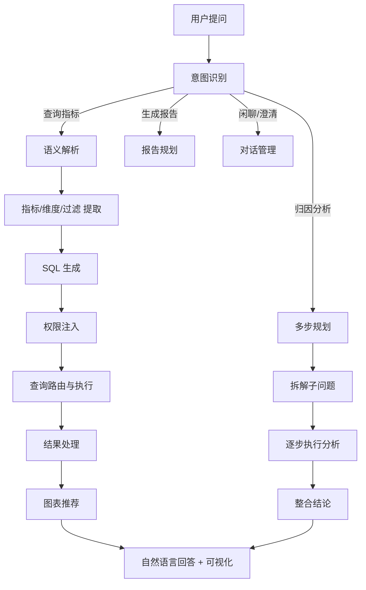

# 7.8 AgentBI 智能分析架构

> **一句话定位**：AgentBI 是将大语言模型（LLM）与 BI 分析深度融合的智能分析平台——用户用自然语言提问，系统自动完成意图识别、语义解析、SQL 生成、查询执行、图表推荐和多步分析，实现「对话即分析」。

---

## 一、AgentBI 是什么

### 1.1 从传统 BI 到 AgentBI 的演进

| 代际 | 交互方式 | 用户门槛 | 分析深度 |
|------|---------|---------|---------|
| **报表 BI** | 固定报表，只能看 | 低 | 浅（只能看预设维度） |
| **自助 BI** | 拖拽维度/度量，自助探索 | 中（需理解数据模型） | 中（灵活但需人工操作） |
| **SQL BI** | 写 SQL 查询 | 高（需会 SQL） | 深（任意查询） |
| **AgentBI** | 自然语言对话 | ⭐ 最低 | ⭐ 深（Agent 自动多步分析） |

### 1.2 AgentBI 的核心价值

```
传统 BI 的问题：
  - 业务方不会写 SQL → 提数需求排队
  - 报表固定 → 想看新维度要等开发
  - 分析过程割裂 → 看完数据还要手动做归因

AgentBI 的解决：
  - 自然语言提问 → 零门槛
  - 动态生成查询 → 任意维度实时分析
  - 多步推理 → 自动做归因、对比、趋势分析
  - 可解释 → 展示 SQL 和分析逻辑，结果可追溯
```

---

## 二、整体架构

### 2.1 系统架构全景

```
┌─────────────────────────────────────────────────────────────┐
│                        用户交互层                             │
│  自然语言输入 │ 对话历史 │ 图表展示 │ 报告输出               │
├─────────────────────────────────────────────────────────────┤
│                        Agent 编排层                           │
│  ┌──────────┐ ┌──────────┐ ┌──────────┐ ┌──────────┐      │
│  │意图识别   │ │多步规划   │ │工具调用   │ │结果整合   │      │
│  │(Router)  │ │(Planner) │ │(Executor)│ │(Synthesizer)│   │
│  └──────────┘ └──────────┘ └──────────┘ └──────────┘      │
├─────────────────────────────────────────────────────────────┤
│                        能力层                                 │
│  ┌────────┐ ┌────────┐ ┌────────┐ ┌────────┐ ┌────────┐  │
│  │语义解析 │ │SQL生成  │ │图表推荐 │ │归因分析 │ │报告生成 │  │
│  └────────┘ └────────┘ └────────┘ └────────┘ └────────┘  │
├─────────────────────────────────────────────────────────────┤
│                        语义层                                 │
│  指标定义 │ 维度定义 │ 数据集 │ 权限规则 │ 业务术语映射       │
├─────────────────────────────────────────────────────────────┤
│                        查询执行层                             │
│  查询路由 │ SQL 改写 │ 权限注入 │ 缓存 │ 限流               │
├─────────────────────────────────────────────────────────────┤
│                        数据底座                               │
│  Doris │ ClickHouse │ Presto │ Spark SQL │ 湖仓表           │
└─────────────────────────────────────────────────────────────┘
```

### 2.2 核心处理流程



---

## 三、核心模块详解

### 3.1 意图识别（Intent Router）

用户的自然语言输入可能对应多种意图：

| 意图类型 | 示例 | 处理方式 |
|---------|------|---------|
| **指标查询** | "上周北京的 GMV 是多少" | 语义解析 → SQL → 执行 |
| **对比分析** | "北京和上海的 GMV 对比" | 多维度查询 → 对比图表 |
| **趋势分析** | "最近一个月 GMV 的趋势" | 时间序列查询 → 折线图 |
| **归因分析** | "GMV 为什么下降了" | 多步分析 → 维度下钻 |
| **预测** | "下个月 GMV 预计多少" | 时序预测模型 |
| **报告生成** | "生成本周经营周报" | 多指标查询 → 报告模板 |
| **澄清** | "GMV 是含税的吗" | 查询指标定义 → 回答 |
| **闲聊** | "你好" | 对话管理 |

**实现方式**：
- 基于 LLM 的 Few-shot 分类
- 或 LLM + Function Calling（让模型选择调用哪个工具）

### 3.2 语义解析（Semantic Parsing）

将自然语言转化为结构化的查询意图：

```
输入: "上周北京各品类的 GMV，按从高到低排"

解析结果:
{
  "metric": "gmv",
  "dimensions": ["category"],
  "filters": [
    {"field": "city", "op": "=", "value": "北京"},
    {"field": "dt", "op": "between", "value": ["2024-01-15", "2024-01-21"]}
  ],
  "order_by": {"field": "gmv", "direction": "DESC"},
  "time_granularity": "week"
}
```

**关键挑战**：

| 挑战 | 示例 | 解决方案 |
|------|------|---------|
| **歧义消解** | "苹果"是品牌还是品类？ | 结合上下文 + 业务术语表 |
| **时间理解** | "上周"、"最近三天"、"Q2" | 时间表达式解析器 |
| **指标映射** | "成交额"="GMV"="交易金额" | 同义词表 + Embedding 相似度 |
| **隐含条件** | "活跃用户的客单价" | 理解"活跃用户"的业务定义 |
| **多轮对话** | "那上海呢？" | 对话状态管理，继承上文条件 |

### 3.3 SQL 生成

#### 方案一：语义层驱动（推荐）

```
语义解析结果 → 查找语义层指标定义 → 模板化 SQL 生成
```

**优势**：SQL 正确性由语义层保证，不依赖 LLM 生成 SQL 的准确性。

```python
# 伪代码：基于语义层的 SQL 生成
def generate_sql(parsed_intent):
    metric = semantic_layer.get_metric(parsed_intent.metric)  # 获取指标定义
    dataset = metric.get_dataset()  # 获取关联数据集
    
    sql = f"""
    SELECT {', '.join(parsed_intent.dimensions)},
           {metric.sql_expression} AS {metric.name}
    FROM {dataset.table}
    WHERE {metric.base_filters}
      AND {build_where(parsed_intent.filters)}
    GROUP BY {', '.join(parsed_intent.dimensions)}
    ORDER BY {parsed_intent.order_by}
    """
    return sql
```

#### 方案二：LLM 直接生成 SQL（NL2SQL）

```
用户问题 + Schema 信息 + Few-shot 示例 → LLM → SQL
```

**优势**：灵活，能处理语义层未覆盖的查询。
**劣势**：SQL 可能错误，需要验证和修复机制。

#### 方案三：混合方案（生产推荐）

```
用户问题
  → 语义解析
    → 能匹配到语义层指标？
      → 是 → 语义层驱动生成 SQL（高置信度）
      → 否 → LLM 直接生成 SQL（需验证）
        → SQL 验证（语法检查 + 执行计划检查）
          → 通过 → 执行
          → 不通过 → 自动修复或请求用户澄清
```

### 3.4 查询编排引擎

复杂分析往往需要多次查询：

```
用户: "GMV 为什么下降了？"

查询编排:
  Step 1: 查询近期 GMV 趋势，确认下降时间点
  Step 2: 按城市维度下钻，找到下降最多的城市
  Step 3: 对下降城市按品类下钻，找到具体品类
  Step 4: 对比同期数据，排除季节性因素
  Step 5: 整合分析结论
```

**编排引擎设计**：

```python
class QueryOrchestrator:
    def plan(self, question, context):
        """LLM 生成分析计划"""
        plan = self.llm.generate_plan(question, context)
        return plan  # [Step1, Step2, Step3, ...]
    
    def execute_step(self, step, previous_results):
        """执行单步查询"""
        sql = self.sql_generator.generate(step, previous_results)
        result = self.query_engine.execute(sql)
        return result
    
    def synthesize(self, question, all_results):
        """整合所有步骤的结果，生成最终回答"""
        answer = self.llm.synthesize(question, all_results)
        return answer
```

### 3.5 图表推荐

根据查询结果自动选择最合适的可视化方式：

| 数据特征 | 推荐图表 | 理由 |
|---------|---------|------|
| 单指标 + 时间维度 | 折线图 | 展示趋势 |
| 单指标 + 分类维度（< 10 项） | 柱状图 | 对比大小 |
| 单指标 + 分类维度（占比） | 饼图 | 展示构成 |
| 两个指标 + 时间维度 | 双轴折线图 | 对比趋势 |
| 多维度 + 多指标 | 表格 | 信息密度高 |
| 地理维度 | 地图 | 空间分布 |
| 单个数值 | 指标卡 | 突出重点 |

**实现方式**：
- 规则引擎（基于维度数量、数据类型、数据量）
- 或 LLM 推荐（更灵活，能理解用户意图）

### 3.6 多步分析与归因

AgentBI 的核心差异化能力——不只是查数，还能自动做分析：

```
归因分析框架:
  1. 确认异常（指标确实异常了吗？偏离多少？）
  2. 时间定位（什么时候开始异常的？）
  3. 维度下钻（哪个维度贡献了最大变化？）
  4. 交叉分析（多维度交叉找到根因组合）
  5. 排除干扰（排除季节性、节假日等因素）
  6. 生成结论（用自然语言总结根因）
```

**维度贡献度计算**：

```sql
-- 找到 GMV 下降的主要贡献维度
WITH current AS (
    SELECT city, SUM(amount) AS gmv FROM orders WHERE dt = '2024-01-20' GROUP BY city
),
previous AS (
    SELECT city, SUM(amount) AS gmv FROM orders WHERE dt = '2024-01-13' GROUP BY city
)
SELECT
    c.city,
    c.gmv - p.gmv AS delta,
    (c.gmv - p.gmv) / SUM(c.gmv - p.gmv) OVER() AS contribution_rate
FROM current c JOIN previous p ON c.city = p.city
ORDER BY delta ASC;  -- 下降最多的排前面
```

### 3.7 报告生成

自动生成结构化的分析报告：

```
报告生成流程:
  1. 确定报告模板（周报/月报/专题分析）
  2. 批量执行查询（核心指标 + 趋势 + 对比）
  3. 自动分析（同比环比 + 异常标注 + 归因）
  4. 图表生成（每个分析点配合适的图表）
  5. 文字生成（LLM 生成分析文字）
  6. 报告组装（模板 + 数据 + 图表 + 文字）
```

---

## 四、可解释性与可追溯性

### 4.1 为什么需要可解释

AgentBI 的结果必须让用户信任——用户需要知道「这个数字是怎么算出来的」。

### 4.2 可解释性设计

```
用户: "上周北京的 GMV 是多少？"

AgentBI 回答:
  📊 上周北京 GMV: ¥1,234,567

  📋 分析过程:
  - 指标: GMV（已支付且未退款的订单金额总和）
  - 时间: 2024-01-15 ~ 2024-01-21
  - 过滤: 城市 = 北京
  - 数据源: dws_order_daily（DWS 层订单日汇总表）
  
  🔍 执行 SQL:
  SELECT SUM(order_amount) AS gmv
  FROM dws_order_daily
  WHERE city = '北京'
    AND dt BETWEEN '2024-01-15' AND '2024-01-21'
    AND order_status = 'paid'
    AND refund_status = 'none'
  
  ℹ️ 指标口径: GMV = 已支付且未退款的订单金额总和
     数据更新时间: 2024-01-22 06:30
```

### 4.3 可追溯性

| 追溯维度 | 记录内容 |
|---------|---------|
| **查询追溯** | 用户问题 → 解析结果 → SQL → 执行引擎 → 结果 |
| **指标追溯** | 指标定义 → 技术口径 → 数据源表 → 数据血缘 |
| **权限追溯** | 用户身份 → 权限规则 → 过滤条件 → 实际可见数据 |
| **版本追溯** | 指标定义变更历史 → 影响的历史查询 |

---

## 五、关键技术挑战

### 5.1 准确性保障

| 挑战 | 解决方案 |
|------|---------|
| SQL 生成错误 | 语义层兜底 + SQL 验证 + 自动修复 |
| 指标理解错误 | 同义词表 + 业务术语映射 + 用户确认 |
| 时间理解错误 | 专用时间解析器 + 明确展示时间范围 |
| 多义性 | 主动澄清 + 上下文推理 |

### 5.2 性能优化

| 场景 | 优化方案 |
|------|---------|
| 高频查询 | 结果缓存（相同问题直接返回） |
| 大数据量 | 查询路由到预计算层（ADS/物化视图） |
| 多步分析 | 并行执行无依赖的子查询 |
| 首次响应慢 | 流式返回（先返回文字，再返回图表） |

### 5.3 安全与权限

```
用户提问
  → 身份认证（谁在问？）
  → 权限检查（能看哪些指标/维度？）
  → SQL 注入权限过滤（行级/列级）
  → 结果脱敏（敏感字段脱敏展示）
  → 审计记录（记录查询行为）
```

### 5.4 多轮对话

```
用户: "上周北京的 GMV"
Agent: "上周北京 GMV 为 ¥1,234,567"

用户: "和上海对比呢？"  ← 需要理解"和上海对比"是在上文基础上
Agent: 继承上文条件（上周、GMV），新增上海，生成对比

用户: "按品类拆一下"  ← 需要理解是对北京和上海都按品类拆
Agent: 继承全部上文，新增品类维度
```

**对话状态管理**：
```json
{
  "session_id": "xxx",
  "context": {
    "metric": "gmv",
    "time_range": ["2024-01-15", "2024-01-21"],
    "filters": [{"city": ["北京", "上海"]}],
    "dimensions": ["city", "category"]
  },
  "history": [
    {"role": "user", "content": "上周北京的 GMV"},
    {"role": "assistant", "content": "..."},
    {"role": "user", "content": "和上海对比呢？"},
    {"role": "assistant", "content": "..."}
  ]
}
```

---

## 六、与数据平台的打通

### 6.1 统一数据资产复用

```
AgentBI 不是独立系统，而是数据平台的「智能前端」：
  - 复用统一数据资产（数仓分层表、湖仓表）
  - 复用统一指标口径（语义层定义）
  - 复用统一权限体系（行列级权限）
  - 复用统一查询引擎（Doris/Presto/Spark）
```

### 6.2 架构集成

```
┌─────────────────────────────────────────────────────┐
│                    AgentBI                            │
│  (自然语言理解 + 多步分析 + 可视化)                    │
├─────────────────────────────────────────────────────┤
│                    语义层                             │
│  (指标定义 + 维度 + 权限 + SQL 生成)                  │
├─────────────────────────────────────────────────────┤
│                    数据平台                           │
│  湖仓底座 │ 计算引擎 │ 元数据 │ 数据治理 │ 调度      │
└─────────────────────────────────────────────────────┘
```

AgentBI 的价值在于**让数据平台的能力对业务用户零门槛可用**——数据平台建设得再好，如果业务方还是要提数需求排队，那平台的价值就打了折扣。

---

## 七、面试深度剖析

### Q1: AgentBI 和普通的 NL2SQL 有什么区别？

**答**：NL2SQL 只解决「自然语言→SQL」这一步；AgentBI 是完整的智能分析系统，包括：① 意图识别（不只是查数，还有归因/对比/预测/报告）；② 语义层集成（保证指标口径正确）；③ 多步分析（自动做维度下钻和归因）；④ 图表推荐（自动选择可视化方式）；⑤ 多轮对话（上下文理解）；⑥ 可解释性（展示分析过程和 SQL）。NL2SQL 是 AgentBI 的一个子能力。

### Q2: 如何保证 AgentBI 生成的 SQL 是正确的？

**答**：三层保障——① 语义层兜底：能匹配到语义层指标的查询，SQL 由语义层模板化生成，正确性有保证；② SQL 验证：对 LLM 生成的 SQL 做语法检查、执行计划分析、结果合理性校验；③ 自动修复：SQL 执行报错时，将错误信息反馈给 LLM 自动修复（最多重试 3 次）。生产中 80%+ 的查询应该走语义层路径。

### Q3: 多步分析的编排是怎么实现的？

**答**：用 LLM 作为 Planner——① 将用户问题分解为多个子步骤（如归因分析分解为：确认异常→时间定位→维度下钻→交叉分析→结论）；② 每个步骤生成对应的查询并执行；③ 后一步的查询可以依赖前一步的结果（如第一步发现北京下降最多，第二步就针对北京做品类下钻）；④ 最后由 LLM 整合所有步骤的结果生成自然语言结论。本质是 ReAct 模式的 Agent。

### Q4: 如何处理权限问题？

**答**：在查询执行前自动注入权限过滤——① 从用户身份获取数据权限范围（如只能看华北区数据）；② 在生成的 SQL 中自动注入 WHERE 条件（如 `AND region = '华北'`）；③ 列级权限通过脱敏或隐藏实现；④ 指标级权限在语义解析阶段就过滤掉无权限的指标。用户感知不到权限过滤的存在，但只能看到自己有权限的数据。

### Q5: AgentBI 的技术架构怎么设计？

**答**：分五层——① 交互层（对话管理、多轮上下文）；② Agent 编排层（意图路由、多步规划、工具调用）；③ 能力层（语义解析、SQL 生成、图表推荐、归因分析、报告生成）；④ 语义层（指标/维度定义、权限规则、查询路由）；⑤ 执行层（Doris/Presto/Spark 等引擎）。核心设计原则是「语义层保证正确性，LLM 提供灵活性」——能走语义层的走语义层，语义层覆盖不到的才用 LLM 直接生成。

---

## 八、与本书其他章节的关联

| 关联章节 | 关系 |
|---------|------|
| [7.6 Agent 基础 - NL2SQL](./06-Agent基础.md) | NL2SQL 是 AgentBI 的核心子能力 |
| [7.2 Prompt Engineering](./02-Prompt-Engineering.md) | 意图识别、SQL 生成、结果整合都依赖 Prompt 设计 |
| [6.10 语义层与指标平台](../part6-bigdata/10-语义层与指标平台.md) | 语义层是 AgentBI 的数据基础设施 |
| [6.11 ClickHouse](../part6-bigdata/11-ClickHouse.md) | AgentBI 查询执行的目标引擎之一 |
| [6.12 Presto](../part6-bigdata/12-Presto查询引擎.md) | AgentBI 查询执行的目标引擎之一 |
| [6.9 湖仓一体](../part6-bigdata/09-湖仓一体.md) | AgentBI 底层数据来自湖仓底座 |

---

[← 7.7 分布式训练](./07-分布式训练.md) | [返回本章目录](./README.md) | [返回全书目录](../README.md)
