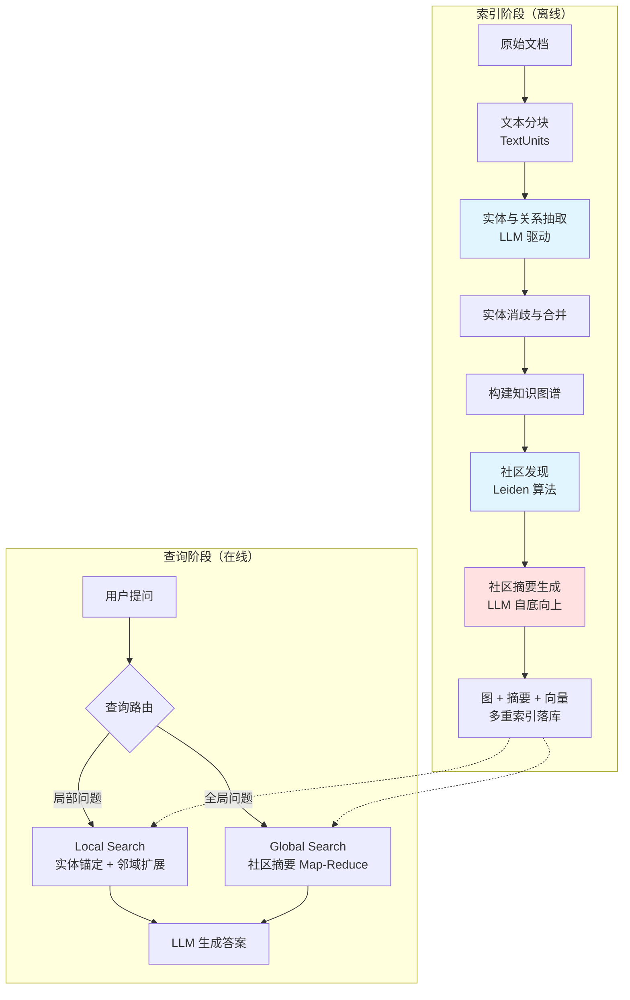
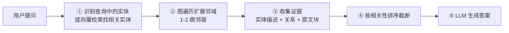
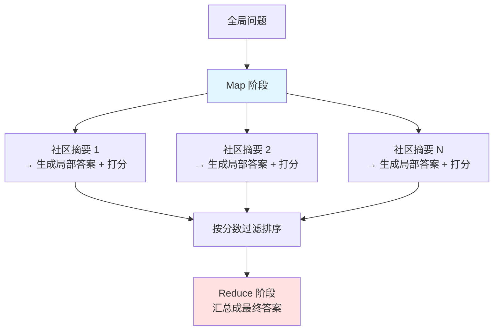

# 7.10 GraphRAG 与知识图谱增强——当向量检索回答不了「全局性问题」

> **一句话定位**：[7.1 RAG 实战](./01-RAG实战.md) 讲的向量 RAG 擅长回答「文档里某一段说了什么」，但它有个结构性缺陷——**只能召回 Top-K 个孤立片段，无法回答需要跨越大量文档做归纳的全局性问题**。GraphRAG 的思路是把非结构化文本先抽取成实体关系图，用图结构承载知识的关联性，再基于图做检索和摘要。这一节讲清楚为什么需要 GraphRAG、图谱怎么构建、检索怎么做、以及什么时候不该用它。

---

## 一、为什么向量 RAG 不够用

### 1.1 向量 RAG 的结构性缺陷

回顾向量 RAG 的流程：把文档切块 → 每块单独 Embedding → 查询时召回 Top-K 相似块。这个设计有三个天然的盲区：

```
盲区一：全局性问题（Global Question）

  提问："这份技术方案里一共提到了哪些技术风险？"

  向量检索的困境：
    "技术风险"这个查询只能召回 Top-10 个最相似的块
    但风险可能分散在 50 个不同的块里，第 11~50 个被截断了
    → 回答必然不完整，而且你不知道漏了什么
```

```
盲区二：多跳推理（Multi-hop Reasoning）

  提问："负责订单服务的那位工程师，他还参与了哪些项目？"

  向量检索的困境：
    需要两跳：① 订单服务 → 负责人是张三
             ② 张三 → 参与的其他项目
    单次向量检索只能召回和查询字面语义相似的块
    "张三参与了支付网关项目"这个块和原始查询的相似度很低
    → 检索不到，无法完成推理链
```

```
盲区三：关系型问题（Relational Question）

  提问："服务 A 和服务 B 之间有什么依赖关系？"

  向量检索的困境：
    这个关系可能从来没有被任何一段文本显式描述过
    而是需要从"A 调用了 C""C 依赖 B"两条信息里推导出来
    → 关系隐含在文档之间，不在文档之内
```

### 1.2 分块本身就在破坏结构

向量 RAG 的第一步就是分块，而**分块的过程会主动切断文档内和文档间的关联**：

```
原文：
  "订单服务由张三负责，它依赖库存服务。
   ……（中间隔了 3000 字）……
   库存服务的容量瓶颈是 Redis 连接数。"

分块后：
  Chunk 12: "订单服务由张三负责，它依赖库存服务。"
  Chunk 47: "库存服务的容量瓶颈是 Redis 连接数。"

  → 这两块之间"订单服务 → 库存服务 → Redis 瓶颈"的推理链
     在分块的那一刻就断了，向量检索永远无法重建它
```

> **核心洞察**：向量检索的本质是**相似度匹配**，而不是**关系推理**。它能找到"和问题最像的文本"，但找不到"回答问题所需的、彼此关联的多条信息"。GraphRAG 要解决的正是这个问题——**把被分块切断的关联，用图结构显式地重建起来**。

### 1.3 局部问题 vs 全局问题

微软在 GraphRAG 论文里提出的核心区分：

| 问题类型 | 特征 | 向量 RAG | GraphRAG |
|---------|------|---------|----------|
| **局部问题（Local）** | 答案在某几个具体片段里 | ✓ 擅长 | ✓ 也能做 |
| **全局问题（Global）** | 需要归纳整个语料库 | ✗ 无能为力 | ✓ 核心优势 |
| **多跳问题（Multi-hop）** | 需要沿关系链推理 | ✗ 召回不全 | ✓ 图遍历天然支持 |
| **精确查找** | 找某个具体的 ID、代码 | ✓（配 BM25） | ✗ 大材小用 |

```
局部问题："订单超时的默认配置是多少秒？"
  → 答案就在某一段配置说明里，向量检索直接命中

全局问题："这套系统的整体架构演进思路是什么？"
  → 答案不在任何单一片段里，需要读完所有文档后归纳
  → 向量检索召回 Top-10 也只是 10 个碎片，拼不出全貌
```

---

## 二、GraphRAG 核心架构

### 2.1 完整流程

GraphRAG 分为**索引阶段**（离线，重）和**查询阶段**（在线，轻）：



### 2.2 与向量 RAG 的成本对比

这是选型时最需要清醒认识的一点：

| 维度 | 向量 RAG | GraphRAG |
|------|---------|----------|
| **索引成本** | 每块调一次 Embedding（便宜） | 每块调多次 LLM 做抽取 + 社区摘要（**贵 10~100 倍**） |
| **索引耗时** | 分钟级 | **小时到天级** |
| **查询成本** | 一次检索 + 一次生成 | Global Search 需要遍历大量社区摘要，成本高 |
| **查询延迟** | 百毫秒级 | Local 秒级，**Global 可能几十秒** |
| **增量更新** | 直接插入新向量 | **困难**——新实体可能改变社区划分 |
| **存储** | 向量库 | 图库 + 向量库 + 摘要存储 |

> **必须先说清楚的现实**：GraphRAG 不是向量 RAG 的升级版，而是**用几十倍的成本换取全局归纳能力**。如果业务问题 90% 是局部问题，上 GraphRAG 是纯粹的浪费。**先用向量 RAG 跑一段时间，统计真实查询里全局问题的占比，再决定要不要上。**

---

## 三、知识图谱构建

### 3.1 图谱的基本结构

```
实体（Entity / Node）：
  { id, name, type, description, source_chunks[] }
  例：{ "订单服务", type: "SERVICE",
        description: "负责订单创建、查询、取消的微服务" }

关系（Relationship / Edge）：
  { source, target, type, description, weight, source_chunks[] }
  例：{ "订单服务" -[DEPENDS_ON]-> "库存服务",
        description: "下单时调用库存服务扣减库存", weight: 0.9 }

社区（Community）：
  图中连接紧密的一组实体，由社区发现算法自动划分
  每个社区有一份 LLM 生成的摘要
```

### 3.2 LLM 驱动的实体关系抽取

传统知识图谱靠人工定义 Schema 加规则/统计模型抽取，成本极高。GraphRAG 的关键创新是**用 LLM 做开放域抽取**：

```python
EXTRACTION_PROMPT = """
从以下文本中抽取所有实体及其关系。

## 实体类型
{entity_types}

## 输出格式
实体：("entity"|<名称>|<类型>|<描述>)
关系：("relationship"|<源实体>|<目标实体>|<关系描述>|<强度 1-10>)

## 要求
1. 实体名称统一大写，保持一致性
2. 描述要完整且自包含（不依赖原文上下文）
3. 只抽取文本中明确表述的关系，不要推测
4. 关系强度反映文本中体现的关联紧密程度

## 文本
{input_text}

## 输出
"""

def extract_graph(chunk: str, entity_types: list[str]) -> tuple[list, list]:
    response = llm.complete(
        EXTRACTION_PROMPT.format(
            entity_types="、".join(entity_types),
            input_text=chunk,
        )
    )
    return parse_extraction_output(response)
```

**Gleaning（多轮补抽）机制**——单次抽取往往会漏，GraphRAG 会追问模型：

```python
GLEANING_PROMPT = """
上一轮抽取可能有遗漏。请检查原文，补充遗漏的实体和关系。
如果确实没有遗漏，回答 "COMPLETE"。
"""

def extract_with_gleaning(chunk: str, max_rounds: int = 2):
    entities, relations = extract_graph(chunk, ENTITY_TYPES)

    for _ in range(max_rounds):
        more = llm.complete(GLEANING_PROMPT, history=...)
        if "COMPLETE" in more:
            break
        e, r = parse_extraction_output(more)
        entities += e
        relations += r

    return dedup(entities), dedup(relations)
```

> **成本警告**：Gleaning 会让抽取的 LLM 调用次数翻倍到三倍。100 万字的文档按 1000 字分块就是 1000 块，每块 3 次调用就是 3000 次 LLM 调用。**这是 GraphRAG 索引成本高的主因**，务必先在小样本上评估效果和成本再全量跑。

### 3.3 实体消歧与合并

抽取出的实体必然有大量重复和变体，这是图谱质量的关键环节：

```
同一实体的不同表述：
  "订单服务" / "Order Service" / "order-service" / "订单系统"

消歧策略（从便宜到贵，逐层过滤）：
  ① 精确匹配：规范化后字符串相等（大小写、空格、全半角）
  ② 别名词典：人工维护的映射表（业务黑话必须靠这个）
  ③ 编辑距离：Levenshtein 距离小于阈值
  ④ 向量相似度：实体描述的 Embedding 相似度 > 0.9
  ⑤ LLM 判定：让模型判断是否为同一实体（最准也最贵）
```

```python
def merge_entities(entities: list[Entity]) -> list[Entity]:
    """分层消歧：先便宜的规则，再贵的模型"""
    # 第 1 层：规范化后精确匹配
    groups = defaultdict(list)
    for e in entities:
        groups[normalize(e.name)].append(e)

    # 第 2 层：别名词典
    groups = apply_alias_dict(groups, ALIAS_DICT)

    # 第 3 层：对剩余的候选对做向量相似度筛选，
    #          只有高相似度的才送 LLM 判定（控制成本）
    candidates = find_similar_pairs(groups, threshold=0.85)
    confirmed = llm_confirm_same_entity(candidates)

    merged = []
    for group in apply_merges(groups, confirmed):
        merged.append(Entity(
            name=pick_canonical_name(group),
            type=majority_vote([e.type for e in group]),
            # 关键：多个来源的描述要用 LLM 融合，而不是简单拼接
            description=llm_summarize([e.description for e in group]),
            source_chunks=union(e.source_chunks for e in group),
        ))
    return merged
```

> **实践经验**：实体消歧做不好，图谱就是一堆碎片——同一个服务被拆成 5 个节点，关系全断了。**别名词典是投入产出比最高的一环**，尤其在企业场景下，内部系统的黑话、缩写、代号是 LLM 无论如何也猜不到的。花一天时间整理一份别名词典，效果通常好过调一周的模型。

### 3.4 社区发现——GraphRAG 的核心创新

图谱建好后，用**Leiden 算法**（Louvain 的改进版）把紧密关联的实体划分成社区：

```
社区发现的目标：最大化模块度（Modularity）
  → 社区内连接稠密，社区间连接稀疏

分层社区结构：
  Level 0（最细）：订单创建 / 订单查询 / 订单取消
  Level 1        ：订单域
  Level 2（最粗）：交易系统
```

```python
import networkx as nx
from graspologic.partition import hierarchical_leiden

def detect_communities(graph: nx.Graph, max_cluster_size: int = 10):
    """分层社区发现，返回多个粒度层级的社区划分"""
    communities = hierarchical_leiden(
        graph,
        max_cluster_size=max_cluster_size,   # 超过此规模继续细分
        random_seed=42,                       # 保证可复现
    )

    levels = defaultdict(lambda: defaultdict(list))
    for partition in communities:
        levels[partition.level][partition.cluster].append(partition.node)
    return levels
```

**为什么社区发现是关键**：它把「回答全局问题需要读完所有文档」这个不可行的任务，转化成了「读完所有社区摘要」这个可行的任务。社区是知识的**自然聚合单元**——同一社区内的实体讨论的是同一个主题。

### 3.5 社区摘要生成

自底向上，逐层生成摘要：

```python
def generate_community_summaries(levels: dict, graph: nx.Graph):
    summaries = {}

    # 从最细粒度往上走
    for level in sorted(levels.keys(), reverse=True):
        for community_id, nodes in levels[level].items():

            if level == max(levels.keys()):
                # 最底层：直接用实体和关系的描述
                content = build_content_from_entities(graph, nodes)
            else:
                # 上层：复用子社区的摘要，避免重复读原文
                # → 这是控制成本的关键设计
                child_summaries = [
                    summaries[c] for c in get_children(community_id)
                ]
                content = "\n\n".join(child_summaries)

            summaries[community_id] = llm.complete(f"""
请为以下知识社区生成一份结构化摘要。

## 要求
1. 概括该社区的核心主题
2. 列出关键实体及其作用
3. 描述实体间的重要关系
4. 突出对回答全局性问题有价值的信息

## 社区内容
{content}
""")
    return summaries
```

> **自底向上的价值**：上层社区摘要基于下层摘要生成，而不是重新读原文。这让摘要生成的总成本从 O(层数 × 语料量) 降到接近 O(语料量)，是 GraphRAG 能在工程上跑通的关键设计。

---

## 四、GraphRAG 检索模式

### 4.1 Local Search——实体锚定 + 邻域扩展

适用于**局部问题**，性能接近向量 RAG：



```python
def local_search(query: str, graph, top_k: int = 10, hops: int = 1):
    # ① 锚定：找到查询涉及的种子实体
    seed_entities = vector_search_entities(query, top_k=top_k)

    # ② 扩展：沿关系边遍历邻域
    subgraph_nodes = set(seed_entities)
    frontier = set(seed_entities)
    for _ in range(hops):
        neighbors = set()
        for node in frontier:
            # 按关系权重取 Top-N 邻居，避免超级节点爆炸
            neighbors |= top_neighbors_by_weight(graph, node, limit=20)
        frontier = neighbors - subgraph_nodes
        subgraph_nodes |= neighbors

    # ③ 收集多源证据
    context = {
        "entities":      [graph.nodes[n] for n in subgraph_nodes],
        "relationships": edges_within(graph, subgraph_nodes),
        "text_units":    source_chunks_of(subgraph_nodes),   # 回溯原文
        "communities":   community_summaries_of(subgraph_nodes),
    }

    # ④ 按 token 预算分配各类证据的配额后生成
    return llm.complete(build_local_prompt(query, truncate(context)))
```

> **超级节点问题**：图谱里总有一些高度节点（比如"用户"这个实体可能连着上千条关系）。遍历时如果不限制，1 跳就能扩展出几千个节点，直接撑爆上下文。必须**按关系权重截断邻居数**。这和图数据库查询优化里处理 supernode 的思路一致。

### 4.2 Global Search——社区摘要 Map-Reduce

适用于**全局问题**，这是 GraphRAG 的核心价值所在：



```python
def global_search(query: str, community_level: int = 1):
    summaries = get_community_summaries(level=community_level)

    # ---- Map：每个社区摘要独立生成局部答案，可并发 ----
    intermediate = []
    for summary in summaries:
        resp = llm.complete(f"""
基于以下社区摘要回答问题。如果该摘要与问题无关，返回空。
为你的回答打一个相关性分数（0-100）。

问题：{query}
社区摘要：{summary.content}

输出 JSON：{{"points": [{{"description": "...", "score": 0-100}}]}}
""")
        intermediate += parse_points(resp)

    # ---- 过滤排序：丢掉不相关的社区，控制 Reduce 阶段的输入量 ----
    ranked = sorted(
        [p for p in intermediate if p.score > SCORE_THRESHOLD],
        key=lambda p: p.score, reverse=True,
    )[:MAX_POINTS]

    # ---- Reduce：汇总成最终答案 ----
    return llm.complete(f"""
基于以下要点汇总回答问题，保留要点中的引用来源。

问题：{query}
要点（按相关性排序）：
{format_points(ranked)}
""")
```

**选哪一层社区**：这是 Global Search 最重要的调参。

| 社区层级 | 摘要数量 | 成本 | 答案粒度 | 适用 |
|---------|---------|------|---------|------|
| Level 0（最细） | 多（数百~数千） | 高 | 细节丰富 | 需要具体信息的全局问题 |
| Level 1（中） | 中（数十~百） | 中 | **平衡** | **大多数场景的默认选择** |
| Level 2（最粗） | 少（个位数~几十） | 低 | 高度概括 | "总体介绍一下"这类问题 |

> **Map-Reduce 的本质**：这就是 [6.4 Spark](../part6-bigdata/04-Spark.md) 里 MapReduce 的思想在 LLM 上的应用——Map 阶段可完全并发（每个社区独立），Reduce 阶段做归并。工程上要注意的是 Map 阶段的并发度控制和 LLM API 的限流，这和处理大数据作业时控制 Executor 数量避免打爆下游是同一个问题。

### 4.3 DRIFT Search——两者的折中

微软后来提出的 DRIFT（Dynamic Reasoning and Inference with Flexible Traversal）——先用社区摘要做粗定位，再下钻到具体实体做精确检索：

```
① 用 Global Search 的思路，找到最相关的几个社区
② 在这些社区内部，用 Local Search 的思路做实体级检索
③ 根据中间结果动态决定是否需要继续扩展

→ 兼顾全局视野和局部细节，成本介于两者之间
```

### 4.4 三种模式对比

| 模式 | 适用问题 | 延迟 | 成本 | 覆盖面 |
|------|---------|------|------|--------|
| **Local Search** | "X 是什么""X 和 Y 什么关系" | 秒级 | 低 | 局部精确 |
| **Global Search** | "总结所有的…""整体趋势是什么" | 数十秒 | **高** | 全局完整 |
| **DRIFT Search** | 需要全局视野 + 局部细节 | 中 | 中 | 平衡 |

**查询路由**——生产系统必须做，否则局部问题走 Global Search 是巨大浪费：

```python
ROUTING_PROMPT = """
判断以下问题的类型：
- LOCAL：询问具体实体、具体关系、具体细节
- GLOBAL：需要归纳整个知识库、总结主题、统计全局
- SIMPLE：不需要图谱，普通向量检索即可

问题：{query}
只输出类型标签。
"""

def route_query(query: str) -> str:
    # 先用便宜的规则和小模型判断，实在不确定再用大模型
    if any(kw in query for kw in ["总结", "所有", "整体", "综述", "有哪些"]):
        return "GLOBAL"
    return small_model.classify(query, ROUTING_PROMPT)
```

---

## 五、图存储选型

### 5.1 主流方案对比

| 方案 | 类型 | 查询语言 | 规模 | 特点 |
|------|------|---------|------|------|
| **Neo4j** | 原生图数据库 | Cypher | 亿级节点 | 生态最成熟、工具链完善、社区版单机 |
| **NebulaGraph** | 分布式图数据库 | nGQL | **千亿级** | 国产开源、存算分离、水平扩展强 |
| **NetworkX** | Python 图计算库 | Python API | 百万级（内存） | 无持久化、适合离线分析和原型 |
| **图 + 关系库** | 自建边表 | SQL | 看底层库 | 用 MySQL/PG 存点边表，简单但多跳查询慢 |
| **Parquet 文件** | 文件存储 | Pandas/Spark | 大 | GraphRAG 官方默认，简单但无在线查询能力 |

### 5.2 Neo4j vs NebulaGraph

| 维度 | Neo4j | NebulaGraph |
|------|-------|-------------|
| **架构** | 社区版单机，企业版才有集群 | 原生分布式，存算分离 |
| **扩展性** | 垂直扩展为主 | 水平扩展（加 Storage/Graph 节点） |
| **查询语言** | Cypher（业界事实标准，易学） | nGQL（类 Cypher，有差异） |
| **生态** | 丰富（APOC、GDS 图算法库、可视化） | 相对少，但在补齐 |
| **多跳性能** | 中小规模优秀 | 大规模下更稳 |
| **运维复杂度** | 低 | 高（多组件：meta/storage/graph） |
| **适用** | 千万级以下、快速落地、需要图算法 | 百亿级以上、超大规模图 |

```cypher
// Neo4j Cypher 示例：查询订单服务 2 跳内的依赖
MATCH path = (s:Service {name: '订单服务'})-[:DEPENDS_ON*1..2]->(dep)
RETURN path
ORDER BY length(path)
LIMIT 50
```

> **选型建议**：**绝大多数团队应该从 Neo4j 起步**。GraphRAG 场景下的图规模通常不大（一个企业知识库抽取出的实体通常在十万到百万量级），Neo4j 完全够用，而且 Cypher 好写、GDS 库自带社区发现算法、可视化工具能帮你直观检查图谱质量。等真到了百亿边规模再考虑 NebulaGraph——那时候你面临的主要问题也不是 GraphRAG 了。

### 5.3 混合存储架构

生产环境通常不是「只用图库」，而是多种存储各司其职：

```
图数据库（Neo4j）
  → 存实体、关系、社区归属
  → 负责多跳遍历、路径查询、图算法

向量数据库（Milvus/Qdrant）
  → 存实体描述的 Embedding、社区摘要的 Embedding、原文块的 Embedding
  → 负责语义检索、实体锚定

对象存储 / 文档库
  → 存原始文档、TextUnits、社区摘要全文
  → 负责回溯原文、提供引用

关系数据库
  → 存元数据、版本、权限、审计日志
```

> **和向量 RAG 的关系**：GraphRAG **不替代**向量检索，而是**在其之上增加一层图结构**。Local Search 的第一步「实体锚定」用的就是向量检索。二者是叠加关系，不是替代关系。

---

## 六、LLM-Wiki 与工具关系图谱

### 6.1 LLM-Wiki 的概念

LLM-Wiki 是 GraphRAG 思路的一个变体——**把非结构化语料自动组织成结构化的、类似 Wiki 的知识体系**，每个实体是一个"词条"，词条之间通过链接关联：

```
传统 Wiki：人工撰写词条、人工建立链接
LLM-Wiki： LLM 从语料自动抽取实体 → 为每个实体生成词条
           → 自动建立词条间的双向链接 → 支持按词条检索

优势：
  ① 每个实体有一份完整、自包含的描述（而非散落在多个 chunk）
  ② 检索粒度从"文本块"变成"知识条目"，语义更完整
  ③ 天然支持"顺着链接探索"的浏览式交互
  ④ 词条可以人工修订，形成人机协同的知识治理闭环
```

**与 GraphRAG 的区别**：GraphRAG 的产出是「图 + 社区摘要」，偏向机器检索；LLM-Wiki 的产出是「词条 + 链接」，**兼顾机器检索和人类阅读**，可以直接作为知识库产品面向用户。

### 6.2 工具关系知识图谱

在 AI 平台和 Agent 场景下，一个很实际的应用是**为 Agent 的工具集构建关系图谱**：

```
实体类型：
  Tool（工具）、Parameter（参数）、DataSource（数据源）
  Capability（能力）、Domain（业务域）

关系类型：
  Tool -[REQUIRES]-> Parameter          工具需要参数
  Tool -[PRODUCES]-> DataType           工具产出类型
  Tool -[DEPENDS_ON]-> Tool             工具依赖前置工具
  Tool -[ALTERNATIVE_TO]-> Tool         工具可互相替代
  Tool -[BELONGS_TO]-> Domain           工具归属业务域
```

**能解决什么问题**：

| 问题 | 图谱的作用 |
|------|-----------|
| **工具太多选不准** | 上千个工具无法全塞进 Prompt；用图谱按业务域和能力先筛出候选子集 |
| **多工具编排** | 沿 `DEPENDS_ON` 边自动推导执行顺序，而非让 LLM 自由发挥 |
| **参数自动填充** | 沿 `PRODUCES → REQUIRES` 链路，把上游工具的输出接到下游的输入 |
| **降级替换** | 工具不可用时，沿 `ALTERNATIVE_TO` 找替代方案 |
| **影响面分析** | 某个数据源变更时，反向遍历找出所有受影响的工具 |

```python
def recommend_tools(user_intent: str, graph, limit: int = 10):
    """两阶段工具选择：图筛选 + 语义精排"""
    # ① 意图 → 业务域 / 能力（分类模型或向量检索）
    domains = classify_domain(user_intent)

    # ② 图上按域筛出候选（把上千工具缩小到几十个）
    candidates = set()
    for d in domains:
        candidates |= graph.neighbors(d, edge_type="BELONGS_TO")

    # ③ 语义精排
    ranked = rerank_by_similarity(user_intent, candidates)[:limit]

    # ④ 补齐依赖链——被依赖的前置工具也要一并给 LLM
    result = set(ranked)
    for t in ranked:
        result |= set(graph.ancestors(t, edge_type="DEPENDS_ON"))

    return topological_sort(result, graph)   # 按依赖顺序返回
```

> **这个场景的价值**：Agent 的工具数量一多，「把所有工具描述塞进 Prompt」立刻就不可行了——token 爆炸且模型选择准确率断崖下降。工具关系图谱本质上是给工具集**建了一个索引**，让 Agent 每次只需要看几十个相关工具而不是上千个。这和 [7.6 Agent 基础](./06-Agent基础.md) 里讨论的 Function Calling 规模化问题是同一个命题。

---

## 七、工程落地建议

### 7.1 什么时候该上 GraphRAG

```
✓ 适合的场景：
  · 大量查询是全局性、归纳性问题（"总结所有…""整体情况如何"）
  · 领域知识高度关联，需要多跳推理（如故障根因分析、影响面分析）
  · 语料相对稳定，不需要频繁增量更新
  · 有充足的 LLM 调用预算
  · 需要可解释性——图路径本身就是推理依据

✗ 不适合的场景：
  · 查询以「找具体某段内容」为主 → 向量 RAG + 混合检索足够
  · 语料高频更新（如新闻、日志） → 图谱重建成本无法承受
  · 成本敏感 / 需要低延迟 → Global Search 的成本和延迟都很难压
  · 语料量很小（< 100 篇文档） → 全塞进长上下文窗口更简单
  · 团队没有图数据库运维能力 → 引入新组件的边际成本过高
```

### 7.2 渐进式落地路径

```
阶段一：向量 RAG 打底
  → 先把混合检索、Reranking 做好（7.1 的内容）
  → 埋点统计：哪些查询回答不好？其中全局性问题占比多少？
  → 【这一步不能跳过】没有数据支撑的架构升级都是赌博

阶段二：小样本验证 GraphRAG
  → 挑 50~100 篇核心文档跑一遍完整索引流程
  → 精确记录 LLM 调用次数和成本，外推全量成本
  → 用真实的全局性问题做 A/B 对比，量化效果提升

阶段三：混合架构上线
  → 查询路由：局部问题走向量 RAG，全局问题走 GraphRAG
  → 大多数团队最终停在这里，这通常是正确的终点

阶段四：持续治理
  → 图谱质量监控、增量更新机制、人工修订闭环
```

### 7.3 增量更新的难题

这是 GraphRAG 最大的工程痛点，必须提前想清楚：

```
问题：新增一批文档后，图谱怎么更新？

  ① 新实体可能和已有实体是同一个 → 需要重跑消歧
  ② 新关系可能改变图的连通结构 → 社区划分可能失效
  ③ 社区变了 → 社区摘要要重新生成 → 成本回到全量级别

实践方案（按成本从低到高）：

  方案 A：定期全量重建
    → 每周/每月重跑一次，期间新文档只进向量 RAG
    → 最简单，大多数团队的现实选择

  方案 B：局部增量
    → 新实体只与「受影响的社区」做消歧和合并
    → 只重算受影响社区的摘要，其余复用
    → 需要维护实体到社区的映射，实现复杂度中等

  方案 C：双层架构
    → 稳定语料建图谱（低频重建）
    → 增量语料走向量 RAG（实时）
    → 查询时融合两路结果
    → 【推荐】兼顾时效性和成本
```

### 7.4 质量评估

```python
# 图谱质量指标
GRAPH_QUALITY_METRICS = {
    "entity_count":        "实体总数",
    "relation_count":      "关系总数",
    "avg_degree":          "平均度数（过低说明关系抽取不足）",
    "isolated_node_ratio": "孤立节点占比（过高说明消歧失败）",
    "duplicate_ratio":     "疑似重复实体占比（抽样人工核验）",
    "community_count":     "社区数量",
    "modularity":          "模块度（> 0.3 说明社区划分有效）",
}

# 端到端效果指标
RAG_QUALITY_METRICS = {
    "answer_relevance":     "答案相关性（LLM-as-Judge 打分）",
    "answer_completeness":  "答案完整性（全局问题的核心指标）",
    "faithfulness":         "忠实度（答案是否有证据支撑，反映幻觉程度）",
    "citation_accuracy":    "引用准确率",
    "latency_p99":          "P99 延迟",
    "cost_per_query":       "单次查询成本",
}
```

> **最容易被忽略的指标是 `isolated_node_ratio`（孤立节点占比）**。如果超过 20%，说明实体消歧或关系抽取有严重问题——大量实体没有任何连接，图谱退化成了一堆孤立的点，GraphRAG 的价值就不存在了。**这个指标应该在索引流程里做成硬性门禁**，和 [6.14 数据质量](../part6-bigdata/14-数据质量.md) 里的数据质量卡点是同一个思路。

### 7.5 开源方案对比

| 项目 | 特点 | 适用 |
|------|------|------|
| **Microsoft GraphRAG** | 原始实现、功能完整、社区发现 + 分层摘要 | 需要完整全局检索能力 |
| **LightRAG** | 轻量化、索引成本显著更低、支持增量更新 | **成本敏感、需要增量更新** |
| **HippoRAG** | 受海马体记忆机制启发、用 PageRank 做检索 | 多跳推理场景 |
| **nano-graphrag** | 极简实现（约 1000 行）、代码易读易改 | 学习原理、二次开发 |
| **LlamaIndex KG** | 集成在 LlamaIndex 生态里、开箱即用 | 已在用 LlamaIndex |

> **LightRAG 值得重点关注**——它用「双层检索（低层实体 + 高层主题关键词）」替代了 GraphRAG 的社区摘要机制，索引成本大幅降低，而且**原生支持增量插入**，解决了 GraphRAG 最大的工程痛点。如果成本或更新频率是你的主要约束，优先评估 LightRAG。

---

## 八、面试深度剖析

### 面试官问：GraphRAG 解决了向量 RAG 的什么问题？

**回答**：

核心是**全局性问题和多跳推理**。

向量 RAG 的机制是召回 Top-K 个最相似的文本块，这决定了它有三个结构性盲区。第一是全局问题——比如"总结这份文档里所有的技术风险"，风险可能分散在 50 个块里，Top-10 必然不完整，而且你不知道漏了什么。第二是多跳推理——"订单服务的负责人还参与了哪些项目"，需要先查到负责人是谁再查他的其他项目，第二跳的内容和原始查询语义相似度很低，检索不到。第三是关系型问题——关系可能隐含在多篇文档之间，从来没有被任何一段文本显式描述过。

更根本的原因是**分块这个动作本身就在破坏结构**。原文里"订单服务依赖库存服务"和"库存服务瓶颈是 Redis 连接数"可能隔了三千字，分块后这条推理链就断了，向量检索永远无法重建。

GraphRAG 的思路是把文本抽取成实体关系图，用图结构显式重建被切断的关联。然后用社区发现算法把图划分成主题社区，为每个社区生成摘要。这样回答全局问题就从"读完所有文档"这个不可行的任务，变成了"读完所有社区摘要"这个可行的任务。

**必须补充的一点**：GraphRAG 不是向量 RAG 的升级版，而是用几十倍的索引成本换全局归纳能力。生产上正确的做法是混合架构加查询路由——局部问题走向量 RAG，全局问题走 GraphRAG。

---

### 面试官问：GraphRAG 的索引流程是什么？成本瓶颈在哪？

**回答**：

索引流程六步：文本分块；用 LLM 做实体关系抽取；实体消歧与合并；构建图；用 Leiden 算法做分层社区发现；自底向上生成社区摘要。

**成本瓶颈主要在两处**。

第一是实体关系抽取。每个文本块都要调 LLM，而且 GraphRAG 有个 Gleaning 机制会追问模型"有没有遗漏"，让调用次数翻倍到三倍。100 万字按 1000 字分块就是 1000 块，乘以 3 次调用就是 3000 次 LLM 调用，这还只是抽取阶段。

第二是社区摘要生成。分层社区每一层的每个社区都要生成摘要。这里 GraphRAG 有个关键的成本优化设计——**上层摘要基于下层摘要生成，而不是重新读原文**，把总成本从「层数乘以语料量」降到接近「语料量」，这是它能在工程上跑通的关键。

**查询侧**，Global Search 也很贵，因为要对每个社区摘要做一次 Map 调用。这里的优化是选合适的社区层级，Level 1 通常是成本和粒度的平衡点，以及在 Map 阶段做打分过滤，只把高相关的要点送进 Reduce。

**工程建议**是先在 50 到 100 篇文档的小样本上跑完整流程，精确记录 LLM 调用次数外推全量成本，再决定是否全量铺开。

---

### 面试官问：Local Search 和 Global Search 有什么区别？怎么做查询路由？

**回答**：

**Local Search** 面向局部问题，流程是先用向量检索在图上锚定种子实体，然后沿关系边做一到两跳的邻域扩展，收集实体描述、关系描述、原文块、所属社区摘要这几类证据，排序截断后送给 LLM。延迟秒级，成本接近向量 RAG。

这里有个工程坑是**超级节点**——图里总有高度节点，比如"用户"这个实体可能连着上千条边，一跳就能扩展出几千个节点撑爆上下文。必须按关系权重截断邻居数量。

**Global Search** 面向全局问题，用的是 Map-Reduce 模式。Map 阶段让每个社区摘要独立生成局部答案并打相关性分数，这一步可以完全并发；然后按分数过滤排序，丢掉不相关的社区；Reduce 阶段把高分要点汇总成最终答案。延迟可能到几十秒，成本高。这本质上就是 MapReduce 思想在 LLM 上的应用，工程上要注意 Map 阶段的并发度控制和 API 限流。

**查询路由**在生产系统里是必须的，否则局部问题走 Global Search 是巨大浪费。实践上做成三分类：SIMPLE 走纯向量 RAG，LOCAL 走 Local Search，GLOBAL 走 Global Search。实现上先用规则做快速判断——包含"总结""所有""整体""有哪些"这类词的大概率是全局问题——规则不确定的再用小模型分类，避免每次路由都调大模型。

微软后来还提出了 DRIFT Search，先用社区摘要粗定位再下钻到实体做精检索，是两者的折中。

---

### 面试官问：知识图谱用 Neo4j 还是 NebulaGraph？

**回答**：

**绝大多数 GraphRAG 场景应该选 Neo4j**。

原因是 GraphRAG 抽取出的图规模通常不大——一个企业知识库大概在十万到百万实体量级，Neo4j 社区版单机完全够用。而 Neo4j 的优势很明显：Cypher 是业界事实标准，好写好维护；自带 GDS 图算法库，社区发现直接调；可视化工具能让你直观检查图谱质量，这在调试实体消歧效果时特别有用。

**NebulaGraph 的适用场景是百亿边以上的超大规模图**，它是原生分布式、存算分离架构，可以水平扩展 Storage 和 Graph 节点。但代价是运维复杂度高，要管 meta、storage、graph 三类组件，nGQL 和 Cypher 也有差异。如果你的图真到了这个规模，面临的主要问题通常已经不是 GraphRAG 了。

需要强调的是**生产架构通常是混合存储**，不是只用图库：图数据库存实体关系和社区归属，负责多跳遍历；向量数据库存实体描述和社区摘要的 Embedding，负责语义检索和实体锚定；对象存储存原文用于回溯引用；关系库存元数据和权限。**GraphRAG 的 Local Search 第一步就是向量检索，所以图库和向量库是叠加关系而不是替代关系。**

如果只是做原型验证，NetworkX 加 Parquet 文件就够了，GraphRAG 官方默认实现就是这样，不用一上来就引入图数据库。

---

### 面试官问：GraphRAG 的增量更新怎么做？

**回答**：

这是 GraphRAG 最大的工程痛点，**没有完美方案**。

难点在于三个连锁反应：新实体可能和已有实体重复需要重跑消歧；新关系可能改变图的连通结构导致社区划分失效；社区一变，社区摘要就要重新生成，成本直接回到全量级别。

实践中有三种方案。

**定期全量重建**最简单——每周或每月重跑一次，期间新增文档只进向量 RAG。大多数团队的现实选择。

**局部增量**是把新实体只与受影响的社区做消歧，只重算受影响社区的摘要，其余复用。需要维护实体到社区的映射，实现复杂度中等，能省下大部分成本。

**双层架构是我更推荐的方案**——稳定语料建图谱走低频重建，增量语料走向量 RAG 保证实时性，查询时融合两路结果。这样时效性和成本都能兼顾，而且架构上很清晰。

另外值得关注的是 **LightRAG**，它用双层检索（低层实体加高层主题关键词）替代了社区摘要机制，**原生支持增量插入**，索引成本也显著更低。如果增量更新是硬需求，应该优先评估 LightRAG 而不是硬改 GraphRAG。

---

### 面试官问：怎么评估图谱质量？

**回答**：

分图谱本身的结构指标和端到端的效果指标。

**结构指标**里最重要的是**孤立节点占比**。如果超过 20%，说明实体消歧或关系抽取有严重问题——大量实体没有任何连接，图谱退化成一堆孤立的点，GraphRAG 的价值就不存在了。这个指标应该做成索引流程里的硬性门禁。其次是平均度数，过低说明关系抽取不足；模块度大于 0.3 说明社区划分是有效的；还要抽样人工核验重复实体占比，验证消歧效果。

**端到端指标**用 RAGAS 那套框架：答案相关性、**完整性**（这是全局问题的核心指标，向量 RAG 的短板正在这里）、忠实度（答案是否有证据支撑，反映幻觉程度）、引用准确率，再加上 P99 延迟和单次查询成本。

评估方法上，构造一批标注好的问答对，**特别要区分局部问题和全局问题分别统计**——GraphRAG 在局部问题上相比向量 RAG 未必有优势甚至可能更差，它的价值集中在全局问题上。如果不分开统计，整体指标会被稀释，看不出真实收益，很容易得出错误的架构结论。

实践上还要做 A/B 对比，用同一批问题分别跑向量 RAG 和 GraphRAG，量化提升幅度对应的成本增加是否值得。

---

## 九、与本书其他章节的关联

| 关联章节 | 关系 |
|---------|------|
| [7.1 RAG 实战](./01-RAG实战.md) | 向量 RAG 是基础，GraphRAG 在其之上增加图结构；Local Search 依赖向量检索做实体锚定 |
| [7.2 Prompt Engineering](./02-Prompt-Engineering.md) | 实体抽取、社区摘要、Map-Reduce 都高度依赖 Prompt 设计 |
| [7.6 Agent 基础](./06-Agent基础.md) | 工具关系图谱解决 Agent 工具规模化的选择问题 |
| [7.9 AI 安全与可信](./09-AI安全与可信.md) | 图谱构建同样面临实体关系投毒风险 |
| [6.7 数据仓库设计](../part6-bigdata/07-数据仓库设计.md) | 图谱建模与维度建模的思路对比 |
| [6.14 数据质量](../part6-bigdata/14-数据质量.md) | 图谱质量门禁与数据质量卡点方法论一致 |
| [6.4 Spark](../part6-bigdata/04-Spark.md) | Global Search 的 Map-Reduce 模式与分布式计算同源 |
| [A1 核心数据结构](../part3-java-deep/A1-核心数据结构原理.md) | 图的存储结构与遍历算法基础 |

---

[← 7.9 AI 安全与可信](./09-AI安全与可信.md) | [返回本章目录](./README.md) | [返回全书目录](../README.md)
