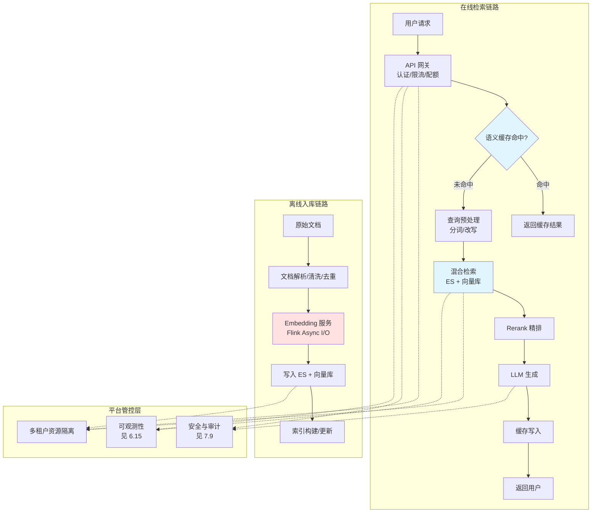
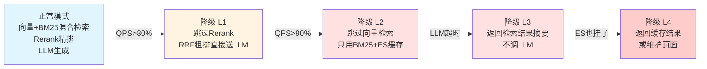

# 7.11 检索平台工程——从 RAG 原型到高可用生产底座

> **一句话定位**：[7.1 RAG 实战](./01-RAG实战.md) 讲的是"怎么做检索"，这一节讲的是"**怎么让检索服务扛住 100-300 QPS、保障 99.9% SLA、支撑百亿级文档实时入库**"。当你从"做个 Demo"走向"对内支撑业务、对外可售卖的平台底座"，要解决的不是算法问题，而是工程问题——embedding 服务的异步调用与容灾、多级缓存策略、容量规划、故障降级链路、多租户资源管控。

---

## 一、为什么需要独立的检索平台工程

### 1.1 从单机 RAG 到平台底座的跨越

```
单机 RAG 原型（能跑就行）：
  → 一个 Python 脚本，文档入库 + 检索 + LLM 调用串在一起
  → QPS 个位数、几十万文档、没有多租户
  → 延迟几百毫秒能接受

平台底座（要对内支撑、对外售卖）：
  → 日均 10 万+ 搜索、100-300 QPS、99.9% SLA
  → 百亿级文档秒级入库延迟
  → 多租户隔离 + 安全管控 + 审计
  → embedding 服务可能挂、向量库可能抖、LLM 可能超时
  → 必须有降级、熔断、缓存、容量规划
```

这一节不重复 [3.7 高可用架构](../part3-java-deep/07-高可用架构.md) 的通用机制（限流算法、熔断三态、降级策略的定义），只讲这些机制在**检索场景下怎么配参数、怎么落地**。

### 1.2 检索平台的全景架构



---

## 二、Embedding 管道——从 Flink 调用外部模型服务

这是审计中发现的最大缺口：**百亿级文档入库时，怎么在 Flink 流里高效、稳定地调用 Embedding 模型服务**。

### 2.1 问题本质

百亿级文档入库不是一次性批量任务，而是持续的数据流。每条文档（或 chunk）都需要调 Embedding API 把文本变成向量，然后写入向量库。挑战在于：

```
挑战一：吞吐与延迟的矛盾
  → Embedding 模型推理本身慢（GPU 上单条约 5-20ms，CPU 更慢）
  → 百亿文档 × 单条 10ms = 串行需要数年
  → 必须高并发，但 Embedding 服务有 GPU 限流

挑战二：外部服务不稳定
  → Embedding 服务可能因 GPU 过载而限流、超时、返回错误
  → Flink 作业不能因为 Embedding 服务抖动就全量失败

挑战三：成本控制
  → Embedding 是 GPU 密集型，调一次就花一次钱
  → 重复文档的 Embedding 是纯浪费
```

### 2.2 Flink Async I/O 模式

Flink 的 Async I/O 是为"在流处理中调用外部服务"设计的——它让一个算子可以**并发地**发起多个外部请求，而不是串行等待：

```java
// Java 实现：AsyncEmbeddingFunction
public class AsyncEmbeddingFunction extends RichAsyncFunction<Document, DocumentWithVector> {

    private transient EmbeddingServiceClient client;
    private transient RateLimiter rateLimiter;

    @Override
    public void open(Configuration parameters) {
        // 初始化 HTTP 客户端（连接池）
        client = new EmbeddingServiceClient.Builder()
            .setEndpoint("http://embedding-service:8080/embed")
            .setMaxConnections(200)        // 连接池大小 = 并发度
            .setConnectTimeout(500)
            .setReadTimeout(3000)          // 单次请求超时
            .build();

        // 令牌桶限速：保护 Embedding 服务不被打爆
        rateLimiter = RateLimiter.create(500.0);  // 500 QPS
    }

    @Override
    public asyncInvoke(Document doc, ResultFuture<DocumentWithVector> future) {
        // 先查本地缓存，避免重复 Embedding
        String cachedVector = embeddingCache.getIfPresent(doc.chunkHash);
        if (cachedVector != null) {
            future.complete(Collections.singletonList(
                doc.withVector(decode(cachedVector))
            ));
            return;
        }

        // 限速
        if (!rateLimiter.tryAcquire()) {
            // 不阻塞——把这条记录侧输出到重试队列
            future.completeExceptionally(
                new RateLimitException("embedding rate limited")
            );
            return;
        }

        // 异步调用 Embedding 服务
        client.embedAsync(doc.content)
            .thenAccept(vector -> {
                embeddingCache.put(doc.chunkHash, encode(vector));
                future.complete(Collections.singletonList(
                    doc.withVector(vector)
                ));
            })
            .exceptionally(ex -> {
                future.completeExceptionally(ex);
                return null;
            });
    }
}

// 使用：设置并发度和超时
AsyncDataStream.unorderedWait(
    stream.transform("doc_stream"),
    new AsyncEmbeddingFunction(),
    3000,                    // 超时
    TimeUnit.MILLISECONDS,
    100                      // 同时在飞的请求数
);
```

**`unorderedWait` vs `orderedWait`**——这是关键选择：

| 模式 | 行为 | 适用 |
|------|------|------|
| `unorderedWait` | 哪个请求先返回就先处理，不等慢的 | **Embedding 首选**——最大化吞吐 |
| `orderedWait` | 按请求发送顺序处理结果 | 需要严格顺序的场景（很少用） |

> **为什么用 `unorderedWait`**：Embedding 服务的响应时间有波动，如果用有序等待，一个慢请求会阻塞后面所有请求的处理，吞吐急剧下降。无序等待让快的先走，慢的超时重试，整体吞吐最大化。这和 [3.12 消息队列](../part3-java-deep/12-消息队列.md) 里 Kafka 的乱序消费换吞吐是同一个思路。

### 2.3 Embedding 服务的容灾

Embedding 服务是外部依赖，必须假设它会挂。三级容灾策略：

```
第一级：重试 + 退避
  → 单次失败 → 指数退避重试 3 次（100ms / 400ms / 1.6s）
  → 重试期间文档暂存在 Flink 的侧输出队列，不阻塞主流

第二级：降级到缓存 Embedding
  → 如果文档内容有哈希且缓存命中 → 用缓存的向量（即使可能不是最新的）
  → 代价：文档被修改但用了旧 Embedding → 对于大部分文档可接受

第三级：旁路到死信队列
  → 连续重试 3 次仍失败的文档 → 写入死信队列（Kafka topic）
  → 作业不阻塞，继续处理后续文档
  → 死信队列的文档由离线补偿任务重新处理
```

```python
# Python 实现：embedding 服务的调用与容灾
import hashlib, time
from tenacity import retry, stop_after_attempt, wait_exponential, retry_if_exception_type

class EmbeddingPipeline:
    def __init__(self, service, cache, dlq_producer):
        self.service = service
        self.cache = cache               # Redis / 本地 LRU
        self.dlq = dlq_producer          # 死信队列 producer

    @retry(
        stop=stop_after_attempt(3),
        wait=wait_exponential(multiplier=0.1, min=0.1, max=2.0),
        retry=retry_if_exception_type((TimeoutError, ServiceUnavailable)),
    )
    def _call_embedding_service(self, text: str) -> list[float]:
        return self.service.embed(text)

    def embed(self, doc_id: str, content: str, content_hash: str) -> list[float] | None:
        # ① 缓存命中（最常见的路径）
        cached = self.cache.get(content_hash)
        if cached:
            return cached

        # ② 调用 Embedding 服务（带重试）
        try:
            vector = self._call_embedding_service(content)
            self.cache.setex(content_hash, 86400, vector)  # 缓存 24h
            return vector
        except Exception as e:
            # ③ 降级：尝试用旧缓存（标记为 stale）
            stale = self.cache.get(f"{content_hash}:stale")
            if stale:
                logger.warning(f"using stale embedding for {doc_id}: {e}")
                return stale

            # ④ 旁路到死信队列
            self.dlq.send({
                "doc_id": doc_id,
                "content_hash": content_hash,
                "error": str(e),
                "timestamp": time.time(),
            })
            return None  # 这条文档暂时不入向量库
```

### 2.4 批量化与成本优化

逐条调 Embedding API 是最大的浪费——**绝大多数 Embedding 服务支持 batch 接口**，一次传 32 条文本只比传 1 条慢 2-3 倍，吞吐提升 10 倍以上：

```python
class BatchEmbeddingOperator:
    """Flink 的批量 Embedding 算子——攒批后调用"""

    BATCH_SIZE = 32
    BATCH_TIMEOUT = 0.5  # 秒

    def __init__(self):
        self.buffer = []
        self.timer = None

    def process_element(self, doc, ctx, out):
        self.buffer.append(doc)

        if len(self.buffer) >= self.BATCH_SIZE:
            self._flush(ctx, out)
        elif not self.timer:
            self.timer = ctx.timer_service().register_processing_time_timer(
                ctx.timer_service().current_processing_time() + int(self.BATCH_TIMEOUT * 1000)
            )

    def on_timer(self, ctx, out):
        if self.buffer:
            self._flush(ctx, out)

    def _flush(self, ctx, out):
        batch = self.buffer[:]
        self.buffer.clear()
        self.timer = None

        try:
            # 一次 API 调用处理 32 条
            vectors = self.service.embed_batch([d.content for d in batch])
            for doc, vec in zip(batch, vectors):
                out.collect(doc.with_vector(vec))
        except Exception as e:
            # 批量失败 → 拆回单条降级
            for doc in batch:
                out.side_output("failures", doc)
```

> **攒批的延迟-吞吐权衡**：`BATCH_SIZE` 大则单次 API 调用吞吐高，但攒批等待时间变长，增加端到端延迟。`BATCH_TIMEOUT` 是兜底——即使凑不够一批也会超时发出去，保证延迟上限。这两个参数的组合决定了"秒级写入延迟"能否达成。

### 2.5 存储膨胀治理

百亿级文档入库后，存储成本是绕不开的问题：

```
存储膨胀的三个来源：

  ① 原始文档：百亿 × 平均 10KB = 1 PB
    → 对象存储（MinIO/S3），按生命周期转冷

  ② 向量数据：百亿 × 1024 维 × 4B = 400 TB（仅向量本身）
    → HNSW 图结构再增加 ~10%
    → 量化压缩：FP32 → int8 可省 4 倍

  ③ ES 倒排索引：百亿文档的倒排索引 + 副本
    → 冷热分离 + ILM 自动搬迁（见 A5 §6.5）
```

| 治理手段 | 适用 | 效果 |
|---------|------|------|
| **向量量化** | 向量库 | FP32 → int8 省 4 倍内存（精度损失 <1%） |
| **去重** | 入库前 | MinHash/SimHash 去重，去除 20-40% 重复文档（见 6.8） |
| **冷热分离** | ES | 热数据 SSD、冷数据机械盘或对象存储 |
| **索引瘦身** | ES | 不索引的字段 `index: false`、不聚合的 `doc_values: false` |
| **TTL 过期** | 全链路 | 超过保留期的文档自动删除 |

---

## 三、多级缓存策略

检索服务的 QPS 上限，往往不是检索引擎的能力，而是**缓存命中率**决定的。

### 3.1 四层缓存


| 层 | Key | Value | TTL | 命中条件 | 适用 |
|----|-----|-------|-----|---------|------|
| **L1 精确缓存** | query 文本的 hash | 完整 LLM 回答 | 1h | 查询文本完全相同 | 高频重复问题 |
| **L2 语义缓存** | query 的 Embedding | 完整 LLM 回答 | 1h | Embedding 相似度 > 阈值 | 换个说法的同一问题 |
| **L3 检索结果缓存** | query hash + 索引版本号 | 检索结果（非 LLM 回答） | 5min | 文本相同且索引未更新 | 避免重复检索 |

> **L3 为什么加索引版本号**：如果文档库更新了，旧的检索结果就过期了。把索引版本号（或最后更新时间戳）纳入缓存 key，索引更新后旧缓存自动失效。这是和 [3.8 缓存与数据库一致性](../part3-java-deep/08-缓存与Redis.md) 的延迟双删不同的场景——检索结果的"数据源变更"是批量且频繁的，逐条删缓存不现实，用版本号让旧缓存自然过期更高效。

### 3.2 语义缓存——L2 的核心创新

语义缓存是 RAG 场景独有的，也是和传统缓存最大的区别——**不要求查询文本完全相同，只要语义相似就命中**：

```python
import numpy as np

class SemanticCache:
    """基于向量相似度的缓存——用户换个说法问同样的问题也能命中"""

    def __init__(self, redis, embedder, threshold=0.92, ttl=3600):
        self.redis = redis
        self.embedder = embedder
        self.threshold = threshold       # 余弦相似度阈值
        self.ttl = ttl

    def get(self, query: str) -> str | None:
        query_vec = self.embedder.embed(query)

        # 在缓存的 query 向量集合里做 ANN 检索
        # Milvus/Qdrant 的小 collection，或者 Redis 的 Vector Set
        hits = self.redis.vector_search(
            collection="semantic_cache",
            vector=query_vec,
            k=1,
            score_threshold=self.threshold,
        )

        if hits and hits[0].score >= self.threshold:
            logger.info(f"semantic cache hit: score={hits[0].score:.4f}")
            return self.redis.get(f"answer:{hits[0].id}")

        return None

    def put(self, query: str, answer: str):
        query_vec = self.embedder.embed(query)
        cache_id = f"cache:{hashlib.sha256(query.encode()).hexdigest()[:16]}"

        self.redis.vector_add(
            collection="semantic_cache",
            id=cache_id,
            vector=query_vec,
            metadata={"query": query, "ts": time.time()},
        )
        self.redis.setex(f"answer:{cache_id}", self.ttl, answer)
```

**阈值怎么定**——这是语义缓存最需要调的参数：

```
阈值过低（如 0.80）：
  → 不太相关的问题也命中缓存 → 返回错误答案 → 用户体验差
  → 宁可不做语义缓存

阈值过高（如 0.98）：
  → 只有几乎一字不差的改写才命中 → 命中率极低 → 缓存价值不大

实践推荐：0.90~0.95
  → 能覆盖同义改写（"怎么提升接口速度" ≈ "如何优化 API 响应时间"）
  → 又不会把不相关的问题误判为相同
```

> **语义缓存的风险**——[7.9 AI 安全](./09-AI安全与可信.md) 提到，**Embedding 缓存串租户**是三条泄露通道之一。缓存 key 必须包含 `tenant_id` 和用户 ACL 摘要，否则 A 租户的问题会命中 B 租户的缓存，直接跨租户泄露。

### 3.3 缓存击穿与雪崩防护

沿用 [3.8 缓存与 Redis](../part3-java-deep/08-缓存与Redis.md) 的框架，映射到检索场景：

| 问题 | 检索场景的表现 | 防护手段 |
|------|--------------|---------|
| **缓存穿透** | 查询的知识库里根本没有相关文档，缓存不命中 → 每次都查空 | 空结果也缓存（短 TTL），或布隆过滤器预判 |
| **缓存击穿** | 某个热查询的缓存过期 → 大量请求穿透到检索引擎 | 互斥锁（只让一个请求去查，其余等待） |
| **缓存雪崩** | 大量缓存同时过期 → 检索引擎瞬时被压垮 | TTL 加随机抖动，或永不过期+异步刷新 |

> **检索场景的特殊性**：检索引擎（ES/Milvus）本身有内部缓存和副本，扛击穿的能力比 MySQL 强。所以检索平台的缓存策略可以比传统 KV 缓存更"大胆"——命中率低一点没关系，因为引擎扛得住。真正要防的是雪崩——**大版本更新导致全部缓存同时失效时的流量洪峰**。

---

## 四、容量规划与 SLA 保障

### 4.1 从 QPS 到资源需求的推算

```
已知：日均 10 万+ 搜索、100-300 QPS、99.9% SLA

推算 ES 集群规模：

  ① 单分片 QPS 上限：约 500（简单查询）~ 50（复杂聚合）
     → 取保守值 200 QPS/分片（混合检索 + 过滤）

  ② 需要的分片数 = 目标 QPS / 单分片 QPS
     → 300 / 200 ≈ 2 个分片（副本另算）
     → 但要考虑数据量：百亿文档 × ~1KB/文档 ≈ 10TB
     → 按 30GB/分片 → 10TB / 30GB ≈ 340 个分片（数据量远超 QPS 需求）
     → 分片数取 max(QPS 需求, 数据量需求)

  ③ 节点数 = 分片数 / 每节点分片上限
     → 每节点 31GB 堆 → ~620 分片上限 → 1 节点够
     → 但要副本（可用性）：340 主 + 340 副 = 680 分片
     → 建议 3 个 data 节点（每个 ~230 分片，有余量）
     → 加 3 个 master 节点（防脑裂）+ 2 个 coordinating 节点
```

推算向量库规模：

```
  ① 向量数量：百亿级文档去重后假设 30 亿条唯一向量
  ② 单条向量内存：1024 维 × 4B(FP32) + 32(M) × 2 × 4B(图) ≈ 4.3 KB
  ③ 总内存：30 亿 × 4.3 KB ≈ 12.9 TB
  ④ 量化压缩（int8）：12.9 TB / 4 ≈ 3.2 TB
  ⑤ Milvus 节点（每节点 64GB 可用于向量）→ 3.2TB / 64GB ≈ 50 个 Query Node

  → 这个规模 Milvus 的存算分离架构是必须的
  → Query Node 纯内存可以横向扩展
  → Data Node 负责持久化到对象存储，数量可少
```

### 4.2 SLA 分解

99.9% SLA 意味着全年不可用时间不超过 8.76 小时。把 SLA 分解到各环节：

```
99.9% 整体 SLA 分解：

  API 网关可用性：      99.95%  ← 多副本 + 健康检查
  检索引擎可用性：      99.95%  ← ES 副本 + 向量库副本
  查询 Embedding 服务： 99.9%   ← 多实例 + 限流保护
  LLM 推理可用性：      99.5%   ← 最不稳定的一环，需要降级

  不能把这几个数字直接相乘后就宣布 SLO——它们有共享依赖：
  网关、鉴权、检索引擎同时是正常链路和降级链路的前提。

  正确的思路：
  ① 先明确共同关键路径（网关、鉴权、检索）的 SLO 必须单独 ≥ 99.9%
  ② LLM 不是共同关键路径：LLM 超时 → 返回检索结果摘要
  ③ 因此 LLM 的 99.5% 不再决定"服务是否可用"，只决定"是否提供生成式答案"
  ④ 再以端到端压测、故障演练和真实可用性数据验证 99.9% SLO

  → 降级的价值不是用一个错误的概率公式把 SLA 算高，
    而是将最不稳定的 LLM 从"可用性关键路径"移到"体验增强路径"。
```

> **关键洞察**：SLA 的短板在 LLM（最不稳定、延迟最大），但**检索引擎本身可以独立达标**。通过降级链路让"LLM 挂了也能返回结果"，就等于把 SLA 的木桶短板从 LLM 换成了检索引擎——而后者是你可以完全控制的。

### 4.3 限流配置

[3.7 高可用架构](../part3-java-deep/07-高可用架构.md) 讲了四种限流算法，这里给出检索平台的实际配置：

```python
# 多层限流
class RetrievalRateLimiter:
    def __init__(self):
        # L1: 全局限流（令牌桶）——保护整个平台
        self.global_limiter = TokenBucket(
            capacity=500,     # 突发容量
            refill_rate=300   # 稳态 QPS
        )

        # L2: 租户限流（每租户独立令牌桶）——多租户公平
        self.tenant_limiters = defaultdict(
            lambda: TokenBucket(
                capacity=50,    # 租户突发
                refill_rate=20  # 租户稳态
            )
        )

        # L3: 慢请求保护（滑动窗口）——防慢查询拖垮线程池
        self.slow_query_window = SlidingWindowCounter(
            window_size=60,     # 60 秒窗口
            threshold=10        # 10 次慢查询 → 触发熔断
        )

    def check(self, request):
        # L1 全局
        if not self.global_limiter.try_acquire():
            return RateLimitResult(status=REJECTED, reason="global_limit")

        # L2 租户
        if not self.tenant_limiters[request.tenant_id].try_acquire():
            return RateLimitResult(status=REJECTED, reason="tenant_limit")

        # L3 慢查询保护
        if self.slow_query_window.is_tripped():
            # 熔断期间只放行 P0 级别的查询
            if request.priority < P0:
                return RateLimitResult(status=DEGRADED, reason="circuit_open")

        return RateLimitResult(status=ALLOWED)
```

---

## 五、向量库的架构与运维

[7.1 §4.4](./01-RAG实战.md) 讲的是**向量检索的通用原理**（HNSW、IVF、参数调优），这一节讲**分布式向量库特有的架构和运维知识**——这些是原理章覆盖不到、但生产上每天要面对的东西。以 Milvus 为例，Qdrant / Weaviate 的设计思路大同小异。

### 5.1 存算分离架构

Milvus 2.x 最重要的设计是**把"读、写、建索引"三种负载彻底拆开**，各自独立扩容：

```
                    ┌──────────────┐
     SDK ─────────► │  Proxy       │  无状态，接入层，负责路由和聚合
                    └──────┬───────┘
                           │
        ┌──────────────────┼──────────────────┐
        ▼                  ▼                  ▼
  ┌───────────┐     ┌───────────┐     ┌───────────┐
  │ Query Node│     │ Data Node │     │Index Node │
  │  纯内存   │     │  写入落盘  │     │  建索引    │
  │  扛查询   │     │  生成段    │     │  CPU 密集  │
  └───────────┘     └───────────┘     └───────────┘
        │                  │                  │
        └──────────────────┼──────────────────┘
                           ▼
              ┌────────────────────────┐
              │  对象存储（S3/MinIO）    │  段文件、索引文件
              │  消息队列（Pulsar/Kafka）│  写入 WAL
              │  etcd                   │  元数据
              └────────────────────────┘
```

**这个架构解决的核心矛盾**：三种负载的资源需求完全不同——查询要内存、写入要磁盘 IO、建索引要 CPU。放在一起会互相抢资源（这正是 [ES 的痛点](../part3-java-deep/A5-ElasticSearch.md#65-segment-与写入性能)：merge 抢 CPU 直接拖垮查询）。拆开后可以**只扩需要的那部分**：

| 症状 | 扩哪个 |
|------|--------|
| 查询 QPS 上不去、延迟高 | Query Node（内存型机器） |
| 写入吞吐不足、消费堆积 | Data Node |
| 索引构建排队、重建太慢 | Index Node（CPU 型机器） |
| 存储不够 | 直接扩对象存储，与计算无关 |

> **与 ES 对照**：ES 的 data 节点同时承担存储、查询、写入、merge，所以扩容只能整体扩；节点角色分离（见 [A5 §6.7](../part3-java-deep/A5-ElasticSearch.md#67-集群调优要点)）只做到了 master/data/coordinating 的粗粒度拆分。**Milvus 的存算分离更彻底，代价是组件多、运维复杂度高**——要维护对象存储、消息队列、etcd 三套依赖。小规模场景这个复杂度不划算，这也是"千万级以内直接用 ES"的原因。

### 5.2 数据模型与 Segment 状态

```
Collection（≈ ES 的 Index / 数据库的表）
  └── Partition（按业务键分区，如租户、时间）
        └── Segment（物理存储单元，≈ Lucene 的 Segment）
              └── 向量 + 标量字段 + 索引
```

**Segment 有两种状态，这个区分直接解释了很多"玄学问题"**：

```
Growing Segment（增长中）
  · 新写入的数据先进这里
  · 【没有 ANN 索引】—— 查询时只能暴力扫描（brute force）
  · 数据量小的时候暴力扫也很快，所以感知不明显

        ↓ 达到阈值（默认 512MB）或超时后封存

Sealed Segment（已封存）
  · 不再接受写入
  · Index Node 为它构建 HNSW/IVF 索引
  · 查询走 ANN，速度快
```

> **这解释了两个常见困惑**：
>
> **① "为什么刚写入的数据检索特别慢？"** 因为它在 Growing Segment 里，走的是暴力扫描。写入高峰期 Growing Segment 堆积，查询延迟就会明显上升。
>
> **② "为什么查询延迟会周期性抖动？"** 因为 Segment 封存和索引构建是批量触发的，构建期间 Index Node 吃满 CPU，而新索引加载进 Query Node 时也有内存波动。
>
> 这与 [ES 的 refresh 机制](../part3-java-deep/A5-ElasticSearch.md#33-近实时near-real-time原理)是同构的——都是"先让数据可见，再后台优化成可快速检索的结构"。

### 5.3 一致性级别——向量库特有的取舍

这是 Milvus 一个容易被忽略但很重要的设计。**向量库默认不是强一致的**：

| 级别 | 语义 | 延迟 | 适用 |
|------|------|------|------|
| **Strong** | 读到所有已写入数据 | 最高（要等同步） | 写入后立即验证 |
| **Bounded**（默认） | 容忍一定时间内的陈旧（默认 3s） | 低 | **绝大多数 RAG 场景** |
| **Session** | 保证读到自己写的 | 中 | 用户刚上传文档就要能搜到 |
| **Eventually** | 不保证 | 最低 | 离线分析、召回率评测 |

```python
# 按场景选择，而不是无脑用默认值
client.search(..., consistency_level="Bounded")    # 常规检索：默认，最快
client.search(..., consistency_level="Session")    # 用户刚传完文档要能搜到
client.search(..., consistency_level="Strong")     # 数据校验、回归测试
```

> **性能影响很大**：Strong 一致性要求 Query Node 等待消息队列里的数据全部消费完才返回，**在写入压力大时可能导致查询延迟翻数倍**。生产上把它误设为 Strong 是一个常见的性能事故来源。**RAG 场景绝大多数用 Bounded 即可**——用户不会在意 3 秒前上传的文档还没进索引。

### 5.4 与 ES 的运维对照

理解了上面的架构，两者的运维差异就清晰了：

| 维度 | ElasticSearch | Milvus |
|------|--------------|--------|
| 架构 | 存算一体，data 节点全能 | **存算分离**，三类 Node 独立扩容 |
| 扩容粒度 | 整体扩 data 节点 | 按瓶颈精确扩（查询/写入/建索引） |
| 数据单元 | Index → Shard → Segment | Collection → Partition → Segment |
| 新数据可见 | refresh（默认 1s）后可搜 | 写入即可见，但走**暴力扫描**直到封存建索引 |
| 索引构建 | 随写入增量构建 | **Segment 封存后批量构建** |
| 一致性 | 近实时，无级别可选 | **四档可调** |
| 外部依赖 | 无 | 对象存储 + 消息队列 + etcd |
| 运维复杂度 | 中 | **高** |

> **选型的本质**：Milvus 用**架构复杂度**换取了**大规模下的弹性**。千万级向量、且已有 ES 基建时，ES 8.x 的 KNN 足够且省一套运维；到亿级向量、或需要独立扩缩查询能力时，Milvus 的存算分离才体现价值。

## 六、故障模式与降级链路

### 6.1 检索引擎的典型故障

| 故障 | 表现 | 检测 | 处置 |
|------|------|------|------|
| **ES 节点 OOM** | 节点掉线、查询超时 | 健康检查 + 堆监控 | 副本接管、自动重启 |
| **ES 段合并风暴** | 写入延迟突增、CPU 打满 | merge 任务监控 | 暂停写入、限流查询 |
| **Milvus 内存暴涨** | 查询延迟抖动、OOM | 内存水位监控 | 限制 `efSearch`、扩容 |
| **Milvus 索引重建** | 查询超时、重建期间召回率下降 | 重建任务监控 | 降级到 ES 单路召回 |
| **Embedding 服务超时** | 入库延迟堆积 | 异步 I/O 超时监控 | 见 §2.3 三级容灾 |
| **LLM 超时/限流** | 查询无响应 | 响应时间监控 | **降级到检索摘要** |

### 6.2 降级梯度

当系统压力上升时，不是"要么正常要么宕机"，而是**逐级降质**：



```python
class RetrievalService:
    DEGRADATION_LEVELS = {
        0: {"vector": True,  "bm25": True,  "rerank": True,  "llm": True},
        1: {"vector": True,  "bm25": True,  "rerank": False, "llm": True},   # 跳过精排
        2: {"vector": False, "bm25": True,  "rerank": False, "llm": True},   # 只 BM25
        3: {"vector": False, "bm25": True,  "rerank": False, "llm": False},  # 只返检索摘要
        4: {"vector": False, "bm25": False, "rerank": False, "llm": False},  # 只返缓存
    }

    def retrieve(self, query, session):
        level = self._current_degradation_level()  # 基于负载和健康度
        config = self.DEGRADATION_LEVELS[level]

        if config["llm"] is False and config["bm25"]:
            # L3: 返回检索结果摘要（不调 LLM）
            results = self._bm25_search(query, session)
            return self._format_as_summary(results)

        if config["vector"] and config["bm25"]:
            results = self._hybrid_search(query, session)
        elif config["bm25"]:
            results = self._bm25_search(query, session)
        else:
            # L4: 只查缓存
            cached = self._cache.get(query.hash)
            return cached or self._maintenance_response()

        if config["rerank"]:
            results = self._rerank(query, results)

        if config["llm"]:
            return self._llm_generate(query, results)
        else:
            return self._format_as_summary(results)
```

> **降级的本质**：不是让系统"更慢"，而是让系统"更粗糙但可用"。跳过 Rerank 损失精度但保住延迟，跳过 LLM 损失生成能力但保住检索。用户得到的是"质量降级但能用的结果"，而不是"超时报错"。这和 [3.7 高可用架构](../part3-java-deep/07-高可用架构.md) 里熔断器的"半开"状态是同一个设计哲学。

### 6.3 `efSearch` 动态降档

一个检索场景特有的降级手段——向量检索的 `efSearch` 可以运行时调，不需要重建索引：

```python
class AdaptiveVectorSearch:
    """根据系统负载动态调整 efSearch"""

    NORMAL_EFSEARCH = 200      # 正常：高召回
    DEGRADED_EFSEARCH = 50     # 降级：低召回换低延迟
    MIN_EFSEARCH = 10          # 极限：激进近似检索，最快但召回最低

    def get_efsearch(self) -> int:
        load = self._current_load()  # CPU 利用率 / QPS / 延迟

        if load < 0.7:
            return self.NORMAL_EFSEARCH
        elif load < 0.9:
            return self.DEGRADED_EFSEARCH
        else:
            return self.MIN_EFSEARCH
```

> 这是检索平台工程独有的手段——**用召回率换延迟**。负载高时主动降低 `efSearch`，单次查询更快但召回率下降；负载恢复后自动调回。不需要任何重建，纯运行时参数。这是其他后端服务没有的降级维度。

---

## 七、面试深度剖析

### 面试官问：百亿级文档怎么在 Flink 里做 Embedding？服务不稳定怎么办？

**回答**：

核心是用 Flink 的 Async I/O 模式，并发调用 Embedding 服务而非串行等待。用 `unorderedWait` 而非 `orderedWait`——让快的请求先返回，不因一个慢请求阻塞整条流。并发度设为连接池大小的同等量级，通常 100~200。

服务不稳定分三级容灾。第一级是单次失败指数退避重试 3 次；第二级是降级到缓存——如果文档内容有哈希且缓存命中，用旧 Embedding 即使不是最新的也能接受；第三级是连续失败旁路到死信队列，作业不阻塞继续处理后续文档，死信队列的文档由离线补偿任务重新处理。

还有一个关键的吞吐优化：**攒批调用**。绝大多数 Embedding 服务支持 batch 接口，一次传 32 条只比传 1 条慢 2-3 倍但吞吐提升 10 倍。用 `BATCH_SIZE` 和 `BATCH_TIMEOUT` 两个参数控制——攒够 32 条或等 0.5 秒就发出去，保证"秒级写入延迟"的上限不被打破。

最后是成本控制：**内容哈希缓存**。重复文档的 Embedding 是纯浪费，在调服务前先查 Redis 缓存。百亿文档去重后可能只有 30 亿唯一向量，缓存命中率越高 Embedding 调用量越低。

---

### 面试官问：100-300 QPS 的检索服务怎么做容量规划？

**回答**：

分 ES 和向量库分别推算。

ES 的分片数取 `max(QPS 需求, 数据量需求)`。QPS 需求按单分片保守 200 QPS 算，300 QPS 只需 2 个分片。但百亿文档按 30GB/分片算需要 340 个分片，数据量需求远超 QPS 需求，所以分片数由数据量决定。加副本后 680 个分片，3 个 data 节点够用，再加 3 个 master 防脑裂和 2 个 coordinating 分担合并压力。

向量库更吃内存。百亿去重后假设 30 亿唯一向量，1024 维 FP32 加 HNSW 图结构每条约 4.3KB，总量约 12.9TB。量化到 int8 可以省 4 倍到 3.2TB。按每节点 64GB 可用于向量算，需要约 50 个 Query Node。这个规模 Milvus 的存算分离架构是必须的——Query Node 纯内存横向扩展，Data Node 负责持久化。

SLA 分解也很关键。99.9% 意味着全年不可用不超过 8.76 小时。不要把网关、检索、LLM 的可用性机械相乘——正常链路和降级链路共享网关、鉴权、检索等依赖。正确做法是先确保这些**共同关键路径**本身的 SLO 不低于 99.9%，再把 LLM 设计成体验增强而非可用性前提：LLM 超时就返回检索结果摘要。这样 LLM 的 99.5% 只影响是否提供生成式答案，不再直接决定服务是否可用；最终是否达成 99.9%，仍要靠端到端压测、故障演练和线上数据验证。

---

### 面试官问：检索服务怎么做缓存？和普通缓存有什么区别？

**回答**：

四层缓存。L1 精确缓存以 query 文本 hash 为 key，处理高频重复问题。L3 检索结果缓存以 query hash 加索引版本号为 key——版本号是关键，文档库更新后旧缓存自然过期，比逐条删缓存高效。这两层和普通缓存的区别不大。

真正有区别的是 L2 语义缓存。它不要求查询文本完全相同，只要 Embedding 相似度超过阈值就命中。用户问"怎么提升接口速度"和"如何优化 API 响应时间"文本不同但语义相同，语义缓存能命中。实现上是在一个小的向量集合里做 ANN 检索找最相似的缓存 query。阈值一般定 0.90~0.95，过低会返回错误答案，过高命中率太低。

语义缓存的**安全风险**必须注意——缓存 key 如果不带 tenant_id 会串租户。A 租户的问题命中 B 租户的缓存就是跨租户泄露。所以 key 必须包含 tenant_id 和用户 ACL 摘要，缓存隔离级别要和数据隔离级别对齐。

雪崩防护上检索平台可以比传统缓存更"大胆"——因为检索引擎本身有副本和内部缓存，扛击穿能力强。真正要防的是大版本更新导致全部缓存同时失效的流量洪峰，用 TTL 加随机抖动来避免。

---

### 面试官问：系统压力上来了怎么降级？

**回答**：

设计一个四级降级梯度，核心思路是逐级"降质不宕机"。

L1 正常模式做向量+BM25 混合检索加 Rerank 精排加 LLM 生成，质量最高。QPS 超过 80% 时降级到 L1：跳过 Rerank，用 RRF 粗排结果直接送 LLM，省掉 Cross-Encoder 的延迟。QPS 超过 90% 降级到 L2：跳过向量检索只用 BM25，因为向量检索比 BM25 更吃资源。LLM 超时降级到 L3：返回检索结果摘要不调 LLM，用户至少能看到相关文档。ES 也挂了降级到 L4：只返缓存或维护页。

检索场景还有一个独有的降级手段——`efSearch` 动态降档。向量检索的 `efSearch` 可以运行时调，不需要重建索引。负载高时从 200 降到 50 甚至 10，单次查询更快但召回率下降，负载恢复后自动调回。这是用召回率换延迟，其他后端服务没有这个维度。

降级的本质不是让系统更慢，而是让系统更粗糙但可用。跳过 Rerank 损失精度但保住延迟，跳过 LLM 损失生成能力但保住检索。用户得到的是质量降级但能用的结果，而不是超时报错。

---

## 八、与本书其他章节的关联

| 关联章节 | 关系 |
|---------|------|
| [7.1 RAG 实战](./01-RAG实战.md) | 本节是其工程化落地；4.6 的混合检索融合是本节在线链路的核心环节 |
| [7.9 AI 安全与可信](./09-AI安全与可信.md) | 语义缓存的租户隔离、工具分级授权的降级联动 |
| [7.10 GraphRAG](./10-GraphRAG与知识图谱.md) | Global Search 的成本和延迟在本节的容量规划和降级框架内 |
| [A5 ElasticSearch](../part3-java-deep/A5-ElasticSearch.md) | BM25、IK 分词、集群调优、冷热分离是本节检索引擎的基础 |
| [3.7 高可用架构](../part3-java-deep/07-高可用架构.md) | 限流、熔断、降级的通用机制，本节是其检索场景的参数化落地 |
| [3.8 缓存与 Redis](../part3-java-deep/08-缓存与Redis.md) | 穿透/击穿/雪崩的通用理论，本节加了语义缓存这一层 |
| [6.5 Flink](../part6-bigdata/05-Flink.md) | Async I/O、反压、Checkpoint 是本节 Embedding 管道的底层 |
| [6.15 平台可观测性](../part6-bigdata/15-平台可观测性.md) | SLA 监控、故障根因分析的通用方法论 |

---

[← 7.10 GraphRAG 与知识图谱增强](./10-GraphRAG与知识图谱.md) | [返回本章目录](./README.md) | [返回全书目录](../README.md)
