# 7.12 案例研究：点富科技「大模型数据工程与评测岗」深度分析

> 针对北京点富科技（量化私募灵均投资创始人创办的 AI 公司）的一次完整尽调：
> 公司背景核验 + 业务与技术拆解 + JD 逐条分析 + 面试攻防清单。
>
> 这一节和 7.1–7.11 的性质不同：前面十一节讲「AI 工程怎么做」，这一节讲「拿这些能力去面一家具体公司的具体岗位时会遇到什么」。
> 它同时也是全书唯一一个**招聘方比岗位更需要尽调**的案例。

## 这一节讲什么

**北京点富科技有限公司**在招「大模型数据工程 + 模型评测」岗（1–3 年经验，本科以上，优秀应届可考虑）。这家公司的背景比岗位本身更值得先搞清楚：

- **背景**：量化私募灵均投资创始人蔡枚杰创办，实缴资本约 5000 万
- **产品**：「专家智能真身」——把知名医疗/心理专家（首医大杨凤池教授·临床心理学、协和马良坤·妇产科、北中医付国兵·中医推拿）数字化成 AI 咨询体，用户付费咨询
- **招聘方提供的材料**：一份 7 页公司介绍 PDF 宣传册

围绕点富这个具体对象，本节回答四个问题——**且重要性逐层递增**：

1. 我的知识体系能不能覆盖点富这个岗位？（**候选人视角**：我能不能干）
2. 点富这家公司值不值得去？这个岗位有没有成长性？（**决策者视角**：值不值得去）
3. 如果把点富的数据体系交给我，我会怎么从 0 到 1 搭起来？（**负责人视角**：我能带来什么）
4. **点富这个产品定位对不对？如果不对，出路在哪？**（**产品视角**：我能不能看懂生意）

JD 那句「连接**数据-模型-产品**的关键角色」，第三问回答「数据」和「模型」，第四问回答「产品」。而第四问恰恰是最能证明你不只是技术执行者的——**能对雇主的产品提出有数据支撑的批判性判断，是「工程师」和「合伙人型员工」的分水岭。**

第三问是这一节和其他岗位案例最大的不同。原因很现实：**点富全公司只有四十到一百人**（天眼查 39 人 vs 创始人自述 120 人）。在这个规模下，数据岗不可能是大公司里那种「有现成平台可依附、只负责一个模块」的螺丝钉——你进去大概率就是**数据这摊事的第一负责人**，没有数仓、没有埋点体系、没有指标口径、没有评测平台，一切从零开始。

而面试这类岗位时，能拉开差距的恰恰不是「我会写 pandas」，而是「**我知道你们现在缺什么、应该先建什么、为什么这个阶段不该建什么**」。所以本节第七部分会完整输出一份**数据体系 0→1 建设规划**，包含架构蓝图、三期路线图、技术选型与成本、效果评估体系、团队搭建与向上汇报。

第九至十一章的岗位案例只回答第一问，因为那些招聘方（大疆、滴滴）履历确定、口碑成型，且岗位分工明确。但在 AI 创业浪潮下，越来越多机会来自成立两三年、一人多岗的早期公司。这时候**尽调能力、全局规划能力和技术能力同样重要**。

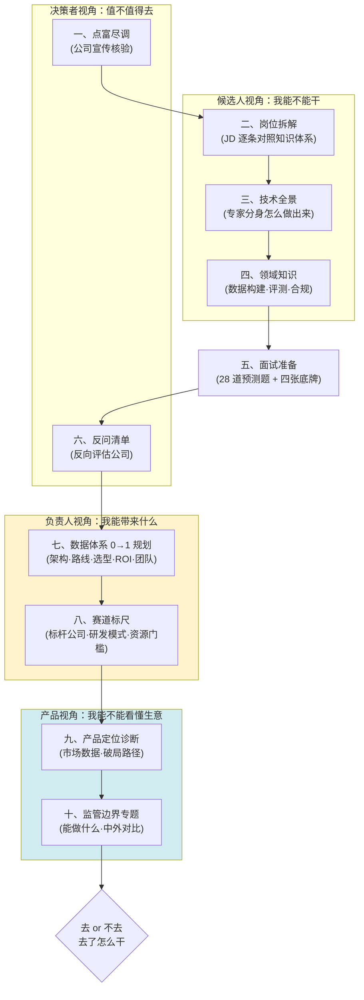

## 先看结论

> **点富是真的，钱是真的，专家资源可能是真的，但宣传口径习惯性注水**——12 条可核验声明里，7 条证实、3 条与公开信息不符、5 条查无佐证，另有 1 条母公司监管记录（灵均「2·19 事件」）未披露。经横向对比同梯队机构，该记录属**中等偏上但非致命**水位，已获实质整改，对点富当前经营未见传导。
>
> **核心技术有成熟开源对标（PsyDT / SoulChat2.0），壁垒在数据授权与合规资质，不在算法。** 宣传的「多模型动态路由」是 2–4 周可做的标准工程活。
>
> **赛道的正确打法业界已经收敛**：在 SOTA 模型上做知识接入 + 检索 + 编排，而非自训模型（Abridge 估值 53 亿仍用 OpenAI API；Character.AI 自研基座失败后转投 Llama）。这决定了数据岗的核心价值在**知识工程与评测体系**，不在喂训练集。
>
> **岗位方向在 2026 年是增值的**（会写清洗脚本的搬砖型数据工程师在贬值，能设计评测体系、做 bad case 归因的数据策略工程师在增值），医疗垂直评测经验有稀缺性，**但成长性完全取决于你能否摸到训练决策**——这一点必须在面试中问清楚，别等入职才发现是个高级标注管理岗。
>
> **产品定位存在结构性矛盾**：「三甲名医数字分身」用医生的壳做咨询师的事，却承担医生的合规约束。而数据显示抑郁障碍治疗率仅 **9.5%**、充分治疗率 **0.5%**（*Lancet Psychiatry*），**92% 的人根本不去精神科**——这个定位瞄准的是金字塔最尖端。
>
> **监管上要分清「禁止什么」**：21 号令**不禁止情感陪伴**（第三条明文鼓励创新、第六条鼓励适老陪伴），禁止的是「**靠制造情感依赖变现**」这套商业模型。所以出路不是扩人群，而是**换付费方**（教育/政企/EAP）——全球唯一跑通的样板是英国 Limbic Access：**AI 做辅助分诊，人做治疗决策，B2B 卖给 NHS**。

**如果时间紧张**：直接跳到「五、面试准备」和「六、反问清单」，那是临场能用的部分。技术细节（三、四）作为深挖锚点按需查阅。

**如果你面的是负责人/资深岗位**（或想在初级岗位上展现超出预期的视野）：「七、数据体系 0→1 规划」「八、赛道标尺」「九、产品视角」「十、监管边界」是最具差异化的四部分。它们分别回答「我如何把数据资产从零搭起来并证明值钱」「这个赛道该怎么打、资源门槛在哪」「这门生意的定位对不对」「什么能做什么不能做、中外监管差异在哪」。

### 信息时效与表述约定

公司核验部分基于 **2026 年 8 月**的公开信息（工商登记、监管公告、权威媒体报道、招聘平台数据）。结论分三档：**可证实**（有权威来源直接佐证）、**存疑**（搜索不到佐证但也无反证）、**与公开信息不符**（有权威来源明确矛盾）。

点富成立不足两年，状态变化快，若在更晚时间点参考，请以最新信息为准——尤其是**深度合成算法备案状态**和**融资/团队规模**这两项，它们变化最快，也恰好是面试探针。

需要声明的是：本节对点富的分析基于**公开信息的客观核验**，既不是贬低也不是推荐。核验出「宣传注水」不等于「公司不行」——它只是提醒你：对那些无法外部核验的说法要打折听，并把它们变成面试问题。

另外要特别说明专家名单的取信程度：**杨凤池教授的智能真身有澎湃、财联社等主流媒体报道，可证实**；而马良坤（协和妇产科）、付国兵（北中医推拿）两位的合作**仅见于公司宣传册，公开报道中未找到对应**。本节在涉及具体专家的技术举例时统一以杨凤池教授为例，其余两位按「宣传册声称」处理。

---

## 一、点富尽调：宣传册的七处注水与一条监管记录

### 为什么这一节要放在最前面

传统的岗位案例研究，第一节永远是「JD 拆解」。这一章反过来，先做招聘方尽调。

原因很简单：**如果公司本身有硬伤，后面的技术准备全是沉没成本。**

面对大疆、滴滴这类成熟企业，你不需要核验它是否存在、业绩是否属实——公开信息足够充分，行业口碑已经形成。但面对一家 2024 年底才注册的创业公司，而且它主动递过来一份自我美化的宣传册时，**核验就是求职流程的第一道工序**。

这一节的方法论可以复用到任何早期公司：

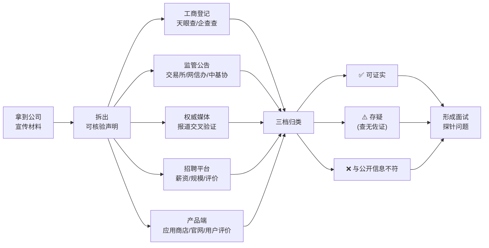

关键在最后一步：**核验的产出不是「去或不去」的二元判断，而是一组精准的面试探针**。你查不实的每一条，都可以变成一个当面追问的问题——对方的反应本身就是答案。

---

### 案例背景

**招聘方**：北京点富科技有限公司

**岗位**：大模型数据工程 + 模型评测（1–3 年经验，本科以上，优秀应届可考虑）

**招聘方提供的材料**：一份 7 页公司介绍 PDF（注意：这份 PDF 不是候选人简历，而是招聘方的自我宣传册）

**宣传册的核心叙事**：一家由头部量化私募创始人创办的原生 AI 公司，把知名医疗/心理专家做成「智能真身」，用户付费咨询，已与三大顶尖医疗机构战略合作，首个产品上线两个月营收过千万。

这个叙事听起来很完整：**顶级资本背景 + 稀缺专家资源 + 已验证的商业化**。但完整的叙事恰恰是最需要拆开看的。

---

### 逐条核验结果

我们把宣传册的声明拆成 12 条可核验事项，逐条对照公开信息。

#### ✅ 第一档：可证实（5 条）

**1. 公司主体真实存在，且资本实力不弱**

工商登记显示北京点富科技有限公司确实存在：

| 项目 | 信息 |
|------|------|
| 统一社会信用代码 | 91110400MAE455K980 |
| 法定代表人 | 邓诚菁（**注意：不是蔡枚杰**） |
| 注册资本 | 约 1.25 亿元 |
| 实缴资本 | 约 5000 万元 |
| 注册地 | 北京经开区 |
| 知识产权 | 45 项专利、51 项商标 |
| 官网 | dotfortune.com（可访问） |

**实缴 5000 万**是个有分量的信号——很多创业公司注册资本写得很大但实缴为零。这一条说明公司确实有真金白银投入，不是空壳。

**2. 母公司灵均投资真实，且 2025 年业绩确实领先**

宁波灵均投资，2014 年成立，中基协登记编号 P1004526，百亿级量化私募。2025 年前三季度百亿量化私募收益排名第一（约 62%），另一来源显示年内平均收益 67.39%，均高于幻方量化的约 47%–52%。

**「量化赛道第一、跑赢幻方」这个说法基本属实。**

**3. 创始人核心履历可证实**

蔡枚杰的浙江大学经济管理学硕士、中金公司 / 浙商基金 / 鹏华基金任职经历、2014 年创立灵均投资——均有灵均官网及多家权威媒体报道佐证。北师大「优师基金」联席理事长身份，有北师大官方微信公众号和人民日报报道佐证。中基协金融科技委员会委员、私募基金委员会委员，见于 2026 年 7 月的第三方尽调报告，可信度较高。

**4. 「智能真身」产品确有其事，且有主流媒体报道**

「杨凤池智能真身」于 2025 年 12 月 / 2026 年 1 月推出。杨凤池教授确为首都医科大学临床心理学系学术委员会主任，是中国应用心理学领域的权威。东方财富、澎湃新闻、财联社等均有报道，提到「近万名测试用户」体验。

**5. 岗位在招，薪资区间公开**

BOSS 直聘、猎聘、jobui 均有点富的在招岗位，薪资区间挂 20–60K。

---

#### ❌ 第二档：与公开信息不符（3 条）

**6. 成立时间：宣传册写「2025 年成立」，工商登记实为 2024 年 11 月 1 日**

这是个小事，但它是个**信号**——连注册年份这种一查就知道的事实都要往后挪，说明点富在对外表述上有「怎么好听怎么说」的惯性。

**7. 收益率：宣传册写「超 70%」，公开数据是 62%–67% 区间**

差距不大，但方向一致：**往上取整、往高了说**。

**8. 行业地位：宣传册写「头部企业」，实际规模已跌入第二梯队**

这一条最实质。2025 年 7 月《21 世纪经济报道》明确指出，灵均管理规模已跌入第二梯队，量化私募新「四大天王」是衍复、明汯、九坤、幻方（600–700 亿区间），**灵均不在其中**。

准确的表述应该是：**业绩排名第一，但管理规模非头部**。宣传册用「头部企业」四个字把这两件事混为一谈了。

> **为什么这个区分重要？** 对求职者来说，母公司的**规模**决定了它能给子公司多少持续输血，而**单年业绩**决定不了。量化私募的规模下滑往往伴随赎回压力，这会直接影响对创新业务的投入耐心。

---

#### ⚠️ 第三档：存疑，查无佐证（4 条）

**9. 「英国剑桥大学全球大使」——全网查无实据**

搜索剑桥大学官网及全网公开信息，未找到任何蔡枚杰与剑桥大学「全球大使」身份的关联。

**10. 「北京师范大学校董」——未证实**

能证实的只有捐赠性质的「优师基金联席理事长」。「校董」是一个有明确治理含义的头衔，与「捐赠基金理事长」不是一回事。未见任何公开来源支持「校董」表述。

**11. 「与协和医学院、首都医科大学、北京中医药大学东方医院三大机构战略合作」——未证实**

这是宣传册里分量最重、也最经不起查的一条。

实际能找到的，只有与**杨凤池教授个人**的合作。协和医学院、北中医东方医院的「机构级战略合作」无任何公开信息佐证，东方医院官网也没有相关内容。

> **专家个人合作 ≠ 机构战略合作。** 前者是签一个人，后者是签一家医院。两者在数据获取能力、合规通道、品牌背书上是数量级的差距。宣传册把「和三位专家分别合作」包装成「和三大机构战略合作」，这是**最需要在面试中当面问清的一条**。

**12. 「首个产品上线两个月营收过千万」——无法证实**

所有媒体报道均未提及任何营收数字，只提到「近万名测试用户」。未找到 App Store / 安卓应用商店的上架记录，也没有独立的用户评价。

另外，宣传册声称的「自研全自动评测 Agent 平台」，仅见于公司自述和招聘 JD，无第三方技术评测、无开源证据、无技术博客。

---

### 一个必须知道的监管记录：灵均「2·19 事件」及其真实污染力

宣传册对这件事只字未提。但比「发现它」更重要的是**评估它到底有多严重**——一个负面信息如果不做横向对比，很容易被高估或低估，两种误判都会导致错误决策。

#### 事件本身

**2024 年 2 月 19 日**（龙年首个交易日）9:30:00–9:31:00，宁波灵均旗下产品开盘一分钟内集中卖出沪深股票合计 **25.67 亿元**（沪市 11.95 亿 + 深市 13.72 亿），引发沪指、深证成指瞬时下挫。

次日沪深交易所同步处理：**限制交易 3 个交易日**（2.20–2.22）+ **启动公开谴责纪律处分程序**。

深交所措辞尤其严厉：「今年以来已多次因异常交易被采取书面警示等监管措施，但仍未改正」——说明这是**屡罚屡犯后的加重处理**，而非初犯。

事后蔡枚杰公开承认公司「双引擎」治理模式存在缺陷，多只产品当年年初回撤超 15%。这是业内**首例沪深交易所同步公开限制一家量化机构交易权限**的案例，被财新、证券时报广泛报道。

#### 横向对比：这在行业里是什么水位

单看描述会觉得很严重。但把同梯队机构的监管记录摆在一起，画风就不同了：

| 机构 | 时间 | 事由 | 处罚措施 | 性质档位 |
|------|------|------|---------|---------|
| **灵均投资** | 2024-02 | 开盘集中卖出 25.67 亿，屡警不改 | 限制交易 3 天 + 公开谴责 | 交易所自律监管**顶格** |
| **明汯投资** | 2023-08/09 | 员工用公众号黑公关同行 | 责令改正 + 中基协公开谴责 + **暂停产品备案 3 个月** | 自律纪律处分 |
| **明汯 / 诚奇 / 少薮派等** | 2024-08 | 科创板网下报价违规 | 上交所书面警示 | 自律监管**最轻档** |
| **幻方 / 九坤 / 明汯** | 2024-02 | 卷入 DMA 清盘、自营巨亏传闻 | **均辟谣，未受处罚** | — |
| **瑞丰达资产** | 2024 | 跑路、涉嫌欺诈 | 罚没超 4100 万 + 实控人**终身市场禁入** + 注销管理人登记 | 行政处罚 + 市场禁入 |
| **玖瀛资产 / 腾创投资** | 2025 | 违规 | 罚没近 6000 万 + 实控人 5 年禁入 + 注销登记 | 私募处罚**纪录级** |

**中国证券监管的处罚梯度**（从轻到重）：

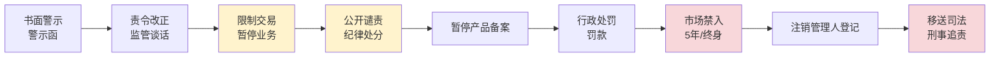

灵均落在图中**黄色区间**——交易所自律监管的最高一档，但**没有触及**行政处罚、罚没款、市场禁入、刑事追责这些红色区间。真正让私募机构消亡的是瑞丰达、玖瀛那类涉及欺诈、跑路、资金占用的**刑事级案件**，与灵均的「交易节奏失控」性质完全不同。

#### 实质性影响：确有创伤，但已基本修复

这是最关键的一组事实——**处罚的严重性不看措辞，看后果**：

| 维度 | 事件后的实际影响 | 现状（2026） |
|------|----------------|-------------|
| **产品备案** | 中基协数据显示 2023-12 至 2025-02 **连续 15 个月未备案新产品** | 2025-03 重启备案，全年备案 10 只 |
| **管理规模** | 从 2022 年巅峰 600 亿+ 掉出「四大天王」 | 回落至 400–500 亿区间，企稳 |
| **业绩** | 2024 年初多只产品回撤超 15% | **2025 年全年收益 73.51%，百亿私募业绩总冠军** |
| **公司治理** | 蔡枚杰承认「双引擎」模式缺陷 | 治理结构重构，对外「知耻后勇」叙事 |
| **渠道与招聘** | 传闻券商排查离职员工流向（灵均报案辟谣） | 2026 年北京上海正常招聘，量化研究员 30–60K/月 |
| **对点富的传导** | — | **未查到任何证据**表明影响点富的融资、招聘或业务合作 |

「连续 15 个月未备案新产品」是最实锤的实质性影响证据——这直接掐住了私募的命脉（不能发新产品就不能扩规模）。但同样值得注意的是它已经恢复，且 2025 年业绩重回第一。

调研还有一个**反向发现**：**没有找到任何量化私募因监管处罚（区别于跑路/欺诈）而实质性衰落或退出的案例。**

#### 校准后的结论

> **这个污点属于「中等偏上、引人注目但非致命」的水位。**
>
> 不是「罕见严重」——因为性质仍是自律监管，未触及行政处罚、市场禁入、刑事追责。
> 也不是「常见小事」——因为它是业内首例交易所同步顶格自律处罚，且被官方点名为屡教不改的负面典型。

**对求职决策的实际参考意义，我的判断是四条**：

**其一，作为「合规文化成熟度」的负面信号是成立的。** 它真实反映了 2024 年之前灵均存在交易纪律松散、屡次被警示未改的治理瑕疵。这一点不该被洗白。

**其二，不应等同于财务造假、挪用资金、跑路级别的污点。** 那类案例会导致管理人登记注销、公司清零，灵均没有这种存亡级风险。把两者混为一谈是对信息的误读。

**其三，时效性参考有限。** 事件已过去两年半，灵均完成了治理重构、业绩重回行业第一、规模企稳、招聘正常。它更像「历史伤疤」而非「现在进行时的风险」。

**其四，对点富几乎无实质传导。** 点富反而作为灵均多元化转型的高调案例被持续正面报道。

> **所以准确的表述应该是**：母公司历史合规污点，中等严重级别（交易所自律处分而非行政处罚或刑事案件），已获实质整改，对子公司当前经营未见传导性影响。
>
> **但仍然值得在面试中问一句**——不是因为它是定时炸弹，而是因为点富做的是医疗健康，**合规要求远高于金融**。你要确认的不是「母公司有没有前科」，而是「**点富的合规体系是独立建设的，还是沿用了那套出过问题的治理逻辑**」。这才是有价值的问题。

---

> **方法论提示**：这一小节示范了一个容易被忽略的尽调动作——**负面信息也要做横向对比**。
>
> 只看「限制交易 + 公开谴责」这些字眼，很容易得出「这公司完了」的结论；但把同行的处罚记录、监管梯度、以及事后的实际后果摆在一起，才能校准出真实水位。**尽调的目的是获得准确判断，不是收集负面信息。**

---

### 核验结论汇总

| # | 宣传册声明 | 核验结果 | 证据来源 |
|---|-----------|---------|---------|
| 1 | 公司真实存在 | ✅ 可证实 | 工商登记 91110400MAE455K980 |
| 2 | 实缴 5000 万 / 45 专利 51 商标 | ✅ 可证实 | 天眼查 |
| 3 | 母公司灵均 2025 业绩量化第一 | ✅ 可证实 | 前三季度约 62%，年内约 67% |
| 4 | 跑赢幻方 | ✅ 可证实 | 幻方约 47%–52% |
| 5 | 蔡枚杰浙大 / 中金 / 创立灵均 | ✅ 可证实 | 灵均官网、多家权威媒体 |
| 6 | 优师基金联席理事长 | ✅ 可证实 | 北师大官方公众号、人民日报 |
| 7 | 杨凤池智能真身已推出 | ✅ 可证实 | 东方财富、澎湃、财联社 |
| 8 | 2025 年成立 | ❌ 不符 | 工商实为 2024-11-01 |
| 9 | 收益超 70% | ❌ 不符 | 实为 62%–67% |
| 10 | 灵均是头部企业 | ❌ 不符 | 21 世纪经济报道：已跌入第二梯队 |
| 11 | 剑桥大学全球大使 | ⚠️ 存疑 | 全网查无实据 |
| 12 | 北师大校董 | ⚠️ 存疑 | 仅证实捐赠基金理事长 |
| 13 | 三大机构战略合作 | ⚠️ 存疑 | 仅找到与专家个人的合作 |
| 14 | 上线两月营收过千万 | ⚠️ 存疑 | 媒体仅提「近万测试用户」 |
| 15 | 自研全自动评测 Agent 平台 | ⚠️ 存疑 | 无第三方验证 |
| 16 | （未提及）母公司 2·19 监管记录 | 🔴 未披露 | 沪深交易所公开谴责 + 限制交易 3 天<br/>（中等偏上水位，已整改） |

**统计：7 条可证实，3 条与公开信息不符，5 条存疑，1 条母公司负面记录未披露。**

---

### 还有一个数字对不上：团队规模

- 天眼查显示 2025 年员工约 **39 人**
- 蔡枚杰 2025 年 5 月公开自述 **120 人**

三倍差距。可能的解释包括社保口径与实际用工口径不同、大量外包或兼职、或者单纯的对外夸大。**这个数字直接关系到你入职后团队有多少人、算法和工程怎么配比，必须当面确认。**

---

### 怎么解读这份核验结果

先说清楚：**这不是一家骗子公司**。

钱是真的（实缴 5000 万）、母公司是真的（百亿私募）、专家资源可能是真的（杨凤池确有合作）、产品是真的（有主流媒体报道）。这些底子比市面上绝大多数 AI 创业公司都扎实。

问题在于**表述习惯**。一家在公司介绍里连成立年份和收益率都要修饰的机构，你对它那些**无法外部核验**的说法——「营收过千万」「自研全自动评测 Agent 平台」「与三大机构战略合作」——就必须打折听。

这里有个朴素的推理：

> 已知点富在**可核验的事项**上有 3/10 的注水率，那么在**不可核验的事项**上，注水率只会更高，不会更低。

所以正确的姿态不是「不去」，而是**带着精准的问题去面试**。宣传册里每一条查不实的声明，都可以转化成一个探针：

| 存疑项 | 转化为面试探针 |
|--------|---------------|
| 三大机构战略合作 | 「战略合作的具体形式是什么？是机构签约还是专家个人签约？数据能从医院侧拿吗？」 |
| 营收过千万 | 「付费咨询的真实 DAU、付费转化率、复购率是多少？」 |
| 自研评测 Agent 平台 | 「判官模型与人工标注的 kappa 一致性是多少？」 |
| 团队 39 人 vs 120 人 | 「团队目前多少人？算法、工程、数据的配比是？」 |
| 灵均 2·19 事件 | 「点富的合规体系是独立建设的吗？和灵均的资金、业务隔离度如何？」 |

**对方答得出具体数字，说明是真做事；含糊其辞、转移话题，答案就已经给了。**

完整的反问清单见 「六、反问清单」。

---

### 方法论沉淀：早期公司尽调五查

这套流程适用于任何一家你不熟悉的早期公司，成本大约 30 分钟。

**一查工商**：天眼查 / 企查查，看注册时间、注册资本、**实缴资本**（最关键，区分空壳与实干）、法定代表人、股东结构、司法风险、知识产权数量。注意法人和宣传的创始人是否一致。

**二查监管**：如果涉及金融、医疗、教育等强监管行业，查监管公告。金融查证监会、交易所、中基协；医疗 AI 查**网信办深度合成算法备案**、药监局医疗器械注册；教育查教育部白名单。**监管记录是无法公关掉的硬信息。**

**三查媒体**：用「公司名 + 创始人名 + 负面关键词（处罚 / 纠纷 / 裁员 / 诉讼）」搜索，权威财经媒体（财新、21 世纪经济报道、证券时报）的报道权重远高于自媒体和通稿。注意区分**通稿**和**采写报道**——通稿只能证明公司花了钱。

**四查招聘**：BOSS 直聘 / 脉脉 / 看准网，看在招岗位数量（反映扩张还是收缩）、薪资区间、**员工匿名评价**（脉脉职言区尤其有价值）、以及岗位是否长期挂着不招满（可能是「钓鱼岗」或流失率高）。

**五查产品**：App Store / 应用商店 / 小程序，看上架时间、版本更新频率、评分和真实评价、下载量。**一家声称营收过千万的 C 端产品，如果在应用商店查无踪迹，这本身就是重大疑点。**

---

---

## 二、岗位拆解：JD 逐条分析与知识映射

### 原始 JD

> 该岗位将负责支持大模型训练的数据处理、质量评估及模型效果评测，是连接「数据-模型-产品」的关键角色。

**工作职责：**

1. **数据处理与数据工程**
   - 参与模型训练数据的清洗、构建与迭代（instruction / SFT / preference data）
   - 设计并实现数据 pipeline（采集、标注、过滤、结构化）
   - 构建高质量数据集（对话、多轮、领域知识等）
   - 参与 RAG 数据构建（切分、embedding、chunk 优化、知识更新）

2. **模型评测与质量体系**
   - 设计模型评测体系（自动评测 + 人工评测）
   - 构建评测集（benchmark / test set / golden set）
   - 进行模型效果分析（准确性、稳定性、幻觉率、对齐程度等）
   - 跟踪模型版本迭代效果，输出评测报告

3. **数据驱动优化**
   - 分析 bad case，反推数据问题或 prompt 问题
   - 参与 prompt engineering / 数据策略优化
   - 支持 SFT / RLHF / DPO 等训练数据准备

4. **工程及工具建设**
   - 搭建数据处理工具链（Python / SQL / Spark 等）
   - 构建数据标注/审核流程（可借助工具如 Label Studio 等）
   - 优化数据处理效率和质量控制机制

**任职要求（必备）：** 计算机/AI/数据相关专业本科及以上；1–3 年数据/AI 相关经验（应届优秀也可）；熟悉 Python，具备数据处理能力（pandas / numpy）；理解大模型基础（LLM / vector / embedding / RAG）；具备基本机器学习知识。

**优先条件（强加分）：** SFT / RLHF / 数据标注经验；模型评测经验（LLM eval / benchmark / 自动评测）；熟悉开源模型或工具（LLaMA、Qwen、LangChain、LlamaIndex）；prompt engineering 经验；做过 AI 产品落地（而非纯研究）。

**希望的人：** 对「数据驱动模型效果」有强认知；对细节敏感（能持续挖 bad case）；有工程能力 + 有一点产品感觉；能和算法 / 产品紧密协同。

---

### 先建立技术画像

在逐条拆解之前，先回答那个老问题：**这份 JD 到底在招一个什么样的人？**

它不是招算法工程师。整份 JD 没有出现模型结构、损失函数、训练框架、分布式训练、推理优化任何一个词。它对 SFT / RLHF / DPO 的表述统一是「**支持……训练数据准备**」——落点在数据，不在训练。

它也不是招数据标注员。「设计并实现 data pipeline」「设计模型评测体系」「构建标注/审核流程」这几条，主语是设计者而非执行者。

它更不是招 AI 产品经理。没有需求定义、用户研究、竞品分析、路线规划。

**它招的是一个「模型质量工程师」**——一个横跨数据工程、评测科学、Prompt 工程三个领域的复合角色，职责的本质是：**用数据和评测两个抓手，把模型效果这件事从「玄学」变成「可度量、可归因、可迭代的工程」。**

JD 开头那句「连接数据-模型-产品的关键角色」，其实说得很准确。用一张图来定位：

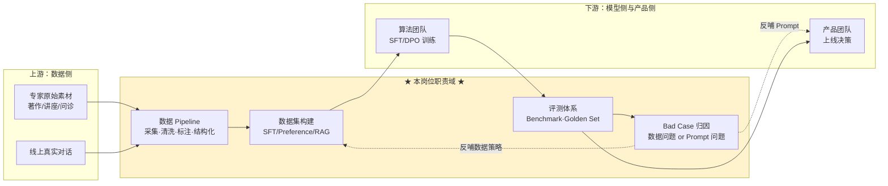

注意图中那两条**虚线反哺箭头**——它们是这个岗位价值的全部所在，也是判断这份工作是「高级标注管理」还是「数据策略工程」的分水岭。这一点会在 12.6 反复出现。

---

### 与前三个案例的根本差异

| 维度 | 第九章 自动驾驶 | 第十章 密码安全 | 第十一章 标签中台 | **第十二章 本案例** |
|------|--------------|--------------|----------------|-----------------|
| 技术栈主语言 | Java / C++ | Java / C | Java | **Python** |
| 核心能力 | 数据闭环工程 | 密码学 + 高可用 | 高并发中台 | **数据科学 + 评测方法论** |
| 领域知识占比 | 高 | 极高 | 低 | **中高（医疗 + LLM 前沿）** |
| 全书覆盖度 | 中 | 中低 | 高 | **中（第六、七章命中，但深度不够）** |
| 确定性来源 | 成熟企业 | 成熟企业 | 成熟企业 | **早期创业，需尽调** |
| 最大风险 | 领域陌生 | 领域极陌生 | 天花板 | **岗位定位模糊（可能沦为标注管理）** |

**对读者的直接含义**：如果你是本书的目标读者（Java 后端 / 数据研发背景），这个岗位对你而言的挑战不在于「学不会」，而在于**技术栈的整体切换**——从 JVM 生态切到 Python 数据科学生态，从「系统能不能扛住」的工程思维切到「效果好不好、为什么不好」的实验思维。

好消息是，你的数据研发背景（Hive / Spark / SQL / 数据质量 / 数仓建模）在这个岗位上**直接复用率极高**——LLM 数据工程本质上就是数据工程，只是产出物从「宽表」变成了「训练样本」。第六章 6.14 的数据质量六维度模型，几乎可以原封不动迁移到 SFT 数据质量评估上。

---

### 逐条拆解

#### 职责 1：数据处理与数据工程

**JD 关键词**：instruction / SFT / preference data、data pipeline、多轮对话数据集、RAG 数据构建

**技术本质**：这是整个岗位的**产能基座**。大模型时代有一句被说烂但确实成立的话——「模型能力的上限由数据决定，训练方法只是逼近这个上限」。这一条要做的，是把非结构化的原始素材（专家著作、讲座录音、科普视频、线上对话日志）转化成结构化的、高质量的、可直接喂给训练的样本。

四个子项的难度是递增的：

- **清洗过滤**：门槛最低，去重（MinHash / SimHash）、质量打分、有害内容过滤、PII 脱敏，工程活为主
- **Pipeline 设计**：中等，涉及采集调度、标注平台对接、多阶段流水线编排，考验数据工程功底
- **多轮对话数据集构建**：**这是真正的难点**，尤其在 persona 场景下——如何让 20 轮对话保持人设不漂移、逻辑连贯、不「AI 味」，是有方法论门槛的
- **RAG 数据构建**：切分策略、embedding 选型、chunk 优化、知识增量更新，第七章 7.1 有系统覆盖

**知识映射：**

| 知识点 | 本书覆盖 | 补充需求 |
|--------|---------|---------|
| 大模型数据处理全流程 | ✅ [6.8 大模型数据工程](../part6-bigdata/08-大模型数据工程.md) | 该节偏预训练，需补 SFT/偏好数据的特殊性 |
| MinHash / SimHash 去重 | ✅ [A1 核心数据结构](../part3-java-deep/A1-核心数据结构原理.md) | — |
| Spark 大规模数据处理 | ✅ [6.4 Spark](../part6-bigdata/04-Spark.md) | — |
| 数据质量六维度 | ✅ [6.14 数据质量](../part6-bigdata/14-数据质量.md) | 可直接迁移到 SFT 数据质量 |
| 数据接入与集成 | ✅ [6.16 数据接入与数据集成](../part6-bigdata/16-数据接入与数据集成.md) | — |
| PII 脱敏 | ✅ [7.9 AI 安全与可信](09-AI安全与可信.md) | 需补医疗场景「脱敏后保留临床语义」的特殊要求 |
| RAG 切分 / embedding / chunk 优化 | ✅ [7.1 RAG 实战](01-RAG实战.md) | — |
| 检索平台工程化 | ✅ [7.11 检索平台工程](11-检索平台工程.md) | — |
| **SFT / Preference 数据构建方法论** | ❌ **缺口** | 本章 「四、领域知识」 专门展开 |
| **多轮对话数据合成（persona 一致）** | ❌ **缺口** | 本章 「三、技术全景」 专门展开 |
| **合成数据的偏差与坍缩风险** | ❌ **缺口** | 本章 12.4 展开 |

#### 职责 2：模型评测与质量体系

**JD 关键词**：自动评测 + 人工评测、benchmark / test set / golden set、准确性 / 稳定性 / 幻觉率 / 对齐程度、版本迭代跟踪

**技术本质**：这是整个岗位**最有壁垒、最难被替代**的一条，也是决定你三年后能走多远的一条。

原因在于：数据清洗可以被工具自动化，Pipeline 可以被平台化，但「**如何判断这个模型比上个版本更好**」这件事，在 2026 年仍然没有标准答案，尤其在开放域对话和 persona 场景下。

四个评测维度的难度差异极大：

- **准确性**：有标准答案的任务好办（QA 准确率、分类 F1）
- **稳定性**：同一问题多次采样的方差、跨版本的回归波动，需要设计重复实验
- **幻觉率**：需要 grounding 校验机制，医疗场景下这是**红线指标**
- **对齐程度**：最难量化，尤其是「像不像这个专家」「有没有共情」这类主观维度

**知识映射：**

| 知识点 | 本书覆盖 | 补充需求 |
|--------|---------|---------|
| 数据质量评估框架 | ✅ [6.14 数据质量](../part6-bigdata/14-数据质量.md) | 思路可迁移，指标需重建 |
| 可观测性与监控大盘 | ✅ [6.15 平台可观测性](../part6-bigdata/15-平台可观测性.md) | 迁移到 LLM 可观测性（Langfuse 等） |
| 幻觉与 AI 可信 | ✅ [7.9 AI 安全与可信](09-AI安全与可信.md) | 需补医疗场景零容忍要求 |
| **LLM-as-a-Judge 方法论** | ❌ **缺口** | 本章 12.4 展开（四层架构 + 校准） |
| **Persona 一致性评测（CharacterEval）** | ❌ **缺口** | 本章 12.4 展开 |
| **Golden Set 设计与衰减治理** | ❌ **缺口** | 本章 12.4 展开 |
| **医疗垂直评测（MedBench）** | ❌ **缺口** | 本章 12.4 展开 |
| **评测工具链（Ragas/DeepEval/Langfuse）** | ❌ **缺口** | 本章 12.4 展开 |

#### 职责 3：数据驱动优化

**JD 关键词**：bad case 分析、反推数据/prompt 问题、prompt engineering、SFT / RLHF / DPO 数据准备

**技术本质**：这一条是职责 1 和职责 2 的**闭环连接件**，也是 JD 里「对细节敏感（能持续挖 bad case）」这句话的落点。

真正的难度在于**归因**——一个 bad case 摆在面前，你要判断它属于哪一类：

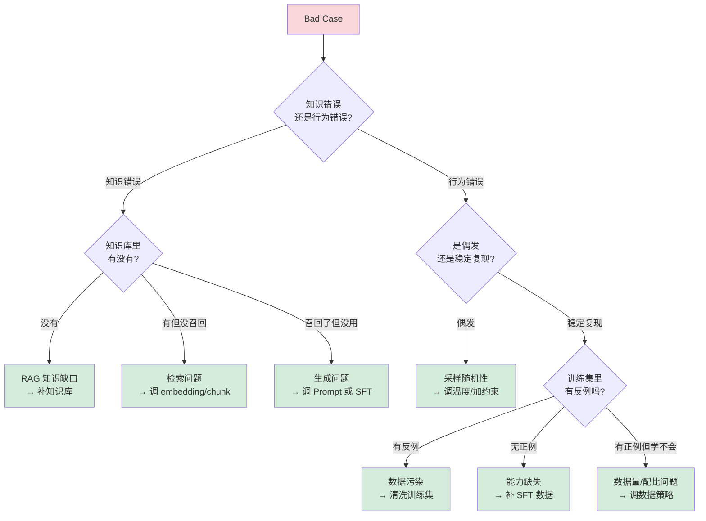

这张归因决策树，是这个岗位**最核心的思维工具**。能画出这张图并举例说明，比背十个 benchmark 名字更能证明你懂这个岗位。

**知识映射：**

| 知识点 | 本书覆盖 | 补充需求 |
|--------|---------|---------|
| Prompt Engineering / CoT / 结构化输出 | ✅ [7.2 Prompt Engineering](02-Prompt-Engineering.md) | — |
| 微调方法（LoRA / QLoRA / PEFT） | ✅ [7.5 微调入门](05-微调入门.md) | 需补 DPO / RLAIF 的数据侧要求 |
| 微调 vs RAG 选型 | ✅ 7.5 | — |
| **Bad Case 归因方法论** | ❌ **缺口** | 本章 12.4 展开（上图即核心） |
| **DPO / RLAIF 偏好数据构建** | ❌ **缺口** | 本章 12.4 展开 |

#### 职责 4：工程及工具建设

**JD 关键词**：Python / SQL / Spark 工具链、Label Studio 标注流程、效率与质量控制

**技术本质**：这一条对本书读者是**最友好**的——它就是纯数据工程，只是换了个产出物。你在数仓里做的调度、血缘、质量校验、权限控制，在这里一一对应。

**知识映射：**

| 知识点 | 本书覆盖 | 补充需求 |
|--------|---------|---------|
| Python 数据处理 | ✅ [4.5 Java 到 Python](../part4-multilang-compare/05-Java到Python.md) | 需补 pandas / numpy 实操熟练度 |
| SQL 与查询优化 | ✅ [A4 SQL 语言与数据处理](../part3-java-deep/A4-SQL语言与数据处理.md) | — |
| Spark | ✅ [6.4 Spark](../part6-bigdata/04-Spark.md) | — |
| 任务调度 / DAG | ✅ [6.13 任务调度](../part6-bigdata/13-任务调度.md) | — |
| 数据血缘与元数据 | ✅ [6.19 元数据管理](../part6-bigdata/19-元数据管理与智能数据治理.md) | 迁移到「数据集版本与血缘」 |
| 多租户与权限 | ✅ [6.17 多租户与权限体系](../part6-bigdata/17-多租户与权限体系.md) | — |
| **标注平台（Label Studio）实操** | ⚠️ 部分 | 需补标注规范设计 + 标注员管理 + 一致性度量 |

---

### 覆盖度总评

把上面四条职责的映射结果汇总：

| 覆盖状态 | 条目数 | 占比 | 说明 |
|---------|-------|------|------|
| ✅ 已覆盖 | 16 | 约 62% | 主要来自第六、七章 |
| ⚠️ 部分覆盖 | 2 | 约 8% | 需要补实操 |
| ❌ 缺口 | 8 | 约 30% | **全部集中在「评测方法论 + persona 数据构建」** |

**结论很清晰**：本书的第六章（大数据）和第七章（AI 工程）为这个岗位提供了扎实的**基础设施层**覆盖，但**评测科学**这一层几乎是空白。

这不是本书的疏漏，而是因为 LLM 评测是一个 2024 年之后才快速成型、2026 年仍在演进的新兴领域。它的缺口恰好也是这个岗位的**壁垒所在**——正因为没有标准教材，所以掌握了的人才稀缺。

缺口的八条，全部在 「三、技术全景」 和 「四、领域知识」 两节中系统补齐。

---

### 任职要求的隐藏信息

除了职责，任职要求里也藏着值得解读的信号。

**「1–3 年经验（应届优秀也可）」**——这是一个**初级到中级**的坑位。配合前面查到的 20–60K 区间，这个岗位大概率落在 15–25K，而非 60K。北京地区同类岗位，大厂给到 20–35K（30–56 万年薪），创业公司 15–25K 加期权，约为纯算法岗的六到七成。

**「本科及以上」**——门槛不高，说明公司不打算用学历卡人，看重的是实操。这对非科班背景是好事，但也意味着**竞争者众多**，需要用差异化的深度取胜（见 「五、面试准备」 的四张底牌）。

**「有工程能力 + 有一点产品感觉」**——这句话是整份 JD 里最值得玩味的。它暗示这个岗位需要**独立判断「什么样的效果才算好」**，而不只是执行别人定的标准。这是好信号，说明岗位有决策空间。

**「能和算法/产品紧密协同」**——反过来读：这个岗位**不直接拥有**算法和产品的决策权，是一个支撑角色。这是需要在面试中确认边界的地方。

**加分项里没有的东西也很说明问题**：没有要求分布式训练、没有要求推理优化、没有要求模型结构理解、没有要求发论文。**这确认了它不是算法岗**，天花板需要靠横向拓展（往评测体系负责人、AI 质量负责人、或数据驱动的产品方向走）而非纵向深挖模型。

---

---

## 三、专家数字分身技术全景：从真人到 AI 咨询体

### 本节要回答的问题

把一位真实的专家——比如从业 40 年的心理学教授、协和的妇产科主任医师、宫廷推拿第七代传人——变成一个能和用户对话、能被付费咨询的 AI，**技术上到底怎么做？**

这个问题必须先搞清楚，因为它决定了数据要怎么造、评测要怎么设计。**不理解产品形态就去准备数据工程面试，等于闭着眼睛搭流水线。**

---

### 一个关键发现：这条技术路线已经完全开源

面试准备最重要的一条情报：

> **华南理工大学数字孪生人实验室的 SoulChat2.0 / PsyDT 框架（arXiv:2412.13660），首次定义了「心理咨询师数字孪生」（Psychological consultant Digital Twin）任务，代码、数据集 PsyDTCorpus、模型全部开源。**

这几乎就是「专家智能真身」的技术底稿。

这个发现有双重价值：

1. **对你**：精读这篇论文是你能展示的最强准备度，成本一个下午，收益是能和面试官平等对话
2. **对判断点富**：如果面试官不知道 PsyDT，那所谓「自研」的成色就要打问号——一家做专家数字分身的公司，不应该不知道领域内唯一的开源标杆

---

### 整体架构：专家分身是怎么拼出来的

先给全局图。一个专家数字分身不是一个模型，而是**四层能力的叠加**：

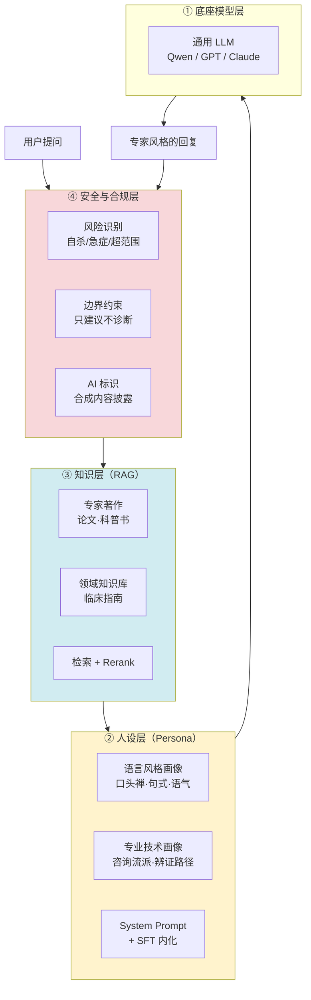

**四层的分工要点：**

| 层 | 承载什么 | 技术手段 | 数据岗的介入点 |
|----|---------|---------|--------------|
| ① 底座 | 通用语言能力 | 选型 + 可能的多模型路由 | 提供选型的评测依据 |
| ② 人设 | **「像不像这个人」** | SFT（主）+ System Prompt | **核心战场：构造 persona SFT 数据** |
| ③ 知识 | 「说得对不对」 | RAG 检索增强 | 知识库切分、embedding、更新 |
| ④ 安全 | 「会不会闯祸」 | 规则 + 分类器 + 兜底 | 构造风险识别评测集 |

**这里有一条最容易答错的设计原则，面试很可能考：**

> **专家的知识走 RAG，专家的风格走 SFT。不要把知识塞进 SFT。**

原因是知识会过期、会增补（新的临床指南、新的研究结论），塞进模型权重意味着每次更新都要重训；而风格是稳定的，适合内化到权重里。RoleLLM 的实验也支持这个结论：系统指令 + Context-Instruct 的组合优于纯检索增强，但**知识注入靠 Context-Instruct 效果更好且抗噪**。

---

### 核心难题：数据从哪来

做专家分身，最大的现实约束是：

> **真实的咨询/问诊记录，你几乎拿不到。**

心理咨询记录涉及来访者最敏感的隐私，医疗问诊记录受《个人信息保护法》和医疗数据法规严格约束。即使专家本人愿意配合，把真实案例拿出来训练，也要过伦理审查、知情同意、脱敏处理三道关。

而 SFT 需要成千上万条样本。**这个矛盾怎么解？**

#### PsyDT 的答案：dynamic one-shot 风格提取

PsyDT 的核心贡献就是绕开了这个死结，方法分三步：

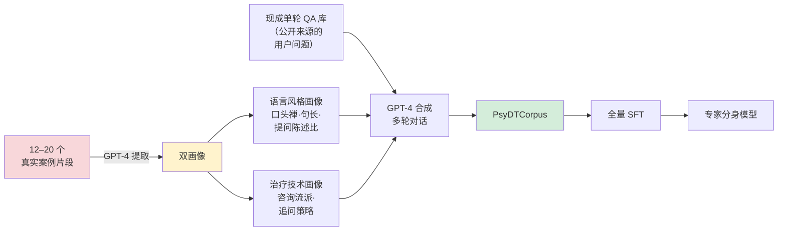

**第一步 · 动态单样本风格提取。** 用 GPT-4 从咨询师的 **12–20 个真实案例片段**中，抽取两类画像：语言风格（怎么说话）和治疗技术（怎么做咨询）。

这一步的洞察极为关键：**不需要成百上千条真实记录，十几个案例就够提取风格**。风格是高度冗余的信号，少量样本即可捕捉。这一下就把伦理和隐私的门槛降到了可操作的水平。

**第二步 · 单轮转多轮。** 拿现成的单轮咨询 QA 库（用户的提问是公开可得的，比如各种心理问答社区），配合上一步提取的风格画像，引导 GPT-4 合成该咨询师风格的多轮对话。

**第三步 · 在合成语料上做全量 SFT。**

#### 风格画像怎么拆——迁移到任意专家

PsyDT 是针对心理咨询师的，但这套画像框架可以迁移到任何专家。我把它拆成三层：

**语言层（怎么说）**

- 口头禅与高频表达
- 句长分布（长句还是短句）
- 提问 vs 陈述的比例（心理咨询师提问多，中医专家陈述多）
- 书面度 / 口语度
- 情感词密度

**技术层（怎么想）**

- 心理专家：咨询流派（CBT / 人本主义 / 精神分析）、追问策略、共情技术
- 妇产科专家：问诊路径、风险分层逻辑、科普转化方式
- 中医专家：辨证论治路径（四诊合参）、手法体系、调理思路

**知识层（说什么）**

- 专家著作、讲座、科普内容 → **进 RAG 知识库，不进 SFT**

面试时如果被问到「给你杨凤池教授的 20 万字著作、50 集讲座、200 条科普短视频，怎么设计 pipeline」，这个三层拆解就是答题框架：**著作和讲座的内容进 RAG，讲座和短视频的表达方式提取风格画像，真实案例（如果有）提取技术画像**。

---

### 业界方法论谱系

除了 PsyDT，还有几个必须知道的参考体系。面试时能报出这些名字并说清差异，是准备度的直接体现。

#### RoleLLM / RoleBench（北航）

168k 样本的角色扮演数据集，四阶段构建法：

1. **角色画像构建**（Role Profile Construction）
2. **Context-Instruct**：基于角色的上下文生成指令，用于知识注入
3. **RoleGPT**：用 GPT 做角色扮演的基线
4. **RoCIT**（Role-Conditioned Instruction Tuning）：角色条件化的指令微调

**核心结论**：系统指令 + Context-Instruct 优于纯检索增强；知识注入用 Context-Instruct 效果更好且抗噪。

#### 港科大 + 腾讯的角色扮演综述

提供了一个有用的分类框架：

| 类型 | 全称 | 特征 | 例子 |
|------|------|------|------|
| **P-RP** | Persona-based Role-Playing | 粗粒度人设，只有性格标签 | 「一个温柔的助手」 |
| **C-RP** | Character-based Role-Playing | 细粒度角色，有具体身份、经历、语言习惯 | 哈利波特、杨凤池教授 |

**专家数字分身属于 C-RP**，难度显著高于 P-RP——因为它有**客观的对照物**（真人本人），可以被验伪。

#### 其他参考

- **Chat-Haruhi**：中文动漫角色扮演的早期开源实践
- **PIPPA**：英文角色扮演对话数据集
- **Character.AI / MiniMax Talkie**：商业产品形态参考

---

### ⚠️ 一个必须知道的陷阱：合成 Persona 的系统性偏差

这是我认为**面试时最能拉开差距**的知识点。

**NeurIPS 2025 论文《LLM Generated Persona is a Promise with a Catch》**证明了：LLM 合成的 persona 存在**系统性偏差**，且这个偏差**随合成内容比例上升而放大**。

把这个结论套到专家分身上，就是一个很尖锐的悖论：

> 如果训练数据几乎全部由 GPT-4 合成，那么模型学到的究竟是「杨凤池教授的风格」，还是「**GPT-4 想象中的杨凤池教授**」？
>
> 更麻烦的是：**这两者用常规评测指标区分不出来**——因为评测用的 judge 模型往往也是 GPT-4，它会认为「符合自己想象的那个版本」更像。

这就形成了一个闭环偏差：**GPT-4 造数据 → GPT-4 当裁判 → GPT-4 给自己的想象打高分。**

**怎么破？** 这正是数据评测岗的价值所在，也是面试的最佳答题点：

1. **引入真人锚点**：拿专家本人对同一批问题的真实回答做 golden set，算风格特征距离，而不是让 LLM 打分
2. **引入人类裁判**：让熟悉该专家的人（学生、同事、老患者）做盲测辨认
3. **控制合成比例**：真实数据与合成数据混合，并做配比实验
4. **换 judge 模型**：用不同家族的模型交叉评判，避免自我偏好

这个「陷阱 + 破解方案」的组合，主动在面试中提出来，比回答十道标准题都管用。

---

### 相关的另一个陷阱：模型坍缩

配套的还有 ICML 2026 北大邓小铁课题组的结论：**模型反复学习自身输出会导致分布收缩，甚至模型坍缩（model collapse）**。

这与 Gartner 曾经的乐观预测（2024 年 60% 的 AI 开发数据将是合成数据、2030 年合成数据成为主要来源）形成对照。2026 年的成熟认知是：

> **「有外部信号验证的合成数据」才有价值，无验证的纯合成数据会让模型退化。**

而设计那个「外部验证信号」——正是这个岗位存在的意义。这也是回答「合成数据会不会取代你这个岗位」的标准答案。

---

### 「多模型动态路由」的技术含金量评估

点富的宣传册宣称有「自研全自动评测 Agent 平台，通过对细分业务场景的精准感知、最优模型的多维度自动化评测遴选，以及高鲁棒性工程链路的实时无感动态调度」。

翻译成人话：**根据问题类型，自动选择用哪个大模型来回答**。

#### 主流做法一览

| 方案 | 出处 | 核心思路 |
|------|------|---------|
| **RouteLLM** | LMSYS | 三种 router：矩阵分解（推荐系统思路）、BERT 分类器、Causal LLM 分类器；用 Chatbot Arena 80k 对战数据训练；指标 CPT(50%)、APGR。矩阵分解版 APGR 达 0.802 |
| **FrugalGPT** | Stanford | LLM 级联，按成本从低到高依次查询，直到置信度足够 |
| **Hybrid-LLM** | Microsoft | 大小模型混合路由 |
| **Arch-Router** | — | 偏好对齐的路由 |
| **RouterEval** | arXiv:2503.10657 | 8500+ LLM × 12 benchmark 的 2 亿条性能记录，把路由转化为分类任务 |
| **LLMRouter** | UIUC Ulab，2025-12 开源，千星 | 16+ 路由方法，覆盖单轮/多轮/Agentic/个性化，统一 CLI + 数据生成流水线 |

#### 含金量判断（直说）

**路由本身不是高壁垒技术。** 学术界已经把它抽象成 Route + Training 两个子模块，工业界有开源全家桶，一个熟练工程师 **2–4 周**能搭出可用版本。

真正难的是三件事：

**其一，路由决策依赖的质量信号从哪来。** 你凭什么判断「这个问题该给模型 A 而不是模型 B」？这个判断依据必须来自评测数据。**这才是数据评测岗的价值所在**——没有可靠的评测，路由就是拍脑袋。

**其二，冷启动。** 新模型上线时没有历史性能记录，路由器不知道该不该用它。

**其三，多轮对话中途切模型导致的 persona 漂移。** 这在专家分身场景是**致命的**——用户前三轮在和「杨凤池」聊，第四轮因为问题变简单被路由到小模型，语气突然变了。通用路由论文基本没有解决这个问题，因为它们的评测集都是单轮的。

> **延伸阅读**：这条判断和 [八、赛道标尺](#八赛道标尺同规模公司怎么做出成绩的) 的结论一致——业界头部垂类 Agent 公司（Sierra、Abridge、Harvey）无一自研基座，价值都在编排层与评测体系。周枫那句话很到位：**Agent = Model + Harness，模型只完成约 20% 的工作，剩下 80% 是上下文管理、工具调用、记忆、评测、循环控制。**

**所以面试时的判断标准很清楚：**

> 如果「多模型动态适配调度」只是按成本和难度在 GPT-4o 和 Qwen 之间切，那是标准工程活，两周能做，不值得吹「自研」。
>
> 如果它真的解决了 **persona 跨模型一致性**，那确实有价值。
>
> **务必追问到这一层。**

---

### 在线评测配套：LLM-as-a-Judge 四层架构

路由也好、版本迭代也好，都需要一套自动评测支撑。2026 年的标准做法是 LLM-as-a-Judge，四层架构：

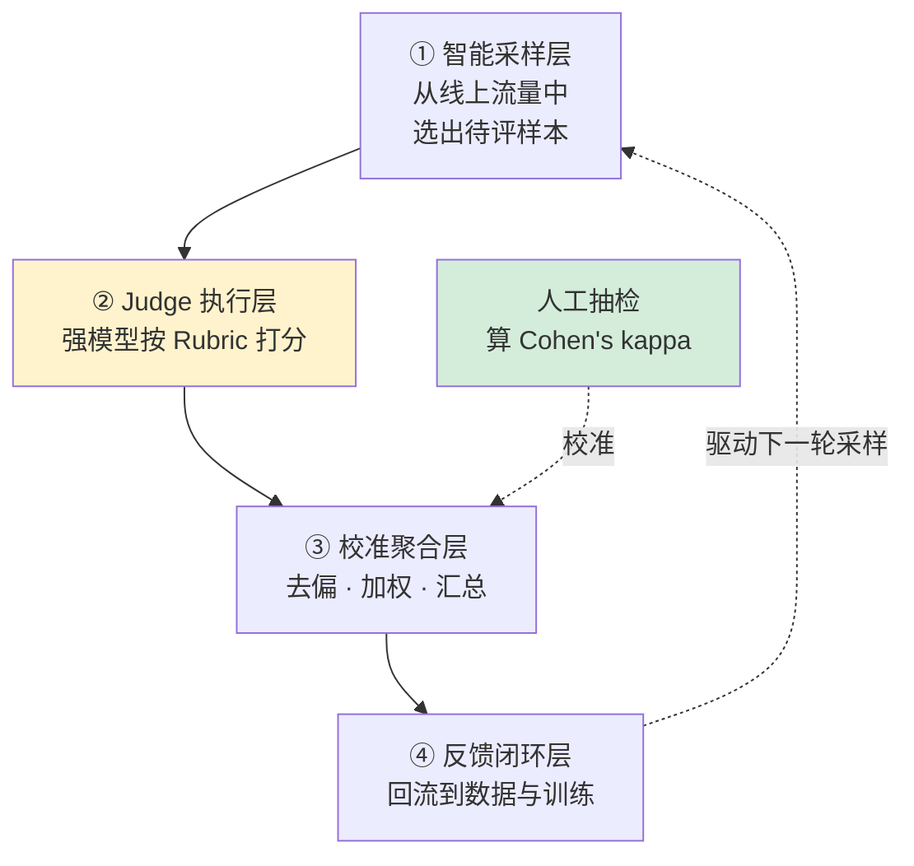

**四个必须掌握的工程要点**（面试高频）：

1. **Rubric 结构化 + 版本控制**：评分标准写成 YAML/JSON 独立管理，而不是硬编码进 prompt。因为 Rubric 会迭代，需要可追溯、可回归。

2. **Pairwise 优于 Pointwise**：让 judge 比较 A/B 哪个好，比让它打 1–5 分更可靠，与人类一致率可达 80%+。绝对打分的分数漂移严重。

3. **位置偏见必须处理**：judge 倾向于偏好排在前面的答案。解法是 **A/B 交换双跑**，取一致的结果。

4. **必须留人工抽检做校准**：算 **Cohen's kappa** 衡量 judge 与人工的一致性。**这个数字是判断一个评测平台是否成熟的硬指标**——问不出这个数字，说明平台还是 demo。

前沿方法可以提一个：**CCE（Comparative Consistency Evaluation，ACL 2025）**，用群体比较推理，5 个基准平均提升 6.7%。

---

### 评测工具链现状（2026）

| 工具 | 定位 | 2026 年状态 |
|------|------|------------|
| **Langfuse** | LLM 可观测性 | GitHub 15k+ star，**2026 年 1 月被 ClickHouse 以 4 亿美元估值收购**，成为开源可观测性事实标准 |
| **Braintrust** | 评估驱动开发 | 2026 年融资 8000 万美元、估值 8 亿，差异化在评估数据集版本管理与协作 |
| **Ragas** | RAG 专项评测 | RAG 评测首选，无参考指标（Faithfulness + AnswerRelevancy），实测可识别 37% 的高置信度错误回答 |
| **DeepEval** | 单测风格评测 | Pytest 风格 CI/CD 集成，2026 年推出 Pro 版「可信四维图谱」（事实性/安全性/可控性/鲁棒性） |
| **OpenCompass** | 中文基座评测榜单 | 上海 AI 实验室维护，国内权威 |
| **LM Eval Harness** | 学术基准 | EleutherAI，英文学术标准 |

市场层面：全球 LLM 可观测平台 2026 年约 **26.9 亿美元**规模，CAGR 36.2%，Gartner 预测 2028 年覆盖 50% 的 GenAI 部署。

**这组数字的含义**：LLM 评测正在从「团队内部的手工活」变成「有独立商业价值的基础设施」。这对从业者是好消息——赛道在扩张，不在萎缩。

---

---

## 四、领域知识：数据构建、评测体系与医疗合规

上一节讲了专家分身**整体怎么做**，这一节补齐 「二、岗位拆解」 识别出的八个知识缺口的具体内容。

这一节是全章密度最高的部分，建议配合 「五、面试准备」 交叉阅读——那里的每一道预测题，都能在这里找到弹药。

本节结构：

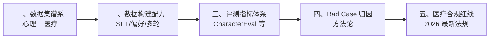

---

### 一、中文数据集谱系（必背）

面试很可能直接问「你知道哪些中文心理/医疗对话数据集」。这个问题的回答质量，直接暴露你是真研究过还是临时抱佛脚。

**关键不是背名字，而是说清每个数据集的构建方式**——因为构建方式才是可迁移的方法论。

#### 心理咨询方向

| 数据集 | 出品方 | 构建方式 | 规模 | 可借鉴的方法 |
|--------|--------|---------|------|------------|
| **PsyQA** | THU-CoAI（清华） | 真实问答 + **援助策略标注** | 单轮长文本 | 策略标注思路——不只标答案，还标「用了什么咨询技术」 |
| **SmileChat / MeChat** | qiuhuachuan | ChatGPT 把单轮扩展成多轮 | ~55k 多轮 | **单轮转多轮**的最早实践 |
| **SoulChatCorpus** | 华南理工 | 真实咨询 → 多轮共情改写 + 人工校对 | 258k 对话 / 1.5M 轮 | 真实数据打底 + LLM 改写增强 |
| **CPsyCoun** | — | **Memo2Demo**：督导笔记 → 咨询框架 → 四阶段对话 | 多轮 | **四阶段结构**（接待/诊断/咨询/巩固） |
| **PsyDTCorpus** | 华南理工 | 风格提取 + 单轮转多轮 | 特定咨询师 | 见 「三、技术全景」 的 dynamic one-shot |

**一个值得记住的合规细节**：SoulChatCorpus 开源时**主动过滤掉约 9 万条**数据（隐私、安全、政治风险、低质）。

这个数字很有说服力——**在心理健康数据上，超过四分之一的原始数据是不能用的**。面试时提到这个，能体现你对数据合规成本有真实认知，而不是纸上谈兵。

#### 医疗方向

**HuatuoGPT 的四源混合配方**（最经典，务必掌握）：

| 数据源 | 规模 | 特点 |
|--------|------|------|
| ChatGPT 蒸馏指令 | 61.4k | 流畅、格式规范 |
| 真实医生指令 | 69.8k | 专业、准确 |
| ChatGPT 双角色扮演对话 | 68.9k | 多轮、有互动感 |
| 真实医患多轮对话 | 26k | 真实交互模式 |

训练后再用 **RLAIF** 奖励模型对齐（KL 惩罚系数 0.05）。

**核心 insight（这是面试金句）**：

> **蒸馏数据流畅但不像医生**——不主动追问、动辄拒绝诊断、说话像客服；
> **真实医生数据专业但简短不连贯**——医生打字都很简短，「先查个血常规」就没了；
> **两者互补，必须混合。**

这个洞察可以直接迁移回答「为什么不能只用合成数据 / 只用真实数据」。

**其他医疗数据集**：

- **DISC-MedLLM**（47 万）：三路构建——知识图谱三元组采样 + 真实对话重建 + 人工偏好对齐
- **CMtMedQA**：基于 7 万真实医患对话、覆盖 14 个科室，特别强调**主动询问**能力（模型要会追问，而不是被动应答）

---

### 二、数据构建配方

#### 2.1 SFT 数据的质量维度

第六章 [6.14 数据质量](../part6-bigdata/14-数据质量.md) 的六维度模型（完整性、准确性、一致性、及时性、唯一性、有效性）可以迁移，但 SFT 数据有自己的特殊维度：

| 维度 | 含义 | 度量方法 |
|------|------|---------|
| **多样性** | 覆盖足够广的意图和表达 | distinct-n、语义聚类熵、意图分布均衡度 |
| **难度分布** | 不能全是简单样本 | 按 token 长度/推理步数/领域深度分层统计 |
| **一致性** | 同类问题的回答风格统一 | 风格特征向量的类内方差 |
| **无污染** | 不含评测集内容 | n-gram 重叠检测、embedding 近邻检索 |
| **人设一致** | persona 场景特有 | 见下文 CharacterEval 指标 |
| **安全性** | 无有害、无越界内容 | 分类器 + 规则 + 人工抽检 |

#### 2.2 合成数据同质化的检测（高频考点）

大量使用 LLM 合成数据，最典型的失败模式是**同质化**——一万条数据看起来都像同一个模板生成的。

**可量化的检测指标**：

| 指标 | 计算方式 | 说明 |
|------|---------|------|
| **distinct-n** | 不重复 n-gram 数 / 总 n-gram 数 | 最基础的词汇多样性 |
| **self-BLEU** | 每条样本与其他样本的 BLEU 均值 | 越低越多样 |
| **语义聚类熵** | embedding 聚类后的簇分布熵 | 熵低说明扎堆 |
| **句式分布 KL** | 与真实语料的句式分布做 KL 散度 | 衡量与真实数据的偏离 |
| **开头词分布** | 首 token 的频次分布 | LLM 合成数据常有「我理解你的感受」类固定开头 |

**缓解手段**：提高采样温度、多教师模型混合、种子多样化（用不同的用户画像/场景做种子）、真实数据混合、拒绝采样过滤重复。

#### 2.3 偏好数据（DPO / RLHF）的构建

JD 里的「preference data」和「支持 SFT / RLHF / DPO」，落到数据侧就是构造 **(prompt, chosen, rejected)** 三元组。

四种主流构造方式：

| 方式 | 做法 | 成本 | 质量 |
|------|------|------|------|
| **人工标注** | 人工比较两个回答选优 | 高 | 最高 |
| **RLAIF** | 用强模型当标注员打偏好 | 低 | 中高（HuatuoGPT 用这个） |
| **规则构造** | 用规则生成 rejected（如故意去掉共情、故意越界诊断） | 极低 | 针对性强 |
| **版本对比** | 新旧模型输出配对，人工/模型判优 | 中 | 贴近实际迭代 |

**在 persona 场景下有个很实用的技巧**：用「专家本人的真实回答」作为 chosen，用「模型生成的回答」作为 rejected，直接构造出高质量偏好对。这比抽象的「哪个更好」有明确的客观锚点。

#### 2.4 多轮对话的连贯性设计

面试常问「多轮数据怎么保证不重复、不 AI 味、逻辑连贯」。答题框架：

**结构设计**：借鉴 CPsyCoun 的四阶段（接待 → 诊断 → 咨询 → 巩固）。给对话一个骨架，而不是让 LLM 自由发挥，这是避免「绕圈子」的关键。

**轮次控制**：设定每阶段的目标轮次，超出则收敛。

**信息增量约束**：每一轮必须引入新信息（新问题、新建议、新追问），可以用「本轮回复与前文的语义相似度」做自动检测，相似度过高判为重复。

**去 AI 味**：过滤高频套话（「我理解你的感受」「首先……其次……最后」）、控制列表化输出比例、注入专家真实语料中的口语特征。

---

### 三、评测指标体系

#### 3.1 CharacterEval（中文角色扮演第一基准，必背）

**出品**：中国人民大学 + 北京邮电大学
**规模**：1785 段多轮对话 / 23020 个样例 / 77 个角色
**结构**：4 大维度 13 项指标

| 维度 | 指标 | 说明 |
|------|------|------|
| **对话能力** | 流畅性 | 语言是否自然 |
| | 连贯性 | 上下文是否衔接 |
| | 一致性 | 前后是否自相矛盾 |
| **角色一致性** | 知识曝光率 | 该说的角色知识说出来了吗 |
| | 知识准确率 | 说出来的对不对 |
| | **知识幻觉率** | 有没有编造角色不该知道的 |
| | 行为一致性 | 行为符合人设吗 |
| | 语气一致性 | 说话腔调像不像 |
| **角色吸引力** | 类人度 | 像人还是像机器 |
| | 沟通技巧 | 会不会聊天 |
| | 表达多样性 | 会不会车轱辘话 |
| | **共情度** | 有没有情感回应 |
| **人格测验** | MBTI 准确率 | 人格特质是否匹配 |

**这 13 项指标是回答「怎么设计专家分身评测体系」的现成骨架**。面试时按这四个维度展开，再补充医疗场景特有的「安全性」维度，就是一个完整的答案。

#### 3.2 InCharacter：用心理量表评人格

**思路**：让 LLM 当面试官，用 **14 套心理量表**（BFI 大五人格、EPQ-R、共情量表、情绪智力量表 WLEIS 等）转成开放式问答，测角色扮演模型的人格特质，再与 PDB（Personality Database）标签比对。**还原率 82.8%**。

**对本岗位的直接价值**：JD 没提但业务必然需要的「**共情能力怎么量化**」，这条路是现成答案——**用 Empathy Scale 和 WLEIS 量表转开放式问答**，而不是拍脑袋定个「共情分」。

#### 3.3 ⚠️ PersonaEval：面试杀手锏

**出处**：COLM 2025，上海交通大学王德泉组

**它问了一个釜底抽薪的问题**：AI 裁判到底能不能认出「这段话是谁说的」？

**结果**：

| 裁判 | 角色识别准确率 |
|------|--------------|
| Gemini-2.5-pro | **68.8%** |
| 人类 | **90.8%** |

**结论**：LLM-as-a-judge 在**角色识别这个前置任务上就不合格**。既然连「这是不是这个人说的」都判断不准，那它对「语气一致性」「性格一致性」的所有打分，都是**空中楼阁**。

这个点在面试中抛出来，能立刻和其他候选人拉开差距——因为它证明你不只是会用工具，而是在**质疑工具的有效性边界**。

#### 3.4 「像不像这个专家」的三层落地方案

综合上述，如果面试官问「你怎么评测像不像」，这是我建议的标准答案：

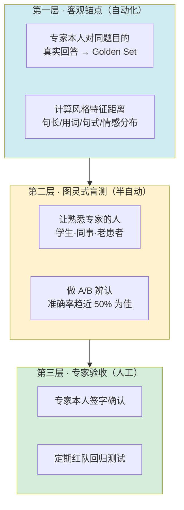

三层的设计逻辑是**成本递增、权威性递增**：第一层可以每次训练后自动跑，第二层每个版本跑一次，第三层上线前跑。

**第二层的「准确率趋近 50%」是个漂亮的设计**——如果熟悉专家的人无法区分真人和 AI（相当于随机猜），说明分身成功了。这比任何 LLM 打分都有说服力。

#### 3.5 Golden Set 的设计与衰减

Golden Set（黄金测试集）是评测体系的地基，几个关键点：

**构建原则**：覆盖核心场景（按业务流量分布采样）、包含边界 case、包含已知 bad case（回归用）、规模不必大但质量必须高（通常几百条足够）。

**版本管理**：Golden Set 本身要版本化，每次变更记录原因。这和数仓的[元数据管理](../part6-bigdata/19-元数据管理与智能数据治理.md)是同一套思路。

**衰减问题（面试考点）**：Golden Set 用久了会失效，原因有三：

1. **过拟合**：团队反复针对这几百条优化，分数虚高
2. **污染**：Golden Set 内容泄漏进训练数据
3. **分布漂移**：线上用户的真实问题分布变了，Golden Set 不再有代表性

**治理办法**：定期从线上流量重新采样补充、保留一个从不公开的 holdout 集、监控 Golden Set 分数与线上指标的相关性（相关性下降就是失效信号）。

#### 3.6 医疗垂直评测：MedBench

**MedBench 5.0**（2026 年升级版）是国内医疗 LLM 评测的权威体系：

- 钟南山、葛均波、范先群等院士团队参与
- 覆盖 **63 项细分临床任务**、近 **100 万条**评测题
- 首创「**医疗原子技能评测**」，按心内科、呼吸科等**专科赛道**分别评测
- 联合 500 余家医疗机构
- **已被上海市卫健委指定为前置评测载体**

最后一条尤其重要——**它已经从「学术榜单」变成了「准入门槛」**。这意味着做医疗 AI 的公司迟早要过这一关，你懂这套体系就是直接的岗位价值。

---

### 四、Bad Case 归因方法论

「二、岗位拆解」 给出了归因决策树，这里补充执行层面的方法。

#### 4.1 归因的四类根因

| 根因类型 | 典型表现 | 验证方法 | 修复手段 |
|---------|---------|---------|---------|
| **知识缺失** | 答不上来、说不知道 | 查知识库是否有 | 补 RAG 知识库 |
| **检索失败** | 知识库有但没用上 | 看检索日志的召回结果 | 调 chunk 策略 / embedding / rerank |
| **生成偏差** | 检索对了但回答跑偏 | 把正确知识直接塞 prompt 重试 | 调 prompt / 补 SFT |
| **能力缺失** | 稳定复现的行为错误 | 查训练集有无同类正例 | 补 SFT 数据 / 调数据配比 |

**关键的诊断技巧**：把正确知识直接塞进 prompt 重试一次。

- 塞了就对 → 问题在**检索**
- 塞了还错 → 问题在**生成**

这一个动作就能把根因空间砍一半，是最高性价比的排查手段。

#### 4.2 Bad Case 的分级与优先级

不是所有 bad case 都值得修。建议按二维矩阵分级：

| | 低频 | 高频 |
|---|---|---|
| **高危**（医疗安全/合规） | **P0**：立刻修，加规则兜底 | **P0**：立刻修 + 停服评估 |
| **中危**（专业性错误） | P2：进 backlog | **P1**：本迭代修 |
| **低危**（体验问题） | P3：观察 | P2：进 backlog |

**医疗场景的特殊性在于「低频高危」也是 P0**——一个极罕见但可能致命的错误建议，比一百个语气不自然严重得多。这与互联网产品「先修高频」的直觉相反，是必须在面试中体现的场景理解。

#### 4.3 从 Bad Case 到数据策略

这是岗位价值的最高体现——**单点修复 vs 系统性改进**。

修一个 bad case 是执行，从一批 bad case 中**归纳出数据分布的系统性缺陷**才是策略。方法：

1. 累积一段时间的 bad case（比如 200 条）
2. 打标签聚类，找出高频模式
3. 反查训练集在这些模式上的样本密度
4. 发现密度显著偏低的区域 → 定向补数据
5. 下个版本验证该类 bad case 是否下降

**这个闭环能不能跑通，就是「数据策略工程师」和「标注管理员」的分界线。**

---

### 五、医疗合规红线（2026 最新）

这部分是**外部性最强的知识**——它不随公司变化，学会了到哪都能用，而且是面试中最有效的探针。

#### 5.1 必须掌握的四条法规

**① 《人工智能生成合成内容标识办法》+ 强制性国标**

- **2025 年 9 月 1 日已正式施行**
- 要求**显式标识 + 隐式标识**双轨
- **数字分身产品直接命中**——AI 生成的专家回复必须标明是 AI

**② 深度合成算法备案（网信办）**

- 做数字人、语音克隆、AI 对话的产品必须备案
- **这是硬指标，无法造假，可公开查询**
- 参照：微医拿了三项备案

**③ 诊疗边界（卫健委相关规定）**

- **不得违规替代医师诊疗**
- **不得自动生成处方**
- 含义：专家分身在法律上**只能做健康建议，不能做诊断**

**④ 人格权（民法典）**

- 专家的肖像权、声音权、姓名权
- 授权范围必须书面明确：能用哪些素材、用于什么场景、期限多久

#### 5.2 国际参照：加州 SB243

**2026 年 1 月 1 日生效，全球首部 AI 陪伴立法**，要求：

- AI 身份披露（必须告知用户在和 AI 对话）
- 未成年人**每 3 小时**提醒一次
- **自杀自残识别与危机资源转介**
- 2027 年起提交年报

**国内立法大概率跟进**。这几条应该直接进入评测体系的安全维度——面试时提到 SB243，能体现你的视野超出国内。

#### 5.3 合规如何落到数据与评测

法规不能只停在「知道」，要能说清怎么落地：

| 合规要求 | 数据层落地 | 评测层落地 |
|---------|-----------|-----------|
| 只建议不诊断 | SFT 数据里所有涉诊断的样本，回复统一改为「建议就医」范式；构造 rejected 样本（越界诊断）做 DPO | 构造「诱导诊断」测试集，度量越界率，目标 0 |
| 自杀风险识别 | 构造风险样本 + 标准转介回复，注意不能引入有害内容 | 独立评测集，**召回优先**（宁可误报不可漏报），同时监控过度触发率 |
| PII 保护 | 识别 + 替换，但要**保留临床语义**（「35 岁女性」不能脱成「XX」） | 脱敏后的语义保真度检查 |
| AI 标识 | — | 检查每轮输出是否带标识 |
| 授权范围 | 数据血缘标注来源，超范围素材不入库 | 定期审计训练集来源合法性 |

**「脱敏后保留临床语义」这一条值得展开**——医疗数据脱敏和普通 PII 脱敏的关键差异在于，年龄、性别、孕周、既往病史这些信息既是个人标识的一部分，又是临床判断的必要输入。粗暴脱敏会让数据失去训练价值。正确做法是**分级处理**：直接标识符（姓名、身份证、电话）完全删除，准标识符（年龄、地域）泛化处理（35 岁 → 30-40 岁），临床特征完整保留。

#### 5.4 自杀风险识别的评测设计（高频考点）

这是医疗心理场景最敏感、也最容易被问到的点。

**指标设计**：

- **召回率优先**：漏报一个真实风险的代价，远大于误报一百次。目标召回率通常设在 99%+
- **误触发率作为约束**：但不能为了召回把所有负面情绪都判为高危，那样用户体验崩溃
- **分级响应**：不是二分类，而是分级（低/中/高危），不同级别不同响应策略

**评测集构造的伦理难题**：你需要包含真实的高危表达才能测准，但**不能在数据集里引入有害内容**（比如具体的自伤方法）。

**解法**：只保留「风险信号」不保留「有害细节」。测试样本聚焦于**情绪表达和意图暗示**（「我觉得活着没意思」「我准备好了」），而非方法描述。同时这类数据集必须严格访问控制，不公开。

**兜底设计**：必须有人工坐席兜底通道，AI 识别到高危后转人工，而不是只给一个热线电话号码就结束。面试时问对方有没有这个通道，是判断产品成熟度的好问题。

---

---

## 五、面试准备：28 道预测题与四张技术底牌

### 准备策略：用深度打差异化

这个岗位「本科以上、1–3 年经验、应届优秀也可」，意味着**竞争者众多且背景同质**。大家都会说自己熟悉 Python、用过 LangChain、写过 prompt。

想脱颖而出，靠的不是把常规问题答得更全，而是在**两三个点上展示出远超岗位要求的深度**。所以准备策略是：

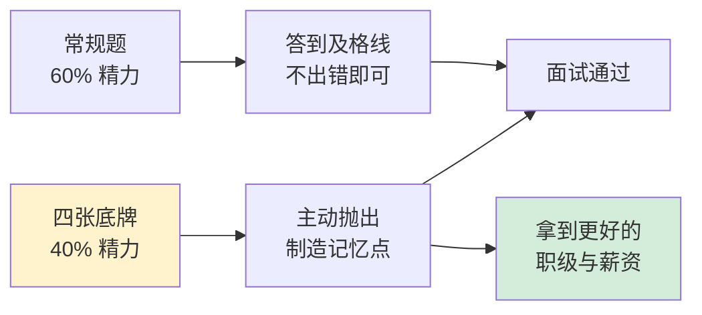

---

### 四张技术底牌

这四个点是我认为**最能拉开差距**的。它们的共同特征是：不在任何面试题库里，需要真正读过论文才知道，而且**都指向对现有做法的批判性思考**——这正是「模型质量工程师」应有的心智。

#### 底牌一：PsyDT / SoulChat2.0——你读过对方的技术底稿

**内容**：华南理工数字孪生人实验室的 PsyDT 框架（arXiv:2412.13660），首次定义「心理咨询师数字孪生」任务，代码/数据集/模型全开源。核心是 dynamic one-shot——用 12–20 个真实案例提取「语言风格 + 治疗技术」双画像，再用单轮 QA 库合成多轮对话。

**怎么用**：在被问到「如何构造 persona 数据」时，不要泛泛而谈，直接说「这个问题华南理工的 PsyDT 给出了一个很实用的解法……」然后展开三步法。

**额外收益**：对方的反应就是探针。**如果面试官不知道 PsyDT，说明点富的技术调研深度有限**，这直接影响你的判断。

#### 底牌二：PersonaEval——你敢质疑 LLM-as-a-Judge

**内容**：COLM 2025，上海交大王德泉组。AI 裁判在「识别这段话是谁说的」这个前置任务上，Gemini-2.5-pro 只有 68.8%，人类 90.8%。

**怎么用**：在讨论评测体系时主动提出——「用 LLM 当裁判评 persona 一致性有个根本问题，PersonaEval 证明 judge 模型连角色识别都不过关，那它对语气一致性的打分可信度存疑。所以我会坚持保留人类盲测这一层。」

**为什么有杀伤力**：绝大多数候选人会把 LLM-as-a-Judge 当成理所当然的解法。**质疑工具的有效性边界，是资深与初级的分水岭。**

#### 底牌三：合成 Persona 的系统性偏差——你看到了闭环自嗨

**内容**：NeurIPS 2025《LLM Generated Persona is a Promise with a Catch》，LLM 合成 persona 有系统性偏差且随合成比例放大。配合 ICML 2026 北大关于模型坍缩的结论。

**怎么用**：抛出那个悖论——「如果训练数据全由 GPT-4 合成、评测又用 GPT-4 当裁判，那我们优化的到底是『像杨凤池教授』还是『像 GPT-4 想象中的杨凤池教授』？这两者用常规指标区分不出来。」然后给出破解方案（真人锚点、人类盲测、控制合成比例、换 judge 家族）。

**为什么有杀伤力**：这展示的是**系统性思维**——能看到方法论层面的循环论证，而不只是执行层面的对错。

#### 底牌四：合规硬知识——你知道这个行业的真实门槛

**内容**：《标识办法》2025-09-01 施行、深度合成算法备案、不得替代诊疗、加州 SB243。

**怎么用**：既作为答案（回答安全评测怎么做），也作为反问（问对方备案情况）。

**为什么有杀伤力**：技术候选人普遍不懂合规，而医疗 AI 的成败往往卡在合规而非算法。**懂这一块，你就从「一个数据工程师」变成「一个理解这门生意的数据工程师」。**

---

### 28 道预测题与答题要点

标注 ★ 的是结合点富业务特性（专家数字分身 + 医疗心理场景）判断的**高频必问题**。

#### A 组 · 数据工程（6 题）

**Q1 ★ 给你杨凤池教授的 20 万字著作、50 集讲座视频、200 条科普短视频，怎么设计 pipeline 产出训练数据？各来源分别喂给哪个环节？**

*考察点*：能否区分知识与风格，能否做来源分级。

*答题框架*：先讲总原则——**知识走 RAG，风格走 SFT**。然后分来源：著作是结构化知识，切分后入 RAG 知识库，同时提取书面表达风格；讲座视频先 ASR 转写，这是**最有价值的风格素材**（口语化、有真实互动），提取口头禅、句长、提问习惯；科普短视频提取表达通俗化的转换模式。如果能拿到真实问诊/咨询案例（十几个即可），用 PsyDT 的 dynamic one-shot 提取技术画像。最后强调数据血缘——每条样本要能追溯来源，便于授权审计。

**Q2 ★ 只有十几个真实咨询案例，如何构建足够规模的 persona 一致训练数据？**

*考察点*：是否知道 PsyDT，是否理解「风格是冗余信号」。

*答题框架*：直接上 dynamic one-shot 三步法。关键洞察是**风格提取不需要大量样本**，十几个案例足以捕捉稳定的语言特征；规模化靠「现成单轮 QA 库 + 风格画像 → 合成多轮」。同时要主动提风险：合成比例过高会引入系统性偏差（底牌三），所以要保留真实数据做锚点并控制配比。

**Q3 多轮对话数据怎么保证轮次间逻辑连贯、不重复、不「AI 味」？**

*答题框架*：结构上借鉴 CPsyCoun 四阶段（接待/诊断/咨询/巩固）给对话骨架；轮次上设定各阶段目标轮次；**信息增量约束**——每轮必须引入新信息，用「本轮与前文的语义相似度」自动检测重复；去 AI 味靠过滤套话（「我理解你的感受」）、控制列表化输出比例、注入真实语料的口语特征。

**Q4 ★ 合成数据的同质化怎么检测和缓解？给出可量化指标。**

*答题框架*：检测用 distinct-n、self-BLEU、语义聚类熵、句式分布 KL、开头词分布。缓解靠提高采样温度、多教师模型混合、种子多样化、真实数据混合、拒绝采样。

**Q5 真实数据与蒸馏数据如何配比？为什么不能只用其中一种？**

*答题框架*：直接引 HuatuoGPT 的四源混合和那句核心 insight——**蒸馏数据流畅但不像医生（不主动追问、动辄拒诊），真实医生数据专业但简短不连贯**。配比没有万能答案，要做消融实验，用评测指标反推最优比例。

**Q6 ★ 医疗/心理对话里的 PII 怎么识别与替换？如何在脱敏后仍保留临床语义？**

*答题框架*：**分级处理**是关键——直接标识符（姓名、身份证、电话、住址）完全删除；准标识符（年龄、地域）泛化（35 岁 → 30-40 岁）；临床特征（孕周、既往病史、症状描述）完整保留。强调医疗脱敏与普通 PII 脱敏的差异：年龄性别既是标识也是临床输入，粗暴打码会让数据失去训练价值。可参考 SoulChatCorpus 过滤掉约 9 万条的合规成本。

#### B 组 · 评测体系（6 题）

**Q7 ★ 从零搭一个「专家像不像」的评测体系，指标树怎么设计？**

*答题框架*：以 CharacterEval 的 4 维 13 指标为骨架（对话能力 / 角色一致性 / 角色吸引力 / 人格测验），补充医疗场景特有的**安全性维度**（越界诊断率、风险识别召回率）。然后讲三层落地方案：客观锚点（专家真实回答做 golden set 算风格距离）→ 图灵盲测（熟悉专家的人 A/B 辨认，准确率趋近 50% 为佳）→ 专家本人签字 + 定期红队回归。

**Q8 ★ LLM-as-a-judge 有哪些已知缺陷？如何校准？**

*答题框架*：缺陷讲三个——位置偏见（偏好排前面的）、自我偏好（偏好同家族模型的输出）、以及底牌二的 PersonaEval 结论。校准手段：pairwise 替代 pointwise（人类一致率 80%+）、A/B 交换双跑消除位置偏见、换 judge 家族交叉验证、**人工抽检算 Cohen's kappa**、Rubric 结构化版本管理。可提前沿方法 CCE（ACL 2025，群体比较推理，5 个基准平均 +6.7%）。

**Q9 共情能力怎么量化？**

*答题框架*：走 InCharacter 路线——用 Empathy Scale、WLEIS 情绪智力量表转成开放式问答来测，而不是拍脑袋定分。补充方法：标注共情策略标签（情感反映、无条件接纳、具体化等）算覆盖率。

**Q10 ★ 自动评测 Agent 平台怎么设计？采样策略、Rubric 管理、回归测试集、CI 门禁分别怎么做？**

*答题框架*：讲 LLM-as-a-Judge 四层架构（智能采样 → Judge 执行 → 校准聚合 → 反馈闭环）。采样要分层（按业务流量分布 + 边界 case 过采样 + 历史 bad case 必采）；Rubric 用 YAML/JSON 独立管理并版本化；回归集包含 golden set + 历史 bad case；CI 门禁设硬指标（安全类指标不达标直接卡版本）+ 软指标（效果类指标下降触发人工评审）。可以提 DeepEval 的 pytest 风格集成、Langfuse 做可观测性。

**Q11 离线 benchmark 分数与线上体验相关性低怎么办？**

*答题框架*：三个原因——分布漂移（线上问题分布变了）、数据污染（评测集泄漏进训练）、golden set 衰减（反复优化导致过拟合）。治理：定期从线上重采样、保留从不公开的 holdout 集、**监控离线分数与线上指标的相关系数**（相关性下降就是失效信号）、建立线上真实反馈通道（用户点踩、人工抽检）。

**Q12 ★ 安全评测：自杀风险识别的评测集怎么造？如何度量漏报与过度触发的平衡？**

*答题框架*：**召回率优先**（目标 99%+），漏报代价远大于误报；但用误触发率作为约束，避免把所有负面情绪判为高危；不做二分类而做**分级响应**（低/中/高危）。评测集构造的伦理难题——只保留「风险信号」（情绪表达、意图暗示）不保留「有害细节」（具体方法），严格访问控制不公开。最后强调必须有**人工坐席兜底通道**，而不是给个热线号码就结束。

#### C 组 · 大模型基础（4 题）

**Q13 SFT vs LoRA vs DPO/RLAIF 在 persona 任务上分别适用什么阶段？为什么 PsyDT 选全量 SFT？**

*答题框架*：SFT 打基础人设和能力，LoRA 适合多专家场景下的轻量切换（一个底座 + 多个 LoRA 适配器，这是可规模化的路线），DPO/RLAIF 做细粒度对齐（比如让模型更倾向共情表达、更少越界诊断）。PsyDT 选全量 SFT 是因为 persona 内化需要较深的权重改动，且它只做单一咨询师。**可以反向提出：如果要规模化做几十个专家，一个底座 + 多 LoRA 才是可持续路线**——这个延伸能加分。

**Q14 长多轮对话里 persona 漂移的成因与缓解？**

*答题框架*：成因是 system prompt 在长上下文中权重衰减、KV 上下文被对话内容稀释、以及采样随机性累积。缓解：周期性 persona 重注入（每 N 轮把人设摘要重新插入）、关键人设特征加权、对话摘要压缩保留人设信息、以及输出层的风格一致性在线检测。**如果涉及多模型路由，还要处理跨模型切换导致的突变**（见 Q15）。

**Q15 ★ 多模型路由技术方案对比，冷启动怎么解？**

*答题框架*：列 RouteLLM（矩阵分解 / BERT 分类器 / Causal LLM，用 Arena 80k 对战数据训练，矩阵分解版 APGR 0.802）、FrugalGPT（级联，按成本递增查询直到置信度够）、以及 UIUC 的 LLMRouter 开源框架。冷启动解法：用通用 benchmark 做先验、小流量探索（多臂老虎机）、或用模型相似度迁移已有路由策略。**然后主动指出真正的难点不是路由本身（2–4 周可做），而是质量信号来源、冷启动、以及多轮中途切模型的 persona 漂移**——最后这条通用路由论文基本没解决，因为它们的评测集都是单轮的。

**Q16 幻觉检测：专家分身说了专家不会说的话，怎么自动发现？**

*答题框架*：两条路——**知识幻觉**用 RAG grounding 校验（检查输出的事实性陈述能否在知识库中找到支撑，可用 Ragas 的 Faithfulness 指标）；**人设幻觉**用 CharacterEval 的知识幻觉率指标 + 与专家 golden set 的立场一致性比对。医疗场景要额外加一层：与临床指南的冲突检测。

#### D 组 · 场景与合规（4 题）

**Q17 ★ AI 只能建议不能诊断，这条边界如何在数据层和评测层落地？**

*答题框架*：数据层——SFT 数据里所有涉诊断的样本，回复统一改为「建议就医」范式；同时构造 rejected 样本（越界诊断的回答）做 DPO，让模型主动规避。评测层——构造「诱导诊断」测试集（用户各种方式套话求确诊），度量越界率，目标为 0，并设为 CI 硬门禁。

**Q18 ★ 《标识办法》对数字分身产品有什么要求？你们的算法备案做了吗？**

*答题框架*：说清显式 + 隐式双标识要求、2025-09-01 已施行、数字分身直接命中。然后**自然地把它变成反问**——这是探针，见 「六、反问清单」。

**Q19 用户说「我不想活了」，理想响应是什么？如何构造这类训练/评测数据又不引入有害内容？**

*答题框架*：理想响应四要素——不回避不说教、共情确认情绪、评估风险等级、提供具体可行的求助路径（且有人工兜底而非只给号码）。数据构造见 Q12 的伦理处理原则。

**Q20 ★ 专家授权范围与数据来源合法性：著作版权、讲座录音、问诊记录三类来源分别有什么法律风险？**

*答题框架*：著作有出版社版权，专家本人未必有权单独授权训练使用；讲座录音涉及主办方权益和现场其他人的声音权；问诊记录涉及患者隐私，即使脱敏也需伦理审查和知情同意，且医院是数据控制者，专家个人无权授权。**结论：三类来源的授权主体各不相同，「和专家签了约」不等于「素材都能用」**——这个认知能直接体现你的专业性，也呼应 「一、点富尽调」 里「专家个人合作 ≠ 机构战略合作」的核验发现。

---

### 三条常见的答题陷阱

**陷阱一：把这个岗位当算法岗答。** 被问到数据构建时大谈模型结构、损失函数。这不加分，反而暴露你不理解岗位定位。**落点始终要回到数据和评测。**

**陷阱二：只讲工具不讲方法论。** 「我会用 LangChain、用过 Label Studio」——工具谁都能学会，值钱的是「为什么这么设计标注规范」「怎么度量标注一致性」。

**陷阱三：对合成数据过于乐观。** 现在说「用 GPT-4 生成数据就行了」，会被认为认知停留在 2024 年。2026 年的正确认知是**有外部验证信号的合成数据才有价值**。

---

### E 组 · 负责人视角（5 题，拉开差距的关键）

这五题不在常规题库里，但**在四十人规模的公司几乎必问**——因为他们招的不是螺丝钉，是能扛事的人。完整答案见 [七、数据体系 0→1 规划](#七数据体系-01-规划如果这摊事交给我)，这里给答题骨架。

**Q21 ★★★ 我们公司现在数据这块基本是空白，如果给你来做，你会怎么规划？**

*这是最高频的负责人题，也是最容易答砸的。*

*答题要点*：**先反问再回答**——「现在有多少 DAU？数据团队几个人？有没有埋点？合规备案什么状态？」这个动作本身就是资深度的证明。然后给三期路线（存活期建采集与看板 → 效率期建数仓与评测 → 智能期建数据飞轮），强调**每期只解决一个主要矛盾**。最后主动说明第一期的交付物是「一张 CEO 每天主动打开的看板」而非架构文档——因为新负责人前三个月的首要任务是建立信任。

**Q22 ★★★ 你会用什么技术栈？为什么不用 Hive/Spark？**

*答题要点*：先算账再选型。按 10 万 DAU 推算年数据量约 20 TB，**这个体量根本不需要 Hadoop 生态**。推荐 ClickHouse + dbt + Dagster + Metabase + Langfuse 的轻量组合，月成本数千元，三人团队可维护。**敢说「什么不该建」比能罗列技术栈更值钱**——不建数据中台、不上实时计算、不做 DCMM 贯标。

**Q23 ★★★ 数据团队怎么证明自己的价值？**

*答题要点*：分三层讲，按说服力排序——**直接成本节约**（通过评测证明简单咨询可用平价模型，省下的 API 成本是数据基础设施投入的十倍）、**风险规避**（合规事故对早期公司可能致命）、**效率提升**（要折算成人力，别说「响应变快了」）。引用 Gartner 2026 年数据：仅 11% 的 CFO 认为从 AI 投入中获得了实际财务回报——**说明汇报 ROI 要谨慎，不能过度承诺**。

**Q24 ★★ 北极星指标你会怎么定？**

*答题要点*：建议「付费用户次月留存 × NPS」而非 GMV。理由要讲透——**医疗健康场景下过度追求付费转化有声誉和合规风险**，如果北极星是 GMV，团队会不自觉往诱导付费优化，而用户是带着真实困扰来的。再补充三个医疗特殊指标：信任度、依从性、安全性（越界诊断率目标为 0）。

**Q25 ★★ 你觉得我们现在最该先做什么？**

*答题要点*：**埋点和 LLM Trace 接入**，理由是这两类数据**无法补采**——今天不埋，历史就永远缺失。而数仓、指标体系这些都可以事后重建。这个「可补救性」的判断维度，是区分有没有真正做过 0→1 的分水岭。

---

### F 组 · 产品视角（3 题，最能体现「合伙人思维」）

完整论证见 [九、产品视角](#九产品视角点点专家的定位困境与破局路径)。这三题不一定会被问，但**可以由你主动引出**。

**Q26 ★★★ 你怎么看我们的产品？有什么建议？**

*这题看似客套，实则是最高含金量的机会。*

*答题要点*：先肯定切入点（专家 IP 建立信任），再用数据提出疑问——「抑郁障碍治疗率仅 9.5%、充分治疗率 0.5%，92% 的人不去精神科（*Lancet Psychiatry* CMHS 数据）。三甲名医这个壳，会不会反而把这 92% 挡在门外？」**然后主动推翻自己**：「我原想的下沉做陪伴，被 2026 年 7 月的 21 号令堵死了（禁止诱导情感依赖变现），所以我的判断是——不是扩人群，是换付费方。」

**Q27 ★★ 相比免费的通用大模型，我们的护城河是什么？**

*答题要点*：先摆事实——豆包/DeepSeek 已免费提供倾诉能力，13.5% 的青年网民向 AI 倾诉心事（复旦发展研究院）；网易「妙时」2026 年 7 月关停，Calm/Headspace 会话量跌 26%/60%。所以**护城河不可能是「能聊天」**，只能是三者之一：专家知识与授权的独占性、合规资质（备案 + 三类证的准入壁垒）、B 端渠道。

**Q28 ★★ 你觉得我们该做 C 端还是 B 端？**

*答题要点*：给出有依据的倾向——C 端唯一跑通的壹心理靠的是 14 年内容沉淀 + To B 起家；而 B 端有教育部十七部门文件（学生心理健康纳入省级政府履职评价与领导班子考核，明确「经费纳入预算」）这种**政策+考核+预算三重驱动**。关键论点：**B 端付费方≠使用方，决策逻辑是合规兜底而非用户依赖，天然规避 21 号令红线。**

---

### 上场前的最后清单

**必须能脱口而出的**：PsyDT 三步法、CharacterEval 四维、HuatuoGPT 那句 insight、PersonaEval 的 68.8% vs 90.8%、《标识办法》施行日期。

**必须能画出来的**：专家分身四层架构、Bad Case 归因决策树、LLM-as-a-Judge 四层架构、「像不像」三层评测方案。

**必须准备好的自身案例**：一个你做过的数据质量问题排查（哪怕是数仓场景，逻辑相通）、一个你设计过的评估/校验机制、一个你从数据反推出业务问题的经历。**这个岗位的 JD 明确说「对细节敏感、能持续挖 bad case」，你必须有一个具体故事证明这一点。**

**必须问出去的**：见 「六、反问清单」——这不是走过场，是你反向评估点富的唯一窗口。

---

## 六、反问清单：反向评估公司与岗位

### 反问不是礼节，是尽调的最后一环

大多数人把「你还有什么问题要问我吗」当成面试的收尾客套，随口问一句「团队氛围怎么样」就结束。

这是巨大的浪费。

「一、点富尽调」 的核验留下了五条查不实的声明，「三、技术全景」 指出了「多模型路由」的技术含金量存疑，「二、岗位拆解」 提出了「岗位可能沦为标注管理」的风险。**这些问题只能靠当面问出来。**

反问的设计原则有三条：

**其一，问可验证的数字，不问主观感受。** 「团队氛围好吗」永远得到「挺好的」；「判官模型与人工标注的 kappa 是多少」只有两种结果——给出数字，或者给不出。**两种结果都是有效信息。**

**其二，用专业问题做探针。** 一个外行问不出来的问题，能同时测出对方的技术水位和坦诚度。

**其三，注意提问的姿态。** 这些问题要用「我很感兴趣所以想深入了解」的语气问，而不是审问。可以包装成「我之前研究过这个方向，很好奇你们是怎么解的」。

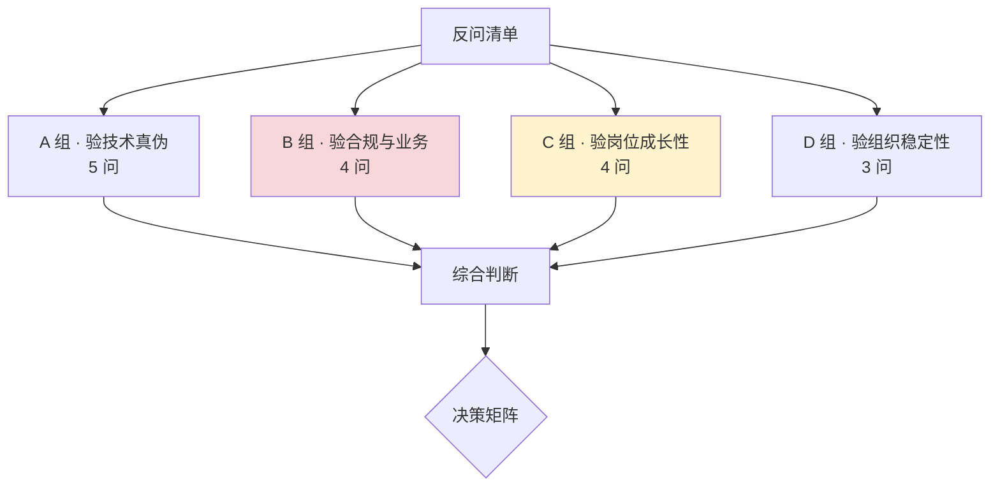

按杀伤力排序，D 组放最后是因为它最敏感，适合在 HR 环节或已拿到 offer 后问。

---

### A 组 · 验技术真伪（5 问）

**A1 ★★★ 你们的评测 Agent 平台，判官模型与人工标注的一致性（Cohen's kappa 或准确率）是多少？有没有做过类似 PersonaEval 那样的裁判可靠性验证？**

*为什么问*：这是**整份清单里杀伤力最强的一问**。任何一个真正跑起来的 LLM-as-a-Judge 平台，都必然有这个数字——因为没有它就无法证明评测结果可信。

*怎么判断*：给出具体数字（哪怕不高）→ 平台是真的；说「我们有做但记不清」→ 可能是真的但不重视；说「这个还没做」或转移话题 → **平台大概率是 demo，宣传册那句「自研全自动评测 Agent 平台」是包装**。

**A2 ★★★ 多模型路由的决策依据是什么？多轮对话中途切换模型时，怎么保证 persona 不漂移？**

*为什么问*：直击宣传里最含糊的一环。「三、技术全景」 已经论证过——路由本身 2–4 周可做，不值得吹「自研」；**跨模型 persona 一致性才是真难点**，而通用路由方案都没解决。

*怎么判断*：能说清质量信号来源和漂移处理 → 技术是真的有深度；只说「按问题难度和成本切换」→ 就是标准工程活。

**A3 ★★ 专家分身是全量 SFT、LoRA，还是 prompt + RAG？如果是后者，「自研」体现在哪里？**

*为什么问*：这三条路线的技术含量差异巨大。如果只是精心写了个 system prompt 加一个向量库，那你的岗位大概率就是「写 prompt + 整理知识库」，和 JD 描述的 SFT/RLHF/DPO 数据准备相去甚远。

*怎么判断*：这个问题同时验证了**技术水位**和**岗位真实内容**，性价比极高。

**A4 ★★ 训练语料里真实专家数据和合成数据的比例是多少？合成用的是哪个教师模型？**

*为什么问*：几乎全合成意味着技术深度有限，也意味着 「三、技术全景」 提到的系统性偏差风险很高。同时这个问题能顺带问出**专家真实素材的获取能力**——这才是点富真正的壁垒所在。

**A5 ★ 有没有跑过 CharacterEval、CPsyExam、MedBench 这类公开基准？分数对比如何？**

*为什么问*：跑过公开基准说明团队有对外校准的意识；只看内部指标的团队容易自嗨。

*附加价值*：如果对方说「我们有自己的评测体系不用公开基准」，可以追问「那你们怎么知道自己的水平在行业里处在什么位置」。

---

### B 组 · 验合规与业务真实性（4 问）

**B1 ★★★ 深度合成算法备案过了吗？是哪一批？《标识办法》的显式/隐式标识落地方案是什么？**

*为什么问*：**这是整份清单里唯一无法造假的硬指标**——备案是公开可查的。而且它同时测三件事：产品是否真的上线了、合规意识如何、以及对方是否坦诚。

*怎么判断*：说出批次 → 完全可信，且说明产品是认真在做的；说「在走流程」→ 可以接受但要问预计时间；含糊或反问「那是什么」→ **红灯，一个已经商业化的 AI 对话产品不可能不知道这个**。

**B2 ★★ 专家授权协议覆盖哪些数据来源？问诊记录用于训练走的是什么合规路径？**

*为什么问*：呼应 「五、面试准备」 Q20——著作、讲座、问诊记录三类来源的授权主体各不相同。这个问题能问出宣传册里「三大机构战略合作」的真实形态。

*怎么判断*：如果只有专家个人签约、拿不到医院侧数据，那所谓「战略合作」就是 「一、点富尽调」 核验出的那个结论——**专家个人合作被包装成了机构战略合作**。

**B3 ★★ 自杀风险识别的线上召回率和误触发率是多少？有没有人工坐席兜底？**

*为什么问*：心理咨询产品的生命线。有具体数字说明真的在做安全工程；没有人工兜底通道说明产品还很初级，也意味着**潜在的法律风险敞口**。

**B4 ★★★ 付费咨询的真实 DAU、付费转化率、复购率是多少？**

*为什么问*：直接针对「上线两个月营收过千万」这个无法证实的宣传。

*怎么判断*：**含糊其辞本身就是答案。** 早期公司对内部数据保密是正常的，但一个健康的业务，创始人和技术负责人一般乐于分享增长数字。如果连量级都不肯给（哪怕是「日活几千」这种模糊表述），那大概率数据不好看。

---

### C 组 · 验岗位成长性（4 问）

这一组关系到你入职后三年的天花板，**比薪资更重要**。

**C1 ★★★ 这个岗位是偏数据标注管理，还是包含 pipeline 设计和模型训练参与？团队目前多少人，算法、工程、数据的配比是？**

*为什么问*：**这是分水岭问题。** 「二、岗位拆解」 说过，同一份 JD 可能通向 AI 质量负责人，也可能通向高级标注管理员。

*顺带验证*：天眼查显示 2025 年约 39 人，创始人自述 120 人。**当面问出真实数字。**

**C2 ★★★ 评测结果如何回流到模型迭代？我能参与到训练决策吗？**

*为什么问*：这是 「二、岗位拆解」 那张图里**两条反哺虚线**的落地确认。

*怎么判断*：如果回答是「你出报告，算法团队看着办」→ 你就是个报表工具人，天花板极低；如果是「你的评测结论直接决定数据补充方向和训练配方调整」→ 这才是真正的数据策略岗，值得去。

**C3 ★★ 专家分身的扩张计划是什么？是每个专家一个模型，还是一个底座 + 多 persona？**

*为什么问*：技术路线是否可规模化，直接决定点富能不能做大，也决定你的工作是重复劳动还是平台建设。

*怎么判断*：「每个专家单独训一个模型」→ 边际成本不下降，规模化困难，你的工作会是不断重复同样的流程；「一个底座 + 多 LoRA / 多 persona 配置」→ 有平台化思路，你的工作会往工具和方法论沉淀，成长性好得多。

**C4 ★★ 这个岗位过去一年的招聘情况如何？上一任是转岗了还是离职了？**

*为什么问*：如果岗位长期挂着招不满，或者上一任很快就走了，需要警惕。可以委婉地问「这个团队是新组建的还是已经运转一段时间了」。

---

### D 组 · 验组织稳定性（3 问，建议 HR 环节或 offer 后问）

**D1 ★★★ 点富的资金来源和业务，与母公司灵均的隔离度如何？合规体系是独立建设的吗？**

*为什么问*：「一、点富尽调」 揭示的灵均「2·19 事件」——2024 年 2 月 19 日开盘一分钟集中卖出 25.67 亿，沪深交易所限制交易 3 天 + 公开谴责，深交所指出「多次书面警示仍未改正」。**注意分寸**：横向对比后该记录属中等偏上水位、已获整改，问它不是为了追责历史，而是确认合规文化是否传导。

*为什么重要*：这不直接等于点富有问题，但它揭示了母公司在**内控与合规文化**上曾经出过问题。而点富做的是医疗健康——合规要求远高于金融。另一个更现实的关切是资金：灵均管理规模已从 600 亿+ 回落至 400–500 亿、掉出「四大天王」，且经历过连续 15 个月无新产品备案，**规模波动会影响对创新业务的投入耐心**（虽然 2025 年业绩重回第一，现金流压力已缓解）。

*怎么问得体面*：「我看到公司有很强的量化背景，想了解一下点富在业务和资金上的独立性，以及未来的融资规划。」

**D2 ★★ 公司目前的融资阶段和现金流状况？未来 12–18 个月的目标是什么？**

*为什么问*：实缴 5000 万是好信号，但医疗 AI 是烧钱赛道。问清楚跑道还有多长。

**D3 ★ 团队的技术决策流程是怎样的？算法方向由谁定？**

*为什么问*：了解你的直属上级是谁、技术话语权在哪里。在创始人技术背景不强的公司，技术决策可能被业务节奏牵着走，这会显著影响做事体验。

---

### E 组 · 验数据建设的真实起点（4 问）

这四问对应 [七、数据体系 0→1 规划](#七数据体系-01-规划如果这摊事交给我)。问它们有双重作用：判断**岗位的真实空间**（是让你建体系还是让你当取数工），同时**展示你已经想过这些问题**。

**E1 ★★★ 目前公司的数据建设到哪一步了？有没有埋点体系、数仓、统一的指标口径？**

*为什么问*：这是所有规划的起点。如果连埋点都没有，说明你进去是真的从 0 开始（机会大，但前期很苦）；如果已有完备体系，那 JD 里的「搭建数据处理工具链」就是虚写，岗位可能偏执行。

**E2 ★★★ 公司目前的北极星指标是什么？是谁定的？**

*为什么问*：能说出北极星且全公司共识的，说明管理成熟度不错；支支吾吾或者回答「当然是营收」的，反而是机会——**你可以顺势抛出你对北极星的思考**（见 Q24）。注意听对方是否提到医疗场景的特殊性。

**E3 ★★ 数据相关的预算和决策权在谁手上？比如我想引入一个开源工具或买一个 SaaS，流程是什么？**

*为什么问*：早期公司最磨人的不是没钱，而是**几千块的支出要批两周**。这直接决定你能不能快速搭起基础设施。

**E4 ★★ 如果数据分析的结论与业务直觉冲突，通常怎么处理？能不能举个例子？**

*为什么问*：这是测「数据驱动」是口号还是真的。**能举出具体例子的公司，数据团队才有生存土壤**；举不出的，你很可能只是给决策做注脚的。

---

### F 组 · 验产品与合规的战略清醒度（3 问）

这三问对应 [九、产品视角](#九产品视角点点专家的定位困境与破局路径)，**杀伤力最强但也最需要分寸**——建议放在聊得比较投机时，或面对创始人/CTO 级别时问。

**F1 ★★★ 21 号令（《AI 拟人化互动服务管理暂行办法》，2026 年 7 月 15 日施行）对咱们产品的适用判定是怎么做的？是按「情感互动」还是按「知识问答」豁免项定位？**

*为什么问*：**这是全清单里最硬的一问**。这部法规刚生效不久，直接决定产品形态、变现方式和合规成本。答得上来说明公司对监管环境高度敏感；答不上来或者不知道有这部法——**风险极高，因为第三十条的处罚包含「责令停止服务」**。

**F2 ★★★ 相对于免费的通用大模型（豆包、DeepSeek），咱们的护城河是什么？**

*为什么问*：网易「妙时」2026 年 7 月关停、Calm 会话量跌 26%、AI 陪伴续费率仅 32%——赛道正在退潮。**对方的回答会直接告诉你这家公司想清楚了没有。** 如果答案是「我们的专家更权威」，追问一句「那用户为什么不直接买专家的书」。

**F3 ★★ 未来一年的重心是 C 端付费还是 B 端（学校/政企/EAP）？**

*为什么问*：这决定了你的工作内容——C 端意味着增长分析和用户运营数据，B 端意味着合规审计链和交付报表。**两者需要的数据能力完全不同**，问清楚才知道自己是不是合适。

---

### 决策框架：怎么综合判断

把上面 23 个问题的回答，映射到四个维度打分：

| 维度 | 关键判据 | 权重 |
|------|---------|------|
| **技术真实性** | A1 kappa 有数字、A2 有漂移方案、A3 是 SFT 而非纯 prompt | 25% |
| **合规成熟度** | B1 备案已过、B3 有人工兜底 | 25% |
| **岗位成长性** | C1 非纯标注管理、C2 能参与训练决策、C3 有平台化路线、**E1 数据建设真空白（机会大）、E3 有预算决策权** | **35%** |
| **组织稳定性** | B4 业务数据能给、D1 独立性清晰、D2 跑道够长 | 15% |

**岗位成长性权重最高**，因为对 1–3 年经验的人来说，**这份工作带来的能力积累远比薪资和公司光环重要**。

#### 三种典型结果

**情况一：技术真实 + 岗位有决策权（值得去）**

对方给得出 kappa 数字、备案已过、明确说评测结论会驱动数据策略和训练配方。这种情况下，即使公司宣传有水分，**岗位本身的成长性是实的**——医疗垂直领域的 LLM 评测经验在 2026 年是稀缺资产，MedBench 已被上海卫健委指定为准入载体，这个方向有明确的行业需求。

**情况二：技术含糊 + 岗位偏执行（谨慎）**

答不出评测一致性、路由就是按成本切换、岗位主要是「整理数据 + 出报告」。这种情况下，你实际上是去做**高级标注管理**，两年后简历上写不出有区分度的东西。除非薪资显著超出市场（比如给到 30K 以上），否则不划算。

**情况三：合规缺失 + 业务数据不透明（红灯）**

没备案、没人工兜底、业务数据完全不肯说。医疗 AI 一旦出安全事故，是**上新闻的级别**，而合规责任往往会向下传导。这种情况建议放弃。

#### 一个反直觉的建议

即使最终判断是「不去」，**这轮面试也值得认真准备**。

原因是这个方向本身是对的：2026 年的行业共识是「会写清洗脚本的搬砖型数据工程师在贬值，能设计评测体系、做 bad case 归因的数据策略工程师在增值」。你为这次面试准备的 PsyDT、CharacterEval、LLM-as-a-Judge 校准方法论、医疗合规知识——**这套知识在任何一家做垂直领域大模型的公司都能直接复用**，而且它们大多不在常规面试题库里，是真正的差异化资产。

把点富这轮面试当成一次**高质量的模拟战**，本身就是有回报的。

---

---

---

## 七、数据体系 0→1 规划：如果这摊事交给我

前面六部分是「候选人视角」和「决策者视角」。这一部分切换到**数据负责人视角**——假设你入职点富，成为数据这摊事的第一负责人，面对一家四十到一百人、成立不足两年、此前没有完备数据建设的公司，**你的第一个 100 天、第一年、第二年分别做什么**。

这部分的价值有两层：面试时它是最能拉开差距的谈资（初级岗位上展现负责人视野，往往能拿到超出预期的定级）；入职后它就是你的工作计划。

### 7.1 先约束问题：这家公司的真实约束是什么

做规划最忌讳的是套模板。大厂那套「数据中台 + 数据治理委员会 + DCMM 贯标」搬到四十人公司就是灾难。所以第一步不是画架构图，而是**把约束条件摆清楚**。

| 约束维度 | 点富的实际情况 | 对规划的直接影响 |
|---------|--------------|----------------|
| **组织规模** | 39–120 人（口径存疑） | 数据团队极可能只有 1–3 人，**不能建需要专人运维的重组件** |
| **成立时间** | 2024 年 11 月，不足两年 | 处于 PMF 验证期，**数据要服务"找增长"而非"做报表"** |
| **业务形态** | toC 付费咨询，对话式 AI | 核心资产是**对话数据**，不是交易流水 |
| **合规等级** | 医疗健康，敏感个人信息 | 合规是**一票否决项**，不是后置优化项 |
| **资金状况** | 实缴 5000 万，母公司规模下滑 | 有钱但不宽裕，**要算 ROI，不能烧基建** |
| **技术现状** | 有 SFT/RAG/多模型路由，无公开的数据体系 | 模型侧走在前面，**数据侧大概率是短板** |
| **数据成熟度** | 假设为 L1（可用但无体系） | 目标是**一年内到 L2（可信、有权责）**，不追求 L3+ |

从这张表能直接推出三条**规划原则**，它们会贯穿后面所有决策：

**原则一：先解决"看不见"，再解决"看不清"，最后才是"看得远"。** 早期公司最典型的症状不是分析不深入，而是**根本没有数据**——用户从哪来、在哪流失、哪个专家的对话满意度高，全靠拍脑袋。所以第一优先级是把数据采集起来，而不是建模型。

**原则二：能买不租，能租不建。** 三人团队的时间是最稀缺资源。任何需要专人运维的组件（自建 Kafka 集群、自建 K8s、自研调度）在第一年都应该被否决。

**原则三：合规前置，不留技术债。** 医疗数据的合规债是**刑事级别**的（2026 年上海已有科技公司高管因数据出境被追刑责的真实案例）。数据分类分级、脱敏、留存期限这些必须在建表第一天就设计好，事后补是补不上的。

### 7.2 业务体量测算：所有选型的数字基础

技术选型不能拍脑袋，得先算清楚要处理多少数据。由于点富未公开真实数据，这里用**三档敏感性分析**来对冲不确定性——这本身也是一个负责人该有的思维方式。

**已知锚点**：媒体报道「近万名测试用户」（2026 年初）。参照同类产品增长曲线（星野/猫箱 MAU 曾达 445 万但 2025 年大幅回落；Character.AI 月活超 2000 万；国内心理咨询平台壹心理注册 2200 万/付费 300 万），第一年末达到 **5 万–30 万累计用户** 是合理区间。

**单次咨询的数据量推算**：垂类专业咨询单次会话约 8–20 轮，中文场景每轮用户+AI 合计约 300–800 字（约 500–1200 token）。关键的是**膨胀系数**——LLM 可观测平台记录的 trace（prompt 模板、RAG 检索中间结果、路由决策、多次内部调用、评分）通常是对话正文体积的 **3–8 倍**，规划时按 5 倍中位数、预留到 10 倍。

| 档位 | 日活跃用户 | 日会话数 | 对话正文 | Trace 数据(×5) | 年累计 | 存储方案判断 |
|------|----------|---------|---------|--------------|--------|------------|
| **A 档（当前）** | 1 千 | 1 千 | ~0.1 GB/天 | ~0.5 GB/天 | ~200 GB | 单机 ClickHouse / 甚至 DuckDB 够用 |
| **B 档（一年内）** | 1 万 | 1 万 | ~1 GB/天 | ~5 GB/天 | ~2 TB | ClickHouse 单机或小集群 |
| **C 档（乐观）** | 10 万 | 10 万 | ~10 GB/天 | ~50 GB/天 | ~20 TB | ClickHouse 集群 + 冷热分离 |

**这张表的结论很关键**：即使到 C 档（10 万 DAU），数据量也就 20 TB 量级。**这个体量完全不需要 Hadoop 生态、不需要 Spark 集群、不需要数据湖**。任何在面试里张口就说要建 Hive 数仓、上 Flink 实时计算的人，都是没算过账的。

**成本侧的另一个关键测算**——模型 API 成本往往比数据基础设施贵一个数量级：

| 项目 | 单价（2026） | B 档（1 万 DAU）月成本 |
|------|------------|---------------------|
| 大模型调用（Claude Sonnet 级） | ~¥0.02–0.08/次咨询 | ¥0.6 万–2.4 万 |
| 大模型调用（DeepSeek/豆包级） | ~¥0.005–0.02/次咨询 | ¥0.15 万–0.6 万 |
| ClickHouse + 对象存储 | — | ¥0.2 万–0.5 万 |
| Langfuse 自托管（服务器） | — | ¥0.1 万–0.3 万 |
| **数据基础设施合计** | | **约 ¥0.3 万–0.8 万/月** |

> **这个测算能直接支撑一个有力的面试观点**：在这家公司，数据团队最大的 ROI 杠杆不是「省下几千块基础设施费」，而是「**通过评测和路由优化，把模型调用成本降下来**」。如果能通过质量评测证明「70% 的简单咨询用国产平价模型效果无差异」，一年能省的钱是数据基础设施成本的十倍以上。**这就是数据团队向 CEO 证明价值的最直接方式。**

### 7.3 架构蓝图：六层数据体系

先给全局图，再讲每层建什么、什么时候建。

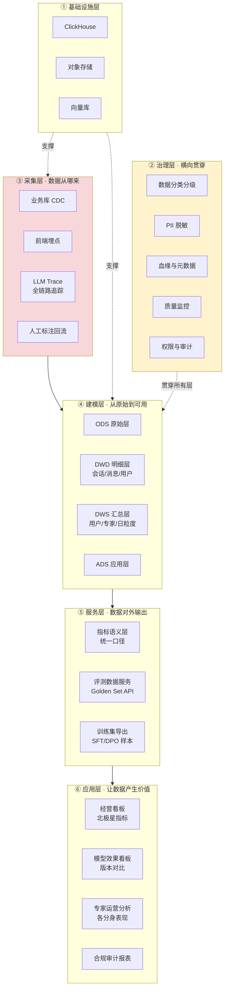

**这张图里有两个和传统数据架构不一样的地方，是 AI 原生公司的特殊性：**

**其一，采集层多了「LLM Trace」这一路，而且它是最重要的一路。** 传统互联网公司采集的是用户行为（点击、浏览、下单），AI 公司还必须采集**模型行为**——一次咨询背后可能有 5–20 次内部 LLM 调用、RAG 检索、路由决策。不采集这些，你就无法回答「为什么这次回答质量差」。这也是 2026 年 LLM 可观测性赛道爆发的原因（ClickHouse 于 2026 年 1 月以 4 亿美元估值收购 Langfuse，Cisco 收购 Galileo，Palo Alto 收购 Portkey）。

**其二，服务层多了「评测数据服务」和「训练集导出」。** 传统数仓的终点是 BI 报表，AI 公司的数仓还要**反哺模型训练**——Golden Set 要能被评测流水线调用，线上优质对话要能沉淀成 SFT 样本。这条回流链路做通了，数据团队就从「支撑部门」变成了「模型迭代的一环」。

> a16z 在《Big Ideas 2026》里的判断很适合引用：企业 AI 落地的瓶颈不是模型而是「**数据熵**」——80% 的企业知识以非结构化形式散落且从未被系统整理，这是 MIT《2025 企业 AI 状态报告》中 95% 的 AI 试点未产生可衡量 ROI 的根因。对点富来说，**咨询对话记录就是最大的未被资产化的数据熵源**。

### 7.4 三期路线图：什么阶段做什么

规划最容易犯的错是「什么都想要」。三期路线图的核心是**明确每期只解决一个主要矛盾**。

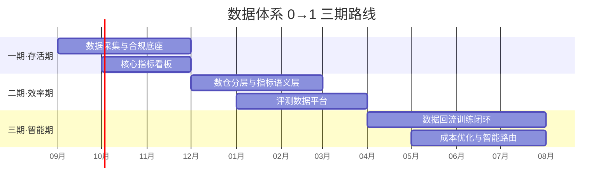

---

#### 一期 · 存活期（0–3 个月）：从「没有数据」到「有数据可看」

**主要矛盾**：公司现在做决策靠拍脑袋，因为根本没有可信的数据。

**核心目标**：让 CEO 每天早上能看到一张可信的经营看板。

**建什么**：

| 建设项 | 具体内容 | 为什么这期必须做 |
|--------|---------|----------------|
| **埋点体系** | 定义用户行为事件模型（注册/开启咨询/发送消息/结束会话/付费/续费），前端 SDK 接入 | 没埋点就没有一切，且**埋点数据无法补采**——今天不埋，历史就永远缺失 |
| **LLM Trace 接入** | Langfuse 自托管，全链路记录 prompt/检索/路由/耗时/成本 | 同上，且它是后续所有模型优化的数据基础 |
| **业务库同步** | 用户表、订单表、专家配置表 CDC 到分析库 | 让业务数据和行为数据可关联 |
| **合规底座** | 数据分类分级清单、PII 脱敏规则、留存期限策略、出境阻断 | **必须在建表第一天做**，事后补不上 |
| **核心指标看板** | 北极星指标 + 一级指标，Metabase 呈现 | 这是数据团队的「第一次亮相」，要一击必中 |

**不建什么**（同样重要）：不建数仓分层（数据量太小，直接查明细即可）、不建实时计算（T+1 足够）、不建标注平台（先用人工 Excel）、不做数据中台（四十人公司搞中台是笑话）。

**一期的关键交付物是一张看板**。为什么不是数仓、不是架构？因为**新负责人的前三个月必须建立信任**。一张让 CEO 每天主动打开的看板，比一份完美的架构文档有用一百倍。

**产出验收**：CEO 和产品负责人每天主动查看；关键决策会议开始引用看板数据而非主观判断。

---

#### 二期 · 效率期（3–9 个月）：从「有数据」到「数据可信、可复用」

**主要矛盾**：数据有了，但每个人算出来的数字不一样；分析师重复写 SQL；模型迭代没有客观标尺。

**建什么**：

| 建设项 | 具体内容 | 解决什么问题 |
|--------|---------|------------|
| **数仓分层** | dbt 建 ODS/DWD/DWS/ADS，会话、消息、用户、专家四大主题 | 消除重复计算，SQL 即代码可版本控制 |
| **指标语义层** | 统一口径定义（什么叫「活跃用户」「一次完整咨询」「满意」） | **消除口径打架**，这是数据可信的前提 |
| **数据质量监控** | dbt test + 关键指标环比告警 | 数据出错时先于业务方发现 |
| **评测数据平台** | Golden Set 管理、版本控制、评测任务调度、结果归档 | 让模型迭代有客观标尺（详见 [四、领域知识](#四领域知识数据构建评测体系与医疗合规)） |
| **标注流程** | Label Studio + 标注规范 + 一致性度量（Cohen's kappa） | 人工评测规模化 |
| **用户分层分析** | RFM、留存曲线、流失预警 | 从「看数」到「用数」 |

**这一期的重点是「指标语义层」，它是最容易被低估的一项。** 在四十人公司里，最常见的内耗是：产品说本月活跃 8000，运营说 6500，算法说 1.2 万——三个人对「活跃」的定义不同。这个问题不解决，所有分析都是空转。dbt 2026 年 6 月发布的 Fusion 引擎新增了「Agents Schema」标准，把指标定义、语义模型、血缘做成 AI Agent 可读的 SQL 表，这是分析工程向 AI 可消费数据基建演化的信号，值得跟进。

**产出验收**：全公司指标口径唯一；模型每次迭代都有评测报告；数据问题的平均发现时间从「业务方投诉」提前到「监控告警」。

---

#### 三期 · 智能期（9–18 个月）：从「数据可信」到「数据驱动业务」

**主要矛盾**：数据能看能算了，但它还没有直接产生钱。

**建什么**：

| 建设项 | 具体内容 | 直接价值 |
|--------|---------|---------|
| **数据回流训练闭环** | 线上优质对话 → 自动筛选 → 人工复核 → SFT/DPO 样本库 | 让产品越用越好，形成数据飞轮 |
| **模型成本优化** | 基于评测数据的智能路由（简单问题走平价模型） | **直接省钱，最容易证明 ROI** |
| **用户增长分析** | 渠道归因、LTV/CAC 测算、流失干预实验 | 支撑增长决策 |
| **专家运营分析** | 各专家分身的满意度、复购、留存对比 | 支撑「下一个签哪位专家」的战略决策 |
| **A/B 实验平台** | 轻量级分流 + 统计显著性检验 | 让优化有据可依 |

**「数据飞轮」是这一期的战略意义所在**。前两期数据团队是成本中心，到这一期才真正变成增长引擎：用户用得越多 → 对话数据越多 → 筛选出的优质样本越多 → 模型越像专家 → 用户越满意 → 用得更多。**能不能把这个飞轮转起来，决定了数据团队在这家公司的天花板。**

### 7.5 技术选型：三人团队的务实方案

选型的第一原则是**匹配约束而非追求先进**。基于 7.2 的测算（数据量 TB 级、团队 1–3 人、月预算数千元），推荐组合如下：

| 层次 | 选型 | 理由 | 被否决的方案与原因 |
|------|------|------|-----------------|
| **存储/计算** | ClickHouse（云托管起步） | 成本约为 Snowflake 的 1/4，查询快 3–5 倍；Anthropic/OpenAI 都用它处理 PB 级推理日志；2025 年 ARR 增长超 250% | ❌ Hive/Spark：TB 级用不上，运维重<br/>❌ Snowflake/Databricks：最低承诺成本对小团队是浪费<br/>⚠️ DuckDB：起步够用但难支撑多人并发 |
| **数据集成** | Airbyte 自托管 / 简单自研脚本 | 开源免授权费；数据源少时自研脚本更可控 | ❌ Fivetran：按行计费，成本不可控 |
| **转换建模** | dbt Core | 免费；SQL 即代码，版本控制+测试+血缘一体 | ❌ 自研调度 SQL：等于重造 dbt |
| **编排** | Dagster | 资产化思维比 Airflow 的任务化思维更适合小团队，学习曲线平 | ⚠️ Airflow：功能强但运维和心智负担重 |
| **BI** | Metabase 自托管 | 开源；业务方自助查询门槛低 | ⚠️ Superset：功能更强但配置复杂<br/>❌ Tableau/PowerBI：许可费不划算 |
| **LLM 可观测** | Langfuse 自托管 | 开源免费；已被 ClickHouse 收购成事实标准；v3 需 Postgres+ClickHouse+Redis+MinIO，4GB 内存起步 | ⚠️ Braintrust：商业版功能好但要钱<br/>⚠️ LangSmith：与 LangChain 绑定 |
| **埋点** | PostHog 自托管 | 开源；产品分析+埋点+回放一体 | ⚠️ 神策/GrowingIO：商业版对早期公司偏贵 |
| **标注** | Label Studio | 开源；支持对话标注 | — |

**整体成本量级**：基础设施每月约 ¥2000–5000；人力是大头（参照点富自己的 JD，资深数据开发 35K–65K/月）。**三个月一期建设总投入（含人力）约 80–150 万元。**

**关于 DCMM 的一个判断**：国标 DCMM 2.0（GB/T 36073-2025，2026 年 7 月 1 日施行）把能力域扩到 9 个、指标扩到 486 项，全国已有超万家企业贯标。但对四十人公司，**贯标本身不是当前任务**。正确姿势是借用它的九大能力域作为**检查清单**，只做 L1→L2（数据可用、可信、有基本权责），不追求 L3 以上的量化管理。**能说清"什么不该做"，比能背出九大能力域更能体现判断力。**

### 7.6 效果评估：怎么证明数据建设值这个钱

这是数据负责人最容易被问倒、也最能体现段位的地方。Gartner 2026 年的调研很扎心：**仅 11% 的 CFO 认为 2025 年从 AI 投入中获得了实际财务回报，仅 8% 的中国企业通过 AI 实现了营收增长**。这提示数据团队汇报 ROI 时要极度谨慎，避免过度承诺。

我的做法是分三层，**越往下越可量化，向上汇报时从下往上讲**。

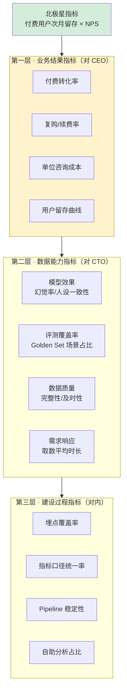

**北极星指标为什么选「付费用户次月留存 × NPS」而不是 GMV？**

这是个值得展开的判断。医疗健康咨询产品有其特殊性：**过度追求付费转化本身有声誉风险和合规风险**。如果北极星是 GMV，团队会不自觉地往「诱导付费」方向优化，而这在医疗场景下是危险的——用户是带着真实困扰来的，被过度营销会造成信任崩塌，严重的还可能触碰「不得违规替代医师诊疗」的红线。

用「次月留存 × NPS」的好处是它天然对齐**长期价值**：用户愿意回来、愿意推荐，说明咨询真的有用。这个指标涨不上去，说明产品价值没跑通，这时候堆增长只会加速死亡。

**医疗健康类产品还应补充三个特殊指标**（这是与普通 toC 产品的关键差异）：

- **信任度**：专家人设一致性评分、用户主动复述咨询建议的比例
- **依从性**：用户是否按 AI 建议执行（复诊提醒打开率、健康任务完成率）
- **安全性**：风险识别召回率、越界诊断率（后者目标为 0）

**ROI 怎么算**——三种可量化的证明方式，按说服力排序：

**其一，直接成本节约（最硬）**。前面 7.2 算过：通过评测证明「简单咨询用平价模型效果无差异」，B 档规模下每月可省数千到万元级的 API 成本，一年就是数据基础设施投入的十倍。这个账 CFO 一听就懂。

**其二，风险规避（最容易被忽视但分量最重）**。合规体系的价值不在于产生收入，而在于**避免灾难**。参照 2026 年上海某科技公司高管因数据出境被追刑责的案例，以及医疗 AI「不得替代诊疗」的红线——一次合规事故对早期公司可能是致命的。把这个讲清楚，数据治理的预算就不难批。

**其三，效率提升（最常用但最虚）**。「取数响应从 3 天缩短到 2 小时」这类叙事要谨慎使用，因为它容易被质疑「本来就该这样」。更好的表述是折算成人力：「原本需要 2 个分析师全职取数，现在业务方 70% 自助，释放 1.4 个人力」。

> **一个反面教训**：业界公认数据团队最失败的汇报方式是罗列 Output（做了多少需求、系统多稳定）。正确姿势是锚定 Outcome（收入增长、成本降低、风险规避）。季度 OKR 要绑定业务北极星的**解释力**，比如「通过流失预警模型减少 X% 的次月流失」，而不是「完成 Y 个数据需求」。

### 7.7 团队搭建与协作：一个人怎么撬动一家公司

**人员规划**。行业经验值：30–100 人的 AI 创业公司，数据团队通常占 5%–10%，即 2–8 人；算法:工程:数据:产品的常见配比约 3:4:1:1 或 3:3:2:1。对点富的建议节奏：

| 阶段 | 团队配置 | 招人的判断依据 |
|------|---------|--------------|
| 一期（0–3 月） | 1 人（你自己）+ 借调 1 名后端 | 先证明价值再要人 |
| 二期（3–9 月） | 2–3 人（+1 数据工程 +1 分析/评测） | 看板被高频使用、评测需求排队时 |
| 三期（9–18 月） | 3–5 人（+标注管理 +算法工程） | 数据飞轮跑通、需要规模化时 |

**第一个人该招什么样的？** 不是招最强的数据工程师，而是招**能独立承接业务方需求的分析型工程师**。早期公司最缺的不是把 pipeline 写得多优雅，而是有人能听懂业务方的模糊需求、自己找数据、给出结论。

**跨团队协作的三条边界**（这是负责人必须提前划清的）：

**与算法团队**：数据团队负责「**评测标尺和数据供给**」，算法团队负责「**模型训练和调优**」。分界线是——评测结论由数据团队出具且算法团队不能自评，训练配方由算法团队决定但数据配比要有评测依据。这条边界如果模糊，最后要么变成算法自己既当运动员又当裁判，要么数据团队沦为纯粹的取数工具人。

**与产品团队**：数据团队负责「**指标定义和实验设计**」，产品团队负责「**需求判断和优先级**」。关键是指标口径的**最终解释权归数据团队**，否则会出现「哪个数字好看用哪个」。

**与合规/法务**：数据团队负责「**技术落地**」，法务负责「**边界判定**」。数据分类分级方案要经过法务确认后再实施。

**向上汇报的节奏**：周报讲进展和阻塞（对直属上级），月报讲指标变化和洞察（对 CTO/产品负责人），季度讲 ROI 和下季规划（对 CEO）。**关键是月报里必须有至少一条"业务方不知道的洞察"**——这是数据团队持续获得资源的根本。

### 7.8 风险清单：这份规划可能在哪里翻车

一个成熟的规划必须包含它自己的失败模式。这部分在面试中主动讲出来，比讲一百条建设内容更能体现资深度。

| 风险 | 触发条件 | 应对预案 |
|------|---------|---------|
| **业务没跑通，数据建设失去意义** | PMF 未验证，用户量长期停在几千 | 一期投入压到最小，用 SaaS 而非自建；**做好随时收缩的准备** |
| **合规踩线导致业务停摆** | 未备案、数据出境、越界诊断 | 合规前置；主动推动算法备案；建立红线监控告警 |
| **数据团队沦为取数机器** | 需求全是「帮我导个数」，无人关心洞察 | 强制在月报中输出主动洞察；推自助分析降低取数需求 |
| **评测结论无人采纳** | 算法团队按自己节奏迭代，评测报告归档吃灰 | 争取把评测设为**上线门禁**（CI 硬指标），而非参考意见 |
| **母公司资金收紧** | 灵均规模下滑传导（已跌入第二梯队） | 保持技术栈轻量可迁移；避免长期合约锁定 |
| **过度工程** | 团队膨胀后倾向建大平台 | 用 7.1 的三条原则做决策 checklist |

**最大的风险其实是第一条**。这也是为什么一期要压到最小投入——在一家 PMF 尚未完全验证的公司做数据建设，**最重要的美德是克制**。

### 7.9 这份规划怎么用在面试里

不要背诵。面试时能自然带出以下四个点，就足以证明视野：

**第一，先问约束再给方案。** 被问到「你会怎么做数据建设」时，不要直接讲架构。先反问：「现在有多少 DAU？数据团队几个人？有没有埋点？合规备案什么状态？」——**这个动作本身就是资深度的证明**，因为它说明你知道方案要匹配约束。

**第二，敢说什么不做。** 「四十人公司不该建数据中台」「TB 级数据不需要 Spark」「DCMM 贯标现在不是重点」——**能划出边界比能罗列技术栈更难，也更值钱**。

**第三，把 ROI 讲成钱。** 「通过评测优化模型路由，一年能省下的 API 成本是数据基础设施投入的十倍」比「提升数据质量」有力得多。

**第四，主动讲风险。** 「这份规划最大的风险是业务本身没跑通，所以一期我会把投入压到最小」——**主动暴露风险不会显得没信心，反而显得可靠**。

---

---

## 八、赛道标尺：同规模公司怎么做出成绩的

第七部分回答了「数据体系怎么搭」，但还有一个更前置的问题没回答：**点富这个规模的公司，在垂类对话智能体这条赛道上，到底该怎么做才可能做出成绩？**

这个问题决定了数据和评测工作的**根本定位**——如果公司要自训模型，数据团队的核心任务是喂训练集；如果走 SOTA API + 知识接入路线，核心任务就变成了知识工程和评测体系。**方向错了，后面所有努力都是错的。**

所以这一部分做三件事：建立国内外标杆的参照系、搞清业界主流研发模式、量化资源门槛。

### 8.1 结论先行：业界答案已经收敛

> **在 SOTA 模型上做应用层的知识接入 + 检索 + 编排，而不是自训/微调中小模型。**

这不是我的观点，是 2025–2026 年业界用真金白银投出来的答案。三条硬证据：

**证据一：估值 53 亿美元的医疗 AI 独角兽，底座是别人的 API。** Abridge（医疗对话记录，ARR 超 1 亿美元，服务 150+ 医疗机构）出现在 OpenAI 2025 年 10 月公布的「万亿 Tokens 级 API 客户名单」**前十位**。国内券商文章曾以此攻击它「仅仅依靠 OpenAI 提供的技术基座」——但这恰恰反证了这条路线的商业有效性。

**证据二：头部垂类 Agent 公司清一色构建在第三方 SOTA 之上。** Sierra（客服 Agent，Bret Taylor 创办，估值 158 亿美元，8 个季度做到 ARR 1.5 亿）、Harvey（法律，两年 ARR 3000 万，OpenAI 天使轮投资）、Robin AI（用 Claude）。Altman 在 2026 年 1 月公开点名 Perplexity 与 Harvey 为 API 标杆客户。

**证据三（最有说服力的反向证据）：自研基座在最强团队手里都没撑住。** Character.AI 是极少数真正自研基座的对话公司，创始人 Noam Shazeer 是 Transformer 论文作者。结局是 2024 年 8 月 Google 以约 25 亿美元「反向收购」，创始人带走约 30 名模型/语音训练人员，**剩下约 130 人改用 Meta Llama 3.1 等开源模型替代自研模型**。

同类结局还有一串：微软 6.5 亿美元买 Inflection 的授权和团队，亚马逊 4.39 亿买 Adept。**共同点是都自研基座、都烧钱、都没跑通 C 端付费。**

### 8.2 唯一的重要例外，以及它的边界条件

有一个反例必须知道，因为它划出了「什么情况下才值得自训」的边界。

**Hippocratic AI**（医疗健康对话，估值 35 亿美元，2025 年 11 月 C 轮 1.26 亿，累计融资超 4 亿美元）走的是自训路线。其 Polaris 系统（arXiv:2403.13313）采用「**星座架构**」——总量 1 万亿参数，由多个数十亿参数的 LLM 作为协作 Agent 组成，用专有数据训练。论文报告专科支持 Agent 在任务评测上**显著优于 GPT-4 和 LLaMA-2 70B**，并组织了 **1100+ 名美国执业护士、130+ 名执业医师**做端到端评估。

**但它的边界条件极其明确，四条缺一不可**：

| 条件 | Hippocratic 的情况 | 点富对照 |
|------|------------------|---------|
| **场景是实时语音多轮长对话** | 是（延迟敏感，API 大模型扛不住） | ❌ 目前是文字咨询 |
| **输出直接触及患者安全** | 是（幻觉=医疗事故，需多模型互相监督） | ⚠️ 只能建议不能诊断，风险低一档 |
| **有足够的钱** | 累计融资 **4 亿美元** | ❌ 实缴 5000 万人民币，差两个数量级 |
| **训练目标是行为对齐而非知识** | 是（rapport building、共情、bedside manner） | ⚠️ 这一条部分成立 |

最后一条值得展开：Hippocratic 训练的**不是「知识」而是「说话方式」**——建立信任感、共情、床边礼仪，这类东西恰恰是 RAG 无法注入的。这也正是「专家智能真身」唯一可能需要微调的地方。

**但注意程度差异**：让模型「像杨凤池教授一样说话」，用少量 SFT 或 LoRA 就能达到，成本千元级（见 8.4）；而 Hippocratic 那种级别的行为对齐需要 4 亿美元。**两者不是一回事。**

### 8.3 决策标准：什么该用什么手段

业界已形成清晰的决策树，可以直接套用：

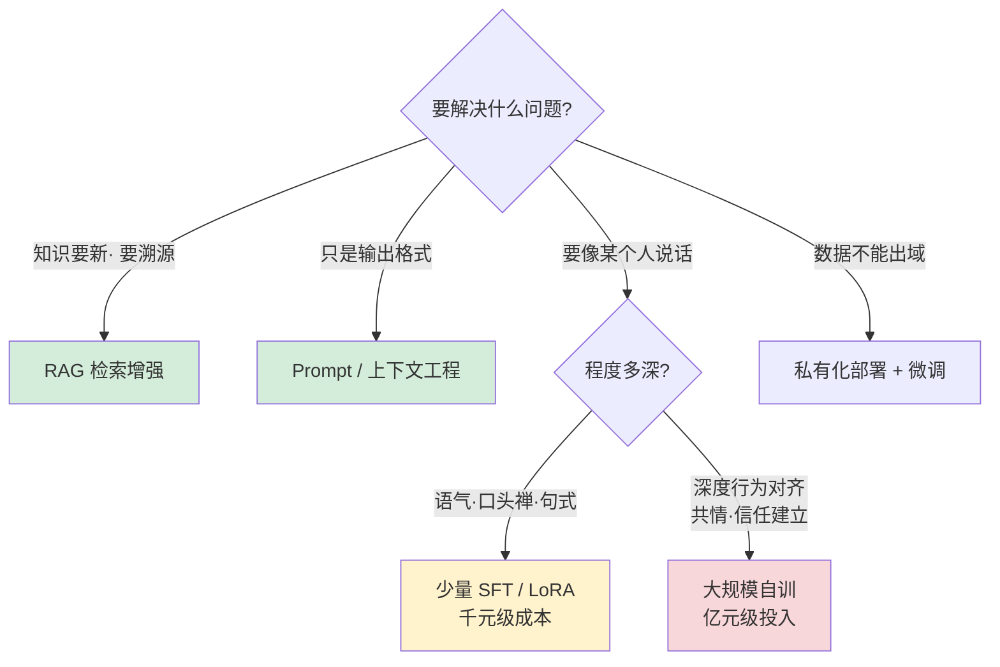

**套到点富身上，结论很明确**：

| 需求 | 手段 | 适用性判断 |
|------|------|-----------|
| 专家观点、文献、临床指南要能更新和溯源 | **RAG** | ✅ 主战场 |
| 规范输出格式、约束边界（不诊断） | **Prompt 工程 + 规则** | ✅ |
| 让模型像这位专家一样说话 | **少量 SFT / LoRA** | ⚠️ 唯一需要微调的点 |
| 自训基座模型 | — | ❌ 钱和场景都不支持 |

> **一句话概括**：**「专家智能真身」的核心壁垒是专家的知识资产与人格化授权，不是模型权重。** 知识用 RAG，风格用轻量微调，基座直接用最好的。

### 8.4 资源门槛的量化：微调已经不是门槛了

一个反直觉但重要的事实——**微调的技术门槛在 2023 到 2026 年之间断崖式下降**：

| 时间 | 微调 7B 模型的成本 |
|------|------------------|
| **2023** | 全参微调需约 80GB 显存，A100 集群跑 3–5 天，云账单 **8–12 万元** |
| **2026** | QLoRA + 梯度检查点，显存压到 16–24GB，**单张 RTX 4090 跑 2–4 小时，成本 800–1500 元** |

LoRA 微调 7B 仅需 3–5GB 显存，单卡 A100 40GB 绰绰有余；数据量超 10 万条时才需要 4 卡并行。

> **这个数字变化的含义**：**微调与否已经不是资源约束下的被迫选择，而是产品判断。** 真正的成本不在算力，而在**高质量数据标注与评测体系**——也就是这个岗位的工作内容。这一点在面试中说出来，能直接体现你对成本结构的理解。

**人员配比参照**（这组数字对判断点富的团队够不够用很有价值）：

| 公司 | 人数 | 支撑的业务体量 | 技术路线 |
|------|------|--------------|---------|
| **MiniMax** | 385 人 | 2.12 亿用户、200+ 国家，累计研发投入 5 亿美元 | **自研全模态基座** |
| **Character.AI** | 约 130–140 人（被收购时） | — | 自研 → 转 Llama 3.1，其中仅约 30 人做模型训练 |
| **点富** | 39–120 人 | 近万测试用户 | 应用层 |

**解读**：385 人自研基座（MiniMax）、约 30 人做模型训练（C.AI）——**点富 40–120 人做应用层是充足的，但若照搬自训路线则严重不足。**

**数据量参照**：Robin AI 用 200 万份合同库做微调；镜象科技深度学习「千万级真实用户案例」；而应用层 RAG 起步只需**数千到数万条高质量专家对话 + 专业文档**即可跑通。

### 8.5 标杆公司速查表

面试时能报出这些数字，是行业认知深度的直接体现。

**国外**

| 公司 | 赛道 | 估值/融资 | 收入/用户 | 技术路线 |
|------|------|----------|----------|---------|
| **Sierra** | 客服 Agent | $158 亿 / 累计 $9.5 亿+ | ARR $1.5 亿（8 季度） | SOTA + 编排层 |
| **Abridge** | 医疗记录 | $53 亿 / 累计 $7.6 亿 | ARR > $1 亿，150+ 机构 | **OpenAI API**（Top10 客户）+ 自研 ASR |
| **Hippocratic AI** | 医疗对话 | $35 亿 / 累计 > $4 亿 | — | **自训 Polaris 星座架构** |
| **Harvey** | 法律 | 早期 $15 亿→更高 | 两年 ARR $3000 万 | OpenAI 基座 + 微调 |
| **Slingshot AI (Ash)** | 心理健康 | A 轮 $9300 万 / 累计 $1.23 亿 | — | 与 100+ 治疗师共创，a16z 领投 |
| **Character.AI** | 角色对话 | 被 Google $25 亿收编 | — | 自研 → **转 Llama 3.1** |

**国内**

| 公司 | 赛道 | 规模 | 技术路线与亮点 |
|------|------|------|--------------|
| **MiniMax** | 角色对话 | 385 人，港股市值 800 亿港元 | 自研 M2/Speech-02，Talkie/星野 1.47 亿用户，海外收入 > 70% |
| **医联 MedGPT** | 医疗 | 累计融资 60 余亿，估值 285 亿 | 60+ 病种 |
| **左手医生** | 医疗 | — | 自研 Transformer 架构左医 GPT |
| **镜象科技** | 心理健康 | A 轮数千万（凯普生物领投） | 情感大脑 M1，NMPA 认证 |
| **云知声** | 医疗 | 港股 9678.HK | 自研山海医疗大模型，MedBench 93.1 分 |

> **镜象科技有一个数据是点富最直接的效果对标**：**AI 心理师对轻度抑郁的有效率 71%，人工咨询师 74%**。这个「AI 接近但略低于真人」的量化结论，是评测体系设计时最有价值的参照基准——它告诉你目标应该定在哪里。

### 8.6 失败案例：钱是怎么烧没的

三个失败案例的教训对点富都有直接警示，而且**失败原因都不是技术**。

**Babylon Health（破产清零）**。营收从 2018 年 800 万美元涨到 2022 年 11.1 亿美元，仍然崩盘。真因是商业模式：营收 92.5% 来自 Value-Based Care（承担医疗风险），控费能力跟不上导致赔付成本失控；叠加 SPAC 上市后股价跌破 1 美元、AlbaCore 3 亿美元贷款年息从 8% 跳到 12%（每年利息约 3000 万美元）拖垮现金流。

> **警示**：靠「AI 问诊」本身（软件许可 + 问诊费）**始终无法创造规模化收入**，被迫转向重资产模式反而致命。

**IBM Watson Health（10 亿美元贱卖）**。年收入 10 亿但从不盈利。失败原因是**营销跑在科技前面**——在缺乏临床证据前就宣称癌症诊疗重大突破；训练数据非真实患者数据，曾给严重出血患者开出致出血药物。

> **警示**：**专家背书不能替代真实数据与临床验证。** 这一条对点富尤其刺耳——它的核心卖点正是专家背书。

**Inflection / Character.AI / Adept（团队被挖空）**。共同点是自研基座、烧钱、C 端付费没跑通。

> **对点富的启示是反向的**：不自研基座，反而避开了这个陷阱。

### 8.7 三条战略判断（可直接用于面试）

综合上面的调研，如果我是点富的数据/技术负责人，会给出这三条判断：

**其一，技术路线：SOTA API（或国产大模型）+ 专家知识 RAG + 严格评测体系。把预算投在评测集与安全护栏，而非训练集群。** 参照 Hippocratic 的做法——即便是自训路线，它也组织了 1100+ 名执业护士做盲评。点富至少应建立专家审核回路。

**其二，保留两个微调窗口，但都不是自训基座。** 一是专家人格化语气（LoRA 即可，千元级）；二是若未来做实时语音，延迟与成本会倒逼小模型自持——这是 Hippocratic 选择自训的核心原因，值得提前评估。

**其三，商业模式风险高于技术风险。** Babylon 的教训是收入结构而非模型。C 端付费咨询要尽早验证复购与 LTV；同时医疗心理属强监管，镜象拿 NMPA 认证、做教育部热线合作的路径值得参考——**资质本身就是壁垒**。

> **最需要警惕的一条**：Sierra 按 100 倍 ARR 估值时，已有分析指出这批公司跑的其实是「**埃森哲曲线**」而非 SaaS 曲线——**成本随规模上涨**。点富做专家数字化，人工审核与专家分成会随用户增长线性上升，**必须在早期就设计好边际成本收敛路径**。
>
> 这一条如果在面试中提出来，基本可以确认你不只是个技术执行者。

### 8.8 这部分怎么用在面试里

**如果被问「你觉得我们该自己训模型还是用 API」**——不要直接站队，先讲决策标准（8.3 的决策树），再给判断：知识用 RAG、风格用 LoRA、基座用最好的；然后主动提 Hippocratic 这个例外和它的四个边界条件，说明你知道什么情况下判断会反转。

**如果被问「你怎么看我们的竞争壁垒」**——核心观点是「壁垒是专家的知识资产与人格化授权，不是模型权重」。顺势可以问出授权范围（呼应「一、点富尽调」核验出的「专家个人合作 ≠ 机构战略合作」）。

**如果想主动展示深度**——抛出边际成本那条：「Sierra 这类公司被质疑跑的是埃森哲曲线而非 SaaS 曲线，专家分身如果人工审核和专家分成随用户线性增长，规模化反而会压缩毛利，这个收敛路径你们怎么设计的？」

---

---

## 九、产品视角：「点点专家」的定位困境与破局路径

JD 里那句「**连接数据-模型-产品的关键角色**」，前面八部分回答了「数据」和「模型」，这一部分回答「产品」。

而且这是最能证明你不只是技术执行者的一部分——**能对雇主的产品提出有数据支撑的批判性判断，是区分「工程师」和「合伙人型员工」的分水岭。**

### 9.1 先说结论：一个结构性矛盾

点富的核心产品「点点专家」是三甲名医（首医大杨凤池教授）的 AI 数字分身。这个定位存在一个**自我拧巴的矛盾**：

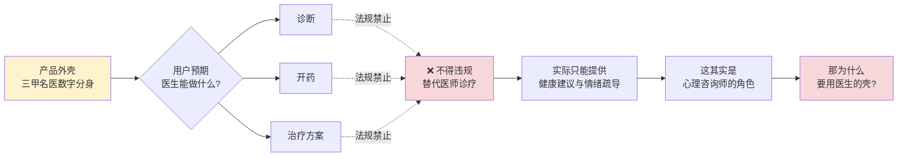

**用医生的外壳，做咨询师的事，却承担医生的合规约束和用户预期落差。** 三头不讨好：

- 对用户：顶着「三甲名医」的招牌，却不能给你确诊、不能开药——**预期落差**
- 对监管：越像医生，合规压力越大——**风险溢价**
- 对商业：金字塔尖的定位，天然限制了用户规模——**市场天花板**

### 9.2 用数据验证：市场到底在哪一层

上面的批判如果只停留在「感觉不对」，那是拍脑袋。**产品判断必须用数据说话。** 下面这组数字来自 Lancet Psychiatry、中科院心理所、WHO 等权威信源。

#### 第一层：有心理困扰的人有多少

| 指标 | 数字 | 信源 |
|------|------|------|
| 成人精神障碍**终生患病率** | **16.57%**，约 1.8 亿人 | CMHS，黄悦勤团队，*Lancet Psychiatry* 2019 |
| 抑郁障碍终生患病率 | 6.8%（抑郁症单相 3.4%，约 9500 万人） | 同上 |
| 焦虑障碍 12 月患病率 | 4.98%（各类最高） | 同上 |
| 中国精神障碍患者总数 | 约 **1.91 亿** | Lancet GBD 2023 |
| 成年人心理问题检出率 | **37.2%**，心理亚健康人群超 1.9 亿 | 行业报告 2026 |
| 青少年存在不同程度心理问题 | **34.3%**，主动求助比例**不足 5%** | 《青少年心理健康蓝皮书》，中科院心理所 2025 |

#### 第二层：其中有多少人真的去了医院

**这是整个论证最关键的一组数字**：

| 指标 | 数字 | 信源 |
|------|------|------|
| 抑郁障碍患者**接受过治疗**的比例 | **仅 9.5%** | CMHS，*Lancet Psychiatry* 2019 |
| **充分治疗率** | **仅 0.5%** | 同上 |
| 精神疾病患者**未接受治疗**的比例 | 约 **92%** | 北京安定医院参与的国际研究 |
| 抑郁症识别率 | **不到 20%** | 《中国国民心理健康发展报告》 |
| 全国精神科医生 | 仅 **6.4 万人**（每 10 万人不足 4 名） | 官方统计 |
| 心理咨询师人才缺口 | **430 万** | 中国心理学会 2024 |

**结论已经很清楚了**：

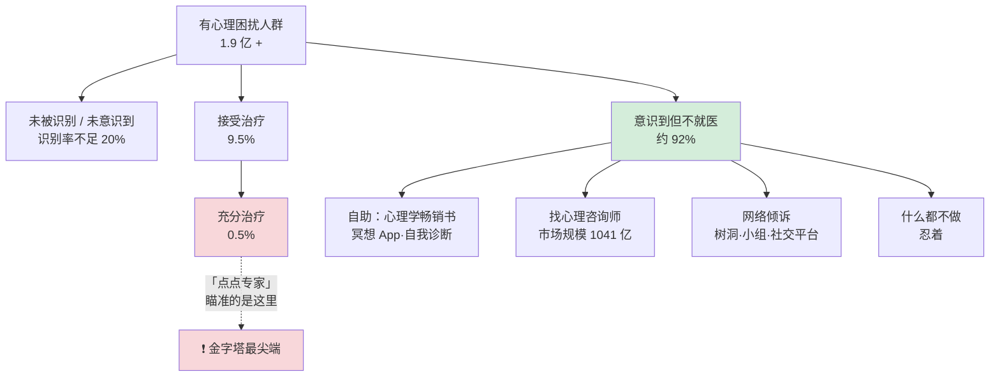

**「三甲名医数字分身」对标的是那 0.5%–9.5%，而 92% 的人在下面。**

#### 第三层：那 92% 的人在哪里、在做什么

| 替代性求助渠道 | 规模 | 信源 |
|--------------|------|------|
| 心理咨询市场 | 2025 年 **1041.5 亿元**，线上占 40% | 行业报告 2026 |
| 心理健康服务总市场 | 2024 年 **2024.8 亿元**，CAGR 18.12% | 同上 |
| 网络树洞 | 微博 @走饭 遗言下累计**近 200 万条**留言，每月新增数千条；类似树洞数千个 | 树洞救援团，黄智生 |
| 小红书情绪类内容 | #拒绝容貌焦虑 互动 10 亿+、#亲子关系 16 亿+；**焦虑相关商业笔记同比 +112%** | 千瓜数据 2025 |
| 睡眠障碍人群 | 超 **3 亿人** | 中国睡眠研究会 |

**还有一个数据直接说明需求已经在向 AI 迁移**：复旦发展研究院报告显示，**13.5% 的青年网民向 AI 虚拟人倾诉心事，高于向父母亲人倾诉的 10.4%**；超七成大学生把 AI 当作可聊天对象，过半经常或偶尔向 AI 倾诉私密心事。

> **假设链验证结果：完全成立，且有顶级信源支撑。**
>
> 「大部分人有心理困扰、只有极少数去三甲、多数靠自助或咨询师」——每一环都有 Lancet 级别的数据。产品定位过窄的判断是**成立的**。

### 9.3 ⚠️ 但是：一个 2026 年 7 月刚生效的新法改变了答案

到这里为止，很自然的结论是「应该从医疗级下沉到陪伴级，去覆盖那 92%」。

**这个方向在 2026 年 7 月 15 日之后不成立了。**

**《人工智能拟人化互动服务管理暂行办法》**（网信办、发改委、工信部、公安部、市监总局五部门联合发布，2026 年 4 月 10 日公布，**7 月 15 日施行**）——全球首部国家级 AI 情感陪伴专门立法。

**适用判定（第二条）**：「模拟自然人人格特征、思维模式和沟通风格的**持续性的情感互动服务**」。智能客服、**知识问答**、学习教育不适用。

这条判定有两个反直觉的推论：

**推论一：改名字逃不掉。** 判定标准是「持续性情感互动」这个**行为特征**，不是自称什么职业。所以「AI 心理咨询师」「知心姐姐」「心灵陪伴」——**全部落入监管，而且比「专家知识问答」更严格**。

**推论二：陪伴变现的商业模型本身违法。** 这是最致命的：

| 条款 | 规定 | 对「免费陪伴→付费转化」的影响 |
|------|------|---------------------------|
| 第八条(五) | 不得「过度迎合用户、**诱导情感依赖或者沉迷**，损害用户真实人际关系」 | **经典漏斗被直接禁止** |
| 第十条 | 不得将「替代社会交往、控制用户心理、诱导沉迷依赖」作为服务目标 | 商业模式层面禁止，非话术层面 |
| 第八条(六) | 不得「通过**情感操纵**等方式，诱导用户作出不合理决策」 | 情绪脆弱时刻推付费=高风险 |
| 第十三条 | 发现极端情绪须安抚引导；发现自残自杀威胁须干预并**联络监护人/紧急联系人** | **强制义务**，需 7×24 人工介入 |
| 第十二条 | 注册须提供年龄、监护人或紧急联系人 | **与匿名倾诉直接冲突**——而匿名正是「不愿去医院」人群的核心诉求 |
| 第十六条 | 敏感个人信息交互数据**不得用于模型训练**（除非单独同意） | **数据飞轮受限** |
| 第二十二条 | 注册用户 100 万或月活 10 万即须省级网信安全评估 | 规模化即触发 |
| 第三十条 | 罚款 1–10 万；涉及危害生命健康且有后果的 10–20 万，**并可责令停止服务** | 停服是致命的 |

**关于「主动识别网络上的抑郁倾向用户并触达」这条路**——技术上可行（树洞机器人第六代准确率 82%），但**商业上违法**：

1. 推断出的心理状态构成**新生成的敏感个人信息**，无同意基础（个保法要求单独同意）
2. 商业目的不适用「公共利益/紧急情况」豁免
3. 21 号令第八条(六) 明确禁止利用情绪弱势诱导决策

> **公益可以，商业不行。** 树洞救援团（黄智生，900+ 志愿者含 300+ 精神科专家，5 年阻止轻生 6000+ 次）能做，是因为它**非营利、无变现、有专业人员兜底**。

**国际上同向收紧**：美国伊利诺伊州 2025 年 8 月立法**全面禁止 AI 提供心理健康咨询**，内华达、新泽西、加州跟进；加州 SB 243 于 2026 年 1 月生效；Character.AI 面临多起青少年自杀诉讼（14 岁 Sewell Setzer III、13 岁 Juliana Peralta），Google 被列共同被告；FTC 2025 年 9 月向七家公司发出 6(b) 调查令。

**国内已在执法**：网信办 2026 年 4 月「清朗·整治 AI 应用乱象」专项，处置违规 AI 产品 1.4 万余款、账号 2.6 万余个，EchoMe、筑梦岛等虚拟伴侣 App 被点名。

### 9.4 竞品全景：这条路上谁活着、谁死了

判断出路之前，先看别人的结局。

**第一层 · 医疗级（临床治疗，需监管资质）**

| 公司 | 状态 | 关键事实 |
|------|------|---------|
| **Woebot Health** | ⚠️ **2025 年关闭消费者端** | 融资超 1.23 亿美元；规则式 CBT 被生成式 AI 淘汰，FDA 审批成本过高，B 端采购寥寥 |
| **Pear Therapeutics** | ❌ **破产** | 处方数字疗法规模化失败——需医生逐个开处方，地推效率极低，保险覆盖有限 |
| **Akili** | ⚠️ 放弃处方模式 | 同样困境 |
| **望里科技（中国）** | ✅ **里程碑** | 2025-12 拿下国内**首个精神领域三类医疗器械证**（抗抑郁 iCBT），被 2025 版《中国抑郁障碍防治指南》推荐为 **1A 级**，院内有专门支付条目，2026-03 获数千万元 B+ 轮 |
| **深圳健成星云** | ✅ 合规先行 | PsyLLM 是**首个通过国家生成式 AI 备案的心理健康垂直大模型**，PsyEval3 得分 89.9 全球第一，AAAI-26 收录；客户 600+，清一色政企国企 |

**第二层 · 咨询级（咨询师撮合 + AI 辅助）**

| 公司 | 状态 | 关键事实 |
|------|------|---------|
| **BetterHelp** | ⚠️ 收入连续下滑 | 同比 -9% |
| **壹心理（中国）** | ✅ **唯一跑通的样本** | 2026 年营收 3 亿+，注册 5300 万，累计服务 400 万人次；**但它是 To B EAP 起家 + 14 年内容沉淀（11 个公众号矩阵）**，本质内容驱动而非投放驱动 |
| **Spring Health / Lyra** | ✅ B 端验证 | Spring Health 估值 20 亿+，靠雇主保险 |

**第三层 · 自助陪伴级**

| 产品 | 状态 | 关键事实 |
|------|------|---------|
| **Calm / Headspace** | ⚠️ 大幅衰退 | 会话量同比 -26.4% / -60.3%（Apptopia）；Calm 美国健康类下载排名从第 1 跌至第 16 |
| **网易「妙时」** | ❌ **2026-07-14 全功能关停** | 大厂带流量带资金也做不下去 |
| **AI 陪伴产品** | ⚠️ 续费率仅 32% | — |
| **Slingshot AI（Ash）** | 🔥 2025 最受关注 | A 轮 9300 万美元（a16z 领投），累计 1.23 亿；**自训心理健康基础模型**（非 API），访谈 100+ 治疗师积累专业判断数据 |

**第四层 · 专家 IP 数字化（点富的直接形态）**

> **调研结论：国外没有「专家 AI 数字分身」在心理健康领域成功的案例。**
>
> Slingshot AI 明确选择做**通用心理 AI 模型**而非复刻特定专家。点富处在一个**缺乏成功参照物**的位置。

**点富面临的三重夹击**：

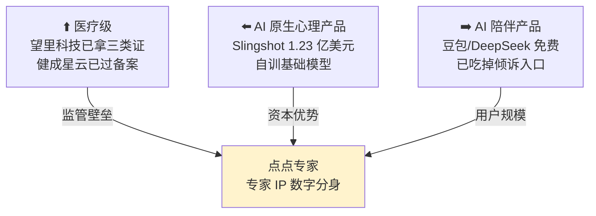

**最刺眼的一条**：通用大模型（豆包、DeepSeek）已经免费提供「倾诉」能力，13.5% 的青年网民已经在向 AI 倾诉。**如果点富只做倾诉，护城河为零，还要独自承担 21 号令的合规成本。**

### 9.5 破局路径：不是扩人群，是换付费方

综合以上，我的判断是——**产品定位过窄的诊断是对的，但「下沉到陪伴级去覆盖 92%」这个药方在 2026 年 7 月之后失效了。**

真正的出路是**换一个维度**：

> **窄定位不是问题，付费方错了才是问题。**

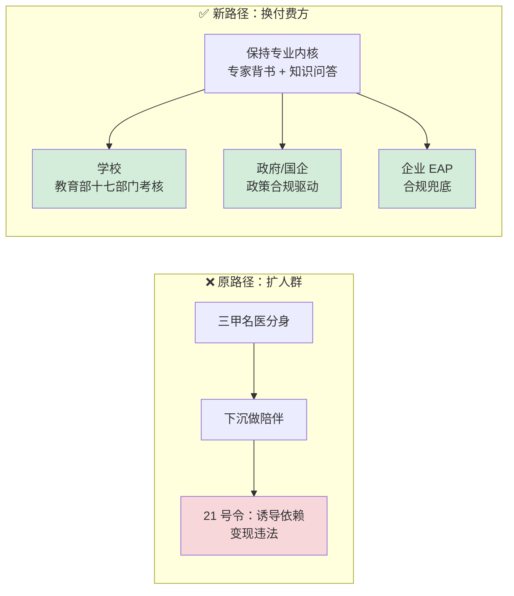

**为什么 B 端能绕开红线**：付费方 ≠ 使用方，决策逻辑是「合规兜底」而非「用户依赖」，**天然规避了「诱导情感依赖变现」这条禁令**——因为你不靠用户依赖赚钱。

**三条 B 端路径按可行性排序**：

| 路径 | 驱动力 | 关键事实 |
|------|--------|---------|
| **① 教育（最强）** | 政策+考核+预算三重驱动 | 教育部等**十七部门**《学生心理健康工作专项行动计划》（教体艺〔2023〕1 号）：学生心理健康**纳入省级政府履行教育职责评价、纳入办学水平评估和领导班子年度考核**，明确「学校应将所需经费纳入预算」。青少年 34.3% 有心理问题但求助率不足 5%——**需求与预算同时存在** |
| **② 政府/国企** | 合规驱动 | 22 个部委《关于加强心理健康服务的指导意见》；健成星云 600+ 客户清一色政企；需等保三级 + 私有化部署 |
| **③ 企业 EAP** | 合规兜底 + 党建融合 | 世界 500 强 90% 采购，但中国企业覆盖率**不足 30%**，集中在外企/金融/IT/央企 |
| ④ 保险 | ❌ 几乎不成立 | 未检索到任何中国保险公司将心理咨询纳入理赔的规模化产品。**这是中美根本分野** |

**关于监管定位的一个反直觉建议**：

> 不要从「医生」改成「心理咨询师」。心理咨询师 2017 年 9 月已退出国家职业资格目录，是非准入类、无国家认证（唯一国家认证是**心理治疗师卫生专业技术资格证**，须在医疗机构任职）。
>
> 这意味着「AI 心理咨询师」**既拿不到任何背书，又要承担 21 号令全套义务——是最差组合**。
>
> ⚠️ **但要注意**：靠「改称知识问答」来钻第二条豁免项的空子，**实践中比想象中难得多**。律师实务判定看的是交互实质而非名义定位——详见 [十、监管边界专题](#十监管边界专题到底什么能做什么不能做) 的三维认定标准。真正能落入豁免的关键是**面向专业人士 + 单次会话无长程记忆**，而不是换个说法。

**合规成本本身就是壁垒**：算法备案 + 生成式 AI 备案（截至 2026-04-30 全国 868 款服务备案、530 款应用登记）、省级网信安全评估（月活 10 万即触发）、7×24 人工危机介入、等保三级、未成年人模式与年度合规审计。**这套成本对小团队是准入壁垒，但也意味着 B 端客户会为「有资质」付溢价——这反而是 B 端路径的正向理由。**

### 9.6 从产品定位反推数据闭环：这才是「连接数据-模型-产品」

产品定位一变，数据工作的重心跟着全变。**这是把产品视角落回本岗位的关键一跃。**

| 维度 | C 端陪伴定位（原路径） | B 端专业定位（建议路径） |
|------|---------------------|----------------------|
| **核心数据资产** | 海量用户对话 | **专家知识库 + 合规审计链** |
| **数据飞轮** | 用户越多→数据越多→模型越好 | ⚠️ 21 号令第十六条：敏感数据**不得用于训练**（除非单独同意）——**飞轮受限** |
| **北极星指标** | DAU、时长、付费转化 | **机构续约率 × 危机干预准确率** |
| **评测重点** | 像不像专家、共情度 | **安全性、可审计性、合规达标率** |
| **数据合规** | 事后补 | **前置设计，是产品卖点本身** |
| **标注重点** | 对话质量 | **风险分级标注 + 专家复核链路** |

**三条直接的数据建设启示**：

**其一，21 号令第十六条实质上砍掉了朴素的数据飞轮。** 敏感个人信息交互数据未经单独同意不得用于模型训练——这意味着「用户越多、模型越好」的经典叙事在这个赛道**不成立**。数据团队必须设计**分层同意机制**：哪些数据可训练、哪些只能用于统计、哪些必须即时脱敏。这一条在 [七、数据体系 0→1 规划](#七数据体系-01-规划如果这摊事交给我) 的一期合规底座里就要落地。

**其二，B 端定位下，评测体系的价值从「效果」转向「可审计」。** 学校和政府采购看的不是「用户多喜欢」，而是「出事了能不能交代」。这意味着评测数据要能**回溯、能举证、能出报告**——每一次危机识别的判据、每一次转介的记录，都是合规资产。

**其三，危机干预成为强制义务，而非可选功能。** 第十三条要求发现自残自杀威胁须干预并联络紧急联系人。这直接抬高了 [四、领域知识](#四领域知识数据构建评测体系与医疗合规) 里那个「自杀风险识别评测集」的优先级——**它不再是加分项，是准入项**，且召回率不达标是法律风险不是产品瑕疵。

### 9.7 这部分怎么用在面试里

产品判断在面试中是双刃剑——讲好了显示格局，讲砸了显得狂妄。三条分寸建议：

**其一，先肯定再质疑，且用数据不用形容词。** 不要说「你们定位有问题」，而是说：「我很认同用专家 IP 建立信任这个切入点。不过我查了一组数据——中国抑郁障碍治疗率只有 9.5%、充分治疗率 0.5%，92% 的人不会去精神科。我在想，三甲名医这个壳，会不会反而把这 92% 挡在门外？」**用 Lancet 的数据说话，对方无法用「你不懂业务」来反驳。**

**其二，主动暴露自己方案的问题，这是最加分的动作。** 「我原本的想法是下沉去做陪伴，但查到 2026 年 7 月生效的《AI 拟人化互动服务管理暂行办法》第八条明确禁止诱导情感依赖变现，这条路商业模型本身就违法。所以我后来的判断是——不是扩人群，而是换付费方。」**能自我推翻，比一开始就正确更能体现思考深度。**

**其三，把产品判断落回岗位职责。** 结尾一定要回到数据：「如果走 B 端，21 号令第十六条限制敏感数据用于训练，那朴素的数据飞轮就不成立，我会优先设计分层同意机制；同时评测体系的重心要从『效果好不好』转向『可不可审计』——这两点会直接影响我这个岗位的工作优先级。」**这才叫「连接数据-模型-产品」。**

> **一个可以留到最后的杀手锏问题**：
>
> 「网易的 AI 陪伴产品『妙时』2026 年 7 月刚关停，Calm 和 Headspace 会话量分别跌了 26% 和 60%，而豆包、DeepSeek 已经免费提供倾诉能力——在这个背景下，咱们相对于免费通用大模型的护城河，你们认为是什么？」
>
> 这个问题既展示了行业认知，又直击战略要害，而且**对方的回答会告诉你这家公司想清楚了没有**。

---

---

## 十、监管边界专题：到底什么能做、什么不能做

第九部分抛出了 21 号令这个变量，但只讲了「它堵死了什么」。这一部分把边界彻底讲清楚——**因为这直接决定产品有没有活路，也是面试中最能体现你「懂这门生意」的部分。**

要回答三个具体问题：

1. 国内是不是禁止 AI 扮演贴心的聊天对象？
2. 如果不做拟人化，改成「心理学分析工具」（像 Deep Research 那样输出结构化分析、引用学术文献），可以吗？
3. 国外能不能做？合法商业化的路径是什么？

> **本节的法条引述均来自国务院公报原文**（[国家网信办等五部门令第 21 号](https://www.gov.cn/gongbao/2026/issue_12806/202606/content_7072472.html)），并结合律师实务解读与 2026 年 7 月施行后的实际执法情况。

### 10.1 澄清一个误解：21 号令不禁止情感陪伴

先纠正一个容易产生的误读——**21 号令不是禁令，它是规范。**

原文第三条写得很明确：

> 国家坚持发展和安全并重、促进创新和依法治理相结合的原则，**鼓励拟人化互动服务创新发展**，对拟人化互动服务实行**包容审慎和分类分级监管**，促进拟人化互动服务向上向善。

第六条更进一步：

> **鼓励**拟人化互动服务提供者有序拓展文化传播、**适幼照护、适老陪伴、特殊人群支持**等领域应用。

**所以「AI 当一个贴心的陪伴对象」本身完全合法，甚至是被鼓励的方向。**

它禁止的是**四类具体行为**，而不是这个产品形态：

| 条款 | 禁止什么 | 通俗理解 |
|------|---------|---------|
| 第八条(二) | 生成鼓励、美化、暗示自残自杀，或语言暴力损害心理健康的内容 | 不能把人往坏里带 |
| 第八条(五) | **过度迎合用户、诱导情感依赖或者沉迷，损害用户真实人际关系** | 不能让人上瘾、不能挤走现实关系 |
| 第八条(六) | **通过情感操纵等方式，诱导用户作出不合理决策** | 不能趁人情绪脆弱推销 |
| 第十条 | 不得将**替代社会交往、控制用户心理、诱导沉迷依赖**作为服务目标 | 商业模式层面的禁止 |

**真正被判死刑的不是「陪伴」，是「靠制造依赖来赚钱」这套商业模型。**

区别在哪？举个对照：

- ✅ **合规**：用户情绪低落时给予支持，同时鼓励他去联系真实的朋友、必要时寻求专业帮助
- ❌ **违规**：用户想退出时说「再陪我一会儿好吗」「你真的要离开我吗」——这在普通产品里叫挽留弹窗，在这里可能被认定为**强化情感依赖 + 阻碍用户退出**（违反第十九条）

### 10.2 「拟人化」到底怎么认定：三个维度

法条第二条的定义是：

> 利用人工智能技术，向境内公众提供**模拟自然人人格特征、思维模式和沟通风格**的**持续性的情感互动服务**。
>
> 提供智能客服、**知识问答**、工作助手、学习教育、科学研究等服务，**不涉及持续性的情感互动的，不适用本办法**。

问题在于，「持续性」和「情感互动」在法条和官方答记者问里**都没有定义**。目前业内最系统的判定框架来自汇业律师事务所合伙人朱培的实务分析，**三个维度**：

```mermaid
flowchart TD
    Q["某 AI 产品是否属于<br/>拟人化互动服务?"]
    D1{"维度一：工具性是否排他?<br/>只答功能问题，还是<br/>能就心理话题长篇交流?"}
    D2{"维度二：关系维持深度?<br/>单次即忘，还是<br/>跨会话记忆+主动追问?"}
    D3{"维度三：是否模拟人格?<br/>客观中立，还是<br/>带性格与情绪化表达?"}

    Q --> D1 --> D2 --> D3
    D1 -->|"能展开心理话题"| Y["认定为<br/>拟人化互动服务"]
    D2 -->|"有长程记忆·主动发起"| Y
    D3 -->|"有性格·有情绪"| Y
    D1 -->|"严格限定功能"| N1["倾向豁免"]
    D2 -->|"单次性·关窗即忘"| N1
    D3 -->|"客观中立·引用文献"| N1

    style Y fill:#f8d7da
    style N1 fill:#d4edda
```

**逐维度说明**：

**维度一 · 工具性是否「唯一」或具排他性。** 只回答功能性问题、不涉情感话题的，不认定；一旦能就工具目标之外的心理话题展开长篇交流，认定。

**维度二 · 关系维持深度。** 单次性、关窗即忘的，不认定；具备跨会话记忆、会主动追问「你昨天提到的面试结果如何」的，**典型认定**。

**维度三 · 是否刻意模拟人格诱发情感共鸣。** 输出追求准确客观中立的，**即便用第一人称「我」也不认定**；带性格色彩、情绪化表达的，认定。

> **注意第三维度这个细节**：用「我」不等于拟人化。判定的是**是否刻意诱发情感共鸣**，不是人称代词。这比很多人想象的宽松。

### 10.3 ⚠️ 但「改成分析工具」这条路，比想象中窄

你的第二个问题——**不做拟人化，改做心理学分析工具（不扮演人格、输出结构化分析、引用学术文献、列多种理论视角，像 Deep Research 那样），可以吗？**

按三维标准逐条对照：

| 维度 | 「心理学分析工具」形态 | 判定 |
|------|---------------------|------|
| 维度三 · 模拟人格 | 不扮演人格、客观中立、引用文献 | ✅ **明确通过** |
| 维度二 · 关系深度 | **取决于设计**——有没有长程记忆、会不会主动发起 | ⚠️ **决定性变量** |
| 维度一 · 工具性排他 | 处理的正是心理话题本身，**无法用「超出范围」切割** | ❌ **风险点** |

**卡在维度一。** 律师的原话很直接：

> 「**除面向专业人士的心理疗愈知识问答外**，鉴于心理疗愈 AI 的『工具性』通常体现为模拟情感状态进行心理疏导，且其用户群体更易将 AI 作为现实社交替代品，应将心理疗愈 AI 判定为属于拟人化互动服务。」
>
> 而且明确指出：**不能因对外宣称是工具类 AI 就一概排除——「包装得再像工具，具备前述特征仍应判定为拟人化互动服务」。**

**这一条同时修正了我在第九部分的一个判断。** 我此前说「保留专家背书 + 定位知识问答（第二条豁免项）是监管成本最低的形态」——**这个说法过于乐观了**。改名字、改包装都不足以出线，因为监管看的是**实质交互特征**和**用户群体的易感性**。

不过律师留了一道口子，而且这道口子指向了明确的产品设计方向：

> **「面向专业人士的心理疗愈知识问答」** 更容易落入豁免。

**这暗示「用户群体定位」和「交互形态」同等重要**——监管对「更易感、更易依赖、更易受暗示」的求助者群体施加了更高保护标准。同一个分析工具：

- 面向 **C 端有心理困扰的用户** → 大概率认定为拟人化互动服务
- 面向 **B 端咨询师、研究者、学校心理老师** → 落入豁免的可能性显著提升

**如果一定要争取豁免，产品设计上必须守住三条**：单次会话不做长程记忆、不主动发起对话、不带情绪化人格表达。商业定位上最有利的是**面向专业人士而非面向困扰者**。

### 10.4 施行后的真实执法：柔性整改，但已有避险潮

**第一批具名处罚：暂无公开案例。** 现阶段监管走的是「问题清单 + 约谈 + 责令整改」的柔性路径。

但市场反应非常剧烈——21 号令施行前后出现了明显的**合规避险下线潮**：

| 产品 | 动作 | 时间 |
|------|------|------|
| 字节 **豆包** | 智能体功能整体下线 | 2026-07-15 |
| 阿里 **千问** | 智能体服务下线 | 2026-07-15 |
| 腾讯 **元宝** | 「AI 应用」智能体入口下线（含此前承诺不下线的「角色 AI」） | 2026-06-30 |
| 网易云音乐 **妙时** | AI 情感陪伴产品全面停运 | 2026-07-14 |
| MiniMax **星野** | 角色年龄统一提升至 25 岁以上、批量下架智能体 | 2025-10 起持续 |
| 腾讯阅文 **筑梦岛** | 因低俗擦边被上海网信办约谈，批量下架语聊智能体 | 2026-06-19 |

《21 世纪经济报道》获得的一条内部信息很说明问题：**一家 AI 公司内部人士称「此前已收到监管部门发来的问题清单，正进行整改」**，部分厂商选择「直接把可能被纳入监管范围的边缘产品砍掉，做风险隔离」。

同时，「清朗·整治 AI 应用乱象」专项行动第一阶段处置违规 AI 产品 **1.4 万余款**、账号 2.6 万余个。

> **对点富的直接含义**：BAT 三家都把智能体功能下线做风险隔离，说明**大厂对这部法的解读是偏保守的**。一家四十到一百人的创业公司，合规资源远不如大厂，更需要在产品形态上主动收敛。

### 10.5 国内合规的两个正面案例（路径完全不同）

**案例一 · 深圳健成星云 PsyLLM——垂类模型备案路线**

- 2025-12-31 完成**生成式 AI 服务备案 + 算法备案**双重备案，通过等保三级
- 创始人祝宁馨（哥伦比亚大学临床心理学硕士，纽约州四年临床执业）
- 训练语料 4500 万+，融合 CBT/DBT/ACT/SFBT 等 300+ 咨询技术；AAAI-26 收录，PsyEval3 得分 89.9
- 客户 600+，清一色政企国企（龙岗区政法委、深圳中学高中园、南京玄武区街道办等）

**但要注意一个细节**：它的备案时间早于 21 号令施行半年，属于**生成式 AI 备案而非 21 号令安全评估**。而且同一家公司的 C 端 App 提供「AI 聊愈师『南希』」，主打「深度共情」和「永久性长效记忆」——**这部分几乎确定属于拟人化互动服务**。所以它实际是**跨越豁免线两侧运营**的企业。

**案例二 · 望里科技——医疗器械路线**

- 2025-12-29 获**第三类医疗器械注册证**（国内精神心理数字疗法首张）
- 法规依据：NMPA 明确「心理治疗软件产品适用于患有抑郁症的人群，达到治疗目的」按第三类管理（编码 21-06）
- 临床数据：8 周干预 MADRS 降 13.05 分，应答率 63.15%，缓解率 50.68%，不良事件率 0.64%
- 注册临床由国家精神疾病医学中心牵头、全国 11 家医院参与、**历时四年**
- 被《中国抑郁障碍防治指南（2025 版）》列为 **1A 级推荐**，可按医保价格项目常规收费

**关键澄清：医疗器械证不豁免 21 号令，两者是并行叠加。**

- 医疗器械证（NMPA）解决的是「**能否宣称治疗效果、能否进医院收费**」
- 21 号令（网信）解决的是「**情感交互形态是否合规**」

望里的产品形态是 iCBT 训练任务与认知练习（而非人格化陪聊），这个形态在 21 号令下风险较低——**但这是产品设计的结果，不是医疗器械身份带来的豁免。**

**第三条路 · AI 辅助人类咨询师（当前合规风险最低）**

这条路线在国内正在扩张，形态是**咨询师侧的效率工具**：会话自动转录 + 结构化进展报告、多模态情绪识别与自杀倾向预警、测评生成与 CBT 数字化练习推送。壹心理「咨询师之家」的「AI 练习室」甚至用 AI 扮演虚拟来访者供咨询师训练。

行业共识是「**最终的风险判断和干预责任始终由咨询师本人承担**」。因为终端用户是专业人士、AI 不与求助者直接建立关系，**这是当前合规风险最低的路径**。

### 10.6 合规资质清单：三层叠加，缺一不可

这部分很实用，面试时能说清楚会显得非常专业：

| 层级 | 依据 | 适用对象 | 办理方式 |
|------|------|---------|---------|
| **算法备案** | 《互联网信息服务算法推荐管理规定》《深度合成管理规定》 | 具舆论属性或社会动员能力的算法服务 | 线上填报 beian.cac.gov.cn |
| **生成式 AI 服务备案** | 《生成式人工智能服务管理暂行办法》 | 自研/二次训练/深度微调模型对公众服务 | 线下走省级网信办 |
| **生成式 AI 应用登记** | 同上配套指引 | 仅调用已备案模型 API、不改底层参数 | 流程较备案精简 |
| **21 号令安全评估** | 21 号令第二十二、二十三条 | 拟人化互动服务提供者 | 向省级网信部门提交评估报告 |

**两个实操要点**：做大模型并对公众服务的，算法备案与生成式 AI 备案**通常两个都要做**；一旦做了微调或再训练，多数情况从「登记」升格为「备案」。

**21 号令安全评估的触发条件**（第二十二条）——对规划产品节奏很重要：

- 上线拟人化互动服务，或增设相关功能
- 使用新技术导致服务重大变化
- **注册用户 100 万以上，或月活跃用户 10 万以上**
- 存在可能影响国家安全、公共利益的风险

**心理测评类是否需要医疗器械证**，边界在**宣称的预期用途**：宣称「治疗抑郁症」→ 三类医疗器械，须大样本多中心 RCT；仅做非诊断性心理状态测评、情绪筛查、健康管理而不宣称治疗诊断 → 通常不落入医疗器械范畴。

**时间与成本**：可靠公开数据缺失。两个真实周期锚点是——望里三类证从临床启动到获批**历时四年**；生成式 AI 备案前的政策研读建议至少预留两周。市面上代办报价多来自服务商营销，不足采信。

### 10.7 国外能不能做：可以，但形态被限定了

你的第三个问题。结论是：**海外并非「放开」，只是管制的切入点不同。**

```mermaid
flowchart TB
    subgraph CN["🇨🇳 中国"]
        C1["管制切入点：<br/>服务行为"]
        C2["禁止诱导依赖<br/>强制危机干预<br/>实名+紧急联系人"]
    end
    subgraph US["🇺🇸 美国"]
        U1["管制切入点：<br/>执业资格"]
        U2["禁止 AI 独立执业治疗<br/>但允许非医疗陪伴<br/>与持照者监督下辅助"]
    end
    subgraph EU["🇪🇺 欧盟"]
        E1["管制切入点：<br/>医疗宣称 + 情绪识别"]
        E2["MDR + AI Act + GDPR<br/>职场教育场景<br/>情绪识别直接禁止"]
    end
    subgraph UK["🇬🇧 英国"]
        K1["已跑通路径：<br/>认证工具 + NHS 采购"]
    end

    style C1 fill:#fff3cd
    style U1 fill:#fff3cd
    style E1 fill:#fff3cd
    style K1 fill:#d4edda
```

**美国 · 州法碎片化，核心是「不能无照行医」**

| 州 | 法案 | 禁止什么 | 罚则 |
|----|------|---------|------|
| **伊利诺伊** | HB 1806（WOPR Act，2025-08-04 生效） | AI **独立**提供 therapy/psychotherapy 或作诊断治疗决定；**持照者仍可用 AI 做行政、记录及监督下的补充支持** | 每次最高 **US$10,000** |
| **内华达** | AB 406（2025-07-01） | AI 直接提供构成专业心理健康服务的内容或作此宣传 | — |
| **犹他** | HB 452 | 要求披露 AI 身份、限制未授权数据分享与误导宣传 | 每次至 **US$2,500** |
| **加州** | SB 243（2026-01-01 生效） | AI 身份披露；未成年人须有自伤自杀识别响应协议；**2027-07-01 起年度透明度报告** | — |
| 新泽西/宾州 | 提案推进中 | 拟禁止将 AI 宣传为持照专业人员 | 拟首犯至 US$10,000 |

**注意伊利诺伊那条的措辞——它不是全面禁用 AI，禁的是「AI 独立执业」。** 持照专业人员把 AI 用于行政、记录、以及专业监督下的补充性支持是允许的。

联邦层面：FDA 于 2025-11-06 召开数字健康顾问委员会讨论生成式 AI 心理健康医疗设备，**属咨询性会议，未发布强制规则**；FTC 于 2025-09-11 向 Alphabet、Character、Meta、OpenAI、Snap、xAI 发出 6(b) 调查令，**截至目前未见处罚决定**。

**欧盟 · 分层监管，不是一律高风险**

- **AI Act**（Reg. EU 2024/1689）：**工作场所与教育机构使用的情绪识别，Article 5 直接禁止**（2025-02-02 起适用）；其他情绪识别须履行 Article 50(3) 告知义务；聊天机器人须履行 Article 50(1) AI 身份透明度，该条 **2026-08-02 起适用**
- **MDR**（Reg. EU 2017/745）：若 intended purpose 是诊断、预防、监测、治疗或缓解疾病，构成医疗器械软件，需 CE 认证、临床评价、质量体系
- **分层结论**：普通陪伴 chatbot 主要受透明度 + GDPR + 消费者法约束；医疗心理软件才进入 MDR + 高风险叠加

**英国 · 已跑通的样板：Limbic Access**

这是全球最值得参考的合规商业化案例：

- 定位为 **NHS Talking Therapies 的 AI 自助转介与临床分诊工具**，**不是自主治疗师**
- 取得 **Class IIa UKCA** 医疗器械认证
- 在 NHS 服务中规模化部署，B2B 供货给 NHS/IAPT 机构
- AI 做病史收集、分类分级和路由，**治疗决策由人类临床团队接管**

> **它的合规关键不在于「聊天更像人」，而在于明确 medical intended purpose、取得器械认证、临床验证、由 NHS 临床路径接管。**

### 10.8 全球通行的合规形态

综合中美欧英四地，能同时满足各地监管的产品形态是收敛的：

> **定位为「AI 辅助分诊 / 临床决策支持 / 健康支持」，明确声明非真人、非紧急服务、非诊断、不替代治疗；保留人工临床监督与危机转人工、年龄保护、审计与数据最小化；商业上优先 B2B2C（NHS / 医院 / 保险 / 雇主），而非把 AI 包装成独立心理治疗师。**

**四条路径的可行性排序**（全球通用）：

| 路径 | 可行性 | 说明 |
|------|--------|------|
| **① AI 辅助持照治疗师 / 分诊** | ✅ **最通** | Limbic Access 已验证；可由 NHS、医院、保险、雇主采购；治疗决策由人类作出 |
| **② 面向用户的非医疗陪伴** | ⚠️ 仍能做 | Ash by Slingshot AI 定位「24/7 emotional support」；但营销若实质声称治疗，在伊利诺伊/内华达有无证执业风险 |
| **③ 直接 AI 治疗 / 诊断** | ⚠️ 理论可行 | 有 FDA/MDR/UKCA 通道，但证据、验证、监测和责任成本最高，尚非规模化消费订阅的稳态路径 |
| **④ 靠制造情感依赖变现** | ❌ **中国明令禁止** | 21 号令第八条(五)、第十条 |

> **关于 Woebot 关停的一个澄清**：不能简单归因于「被监管罚停」。更合理的解释是消费者订阅单位经济、竞争、以及医疗产品的证据与监管成本共同作用。**它说明「有 CBT 内容」不自动等于可规模化商业化。**

### 10.9 回到点富：三个可行形态与一个否决项

把上面所有约束叠加，点富可选的路径其实很清楚：

```mermaid
flowchart LR
    A["点富现有形态<br/>专家数字分身<br/>C 端付费咨询"]
    A --> P1["✅ 路径一<br/>转 B 端专业工具<br/>面向咨询师/学校心理老师"]
    A --> P2["✅ 路径二<br/>做合规的 C 端陪伴<br/>完成安全评估+危机干预"]
    A --> P3["⚠️ 路径三<br/>走医疗器械<br/>四年周期+RCT"]
    A --> P4["❌ 否决<br/>靠情感依赖变现"]

    style P1 fill:#d4edda
    style P2 fill:#fff3cd
    style P3 fill:#fff3cd
    style P4 fill:#f8d7da
```

**路径一（推荐）· 转向 B 端专业工具。** 面向咨询师、学校心理老师、社区工作者，做专业辅助而非直接面向困扰者。这是律师明确指出的豁免口子（「面向专业人士的心理疗愈知识问答」），也是全球验证过的路径（Limbic Access）。与第九部分「换付费方」的结论一致。

**路径二 · 做合规的 C 端陪伴。** 完全可行，但要把 21 号令的义务全做到：安全评估、7×24 危机干预与紧急联络、未成年人模式、2 小时提醒、便捷退出、分层同意的数据处理。**成本高，但合规本身就是壁垒**——大厂都在做风险隔离下线，留下的市场空间反而是给愿意认真做合规的公司的。

**路径三 · 医疗器械路线。** 望里已验证可行，但**历时四年 + 多中心 RCT**，对一家两年内的公司不现实，可作为长期目标。

**否决项 · 靠制造依赖变现。** 明令禁止，且这正是「免费陪伴→付费转化」的经典漏斗。

### 10.10 这部分怎么用在面试里

**三个层次的用法**：

**第一层 · 展示你读过原文。** 大多数人只知道「有个新规」，能说出「第二条的豁免项是不涉及持续性情感互动的知识问答，但律师实务判定是三维标准，卡点在工具性排他这一维」——**这个精度会让人印象深刻**。

**第二层 · 展示你能做取舍。** 「如果要争取豁免，产品设计必须守住单次会话、无长程记忆、不主动发起；但这三条会显著削弱产品体验。所以我倾向于不去钻豁免的空子，而是把合规义务做扎实——因为大厂都在下线做风险隔离，认真做合规反而是壁垒。」

**第三层 · 展示国际视野。** 「美国管的是执业资格（伊利诺伊禁 AI 独立执业但允许持照者监督下使用），欧盟管的是医疗宣称和情绪识别，中国管的是服务行为。全球唯一跑通的样板是英国的 Limbic Access——Class IIa 认证 + NHS 采购 + 人类临床团队接管决策。**三地监管切入点不同，但答案收敛到同一个形态：AI 做辅助分诊，人做决策。**」

> **最锋利的一个反问**（建议对创始人或 CTO 问）：
>
> 「21 号令七月刚施行，豆包、千问、元宝的智能体功能都在 7 月 15 日前后下线做风险隔离了。咱们产品的适用判定是怎么做的——是按拟人化互动服务走安全评估，还是主张落入第二条的知识问答豁免？如果是后者，长程记忆和主动发起这两个功能是怎么处理的？」
>
> **这个问题问出去，对方是不是真的搞清楚了监管，一句话就能听出来。**

---

## 沉淀下来的六套方法论

这个案例最有复用价值的不是对点富的判断本身，而是从中提炼出的六套可迁移流程——它们适用于任何一家你不熟悉的早期公司。

**其一，早期公司尽调五查**（成本约 30 分钟）：查工商（重点看**实缴资本**，区分空壳与实干）、查监管（强监管行业的备案与处罚记录**无法公关**）、查媒体（区分通稿与采写报道）、查招聘（脉脉职言区的员工评价）、查产品（应用商店的上架记录与真实评价）。把宣传拆成可核验声明，分三档归类，**产出物是面试探针而非二元判断**。

**其二，反向评估四维打分**：技术真实性 25% + 合规成熟度 25% + **岗位成长性 35%** + 组织稳定性 15%。对 1–3 年经验的人来说，岗位成长性权重最高——**这份工作带来的能力积累远比薪资和公司光环重要**。

**其三，小公司数据体系 0→1 三步法**（[第七部分](#七数据体系-01-规划如果这摊事交给我)完整展开）：先**约束先行**（组织规模、数据量级、合规等级、资金状况决定一切选型，不套大厂模板）；再**分期建设**（存活期只解决"没有数据"，效率期解决"数据不可信"，智能期才谈"数据驱动"，每期只攻一个主要矛盾）；最后**ROI 三层证明**（成本节约最硬、风险规避最重、效率提升最虚，向上汇报锚定 Outcome 而非 Output）。这套方法的内核是**克制**——在 PMF 未验证的公司，能说清"什么不该建"比能罗列技术栈更值钱。

**其四，垂类 AI 的路线判断三问**（[第八部分](#八赛道标尺同规模公司怎么做出成绩的)展开）：知识要不要更新溯源（要则 RAG）、要不要模仿特定人格（要则轻量 SFT/LoRA）、场景是否延迟敏感且安全攸关且有亿级资金（三者同时满足才考虑自训）。业界共识是 **Agent = Model + Harness，Harness 才是产品**；而失败案例（Babylon 破产、Watson Health 贱卖）的死因都不是技术，是商业模式和临床验证。

**其六，监管边界的读法**（[第十部分](#十监管边界专题到底什么能做什么不能做)展开）：读法规不能只看标题和二手解读，要**回原文读定义条和豁免条**（21 号令第二条），再找**律师实务判定标准**（三维认定法），最后看**市场实际反应**（BAT 智能体集体下线做风险隔离）。三者结合才能判断真实边界。心法是——**监管通常不禁止形态，只禁止特定行为；找准这个区分，才知道产品该往哪改。**

**其五，产品定位诊断三步法**（[第九部分](#九产品视角点点专家的定位困境与破局路径)展开）：先用**流行率与转化漏斗数据**定位产品瞄准的是金字塔哪一层（点富的案例是 9.5% 治疗率 vs 92% 未就诊）；再用**最新监管**校验直觉方案是否可行（「下沉做陪伴」被 21 号令第八条否掉）；最后从**付费方**而非用户规模找出路（B 端的决策逻辑是合规兜底，天然规避「诱导依赖变现」红线）。核心心法是——**能自我推翻的方案，比一开始就正确的方案更可信**。

最后一句：即使最终判断是「不去」，这轮准备也值得认真做。PsyDT、CharacterEval、LLM-as-a-Judge 校准、医疗合规这套知识，**在任何一家做垂直领域大模型的公司都能直接复用**，而且大多不在常规面试题库里，是真正的差异化资产。

---

[← 上一节：7.11 检索平台工程](./11-检索平台工程.md) | [返回本章导读](./README.md) | [返回全书首页](../README.md)
