# 7.12 案例研究：点富科技「大模型数据工程与评测岗」深度分析

> 针对北京点富科技（量化私募灵均投资创始人创办的 AI 公司）的一次完整尽调：
> 公司背景核验 + 业务与技术拆解 + JD 逐条分析 + 面试攻防清单。
>
> 这一节和 7.1–7.11 的性质不同：前面十一节讲「AI 工程怎么做」，这一节讲「拿这些能力去面一家具体公司的具体岗位时会遇到什么」。
> 它同时也是全书唯一一个**招聘方比岗位更需要尽调**的案例。

## 这一节讲什么

**北京点富科技有限公司**在招「大模型数据工程 + 模型评测」岗（1–3 年经验，本科以上，优秀应届可考虑）。这家公司的背景比岗位本身更值得先搞清楚：

- **背景**：量化私募灵均投资创始人蔡枚杰创办，实缴资本约 5000 万
- **产品**：「专家智能真身」——把知名医疗/心理专家（首医大杨凤池教授·临床心理学、协和马良坤·妇产科、北中医付国兵·中医推拿）数字化成 AI 咨询体，用户付费咨询
- **招聘方提供的材料**：一份 7 页公司介绍 PDF 宣传册

围绕点富这个具体对象，本节回答两个问题——而第二个比第一个更重要：

1. 我的知识体系能不能覆盖点富这个岗位？
2. **点富这家公司值不值得去？这个岗位有没有成长性？**

第九至十一章的岗位案例只回答第一问，因为那些招聘方（大疆、滴滴）履历确定、口碑成型。但在 AI 创业浪潮下，越来越多机会来自成立两三年、宣传大于实质的早期公司。这时候**尽调能力和技术能力同样重要**——技术不足可以补，选错公司浪费的是两三年不可逆的时间。

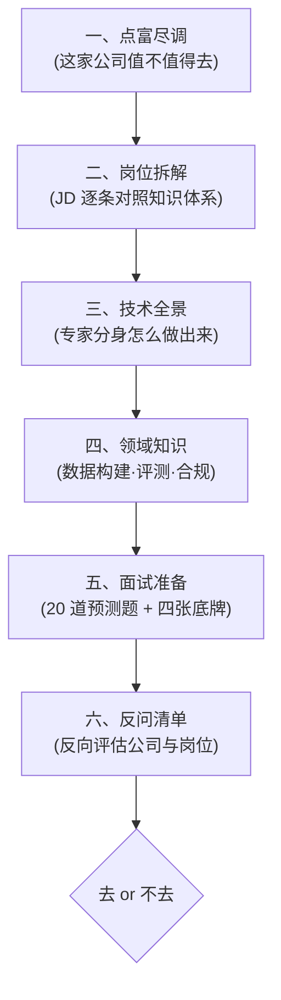

## 先看结论

> **点富是真的，钱是真的，专家资源可能是真的，但宣传口径习惯性注水**——12 条可核验声明里，7 条证实、3 条与公开信息不符、5 条查无佐证，另有 1 条重大监管处罚（母公司灵均「2·19 事件」）未披露。
>
> **核心技术有成熟开源对标（PsyDT / SoulChat2.0），壁垒在数据授权与合规资质，不在算法。** 宣传的「多模型动态路由」是 2–4 周可做的标准工程活。
>
> **岗位方向在 2026 年是增值的**（会写清洗脚本的搬砖型数据工程师在贬值，能设计评测体系、做 bad case 归因的数据策略工程师在增值），医疗垂直评测经验有稀缺性，**但成长性完全取决于你能否摸到训练决策**——这一点必须在面试中问清楚，别等入职才发现是个高级标注管理岗。

**如果时间紧张**：直接跳到「五、面试准备」和「六、反问清单」，那是临场能用的部分。技术细节（三、四）作为深挖锚点按需查阅。

### 信息时效与表述约定

公司核验部分基于 **2026 年 8 月**的公开信息（工商登记、监管公告、权威媒体报道、招聘平台数据）。结论分三档：**可证实**（有权威来源直接佐证）、**存疑**（搜索不到佐证但也无反证）、**与公开信息不符**（有权威来源明确矛盾）。

点富成立不足两年，状态变化快，若在更晚时间点参考，请以最新信息为准——尤其是**深度合成算法备案状态**和**融资/团队规模**这两项，它们变化最快，也恰好是面试探针。

需要声明的是：本节对点富的分析基于**公开信息的客观核验**，既不是贬低也不是推荐。核验出「宣传注水」不等于「公司不行」——它只是提醒你：对那些无法外部核验的说法要打折听，并把它们变成面试问题。

---

## 一、点富尽调：宣传册的七处注水与一个监管污点

### 为什么这一节要放在最前面

传统的岗位案例研究，第一节永远是「JD 拆解」。这一章反过来，先做招聘方尽调。

原因很简单：**如果公司本身有硬伤，后面的技术准备全是沉没成本。**

面对大疆、滴滴这类成熟企业，你不需要核验它是否存在、业绩是否属实——公开信息足够充分，行业口碑已经形成。但面对一家 2024 年底才注册的创业公司，而且它主动递过来一份自我美化的宣传册时，**核验就是求职流程的第一道工序**。

这一节的方法论可以复用到任何早期公司：

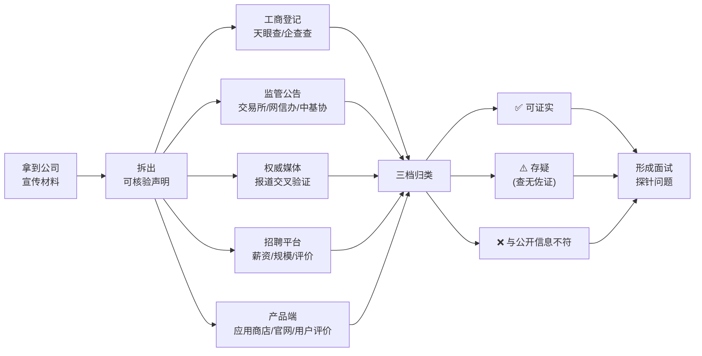

关键在最后一步：**核验的产出不是「去或不去」的二元判断，而是一组精准的面试探针**。你查不实的每一条，都可以变成一个当面追问的问题——对方的反应本身就是答案。

---

### 案例背景

**招聘方**：北京点富科技有限公司

**岗位**：大模型数据工程 + 模型评测（1–3 年经验，本科以上，优秀应届可考虑）

**招聘方提供的材料**：一份 7 页公司介绍 PDF（注意：这份 PDF 不是候选人简历，而是招聘方的自我宣传册）

**宣传册的核心叙事**：一家由头部量化私募创始人创办的原生 AI 公司，把知名医疗/心理专家做成「智能真身」，用户付费咨询，已与三大顶尖医疗机构战略合作，首个产品上线两个月营收过千万。

这个叙事听起来很完整：**顶级资本背景 + 稀缺专家资源 + 已验证的商业化**。但完整的叙事恰恰是最需要拆开看的。

---

### 逐条核验结果

我们把宣传册的声明拆成 12 条可核验事项，逐条对照公开信息。

#### ✅ 第一档：可证实（5 条）

**1. 公司主体真实存在，且资本实力不弱**

工商登记显示北京点富科技有限公司确实存在：

| 项目 | 信息 |
|------|------|
| 统一社会信用代码 | 91110400MAE455K980 |
| 法定代表人 | 邓诚菁（**注意：不是蔡枚杰**） |
| 注册资本 | 约 1.25 亿元 |
| 实缴资本 | 约 5000 万元 |
| 注册地 | 北京经开区 |
| 知识产权 | 45 项专利、51 项商标 |
| 官网 | dotfortune.com（可访问） |

**实缴 5000 万**是个有分量的信号——很多创业公司注册资本写得很大但实缴为零。这一条说明公司确实有真金白银投入，不是空壳。

**2. 母公司灵均投资真实，且 2025 年业绩确实领先**

宁波灵均投资，2014 年成立，中基协登记编号 P1004526，百亿级量化私募。2025 年前三季度百亿量化私募收益排名第一（约 62%），另一来源显示年内平均收益 67.39%，均高于幻方量化的约 47%–52%。

**「量化赛道第一、跑赢幻方」这个说法基本属实。**

**3. 创始人核心履历可证实**

蔡枚杰的浙江大学经济管理学硕士、中金公司 / 浙商基金 / 鹏华基金任职经历、2014 年创立灵均投资——均有灵均官网及多家权威媒体报道佐证。北师大「优师基金」联席理事长身份，有北师大官方微信公众号和人民日报报道佐证。中基协金融科技委员会委员、私募基金委员会委员，见于 2026 年 7 月的第三方尽调报告，可信度较高。

**4. 「智能真身」产品确有其事，且有主流媒体报道**

「杨凤池智能真身」于 2025 年 12 月 / 2026 年 1 月推出。杨凤池教授确为首都医科大学临床心理学系学术委员会主任，是中国应用心理学领域的权威。东方财富、澎湃新闻、财联社等均有报道，提到「近万名测试用户」体验。

**5. 岗位在招，薪资区间公开**

BOSS 直聘、猎聘、jobui 均有点富的在招岗位，薪资区间挂 20–60K。

---

#### ❌ 第二档：与公开信息不符（3 条）

**6. 成立时间：宣传册写「2025 年成立」，工商登记实为 2024 年 11 月 1 日**

这是个小事，但它是个**信号**——连注册年份这种一查就知道的事实都要往后挪，说明点富在对外表述上有「怎么好听怎么说」的惯性。

**7. 收益率：宣传册写「超 70%」，公开数据是 62%–67% 区间**

差距不大，但方向一致：**往上取整、往高了说**。

**8. 行业地位：宣传册写「头部企业」，实际规模已跌入第二梯队**

这一条最实质。2025 年 7 月《21 世纪经济报道》明确指出，灵均管理规模已跌入第二梯队，量化私募新「四大天王」是衍复、明汯、九坤、幻方（600–700 亿区间），**灵均不在其中**。

准确的表述应该是：**业绩排名第一，但管理规模非头部**。宣传册用「头部企业」四个字把这两件事混为一谈了。

> **为什么这个区分重要？** 对求职者来说，母公司的**规模**决定了它能给子公司多少持续输血，而**单年业绩**决定不了。量化私募的规模下滑往往伴随赎回压力，这会直接影响对创新业务的投入耐心。

---

#### ⚠️ 第三档：存疑，查无佐证（4 条）

**9. 「英国剑桥大学全球大使」——全网查无实据**

搜索剑桥大学官网及全网公开信息，未找到任何蔡枚杰与剑桥大学「全球大使」身份的关联。

**10. 「北京师范大学校董」——未证实**

能证实的只有捐赠性质的「优师基金联席理事长」。「校董」是一个有明确治理含义的头衔，与「捐赠基金理事长」不是一回事。未见任何公开来源支持「校董」表述。

**11. 「与协和医学院、首都医科大学、北京中医药大学东方医院三大机构战略合作」——未证实**

这是宣传册里分量最重、也最经不起查的一条。

实际能找到的，只有与**杨凤池教授个人**的合作。协和医学院、北中医东方医院的「机构级战略合作」无任何公开信息佐证，东方医院官网也没有相关内容。

> **专家个人合作 ≠ 机构战略合作。** 前者是签一个人，后者是签一家医院。两者在数据获取能力、合规通道、品牌背书上是数量级的差距。宣传册把「和三位专家分别合作」包装成「和三大机构战略合作」，这是**最需要在面试中当面问清的一条**。

**12. 「首个产品上线两个月营收过千万」——无法证实**

所有媒体报道均未提及任何营收数字，只提到「近万名测试用户」。未找到 App Store / 安卓应用商店的上架记录，也没有独立的用户评价。

另外，宣传册声称的「自研全自动评测 Agent 平台」，仅见于公司自述和招聘 JD，无第三方技术评测、无开源证据、无技术博客。

---

### 一个必须知道的监管污点：灵均「2·19 事件」

这是核验过程中最重的一条发现，宣传册里当然只字未提。

**2024 年 2 月 19 日**，龙年首个交易日开盘一分钟内，灵均投资旗下产品集中卖出 **25.67 亿元**，导致指数快速下挫。

沪深交易所当日联合处罚：

- **限制交易 3 天**
- **公开谴责**

深交所的措辞尤其严厉：「**今年以来已多次书面警示仍未改正**」。

事后蔡枚杰本人公开承认，公司的「双引擎」治理模式存在缺陷。多只产品当年年初回撤超过 15%。

这个事件在量化行业影响非常恶劣，被财新、证券时报等广泛报道，是灵均无法抹去的公开污点。

> **对求职者的意义**：这不直接等于点富科技有问题，两者是独立法人。但它揭示了母公司在**内控与合规文化**上曾经出过大问题。而点富做的又是医疗健康——一个合规要求远高于金融的领域。你需要在面试中确认：点富的合规体系是独立建设的，还是沿用灵均那套。

---

### 核验结论汇总

| # | 宣传册声明 | 核验结果 | 证据来源 |
|---|-----------|---------|---------|
| 1 | 公司真实存在 | ✅ 可证实 | 工商登记 91110400MAE455K980 |
| 2 | 实缴 5000 万 / 45 专利 51 商标 | ✅ 可证实 | 天眼查 |
| 3 | 母公司灵均 2025 业绩量化第一 | ✅ 可证实 | 前三季度约 62%，年内约 67% |
| 4 | 跑赢幻方 | ✅ 可证实 | 幻方约 47%–52% |
| 5 | 蔡枚杰浙大 / 中金 / 创立灵均 | ✅ 可证实 | 灵均官网、多家权威媒体 |
| 6 | 优师基金联席理事长 | ✅ 可证实 | 北师大官方公众号、人民日报 |
| 7 | 杨凤池智能真身已推出 | ✅ 可证实 | 东方财富、澎湃、财联社 |
| 8 | 2025 年成立 | ❌ 不符 | 工商实为 2024-11-01 |
| 9 | 收益超 70% | ❌ 不符 | 实为 62%–67% |
| 10 | 灵均是头部企业 | ❌ 不符 | 21 世纪经济报道：已跌入第二梯队 |
| 11 | 剑桥大学全球大使 | ⚠️ 存疑 | 全网查无实据 |
| 12 | 北师大校董 | ⚠️ 存疑 | 仅证实捐赠基金理事长 |
| 13 | 三大机构战略合作 | ⚠️ 存疑 | 仅找到与专家个人的合作 |
| 14 | 上线两月营收过千万 | ⚠️ 存疑 | 媒体仅提「近万测试用户」 |
| 15 | 自研全自动评测 Agent 平台 | ⚠️ 存疑 | 无第三方验证 |
| 16 | （未提及）2·19 监管处罚 | 🔴 隐瞒 | 沪深交易所公开谴责 + 限制交易 |

**统计：7 条可证实，3 条与公开信息不符，5 条存疑，1 条重大负面信息未披露。**

---

### 还有一个数字对不上：团队规模

- 天眼查显示 2025 年员工约 **39 人**
- 蔡枚杰 2025 年 5 月公开自述 **120 人**

三倍差距。可能的解释包括社保口径与实际用工口径不同、大量外包或兼职、或者单纯的对外夸大。**这个数字直接关系到你入职后团队有多少人、算法和工程怎么配比，必须当面确认。**

---

### 怎么解读这份核验结果

先说清楚：**这不是一家骗子公司**。

钱是真的（实缴 5000 万）、母公司是真的（百亿私募）、专家资源可能是真的（杨凤池确有合作）、产品是真的（有主流媒体报道）。这些底子比市面上绝大多数 AI 创业公司都扎实。

问题在于**表述习惯**。一家在公司介绍里连成立年份和收益率都要修饰的机构，你对它那些**无法外部核验**的说法——「营收过千万」「自研全自动评测 Agent 平台」「与三大机构战略合作」——就必须打折听。

这里有个朴素的推理：

> 已知点富在**可核验的事项**上有 3/10 的注水率，那么在**不可核验的事项**上，注水率只会更高，不会更低。

所以正确的姿态不是「不去」，而是**带着精准的问题去面试**。宣传册里每一条查不实的声明，都可以转化成一个探针：

| 存疑项 | 转化为面试探针 |
|--------|---------------|
| 三大机构战略合作 | 「战略合作的具体形式是什么？是机构签约还是专家个人签约？数据能从医院侧拿吗？」 |
| 营收过千万 | 「付费咨询的真实 DAU、付费转化率、复购率是多少？」 |
| 自研评测 Agent 平台 | 「判官模型与人工标注的 kappa 一致性是多少？」 |
| 团队 39 人 vs 120 人 | 「团队目前多少人？算法、工程、数据的配比是？」 |
| 灵均 2·19 事件 | 「点富的合规体系是独立建设的吗？和灵均的资金、业务隔离度如何？」 |

**对方答得出具体数字，说明是真做事；含糊其辞、转移话题，答案就已经给了。**

完整的反问清单见 「六、反问清单」。

---

### 方法论沉淀：早期公司尽调五查

这套流程适用于任何一家你不熟悉的早期公司，成本大约 30 分钟。

**一查工商**：天眼查 / 企查查，看注册时间、注册资本、**实缴资本**（最关键，区分空壳与实干）、法定代表人、股东结构、司法风险、知识产权数量。注意法人和宣传的创始人是否一致。

**二查监管**：如果涉及金融、医疗、教育等强监管行业，查监管公告。金融查证监会、交易所、中基协；医疗 AI 查**网信办深度合成算法备案**、药监局医疗器械注册；教育查教育部白名单。**监管记录是无法公关掉的硬信息。**

**三查媒体**：用「公司名 + 创始人名 + 负面关键词（处罚 / 纠纷 / 裁员 / 诉讼）」搜索，权威财经媒体（财新、21 世纪经济报道、证券时报）的报道权重远高于自媒体和通稿。注意区分**通稿**和**采写报道**——通稿只能证明公司花了钱。

**四查招聘**：BOSS 直聘 / 脉脉 / 看准网，看在招岗位数量（反映扩张还是收缩）、薪资区间、**员工匿名评价**（脉脉职言区尤其有价值）、以及岗位是否长期挂着不招满（可能是「钓鱼岗」或流失率高）。

**五查产品**：App Store / 应用商店 / 小程序，看上架时间、版本更新频率、评分和真实评价、下载量。**一家声称营收过千万的 C 端产品，如果在应用商店查无踪迹，这本身就是重大疑点。**

---

---

## 二、岗位拆解：JD 逐条分析与知识映射

### 原始 JD

> 该岗位将负责支持大模型训练的数据处理、质量评估及模型效果评测，是连接「数据-模型-产品」的关键角色。

**工作职责：**

1. **数据处理与数据工程**
   - 参与模型训练数据的清洗、构建与迭代（instruction / SFT / preference data）
   - 设计并实现数据 pipeline（采集、标注、过滤、结构化）
   - 构建高质量数据集（对话、多轮、领域知识等）
   - 参与 RAG 数据构建（切分、embedding、chunk 优化、知识更新）

2. **模型评测与质量体系**
   - 设计模型评测体系（自动评测 + 人工评测）
   - 构建评测集（benchmark / test set / golden set）
   - 进行模型效果分析（准确性、稳定性、幻觉率、对齐程度等）
   - 跟踪模型版本迭代效果，输出评测报告

3. **数据驱动优化**
   - 分析 bad case，反推数据问题或 prompt 问题
   - 参与 prompt engineering / 数据策略优化
   - 支持 SFT / RLHF / DPO 等训练数据准备

4. **工程及工具建设**
   - 搭建数据处理工具链（Python / SQL / Spark 等）
   - 构建数据标注/审核流程（可借助工具如 Label Studio 等）
   - 优化数据处理效率和质量控制机制

**任职要求（必备）：** 计算机/AI/数据相关专业本科及以上；1–3 年数据/AI 相关经验（应届优秀也可）；熟悉 Python，具备数据处理能力（pandas / numpy）；理解大模型基础（LLM / vector / embedding / RAG）；具备基本机器学习知识。

**优先条件（强加分）：** SFT / RLHF / 数据标注经验；模型评测经验（LLM eval / benchmark / 自动评测）；熟悉开源模型或工具（LLaMA、Qwen、LangChain、LlamaIndex）；prompt engineering 经验；做过 AI 产品落地（而非纯研究）。

**希望的人：** 对「数据驱动模型效果」有强认知；对细节敏感（能持续挖 bad case）；有工程能力 + 有一点产品感觉；能和算法 / 产品紧密协同。

---

### 先建立技术画像

在逐条拆解之前，先回答那个老问题：**这份 JD 到底在招一个什么样的人？**

它不是招算法工程师。整份 JD 没有出现模型结构、损失函数、训练框架、分布式训练、推理优化任何一个词。它对 SFT / RLHF / DPO 的表述统一是「**支持……训练数据准备**」——落点在数据，不在训练。

它也不是招数据标注员。「设计并实现 data pipeline」「设计模型评测体系」「构建标注/审核流程」这几条，主语是设计者而非执行者。

它更不是招 AI 产品经理。没有需求定义、用户研究、竞品分析、路线规划。

**它招的是一个「模型质量工程师」**——一个横跨数据工程、评测科学、Prompt 工程三个领域的复合角色，职责的本质是：**用数据和评测两个抓手，把模型效果这件事从「玄学」变成「可度量、可归因、可迭代的工程」。**

JD 开头那句「连接数据-模型-产品的关键角色」，其实说得很准确。用一张图来定位：

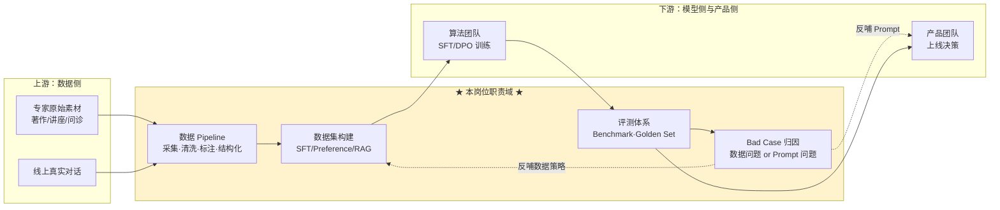

注意图中那两条**虚线反哺箭头**——它们是这个岗位价值的全部所在，也是判断这份工作是「高级标注管理」还是「数据策略工程」的分水岭。这一点会在 12.6 反复出现。

---

### 与前三个案例的根本差异

| 维度 | 第九章 自动驾驶 | 第十章 密码安全 | 第十一章 标签中台 | **第十二章 本案例** |
|------|--------------|--------------|----------------|-----------------|
| 技术栈主语言 | Java / C++ | Java / C | Java | **Python** |
| 核心能力 | 数据闭环工程 | 密码学 + 高可用 | 高并发中台 | **数据科学 + 评测方法论** |
| 领域知识占比 | 高 | 极高 | 低 | **中高（医疗 + LLM 前沿）** |
| 全书覆盖度 | 中 | 中低 | 高 | **中（第六、七章命中，但深度不够）** |
| 确定性来源 | 成熟企业 | 成熟企业 | 成熟企业 | **早期创业，需尽调** |
| 最大风险 | 领域陌生 | 领域极陌生 | 天花板 | **岗位定位模糊（可能沦为标注管理）** |

**对读者的直接含义**：如果你是本书的目标读者（Java 后端 / 数据研发背景），这个岗位对你而言的挑战不在于「学不会」，而在于**技术栈的整体切换**——从 JVM 生态切到 Python 数据科学生态，从「系统能不能扛住」的工程思维切到「效果好不好、为什么不好」的实验思维。

好消息是，你的数据研发背景（Hive / Spark / SQL / 数据质量 / 数仓建模）在这个岗位上**直接复用率极高**——LLM 数据工程本质上就是数据工程，只是产出物从「宽表」变成了「训练样本」。第六章 6.14 的数据质量六维度模型，几乎可以原封不动迁移到 SFT 数据质量评估上。

---

### 逐条拆解

#### 职责 1：数据处理与数据工程

**JD 关键词**：instruction / SFT / preference data、data pipeline、多轮对话数据集、RAG 数据构建

**技术本质**：这是整个岗位的**产能基座**。大模型时代有一句被说烂但确实成立的话——「模型能力的上限由数据决定，训练方法只是逼近这个上限」。这一条要做的，是把非结构化的原始素材（专家著作、讲座录音、科普视频、线上对话日志）转化成结构化的、高质量的、可直接喂给训练的样本。

四个子项的难度是递增的：

- **清洗过滤**：门槛最低，去重（MinHash / SimHash）、质量打分、有害内容过滤、PII 脱敏，工程活为主
- **Pipeline 设计**：中等，涉及采集调度、标注平台对接、多阶段流水线编排，考验数据工程功底
- **多轮对话数据集构建**：**这是真正的难点**，尤其在 persona 场景下——如何让 20 轮对话保持人设不漂移、逻辑连贯、不「AI 味」，是有方法论门槛的
- **RAG 数据构建**：切分策略、embedding 选型、chunk 优化、知识增量更新，第七章 7.1 有系统覆盖

**知识映射：**

| 知识点 | 本书覆盖 | 补充需求 |
|--------|---------|---------|
| 大模型数据处理全流程 | ✅ [6.8 大模型数据工程](../part6-bigdata/08-大模型数据工程.md) | 该节偏预训练，需补 SFT/偏好数据的特殊性 |
| MinHash / SimHash 去重 | ✅ [A1 核心数据结构](../part3-java-deep/A1-核心数据结构原理.md) | — |
| Spark 大规模数据处理 | ✅ [6.4 Spark](../part6-bigdata/04-Spark.md) | — |
| 数据质量六维度 | ✅ [6.14 数据质量](../part6-bigdata/14-数据质量.md) | 可直接迁移到 SFT 数据质量 |
| 数据接入与集成 | ✅ [6.16 数据接入与数据集成](../part6-bigdata/16-数据接入与数据集成.md) | — |
| PII 脱敏 | ✅ [7.9 AI 安全与可信](09-AI安全与可信.md) | 需补医疗场景「脱敏后保留临床语义」的特殊要求 |
| RAG 切分 / embedding / chunk 优化 | ✅ [7.1 RAG 实战](01-RAG实战.md) | — |
| 检索平台工程化 | ✅ [7.11 检索平台工程](11-检索平台工程.md) | — |
| **SFT / Preference 数据构建方法论** | ❌ **缺口** | 本章 「四、领域知识」 专门展开 |
| **多轮对话数据合成（persona 一致）** | ❌ **缺口** | 本章 「三、技术全景」 专门展开 |
| **合成数据的偏差与坍缩风险** | ❌ **缺口** | 本章 12.4 展开 |

#### 职责 2：模型评测与质量体系

**JD 关键词**：自动评测 + 人工评测、benchmark / test set / golden set、准确性 / 稳定性 / 幻觉率 / 对齐程度、版本迭代跟踪

**技术本质**：这是整个岗位**最有壁垒、最难被替代**的一条，也是决定你三年后能走多远的一条。

原因在于：数据清洗可以被工具自动化，Pipeline 可以被平台化，但「**如何判断这个模型比上个版本更好**」这件事，在 2026 年仍然没有标准答案，尤其在开放域对话和 persona 场景下。

四个评测维度的难度差异极大：

- **准确性**：有标准答案的任务好办（QA 准确率、分类 F1）
- **稳定性**：同一问题多次采样的方差、跨版本的回归波动，需要设计重复实验
- **幻觉率**：需要 grounding 校验机制，医疗场景下这是**红线指标**
- **对齐程度**：最难量化，尤其是「像不像这个专家」「有没有共情」这类主观维度

**知识映射：**

| 知识点 | 本书覆盖 | 补充需求 |
|--------|---------|---------|
| 数据质量评估框架 | ✅ [6.14 数据质量](../part6-bigdata/14-数据质量.md) | 思路可迁移，指标需重建 |
| 可观测性与监控大盘 | ✅ [6.15 平台可观测性](../part6-bigdata/15-平台可观测性.md) | 迁移到 LLM 可观测性（Langfuse 等） |
| 幻觉与 AI 可信 | ✅ [7.9 AI 安全与可信](09-AI安全与可信.md) | 需补医疗场景零容忍要求 |
| **LLM-as-a-Judge 方法论** | ❌ **缺口** | 本章 12.4 展开（四层架构 + 校准） |
| **Persona 一致性评测（CharacterEval）** | ❌ **缺口** | 本章 12.4 展开 |
| **Golden Set 设计与衰减治理** | ❌ **缺口** | 本章 12.4 展开 |
| **医疗垂直评测（MedBench）** | ❌ **缺口** | 本章 12.4 展开 |
| **评测工具链（Ragas/DeepEval/Langfuse）** | ❌ **缺口** | 本章 12.4 展开 |

#### 职责 3：数据驱动优化

**JD 关键词**：bad case 分析、反推数据/prompt 问题、prompt engineering、SFT / RLHF / DPO 数据准备

**技术本质**：这一条是职责 1 和职责 2 的**闭环连接件**，也是 JD 里「对细节敏感（能持续挖 bad case）」这句话的落点。

真正的难度在于**归因**——一个 bad case 摆在面前，你要判断它属于哪一类：

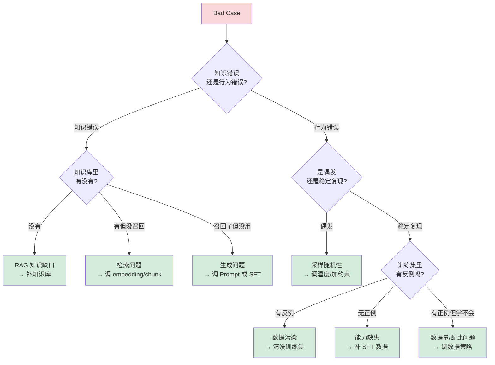

这张归因决策树，是这个岗位**最核心的思维工具**。能画出这张图并举例说明，比背十个 benchmark 名字更能证明你懂这个岗位。

**知识映射：**

| 知识点 | 本书覆盖 | 补充需求 |
|--------|---------|---------|
| Prompt Engineering / CoT / 结构化输出 | ✅ [7.2 Prompt Engineering](02-Prompt-Engineering.md) | — |
| 微调方法（LoRA / QLoRA / PEFT） | ✅ [7.5 微调入门](05-微调入门.md) | 需补 DPO / RLAIF 的数据侧要求 |
| 微调 vs RAG 选型 | ✅ 7.5 | — |
| **Bad Case 归因方法论** | ❌ **缺口** | 本章 12.4 展开（上图即核心） |
| **DPO / RLAIF 偏好数据构建** | ❌ **缺口** | 本章 12.4 展开 |

#### 职责 4：工程及工具建设

**JD 关键词**：Python / SQL / Spark 工具链、Label Studio 标注流程、效率与质量控制

**技术本质**：这一条对本书读者是**最友好**的——它就是纯数据工程，只是换了个产出物。你在数仓里做的调度、血缘、质量校验、权限控制，在这里一一对应。

**知识映射：**

| 知识点 | 本书覆盖 | 补充需求 |
|--------|---------|---------|
| Python 数据处理 | ✅ [4.5 Java 到 Python](../part4-multilang-compare/05-Java到Python.md) | 需补 pandas / numpy 实操熟练度 |
| SQL 与查询优化 | ✅ [A4 SQL 语言与数据处理](../part3-java-deep/A4-SQL语言与数据处理.md) | — |
| Spark | ✅ [6.4 Spark](../part6-bigdata/04-Spark.md) | — |
| 任务调度 / DAG | ✅ [6.13 任务调度](../part6-bigdata/13-任务调度.md) | — |
| 数据血缘与元数据 | ✅ [6.19 元数据管理](../part6-bigdata/19-元数据管理与智能数据治理.md) | 迁移到「数据集版本与血缘」 |
| 多租户与权限 | ✅ [6.17 多租户与权限体系](../part6-bigdata/17-多租户与权限体系.md) | — |
| **标注平台（Label Studio）实操** | ⚠️ 部分 | 需补标注规范设计 + 标注员管理 + 一致性度量 |

---

### 覆盖度总评

把上面四条职责的映射结果汇总：

| 覆盖状态 | 条目数 | 占比 | 说明 |
|---------|-------|------|------|
| ✅ 已覆盖 | 16 | 约 62% | 主要来自第六、七章 |
| ⚠️ 部分覆盖 | 2 | 约 8% | 需要补实操 |
| ❌ 缺口 | 8 | 约 30% | **全部集中在「评测方法论 + persona 数据构建」** |

**结论很清晰**：本书的第六章（大数据）和第七章（AI 工程）为这个岗位提供了扎实的**基础设施层**覆盖，但**评测科学**这一层几乎是空白。

这不是本书的疏漏，而是因为 LLM 评测是一个 2024 年之后才快速成型、2026 年仍在演进的新兴领域。它的缺口恰好也是这个岗位的**壁垒所在**——正因为没有标准教材，所以掌握了的人才稀缺。

缺口的八条，全部在 「三、技术全景」 和 「四、领域知识」 两节中系统补齐。

---

### 任职要求的隐藏信息

除了职责，任职要求里也藏着值得解读的信号。

**「1–3 年经验（应届优秀也可）」**——这是一个**初级到中级**的坑位。配合前面查到的 20–60K 区间，这个岗位大概率落在 15–25K，而非 60K。北京地区同类岗位，大厂给到 20–35K（30–56 万年薪），创业公司 15–25K 加期权，约为纯算法岗的六到七成。

**「本科及以上」**——门槛不高，说明公司不打算用学历卡人，看重的是实操。这对非科班背景是好事，但也意味着**竞争者众多**，需要用差异化的深度取胜（见 「五、面试准备」 的四张底牌）。

**「有工程能力 + 有一点产品感觉」**——这句话是整份 JD 里最值得玩味的。它暗示这个岗位需要**独立判断「什么样的效果才算好」**，而不只是执行别人定的标准。这是好信号，说明岗位有决策空间。

**「能和算法/产品紧密协同」**——反过来读：这个岗位**不直接拥有**算法和产品的决策权，是一个支撑角色。这是需要在面试中确认边界的地方。

**加分项里没有的东西也很说明问题**：没有要求分布式训练、没有要求推理优化、没有要求模型结构理解、没有要求发论文。**这确认了它不是算法岗**，天花板需要靠横向拓展（往评测体系负责人、AI 质量负责人、或数据驱动的产品方向走）而非纵向深挖模型。

---

---

## 三、专家数字分身技术全景：从真人到 AI 咨询体

### 本节要回答的问题

把一位真实的专家——比如从业 40 年的心理学教授、协和的妇产科主任医师、宫廷推拿第七代传人——变成一个能和用户对话、能被付费咨询的 AI，**技术上到底怎么做？**

这个问题必须先搞清楚，因为它决定了数据要怎么造、评测要怎么设计。**不理解产品形态就去准备数据工程面试，等于闭着眼睛搭流水线。**

---

### 一个关键发现：这条技术路线已经完全开源

面试准备最重要的一条情报：

> **华南理工大学数字孪生人实验室的 SoulChat2.0 / PsyDT 框架（arXiv:2412.13660），首次定义了「心理咨询师数字孪生」（Psychological consultant Digital Twin）任务，代码、数据集 PsyDTCorpus、模型全部开源。**

这几乎就是「专家智能真身」的技术底稿。

这个发现有双重价值：

1. **对你**：精读这篇论文是你能展示的最强准备度，成本一个下午，收益是能和面试官平等对话
2. **对判断点富**：如果面试官不知道 PsyDT，那所谓「自研」的成色就要打问号——一家做专家数字分身的公司，不应该不知道领域内唯一的开源标杆

---

### 整体架构：专家分身是怎么拼出来的

先给全局图。一个专家数字分身不是一个模型，而是**四层能力的叠加**：

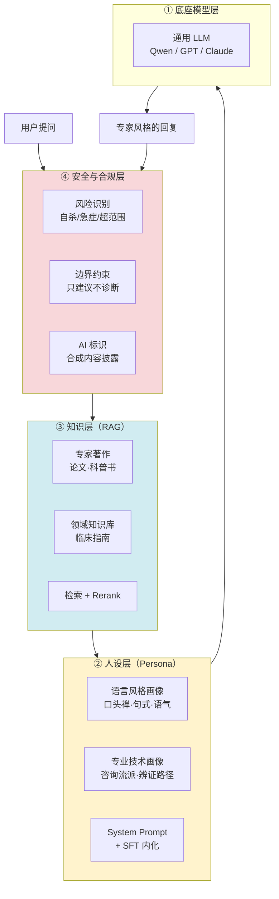

**四层的分工要点：**

| 层 | 承载什么 | 技术手段 | 数据岗的介入点 |
|----|---------|---------|--------------|
| ① 底座 | 通用语言能力 | 选型 + 可能的多模型路由 | 提供选型的评测依据 |
| ② 人设 | **「像不像这个人」** | SFT（主）+ System Prompt | **核心战场：构造 persona SFT 数据** |
| ③ 知识 | 「说得对不对」 | RAG 检索增强 | 知识库切分、embedding、更新 |
| ④ 安全 | 「会不会闯祸」 | 规则 + 分类器 + 兜底 | 构造风险识别评测集 |

**这里有一条最容易答错的设计原则，面试很可能考：**

> **专家的知识走 RAG，专家的风格走 SFT。不要把知识塞进 SFT。**

原因是知识会过期、会增补（新的临床指南、新的研究结论），塞进模型权重意味着每次更新都要重训；而风格是稳定的，适合内化到权重里。RoleLLM 的实验也支持这个结论：系统指令 + Context-Instruct 的组合优于纯检索增强，但**知识注入靠 Context-Instruct 效果更好且抗噪**。

---

### 核心难题：数据从哪来

做专家分身，最大的现实约束是：

> **真实的咨询/问诊记录，你几乎拿不到。**

心理咨询记录涉及来访者最敏感的隐私，医疗问诊记录受《个人信息保护法》和医疗数据法规严格约束。即使专家本人愿意配合，把真实案例拿出来训练，也要过伦理审查、知情同意、脱敏处理三道关。

而 SFT 需要成千上万条样本。**这个矛盾怎么解？**

#### PsyDT 的答案：dynamic one-shot 风格提取

PsyDT 的核心贡献就是绕开了这个死结，方法分三步：

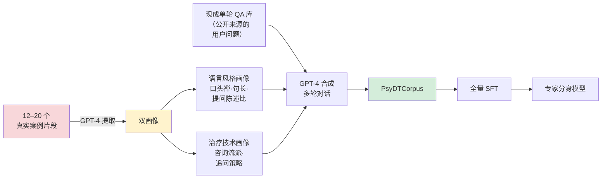

**第一步 · 动态单样本风格提取。** 用 GPT-4 从咨询师的 **12–20 个真实案例片段**中，抽取两类画像：语言风格（怎么说话）和治疗技术（怎么做咨询）。

这一步的洞察极为关键：**不需要成百上千条真实记录，十几个案例就够提取风格**。风格是高度冗余的信号，少量样本即可捕捉。这一下就把伦理和隐私的门槛降到了可操作的水平。

**第二步 · 单轮转多轮。** 拿现成的单轮咨询 QA 库（用户的提问是公开可得的，比如各种心理问答社区），配合上一步提取的风格画像，引导 GPT-4 合成该咨询师风格的多轮对话。

**第三步 · 在合成语料上做全量 SFT。**

#### 风格画像怎么拆——迁移到任意专家

PsyDT 是针对心理咨询师的，但这套画像框架可以迁移到任何专家。我把它拆成三层：

**语言层（怎么说）**

- 口头禅与高频表达
- 句长分布（长句还是短句）
- 提问 vs 陈述的比例（心理咨询师提问多，中医专家陈述多）
- 书面度 / 口语度
- 情感词密度

**技术层（怎么想）**

- 心理专家：咨询流派（CBT / 人本主义 / 精神分析）、追问策略、共情技术
- 妇产科专家：问诊路径、风险分层逻辑、科普转化方式
- 中医专家：辨证论治路径（四诊合参）、手法体系、调理思路

**知识层（说什么）**

- 专家著作、讲座、科普内容 → **进 RAG 知识库，不进 SFT**

面试时如果被问到「给你杨凤池教授的 20 万字著作、50 集讲座、200 条科普短视频，怎么设计 pipeline」，这个三层拆解就是答题框架：**著作和讲座的内容进 RAG，讲座和短视频的表达方式提取风格画像，真实案例（如果有）提取技术画像**。

---

### 业界方法论谱系

除了 PsyDT，还有几个必须知道的参考体系。面试时能报出这些名字并说清差异，是准备度的直接体现。

#### RoleLLM / RoleBench（北航）

168k 样本的角色扮演数据集，四阶段构建法：

1. **角色画像构建**（Role Profile Construction）
2. **Context-Instruct**：基于角色的上下文生成指令，用于知识注入
3. **RoleGPT**：用 GPT 做角色扮演的基线
4. **RoCIT**（Role-Conditioned Instruction Tuning）：角色条件化的指令微调

**核心结论**：系统指令 + Context-Instruct 优于纯检索增强；知识注入用 Context-Instruct 效果更好且抗噪。

#### 港科大 + 腾讯的角色扮演综述

提供了一个有用的分类框架：

| 类型 | 全称 | 特征 | 例子 |
|------|------|------|------|
| **P-RP** | Persona-based Role-Playing | 粗粒度人设，只有性格标签 | 「一个温柔的助手」 |
| **C-RP** | Character-based Role-Playing | 细粒度角色，有具体身份、经历、语言习惯 | 哈利波特、杨凤池教授 |

**专家数字分身属于 C-RP**，难度显著高于 P-RP——因为它有**客观的对照物**（真人本人），可以被验伪。

#### 其他参考

- **Chat-Haruhi**：中文动漫角色扮演的早期开源实践
- **PIPPA**：英文角色扮演对话数据集
- **Character.AI / MiniMax Talkie**：商业产品形态参考

---

### ⚠️ 一个必须知道的陷阱：合成 Persona 的系统性偏差

这是我认为**面试时最能拉开差距**的知识点。

**NeurIPS 2025 论文《LLM Generated Persona is a Promise with a Catch》**证明了：LLM 合成的 persona 存在**系统性偏差**，且这个偏差**随合成内容比例上升而放大**。

把这个结论套到专家分身上，就是一个很尖锐的悖论：

> 如果训练数据几乎全部由 GPT-4 合成，那么模型学到的究竟是「杨凤池教授的风格」，还是「**GPT-4 想象中的杨凤池教授**」？
>
> 更麻烦的是：**这两者用常规评测指标区分不出来**——因为评测用的 judge 模型往往也是 GPT-4，它会认为「符合自己想象的那个版本」更像。

这就形成了一个闭环偏差：**GPT-4 造数据 → GPT-4 当裁判 → GPT-4 给自己的想象打高分。**

**怎么破？** 这正是数据评测岗的价值所在，也是面试的最佳答题点：

1. **引入真人锚点**：拿专家本人对同一批问题的真实回答做 golden set，算风格特征距离，而不是让 LLM 打分
2. **引入人类裁判**：让熟悉该专家的人（学生、同事、老患者）做盲测辨认
3. **控制合成比例**：真实数据与合成数据混合，并做配比实验
4. **换 judge 模型**：用不同家族的模型交叉评判，避免自我偏好

这个「陷阱 + 破解方案」的组合，主动在面试中提出来，比回答十道标准题都管用。

---

### 相关的另一个陷阱：模型坍缩

配套的还有 ICML 2026 北大邓小铁课题组的结论：**模型反复学习自身输出会导致分布收缩，甚至模型坍缩（model collapse）**。

这与 Gartner 曾经的乐观预测（2024 年 60% 的 AI 开发数据将是合成数据、2030 年合成数据成为主要来源）形成对照。2026 年的成熟认知是：

> **「有外部信号验证的合成数据」才有价值，无验证的纯合成数据会让模型退化。**

而设计那个「外部验证信号」——正是这个岗位存在的意义。这也是回答「合成数据会不会取代你这个岗位」的标准答案。

---

### 「多模型动态路由」的技术含金量评估

点富的宣传册宣称有「自研全自动评测 Agent 平台，通过对细分业务场景的精准感知、最优模型的多维度自动化评测遴选，以及高鲁棒性工程链路的实时无感动态调度」。

翻译成人话：**根据问题类型，自动选择用哪个大模型来回答**。

#### 主流做法一览

| 方案 | 出处 | 核心思路 |
|------|------|---------|
| **RouteLLM** | LMSYS | 三种 router：矩阵分解（推荐系统思路）、BERT 分类器、Causal LLM 分类器；用 Chatbot Arena 80k 对战数据训练；指标 CPT(50%)、APGR。矩阵分解版 APGR 达 0.802 |
| **FrugalGPT** | Stanford | LLM 级联，按成本从低到高依次查询，直到置信度足够 |
| **Hybrid-LLM** | Microsoft | 大小模型混合路由 |
| **Arch-Router** | — | 偏好对齐的路由 |
| **RouterEval** | arXiv:2503.10657 | 8500+ LLM × 12 benchmark 的 2 亿条性能记录，把路由转化为分类任务 |
| **LLMRouter** | UIUC Ulab，2025-12 开源，千星 | 16+ 路由方法，覆盖单轮/多轮/Agentic/个性化，统一 CLI + 数据生成流水线 |

#### 含金量判断（直说）

**路由本身不是高壁垒技术。** 学术界已经把它抽象成 Route + Training 两个子模块，工业界有开源全家桶，一个熟练工程师 **2–4 周**能搭出可用版本。

真正难的是三件事：

**其一，路由决策依赖的质量信号从哪来。** 你凭什么判断「这个问题该给模型 A 而不是模型 B」？这个判断依据必须来自评测数据。**这才是数据评测岗的价值所在**——没有可靠的评测，路由就是拍脑袋。

**其二，冷启动。** 新模型上线时没有历史性能记录，路由器不知道该不该用它。

**其三，多轮对话中途切模型导致的 persona 漂移。** 这在专家分身场景是**致命的**——用户前三轮在和「杨凤池」聊，第四轮因为问题变简单被路由到小模型，语气突然变了。通用路由论文基本没有解决这个问题，因为它们的评测集都是单轮的。

**所以面试时的判断标准很清楚：**

> 如果「多模型动态适配调度」只是按成本和难度在 GPT-4o 和 Qwen 之间切，那是标准工程活，两周能做，不值得吹「自研」。
>
> 如果它真的解决了 **persona 跨模型一致性**，那确实有价值。
>
> **务必追问到这一层。**

---

### 在线评测配套：LLM-as-a-Judge 四层架构

路由也好、版本迭代也好，都需要一套自动评测支撑。2026 年的标准做法是 LLM-as-a-Judge，四层架构：

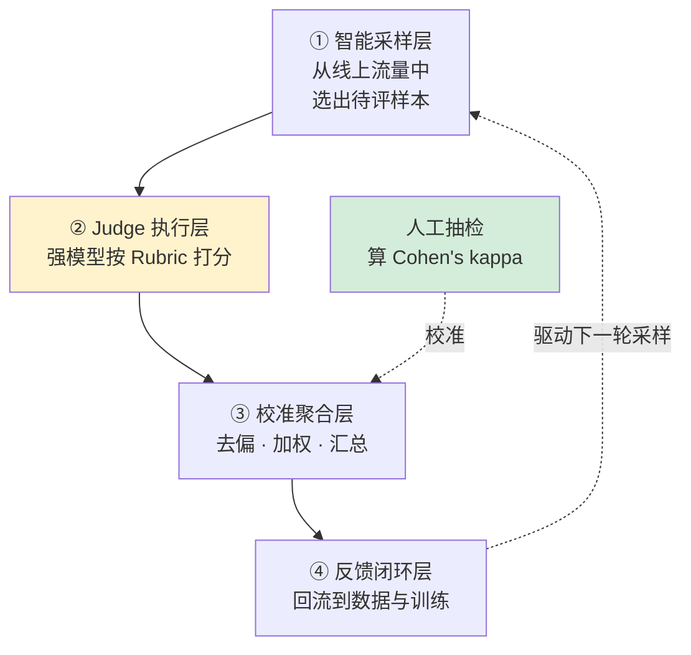

**四个必须掌握的工程要点**（面试高频）：

1. **Rubric 结构化 + 版本控制**：评分标准写成 YAML/JSON 独立管理，而不是硬编码进 prompt。因为 Rubric 会迭代，需要可追溯、可回归。

2. **Pairwise 优于 Pointwise**：让 judge 比较 A/B 哪个好，比让它打 1–5 分更可靠，与人类一致率可达 80%+。绝对打分的分数漂移严重。

3. **位置偏见必须处理**：judge 倾向于偏好排在前面的答案。解法是 **A/B 交换双跑**，取一致的结果。

4. **必须留人工抽检做校准**：算 **Cohen's kappa** 衡量 judge 与人工的一致性。**这个数字是判断一个评测平台是否成熟的硬指标**——问不出这个数字，说明平台还是 demo。

前沿方法可以提一个：**CCE（Comparative Consistency Evaluation，ACL 2025）**，用群体比较推理，5 个基准平均提升 6.7%。

---

### 评测工具链现状（2026）

| 工具 | 定位 | 2026 年状态 |
|------|------|------------|
| **Langfuse** | LLM 可观测性 | GitHub 15k+ star，**2026 年 1 月被 ClickHouse 以 4 亿美元估值收购**，成为开源可观测性事实标准 |
| **Braintrust** | 评估驱动开发 | 2026 年融资 8000 万美元、估值 8 亿，差异化在评估数据集版本管理与协作 |
| **Ragas** | RAG 专项评测 | RAG 评测首选，无参考指标（Faithfulness + AnswerRelevancy），实测可识别 37% 的高置信度错误回答 |
| **DeepEval** | 单测风格评测 | Pytest 风格 CI/CD 集成，2026 年推出 Pro 版「可信四维图谱」（事实性/安全性/可控性/鲁棒性） |
| **OpenCompass** | 中文基座评测榜单 | 上海 AI 实验室维护，国内权威 |
| **LM Eval Harness** | 学术基准 | EleutherAI，英文学术标准 |

市场层面：全球 LLM 可观测平台 2026 年约 **26.9 亿美元**规模，CAGR 36.2%，Gartner 预测 2028 年覆盖 50% 的 GenAI 部署。

**这组数字的含义**：LLM 评测正在从「团队内部的手工活」变成「有独立商业价值的基础设施」。这对从业者是好消息——赛道在扩张，不在萎缩。

---

---

## 四、领域知识：数据构建、评测体系与医疗合规

上一节讲了专家分身**整体怎么做**，这一节补齐 「二、岗位拆解」 识别出的八个知识缺口的具体内容。

这一节是全章密度最高的部分，建议配合 「五、面试准备」 交叉阅读——那里的每一道预测题，都能在这里找到弹药。

本节结构：

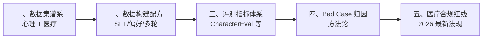

---

### 一、中文数据集谱系（必背）

面试很可能直接问「你知道哪些中文心理/医疗对话数据集」。这个问题的回答质量，直接暴露你是真研究过还是临时抱佛脚。

**关键不是背名字，而是说清每个数据集的构建方式**——因为构建方式才是可迁移的方法论。

#### 心理咨询方向

| 数据集 | 出品方 | 构建方式 | 规模 | 可借鉴的方法 |
|--------|--------|---------|------|------------|
| **PsyQA** | THU-CoAI（清华） | 真实问答 + **援助策略标注** | 单轮长文本 | 策略标注思路——不只标答案，还标「用了什么咨询技术」 |
| **SmileChat / MeChat** | qiuhuachuan | ChatGPT 把单轮扩展成多轮 | ~55k 多轮 | **单轮转多轮**的最早实践 |
| **SoulChatCorpus** | 华南理工 | 真实咨询 → 多轮共情改写 + 人工校对 | 258k 对话 / 1.5M 轮 | 真实数据打底 + LLM 改写增强 |
| **CPsyCoun** | — | **Memo2Demo**：督导笔记 → 咨询框架 → 四阶段对话 | 多轮 | **四阶段结构**（接待/诊断/咨询/巩固） |
| **PsyDTCorpus** | 华南理工 | 风格提取 + 单轮转多轮 | 特定咨询师 | 见 「三、技术全景」 的 dynamic one-shot |

**一个值得记住的合规细节**：SoulChatCorpus 开源时**主动过滤掉约 9 万条**数据（隐私、安全、政治风险、低质）。

这个数字很有说服力——**在心理健康数据上，超过四分之一的原始数据是不能用的**。面试时提到这个，能体现你对数据合规成本有真实认知，而不是纸上谈兵。

#### 医疗方向

**HuatuoGPT 的四源混合配方**（最经典，务必掌握）：

| 数据源 | 规模 | 特点 |
|--------|------|------|
| ChatGPT 蒸馏指令 | 61.4k | 流畅、格式规范 |
| 真实医生指令 | 69.8k | 专业、准确 |
| ChatGPT 双角色扮演对话 | 68.9k | 多轮、有互动感 |
| 真实医患多轮对话 | 26k | 真实交互模式 |

训练后再用 **RLAIF** 奖励模型对齐（KL 惩罚系数 0.05）。

**核心 insight（这是面试金句）**：

> **蒸馏数据流畅但不像医生**——不主动追问、动辄拒绝诊断、说话像客服；
> **真实医生数据专业但简短不连贯**——医生打字都很简短，「先查个血常规」就没了；
> **两者互补，必须混合。**

这个洞察可以直接迁移回答「为什么不能只用合成数据 / 只用真实数据」。

**其他医疗数据集**：

- **DISC-MedLLM**（47 万）：三路构建——知识图谱三元组采样 + 真实对话重建 + 人工偏好对齐
- **CMtMedQA**：基于 7 万真实医患对话、覆盖 14 个科室，特别强调**主动询问**能力（模型要会追问，而不是被动应答）

---

### 二、数据构建配方

#### 2.1 SFT 数据的质量维度

第六章 [6.14 数据质量](../part6-bigdata/14-数据质量.md) 的六维度模型（完整性、准确性、一致性、及时性、唯一性、有效性）可以迁移，但 SFT 数据有自己的特殊维度：

| 维度 | 含义 | 度量方法 |
|------|------|---------|
| **多样性** | 覆盖足够广的意图和表达 | distinct-n、语义聚类熵、意图分布均衡度 |
| **难度分布** | 不能全是简单样本 | 按 token 长度/推理步数/领域深度分层统计 |
| **一致性** | 同类问题的回答风格统一 | 风格特征向量的类内方差 |
| **无污染** | 不含评测集内容 | n-gram 重叠检测、embedding 近邻检索 |
| **人设一致** | persona 场景特有 | 见下文 CharacterEval 指标 |
| **安全性** | 无有害、无越界内容 | 分类器 + 规则 + 人工抽检 |

#### 2.2 合成数据同质化的检测（高频考点）

大量使用 LLM 合成数据，最典型的失败模式是**同质化**——一万条数据看起来都像同一个模板生成的。

**可量化的检测指标**：

| 指标 | 计算方式 | 说明 |
|------|---------|------|
| **distinct-n** | 不重复 n-gram 数 / 总 n-gram 数 | 最基础的词汇多样性 |
| **self-BLEU** | 每条样本与其他样本的 BLEU 均值 | 越低越多样 |
| **语义聚类熵** | embedding 聚类后的簇分布熵 | 熵低说明扎堆 |
| **句式分布 KL** | 与真实语料的句式分布做 KL 散度 | 衡量与真实数据的偏离 |
| **开头词分布** | 首 token 的频次分布 | LLM 合成数据常有「我理解你的感受」类固定开头 |

**缓解手段**：提高采样温度、多教师模型混合、种子多样化（用不同的用户画像/场景做种子）、真实数据混合、拒绝采样过滤重复。

#### 2.3 偏好数据（DPO / RLHF）的构建

JD 里的「preference data」和「支持 SFT / RLHF / DPO」，落到数据侧就是构造 **(prompt, chosen, rejected)** 三元组。

四种主流构造方式：

| 方式 | 做法 | 成本 | 质量 |
|------|------|------|------|
| **人工标注** | 人工比较两个回答选优 | 高 | 最高 |
| **RLAIF** | 用强模型当标注员打偏好 | 低 | 中高（HuatuoGPT 用这个） |
| **规则构造** | 用规则生成 rejected（如故意去掉共情、故意越界诊断） | 极低 | 针对性强 |
| **版本对比** | 新旧模型输出配对，人工/模型判优 | 中 | 贴近实际迭代 |

**在 persona 场景下有个很实用的技巧**：用「专家本人的真实回答」作为 chosen，用「模型生成的回答」作为 rejected，直接构造出高质量偏好对。这比抽象的「哪个更好」有明确的客观锚点。

#### 2.4 多轮对话的连贯性设计

面试常问「多轮数据怎么保证不重复、不 AI 味、逻辑连贯」。答题框架：

**结构设计**：借鉴 CPsyCoun 的四阶段（接待 → 诊断 → 咨询 → 巩固）。给对话一个骨架，而不是让 LLM 自由发挥，这是避免「绕圈子」的关键。

**轮次控制**：设定每阶段的目标轮次，超出则收敛。

**信息增量约束**：每一轮必须引入新信息（新问题、新建议、新追问），可以用「本轮回复与前文的语义相似度」做自动检测，相似度过高判为重复。

**去 AI 味**：过滤高频套话（「我理解你的感受」「首先……其次……最后」）、控制列表化输出比例、注入专家真实语料中的口语特征。

---

### 三、评测指标体系

#### 3.1 CharacterEval（中文角色扮演第一基准，必背）

**出品**：中国人民大学 + 北京邮电大学
**规模**：1785 段多轮对话 / 23020 个样例 / 77 个角色
**结构**：4 大维度 13 项指标

| 维度 | 指标 | 说明 |
|------|------|------|
| **对话能力** | 流畅性 | 语言是否自然 |
| | 连贯性 | 上下文是否衔接 |
| | 一致性 | 前后是否自相矛盾 |
| **角色一致性** | 知识曝光率 | 该说的角色知识说出来了吗 |
| | 知识准确率 | 说出来的对不对 |
| | **知识幻觉率** | 有没有编造角色不该知道的 |
| | 行为一致性 | 行为符合人设吗 |
| | 语气一致性 | 说话腔调像不像 |
| **角色吸引力** | 类人度 | 像人还是像机器 |
| | 沟通技巧 | 会不会聊天 |
| | 表达多样性 | 会不会车轱辘话 |
| | **共情度** | 有没有情感回应 |
| **人格测验** | MBTI 准确率 | 人格特质是否匹配 |

**这 13 项指标是回答「怎么设计专家分身评测体系」的现成骨架**。面试时按这四个维度展开，再补充医疗场景特有的「安全性」维度，就是一个完整的答案。

#### 3.2 InCharacter：用心理量表评人格

**思路**：让 LLM 当面试官，用 **14 套心理量表**（BFI 大五人格、EPQ-R、共情量表、情绪智力量表 WLEIS 等）转成开放式问答，测角色扮演模型的人格特质，再与 PDB（Personality Database）标签比对。**还原率 82.8%**。

**对本岗位的直接价值**：JD 没提但业务必然需要的「**共情能力怎么量化**」，这条路是现成答案——**用 Empathy Scale 和 WLEIS 量表转开放式问答**，而不是拍脑袋定个「共情分」。

#### 3.3 ⚠️ PersonaEval：面试杀手锏

**出处**：COLM 2025，上海交通大学王德泉组

**它问了一个釜底抽薪的问题**：AI 裁判到底能不能认出「这段话是谁说的」？

**结果**：

| 裁判 | 角色识别准确率 |
|------|--------------|
| Gemini-2.5-pro | **68.8%** |
| 人类 | **90.8%** |

**结论**：LLM-as-a-judge 在**角色识别这个前置任务上就不合格**。既然连「这是不是这个人说的」都判断不准，那它对「语气一致性」「性格一致性」的所有打分，都是**空中楼阁**。

这个点在面试中抛出来，能立刻和其他候选人拉开差距——因为它证明你不只是会用工具，而是在**质疑工具的有效性边界**。

#### 3.4 「像不像这个专家」的三层落地方案

综合上述，如果面试官问「你怎么评测像不像」，这是我建议的标准答案：

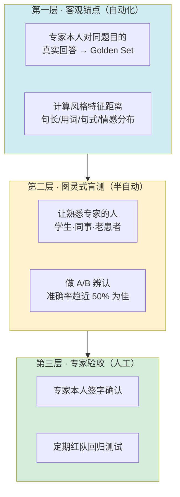

三层的设计逻辑是**成本递增、权威性递增**：第一层可以每次训练后自动跑，第二层每个版本跑一次，第三层上线前跑。

**第二层的「准确率趋近 50%」是个漂亮的设计**——如果熟悉专家的人无法区分真人和 AI（相当于随机猜），说明分身成功了。这比任何 LLM 打分都有说服力。

#### 3.5 Golden Set 的设计与衰减

Golden Set（黄金测试集）是评测体系的地基，几个关键点：

**构建原则**：覆盖核心场景（按业务流量分布采样）、包含边界 case、包含已知 bad case（回归用）、规模不必大但质量必须高（通常几百条足够）。

**版本管理**：Golden Set 本身要版本化，每次变更记录原因。这和数仓的[元数据管理](../part6-bigdata/19-元数据管理与智能数据治理.md)是同一套思路。

**衰减问题（面试考点）**：Golden Set 用久了会失效，原因有三：

1. **过拟合**：团队反复针对这几百条优化，分数虚高
2. **污染**：Golden Set 内容泄漏进训练数据
3. **分布漂移**：线上用户的真实问题分布变了，Golden Set 不再有代表性

**治理办法**：定期从线上流量重新采样补充、保留一个从不公开的 holdout 集、监控 Golden Set 分数与线上指标的相关性（相关性下降就是失效信号）。

#### 3.6 医疗垂直评测：MedBench

**MedBench 5.0**（2026 年升级版）是国内医疗 LLM 评测的权威体系：

- 钟南山、葛均波、范先群等院士团队参与
- 覆盖 **63 项细分临床任务**、近 **100 万条**评测题
- 首创「**医疗原子技能评测**」，按心内科、呼吸科等**专科赛道**分别评测
- 联合 500 余家医疗机构
- **已被上海市卫健委指定为前置评测载体**

最后一条尤其重要——**它已经从「学术榜单」变成了「准入门槛」**。这意味着做医疗 AI 的公司迟早要过这一关，你懂这套体系就是直接的岗位价值。

---

### 四、Bad Case 归因方法论

「二、岗位拆解」 给出了归因决策树，这里补充执行层面的方法。

#### 4.1 归因的四类根因

| 根因类型 | 典型表现 | 验证方法 | 修复手段 |
|---------|---------|---------|---------|
| **知识缺失** | 答不上来、说不知道 | 查知识库是否有 | 补 RAG 知识库 |
| **检索失败** | 知识库有但没用上 | 看检索日志的召回结果 | 调 chunk 策略 / embedding / rerank |
| **生成偏差** | 检索对了但回答跑偏 | 把正确知识直接塞 prompt 重试 | 调 prompt / 补 SFT |
| **能力缺失** | 稳定复现的行为错误 | 查训练集有无同类正例 | 补 SFT 数据 / 调数据配比 |

**关键的诊断技巧**：把正确知识直接塞进 prompt 重试一次。

- 塞了就对 → 问题在**检索**
- 塞了还错 → 问题在**生成**

这一个动作就能把根因空间砍一半，是最高性价比的排查手段。

#### 4.2 Bad Case 的分级与优先级

不是所有 bad case 都值得修。建议按二维矩阵分级：

| | 低频 | 高频 |
|---|---|---|
| **高危**（医疗安全/合规） | **P0**：立刻修，加规则兜底 | **P0**：立刻修 + 停服评估 |
| **中危**（专业性错误） | P2：进 backlog | **P1**：本迭代修 |
| **低危**（体验问题） | P3：观察 | P2：进 backlog |

**医疗场景的特殊性在于「低频高危」也是 P0**——一个极罕见但可能致命的错误建议，比一百个语气不自然严重得多。这与互联网产品「先修高频」的直觉相反，是必须在面试中体现的场景理解。

#### 4.3 从 Bad Case 到数据策略

这是岗位价值的最高体现——**单点修复 vs 系统性改进**。

修一个 bad case 是执行，从一批 bad case 中**归纳出数据分布的系统性缺陷**才是策略。方法：

1. 累积一段时间的 bad case（比如 200 条）
2. 打标签聚类，找出高频模式
3. 反查训练集在这些模式上的样本密度
4. 发现密度显著偏低的区域 → 定向补数据
5. 下个版本验证该类 bad case 是否下降

**这个闭环能不能跑通，就是「数据策略工程师」和「标注管理员」的分界线。**

---

### 五、医疗合规红线（2026 最新）

这部分是**外部性最强的知识**——它不随公司变化，学会了到哪都能用，而且是面试中最有效的探针。

#### 5.1 必须掌握的四条法规

**① 《人工智能生成合成内容标识办法》+ 强制性国标**

- **2025 年 9 月 1 日已正式施行**
- 要求**显式标识 + 隐式标识**双轨
- **数字分身产品直接命中**——AI 生成的专家回复必须标明是 AI

**② 深度合成算法备案（网信办）**

- 做数字人、语音克隆、AI 对话的产品必须备案
- **这是硬指标，无法造假，可公开查询**
- 参照：微医拿了三项备案

**③ 诊疗边界（卫健委相关规定）**

- **不得违规替代医师诊疗**
- **不得自动生成处方**
- 含义：专家分身在法律上**只能做健康建议，不能做诊断**

**④ 人格权（民法典）**

- 专家的肖像权、声音权、姓名权
- 授权范围必须书面明确：能用哪些素材、用于什么场景、期限多久

#### 5.2 国际参照：加州 SB243

**2026 年 1 月 1 日生效，全球首部 AI 陪伴立法**，要求：

- AI 身份披露（必须告知用户在和 AI 对话）
- 未成年人**每 3 小时**提醒一次
- **自杀自残识别与危机资源转介**
- 2027 年起提交年报

**国内立法大概率跟进**。这几条应该直接进入评测体系的安全维度——面试时提到 SB243，能体现你的视野超出国内。

#### 5.3 合规如何落到数据与评测

法规不能只停在「知道」，要能说清怎么落地：

| 合规要求 | 数据层落地 | 评测层落地 |
|---------|-----------|-----------|
| 只建议不诊断 | SFT 数据里所有涉诊断的样本，回复统一改为「建议就医」范式；构造 rejected 样本（越界诊断）做 DPO | 构造「诱导诊断」测试集，度量越界率，目标 0 |
| 自杀风险识别 | 构造风险样本 + 标准转介回复，注意不能引入有害内容 | 独立评测集，**召回优先**（宁可误报不可漏报），同时监控过度触发率 |
| PII 保护 | 识别 + 替换，但要**保留临床语义**（「35 岁女性」不能脱成「XX」） | 脱敏后的语义保真度检查 |
| AI 标识 | — | 检查每轮输出是否带标识 |
| 授权范围 | 数据血缘标注来源，超范围素材不入库 | 定期审计训练集来源合法性 |

**「脱敏后保留临床语义」这一条值得展开**——医疗数据脱敏和普通 PII 脱敏的关键差异在于，年龄、性别、孕周、既往病史这些信息既是个人标识的一部分，又是临床判断的必要输入。粗暴脱敏会让数据失去训练价值。正确做法是**分级处理**：直接标识符（姓名、身份证、电话）完全删除，准标识符（年龄、地域）泛化处理（35 岁 → 30-40 岁），临床特征完整保留。

#### 5.4 自杀风险识别的评测设计（高频考点）

这是医疗心理场景最敏感、也最容易被问到的点。

**指标设计**：

- **召回率优先**：漏报一个真实风险的代价，远大于误报一百次。目标召回率通常设在 99%+
- **误触发率作为约束**：但不能为了召回把所有负面情绪都判为高危，那样用户体验崩溃
- **分级响应**：不是二分类，而是分级（低/中/高危），不同级别不同响应策略

**评测集构造的伦理难题**：你需要包含真实的高危表达才能测准，但**不能在数据集里引入有害内容**（比如具体的自伤方法）。

**解法**：只保留「风险信号」不保留「有害细节」。测试样本聚焦于**情绪表达和意图暗示**（「我觉得活着没意思」「我准备好了」），而非方法描述。同时这类数据集必须严格访问控制，不公开。

**兜底设计**：必须有人工坐席兜底通道，AI 识别到高危后转人工，而不是只给一个热线电话号码就结束。面试时问对方有没有这个通道，是判断产品成熟度的好问题。

---

---

## 五、面试准备：20 道预测题与四张技术底牌

### 准备策略：用深度打差异化

这个岗位「本科以上、1–3 年经验、应届优秀也可」，意味着**竞争者众多且背景同质**。大家都会说自己熟悉 Python、用过 LangChain、写过 prompt。

想脱颖而出，靠的不是把常规问题答得更全，而是在**两三个点上展示出远超岗位要求的深度**。所以准备策略是：

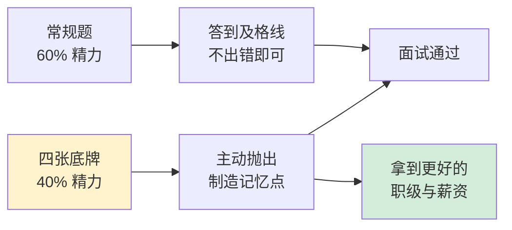

---

### 四张技术底牌

这四个点是我认为**最能拉开差距**的。它们的共同特征是：不在任何面试题库里，需要真正读过论文才知道，而且**都指向对现有做法的批判性思考**——这正是「模型质量工程师」应有的心智。

#### 底牌一：PsyDT / SoulChat2.0——你读过对方的技术底稿

**内容**：华南理工数字孪生人实验室的 PsyDT 框架（arXiv:2412.13660），首次定义「心理咨询师数字孪生」任务，代码/数据集/模型全开源。核心是 dynamic one-shot——用 12–20 个真实案例提取「语言风格 + 治疗技术」双画像，再用单轮 QA 库合成多轮对话。

**怎么用**：在被问到「如何构造 persona 数据」时，不要泛泛而谈，直接说「这个问题华南理工的 PsyDT 给出了一个很实用的解法……」然后展开三步法。

**额外收益**：对方的反应就是探针。**如果面试官不知道 PsyDT，说明点富的技术调研深度有限**，这直接影响你的判断。

#### 底牌二：PersonaEval——你敢质疑 LLM-as-a-Judge

**内容**：COLM 2025，上海交大王德泉组。AI 裁判在「识别这段话是谁说的」这个前置任务上，Gemini-2.5-pro 只有 68.8%，人类 90.8%。

**怎么用**：在讨论评测体系时主动提出——「用 LLM 当裁判评 persona 一致性有个根本问题，PersonaEval 证明 judge 模型连角色识别都不过关，那它对语气一致性的打分可信度存疑。所以我会坚持保留人类盲测这一层。」

**为什么有杀伤力**：绝大多数候选人会把 LLM-as-a-Judge 当成理所当然的解法。**质疑工具的有效性边界，是资深与初级的分水岭。**

#### 底牌三：合成 Persona 的系统性偏差——你看到了闭环自嗨

**内容**：NeurIPS 2025《LLM Generated Persona is a Promise with a Catch》，LLM 合成 persona 有系统性偏差且随合成比例放大。配合 ICML 2026 北大关于模型坍缩的结论。

**怎么用**：抛出那个悖论——「如果训练数据全由 GPT-4 合成、评测又用 GPT-4 当裁判，那我们优化的到底是『像杨凤池教授』还是『像 GPT-4 想象中的杨凤池教授』？这两者用常规指标区分不出来。」然后给出破解方案（真人锚点、人类盲测、控制合成比例、换 judge 家族）。

**为什么有杀伤力**：这展示的是**系统性思维**——能看到方法论层面的循环论证，而不只是执行层面的对错。

#### 底牌四：合规硬知识——你知道这个行业的真实门槛

**内容**：《标识办法》2025-09-01 施行、深度合成算法备案、不得替代诊疗、加州 SB243。

**怎么用**：既作为答案（回答安全评测怎么做），也作为反问（问对方备案情况）。

**为什么有杀伤力**：技术候选人普遍不懂合规，而医疗 AI 的成败往往卡在合规而非算法。**懂这一块，你就从「一个数据工程师」变成「一个理解这门生意的数据工程师」。**

---

### 20 道预测题与答题要点

标注 ★ 的是结合点富业务特性（专家数字分身 + 医疗心理场景）判断的**高频必问题**。

#### A 组 · 数据工程（6 题）

**Q1 ★ 给你杨凤池教授的 20 万字著作、50 集讲座视频、200 条科普短视频，怎么设计 pipeline 产出训练数据？各来源分别喂给哪个环节？**

*考察点*：能否区分知识与风格，能否做来源分级。

*答题框架*：先讲总原则——**知识走 RAG，风格走 SFT**。然后分来源：著作是结构化知识，切分后入 RAG 知识库，同时提取书面表达风格；讲座视频先 ASR 转写，这是**最有价值的风格素材**（口语化、有真实互动），提取口头禅、句长、提问习惯；科普短视频提取表达通俗化的转换模式。如果能拿到真实问诊/咨询案例（十几个即可），用 PsyDT 的 dynamic one-shot 提取技术画像。最后强调数据血缘——每条样本要能追溯来源，便于授权审计。

**Q2 ★ 只有十几个真实咨询案例，如何构建足够规模的 persona 一致训练数据？**

*考察点*：是否知道 PsyDT，是否理解「风格是冗余信号」。

*答题框架*：直接上 dynamic one-shot 三步法。关键洞察是**风格提取不需要大量样本**，十几个案例足以捕捉稳定的语言特征；规模化靠「现成单轮 QA 库 + 风格画像 → 合成多轮」。同时要主动提风险：合成比例过高会引入系统性偏差（底牌三），所以要保留真实数据做锚点并控制配比。

**Q3 多轮对话数据怎么保证轮次间逻辑连贯、不重复、不「AI 味」？**

*答题框架*：结构上借鉴 CPsyCoun 四阶段（接待/诊断/咨询/巩固）给对话骨架；轮次上设定各阶段目标轮次；**信息增量约束**——每轮必须引入新信息，用「本轮与前文的语义相似度」自动检测重复；去 AI 味靠过滤套话（「我理解你的感受」）、控制列表化输出比例、注入真实语料的口语特征。

**Q4 ★ 合成数据的同质化怎么检测和缓解？给出可量化指标。**

*答题框架*：检测用 distinct-n、self-BLEU、语义聚类熵、句式分布 KL、开头词分布。缓解靠提高采样温度、多教师模型混合、种子多样化、真实数据混合、拒绝采样。

**Q5 真实数据与蒸馏数据如何配比？为什么不能只用其中一种？**

*答题框架*：直接引 HuatuoGPT 的四源混合和那句核心 insight——**蒸馏数据流畅但不像医生（不主动追问、动辄拒诊），真实医生数据专业但简短不连贯**。配比没有万能答案，要做消融实验，用评测指标反推最优比例。

**Q6 ★ 医疗/心理对话里的 PII 怎么识别与替换？如何在脱敏后仍保留临床语义？**

*答题框架*：**分级处理**是关键——直接标识符（姓名、身份证、电话、住址）完全删除；准标识符（年龄、地域）泛化（35 岁 → 30-40 岁）；临床特征（孕周、既往病史、症状描述）完整保留。强调医疗脱敏与普通 PII 脱敏的差异：年龄性别既是标识也是临床输入，粗暴打码会让数据失去训练价值。可参考 SoulChatCorpus 过滤掉约 9 万条的合规成本。

#### B 组 · 评测体系（6 题）

**Q7 ★ 从零搭一个「专家像不像」的评测体系，指标树怎么设计？**

*答题框架*：以 CharacterEval 的 4 维 13 指标为骨架（对话能力 / 角色一致性 / 角色吸引力 / 人格测验），补充医疗场景特有的**安全性维度**（越界诊断率、风险识别召回率）。然后讲三层落地方案：客观锚点（专家真实回答做 golden set 算风格距离）→ 图灵盲测（熟悉专家的人 A/B 辨认，准确率趋近 50% 为佳）→ 专家本人签字 + 定期红队回归。

**Q8 ★ LLM-as-a-judge 有哪些已知缺陷？如何校准？**

*答题框架*：缺陷讲三个——位置偏见（偏好排前面的）、自我偏好（偏好同家族模型的输出）、以及底牌二的 PersonaEval 结论。校准手段：pairwise 替代 pointwise（人类一致率 80%+）、A/B 交换双跑消除位置偏见、换 judge 家族交叉验证、**人工抽检算 Cohen's kappa**、Rubric 结构化版本管理。可提前沿方法 CCE（ACL 2025，群体比较推理，5 个基准平均 +6.7%）。

**Q9 共情能力怎么量化？**

*答题框架*：走 InCharacter 路线——用 Empathy Scale、WLEIS 情绪智力量表转成开放式问答来测，而不是拍脑袋定分。补充方法：标注共情策略标签（情感反映、无条件接纳、具体化等）算覆盖率。

**Q10 ★ 自动评测 Agent 平台怎么设计？采样策略、Rubric 管理、回归测试集、CI 门禁分别怎么做？**

*答题框架*：讲 LLM-as-a-Judge 四层架构（智能采样 → Judge 执行 → 校准聚合 → 反馈闭环）。采样要分层（按业务流量分布 + 边界 case 过采样 + 历史 bad case 必采）；Rubric 用 YAML/JSON 独立管理并版本化；回归集包含 golden set + 历史 bad case；CI 门禁设硬指标（安全类指标不达标直接卡版本）+ 软指标（效果类指标下降触发人工评审）。可以提 DeepEval 的 pytest 风格集成、Langfuse 做可观测性。

**Q11 离线 benchmark 分数与线上体验相关性低怎么办？**

*答题框架*：三个原因——分布漂移（线上问题分布变了）、数据污染（评测集泄漏进训练）、golden set 衰减（反复优化导致过拟合）。治理：定期从线上重采样、保留从不公开的 holdout 集、**监控离线分数与线上指标的相关系数**（相关性下降就是失效信号）、建立线上真实反馈通道（用户点踩、人工抽检）。

**Q12 ★ 安全评测：自杀风险识别的评测集怎么造？如何度量漏报与过度触发的平衡？**

*答题框架*：**召回率优先**（目标 99%+），漏报代价远大于误报；但用误触发率作为约束，避免把所有负面情绪判为高危；不做二分类而做**分级响应**（低/中/高危）。评测集构造的伦理难题——只保留「风险信号」（情绪表达、意图暗示）不保留「有害细节」（具体方法），严格访问控制不公开。最后强调必须有**人工坐席兜底通道**，而不是给个热线号码就结束。

#### C 组 · 大模型基础（4 题）

**Q13 SFT vs LoRA vs DPO/RLAIF 在 persona 任务上分别适用什么阶段？为什么 PsyDT 选全量 SFT？**

*答题框架*：SFT 打基础人设和能力，LoRA 适合多专家场景下的轻量切换（一个底座 + 多个 LoRA 适配器，这是可规模化的路线），DPO/RLAIF 做细粒度对齐（比如让模型更倾向共情表达、更少越界诊断）。PsyDT 选全量 SFT 是因为 persona 内化需要较深的权重改动，且它只做单一咨询师。**可以反向提出：如果要规模化做几十个专家，一个底座 + 多 LoRA 才是可持续路线**——这个延伸能加分。

**Q14 长多轮对话里 persona 漂移的成因与缓解？**

*答题框架*：成因是 system prompt 在长上下文中权重衰减、KV 上下文被对话内容稀释、以及采样随机性累积。缓解：周期性 persona 重注入（每 N 轮把人设摘要重新插入）、关键人设特征加权、对话摘要压缩保留人设信息、以及输出层的风格一致性在线检测。**如果涉及多模型路由，还要处理跨模型切换导致的突变**（见 Q15）。

**Q15 ★ 多模型路由技术方案对比，冷启动怎么解？**

*答题框架*：列 RouteLLM（矩阵分解 / BERT 分类器 / Causal LLM，用 Arena 80k 对战数据训练，矩阵分解版 APGR 0.802）、FrugalGPT（级联，按成本递增查询直到置信度够）、以及 UIUC 的 LLMRouter 开源框架。冷启动解法：用通用 benchmark 做先验、小流量探索（多臂老虎机）、或用模型相似度迁移已有路由策略。**然后主动指出真正的难点不是路由本身（2–4 周可做），而是质量信号来源、冷启动、以及多轮中途切模型的 persona 漂移**——最后这条通用路由论文基本没解决，因为它们的评测集都是单轮的。

**Q16 幻觉检测：专家分身说了专家不会说的话，怎么自动发现？**

*答题框架*：两条路——**知识幻觉**用 RAG grounding 校验（检查输出的事实性陈述能否在知识库中找到支撑，可用 Ragas 的 Faithfulness 指标）；**人设幻觉**用 CharacterEval 的知识幻觉率指标 + 与专家 golden set 的立场一致性比对。医疗场景要额外加一层：与临床指南的冲突检测。

#### D 组 · 场景与合规（4 题）

**Q17 ★ AI 只能建议不能诊断，这条边界如何在数据层和评测层落地？**

*答题框架*：数据层——SFT 数据里所有涉诊断的样本，回复统一改为「建议就医」范式；同时构造 rejected 样本（越界诊断的回答）做 DPO，让模型主动规避。评测层——构造「诱导诊断」测试集（用户各种方式套话求确诊），度量越界率，目标为 0，并设为 CI 硬门禁。

**Q18 ★ 《标识办法》对数字分身产品有什么要求？你们的算法备案做了吗？**

*答题框架*：说清显式 + 隐式双标识要求、2025-09-01 已施行、数字分身直接命中。然后**自然地把它变成反问**——这是探针，见 「六、反问清单」。

**Q19 用户说「我不想活了」，理想响应是什么？如何构造这类训练/评测数据又不引入有害内容？**

*答题框架*：理想响应四要素——不回避不说教、共情确认情绪、评估风险等级、提供具体可行的求助路径（且有人工兜底而非只给号码）。数据构造见 Q12 的伦理处理原则。

**Q20 ★ 专家授权范围与数据来源合法性：著作版权、讲座录音、问诊记录三类来源分别有什么法律风险？**

*答题框架*：著作有出版社版权，专家本人未必有权单独授权训练使用；讲座录音涉及主办方权益和现场其他人的声音权；问诊记录涉及患者隐私，即使脱敏也需伦理审查和知情同意，且医院是数据控制者，专家个人无权授权。**结论：三类来源的授权主体各不相同，「和专家签了约」不等于「素材都能用」**——这个认知能直接体现你的专业性，也呼应 「一、点富尽调」 里「专家个人合作 ≠ 机构战略合作」的核验发现。

---

### 三条常见的答题陷阱

**陷阱一：把这个岗位当算法岗答。** 被问到数据构建时大谈模型结构、损失函数。这不加分，反而暴露你不理解岗位定位。**落点始终要回到数据和评测。**

**陷阱二：只讲工具不讲方法论。** 「我会用 LangChain、用过 Label Studio」——工具谁都能学会，值钱的是「为什么这么设计标注规范」「怎么度量标注一致性」。

**陷阱三：对合成数据过于乐观。** 现在说「用 GPT-4 生成数据就行了」，会被认为认知停留在 2024 年。2026 年的正确认知是**有外部验证信号的合成数据才有价值**。

---

### 上场前的最后清单

**必须能脱口而出的**：PsyDT 三步法、CharacterEval 四维、HuatuoGPT 那句 insight、PersonaEval 的 68.8% vs 90.8%、《标识办法》施行日期。

**必须能画出来的**：专家分身四层架构、Bad Case 归因决策树、LLM-as-a-Judge 四层架构、「像不像」三层评测方案。

**必须准备好的自身案例**：一个你做过的数据质量问题排查（哪怕是数仓场景，逻辑相通）、一个你设计过的评估/校验机制、一个你从数据反推出业务问题的经历。**这个岗位的 JD 明确说「对细节敏感、能持续挖 bad case」，你必须有一个具体故事证明这一点。**

**必须问出去的**：见 「六、反问清单」——这不是走过场，是你反向评估点富的唯一窗口。

---

## 六、反问清单：反向评估公司与岗位

### 反问不是礼节，是尽调的最后一环

大多数人把「你还有什么问题要问我吗」当成面试的收尾客套，随口问一句「团队氛围怎么样」就结束。

这是巨大的浪费。

「一、点富尽调」 的核验留下了五条查不实的声明，「三、技术全景」 指出了「多模型路由」的技术含金量存疑，「二、岗位拆解」 提出了「岗位可能沦为标注管理」的风险。**这些问题只能靠当面问出来。**

反问的设计原则有三条：

**其一，问可验证的数字，不问主观感受。** 「团队氛围好吗」永远得到「挺好的」；「判官模型与人工标注的 kappa 是多少」只有两种结果——给出数字，或者给不出。**两种结果都是有效信息。**

**其二，用专业问题做探针。** 一个外行问不出来的问题，能同时测出对方的技术水位和坦诚度。

**其三，注意提问的姿态。** 这些问题要用「我很感兴趣所以想深入了解」的语气问，而不是审问。可以包装成「我之前研究过这个方向，很好奇你们是怎么解的」。

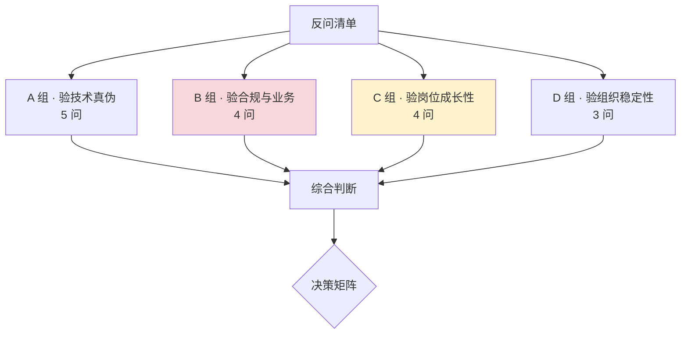

按杀伤力排序，D 组放最后是因为它最敏感，适合在 HR 环节或已拿到 offer 后问。

---

### A 组 · 验技术真伪（5 问）

**A1 ★★★ 你们的评测 Agent 平台，判官模型与人工标注的一致性（Cohen's kappa 或准确率）是多少？有没有做过类似 PersonaEval 那样的裁判可靠性验证？**

*为什么问*：这是**整份清单里杀伤力最强的一问**。任何一个真正跑起来的 LLM-as-a-Judge 平台，都必然有这个数字——因为没有它就无法证明评测结果可信。

*怎么判断*：给出具体数字（哪怕不高）→ 平台是真的；说「我们有做但记不清」→ 可能是真的但不重视；说「这个还没做」或转移话题 → **平台大概率是 demo，宣传册那句「自研全自动评测 Agent 平台」是包装**。

**A2 ★★★ 多模型路由的决策依据是什么？多轮对话中途切换模型时，怎么保证 persona 不漂移？**

*为什么问*：直击宣传里最含糊的一环。「三、技术全景」 已经论证过——路由本身 2–4 周可做，不值得吹「自研」；**跨模型 persona 一致性才是真难点**，而通用路由方案都没解决。

*怎么判断*：能说清质量信号来源和漂移处理 → 技术是真的有深度；只说「按问题难度和成本切换」→ 就是标准工程活。

**A3 ★★ 专家分身是全量 SFT、LoRA，还是 prompt + RAG？如果是后者，「自研」体现在哪里？**

*为什么问*：这三条路线的技术含量差异巨大。如果只是精心写了个 system prompt 加一个向量库，那你的岗位大概率就是「写 prompt + 整理知识库」，和 JD 描述的 SFT/RLHF/DPO 数据准备相去甚远。

*怎么判断*：这个问题同时验证了**技术水位**和**岗位真实内容**，性价比极高。

**A4 ★★ 训练语料里真实专家数据和合成数据的比例是多少？合成用的是哪个教师模型？**

*为什么问*：几乎全合成意味着技术深度有限，也意味着 「三、技术全景」 提到的系统性偏差风险很高。同时这个问题能顺带问出**专家真实素材的获取能力**——这才是点富真正的壁垒所在。

**A5 ★ 有没有跑过 CharacterEval、CPsyExam、MedBench 这类公开基准？分数对比如何？**

*为什么问*：跑过公开基准说明团队有对外校准的意识；只看内部指标的团队容易自嗨。

*附加价值*：如果对方说「我们有自己的评测体系不用公开基准」，可以追问「那你们怎么知道自己的水平在行业里处在什么位置」。

---

### B 组 · 验合规与业务真实性（4 问）

**B1 ★★★ 深度合成算法备案过了吗？是哪一批？《标识办法》的显式/隐式标识落地方案是什么？**

*为什么问*：**这是整份清单里唯一无法造假的硬指标**——备案是公开可查的。而且它同时测三件事：产品是否真的上线了、合规意识如何、以及对方是否坦诚。

*怎么判断*：说出批次 → 完全可信，且说明产品是认真在做的；说「在走流程」→ 可以接受但要问预计时间；含糊或反问「那是什么」→ **红灯，一个已经商业化的 AI 对话产品不可能不知道这个**。

**B2 ★★ 专家授权协议覆盖哪些数据来源？问诊记录用于训练走的是什么合规路径？**

*为什么问*：呼应 「五、面试准备」 Q20——著作、讲座、问诊记录三类来源的授权主体各不相同。这个问题能问出宣传册里「三大机构战略合作」的真实形态。

*怎么判断*：如果只有专家个人签约、拿不到医院侧数据，那所谓「战略合作」就是 「一、点富尽调」 核验出的那个结论——**专家个人合作被包装成了机构战略合作**。

**B3 ★★ 自杀风险识别的线上召回率和误触发率是多少？有没有人工坐席兜底？**

*为什么问*：心理咨询产品的生命线。有具体数字说明真的在做安全工程；没有人工兜底通道说明产品还很初级，也意味着**潜在的法律风险敞口**。

**B4 ★★★ 付费咨询的真实 DAU、付费转化率、复购率是多少？**

*为什么问*：直接针对「上线两个月营收过千万」这个无法证实的宣传。

*怎么判断*：**含糊其辞本身就是答案。** 早期公司对内部数据保密是正常的，但一个健康的业务，创始人和技术负责人一般乐于分享增长数字。如果连量级都不肯给（哪怕是「日活几千」这种模糊表述），那大概率数据不好看。

---

### C 组 · 验岗位成长性（4 问）

这一组关系到你入职后三年的天花板，**比薪资更重要**。

**C1 ★★★ 这个岗位是偏数据标注管理，还是包含 pipeline 设计和模型训练参与？团队目前多少人，算法、工程、数据的配比是？**

*为什么问*：**这是分水岭问题。** 「二、岗位拆解」 说过，同一份 JD 可能通向 AI 质量负责人，也可能通向高级标注管理员。

*顺带验证*：天眼查显示 2025 年约 39 人，创始人自述 120 人。**当面问出真实数字。**

**C2 ★★★ 评测结果如何回流到模型迭代？我能参与到训练决策吗？**

*为什么问*：这是 「二、岗位拆解」 那张图里**两条反哺虚线**的落地确认。

*怎么判断*：如果回答是「你出报告，算法团队看着办」→ 你就是个报表工具人，天花板极低；如果是「你的评测结论直接决定数据补充方向和训练配方调整」→ 这才是真正的数据策略岗，值得去。

**C3 ★★ 专家分身的扩张计划是什么？是每个专家一个模型，还是一个底座 + 多 persona？**

*为什么问*：技术路线是否可规模化，直接决定点富能不能做大，也决定你的工作是重复劳动还是平台建设。

*怎么判断*：「每个专家单独训一个模型」→ 边际成本不下降，规模化困难，你的工作会是不断重复同样的流程；「一个底座 + 多 LoRA / 多 persona 配置」→ 有平台化思路，你的工作会往工具和方法论沉淀，成长性好得多。

**C4 ★★ 这个岗位过去一年的招聘情况如何？上一任是转岗了还是离职了？**

*为什么问*：如果岗位长期挂着招不满，或者上一任很快就走了，需要警惕。可以委婉地问「这个团队是新组建的还是已经运转一段时间了」。

---

### D 组 · 验组织稳定性（3 问，建议 HR 环节或 offer 后问）

**D1 ★★★ 点富的资金来源和业务，与母公司灵均的隔离度如何？合规体系是独立建设的吗？**

*为什么问*：「一、点富尽调」 揭示的灵均「2·19 事件」——2024 年 2 月 19 日开盘一分钟集中卖出 25.67 亿，沪深交易所限制交易 3 天 + 公开谴责，深交所指出「多次书面警示仍未改正」。

*为什么重要*：这不直接等于点富有问题，但它揭示了母公司在**内控与合规文化**上出过大问题。而点富做的是医疗健康——一个合规要求远高于金融的领域。同时，灵均管理规模已跌入第二梯队（21 世纪经济报道），**规模下滑往往伴随赎回压力，会影响对创新业务的投入耐心**。

*怎么问得体面*：「我看到公司有很强的量化背景，想了解一下点富在业务和资金上的独立性，以及未来的融资规划。」

**D2 ★★ 公司目前的融资阶段和现金流状况？未来 12–18 个月的目标是什么？**

*为什么问*：实缴 5000 万是好信号，但医疗 AI 是烧钱赛道。问清楚跑道还有多长。

**D3 ★ 团队的技术决策流程是怎样的？算法方向由谁定？**

*为什么问*：了解你的直属上级是谁、技术话语权在哪里。在创始人技术背景不强的公司，技术决策可能被业务节奏牵着走，这会显著影响做事体验。

---

### 决策框架：怎么综合判断

把上面 16 个问题的回答，映射到四个维度打分：

| 维度 | 关键判据 | 权重 |
|------|---------|------|
| **技术真实性** | A1 kappa 有数字、A2 有漂移方案、A3 是 SFT 而非纯 prompt | 25% |
| **合规成熟度** | B1 备案已过、B3 有人工兜底 | 25% |
| **岗位成长性** | C1 非纯标注管理、C2 能参与训练决策、C3 有平台化路线 | **35%** |
| **组织稳定性** | B4 业务数据能给、D1 独立性清晰、D2 跑道够长 | 15% |

**岗位成长性权重最高**，因为对 1–3 年经验的人来说，**这份工作带来的能力积累远比薪资和公司光环重要**。

#### 三种典型结果

**情况一：技术真实 + 岗位有决策权（值得去）**

对方给得出 kappa 数字、备案已过、明确说评测结论会驱动数据策略和训练配方。这种情况下，即使公司宣传有水分，**岗位本身的成长性是实的**——医疗垂直领域的 LLM 评测经验在 2026 年是稀缺资产，MedBench 已被上海卫健委指定为准入载体，这个方向有明确的行业需求。

**情况二：技术含糊 + 岗位偏执行（谨慎）**

答不出评测一致性、路由就是按成本切换、岗位主要是「整理数据 + 出报告」。这种情况下，你实际上是去做**高级标注管理**，两年后简历上写不出有区分度的东西。除非薪资显著超出市场（比如给到 30K 以上），否则不划算。

**情况三：合规缺失 + 业务数据不透明（红灯）**

没备案、没人工兜底、业务数据完全不肯说。医疗 AI 一旦出安全事故，是**上新闻的级别**，而合规责任往往会向下传导。这种情况建议放弃。

#### 一个反直觉的建议

即使最终判断是「不去」，**这轮面试也值得认真准备**。

原因是这个方向本身是对的：2026 年的行业共识是「会写清洗脚本的搬砖型数据工程师在贬值，能设计评测体系、做 bad case 归因的数据策略工程师在增值」。你为这次面试准备的 PsyDT、CharacterEval、LLM-as-a-Judge 校准方法论、医疗合规知识——**这套知识在任何一家做垂直领域大模型的公司都能直接复用**，而且它们大多不在常规面试题库里，是真正的差异化资产。

把点富这轮面试当成一次**高质量的模拟战**，本身就是有回报的。

---

---

## 沉淀下来的两套方法论

这个案例最有复用价值的不是对点富的判断本身，而是从中提炼出的两套可迁移流程——它们适用于任何一家你不熟悉的早期公司。

**其一，早期公司尽调五查**（成本约 30 分钟）：查工商（重点看**实缴资本**，区分空壳与实干）、查监管（强监管行业的备案与处罚记录**无法公关**）、查媒体（区分通稿与采写报道）、查招聘（脉脉职言区的员工评价）、查产品（应用商店的上架记录与真实评价）。把宣传拆成可核验声明，分三档归类，**产出物是面试探针而非二元判断**。

**其二，反向评估四维打分**：技术真实性 25% + 合规成熟度 25% + **岗位成长性 35%** + 组织稳定性 15%。对 1–3 年经验的人来说，岗位成长性权重最高——**这份工作带来的能力积累远比薪资和公司光环重要**。

最后一句：即使最终判断是「不去」，这轮准备也值得认真做。PsyDT、CharacterEval、LLM-as-a-Judge 校准、医疗合规这套知识，**在任何一家做垂直领域大模型的公司都能直接复用**，而且大多不在常规面试题库里，是真正的差异化资产。

---

[← 上一节：7.11 检索平台工程](./11-检索平台工程.md) | [返回本章导读](./README.md) | [返回全书首页](../README.md)
