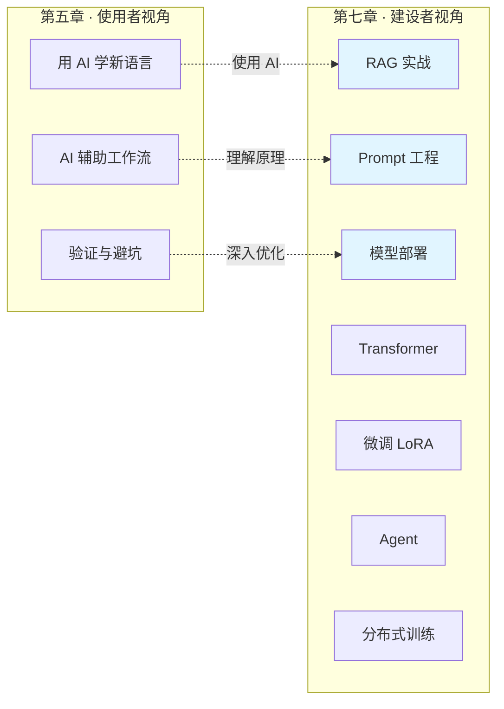

# 第七章 · AI 工程基础——理解大模型才能用好大模型

> **读者画像**：你是一个 Java 后端 / 数据研发工程师，已经在用 ChatGPT、Copilot 等 AI 工具辅助开发（[第五章](../part5-ai-coding-method/README.md)讲的就是这套方法论）。但你逐渐发现：只会"调 API"不够了——你需要理解 RAG 架构来搭建企业知识库，需要理解 Prompt 工程来让模型稳定输出 JSON，需要理解模型部署来做推理服务的性能调优。这一章帮你建立 AI 工程的核心认知。

---

## 本章定位

[第五章](../part5-ai-coding-method/README.md)教你**如何用 AI 工具**（使用者视角），这一章教你**AI 工具背后的工程原理**（建设者视角）。两者的关系就像：第五章是"学会开车"，这一章是"理解发动机"——你不需要造发动机，但理解它才能在车出问题时知道怎么修。

对于 Java 后端工程师来说，这一章的每个主题都有你熟悉的类比：

- RAG ≈ 带缓存的微服务调用（先查本地知识库，再调 LLM）
- Prompt Engineering ≈ 定义 API 的请求参数和接口契约
- 模型部署 ≈ Tomcat 调优 + JVM 内存管理
- Transformer ≈ 一种特殊的"数据处理流水线"
- LoRA 微调 ≈ 给大模型打补丁（不改原始代码，只加增量）
- Agent ≈ 微服务编排（LLM 当控制器，调用各种外部工具）
- 分布式训练 ≈ 分库分表 + MapReduce

---

## 各节导读

**[7.1 RAG 实战](./01-RAG实战.md)** —— 检索增强生成。LLM 的三大局限（知识截止/幻觉/无法访问私有数据）→ RAG 核心流程（文档分块→Embedding→向量检索→上下文注入→LLM 生成）→ 分块策略（固定/递归/语义/结构）→ Embedding 与向量数据库（Milvus/FAISS/Chroma）→ 检索优化（HyDE/多路召回/重排序）→ 企业级 RAG 架构。*面试重点：检索效果优化、RAG vs 微调选择、向量库 vs ES。*

**[7.2 Prompt Engineering](./02-Prompt-Engineering.md)** —— 让大模型听懂你的话。Prompt 的本质（≈ API 请求参数）→ 基础技巧（角色设定/Few-shot/Temperature）→ 高级推理策略（CoT 思维链/ToT 思维树/Self-Consistency/ReAct）→ 结构化输出（JSON Mode/Function Calling）→ 工程化实践（模板管理/版本控制/自动化测试）。*面试重点：CoT 原理、Function Calling 机制、JSON 输出保障。*

**[7.3 模型部署基础](./03-模型部署基础.md)** —— 从训练到上线。LLM 推理两阶段（Prefill 预填充 + Decode 解码）→ KV Cache（≈ Redis 缓存 Attention 结果）→ 推理优化（FlashAttention/MQA→GQA/投机采样/连续批处理）→ 量化（FP32→INT8→INT4，≈ JPEG 有损压缩）→ 推理框架对比（vLLM/TensorRT-LLM/Ollama/llama.cpp）→ 性能指标与容量规划。*面试重点：Prefill vs Decode、KV Cache 原理、量化精度损失、vLLM PagedAttention。*

**[7.4 Transformer 核心](./04-Transformer核心.md)** —— 大模型的心脏。Self-Attention 机制（Query/Key/Value ≈ SQL 的 WHERE/索引/数据）→ Multi-Head Attention → MHA→MQA→GQA 演进 → 位置编码（绝对/相对/RoPE）→ FFN 前馈网络 → 完整 Transformer 架构拆解。*面试重点：Attention 计算过程、为什么需要多头、位置编码的作用。*

**[7.5 微调入门](./05-微调入门.md)** —— 让大模型学会你的业务。全量微调 vs 参数高效微调（PEFT）→ LoRA 原理（低秩分解 ≈ 给模型打补丁）→ QLoRA（4-bit 量化 + LoRA）→ 微调数据准备 → 微调框架（PEFT/LLaMA-Factory）→ 微调 vs RAG vs Prompt 的选型决策。*面试重点：LoRA 原理、QLoRA 为什么能单卡微调 65B 模型、微调选型。*

**[7.6 Agent 基础](./06-Agent基础.md)** —— 让大模型使用工具。Agent 的核心能力（感知/推理/行动/记忆）→ Function Calling 机制 → MCP 协议（Model Context Protocol）→ Agent 设计模式（ReAct/Planning/Multi-Agent）→ 常用框架（LangChain/LlamaIndex）→ NL2SQL 实战案例。*面试重点：Agent vs RAG 区别、Function Calling 原理、Multi-Agent 编排。*

**[7.7 分布式训练](./07-分布式训练.md)** —— 万卡集群怎么训模型。为什么需要分布式（单卡装不下）→ 数据并行（≈ MapReduce 分片计算）→ 流水线并行（≈ 工厂流水线）→ 张量并行（≈ 矩阵分块运算）→ 混合并行（3D 并行）→ 训练框架对比（DeepSpeed/Megatron-LM/FSDP）。*面试重点：三种并行策略对比、ZeRO 优化、通信瓶颈。*

**[7.8 AgentBI 智能分析](./08-AgentBI智能分析.md)** —— 自然语言驱动的智能分析平台。AgentBI 架构全景（交互层/Agent 编排层/能力层/语义层/执行层）、核心处理流程（意图识别→语义解析→SQL 生成→查询执行→图表推荐→多步分析）、查询编排引擎设计、归因分析框架（维度下钻/贡献度计算）、报告自动生成、多轮对话状态管理、可解释性与可追溯性设计、与语义层和数据平台的打通。*面试重点：AgentBI vs NL2SQL 区别、SQL 正确性保障、多步分析编排、权限处理、技术架构设计。*

---

## 阅读建议

- 如果你主要做 AI 应用开发（调用 LLM API），**7.1 + 7.2 + 7.6** 是核心
- 如果你负责模型推理服务的部署和运维，**7.3** 是重中之重
- 如果面试大模型相关岗位，**7.4 + 7.5** 的面试剖析部分是高频考点
- 如果你参与模型训练基础设施建设，**7.7** 是必读
- 每一节都可以独立阅读，但建议至少先读 7.1 和 7.2 建立基本认知
- 关于大模型预训练数据处理，详见 [6.8 大模型数据工程](../part6-bigdata/08-大模型数据工程.md)

---

[← 返回全书首页](../README.md) | [上一章：第六章 大数据基础](../part6-bigdata/README.md) | [开始：7.1 RAG 实战 →](./01-RAG实战.md)
