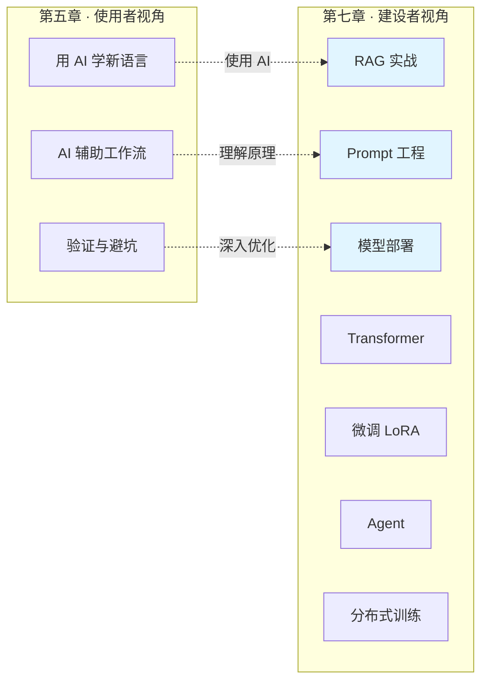

# 第七章 · AI 工程基础——理解大模型才能用好大模型

> **读者画像**：你是一个 Java 后端 / 数据研发工程师，已经在用 ChatGPT、Copilot 等 AI 工具辅助开发（[第五章](../part5-ai-coding-method/README.md)讲的就是这套方法论）。但你逐渐发现：只会"调 API"不够了——你需要理解 RAG 架构来搭建企业知识库，需要理解 Prompt 工程来让模型稳定输出 JSON，需要理解模型部署来做推理服务的性能调优。这一章帮你建立 AI 工程的核心认知。

---

## 本章定位

[第五章](../part5-ai-coding-method/README.md)教你**如何用 AI 工具**（使用者视角），这一章教你**AI 工具背后的工程原理**（建设者视角）。两者的关系就像：第五章是"学会开车"，这一章是"理解发动机"——你不需要造发动机，但理解它才能在车出问题时知道怎么修。

对于 Java 后端工程师来说，这一章的每个主题都有你熟悉的类比：

- RAG ≈ 带缓存的微服务调用（先查本地知识库，再调 LLM）
- Prompt Engineering ≈ 定义 API 的请求参数和接口契约
- 模型部署 ≈ Tomcat 调优 + JVM 内存管理
- Transformer ≈ 一种特殊的"数据处理流水线"
- LoRA 微调 ≈ 给大模型打补丁（不改原始代码，只加增量）
- Agent ≈ 微服务编排（LLM 当控制器，调用各种外部工具）
- 分布式训练 ≈ 分库分表 + MapReduce

```mermaid
graph LR
    subgraph "第五章 · 使用者视角"
        A["用 AI 学新语言"]
        B["AI 辅助工作流"]
        C["验证与避坑"]
    end
    subgraph "第七章 · 建设者视角"
        D["RAG 实战"]
        E["Prompt 工程"]
        F["模型部署"]
        G["Transformer"]
        H["微调 LoRA"]
        I["Agent"]
        J["分布式训练"]
    end
    A -.使用 AI.-> D
    B -.理解原理.-> E
    C -.深入优化.-> F

    style D fill:#e1f5ff
    style E fill:#e1f5ff
    style F fill:#e1f5ff
```

---

## 各节导读

**[7.1 RAG 实战](./01-RAG实战.md)** —— 检索增强生成。LLM 的三大局限（知识截止/幻觉/无法访问私有数据）→ RAG 核心流程（文档分块→Embedding→向量检索→上下文注入→LLM 生成）→ 分块策略（固定/递归/语义/结构）→ Embedding 与向量数据库（Milvus/FAISS/Chroma）→ 检索优化（HyDE/多路召回/重排序）→ 企业级 RAG 架构。*面试重点：检索效果优化、RAG vs 微调选择、向量库 vs ES。*

**[7.2 Prompt Engineering](./02-Prompt-Engineering.md)** —— 让大模型听懂你的话。Prompt 的本质（≈ API 请求参数）→ 基础技巧（角色设定/Few-shot/Temperature）→ 高级推理策略（CoT 思维链/ToT 思维树/Self-Consistency/ReAct）→ 结构化输出（JSON Mode/Function Calling）→ 工程化实践（模板管理/版本控制/自动化测试）。*面试重点：CoT 原理、Function Calling 机制、JSON 输出保障。*

**[7.3 模型部署基础](./03-模型部署基础.md)** —— 从训练到上线。LLM 推理两阶段（Prefill 预填充 + Decode 解码）→ KV Cache（≈ Redis 缓存 Attention 结果）→ 推理优化（FlashAttention/MQA→GQA/投机采样/连续批处理）→ 量化（FP32→INT8→INT4，≈ JPEG 有损压缩）→ 推理框架对比（vLLM/TensorRT-LLM/Ollama/llama.cpp）→ 性能指标与容量规划。*面试重点：Prefill vs Decode、KV Cache 原理、量化精度损失、vLLM PagedAttention。*

**[7.4 Transformer 核心](./04-Transformer核心.md)** —— 大模型的心脏。Self-Attention 机制（Query/Key/Value ≈ SQL 的 WHERE/索引/数据）→ Multi-Head Attention → MHA→MQA→GQA 演进 → 位置编码（绝对/相对/RoPE）→ FFN 前馈网络 → 完整 Transformer 架构拆解。*面试重点：Attention 计算过程、为什么需要多头、位置编码的作用。*

**[7.5 微调入门](./05-微调入门.md)** —— 让大模型学会你的业务。全量微调 vs 参数高效微调（PEFT）→ LoRA 原理（低秩分解 ≈ 给模型打补丁）→ QLoRA（4-bit 量化 + LoRA）→ 微调数据准备 → 微调框架（PEFT/LLaMA-Factory）→ 微调 vs RAG vs Prompt 的选型决策。*面试重点：LoRA 原理、QLoRA 为什么能单卡微调 65B 模型、微调选型。*

**[7.6 Agent 基础](./06-Agent基础.md)** —— 让大模型使用工具。Agent 的核心能力（感知/推理/行动/记忆）→ Function Calling 机制 → MCP 协议（Model Context Protocol）→ Agent 设计模式（ReAct/Planning/Multi-Agent）→ 常用框架（LangChain/LlamaIndex）→ NL2SQL 实战案例。*面试重点：Agent vs RAG 区别、Function Calling 原理、Multi-Agent 编排。*

**[7.7 分布式训练](./07-分布式训练.md)** —— 万卡集群怎么训模型。为什么需要分布式（单卡装不下）→ 数据并行（≈ MapReduce 分片计算）→ 流水线并行（≈ 工厂流水线）→ 张量并行（≈ 矩阵分块运算）→ 混合并行（3D 并行）→ 训练框架对比（DeepSpeed/Megatron-LM/FSDP）。*面试重点：三种并行策略对比、ZeRO 优化、通信瓶颈。*

**[7.8 AgentBI 智能分析](./08-AgentBI智能分析.md)** —— 自然语言驱动的智能分析平台。AgentBI 架构全景（交互层/Agent 编排层/能力层/语义层/执行层）、核心处理流程（意图识别→语义解析→SQL 生成→查询执行→图表推荐→多步分析）、查询编排引擎设计、归因分析框架（维度下钻/贡献度计算）、报告自动生成、多轮对话状态管理、可解释性与可追溯性设计、与语义层和数据平台的打通。*面试重点：AgentBI vs NL2SQL 区别、SQL 正确性保障、多步分析编排、权限处理、技术架构设计。*

**[7.9 AI 安全与可信](./09-AI安全与可信.md)** —— AI 系统特有的攻击面与纵深防御。为什么 Prompt 注入无法像 SQL 注入那样被参数化查询根治 → 直接注入 vs 间接注入（RAG 场景最危险的攻击）→ 五层纵深防御（输入检测/提示词硬化/nonce 上下文隔离/输出校验/工具分级授权）→ 数据投毒检测（知识库投毒、隐藏内容与零宽字符、Embedding 空间异常检测、召回行为监控）→ PII 三道脱敏关卡与可逆脱敏 → 多租户 RAG 的三条泄露通道与强制过滤 → 企业级 AI 安全架构与审计日志设计。*面试重点：Prompt 注入 vs SQL 注入本质区别、间接注入防御、LLM 脱敏 vs 数仓脱敏、跨租户泄露防护、投毒检测方法。*

**[7.10 GraphRAG 与知识图谱增强](./10-GraphRAG与知识图谱.md)** —— 当向量检索回答不了全局性问题。向量 RAG 的三个结构性盲区（全局问题/多跳推理/关系型问题）与分块对结构的破坏 → 局部问题 vs 全局问题 → GraphRAG 完整架构（LLM 驱动的实体关系抽取、Gleaning 补抽、分层实体消歧、Leiden 社区发现、自底向上社区摘要）→ 三种检索模式（Local Search 实体锚定与超级节点问题、Global Search 的 Map-Reduce、DRIFT Search）与查询路由 → 图存储选型（Neo4j vs NebulaGraph vs 混合存储）→ LLM-Wiki 与 Agent 工具关系图谱 → 渐进式落地路径与增量更新难题。*面试重点：GraphRAG 解决什么问题、索引成本瓶颈、Local vs Global Search、图库选型、增量更新方案、图谱质量评估。*

**[7.11 检索平台工程](./11-检索平台工程.md)** —— 从 RAG 原型到高可用生产底座。支撑 100-300 QPS、99.9% SLA、百亿级文档秒级入库的工程体系 → Embedding 管道（Flink Async I/O 的 unorderedWait、三级容灾与死信队列、攒批调用与成本优化、存储膨胀治理）→ 四层缓存与**语义缓存**（相似度阈值、租户隔离风险）→ 容量规划（ES 分片与向量库内存推算、SLA 分解与 LLM 短板）→ **向量库架构与运维**（Milvus 存算分离、Growing/Sealed Segment、一致性级别、与 ES 的运维对照）→ 故障模式与四级降级梯度、`efSearch` 动态降档。*面试重点：Flink 调 Embedding 服务与容灾、检索服务容量规划、语义缓存设计、向量库存算分离、降级链路。*

**[7.12 案例研究：点富科技「大模型数据工程与评测岗」深度分析](./12-案例-点富科技大模型数据评测岗.md)** —— 前面十一节讲「AI 工程怎么做」，这一节讲「拿这些能力去面一家具体公司会遇到什么」。**北京点富科技**（量化私募灵均投资创始人蔡枚杰创办，产品是把杨凤池、马良坤、付国兵等名医名家数字化成「专家智能真身」的付费咨询 AI）在招大模型数据+评测岗，围绕这家公司完成六件事：**公司尽调**（12 条宣传声明逐条核验，7 证实/3 不符/5 存疑/1 隐瞒，沉淀「早期公司尽调五查」方法论）→ **JD 逐条映射**知识体系（覆盖度 62%，缺口全在评测科学）→ **专家数字分身技术全景**（四层架构、PsyDT dynamic one-shot、多模型路由含金量评估）→ **领域知识**（中文心理/医疗数据集谱系、CharacterEval 13 指标、LLM-as-a-Judge 校准、医疗合规四条硬线）→ **25 道面试预测题与四张技术底牌** → **20 个反问 + 四维决策矩阵** → **数据体系 0→1 建设规划**（数据负责人视角：六层架构蓝图、三期路线图、三人团队选型与成本测算、北极星指标与 ROI 证明、团队搭建与跨部门边界、风险清单）→ **赛道标尺与研发模式**（国内外标杆公司规模对照；业界已收敛的答案是"SOTA 模型 + 知识接入 + 编排"而非自训——Abridge 估值 53 亿仍用 OpenAI API、Character.AI 自研失败转投 Llama，唯一例外 Hippocratic 的四个边界条件；微调成本从 2023 年 8-12 万降至 2026 年千元级；Babylon/Watson Health 失败案例的真因是商业模式而非技术）→ **产品视角诊断**（用 Lancet 数据证明「三甲名医分身」瞄准的是金字塔尖——抑郁障碍治疗率仅 9.5%、92% 患者不就诊；但「下沉做陪伴」已被 2026 年 7 月生效的 21 号令堵死，禁止诱导情感依赖变现；结论是换付费方而非扩人群，并反推 B 端定位下数据闭环的重构）→ **监管边界专题**（回原文逐条读 21 号令：它不禁止情感陪伴，禁的是「靠制造依赖变现」；律师实务的三维认定标准；改称「知识问答」为何钻不了空子；国内合规两条正面路径（健成星云备案 / 望里三类证）与三层资质清单；中美欧英监管切入点对比——美国管执业资格、欧盟管医疗宣称与情绪识别、中国管服务行为，而全球唯一跑通的样板是英国 Limbic Access；并用真实运营案例实证「工具型心理分析」中美欧英四地均放行——国内壹心理 Alice-AI/暂停实验室正常运营、21 号令后下线的全是情感陪伴类，国外 FDA General Wellness Policy 明确不涉诊疗的软件不算医疗器械）→ **实证核查**（拿判定框架核查点富现有产品：三要件全部命中——第一人称「我是付国兵」、长期记忆机制、应用商店文案「倾诉的树洞」「一直陪着你」；且企业自己已按落入监管整改，用户协议与 21 号令同日生效、新增强制年龄与紧急联系人；同时存在官网「专业咨询」与应用商店「情感陪伴」的口径分裂）→ **竞品全景**（中外 30+ 家分层深度对比：赛道已裂为医疗器械/平台增效/情绪消费三条不可比路径；国内能拿出可验证技术证据的仅健成星云（AAAI-2026 论文）、望里（三类证+11 家医院 RCT）、正岸（反大模型的确定性架构）三家；Slingshot「自训基础模型」实为 Qwen3 继续预训练；BetterHelp 纯 C 端 -9% 而 Talkspace 接保险 +22%；⚠️ SoulChat2.0 开源使「专家分身」技术护城河消解，真壁垒在真实数据获取路径、监管资质与支付方接入——Pear 拿到 FDA 授权仍因无报销代码破产）→ **技术路线终局判断**（两篇 2026 顶刊给出看似矛盾实则互补的结论：PsychiatryBench 显示 GPT-5/Gemini 在诊断推理上已超垂类模型，而上海交大 PsychFound 仅 7B 却在临床工作流任务上于 22 个模型中排名第一、超过 GPT-5——结论是分层而非替代：知识层用 SOTA API，工作流层做轻量微调；长上下文因 Context Rot 与行为倾向因子不能取代微调）→ **市场真实性验证**（严格区分预测与已实现收入：「千亿心理健康市场」含药品与医院诊疗，同源机构拆出的中国 AI 心理细分仅 9 亿人民币、相差百倍；剔除人工咨询平台后全球纯 AI 心理已实现收入合计不足 1 亿美元；Slingshot 融资 1.23 亿而 ARR 仅 400 万；结论是需求真实但市场的钱主要停留在融资与预测里——这一结论反过来强化了「换付费方」与「一期投入压到最小」两条建议）→ **突破点分析**（在通用大模型免费提供心理答疑的前提下还剩什么空间：斯坦福 FAccT 2025 证明 RLHF 谄媚倾向与治疗必要性在数学上矛盾、更大模型并未更好，OpenAI 自认安全训练在长对话中漂移——失败是结构性而非能力性；大厂只做补救式合规不做临床能力建设，21 号令更把拟人化市场让渡给专业玩家；四条已验证插入点：B 端治疗师辅助（Eleos 6000 万美元 C 轮）、结构化分诊（Limbic 有 Nature Medicine 12.9 万人研究，国内空白）、专科数字疗法、长期追踪；伪机会是独立 AI 诊断（Kintsugi 花 1600 万美元审批仍于 2026 倒闭）——建议把「诊断」降维为「筛查/分诊」，监管成本差一个数量级）→ **数据建设独特性**（数据岗最该精读的一节：这个领域是三套体系的叠加区——医疗标准驱动建模（FHIR 资源模型/OMOP CDM/WS 363-445 系列/LOINC 编码，如 PHQ-9 = LOINC 44261-6），核心实体是数十年尺度的临床纵向轨迹而非行为事件流（含心理测量学独有的「常模表」设计），LLM 资产带来 Trace 执行树与数据-模型血缘（为何 Trace 用 ClickHouse：Anthropic PB 级日志实践 + ClickHouse 2026 收购 Langfuse），合规是架构第一公民（分级分类/去标识化/FHIR Consent 动态同意/审计留存≥6个月/病历留存15-30年/联邦学习是跨机构准入条件）；并给出 DWD 分三条线（临床域·LLM 域·业务域）的落地分层设计）。*适用人群：面试点富或同类大模型数据/评测岗、需要评估任何一家早期 AI 创业公司、或要为小公司做数据体系 0→1 规划。*

---

## 阅读建议

- 如果你主要做 AI 应用开发（调用 LLM API），**7.1 + 7.2 + 7.6** 是核心
- 如果你负责模型推理服务的部署和运维，**7.3** 是重中之重
- 如果面试大模型相关岗位，**7.4 + 7.5** 的面试剖析部分是高频考点
- 如果你参与模型训练基础设施建设，**7.7** 是必读
- 如果你负责 AI 平台的安全合规，**7.9** 是核心；它和 [6.17 多租户与权限体系](../part6-bigdata/17-多租户与权限体系.md) 构成数据侧与 AI 侧的完整安全视图
- 如果你的 RAG 系统遇到「全局性问题回答不完整」的瓶颈，读 **7.10**；但请先确认 7.1 里的混合检索和 Reranking 已经做到位
- 每一节都可以独立阅读，但建议至少先读 7.1 和 7.2 建立基本认知
- 如果你做的是对内支撑/对外售卖的 RAG 平台底座（AI Infra / LLMOps 方向），**7.11** 是核心；它需要 [A5 ElasticSearch](../part3-java-deep/A5-ElasticSearch.md) 和 [6.5 Flink](../part6-bigdata/05-Flink.md) 作为前置
- **7.1 → 7.9 → 7.10 → 7.11** 构成 RAG 的完整进阶路径：基础架构 → 安全加固 → 图谱增强 → 平台工程化
- 如果你正在面试点富科技（或同类做垂直领域大模型的公司）的数据/评测岗位，直接读 **7.12**；它是针对这家公司的完整尽调与面试准备，其中的方法论也可当作「如何对早期创业公司做尽调」的通用模板
- 关于大模型预训练数据处理，详见 [6.8 大模型数据工程](../part6-bigdata/08-大模型数据工程.md)

---

[← 返回全书首页](../README.md) | [上一章：第六章 大数据基础](../part6-bigdata/README.md) | [开始：7.1 RAG 实战 →](./01-RAG实战.md)
